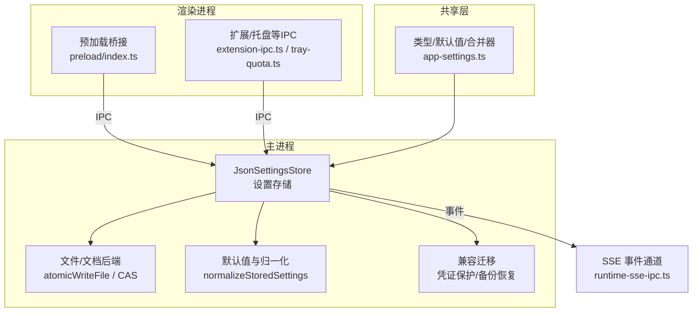
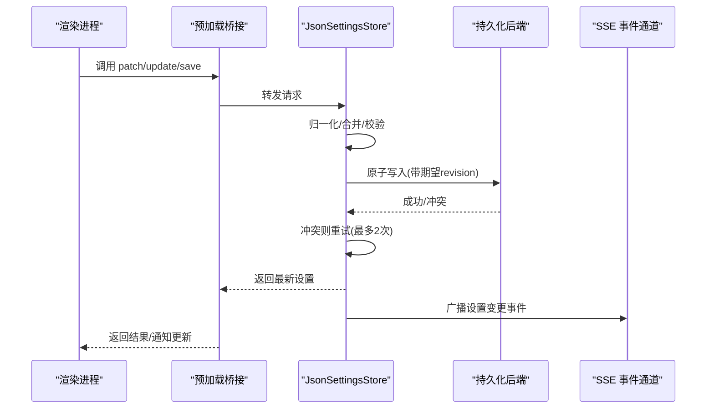
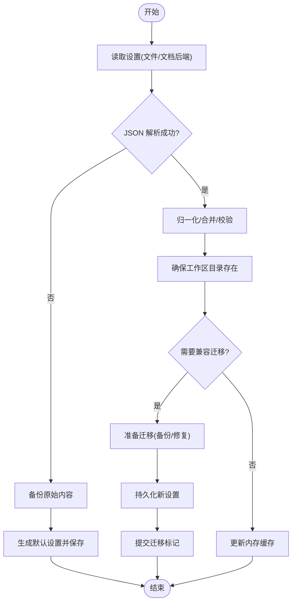
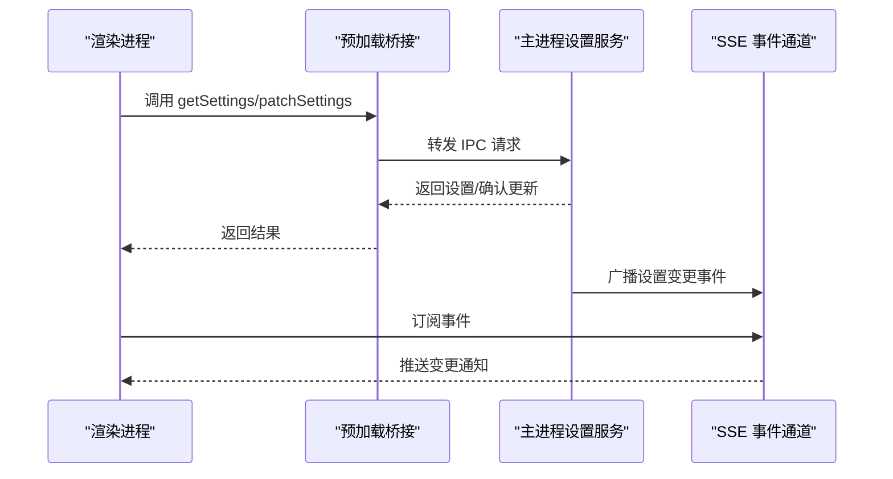
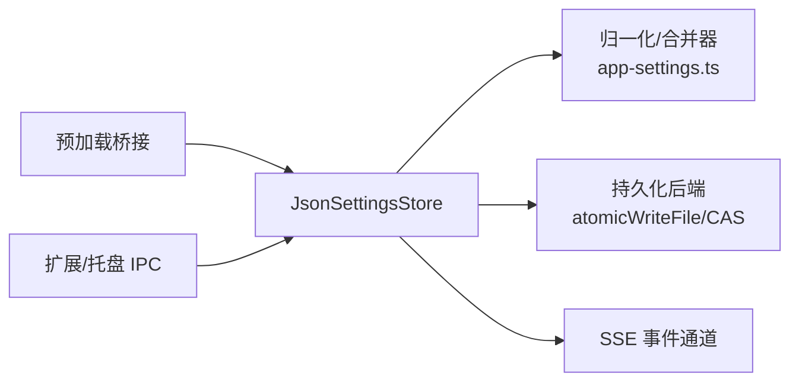

# 状态管理

<cite>
**本文引用的文件**
- [settings-store.ts](file://src/main/settings-store.ts)
- [app-settings.ts](file://src/shared/app-settings.ts)
- [settings-file-paths.ts](file://src/main/settings-file-paths.ts)
- [gui-settings-bridge.ts](file://kun/src/cli/gui-settings-bridge.ts)
- [runtime-sse-ipc.ts](file://src/main/runtime-sse-ipc.ts)
- [extension-ipc.ts](file://src/shared/extension-ipc.ts)
- [index.ts](file://src/preload/index.ts)
- [tray-quota.ts](file://src/preload/tray-quota.ts)
</cite>

## 目录
1. [简介](#简介)
2. [项目结构](#项目结构)
3. [核心组件](#核心组件)
4. [架构总览](#架构总览)
5. [详细组件分析](#详细组件分析)
6. [依赖关系分析](#依赖关系分析)
7. [性能考量](#性能考量)
8. [故障排查指南](#故障排查指南)
9. [结论](#结论)
10. [附录](#附录)

## 简介
本文件面向 DeepSeek-GUI 的状态管理系统，聚焦于应用设置（App Settings）的持久化、校验与同步机制。系统采用“主进程集中存储 + 渲染进程通过 IPC 访问”的分层架构：主进程提供原子写入、版本冲突重试、兼容迁移与默认值归一化；渲染进程通过预加载脚本暴露安全 API，供前端调用。文档涵盖 store 设计、状态持久化、IPC 同步、异步处理、调试工具与最佳实践。

## 项目结构
DeepSeek-GUI 的设置相关代码主要分布在以下位置：
- 主进程设置存储与持久化：src/main/settings-store.ts
- 共享类型、默认值与合并/归一化逻辑：src/shared/app-settings.ts（聚合导出）
- 设置文件路径策略：src/main/settings-file-paths.ts
- 渲染进程到主进程的桥接与 IPC：kun/src/cli/gui-settings-bridge.ts、src/shared/extension-ipc.ts、src/preload/index.ts、src/preload/tray-quota.ts
- 运行时 SSE/事件通道（用于跨进程状态广播）：src/main/runtime-sse-ipc.ts

图表来源
- [settings-store.ts:470-782](file://src/main/settings-store.ts#L470-L782)
- [app-settings.ts:1-19](file://src/shared/app-settings.ts#L1-L19)
- [runtime-sse-ipc.ts:1-200](file://src/main/runtime-sse-ipc.ts#L1-L200)
- [extension-ipc.ts:1-200](file://src/shared/extension-ipc.ts#L1-L200)
- [index.ts:1-200](file://src/preload/index.ts#L1-L200)
- [tray-quota.ts:1-200](file://src/preload/tray-quota.ts#L1-L200)

章节来源
- [settings-store.ts:470-782](file://src/main/settings-store.ts#L470-L782)
- [app-settings.ts:1-19](file://src/shared/app-settings.ts#L1-L19)

## 核心组件
- JsonSettingsStore：主进程设置存储的核心类，负责读取、解析、归一化、持久化、并发串行化、版本冲突重试、兼容迁移与缓存。
- 默认值与归一化：基于 shared/app-settings 提供的默认值、合并器与归一化函数，确保设置结构一致、路径规范化、工作区根目录存在。
- 持久化后端：支持本地文件 atomicWriteFile 或可插拔的文档后端（CAS），实现原子写入与乐观锁重试。
- 兼容迁移：检测并迁移旧版明文凭证至受保护存储，必要时创建备份并回滚失败操作。
- IPC 桥接：预加载脚本将设置读写能力以安全方式暴露给渲染进程；扩展与托盘模块通过 IPC 订阅/触发设置变更。

章节来源
- [settings-store.ts:254-305](file://src/main/settings-store.ts#L254-L305)
- [settings-store.ts:438-468](file://src/main/settings-store.ts#L438-L468)
- [settings-store.ts:470-782](file://src/main/settings-store.ts#L470-L782)
- [app-settings.ts:1-19](file://src/shared/app-settings.ts#L1-L19)

## 架构总览
设置数据流遵循“渲染进程发起 -> 预加载桥接 -> 主进程存储 -> 持久化 -> 事件广播 -> 其他进程订阅”的模式。关键特性包括：
- 原子写入与乐观锁：避免多窗口/多进程并发写导致的覆盖问题。
- 版本冲突重试：当检测到 revision 冲突时自动重试最多两次。
- 默认值与归一化：保证字段完整性、路径合法性与工作区目录就绪。
- 兼容迁移：在读取/保存时检测旧格式并迁移，必要时保留备份。
- 事件驱动同步：通过 SSE 将设置变更广播给需要感知的模块。

图表来源
- [settings-store.ts:645-713](file://src/main/settings-store.ts#L645-L713)
- [settings-store.ts:769-782](file://src/main/settings-store.ts#L769-L782)
- [runtime-sse-ipc.ts:1-200](file://src/main/runtime-sse-ipc.ts#L1-L200)

## 详细组件分析

### JsonSettingsStore 设计与实现
- 并发控制：通过 operationTail 队列串行化所有读/写/更新操作，避免竞态条件。
- 读取流程：优先从文档后端读取（若配置），否则尝试兼容路径读取；解析失败时自动备份并回退为默认设置。
- 写入流程：归一化后确保工作区目录存在；如需兼容迁移则先创建备份，再提交新设置；支持期望 revision 的原子写入。
- 更新与补丁：update/updateIf 支持基于当前快照的条件更新；patch 使用合并器增量更新。
- 错误处理：对 JSON 解析失败、非对象顶层值、权限/路径错误等进行分类处理，并提供回退与备份。

图表来源
- [settings-store.ts:483-597](file://src/main/settings-store.ts#L483-L597)
- [settings-store.ts:599-643](file://src/main/settings-store.ts#L599-L643)
- [settings-store.ts:715-761](file://src/main/settings-store.ts#L715-L761)

章节来源
- [settings-store.ts:470-782](file://src/main/settings-store.ts#L470-L782)

### 应用设置管理与默认值处理
- 默认值来源：shared/app-settings 提供各子模块默认值（如 provider、agents、write、claw、schedule、workflow、design、terminal）。
- 合并与归一化：applySettingsPatchToSnapshot 使用各子模块 merge* 函数进行增量合并；normalizeStoredSettings 统一路径、工作区根、会话目录等。
- 路径与安全：expandHomePath/sanitizePathSegment 规范化用户输入路径，防止非法字符与越界路径。
- 工作区保障：ensureManagedWorkspaceRootsExist 在启动/保存时确保必要目录存在，并创建欢迎文件。

章节来源
- [settings-store.ts:254-305](file://src/main/settings-store.ts#L254-L305)
- [settings-store.ts:121-191](file://src/main/settings-store.ts#L121-L191)
- [settings-store.ts:229-252](file://src/main/settings-store.ts#L229-L252)
- [settings-store.ts:438-468](file://src/main/settings-store.ts#L438-L468)
- [app-settings.ts:1-19](file://src/shared/app-settings.ts#L1-L19)

### IPC 状态同步（主进程与渲染进程）
- 预加载桥接：preload/index.ts 暴露安全的设置 API，限制直接访问文件系统，仅允许通过主进程方法读写。
- 扩展与托盘：extension-ipc.ts 与 tray-quota.ts 通过 IPC 订阅设置变更或触发特定动作（如配额显示）。
- 事件通道：runtime-sse-ipc.ts 提供 SSE 通道，主进程在设置变更后广播事件，渲染端订阅以实现实时同步。

图表来源
- [index.ts:1-200](file://src/preload/index.ts#L1-L200)
- [extension-ipc.ts:1-200](file://src/shared/extension-ipc.ts#L1-L200)
- [tray-quota.ts:1-200](file://src/preload/tray-quota.ts#L1-L200)
- [runtime-sse-ipc.ts:1-200](file://src/main/runtime-sse-ipc.ts#L1-L200)

章节来源
- [index.ts:1-200](file://src/preload/index.ts#L1-L200)
- [extension-ipc.ts:1-200](file://src/shared/extension-ipc.ts#L1-L200)
- [tray-quota.ts:1-200](file://src/preload/tray-quota.ts#L1-L200)
- [runtime-sse-ipc.ts:1-200](file://src/main/runtime-sse-ipc.ts#L1-L200)

### 异步状态处理（API 调用、错误处理、加载状态）
- 异步串行化：enqueueOperation 将所有操作串行为 Promise 链，避免并发写冲突。
- 乐观锁重试：mutateWithRevisionRetry 在检测到 revision 冲突时自动重试，最多两次。
- 错误分类：JSON 解析错误、非对象顶层值、权限/路径错误、迁移失败等均有明确分支与回退策略。
- 加载状态建议：渲染端在调用 patch/update 前设置 loading 标志，收到 SSE 事件或回调后重置，避免重复提交。

章节来源
- [settings-store.ts:679-713](file://src/main/settings-store.ts#L679-L713)
- [settings-store.ts:514-545](file://src/main/settings-store.ts#L514-L545)
- [settings-store.ts:769-782](file://src/main/settings-store.ts#L769-L782)

### 状态调试工具（追踪、日志、性能分析）
- 日志输出：在迁移、备份、恢复、冲突等关键路径打印警告/信息日志，便于定位问题。
- 变更追踪：建议在渲染端记录每次 patch/update 的请求参数与时间戳，结合 SSE 事件回放变更序列。
- 性能分析：利用浏览器性能面板观察 IPC 调用耗时；在主进程侧关注 atomicWriteFile 与磁盘 I/O 延迟。

章节来源
- [settings-store.ts:343-397](file://src/main/settings-store.ts#L343-L397)
- [settings-store.ts:556-597](file://src/main/settings-store.ts#L556-L597)
- [settings-store.ts:715-761](file://src/main/settings-store.ts#L715-L761)

## 依赖关系分析
- JsonSettingsStore 依赖 shared/app-settings 提供的默认值、合并器与归一化函数。
- 持久化依赖 atomicWriteFile 或自定义文档后端（CAS），确保原子性与一致性。
- IPC 依赖预加载桥接与扩展 IPC 模块，实现渲染进程与主进程的安全通信。
- SSE 事件通道作为解耦的发布/订阅机制，降低模块间耦合度。

图表来源
- [settings-store.ts:470-782](file://src/main/settings-store.ts#L470-L782)
- [app-settings.ts:1-19](file://src/shared/app-settings.ts#L1-L19)
- [runtime-sse-ipc.ts:1-200](file://src/main/runtime-sse-ipc.ts#L1-L200)
- [extension-ipc.ts:1-200](file://src/shared/extension-ipc.ts#L1-L200)
- [index.ts:1-200](file://src/preload/index.ts#L1-L200)

章节来源
- [settings-store.ts:470-782](file://src/main/settings-store.ts#L470-L782)
- [app-settings.ts:1-19](file://src/shared/app-settings.ts#L1-L19)

## 性能考量
- 原子写入：使用 atomicWriteFile 减少部分写入风险，但需注意磁盘 I/O 瓶颈。
- 并发控制：operationTail 串行化操作，避免竞争，但可能增加排队延迟；建议批量合并小更新。
- 缓存策略：内存缓存仅在 documentBackend 未变化时生效，避免频繁重算；合理设置失效时机。
- 事件广播：SSE 事件应精简负载，仅传递必要变更键，避免大对象传输。

[本节为通用指导，不直接分析具体文件]

## 故障排查指南
- 设置文件损坏：系统会自动备份并回退为默认设置；检查备份文件路径与日志中的原因说明。
- 权限不足：确保用户目录与工作区目录可写；检查文件权限与防病毒软件拦截。
- 迁移失败：查看迁移备份与日志；必要时手动恢复备份并重新运行迁移。
- 版本冲突：系统自动重试；若持续冲突，检查是否存在多实例同时写入。
- IPC 异常：确认预加载桥接已正确注入；检查渲染进程与主进程通信是否被安全策略阻断。

章节来源
- [settings-store.ts:343-397](file://src/main/settings-store.ts#L343-L397)
- [settings-store.ts:514-545](file://src/main/settings-store.ts#L514-L545)
- [settings-store.ts:556-597](file://src/main/settings-store.ts#L556-L597)

## 结论
DeepSeek-GUI 的状态管理以主进程集中存储为核心，结合原子写入、乐观锁重试、兼容迁移与事件驱动同步，提供了健壮、可扩展且易于调试的设置管理体系。通过共享层的默认值与合并器，确保了设置的一致性与可维护性；通过预加载桥接与 IPC，实现了渲染进程的安全访问。建议在实际使用中遵循批量更新、精简事件与充分日志的最佳实践，以获得更优的性能与可观测性。

[本节为总结性内容，不直接分析具体文件]

## 附录
- 常用 API 参考：
  - load(): 读取当前设置
  - save(data): 保存完整设置
  - patch(partial): 增量更新设置
  - update(mutation): 基于当前快照的原子更新
  - updateIf(predicate, mutation): 条件原子更新
- 事件订阅：
  - 订阅 SSE 事件以监听设置变更
  - 在渲染端维护加载状态与错误提示

[本节为补充信息，不直接分析具体文件]