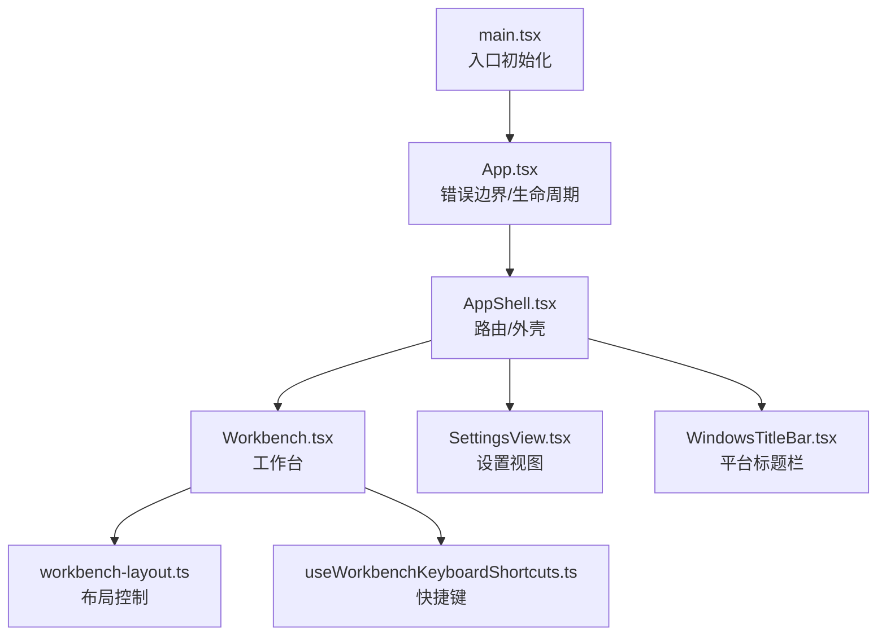
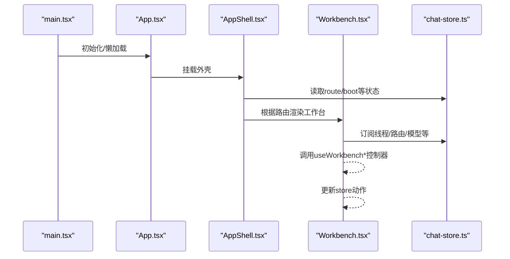
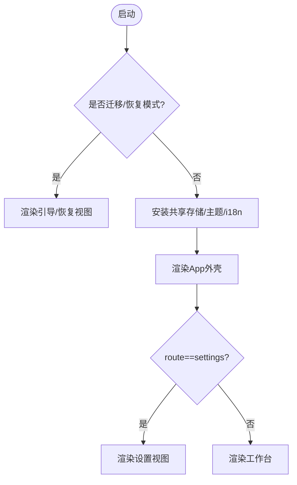
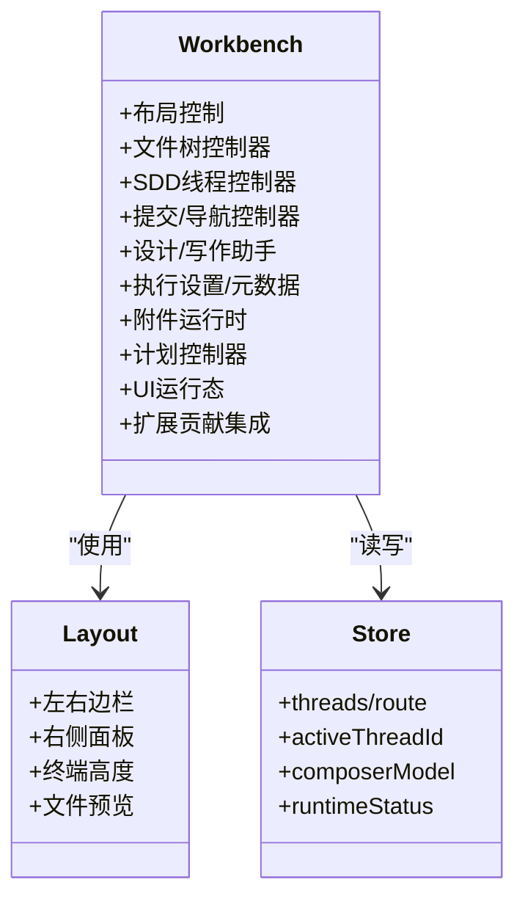
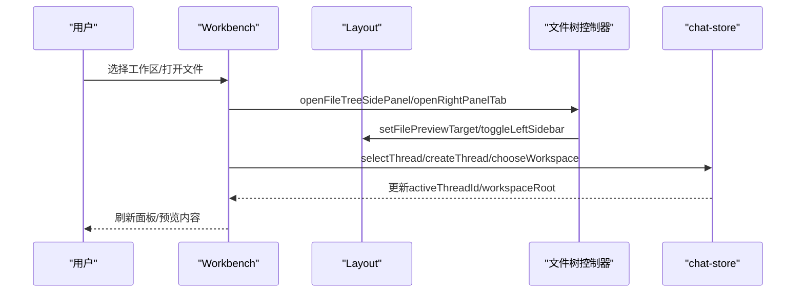
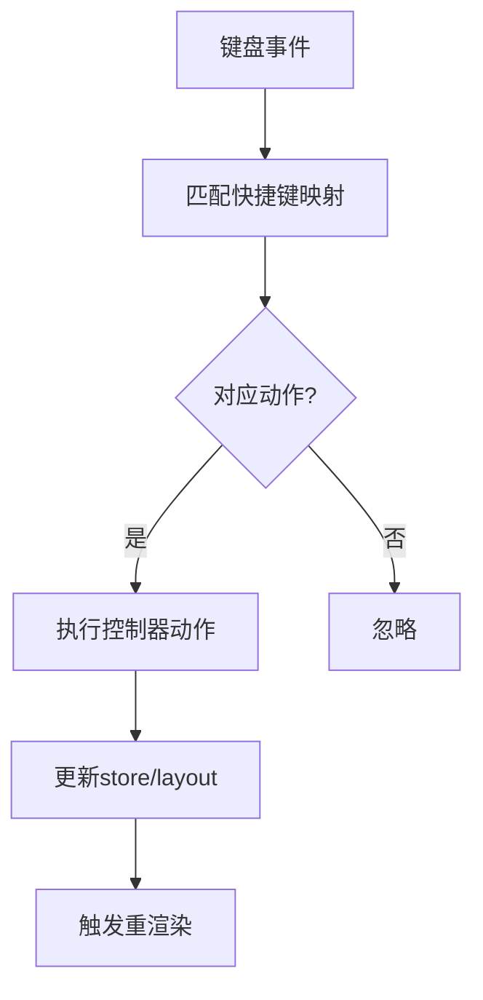
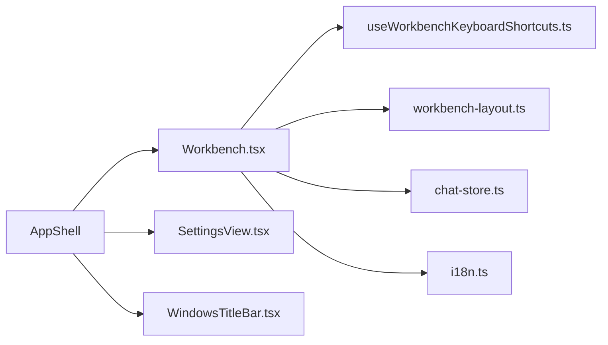

# 用户界面

<cite>
**本文引用的文件**
- [main.tsx](file://src/renderer/src/main.tsx)
- [App.tsx](file://src/renderer/src/App.tsx)
- [AppShell.tsx](file://src/renderer/src/AppShell.tsx)
- [Workbench.tsx](file://src/renderer/src/components/Workbench.tsx)
- [i18n.ts](file://src/renderer/src/i18n.ts)
- [chat-store.ts](file://src/renderer/src/store/chat-store.ts)
- [workbench-layout.ts](file://src/renderer/src/components/workbench-layout.ts)
- [useWorkbenchKeyboardShortcuts.ts](file://src/renderer/src/components/workbench/useWorkbenchKeyboardShortcuts.ts)
- [SettingsView.tsx](file://src/renderer/src/components/SettingsView.tsx)
- [SettingsSidebar.tsx](file://src/renderer/src/components/SettingsSidebar.tsx)
- [WindowsTitleBar.tsx](file://src/renderer/src/components/WindowsTitleBar.tsx)
- [index.css](file://src/renderer/src/index.css)
- [tailwind.config.js](file://tailwind.config.js)
- [app-settings.ts](file://src/shared/app-settings.ts)
- [app-locales.ts](file://src/shared/app-locales.ts)
</cite>

## 目录
1. [简介](#简介)
2. [项目结构](#项目结构)
3. [核心组件](#核心组件)
4. [架构总览](#架构总览)
5. [详细组件分析](#详细组件分析)
6. [依赖关系分析](#依赖关系分析)
7. [性能考虑](#性能考虑)
8. [故障排查指南](#故障排查指南)
9. [结论](#结论)
10. [附录](#附录)

## 简介
本文件面向DeepSeek-GUI的用户界面，系统性说明React组件架构、状态管理、数据流与模块职责，覆盖工作区切换、会话管理、文件浏览器、设置面板、TUI终端界面与键盘导航、响应式布局与跨平台兼容、国际化与主题系统、无障碍访问与体验优化，并提供使用示例、样式定制指南、自定义主题开发教程以及界面测试策略与调试技巧。

## 项目结构
渲染进程入口负责初始化全局样式、主题、国际化与业务存储，随后懒加载应用外壳与工作区。应用外壳根据路由在“工作台”和“设置”之间切换，并处理窗口标题栏、运行时状态横幅与初始设置对话框。工作台是主交互区域，聚合左侧边栏、右侧面板、终端、计划面板、设计助手、写作助手等能力，并通过一系列控制器Hook协调状态与行为。

图表来源
- [main.tsx:1-60](file://src/renderer/src/main.tsx#L1-L60)
- [App.tsx:1-113](file://src/renderer/src/App.tsx#L1-L113)
- [AppShell.tsx:1-103](file://src/renderer/src/AppShell.tsx#L1-L103)
- [Workbench.tsx:1-800](file://src/renderer/src/components/Workbench.tsx#L1-L800)
- [workbench-layout.ts:1-200](file://src/renderer/src/components/workbench-layout.ts#L1-L200)
- [useWorkbenchKeyboardShortcuts.ts:1-200](file://src/renderer/src/components/workbench/useWorkbenchKeyboardShortcuts.ts#L1-L200)
- [WindowsTitleBar.tsx:1-200](file://src/renderer/src/components/WindowsTitleBar.tsx#L1-L200)

章节来源
- [main.tsx:1-60](file://src/renderer/src/main.tsx#L1-L60)
- [App.tsx:1-113](file://src/renderer/src/App.tsx#L1-L113)
- [AppShell.tsx:1-103](file://src/renderer/src/AppShell.tsx#L1-L103)

## 核心组件
- 入口与启动流程：main.tsx负责安装迁移、主题、光标光晕、数据迁移RPC与共享业务存储，并按URL参数选择特殊启动视图或渲染主应用；App.tsx提供错误边界、文档可用性增强、模型连接同步生命周期与Suspense占位；AppShell.tsx根据路由渲染工作台或设置视图，并注入扩展设置服务上下文、运行时状态横幅与初始设置对话框。
- 工作台：Workbench.tsx聚合所有子能力，通过多个useWorkbench*控制器Hook组织布局、文件树、SDD线程、提交、导航、设计运行态、执行设置、键盘快捷键、附件、计划、写作助手、UI运行态等，统一暴露给子组件。
- 设置面板：SettingsView.tsx与SettingsSidebar.tsx构成设置页的视图与侧边导航，支持多模块配置项。
- 平台适配：WindowsTitleBar.tsx根据平台决定是否显示自定义标题栏。

章节来源
- [main.tsx:1-60](file://src/renderer/src/main.tsx#L1-L60)
- [App.tsx:1-113](file://src/renderer/src/App.tsx#L1-L113)
- [AppShell.tsx:1-103](file://src/renderer/src/AppShell.tsx#L1-L103)
- [Workbench.tsx:1-800](file://src/renderer/src/components/Workbench.tsx#L1-L800)
- [SettingsView.tsx:1-200](file://src/renderer/src/components/SettingsView.tsx#L1-L200)
- [SettingsSidebar.tsx:1-200](file://src/renderer/src/components/SettingsSidebar.tsx#L1-L200)
- [WindowsTitleBar.tsx:1-200](file://src/renderer/src/components/WindowsTitleBar.tsx#L1-L200)

## 架构总览
整体采用“外壳+工作区”的分层架构：
- 外壳层（AppShell）：负责路由、平台标题栏、运行时状态、扩展设置服务上下文、初始设置弹窗。
- 工作区层（Workbench）：通过组合多个控制器Hook，将复杂交互拆分为可复用的逻辑单元，驱动布局、会话、文件、计划、设计、写作、附件、快捷键等。
- 状态层（chat-store）：集中管理线程、路由、会话、模型、运行时状态等，被各控制器Hook消费与更新。
- 国际化与主题：i18n.ts提供按需加载的多语言资源与回退策略；主题通过CSS变量与Tailwind配置实现，支持深色/浅色与平台差异。

图表来源
- [main.tsx:1-60](file://src/renderer/src/main.tsx#L1-L60)
- [App.tsx:1-113](file://src/renderer/src/App.tsx#L1-L113)
- [AppShell.tsx:1-103](file://src/renderer/src/AppShell.tsx#L1-L103)
- [Workbench.tsx:1-800](file://src/renderer/src/components/Workbench.tsx#L1-L800)
- [chat-store.ts:1-200](file://src/renderer/src/store/chat-store.ts#L1-L200)

## 详细组件分析

### 应用外壳与路由
- 启动流程：main.tsx按URL参数决定进入“存储迁移引导”或“运行时迁移恢复”，否则安装共享业务存储并渲染App；App.tsx安装文档可用性增强与模型连接同步生命周期，并使用Suspense懒加载AppShell；AppShell根据chat-store.route在“设置”与“工作台”间切换，同时注入扩展设置服务上下文、运行时状态横幅与初始设置对话框。
- 平台标题栏：根据平台能力决定是否渲染WindowsTitleBar。

图表来源
- [main.tsx:1-60](file://src/renderer/src/main.tsx#L1-L60)
- [App.tsx:1-113](file://src/renderer/src/App.tsx#L1-L113)
- [AppShell.tsx:1-103](file://src/renderer/src/AppShell.tsx#L1-L103)

章节来源
- [main.tsx:1-60](file://src/renderer/src/main.tsx#L1-L60)
- [App.tsx:1-113](file://src/renderer/src/App.tsx#L1-L113)
- [AppShell.tsx:1-103](file://src/renderer/src/AppShell.tsx#L1-L103)

### 工作台与工作区
- 布局控制：workbench-layout.ts提供左右边栏折叠、右侧面板模式、终端高度、文件预览目标等布局状态与操作。
- 控制器组合：Workbench.tsx通过多个useWorkbench*控制器Hook编排功能：
  - 文件树：useWorkbenchFileTreeController管理文件树侧边栏、文件预览、引用等。
  - SDD线程：useWorkbenchSddThreadController/SddTurnController管理需求草稿与对话。
  - 提交与导航：useWorkbenchComposerSubmitController/useWorkbenchNavigationController处理输入、发送消息与路由跳转。
  - 设计与写作：useWorkbenchDesignRuntime/useWorkbenchWriteAssistantRuntime分别驱动设计画布与写作助手。
  - 执行设置与元数据：useWorkbenchExecutionSettings/useWorkbenchRuntimeMetadata管理模型与能力。
  - 附件：useWorkbenchAttachmentRuntime处理上传、粘贴、Web可用性等。
  - 计划：useWorkbenchPlanController管理GUI计划构建与验证。
  - UI运行态：useWorkbenchUiRuntime管理焦点模式、主题切换等。
- 扩展贡献：工作台集成扩展贡献点（左侧栏、右侧面板、辅助面板、编辑器标签、全页面视图、顶部操作、命令、上下文菜单等），支持权限校验与动态加载。

图表来源
- [Workbench.tsx:1-800](file://src/renderer/src/components/Workbench.tsx#L1-L800)
- [workbench-layout.ts:1-200](file://src/renderer/src/components/workbench-layout.ts#L1-L200)
- [chat-store.ts:1-200](file://src/renderer/src/store/chat-store.ts#L1-L200)

章节来源
- [Workbench.tsx:1-800](file://src/renderer/src/components/Workbench.tsx#L1-L800)
- [workbench-layout.ts:1-200](file://src/renderer/src/components/workbench-layout.ts#L1-L200)

### 会话管理与工作区切换
- 会话管理：通过chat-store维护threads、activeThreadId、sideConversations等，Workbench中通过控制器Hook进行创建、选择、归档、删除、侧边对话等操作。
- 工作区切换：基于workspaceRoot/conversationWorkspaceRoot与extensionWorkspaceRoot，结合文件树控制器与计划控制器，在不同工作区上下文中打开文件、设计文档与计划任务。

图表来源
- [Workbench.tsx:1-800](file://src/renderer/src/components/Workbench.tsx#L1-L800)
- [workbench-layout.ts:1-200](file://src/renderer/src/components/workbench-layout.ts#L1-L200)
- [chat-store.ts:1-200](file://src/renderer/src/store/chat-store.ts#L1-L200)

章节来源
- [Workbench.tsx:1-800](file://src/renderer/src/components/Workbench.tsx#L1-L800)
- [chat-store.ts:1-200](file://src/renderer/src/store/chat-store.ts#L1-L200)

### 文件浏览器
- 文件树侧边栏与右侧文件面板由文件树控制器统一管理，支持打开预览、固定预览目标、切换工作区根、添加/移除引用等。
- 与计划、设计、聊天场景联动，确保不同模式下文件引用语义正确。

章节来源
- [Workbench.tsx:1-800](file://src/renderer/src/components/Workbench.tsx#L1-L800)
- [workbench-layout.ts:1-200](file://src/renderer/src/components/workbench-layout.ts#L1-L200)

### 设置面板
- SettingsView.tsx与SettingsSidebar.tsx组成设置页，提供多模块配置项（通用、代理、模型、存储、终端、工作区等）。
- 通过ExtensionSettingsServiceProvider注入扩展设置服务，使扩展也能参与设置项。

章节来源
- [SettingsView.tsx:1-200](file://src/renderer/src/components/SettingsView.tsx#L1-L200)
- [SettingsSidebar.tsx:1-200](file://src/renderer/src/components/SettingsSidebar.tsx#L1-L200)
- [AppShell.tsx:1-103](file://src/renderer/src/AppShell.tsx#L1-L103)

### TUI终端界面与键盘导航
- 终端：Workbench通过layout控制终端高度与可见性，并提供快捷键切换。
- 键盘导航：useWorkbenchKeyboardShortcuts集中注册快捷键，支持创建会话、选择工作区、切换终端、打开设置、聚焦输入等。

图表来源
- [useWorkbenchKeyboardShortcuts.ts:1-200](file://src/renderer/src/components/workbench/useWorkbenchKeyboardShortcuts.ts#L1-L200)
- [Workbench.tsx:1-800](file://src/renderer/src/components/Workbench.tsx#L1-L800)

章节来源
- [useWorkbenchKeyboardShortcuts.ts:1-200](file://src/renderer/src/components/workbench/useWorkbenchKeyboardShortcuts.ts#L1-L200)
- [Workbench.tsx:1-800](file://src/renderer/src/components/Workbench.tsx#L1-L800)

### 响应式布局与跨平台兼容
- 响应式：通过Tailwind类名与CSS变量实现自适应布局，工作台左右边栏、右侧面板、终端高度均可调整。
- 跨平台：AppShell根据平台决定是否渲染WindowsTitleBar；main.tsx设置document.documentElement.dataset.platform用于样式区分。

章节来源
- [AppShell.tsx:1-103](file://src/renderer/src/AppShell.tsx#L1-L103)
- [WindowsTitleBar.tsx:1-200](file://src/renderer/src/components/WindowsTitleBar.tsx#L1-L200)
- [main.tsx:1-60](file://src/renderer/src/main.tsx#L1-L60)
- [tailwind.config.js:1-200](file://tailwind.config.js#L1-L200)

### 国际化支持
- i18n.ts使用i18next与react-i18next，支持多语言资源按需加载（hi/ja/ko/ru/th/zh），并为Graph模式提供英文公共文案回退，避免未翻译键直接显示。
- supportedLngs来自shared/app-locales.ts，默认命名空间为common与settings。

章节来源
- [i18n.ts:1-127](file://src/renderer/src/i18n.ts#L1-L127)
- [app-locales.ts:1-200](file://src/shared/app-locales.ts#L1-L200)

### 主题系统与样式定制
- 主题：main.tsx引入基础样式与主题相关CSS，AppShell根据平台与主题状态渲染不同容器类；可通过Tailwind配置与CSS变量定制颜色、字体、间距等。
- 样式文件：index.css与多处styles/*提供全局与模块级样式；Tailwind配置文件集中定义设计令牌与断点。

章节来源
- [main.tsx:1-60](file://src/renderer/src/main.tsx#L1-L60)
- [index.css:1-200](file://src/renderer/src/index.css#L1-L200)
- [tailwind.config.js:1-200](file://tailwind.config.js#L1-L200)

### 无障碍访问与用户体验优化
- 错误边界：App.tsx使用AppErrorBoundary捕获渲染错误，防止白屏。
- 可访问性：AppShell的路由占位使用role="status"与aria-live提升读屏器体验；文档可用性增强在安装时启用。
- 加载反馈：StartupShell与RouteFallback提供清晰的加载提示。

章节来源
- [App.tsx:1-113](file://src/renderer/src/App.tsx#L1-L113)
- [AppShell.tsx:1-103](file://src/renderer/src/AppShell.tsx#L1-L103)

## 依赖关系分析
- 组件耦合：Workbench高度依赖多个useWorkbench*控制器Hook与chat-store，形成“高内聚、低耦合”的组合式架构；布局与业务逻辑分离，便于测试与维护。
- 外部依赖：i18next、react-i18next、Tailwind CSS、@xyflow/react（图编辑样式）等。
- 扩展机制：通过贡献点注册与权限校验，工作台可扩展左侧栏、右侧面板、辅助面板、编辑器标签、全页面视图、命令与上下文菜单。

图表来源
- [Workbench.tsx:1-800](file://src/renderer/src/components/Workbench.tsx#L1-L800)
- [useWorkbenchKeyboardShortcuts.ts:1-200](file://src/renderer/src/components/workbench/useWorkbenchKeyboardShortcuts.ts#L1-L200)
- [workbench-layout.ts:1-200](file://src/renderer/src/components/workbench-layout.ts#L1-L200)
- [chat-store.ts:1-200](file://src/renderer/src/store/chat-store.ts#L1-L200)
- [i18n.ts:1-127](file://src/renderer/src/i18n.ts#L1-L127)
- [AppShell.tsx:1-103](file://src/renderer/src/AppShell.tsx#L1-L103)
- [SettingsView.tsx:1-200](file://src/renderer/src/components/SettingsView.tsx#L1-L200)
- [WindowsTitleBar.tsx:1-200](file://src/renderer/src/components/WindowsTitleBar.tsx#L1-L200)

章节来源
- [Workbench.tsx:1-800](file://src/renderer/src/components/Workbench.tsx#L1-L800)
- [AppShell.tsx:1-103](file://src/renderer/src/AppShell.tsx#L1-L103)

## 性能考虑
- 懒加载：AppShell与Workbench关键模块使用lazy与Suspense减少首屏体积。
- 状态订阅：Workbench通过细粒度selector订阅chat-store字段，避免不必要重渲染。
- 网络轮询：App.tsx中的模型连接同步使用定时器与revision机制，降低无效请求。
- 资源按需：i18n资源按需加载，避免一次性加载全部语言包。

[本节为通用性能建议，不直接分析具体文件]

## 故障排查指南
- 启动失败：检查main.tsx中的迁移与RPC安装是否成功；确认URL参数是否正确。
- 路由异常：核对chat-store.route与AppShell条件渲染逻辑。
- 工作台空白：查看Workbench控制器Hook是否抛出异常；检查扩展贡献快照是否就绪。
- 国际化缺失：确认i18n资源路径与supportedLngs配置；Graph模式会回退到英文公共文案。
- 主题错乱：检查Tailwind配置与CSS变量；确认platform dataset已设置。

章节来源
- [main.tsx:1-60](file://src/renderer/src/main.tsx#L1-L60)
- [AppShell.tsx:1-103](file://src/renderer/src/AppShell.tsx#L1-L103)
- [Workbench.tsx:1-800](file://src/renderer/src/components/Workbench.tsx#L1-L800)
- [i18n.ts:1-127](file://src/renderer/src/i18n.ts#L1-L127)

## 结论
DeepSeek-GUI的用户界面以“外壳+工作区”为核心架构，通过组合式控制器Hook将复杂交互解耦，配合集中式状态管理、灵活的扩展机制与完善的国际化/主题体系，实现了高可维护性与可扩展性。工作台作为中枢，整合了会话、文件、计划、设计、写作、终端等能力，并提供键盘导航与无障碍支持，满足多平台与多语言的桌面应用需求。

## 附录

### 组件使用示例
- 在工作台中打开文件预览：调用文件树控制器openFileTreeSidePanel与openRightPanelTab(files)。
- 切换终端：调用layout.toggleTerminal或通过快捷键触发。
- 打开设置：通过AppShell路由切换到settings，或使用快捷键。

章节来源
- [Workbench.tsx:1-800](file://src/renderer/src/components/Workbench.tsx#L1-L800)
- [workbench-layout.ts:1-200](file://src/renderer/src/components/workbench-layout.ts#L1-L200)
- [useWorkbenchKeyboardShortcuts.ts:1-200](file://src/renderer/src/components/workbench/useWorkbenchKeyboardShortcuts.ts#L1-L200)

### 样式定制指南
- 使用Tailwind设计令牌：在tailwind.config.js中扩展颜色、字体、圆角、阴影等。
- 全局样式：在index.css中定义CSS变量与基础规则。
- 模块样式：在各styles/*文件中隔离模块样式，避免污染全局。

章节来源
- [tailwind.config.js:1-200](file://tailwind.config.js#L1-L200)
- [index.css:1-200](file://src/renderer/src/index.css#L1-L200)

### 自定义主题开发教程
- 新增主题色：在Tailwind配置中扩展调色板，并在CSS变量中映射。
- 平台差异化：通过document.documentElement.dataset.platform选择不同样式分支。
- 运行时切换：通过useWorkbenchUiRuntime提供的toggleTheme等方法切换主题。

章节来源
- [tailwind.config.js:1-200](file://tailwind.config.js#L1-L200)
- [main.tsx:1-60](file://src/renderer/src/main.tsx#L1-L60)
- [Workbench.tsx:1-800](file://src/renderer/src/components/Workbench.tsx#L1-L800)

### 界面测试策略
- 单元测试：对控制器Hook与store动作进行断言，模拟用户操作与异步结果。
- 集成测试：使用React Testing Library对工作台关键流程（创建会话、打开文件、切换终端）进行端到端验证。
- 快照测试：对静态视图（设置面板、工作台布局）进行快照比对，防止意外变更。

[本节为通用测试建议，不直接分析具体文件]

### 调试技巧
- 控制台日志：在控制器Hook中添加关键状态变化日志，定位问题。
- 网络监控：观察模型连接同步轮询与扩展贡献加载的网络请求。
- 路由调试：打印chat-store.route与平台信息，确认渲染分支。

章节来源
- [App.tsx:1-113](file://src/renderer/src/App.tsx#L1-L113)
- [Workbench.tsx:1-800](file://src/renderer/src/components/Workbench.tsx#L1-L800)
- [AppShell.tsx:1-103](file://src/renderer/src/AppShell.tsx#L1-L103)