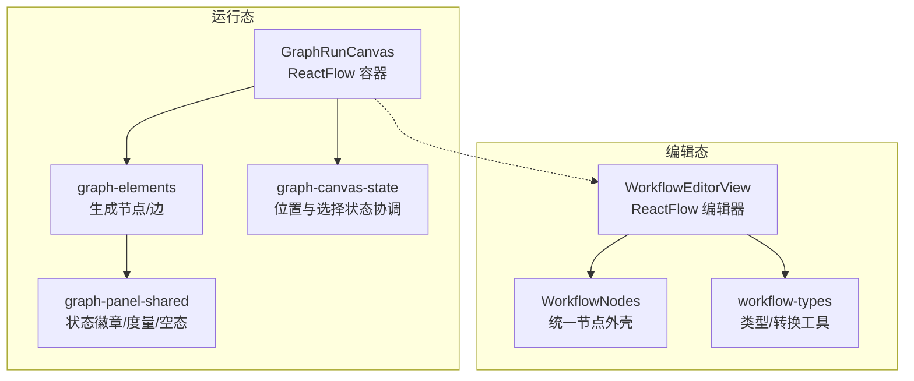
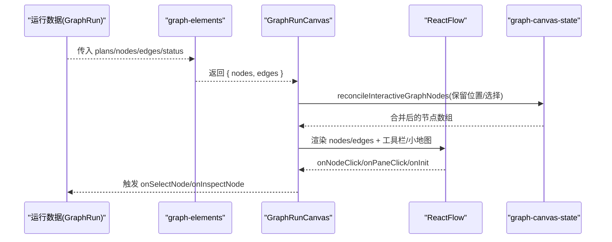
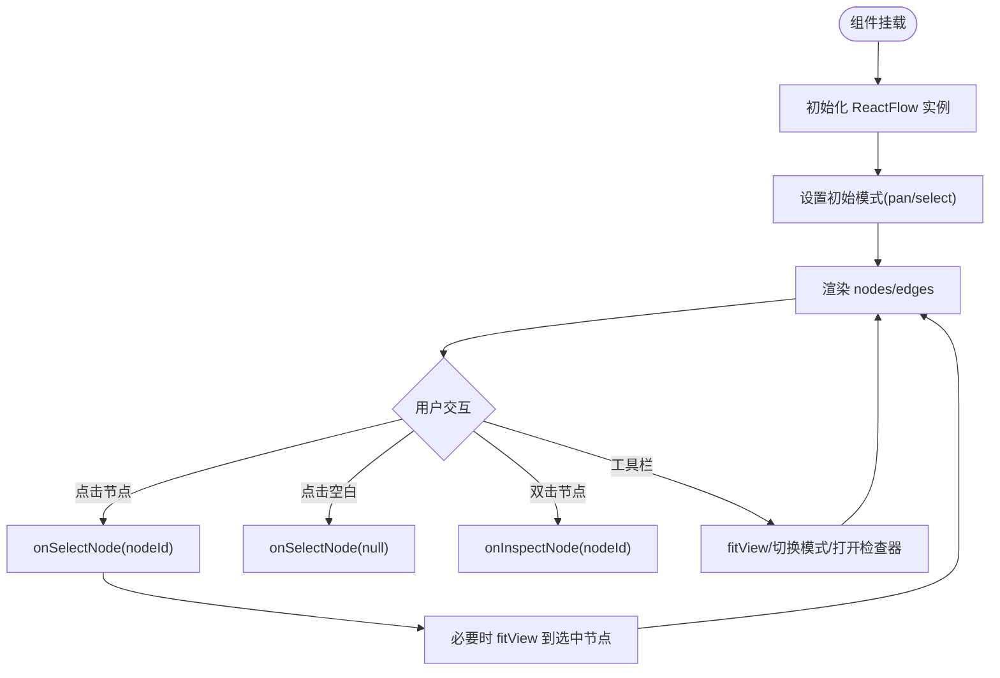
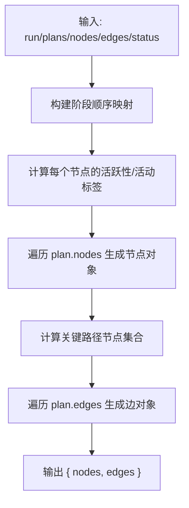
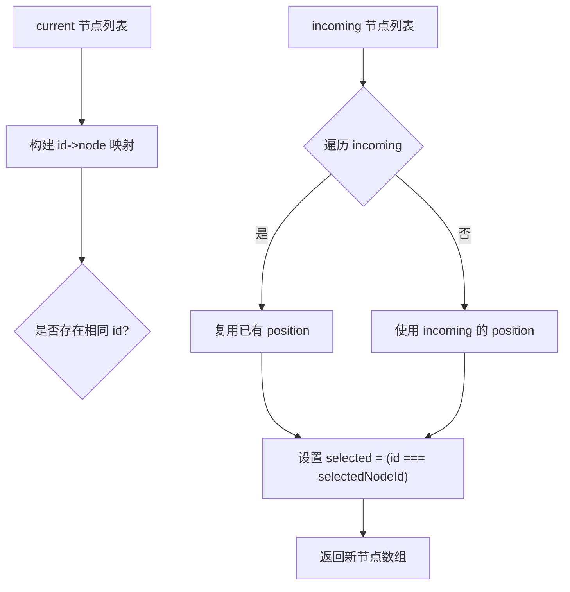
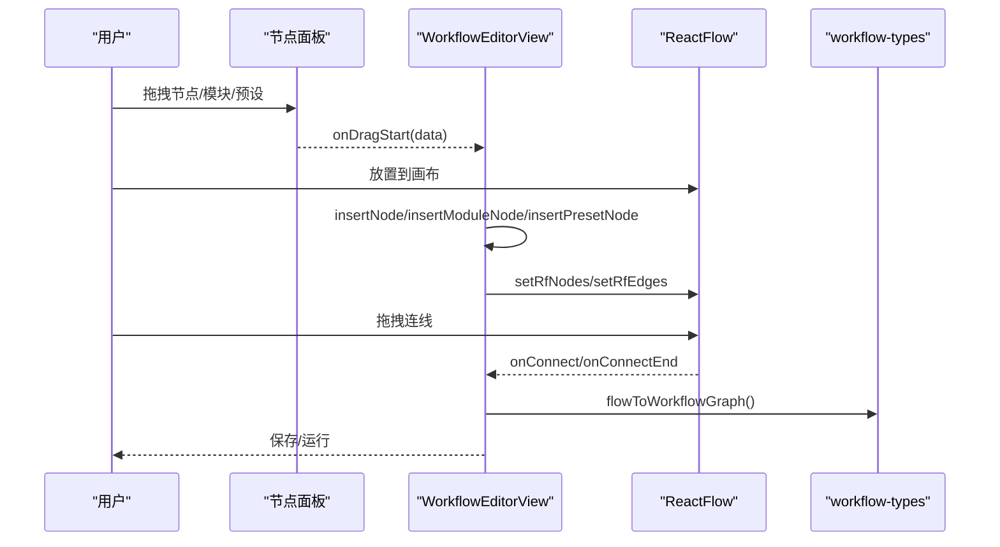
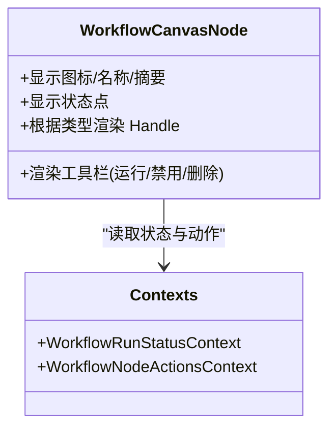
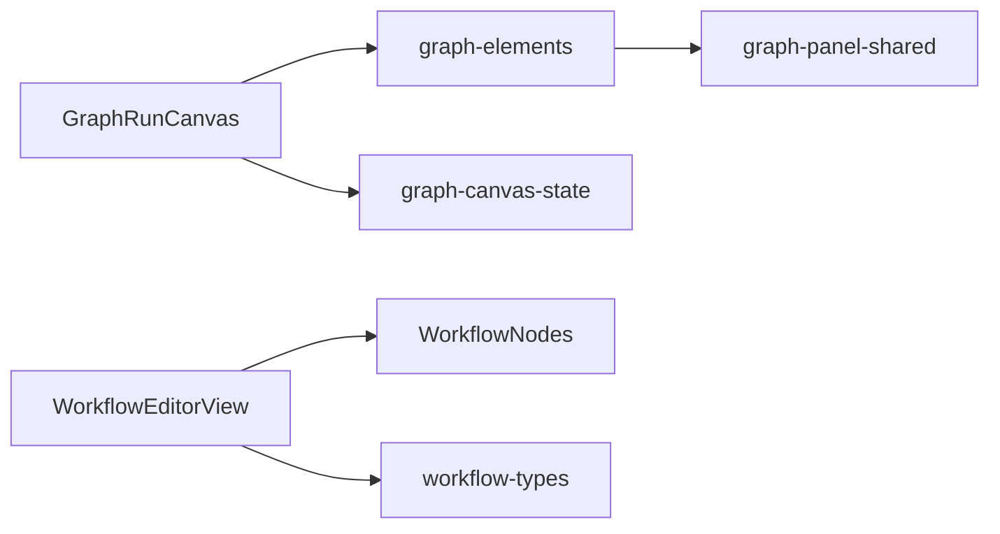

# 图组件

<cite>
**本文引用的文件**
- [GraphRunCanvas.tsx](file://src/renderer/src/components/graph/GraphRunCanvas.tsx)
- [graph-elements.tsx](file://src/renderer/src/components/graph/graph-elements.tsx)
- [graph-canvas-state.ts](file://src/renderer/src/components/graph/graph-canvas-state.ts)
- [WorkflowEditorView.tsx](file://src/renderer/src/components/workflow/WorkflowEditorView.tsx)
- [WorkflowNodes.tsx](file://src/renderer/src/components/workflow/WorkflowNodes.tsx)
- [workflow-types.ts](file://src/renderer/src/components/workflow/workflow-types.ts)
- [graph-panel-shared.tsx](file://src/renderer/src/components/graph/graph-panel-shared.tsx)
</cite>

## 目录
1. [简介](#简介)
2. [项目结构](#项目结构)
3. [核心组件](#核心组件)
4. [架构总览](#架构总览)
5. [详细组件分析](#详细组件分析)
6. [依赖关系分析](#依赖关系分析)
7. [性能考量](#性能考量)
8. [故障排查指南](#故障排查指南)
9. [结论](#结论)
10. [附录](#附录)

## 简介
本文件面向 DeepSeek-GUI 的“图组件”模块，聚焦工作流图的可视化能力与实现。内容涵盖：
- 节点渲染、连线绘制、布局算法等核心功能
- Props 接口设计（节点数据、连接关系、视图配置）
- 交互能力（节点操作、连线编辑、缩放平移）
- 性能优化策略（可见元素渲染、增量更新、内存管理）
- 扩展开发指南（自定义节点类型、插件机制）

## 项目结构
图组件由“运行态画布”和“编辑态画布”两部分组成：
- 运行态画布：用于展示图执行过程、节点状态、关键路径、子代理活动等
- 编辑态画布：用于拖拽添加节点、连线、保存/运行工作流

图表来源
- [GraphRunCanvas.tsx:1-206](file://src/renderer/src/components/graph/GraphRunCanvas.tsx#L1-L206)
- [graph-elements.tsx:19-229](file://src/renderer/src/components/graph/graph-elements.tsx#L19-L229)
- [graph-canvas-state.ts:1-18](file://src/renderer/src/components/graph/graph-canvas-state.ts#L1-L18)
- [WorkflowEditorView.tsx:122-700](file://src/renderer/src/components/workflow/WorkflowEditorView.tsx#L122-L700)
- [WorkflowNodes.tsx:162-312](file://src/renderer/src/components/workflow/WorkflowNodes.tsx#L162-L312)
- [workflow-types.ts:289-331](file://src/renderer/src/components/workflow/workflow-types.ts#L289-L331)

章节来源
- [GraphRunCanvas.tsx:1-206](file://src/renderer/src/components/graph/GraphRunCanvas.tsx#L1-L206)
- [WorkflowEditorView.tsx:122-700](file://src/renderer/src/components/workflow/WorkflowEditorView.tsx#L122-L700)

## 核心组件
- GraphRunCanvas：基于 ReactFlow 的运行态画布，负责模式切换（选择/平移）、选中聚焦、工具栏、背景网格与小地图
- graph-elements：将运行计划与运行时投影转换为 ReactFlow 的节点与边，计算关键路径、循环边、处理中动画
- graph-canvas-state：在外部节点数据变化时，保留用户已调整的位置并同步选中状态
- WorkflowEditorView：编辑态画布，提供节点面板、拖拽插入、连线菜单、保存/运行、右侧配置/日志面板
- WorkflowNodes：统一节点外壳，根据节点类型渲染 Handle、工具栏、状态点与摘要
- workflow-types：工作流节点/连接的创建、转换与类型定义
- graph-panel-shared：通用 UI 组件（状态徽章、度量、空态）

章节来源
- [GraphRunCanvas.tsx:24-176](file://src/renderer/src/components/graph/GraphRunCanvas.tsx#L24-L176)
- [graph-elements.tsx:19-229](file://src/renderer/src/components/graph/graph-elements.tsx#L19-L229)
- [graph-canvas-state.ts:3-17](file://src/renderer/src/components/graph/graph-canvas-state.ts#L3-L17)
- [WorkflowEditorView.tsx:122-700](file://src/renderer/src/components/workflow/WorkflowEditorView.tsx#L122-L700)
- [WorkflowNodes.tsx:162-312](file://src/renderer/src/components/workflow/WorkflowNodes.tsx#L162-L312)
- [workflow-types.ts:71-240](file://src/renderer/src/components/workflow/workflow-types.ts#L71-L240)
- [graph-panel-shared.tsx:1-114](file://src/renderer/src/components/graph/graph-panel-shared.tsx#L1-L114)

## 架构总览
下图展示了运行态与编辑态的核心数据流与组件协作关系。

图表来源
- [graph-elements.tsx:19-229](file://src/renderer/src/components/graph/graph-elements.tsx#L19-L229)
- [GraphRunCanvas.tsx:24-176](file://src/renderer/src/components/graph/GraphRunCanvas.tsx#L24-L176)
- [graph-canvas-state.ts:3-17](file://src/renderer/src/components/graph/graph-canvas-state.ts#L3-L17)

## 详细组件分析

### 运行态画布 GraphRunCanvas
职责
- 使用 ReactFlow 承载图，支持选择/平移两种模式
- 通过 fitView 聚焦选中节点，支持最小/最大缩放
- 集成背景网格、小地图、工具栏（选择、平移、适配、打开检查器）
- 通过 useNodesState 管理节点，结合 reconcileInteractiveGraphNodes 保持用户拖拽位置

交互
- 点击空白区域取消选择；点击节点选中；双击节点进入检查
- 工具栏按钮控制模式与视图行为

性能
- onlyRenderVisibleElements 仅渲染可视区域元素
- 使用 Map 缓存布局节点，避免重复计算

图表来源
- [GraphRunCanvas.tsx:24-176](file://src/renderer/src/components/graph/GraphRunCanvas.tsx#L24-L176)

章节来源
- [GraphRunCanvas.tsx:24-176](file://src/renderer/src/components/graph/GraphRunCanvas.tsx#L24-L176)

### 节点与连线生成 graph-elements
职责
- 将运行计划与运行时投影映射为 ReactFlow 节点与边
- 计算关键路径，高亮关键边与节点
- 识别循环边、消息边、数据边，差异化样式
- 为处理中的目标节点启用边动画

布局
- 按阶段(phase)与行(row)进行二维布局，固定间距
- 节点宽度、内边距、圆角、阴影与边框颜色随状态变化

图表来源
- [graph-elements.tsx:19-229](file://src/renderer/src/components/graph/graph-elements.tsx#L19-L229)

章节来源
- [graph-elements.tsx:19-229](file://src/renderer/src/components/graph/graph-elements.tsx#L19-L229)

### 节点状态协调 graph-canvas-state
职责
- 当 incoming 节点数据变化时，保留用户已调整的位置
- 根据 selectedNodeId 同步选中状态

复杂度
- O(n) 遍历 incoming，使用 Map 查找已有节点位置

图表来源
- [graph-canvas-state.ts:3-17](file://src/renderer/src/components/graph/graph-canvas-state.ts#L3-L17)

章节来源
- [graph-canvas-state.ts:3-17](file://src/renderer/src/components/graph/graph-canvas-state.ts#L3-L17)

### 编辑态画布 WorkflowEditorView
职责
- 左侧节点面板：内置节点与自定义模块/预设，支持拖拽到画布
- 中间画布：ReactFlow 编辑器，支持连线、删除、禁用/启用节点
- 右侧面板：节点配置与运行日志
- 顶部工具栏：保存、运行、停止、环境变量、历史记录

交互流程
- 从面板拖拽节点到画布插入
- 从节点端口拖出连线，若落到空白区域弹出“添加并连接”菜单
- 节点工具栏可运行、禁用、删除
- 保存时将 Flow 节点/边转换为持久化结构

图表来源
- [WorkflowEditorView.tsx:122-700](file://src/renderer/src/components/workflow/WorkflowEditorView.tsx#L122-L700)
- [workflow-types.ts:289-331](file://src/renderer/src/components/workflow/workflow-types.ts#L289-L331)

章节来源
- [WorkflowEditorView.tsx:122-700](file://src/renderer/src/components/workflow/WorkflowEditorView.tsx#L122-L700)
- [workflow-types.ts:71-240](file://src/renderer/src/components/workflow/workflow-types.ts#L71-L240)

### 统一节点外壳 WorkflowNodes
职责
- 为所有节点类型提供统一外壳：图标、名称、摘要、状态点、工具栏
- 根据节点类型动态渲染 Handle（输入/输出/多分支）
- 暴露上下文：运行状态、节点动作（运行/禁用/删除）

扩展点
- 新增节点类型只需确保类型存在于 WORKFLOW_NODE_KINDS，即可自动获得渲染壳
- 不同节点类型的具体配置由 NodeConfigPanel 与对应编辑器处理

图表来源
- [WorkflowNodes.tsx:162-312](file://src/renderer/src/components/workflow/WorkflowNodes.tsx#L162-L312)

章节来源
- [WorkflowNodes.tsx:162-312](file://src/renderer/src/components/workflow/WorkflowNodes.tsx#L162-L312)

### 类型与转换 workflow-types
职责
- 定义工作流节点种类、分组、触发器集合
- 提供创建节点/模块/预设、快照预设、创建工作流的工厂函数
- 提供 Flow 节点/边与工作流结构的互转工具

关键点
- toFlowNodes/toFlowEdges：将持久化结构转为 ReactFlow 数据
- flowToWorkflowGraph：将 ReactFlow 数据还原为持久化结构
- createWorkflowNode/createCustomNode/createNodeFromPreset：快速构造节点

章节来源
- [workflow-types.ts:13-54](file://src/renderer/src/components/workflow/workflow-types.ts#L13-L54)
- [workflow-types.ts:71-240](file://src/renderer/src/components/workflow/workflow-types.ts#L71-L240)
- [workflow-types.ts:289-331](file://src/renderer/src/components/workflow/workflow-types.ts#L289-L331)

### 共享 UI graph-panel-shared
职责
- 提供状态徽章(StatusPill)、度量(Metric)、空态(EmptyState)、折叠列表等通用组件
- 提供 reduced motion 检测与状态色阶

章节来源
- [graph-panel-shared.tsx:1-114](file://src/renderer/src/components/graph/graph-panel-shared.tsx#L1-L114)

## 依赖关系分析
- GraphRunCanvas 依赖 graph-elements 生成节点/边，依赖 graph-canvas-state 协调位置与选择
- WorkflowEditorView 依赖 WorkflowNodes 提供节点渲染壳，依赖 workflow-types 做数据转换
- graph-elements 依赖 graph-panel-shared 的状态徽章等 UI 组件
- 运行态与编辑态均基于 ReactFlow，但关注点不同：运行态强调状态可视化与性能，编辑态强调易用性与持久化

图表来源
- [GraphRunCanvas.tsx:24-176](file://src/renderer/src/components/graph/GraphRunCanvas.tsx#L24-L176)
- [graph-elements.tsx:19-229](file://src/renderer/src/components/graph/graph-elements.tsx#L19-L229)
- [WorkflowEditorView.tsx:122-700](file://src/renderer/src/components/workflow/WorkflowEditorView.tsx#L122-L700)
- [WorkflowNodes.tsx:162-312](file://src/renderer/src/components/workflow/WorkflowNodes.tsx#L162-L312)
- [workflow-types.ts:289-331](file://src/renderer/src/components/workflow/workflow-types.ts#L289-L331)

## 性能考量
- 可见元素渲染：运行态画布启用 onlyRenderVisibleElements，减少不可见节点/边的渲染开销
- 增量更新：graph-canvas-state 通过 Map 定位已有节点，仅更新必要字段（position、selected），避免全量重建
- 布局缓存：运行态使用 Map 缓存布局节点，跨次渲染复用位置信息
- 动画控制：遵循系统 reduced motion 偏好，关闭不必要的动画以提升流畅度
- 内存管理：切换运行范围时清理布局缓存，避免累积无用数据

[本节为通用性能建议，不直接分析具体文件]

## 故障排查指南
- 节点未显示：确认传入的 plans 存在且包含 phases/nodes/edges；检查 graph-elements 是否返回有效节点数组
- 连线异常：确认 source/target 节点 id 正确；检查 edge.kind 与 label 逻辑；循环边需标记 loopTargets
- 选中失效：核对 selectedNodeId 是否在 incomingNodes 中存在；确认 reconcileInteractiveGraphNodes 正确设置 selected
- 无法拖拽/连线：编辑态需确保 nodeTypes 注册完整；检查 onConnect/onConnectEnd 回调是否被调用
- 性能卡顿：检查节点数量与复杂程度；考虑减少动画、开启只渲染可视元素、拆分大任务

章节来源
- [graph-elements.tsx:19-229](file://src/renderer/src/components/graph/graph-elements.tsx#L19-L229)
- [graph-canvas-state.ts:3-17](file://src/renderer/src/components/graph/graph-canvas-state.ts#L3-L17)
- [WorkflowEditorView.tsx:122-700](file://src/renderer/src/components/workflow/WorkflowEditorView.tsx#L122-L700)

## 结论
DeepSeek-GUI 的图组件以 ReactFlow 为基础，构建了运行态与编辑态两套互补的可视化能力。运行态侧重状态呈现与性能优化，编辑态侧重易用性与持久化。通过统一的节点外壳与类型转换工具，系统在可扩展性、一致性与维护性方面具备良好基础。

[本节为总结性内容，不直接分析具体文件]

## 附录

### Props 接口设计（图组件）
- 运行态画布 GraphRunCanvas
  - 入参：runId、nodes、edges、selectedNodeId、focusRequestKey、onSelectNode、onInspectNode、onOpenInspector
  - 作用：nodes/edges 为 ReactFlow 数据结构；selectedNodeId 控制选中；focusRequestKey 触发聚焦；回调用于上层状态同步
- 节点与连线生成 graph-elements
  - 入参：run、reducedMotion、selectedNodeId、options(childRuns/now/onOpenChild/waitingUpstreamLabel/viewLiveWorkLabel)
  - 作用：将运行计划与运行时投影转换为节点/边，并附加状态与样式
- 编辑态画布 WorkflowEditorView
  - 入参：workflow、settings、runStatus、lastResults、liveResults、running、onPersist、onRun、onRunNode、onStop、onBack、presets、onSavePreset、onDeletePreset、modules、onSaveModules
  - 作用：承载编辑器 UI 与交互，驱动保存/运行/单节点运行等操作

章节来源
- [GraphRunCanvas.tsx:24-42](file://src/renderer/src/components/graph/GraphRunCanvas.tsx#L24-L42)
- [graph-elements.tsx:19-34](file://src/renderer/src/components/graph/graph-elements.tsx#L19-L34)
- [WorkflowEditorView.tsx:96-120](file://src/renderer/src/components/workflow/WorkflowEditorView.tsx#L96-L120)

### 交互功能清单
- 节点操作：选中、双击进入检查、运行/禁用/删除（编辑态）
- 连线编辑：拖拽连线、空白处弹出“添加并连接”菜单、保存时转换为连接结构
- 视图操作：缩放、平移、适配视图、小地图导航、模式切换（选择/平移）

章节来源
- [GraphRunCanvas.tsx:95-176](file://src/renderer/src/components/graph/GraphRunCanvas.tsx#L95-L176)
- [WorkflowEditorView.tsx:216-286](file://src/renderer/src/components/workflow/WorkflowEditorView.tsx#L216-L286)
- [WorkflowEditorView.tsx:667-698](file://src/renderer/src/components/workflow/WorkflowEditorView.tsx#L667-L698)

### 扩展开发指南
- 自定义节点类型
  - 在类型定义中添加新 kind，并确保 NODE_ICONS 与 workflowNodeTypes 覆盖
  - 在 WorkflowNodes 中为特定类型渲染对应的 Handle 与标签
  - 如需配置面板，可在 NodeConfigPanel 或对应编辑器中实现
- 插件机制
  - 通过自定义模块(workflow-types.createCustomModule)扩展节点能力
  - 在编辑器侧边栏展示模块，支持拖拽插入与参数配置
  - 保存时将模块绑定信息与值序列化到工作流结构中

章节来源
- [WorkflowNodes.tsx:55-81](file://src/renderer/src/components/workflow/WorkflowNodes.tsx#L55-L81)
- [workflow-types.ts:250-261](file://src/renderer/src/components/workflow/workflow-types.ts#L250-L261)
- [workflow-types.ts:202-217](file://src/renderer/src/components/workflow/workflow-types.ts#L202-L217)