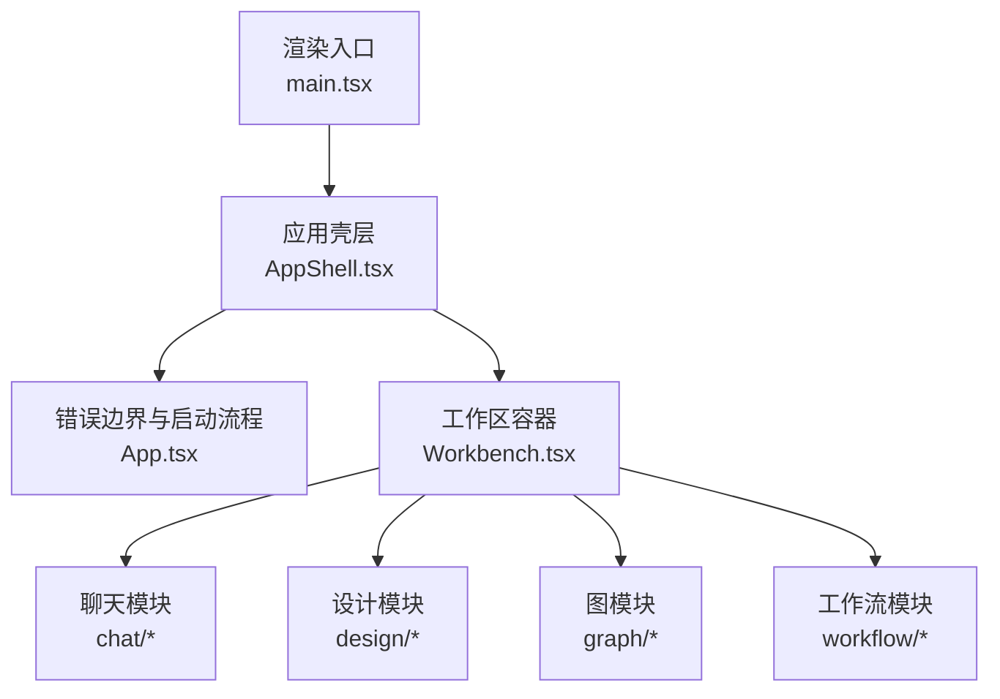
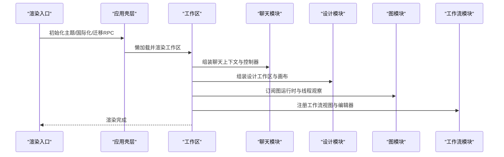
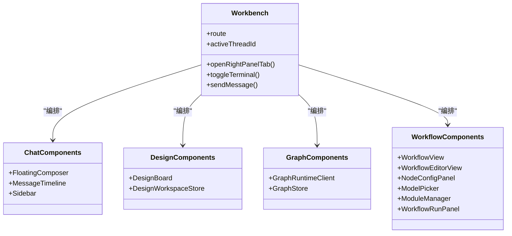
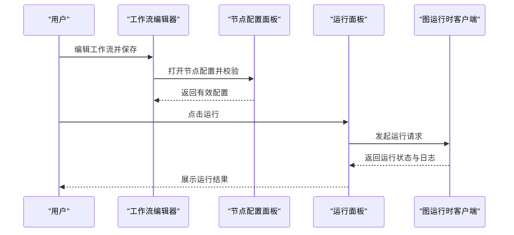
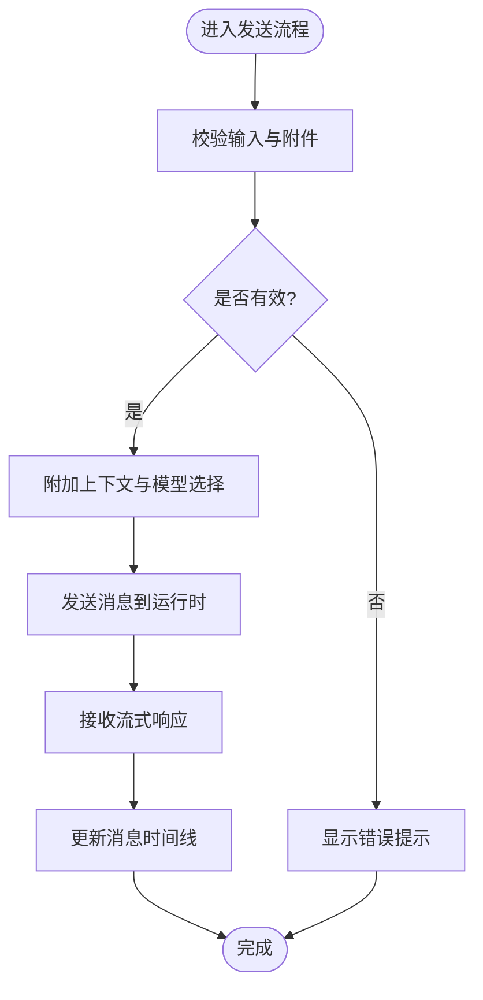
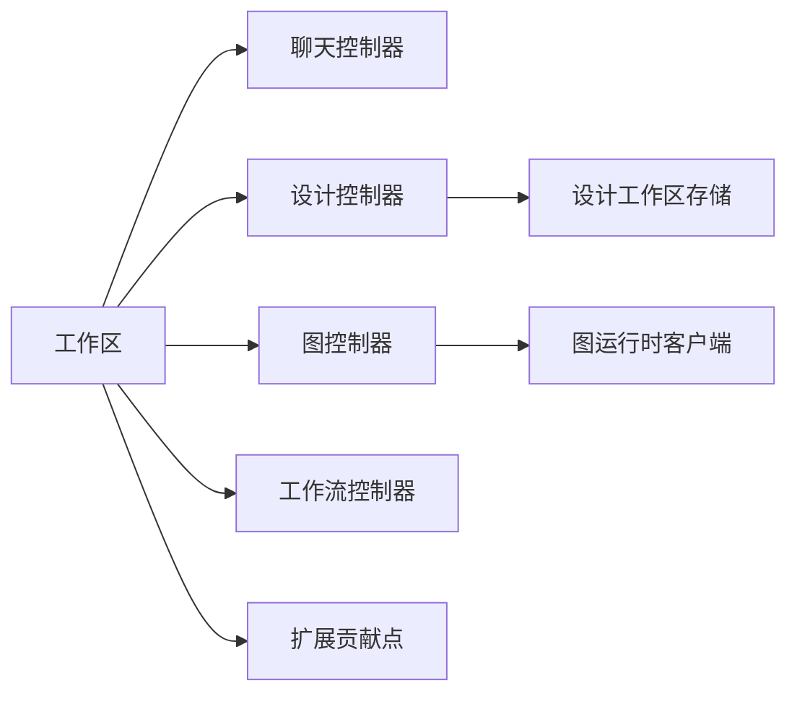

# 组件系统

<cite>
**本文引用的文件**
- [main.tsx](file://src/renderer/src/main.tsx)
- [App.tsx](file://src/renderer/src/App.tsx)
- [AppShell.tsx](file://src/renderer/src/AppShell.tsx)
- [Workbench.tsx](file://src/renderer/src/components/Workbench.tsx)
- [WorkflowView.tsx](file://src/renderer/src/components/workflow/WorkflowView.tsx)
- [WorkflowEditorView.tsx](file://src/renderer/src/components/workflow/WorkflowEditorView.tsx)
- [NodeConfigPanel.tsx](file://src/renderer/src/components/workflow/NodeConfigPanel.tsx)
- [ModelPicker.tsx](file://src/renderer/src/components/workflow/ModelPicker.tsx)
- [ModuleManager.tsx](file://src/renderer/src/components/workflow/ModuleManager.tsx)
- [WorkflowRunPanel.tsx](file://src/renderer/src/components/workflow/WorkflowRunPanel.tsx)
- [FloatingComposer.tsx](file://src/renderer/src/components/chat/FloatingComposer.tsx)
- [MessageTimeline.tsx](file://src/renderer/src/components/chat/MessageTimeline.tsx)
- [Sidebar.tsx](file://src/renderer/src/components/chat/Sidebar.tsx)
- [design-board.ts](file://src/renderer/src/design/design-board.ts)
- [design-workspace-store.ts](file://src/renderer/src/design/design-workspace-store.ts)
- [graph-store.ts](file://src/renderer/src/graph/graph-store.ts)
- [graph-runtime-client.ts](file://src/renderer/src/graph/graph-runtime-client.ts)
</cite>

## 目录
1. [简介](#简介)
2. [项目结构](#项目结构)
3. [核心组件](#核心组件)
4. [架构总览](#架构总览)
5. [详细组件分析](#详细组件分析)
6. [依赖关系分析](#依赖关系分析)
7. [性能考虑](#性能考虑)
8. [故障排查指南](#故障排查指南)
9. [结论](#结论)
10. [附录](#附录)

## 简介
本文件面向DeepSeek-GUI的React组件系统，聚焦聊天、设计、图与工作流四大功能模块。文档从组件分类与组织、接口设计（Props、事件、生命周期）、复用策略（基础库、业务封装、组合模式）、状态管理（本地、全局、异步）以及开发规范（命名、风格、测试）等方面展开，并提供使用示例与自定义开发指南，帮助读者快速理解并高效扩展组件系统。

## 项目结构
渲染进程入口负责初始化主题、国际化、数据迁移RPC与主应用挂载；应用壳层根据路由与平台能力装配标题栏、运行时状态横幅、扩展设置服务与懒加载的工作区视图；工作区作为编排中心，聚合聊天、设计、图与工作流等子模块，并通过多种控制器与运行时上下文协调交互。

图表来源
- [main.tsx:1-60](file://src/renderer/src/main.tsx#L1-L60)
- [App.tsx:1-113](file://src/renderer/src/App.tsx#L1-L113)
- [AppShell.tsx:1-103](file://src/renderer/src/AppShell.tsx#L1-L103)
- [Workbench.tsx:116-800](file://src/renderer/src/components/Workbench.tsx#L116-L800)

章节来源
- [main.tsx:1-60](file://src/renderer/src/main.tsx#L1-L60)
- [App.tsx:1-113](file://src/renderer/src/App.tsx#L1-L113)
- [AppShell.tsx:1-103](file://src/renderer/src/AppShell.tsx#L1-L103)

## 核心组件
- 应用壳层 AppShell：负责平台标题栏、运行时状态横幅、数据迁移活动指示器、扩展设置服务提供器与路由切换（设置页/工作区）。
- 工作区 Workbench：编排聊天、设计、图与工作流，集成扩展贡献点、右侧面板、左侧边栏、辅助面板与编辑器标签，统一键盘快捷键、布局与运行时元信息。
- 聊天组件：浮动输入框、消息时间线、侧边栏等，支撑会话、附件、模型选择、执行上下文与用户输入面板。
- 设计组件：画布、工作区存储、文档持久化、原型播放器与HTML质量修复等。
- 图组件：图运行时客户端、线程观察、父子节点导航与运行状态。
- 工作流组件：工作流视图、编辑器、节点配置、模型选择、模块管理与运行面板。

章节来源
- [AppShell.tsx:1-103](file://src/renderer/src/AppShell.tsx#L1-L103)
- [Workbench.tsx:116-800](file://src/renderer/src/components/Workbench.tsx#L116-L800)

## 架构总览
整体采用“壳层 + 工作区 + 领域模块”的分层架构。渲染入口完成环境准备后挂载应用壳层；壳层通过懒加载引入工作区与设置页；工作区通过多个use*控制器与运行时上下文聚合各模块能力，并以扩展贡献机制注入视图与动作。

图表来源
- [main.tsx:23-59](file://src/renderer/src/main.tsx#L23-L59)
- [AppShell.tsx:42-103](file://src/renderer/src/AppShell.tsx#L42-L103)
- [Workbench.tsx:116-800](file://src/renderer/src/components/Workbench.tsx#L116-L800)

## 详细组件分析

### 聊天组件（Chat）
- 关键组件
  - 浮动输入框：承载消息输入、附件、模型选择、执行上下文、斜杠命令与进度展示。
  - 消息时间线：按轮次渲染助手/用户消息、工具调用摘要、子代理卡片与媒体预览。
  - 侧边栏：会话列表、项目树、对话面板与快捷操作。
- 接口设计要点
  - Props：消息集合、当前活跃线程、附件状态、模型选择、执行设置、用户输入面板开关等。
  - 事件：发送消息、中断执行、打开文件预览、切换侧边面板、引用设计文档或代码片段。
  - 生命周期：挂载时订阅运行时连接与线程变化；卸载时清理定时器与监听。
- 复用策略
  - 基础UI由通用样式与主题变量驱动；业务逻辑通过use*控制器抽取，便于在不同上下文中复用。
  - 组合模式：将输入、附件、模型选择、进度条等拆为可组合的子组件，按需拼装。
- 状态管理
  - 本地状态：输入草稿、附件队列、面板显隐。
  - 全局状态：线程列表、活跃线程、运行时连接、计划与SDD草稿等。
  - 异步状态：消息流式更新、工具调用结果、子代理任务进度。
- 使用示例
  - 在工作区中通过控制器暴露的方法创建新线程、发送消息、打开文件预览与切换右侧面板。
- 自定义开发指南
  - 新增消息类型：在时间线处理分支中添加对应卡片渲染与工具摘要。
  - 扩展输入能力：在浮动输入框中接入新的附件源或命令菜单项。

章节来源
- [Workbench.tsx:116-800](file://src/renderer/src/components/Workbench.tsx#L116-L800)
- [FloatingComposer.tsx](file://src/renderer/src/components/chat/FloatingComposer.tsx)
- [MessageTimeline.tsx](file://src/renderer/src/components/chat/MessageTimeline.tsx)
- [Sidebar.tsx](file://src/renderer/src/components/chat/Sidebar.tsx)

### 设计组件（Design）
- 关键组件
  - 画布与文档：设计画布、元素度量、节点缩放、HTML元素编辑与质量修复。
  - 工作区存储：设计文档索引、持久化、版本与回滚。
  - 原型播放器：页面跳转、表单提交捕获、脚本化导航与选中状态链接。
- 接口设计要点
  - Props：文档集合、选区ID、画布尺寸、工具集、运行时上下文。
  - 事件：创建/删除文档、保存/撤销、导出/导入、跳转到指定帧。
  - 生命周期：进入设计模式时初始化工作区；退出时清理监听与缓存。
- 复用策略
  - 将画布操作、文档CRUD、质量修复等抽象为独立服务，供不同界面复用。
  - 通过组合模式将“画布+工具+存储”拼装为完整设计工作台。
- 状态管理
  - 本地状态：选区、缩放、拖拽位置。
  - 全局状态：设计工作区、文档索引、历史栈。
  - 异步状态：持久化写入、质量修复任务、原型播放脚本执行。
- 使用示例
  - 在工作区中打开设计模式，选择文档并在画布上编辑元素，触发质量修复并预览效果。
- 自定义开发指南
  - 新增设计工具：注册到工具集，实现与画布的交互协议。
  - 扩展文档格式：在持久化与兼容性层添加新字段与迁移逻辑。

章节来源
- [design-board.ts](file://src/renderer/src/design/design-board.ts)
- [design-workspace-store.ts](file://src/renderer/src/design/design-workspace-store.ts)

### 图组件（Graph）
- 关键组件
  - 图运行时客户端：与后端图服务通信，发起运行、查询状态与事件订阅。
  - 线程观察：监听父/子线程关系、返回目标与存活状态。
  - 规划与选择：节点规划、选择与导航。
- 接口设计要点
  - Props：线程ID、运行参数、回调函数。
  - 事件：开始运行、节点完成、错误上报、返回父线程。
  - 生命周期：挂载时建立连接与观察者；卸载时断开订阅。
- 复用策略
  - 将运行时客户端与观察者封装为Hook，供图工作区与子图界面复用。
- 状态管理
  - 本地状态：当前节点、运行进度。
  - 全局状态：图运行集合、子运行集合、返回目标。
  - 异步状态：运行结果、事件流、错误重试。
- 使用示例
  - 在工作区中打开图节点，传入参数并运行，实时查看节点状态与日志。
- 自定义开发指南
  - 新增节点类型：在运行时注册节点执行器，定义输入输出契约。

章节来源
- [graph-store.ts](file://src/renderer/src/graph/graph-store.ts)
- [graph-runtime-client.ts](file://src/renderer/src/graph/graph-runtime-client.ts)

### 工作流组件（Workflow）
- 关键组件
  - 工作流视图：展示工作流概览、运行历史与状态。
  - 工作流编辑器：可视化编辑节点、连线与配置。
  - 节点配置面板：针对节点类型的参数编辑与校验。
  - 模型选择器：为节点选择模型与推理强度。
  - 模块管理器：管理工作流模块的注册、版本与权限。
  - 运行面板：启动运行、查看日志与结果。
- 接口设计要点
  - Props：工作流定义、节点集合、运行上下文、回调。
  - 事件：保存工作流、运行节点、更新配置、打开运行面板。
  - 生命周期：进入编辑器时加载工作流；离开时清理临时状态。
- 复用策略
  - 将节点配置、模型选择、运行控制等能力抽为独立组件，支持多工作流复用。
  - 通过组合模式将“编辑器+配置+运行”拼装为完整工作流工作台。
- 状态管理
  - 本地状态：编辑器选中节点、配置草稿。
  - 全局状态：工作流集合、运行历史、模块清单。
  - 异步状态：保存/发布、运行执行、日志拉取。
- 使用示例
  - 在编辑器中新增节点并配置参数，选择模型后运行工作流，查看运行日志与结果。
- 自定义开发指南
  - 新增节点类型：实现节点配置面板与运行时适配器，注册到模块管理器。

章节来源
- [WorkflowView.tsx](file://src/renderer/src/components/workflow/WorkflowView.tsx)
- [WorkflowEditorView.tsx](file://src/renderer/src/components/workflow/WorkflowEditorView.tsx)
- [NodeConfigPanel.tsx](file://src/renderer/src/components/workflow/NodeConfigPanel.tsx)
- [ModelPicker.tsx](file://src/renderer/src/components/workflow/ModelPicker.tsx)
- [ModuleManager.tsx](file://src/renderer/src/components/workflow/ModuleManager.tsx)
- [WorkflowRunPanel.tsx](file://src/renderer/src/components/workflow/WorkflowRunPanel.tsx)

### 组件类图（代码级关系）

图表来源
- [Workbench.tsx:116-800](file://src/renderer/src/components/Workbench.tsx#L116-L800)
- [WorkflowView.tsx](file://src/renderer/src/components/workflow/WorkflowView.tsx)
- [WorkflowEditorView.tsx](file://src/renderer/src/components/workflow/WorkflowEditorView.tsx)
- [NodeConfigPanel.tsx](file://src/renderer/src/components/workflow/NodeConfigPanel.tsx)
- [ModelPicker.tsx](file://src/renderer/src/components/workflow/ModelPicker.tsx)
- [ModuleManager.tsx](file://src/renderer/src/components/workflow/ModuleManager.tsx)
- [WorkflowRunPanel.tsx](file://src/renderer/src/components/workflow/WorkflowRunPanel.tsx)
- [design-board.ts](file://src/renderer/src/design/design-board.ts)
- [design-workspace-store.ts](file://src/renderer/src/design/design-workspace-store.ts)
- [graph-store.ts](file://src/renderer/src/graph/graph-store.ts)
- [graph-runtime-client.ts](file://src/renderer/src/graph/graph-runtime-client.ts)

### API/服务序列图（工作流运行）

图表来源
- [WorkflowEditorView.tsx](file://src/renderer/src/components/workflow/WorkflowEditorView.tsx)
- [NodeConfigPanel.tsx](file://src/renderer/src/components/workflow/NodeConfigPanel.tsx)
- [WorkflowRunPanel.tsx](file://src/renderer/src/components/workflow/WorkflowRunPanel.tsx)
- [graph-runtime-client.ts](file://src/renderer/src/graph/graph-runtime-client.ts)

### 复杂逻辑流程图（消息发送与处理）

图表来源
- [FloatingComposer.tsx](file://src/renderer/src/components/chat/FloatingComposer.tsx)
- [MessageTimeline.tsx](file://src/renderer/src/components/chat/MessageTimeline.tsx)

## 依赖关系分析
- 组件耦合与内聚
  - 工作区高内聚地聚合各模块控制器与运行时上下文，降低模块间直接耦合。
  - 聊天、设计、图与工作流模块内部通过Hook与服务解耦UI与业务。
- 直接与间接依赖
  - 工作区依赖聊天、设计、图与工作流的控制器与视图。
  - 图模块依赖运行时客户端与线程观察；设计模块依赖工作区存储与画布服务。
- 外部依赖与集成点
  - 扩展贡献点：视图、动作、命令、上下文菜单等由扩展动态注入。
  - 运行时连接：通过IPC或HTTP获取模型连接、运行状态与日志。
- 循环依赖检测
  - 通过分层与Hook隔离避免循环依赖；模块间以事件与回调通信。

图表来源
- [Workbench.tsx:116-800](file://src/renderer/src/components/Workbench.tsx#L116-L800)
- [graph-runtime-client.ts](file://src/renderer/src/graph/graph-runtime-client.ts)
- [design-workspace-store.ts](file://src/renderer/src/design/design-workspace-store.ts)

章节来源
- [Workbench.tsx:116-800](file://src/renderer/src/components/Workbench.tsx#L116-L800)

## 性能考虑
- 懒加载与Suspense：壳层与工作区视图采用懒加载，减少首屏体积。
- 虚拟滚动与增量更新：消息时间线与文件树采用增量更新与虚拟化，提升长列表性能。
- 防抖与节流：输入与搜索场景使用防抖，避免频繁重渲染。
- 内存管理：及时清理定时器、事件监听与订阅，防止内存泄漏。
- 网络优化：运行时连接采用事件流与分页拉取，减少带宽占用。

## 故障排查指南
- 常见问题
  - 运行时连接失败：检查模型连接同步与重试逻辑，确认后端可用。
  - 扩展贡献未加载：验证权限授予与快照刷新，确保贡献点已注册。
  - 工作流运行失败：查看节点配置与运行时日志，定位错误节点。
- 调试建议
  - 启用运行时状态横幅与数据迁移活动指示器，观察状态变化。
  - 使用错误边界捕获渲染异常，记录堆栈与上下文。
  - 在工作区中打开右侧面板的文件与终端，定位环境问题。

章节来源
- [App.tsx:1-113](file://src/renderer/src/App.tsx#L1-L113)
- [AppShell.tsx:1-103](file://src/renderer/src/AppShell.tsx#L1-L103)
- [Workbench.tsx:116-800](file://src/renderer/src/components/Workbench.tsx#L116-L800)

## 结论
DeepSeek-GUI的组件系统以工作区为核心，围绕聊天、设计、图与工作流四大模块构建，采用分层架构与组合模式，结合Hook与服务实现高内聚低耦合。通过扩展贡献机制与运行时集成，系统具备良好的可扩展性与可维护性。遵循本文档的接口设计与开发规范，可快速迭代与定制组件能力。

## 附录
- 组件开发规范
  - 命名约定：组件文件使用PascalCase，Hook使用use前缀，服务使用名词短语。
  - 代码风格：统一TypeScript类型定义，避免any；使用语义化CSS类名与主题变量。
  - 测试策略：单元测试覆盖核心逻辑与边界条件；集成测试验证组件协作与运行时交互。
- 使用示例路径
  - 聊天：[FloatingComposer.tsx](file://src/renderer/src/components/chat/FloatingComposer.tsx)、[MessageTimeline.tsx](file://src/renderer/src/components/chat/MessageTimeline.tsx)
  - 设计：[design-board.ts](file://src/renderer/src/design/design-board.ts)、[design-workspace-store.ts](file://src/renderer/src/design/design-workspace-store.ts)
  - 图：[graph-runtime-client.ts](file://src/renderer/src/graph/graph-runtime-client.ts)、[graph-store.ts](file://src/renderer/src/graph/graph-store.ts)
  - 工作流：[WorkflowEditorView.tsx](file://src/renderer/src/components/workflow/WorkflowEditorView.tsx)、[NodeConfigPanel.tsx](file://src/renderer/src/components/workflow/NodeConfigPanel.tsx)、[WorkflowRunPanel.tsx](file://src/renderer/src/components/workflow/WorkflowRunPanel.tsx)