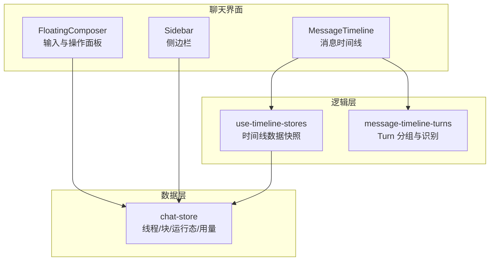
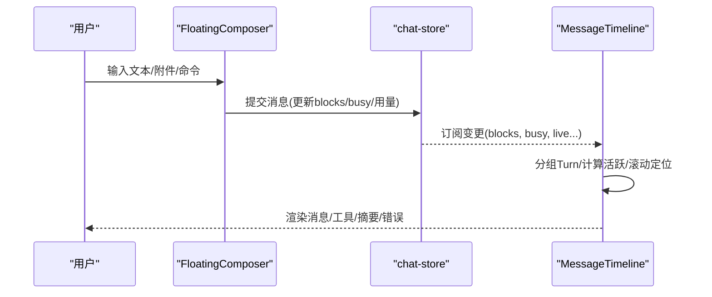
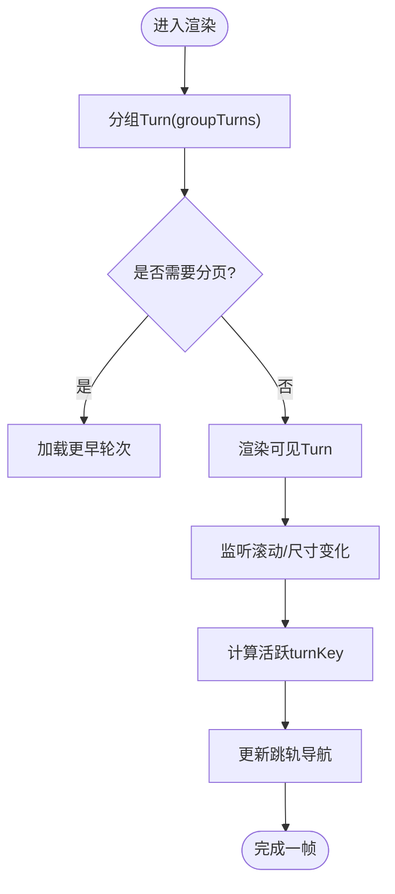
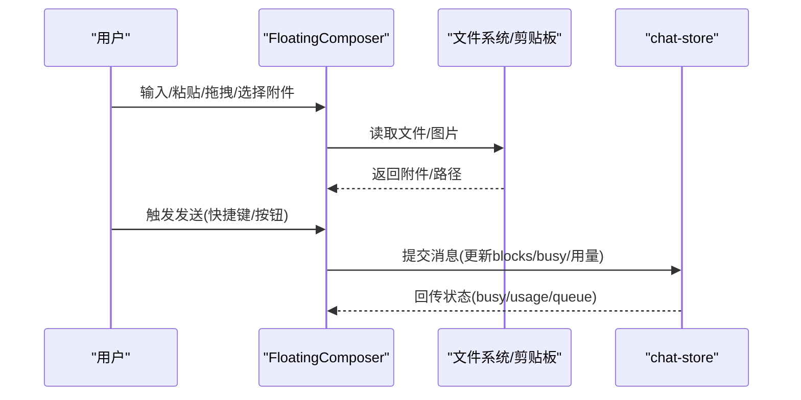
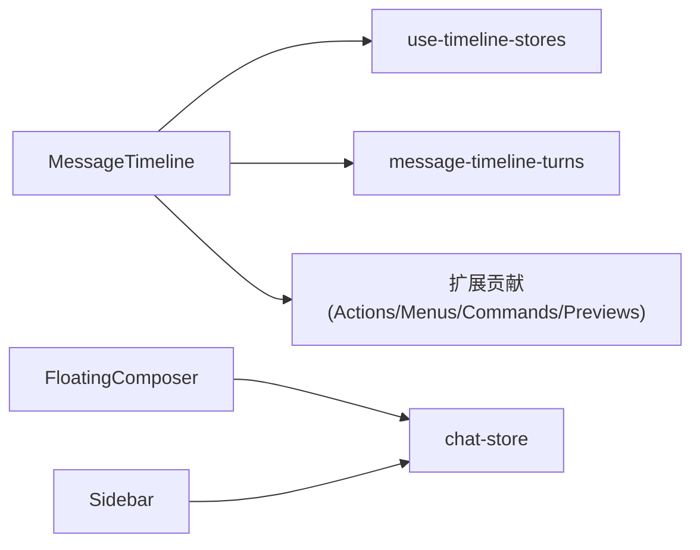

# 聊天组件

<cite>
**本文引用的文件**
- [MessageTimeline.tsx](file://src/renderer/src/components/chat/MessageTimeline.tsx)
- [FloatingComposer.tsx](file://src/renderer/src/components/chat/FloatingComposer.tsx)
- [Sidebar.tsx](file://src/renderer/src/components/chat/Sidebar.tsx)
- [message-timeline-turns.ts](file://src/renderer/src/components/chat/message-timeline-turns.ts)
- [use-timeline-stores.ts](file://src/renderer/src/components/chat/use-timeline-stores.ts)
- [message-timeline-cards.tsx](file://src/renderer/src/components/chat/message-timeline-cards.tsx)
</cite>

## 目录
1. [简介](#简介)
2. [项目结构](#项目结构)
3. [核心组件](#核心组件)
4. [架构总览](#架构总览)
5. [详细组件分析](#详细组件分析)
6. [依赖关系分析](#依赖关系分析)
7. [性能考量](#性能考量)
8. [故障排查指南](#故障排查指南)
9. [结论](#结论)
10. [附录](#附录)

## 简介
本章节面向 DeepSeek-GUI 的聊天组件模块，聚焦于聊天界面的核心组件架构与数据流。文档围绕消息展示、输入处理、会话管理等关键能力展开，详细说明 Props 接口设计（消息类型、用户信息、工具调用等）、事件处理机制（用户交互、消息发送、文件上传）、状态管理策略（本地状态、异步加载、错误处理），并提供使用示例与自定义扩展指南（样式定制、功能扩展）。

## 项目结构
聊天模块位于渲染进程前端，采用“组件 + Hook + Store”的分层组织方式：
- 组件层：负责 UI 渲染与用户交互
  - MessageTimeline：时间线消息展示、滚动定位、跳转导航、运行时错误提示
  - FloatingComposer：浮动输入框，承载文本输入、附件、模型选择、命令菜单、语音转写等
  - Sidebar：侧边栏，提供会话列表、工作区切换、设置入口等
- 逻辑层：通过 Hooks 聚合 store 数据与副作用
  - use-timeline-stores：集中选取 timeline 所需 store 字段
  - message-timeline-turns：将原始 ChatBlock 分组为 Turn，并识别后台通知、思考内容等
- 数据层：chat-store 提供线程、块、运行态、用量等全局状态（由组件通过 Hook 订阅）

图表来源
- [MessageTimeline.tsx:402-800](file://src/renderer/src/components/chat/MessageTimeline.tsx#L402-L800)
- [FloatingComposer.tsx:331-800](file://src/renderer/src/components/chat/FloatingComposer.tsx#L331-L800)
- [Sidebar.tsx:78-380](file://src/renderer/src/components/chat/Sidebar.tsx#L78-L380)
- [use-timeline-stores.ts:27-61](file://src/renderer/src/components/chat/use-timeline-stores.ts#L27-L61)
- [message-timeline-turns.ts:32-72](file://src/renderer/src/components/chat/message-timeline-turns.ts#L32-L72)

章节来源
- [MessageTimeline.tsx:402-800](file://src/renderer/src/components/chat/MessageTimeline.tsx#L402-L800)
- [FloatingComposer.tsx:331-800](file://src/renderer/src/components/chat/FloatingComposer.tsx#L331-L800)
- [Sidebar.tsx:78-380](file://src/renderer/src/components/chat/Sidebar.tsx#L78-L380)
- [use-timeline-stores.ts:27-61](file://src/renderer/src/components/chat/use-timeline-stores.ts#L27-L61)
- [message-timeline-turns.ts:32-72](file://src/renderer/src/components/chat/message-timeline-turns.ts#L32-L72)

## 核心组件
- MessageTimeline
  - 职责：渲染对话时间线、分组 Turn、计算活跃项、滚动定位、跳转导航条、运行时错误展示、计划/变更摘要卡片等
  - 关键能力：分页加载更早轮次、流式输出高亮、跳轨预览、上下文菜单、扩展结果预览
- FloatingComposer
  - 职责：输入编辑、附件/引用/提及、模型/执行设置选择、斜杠命令、语音转写、队列消息、目标面板、图规划进度等
  - 关键能力：发送校验、快捷键、占位符与提示、草稿与历史、剪贴板图片粘贴、拖拽文件路由
- Sidebar
  - 职责：会话与工作区导航、新建对话、插件/扩展入口、主题切换、聚焦模式、IM 通道管理
  - 关键能力：线程搜索、归档显示、多视图切换（chat/write/claw/schedule/workflow）

章节来源
- [MessageTimeline.tsx:92-126](file://src/renderer/src/components/chat/MessageTimeline.tsx#L92-L126)
- [FloatingComposer.tsx:190-290](file://src/renderer/src/components/chat/FloatingComposer.tsx#L190-L290)
- [Sidebar.tsx:40-76](file://src/renderer/src/components/chat/Sidebar.tsx#L40-L76)

## 架构总览
聊天模块以“输入—处理—展示”为主线：
- 输入：FloatingComposer 收集文本、附件、模型/执行设置、命令等
- 处理：通过 chat-store 将消息投递到当前线程，更新 blocks、busy、用量等
- 展示：MessageTimeline 将 blocks 分组为 Turn，渲染气泡、工具调用、变更摘要、错误提示等，并提供滚动与跳转

图表来源
- [FloatingComposer.tsx:402-560](file://src/renderer/src/components/chat/FloatingComposer.tsx#L402-L560)
- [MessageTimeline.tsx:486-516](file://src/renderer/src/components/chat/MessageTimeline.tsx#L486-L516)

## 详细组件分析

### MessageTimeline（消息时间线）
- Props 概览
  - 数据：blocks、liveReasoning、live、activeThreadId、runtimeConnection、runtimeError
  - 行为回调：onRetryConnection、onOpenSettings、onSelectSuggestion、onBuildPlan、onOpenPlan、onOpenChanges、onReviewChanges、onOpenChildThread、onComponentPrototypePrompt
  - 扩展点：extensionMessageActions、extensionContextMenus、extensionAttachmentContextMenus、extensionCommands、extensionResultPreviews、onExtensionCommand
  - 展示控制：focusModeEnabled、planActionsBusy、graphEnabled、compactCards
- 核心流程
  - 分组与可见性：groupTurns 将 ChatBlock 按 turnId/user 分组；根据 hiddenTurnCount 分页
  - 滚动与活跃项：监听滚动与窗口尺寸变化，计算 activeTurnKey，驱动跳轨按钮高亮
  - 流式与忙碌态：结合 busy/live/liveReasoning 判断最新轮是否正在处理
  - 错误展示：TimelineRuntimeError 直接内联渲染运行时错误
  - 扩展集成：解析 tool meta 中的 generatedFiles，生成 ResultPreviewSource 供扩展预览
- 性能要点
  - 使用 useMemo 缓存 turns、visibleTurnAnchors、scrollContentKey
  - 使用 requestAnimationFrame 节流滚动更新
  - 延迟渲染大体积内容（如 DiffView）

图表来源
- [MessageTimeline.tsx:486-516](file://src/renderer/src/components/chat/MessageTimeline.tsx#L486-L516)
- [MessageTimeline.tsx:563-618](file://src/renderer/src/components/chat/MessageTimeline.tsx#L563-L618)
- [message-timeline-turns.ts:32-72](file://src/renderer/src/components/chat/message-timeline-turns.ts#L32-L72)

章节来源
- [MessageTimeline.tsx:92-126](file://src/renderer/src/components/chat/MessageTimeline.tsx#L92-L126)
- [MessageTimeline.tsx:402-800](file://src/renderer/src/components/chat/MessageTimeline.tsx#L402-L800)
- [message-timeline-turns.ts:32-72](file://src/renderer/src/components/chat/message-timeline-turns.ts#L32-L72)

### FloatingComposer（输入与操作面板）
- Props 概览
  - 输入与状态：input、setInput、busy、runtimeReady、hasActiveThread、queuedMessages
  - 模型与执行：composerModel/composerProviderId/composerPickList/composerModelGroups、executionSettings、modelPickerMode/modelControlVariant
  - 附件与引用：attachments、attachmentUploadEnabled/Busy/Error、fileReferences、extraFileMentionCandidates
  - 行为回调：onSend、onInterrupt、onRemoveQueuedMessage、onGuideQueuedMessage、onAddFileReference、onRemoveFileReference、onOpenFileReferencePicker、onOpenDesignReferencePicker、onPickFileReferences、onPasteClipboardImage、onPickAttachments、onRemoveAttachment、onRemoveContextChip、onExecutionSettingsChange、onBtwCommand、onPlanCommand、onNewCommand、onReviewCommand、onOrchestrationChange、onOpenGraph/onOpenGraphChild
  - 其他：mode、graphEnabled、hideModelPicker、showProviderInModelLabel、skillCommands/disabledSkillIds、worktreeBranch/useWorktreePool/onToggleWorktreeMode
- 核心流程
  - 可编辑性与发送条件：基于 route/busy/runtimeReady/workspaceRoot 计算 canCompose/canSend
  - 输入增强：语音转写、剪贴板图片、拖拽文件路由、斜杠命令、文件提及、草稿与历史
  - 队列与目标：支持排队消息、目标面板（goal panel）、图规划进度
  - 快捷键与占位符：根据场景动态切换占位符与底部提示
- 事件处理
  - 键盘：Enter/Shift+Enter 发送、Esc 关闭菜单
  - 鼠标/触摸：点击外部关闭菜单、拖拽文件路由
  - 粘贴：图片自动识别与插入
  - 附件：选择/移除、上传中/错误状态反馈

图表来源
- [FloatingComposer.tsx:402-560](file://src/renderer/src/components/chat/FloatingComposer.tsx#L402-L560)
- [FloatingComposer.tsx:560-800](file://src/renderer/src/components/chat/FloatingComposer.tsx#L560-L800)

章节来源
- [FloatingComposer.tsx:190-290](file://src/renderer/src/components/chat/FloatingComposer.tsx#L190-L290)
- [FloatingComposer.tsx:331-800](file://src/renderer/src/components/chat/FloatingComposer.tsx#L331-L800)

### Sidebar（侧边栏与会话管理）
- 职责
  - 会话与工作区导航：创建新对话、在指定工作区创建、搜索、归档/置顶/删除/恢复
  - 视图切换：chat/write/claw/schedule/workflow
  - 设置与工具：插件/扩展入口、主题切换、聚焦模式、IM 通道管理
- 关键交互
  - 线程列表：选择、重命名、归档、删除、恢复
  - 工作区：选择/删除、在新工作区创建对话
  - IM 通道：添加/断开/重置会话、打开设置

章节来源
- [Sidebar.tsx:78-380](file://src/renderer/src/components/chat/Sidebar.tsx#L78-L380)

### 数据与状态管理（时间线相关）
- use-timeline-stores
  - 集中选取 route、workspaceRoot、chooseWorkspace、clawChannels、activeClawChannel、busy、currentTurnUserId、各时间统计、activeThread
  - 降低 MessageTimeline 对 store 的直接依赖复杂度
- message-timeline-turns
  - groupTurns：按 turnId/user 将 ChatBlock 分组为 Turn，过滤后台通知
  - stableTurnKey/sameTurnContent：稳定键与内容对比，优化渲染与比较
  - splitThink：分离 <think> 标签内容与正文
  - isProcessBlock/blockHasPendingRuntimeWork：识别过程块与待处理任务

章节来源
- [use-timeline-stores.ts:27-61](file://src/renderer/src/components/chat/use-timeline-stores.ts#L27-L61)
- [message-timeline-turns.ts:32-72](file://src/renderer/src/components/chat/message-timeline-turns.ts#L32-L72)
- [message-timeline-turns.ts:74-131](file://src/renderer/src/components/chat/message-timeline-turns.ts#L74-L131)

### 卡片与摘要（消息内的富信息）
- ReviewPlanCard/ReviewSummaryCard/TurnChangeSummary/WorkMetaRow/ModelMetaTag
  - 计划审查、代码变更摘要、处理步骤与耗时、模型元信息等
  - 支持折叠/展开、延迟渲染、差异统计汇总

章节来源
- [message-timeline-cards.tsx:18-72](file://src/renderer/src/components/chat/message-timeline-cards.tsx#L18-L72)
- [message-timeline-cards.tsx:74-176](file://src/renderer/src/components/chat/message-timeline-cards.tsx#L74-L176)
- [message-timeline-cards.tsx:178-374](file://src/renderer/src/components/chat/message-timeline-cards.tsx#L178-L374)
- [message-timeline-cards.tsx:376-481](file://src/renderer/src/components/chat/message-timeline-cards.tsx#L376-L481)

## 依赖关系分析
- 组件间耦合
  - MessageTimeline 依赖 use-timeline-stores 获取运行时与线程信息，依赖 message-timeline-turns 进行数据分组
  - FloatingComposer 依赖 chat-store 进行消息提交与状态同步
  - Sidebar 依赖 chat-store 进行会话与工作区管理
- 外部依赖
  - 扩展贡献：extensionMessageActions、extensionContextMenus、extensionCommands、extensionResultPreviews
  - 第三方库：lucide-react 图标、react-i18next 国际化、Tailwind 样式

图表来源
- [MessageTimeline.tsx:432-455](file://src/renderer/src/components/chat/MessageTimeline.tsx#L432-L455)
- [FloatingComposer.tsx:402-450](file://src/renderer/src/components/chat/FloatingComposer.tsx#L402-L450)
- [Sidebar.tsx:125-140](file://src/renderer/src/components/chat/Sidebar.tsx#L125-L140)

章节来源
- [MessageTimeline.tsx:432-455](file://src/renderer/src/components/chat/MessageTimeline.tsx#L432-L455)
- [FloatingComposer.tsx:402-450](file://src/renderer/src/components/chat/FloatingComposer.tsx#L402-L450)
- [Sidebar.tsx:125-140](file://src/renderer/src/components/chat/Sidebar.tsx#L125-L140)

## 性能考量
- 渲染优化
  - 使用 useMemo 缓存分组、锚点、滚动键值，减少重复计算
  - 使用 requestAnimationFrame 节流滚动与布局计算
  - 延迟渲染大体积内容（如 DiffView）避免首屏阻塞
- 内存与稳定性
  - 稳定的 turn key 与 sameTurnContent 比较，减少不必要的重渲染
  - 限制生成的预览源数量与长度，防止异常数据导致 UI 卡顿
- 网络与异步
  - 流式输出时仅高亮最新轮，避免全量刷新
  - 上传/附件处理增加忙态与错误提示，提升用户体验

[本节为通用指导，不直接分析具体文件]

## 故障排查指南
- 运行时错误内联展示
  - TimelineRuntimeError 会显示错误消息、可选代码片段与详情折叠面板，便于快速定位问题
- 连接与就绪状态
  - runtimeConnection 与 runtimeReady 控制空状态与占位符文案，确保离线/未就绪时的友好提示
- 附件与文件
  - 附件上传忙态/错误状态在 FloatingComposer 中显式呈现，支持取消与重试
- 扩展预览
  - extensionResultPreviews 若解析失败会被安全过滤，避免崩溃

章节来源
- [MessageTimeline.tsx:354-400](file://src/renderer/src/components/chat/MessageTimeline.tsx#L354-L400)
- [FloatingComposer.tsx:450-560](file://src/renderer/src/components/chat/FloatingComposer.tsx#L450-L560)

## 结论
DeepSeek-GUI 聊天组件通过清晰的组件分层、稳健的状态管理与丰富的交互能力，实现了高效的消息展示与输入处理。MessageTimeline 负责复杂的时间线渲染与性能优化，FloatingComposer 提供强大的输入与扩展能力，Sidebar 则统一管理会话与工作区。借助扩展点与 Hook 抽象，开发者可以便捷地定制样式与扩展功能。

[本节为总结性内容，不直接分析具体文件]

## 附录

### Props 接口速览（节选）
- MessageTimeline
  - 数据：blocks、liveReasoning、live、activeThreadId、runtimeConnection、runtimeError
  - 回调：onRetryConnection、onOpenSettings、onSelectSuggestion、onBuildPlan、onOpenPlan、onOpenChanges、onReviewChanges、onOpenChildThread、onComponentPrototypePrompt
  - 扩展：extensionMessageActions、extensionContextMenus、extensionAttachmentContextMenus、extensionCommands、extensionResultPreviews、onExtensionCommand
  - 展示：focusModeEnabled、planActionsBusy、graphEnabled、compactCards
- FloatingComposer
  - 输入：input、setInput、busy、runtimeReady、hasActiveThread、queuedMessages
  - 模型/执行：composerModel/composerProviderId/composerPickList/composerModelGroups、executionSettings、modelPickerMode/modelControlVariant
  - 附件/引用：attachments、attachmentUploadEnabled/Busy/Error、fileReferences、extraFileMentionCandidates
  - 回调：onSend、onInterrupt、onRemoveQueuedMessage、onGuideQueuedMessage、onAddFileReference、onRemoveFileReference、onOpenFileReferencePicker、onOpenDesignReferencePicker、onPickFileReferences、onPasteClipboardImage、onPickAttachments、onRemoveAttachment、onRemoveContextChip、onExecutionSettingsChange、onBtwCommand、onPlanCommand、onNewCommand、onReviewCommand、onOrchestrationChange、onOpenGraph/onOpenGraphChild
- Sidebar
  - 数据：threads、activeThreadId、activeView、connectPhoneSidebarOpen、pluginsActive、extensionsActive、runtimeReady、threadSearch、showArchivedThreads
  - 回调：onThreadSearchChange、onSelectThread、onRenameThread、onPinThread、onArchiveThread、onDeleteThread、onRestoreThread、onNewChat、onNewChatInWorkspace、onNewRequirement、onOpenSettings、onOpenPlugins、onOpenExtensions、onToggleTheme、onFocusModeChange、onToggleConnectPhone、onCodeOpen、onWriteOpen、onDesignOpen、onScheduleOpen、onWorkflowOpen、onNewConversation

章节来源
- [MessageTimeline.tsx:92-126](file://src/renderer/src/components/chat/MessageTimeline.tsx#L92-L126)
- [FloatingComposer.tsx:190-290](file://src/renderer/src/components/chat/FloatingComposer.tsx#L190-L290)
- [Sidebar.tsx:40-76](file://src/renderer/src/components/chat/Sidebar.tsx#L40-L76)

### 使用示例（概念性）
- 基础聊天
  - 传入 activeThreadId、blocks、live、liveReasoning、busy 等状态给 MessageTimeline
  - 使用 FloatingComposer 收集输入并通过 onSend 提交到 chat-store
  - 通过 Sidebar 管理会话与工作区
- 扩展能力
  - 注册 extensionMessageActions/extensionContextMenus/extensionCommands/extensionResultPreviews，实现自定义消息动作、上下文菜单、命令与结果预览
- 样式定制
  - 基于 Tailwind 类名覆盖默认样式，或通过 CSS 变量调整主题色与间距

[本节为概念性说明，不直接分析具体文件]

### 自定义开发指南（概念性）
- 扩展消息动作
  - 在 extensionMessageActions 中定义命令，配合 onExtensionCommand 处理上下文
- 自定义结果预览
  - 在 extensionResultPreviews 中声明支持的 mimeType 与渲染逻辑，MessageTimeline 会自动从 tool meta 提取 preview 源
- 输入增强
  - 通过 onPasteClipboardImage、onPickAttachments、onAddFileReference 等回调接入自有附件与引用系统
- 状态同步
  - 使用 chat-store 提供的 actions 更新 blocks、busy、用量等，确保 UI 与后端一致

[本节为概念性说明，不直接分析具体文件]