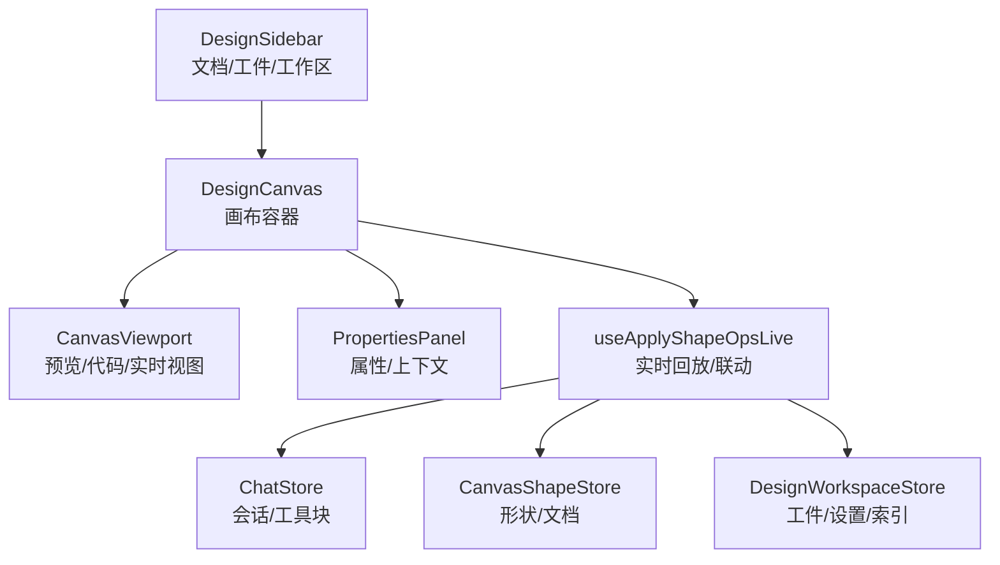
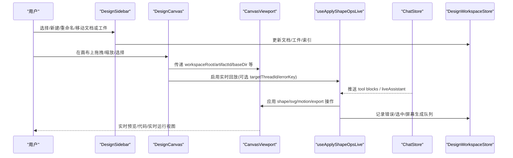
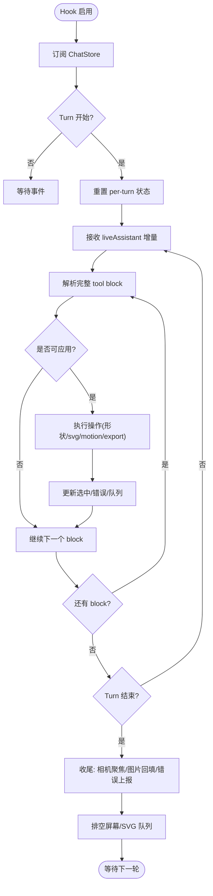
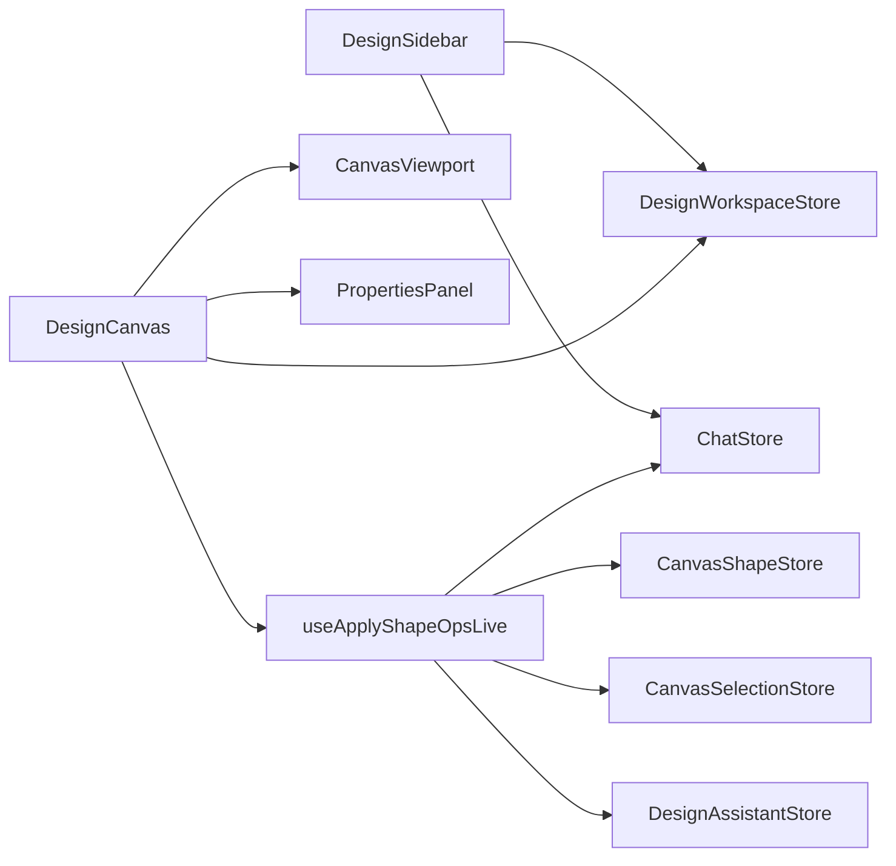

# 设计组件

<cite>
**本文引用的文件**
- [DESIGN_MODE.md](file://docs/DESIGN_MODE.md)
- [design-types.ts](file://src/renderer/src/design/design-types.ts)
- [design-workspace-store.ts](file://src/renderer/src/design/design-workspace-store.ts)
- [DesignCanvas.tsx](file://src/renderer/src/components/design/DesignCanvas.tsx)
- [DesignSidebar.tsx](file://src/renderer/src/components/design/DesignSidebar.tsx)
- [use-apply-shape-ops-live.ts](file://src/renderer/src/design/canvas/use-apply-shape-ops-live.ts)
</cite>

## 目录
1. [简介](#简介)
2. [项目结构](#项目结构)
3. [核心组件](#核心组件)
4. [架构总览](#架构总览)
5. [详细组件分析](#详细组件分析)
6. [依赖关系分析](#依赖关系分析)
7. [性能考量](#性能考量)
8. [故障排查指南](#故障排查指南)
9. [结论](#结论)
10. [附录](#附录)

## 简介
本文件面向 DeepSeek-GUI 的“设计模式”设计组件模块，聚焦以下目标：
- 说明设计模式下的 UI 组件架构，包括画布编辑、代码预览、差异对比等核心能力。
- 详细介绍设计组件的 Props 接口设计，涵盖画布数据、编辑状态、预览配置等参数定义。
- 解释交互逻辑：拖拽操作、实时预览、版本对比等实现方式。
- 阐述状态同步机制：双向绑定、冲突解决、撤销重做等特性。
- 提供开发规范与最佳实践：性能优化与用户体验提升建议。

设计模式是工作区的第三大模式（与 code/write 并列），以 AI 设计工作站为核心：描述需求 → 生成单文件可交互 HTML → 中心画布实时渲染 → 迭代快照 → 交付给编码 Agent 落地为代码，形成“需求→设计→计划→代码→验证”的闭环。

**章节来源**
- [DESIGN_MODE.md:1-40](file://docs/DESIGN_MODE.md#L1-L40)

## 项目结构
设计模式的前端由“三栏式”布局组成：左侧边栏（文档与工件树）、中间画布（预览/代码/实时视图）、右侧面板（属性/上下文/AI 助手）。关键路径如下：
- 类型与模型：`src/renderer/src/design/design-types.ts`
- 工作区状态与持久化：`src/renderer/src/design/design-workspace-store.ts`
- 画布容器与生命周期：`src/renderer/src/components/design/DesignCanvas.tsx`
- 侧边栏与文档管理：`src/renderer/src/components/design/DesignSidebar.tsx`
- 画布操作实时回放与联动：`src/renderer/src/design/canvas/use-apply-shape-ops-live.ts`

**图表来源**
- [DesignCanvas.tsx:1-173](file://src/renderer/src/components/design/DesignCanvas.tsx#L1-L173)
- [DesignSidebar.tsx:1-697](file://src/renderer/src/components/design/DesignSidebar.tsx#L1-L697)
- [use-apply-shape-ops-live.ts:1-614](file://src/renderer/src/design/canvas/use-apply-shape-ops-live.ts#L1-L614)
- [design-workspace-store.ts:1-697](file://src/renderer/src/design/design-workspace-store.ts#L1-L697)

**章节来源**
- [DESIGN_MODE.md:45-88](file://docs/DESIGN_MODE.md#L45-L88)

## 核心组件
- DesignCanvas：统一画布容器，负责装配 CanvasViewport、PropertiesPanel，注册屏幕创建工厂，监听 SVG 工件状态，并桥接“实施到代码”等外部动作。
- DesignSidebar：模式切换、工作区与文档树、工件分组与选择、新建/删除/重命名、文件夹管理、多工作区索引加载与激活。
- useApplyShapeOpsLive：订阅聊天流，将 agent 输出的 canvas/svg/motion/export 等操作实时应用到画布，维护选中、错误、屏幕生成队列与 SVG 队列。
- design-types：定义工件种类、视图模式、视口、节点位置/尺寸、原型链接、方向分支、基础角色等核心数据结构。
- design-workspace-store：Zustand 状态机，承载工作区根、文档/工件、活跃项、设置、设计系统哈希、并行页面状态、AI 助手开关等，并提供持久化与重水合。

**章节来源**
- [DesignCanvas.tsx:1-173](file://src/renderer/src/components/design/DesignCanvas.tsx#L1-L173)
- [DesignSidebar.tsx:1-697](file://src/renderer/src/components/design/DesignSidebar.tsx#L1-L697)
- [use-apply-shape-ops-live.ts:1-614](file://src/renderer/src/design/canvas/use-apply-shape-ops-live.ts#L1-L614)
- [design-types.ts:1-224](file://src/renderer/src/design/design-types.ts#L1-L224)
- [design-workspace-store.ts:1-697](file://src/renderer/src/design/design-workspace-store.ts#L1-L697)

## 架构总览
设计模式采用“组件 + Store + 回放”的分层架构：
- 组件层：DesignCanvas/DesignSidebar 负责 UI 与用户交互。
- 状态层：design-workspace-store 作为单一事实源，管理文档/工件/设置/索引，并与浏览器存储和文件系统交互。
- 回放层：useApplyShapeOpsLive 订阅聊天流，解析并应用 canvas/svg/motion/export 等操作，驱动画布实时更新。
- 集成点：通过 props 回调与上层 Workbench/Agent 集成（如实施到代码、元素上下文、运行时质量发现等）。

**图表来源**
- [DesignCanvas.tsx:1-173](file://src/renderer/src/components/design/DesignCanvas.tsx#L1-L173)
- [DesignSidebar.tsx:1-697](file://src/renderer/src/components/design/DesignSidebar.tsx#L1-L697)
- [use-apply-shape-ops-live.ts:1-614](file://src/renderer/src/design/canvas/use-apply-shape-ops-live.ts#L1-L614)
- [design-workspace-store.ts:1-697](file://src/renderer/src/design/design-workspace-store.ts#L1-L697)

## 详细组件分析

### 画布组件 DesignCanvas
职责
- 装配 CanvasViewport 与 PropertiesPanel。
- 注册屏幕创建工厂，使画布上的 add-screen 能同时创建关联 HTML 工件与画布帧。
- 监听 SVG 工件状态，支持 SVG 工件的生命周期。
- 暴露 onImplementDesign/onUseElementAsContext/onRuntimeQualityFindings 等回调，与上层集成。

Props 接口要点
- leftSidebarCollapsed/onToggleLeftSidebar：控制侧边栏折叠。
- busy：全局忙碌态，影响回放与生成调度。
- onOpenAgentSettings：打开代理设置。
- onImplementDesign：将当前工件提交到代码模式。
- onScreenCreated/onSvgCreated：处理新增 HTML/SVG 工件后的后续流程。
- onUseElementAsContext：将画布元素作为上下文传递给 AI。
- onRuntimeQualityFindings/onRequestQualityRepair：运行时质量发现与修复请求。

交互与数据流
- 首次挂载时确保存在“画布工件”，并注册屏幕创建工厂。
- 使用 useApplyShapeOpsLive 将 agent 输出的操作实时应用到画布，并在 turn 结束时触发屏幕 HTML 生成队列。
- 根据 activeDocumentId 计算 baseDir，用于 webview 预览与文件监听。

**章节来源**
- [DesignCanvas.tsx:1-173](file://src/renderer/src/components/design/DesignCanvas.tsx#L1-L173)

### 侧边栏组件 DesignSidebar
职责
- 模式切换（code/write/design）与工作区管理。
- 文档与工件树展示、分组、搜索、重命名、删除、移动至文件夹。
- 多工作区索引加载与激活，保持导航锁定避免并发冲突。
- 与画布选择/视口联动，快速定位到对应工件/帧。

关键行为
- activateWorkspace：安全切换工作区，重水合工件与刷新设计系统哈希。
- handleNewDocument/handleSelectDocument：新建/选择文档，必要时清空选择并聚焦输入框。
- moveDocumentToFolder/openFolderDialog/deleteFolder：文件夹 CRUD。
- resolveDesignSidebarNavigationLocks：基于工作区切换/绘制提交/代理运行状态决定导航锁定。

**章节来源**
- [DesignSidebar.tsx:1-697](file://src/renderer/src/components/design/DesignSidebar.tsx#L1-L697)

### 实时回放 Hook useApplyShapeOpsLive
职责
- 订阅 ChatStore，解析并应用 canvas/svg/motion/export 等操作。
- 维护 per-turn 游标，保证每个 block 仅执行一次。
- 管理屏幕生成队列与 SVG 队列，按空闲顺序串行执行。
- 收集错误并通过 setLastCanvasOpErrors 上报，供下一轮修正。

核心流程
- 流式节流：对 liveAssistant 增量进行节流合并，降低解析频率。
- 应用策略：优先应用 canvas ops；遇到 design_svg_create 则延迟到空闲后执行；motion 类操作直接执行；export 类操作转发给导出处理器。
- 屏幕生成：turn 结束后，批量收集新创建的 HTML 帧，进入 pendingScreens 队列，逐条派发 onScreenCreated。
- 图像回退：若本轮生成了图片，尝试回填到选中的 image 形状中。

**图表来源**
- [use-apply-shape-ops-live.ts:1-614](file://src/renderer/src/design/canvas/use-apply-shape-ops-live.ts#L1-L614)

**章节来源**
- [use-apply-shape-ops-live.ts:1-614](file://src/renderer/src/design/canvas/use-apply-shape-ops-live.ts#L1-L614)

### 类型与数据模型
- 工件种类：html、canvas、svg。
- 画布视图：preview/code/live。
- 视口：mobile/tablet/desktop，对应不同宽度。
- 工件节点：包含 x/y/width/height、sizeMode、favorite、boardHidden、boardHiddenVersionIds、viewMode。
- 原型链接：targetTitle/targetArtifactId/href/label。
- 方向分支：active/accepted/archived。
- 基础角色：design-system/logo。
- 文档：id/title/order/folderId/artifacts/activeArtifactId。

这些类型贯穿侧边栏、画布、回放与持久化，确保跨组件一致的数据契约。

**章节来源**
- [design-types.ts:1-224](file://src/renderer/src/design/design-types.ts#L1-L224)

### 状态管理与持久化
- 工作区根切换：清理并重置临时状态，重新重水合工件与索引。
- 文档/工件 CRUD：创建、重命名、移动、删除，均会持久化索引与元数据。
- 设计系统哈希：读取 PROJECT_DESIGN_MD_PATH 并计算哈希，用于检测代码漂移。
- 设置加载：从运行时获取设计设置，合并本地持久化偏好（视口、视图、AI 助手等）。
- 并行页面状态：支持多页并行运行与状态跟踪。

**章节来源**
- [design-workspace-store.ts:1-697](file://src/renderer/src/design/design-workspace-store.ts#L1-L697)

## 依赖关系分析
- DesignCanvas 依赖：
  - design-workspace-store：读取 workspaceRoot/artifacts/activeDocumentId 等。
  - canvas 子组件：CanvasViewport、PropertiesPanel。
  - useApplyShapeOpsLive：实时回放与联动。
  - 外部回调：onImplementDesign/onScreenCreated/onSvgCreated 等。
- DesignSidebar 依赖：
  - design-workspace-store：文档/工件/设置/索引。
  - chat-store：线程状态与忙碌态。
  - 画布选择/视口 store：联动选中与缩放。
- useApplyShapeOpsLive 依赖：
  - chat-store：blocks/liveAssistant/currentTurnId/busy。
  - canvas-shape-store：document/objects/updateShape。
  - canvas-selection-store：select 操作。
  - design-workspace-store：artifacts 列表（用于过滤 HTML 工件）。
  - design-assistant-store：markAiAffected。

**图表来源**
- [DesignCanvas.tsx:1-173](file://src/renderer/src/components/design/DesignCanvas.tsx#L1-L173)
- [DesignSidebar.tsx:1-697](file://src/renderer/src/components/design/DesignSidebar.tsx#L1-L697)
- [use-apply-shape-ops-live.ts:1-614](file://src/renderer/src/design/canvas/use-apply-shape-ops-live.ts#L1-L614)
- [design-workspace-store.ts:1-697](file://src/renderer/src/design/design-workspace-store.ts#L1-L697)

**章节来源**
- [DesignCanvas.tsx:1-173](file://src/renderer/src/components/design/DesignCanvas.tsx#L1-L173)
- [DesignSidebar.tsx:1-697](file://src/renderer/src/components/design/DesignSidebar.tsx#L1-L697)
- [use-apply-shape-ops-live.ts:1-614](file://src/renderer/src/design/canvas/use-apply-shape-ops-live.ts#L1-L614)
- [design-workspace-store.ts:1-697](file://src/renderer/src/design/design-workspace-store.ts#L1-L697)

## 性能考量
- 流式节流：useApplyShapeOpsLive 对 liveAssistant 增量进行节流合并，减少频繁解析与重绘。
- 批处理与去重：per-turn 游标与 appliedToolBlockIds 保证每个 block 仅执行一次，避免重复应用。
- 队列串行化：屏幕生成与 SVG 创建在空闲时串行执行，避免抢占共享线程资源。
- 视口与选中优化：仅在首次构建时自动聚焦，后续保持相机稳定，减少不必要的视口跳动。
- 设置与索引持久化：变更集中写入，避免频繁 IO；切换工作区时一次性重水合。
- 图片回填：在 turn 结束时尝试回填生成的图片到选中形状，减少额外请求。

[本节为通用性能建议，不直接分析具体文件]

## 故障排查指南
常见问题与定位思路
- 画布无响应：检查 useApplyShapeOpsLive 是否启用、targetThreadId 是否正确、errorKey 是否设置；查看 setLastCanvasOpErrors 的错误信息。
- 屏幕未生成：确认 turn 结束后 pendingScreens 是否被排空；检查 onScreenCreated 是否被调用；核对 HTML 工件是否存在。
- SVG 未创建：关注 applySvgToolBlock 的 defer 与 drain 逻辑；确认当前线程空闲且未被 busy/runtime 阻塞。
- 工作区切换异常：检查 activateWorkspace 的重水合流程与设计系统哈希刷新；确认 settingsLoaded 标志位。
- 设计系统不一致：比较 designSystemHash 与已实现的 implementedDesignSystemHash，出现 ⚠ 表示代码漂移。

**章节来源**
- [use-apply-shape-ops-live.ts:1-614](file://src/renderer/src/design/canvas/use-apply-shape-ops-live.ts#L1-L614)
- [design-workspace-store.ts:1-697](file://src/renderer/src/design/design-workspace-store.ts#L1-L697)
- [DESIGN_MODE.md:131-153](file://docs/DESIGN_MODE.md#L131-L153)

## 结论
设计组件模块以清晰的三层架构（组件/状态/回放）实现了“描述→生成→预览→迭代→交付”的设计闭环。通过严格的类型契约、稳健的状态管理与高效的实时回放机制，提供了流畅的画布编辑体验与可靠的版本管理能力。结合“设计↔代码”的双向集成与差异对比，形成了强大的设计与实现协同能力。

[本节为总结性内容，不直接分析具体文件]

## 附录
- 开发规范建议
  - 明确 Props 边界：对外暴露最小必要接口，内部状态尽量通过 Store 管理。
  - 使用 Store 作为单一事实源：避免分散状态导致不一致。
  - 回放逻辑幂等：确保同一 block 多次触发不会产生副作用。
  - 错误上报与恢复：及时记录错误并提示，提供重试或修复入口。
  - 性能优先：节流、批处理、队列串行化，避免主线程阻塞。
  - 可测试性：为关键流程编写单元测试与集成测试，覆盖正常与异常路径。

[本节为通用指导，不直接分析具体文件]