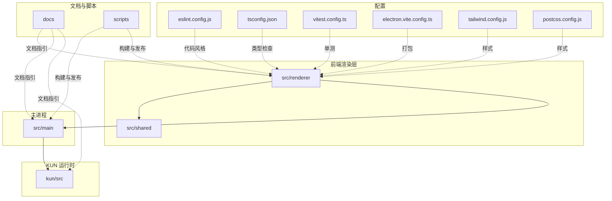
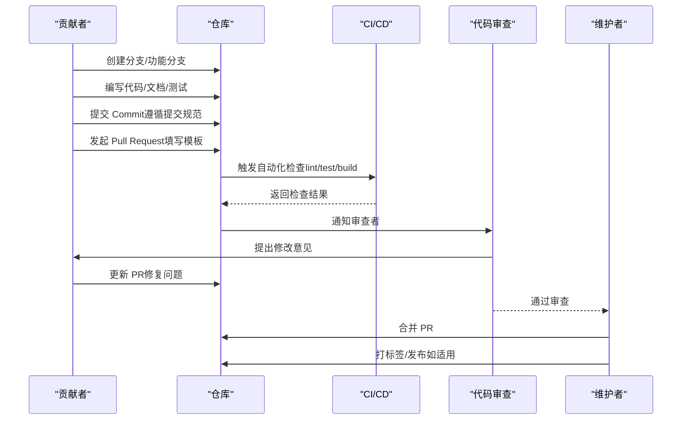
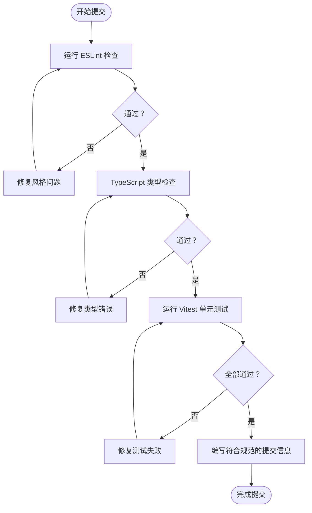
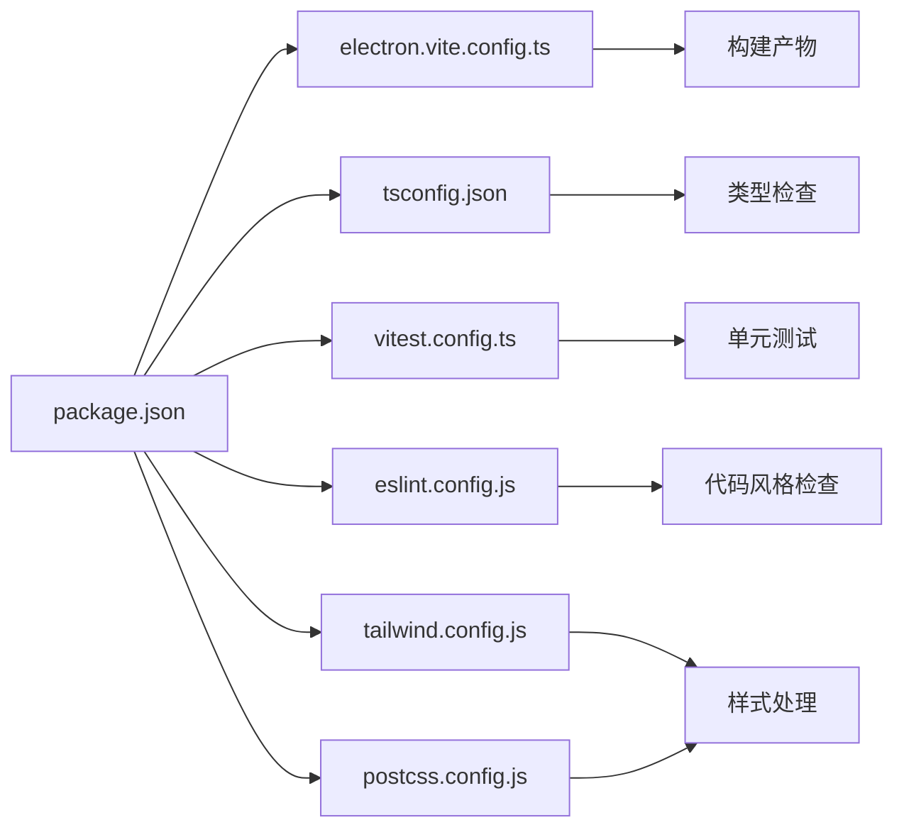

# 贡献指南

<cite>
**本文引用的文件**
- [CODE_OF_CONDUCT.md](file://CODE_OF_CONDUCT.md)
- [SECURITY.md](file://SECURITY.md)
- [eslint.config.js](file://eslint.config.js)
- [.github/pull_request_template.md](file://.github/pull_request_template.md)
- [.github/ISSUE_TEMPLATE](file://.github/ISSUE_TEMPLATE)
- [docs/CONTRIBUTING.md](file://docs/CONTRIBUTING.md)
- [docs/DEVELOPMENT.md](file://docs/DEVELOPMENT.md)
- [docs/kun-contributing.md](file://docs/kun-contributing.md)
- [package.json](file://package.json)
- [tsconfig.json](file://tsconfig.json)
- [vitest.config.ts](file://vitest.config.ts)
- [electron.vite.config.ts](file://electron.vite.config.ts)
- [tailwind.config.js](file://tailwind.config.js)
- [postcss.config.js](file://postcss.config.js)
</cite>

## 目录
1. [简介](#简介)
2. [项目结构](#项目结构)
3. [核心组件](#核心组件)
4. [架构总览](#架构总览)
5. [详细组件分析](#详细组件分析)
6. [依赖分析](#依赖分析)
7. [性能考虑](#性能考虑)
8. [故障排查指南](#故障排查指南)
9. [结论](#结论)
10. [附录](#附录)

## 简介
本贡献指南面向所有希望参与 DeepSeek GUI 项目的开发者与贡献者，涵盖代码贡献流程、代码风格与提交规范、代码审查流程、分支管理策略、功能分支创建与 Pull Request 提交、社区行为准则与沟通渠道、问题报告方式、文档与本地化贡献、测试贡献要求，以及新贡献者入门与高级贡献者扩展路径等。本指南以仓库内现有文档与配置为依据，确保内容可执行且与实际工程实践一致。

## 项目结构
DeepSeek GUI 是一个基于 Electron/Vite 的桌面应用，前端采用 React + TypeScript，后端集成 KUN 运行时能力，并通过多模块划分实现清晰的职责边界。主要目录与职责概览如下：
- src/renderer：React 前端应用源码，包含聊天、写作、计划、日程等功能模块与组件库。
- src/main：Electron 主进程逻辑，IPC、运行时集成、打包与更新等。
- src/shared：跨主/渲染进程共享的类型与工具。
- kun/src：KUN 核心运行时与适配器（会话、线程、工具、缓存、事件总线等）。
- docs：项目文档，含贡献、开发、架构等说明。
- scripts：发布与打包脚本。
- .github：Issue 模板与 PR 模板。
- 配置文件：ESLint、TypeScript、Vitest、TailwindCSS、PostCSS、Electron-Vite 等。

**图表来源**
- [package.json](file://package.json)
- [electron.vite.config.ts](file://electron.vite.config.ts)
- [tsconfig.json](file://tsconfig.json)
- [vitest.config.ts](file://vitest.config.ts)
- [tailwind.config.js](file://tailwind.config.js)
- [postcss.config.js](file://postcss.config.js)

**章节来源**
- [package.json](file://package.json)
- [electron.vite.config.ts](file://electron.vite.config.ts)
- [tsconfig.json](file://tsconfig.json)
- [vitest.config.ts](file://vitest.config.ts)
- [tailwind.config.js](file://tailwind.config.js)
- [postcss.config.js](file://postcss.config.js)

## 核心组件
- 行为准则与安全政策：社区成员需遵守行为准则；涉及安全问题请遵循安全披露流程。
- 代码风格与质量：通过 ESLint 统一规则，结合 TypeScript 类型检查与 Vitest 单元测试保障质量。
- 开发环境与构建：使用 Electron-Vite 进行开发与打包，TailwindCSS 与 PostCSS 处理样式。
- 文档与贡献：项目提供英文与中文贡献文档，覆盖开发流程、架构与工具链说明。

**章节来源**
- [CODE_OF_CONDUCT.md](file://CODE_OF_CONDUCT.md)
- [SECURITY.md](file://SECURITY.md)
- [eslint.config.js](file://eslint.config.js)
- [tsconfig.json](file://tsconfig.json)
- [vitest.config.ts](file://vitest.config.ts)
- [electron.vite.config.ts](file://electron.vite.config.ts)
- [tailwind.config.js](file://tailwind.config.js)
- [postcss.config.js](file://postcss.config.js)
- [docs/CONTRIBUTING.md](file://docs/CONTRIBUTING.md)
- [docs/DEVELOPMENT.md](file://docs/DEVELOPMENT.md)
- [docs/kun-contributing.md](file://docs/kun-contributing.md)

## 架构总览
贡献工作流围绕“本地开发 → 测试 → 提交 → 审查 → 合并”展开，结合 Issue 模板与 PR 模板规范问题与变更范围，确保高质量交付。

**图表来源**
- [.github/pull_request_template.md](file://.github/pull_request_template.md)
- [.github/ISSUE_TEMPLATE](file://.github/ISSUE_TEMPLATE)
- [docs/CONTRIBUTING.md](file://docs/CONTRIBUTING.md)
- [docs/DEVELOPMENT.md](file://docs/DEVELOPMENT.md)

## 详细组件分析

### 分支管理策略与功能分支创建
- 建议采用功能分支模型：从主分支派生功能分支进行开发，完成后合并回主分支。
- 分支命名建议：使用清晰语义的前缀与描述，便于识别用途与作者。
- 合并策略：优先使用 Squash Merge 或 Rebase Merge 保持提交历史整洁，具体以仓库约定为准。

**章节来源**
- [docs/CONTRIBUTING.md](file://docs/CONTRIBUTING.md)
- [docs/DEVELOPMENT.md](file://docs/DEVELOPMENT.md)

### 提交规范与代码风格
- 提交信息格式：建议采用“type(scope): subject”的结构，配合简短描述与必要上下文。
- 代码风格：统一使用 ESLint 规则，确保一致性与可读性。
- 类型检查：通过 TypeScript 配置进行严格类型约束。
- 样式规范：TailwindCSS 与 PostCSS 配合，保证样式一致性与可维护性。

**图表来源**
- [eslint.config.js](file://eslint.config.js)
- [tsconfig.json](file://tsconfig.json)
- [vitest.config.ts](file://vitest.config.ts)

**章节来源**
- [eslint.config.js](file://eslint.config.js)
- [tsconfig.json](file://tsconfig.json)
- [vitest.config.ts](file://vitest.config.ts)
- [tailwind.config.js](file://tailwind.config.js)
- [postcss.config.js](file://postcss.config.js)

### Pull Request 提交流程
- 使用 PR 模板：在创建 PR 时按模板填写标题、描述、变更范围、影响面、测试情况等。
- 自动化检查：PR 将触发 Lint、类型检查与单元测试，需全部通过。
- 代码审查：至少一名维护者审查，根据反馈进行修改直至通过。
- 合并与发布：审查通过后由维护者合并，必要时打标签并进入发布流程。

**章节来源**
- [.github/pull_request_template.md](file://.github/pull_request_template.md)
- [docs/CONTRIBUTING.md](file://docs/CONTRIBUTING.md)

### 问题报告与沟通渠道
- 问题模板：使用 GitHub Issue 模板，提供复现步骤、期望与实际结果、环境信息等。
- 沟通渠道：遵循行为准则，通过 Issues/讨论区进行技术沟通，避免敏感信息外泄。

**章节来源**
- [.github/ISSUE_TEMPLATE](file://.github/ISSUE_TEMPLATE)
- [CODE_OF_CONDUCT.md](file://CODE_OF_CONDUCT.md)

### 文档贡献与本地化
- 文档贡献：遵循贡献文档中的流程，确保文档与代码同步更新。
- 本地化：前端资源位于 locales 目录，新增语言需补充对应 JSON 文件并验证加载。

**章节来源**
- [docs/CONTRIBUTING.md](file://docs/CONTRIBUTING.md)
- [docs/DEVELOPMENT.md](file://docs/DEVELOPMENT.md)

### 测试贡献要求
- 单元测试：使用 Vitest，覆盖关键逻辑与边界条件。
- 测试配置：遵循项目提供的 Vitest 配置，确保测试环境与覆盖率统计一致。
- 端到端与集成测试：按需补充，确保核心流程稳定。

**章节来源**
- [vitest.config.ts](file://vitest.config.ts)
- [docs/DEVELOPMENT.md](file://docs/DEVELOPMENT.md)

### 新贡献者入门与高级贡献者扩展路径
- 新手友好：从最小可运行改动入手，阅读贡献与开发文档，逐步熟悉架构与工具链。
- 高级路径：深入 KUN 运行时、IPC 通信、打包与发布流程，承担模块负责人角色。

**章节来源**
- [docs/CONTRIBUTING.md](file://docs/CONTRIBUTING.md)
- [docs/DEVELOPMENT.md](file://docs/DEVELOPMENT.md)
- [docs/kun-contributing.md](file://docs/kun-contributing.md)

## 依赖分析
项目依赖与工具链通过 package.json 管理，开发与构建工具链如下：
- 开发与构建：Electron-Vite、Vite、TypeScript
- 代码质量：ESLint、Prettier（如启用）
- 样式：TailwindCSS、PostCSS
- 测试：Vitest
- 打包与分发：Electron Builder（配置于构建脚本）

**图表来源**
- [package.json](file://package.json)
- [electron.vite.config.ts](file://electron.vite.config.ts)
- [tsconfig.json](file://tsconfig.json)
- [vitest.config.ts](file://vitest.config.ts)
- [eslint.config.js](file://eslint.config.js)
- [tailwind.config.js](file://tailwind.config.js)
- [postcss.config.js](file://postcss.config.js)

**章节来源**
- [package.json](file://package.json)
- [electron.vite.config.ts](file://electron.vite.config.ts)
- [tsconfig.json](file://tsconfig.json)
- [vitest.config.ts](file://vitest.config.ts)
- [eslint.config.js](file://eslint.config.js)
- [tailwind.config.js](file://tailwind.config.js)
- [postcss.config.js](file://postcss.config.js)

## 性能考虑
- 构建性能：合理拆分包与懒加载，减少首屏体积；利用缓存与并行任务提升构建效率。
- 运行时性能：优化 IPC 通信频率与数据量，避免阻塞主线程；对重计算进行缓存与节流。
- 样式性能：按需引入样式，避免全局污染；使用原子类与编译优化减少运行时开销。

## 故障排查指南
- 本地启动失败：检查 Node 版本与依赖安装，确认开发服务器端口未被占用。
- 类型错误：根据 TypeScript 报错逐项修正，必要时补充类型声明或调整接口定义。
- 测试失败：定位失败用例，补充或修正断言；确保测试环境变量与快照一致。
- 样式异常：检查 Tailwind 与 PostCSS 配置，确认类名拼写与作用域正确。
- 安全问题：遵循安全披露流程，避免在公开渠道讨论漏洞细节。

**章节来源**
- [SECURITY.md](file://SECURITY.md)
- [tsconfig.json](file://tsconfig.json)
- [vitest.config.ts](file://vitest.config.ts)
- [tailwind.config.js](file://tailwind.config.js)
- [postcss.config.js](file://postcss.config.js)

## 结论
本贡献指南基于仓库现有文档与配置，明确了代码贡献流程、风格与规范、审查与合并流程、分支策略、问题报告与沟通渠道、文档与本地化贡献、测试要求，以及新老贡献者的成长路径。建议贡献者在提交前通读相关文档，确保变更符合项目标准与最佳实践。

## 附录
- 社区行为准则与安全政策：请遵守行为准则与安全披露流程。
- 开发与贡献文档：参考贡献与开发文档获取更详细的流程与架构说明。

**章节来源**
- [CODE_OF_CONDUCT.md](file://CODE_OF_CONDUCT.md)
- [SECURITY.md](file://SECURITY.md)
- [docs/CONTRIBUTING.md](file://docs/CONTRIBUTING.md)
- [docs/DEVELOPMENT.md](file://docs/DEVELOPMENT.md)
- [docs/kun-contributing.md](file://docs/kun-contributing.md)