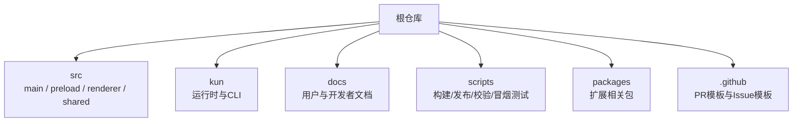
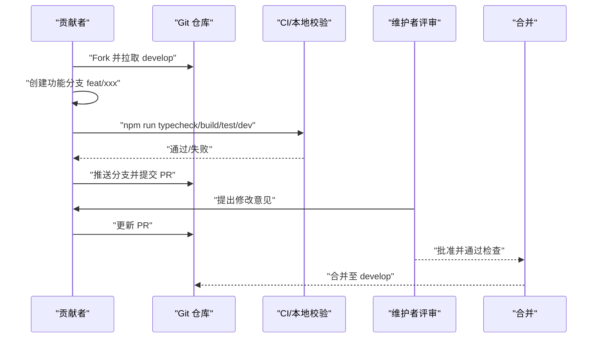
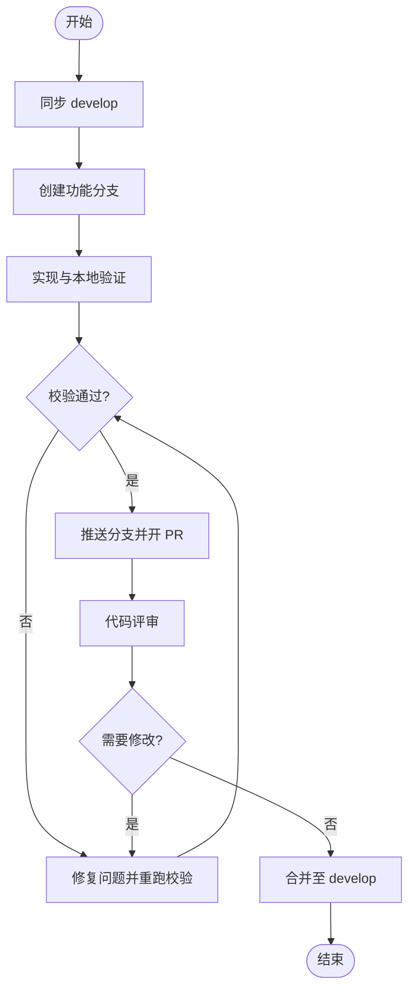
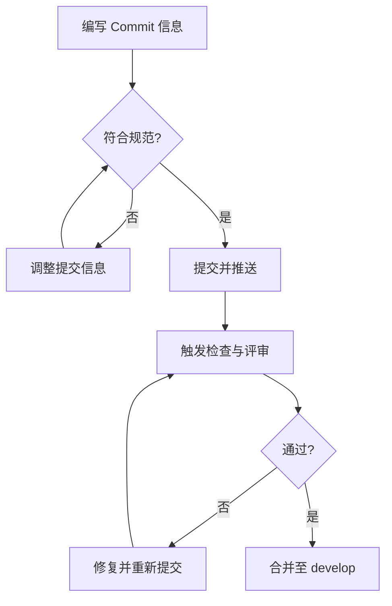
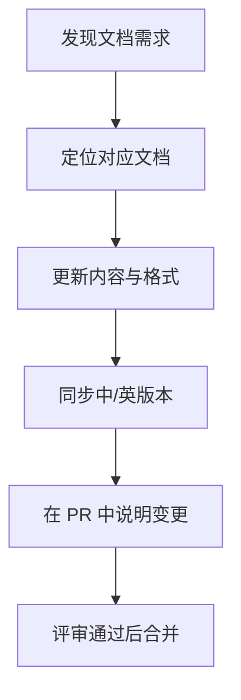
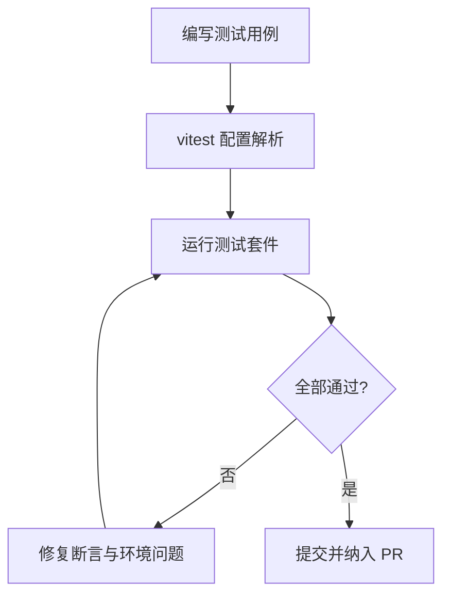
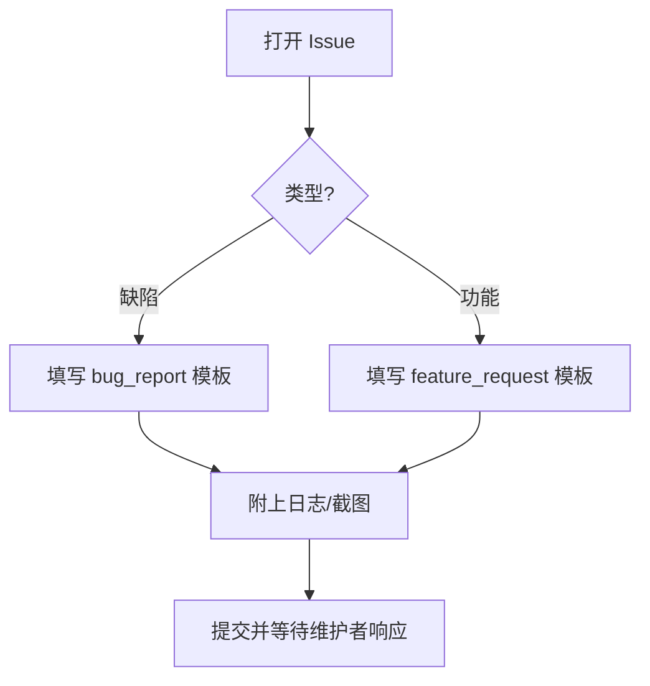
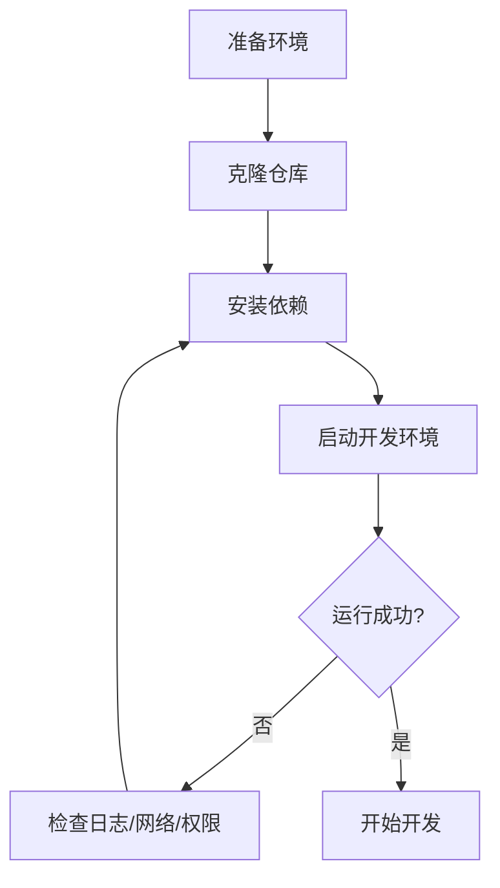
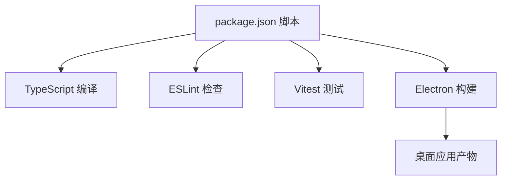

# 贡献指南

<cite>
**本文引用的文件**
- [docs/CONTRIBUTING.md](file://docs/CONTRIBUTING.md)
- [docs/CONTRIBUTING.zh-CN.md](file://docs/CONTRIBUTING.zh-CN.md)
- [docs/DEVELOPMENT.md](file://docs/DEVELOPMENT.md)
- [docs/DEVELOPMENT.zh-CN.md](file://docs/DEVELOPMENT.zh-CN.md)
- [README.md](file://README.md)
- [package.json](file://package.json)
- [eslint.config.js](file://eslint.config.js)
- [vitest.config.ts](file://vitest.config.ts)
- [.github/pull_request_template.md](file://.github/pull_request_template.md)
- [.github/ISSUE_TEMPLATE/bug_report.yml](file://.github/ISSUE_TEMPLATE/bug_report.yml)
- [.github/ISSUE_TEMPLATE/feature_request.yml](file://.github/ISSUE_TEMPLATE/feature_request.yml)
- [CODE_OF_CONDUCT.md](file://CODE_OF_CONDUCT.md)
- [CLA.md](file://CLA.md)
</cite>

## 目录
1. [简介](#简介)
2. [项目结构](#项目结构)
3. [核心组件](#核心组件)
4. [架构总览](#架构总览)
5. [详细组件分析](#详细组件分析)
6. [依赖分析](#依赖分析)
7. [性能考虑](#性能考虑)
8. [故障排查指南](#故障排查指南)
9. [结论](#结论)
10. [附录](#附录)

## 简介
本指南面向希望为 DeepSeek-GUI（Kun）贡献代码、文档与问题的开发者，提供从 Fork 仓库到发起 Pull Request 的完整流程说明；同时给出编码规范、提交流程、文档贡献方式、测试要求、Issue 报告规范、开发环境搭建步骤以及社区行为准则与沟通渠道。目标是让不同背景的贡献者都能高效、高质量地参与协作。

## 项目结构
本项目采用多工作区与分层组织：
- 根目录包含 Electron GUI 应用、脚本与配置
- src 下分为 main、preload、renderer、shared 等模块
- kun 子工程提供运行时与 CLI
- docs 存放用户与开发者文档
- scripts 包含构建、发布、校验与冒烟测试脚本
- packages 包含扩展相关包

```mermaid
graph TB
A["根仓库"] --> B["src<br/>main / preload / renderer / shared"]
A --> C["kun<br/>运行时与CLI"]
A --> D["docs<br/>用户与开发者文档"]
A --> E["scripts<br/>构建/发布/校验/冒烟测试"]
A --> F["packages<br/>扩展相关包"]
A --> G[".github<br/>PR模板与Issue模板"]
```

**章节来源**
- [README.md:201-243](file://README.md#L201-L243)
- [package.json:14-88](file://package.json#L14-L88)

## 核心组件
- 分支策略与目标分支：日常集成分支为 develop，稳定发布分支为 master；PR 默认合并至 develop。
- 本地开发与验证：通过 npm 脚本完成类型检查、构建、测试与开发运行。
- PR 标准与评审：强调聚焦、可审阅、有验证支撑、必要时附带媒体与测试。
- Commit 规范：遵循 Conventional Commits。
- Issue 模板：缺陷反馈与功能建议均有结构化模板。
- 行为准则与许可：遵守社区行为准则，外部贡献需接受 CLA。

**章节来源**
- [docs/CONTRIBUTING.zh-CN.md:26-46](file://docs/CONTRIBUTING.zh-CN.md#L26-L46)
- [docs/DEVELOPMENT.zh-CN.md:7-22](file://docs/DEVELOPMENT.zh-CN.md#L7-L22)
- [docs/CONTRIBUTING.zh-CN.md:154-176](file://docs/CONTRIBUTING.zh-CN.md#L154-L176)
- [.github/ISSUE_TEMPLATE/bug_report.yml:1-105](file://.github/ISSUE_TEMPLATE/bug_report.yml#L1-L105)
- [.github/ISSUE_TEMPLATE/feature_request.yml:1-46](file://.github/ISSUE_TEMPLATE/feature_request.yml#L1-L46)
- [CODE_OF_CONDUCT.md:1-76](file://CODE_OF_CONDUCT.md#L1-L76)
- [CLA.md:1-86](file://CLA.md#L1-L86)

## 架构总览
下图展示一次典型贡献从本地开发到合并的流程，包括分支管理、本地验证、提交与 PR 评审。

```mermaid
sequenceDiagram
participant Dev as "贡献者"
participant Git as "Git 仓库"
participant CI as "CI/本地校验"
participant Review as "维护者评审"
participant Merge as "合并"
Dev->>Git : "Fork 并拉取 develop"
Dev->>Dev : "创建功能分支 feat/xxx"
Dev->>CI : "npm run typecheck/build/test/dev"
CI-->>Dev : "通过/失败"
Dev->>Git : "推送分支并提交 PR"
Review->>Dev : "提出修改意见"
Dev->>Git : "更新 PR"
Review-->>Merge : "批准并通过检查"
Merge-->>Git : "合并至 develop"
```

**图表来源**
- [docs/DEVELOPMENT.zh-CN.md:14-22](file://docs/DEVELOPMENT.zh-CN.md#L14-L22)
- [docs/DEVELOPMENT.zh-CN.md:47-60](file://docs/DEVELOPMENT.zh-CN.md#L47-L60)
- [package.json:58-88](file://package.json#L58-L88)

## 详细组件分析

### 贡献流程（Fork、分支、提交、PR）
- Fork 仓库并在本地克隆
- 切换到 develop 并同步最新变更
- 从 develop 创建短期功能分支（如 feat/short-description）
- 在本地完成实现与验证（类型检查、构建、测试、开发运行）
- 推送分支并发起指向 develop 的 PR
- 根据评审意见迭代，直至通过检查并获得批准
- 由维护者合并至 develop；稳定版本由维护者从 develop 合入 master

```mermaid
flowchart TD
Start(["开始"]) --> Sync["同步 develop"]
Sync --> Branch["创建功能分支"]
Branch --> Implement["实现与本地验证"]
Implement --> Check{"校验通过?"}
Check -- 否 --> Fix["修复问题并重跑校验"]
Fix --> Check
Check -- 是 --> Push["推送分支并开 PR"]
Push --> Review["代码评审"]
Review --> Iterate{"需要修改?"}
Iterate -- 是 --> Fix
Iterate -- 否 --> Merge["合并至 develop"]
Merge --> End(["结束"])
```

**章节来源**
- [docs/DEVELOPMENT.zh-CN.md:14-22](file://docs/DEVELOPMENT.zh-CN.md#L14-L22)
- [docs/DEVELOPMENT.zh-CN.md:24-45](file://docs/DEVELOPMENT.zh-CN.md#L24-L45)
- [docs/DEVELOPMENT.zh-CN.md:47-60](file://docs/DEVELOPMENT.zh-CN.md#L47-L60)
- [docs/CONTRIBUTING.zh-CN.md:26-46](file://docs/CONTRIBUTING.zh-CN.md#L26-L46)

### 代码规范（风格、命名、注释、类型）
- 代码风格与规则：使用 ESLint + TypeScript ESLint，忽略构建产物与依赖目录；对 React Hooks 启用规则；关闭部分过于严格的规则以保持可读性。
- 类型系统：TypeScript 为主，通过 tsc 进行类型检查；确保跨平台一致性与可维护性。
- 命名约定：遵循现有项目结构与命名方式，保持统一与清晰。
- 注释规范：以可读性优先，避免过度注释；复杂逻辑应补充必要说明。
- 安全与隐私：禁止提交密钥、Token、API Key 或机器特定路径。

```mermaid
graph LR
A["源代码 .ts/.tsx"] --> B["ESLint 检查"]
B --> C["TypeScript 类型检查"]
C --> D["构建产物"]
D --> E["测试与运行"]
```

**图表来源**
- [eslint.config.js:1-64](file://eslint.config.js#L1-L64)
- [package.json:84-88](file://package.json#L84-L88)

**章节来源**
- [eslint.config.js:1-64](file://eslint.config.js#L1-L64)
- [package.json:84-88](file://package.json#L84-L88)
- [docs/CONTRIBUTING.zh-CN.md:89-97](file://docs/CONTRIBUTING.zh-CN.md#L89-L97)

### 提交流程（Commit 消息、审查要求、合并策略）
- Commit 消息：遵循 Conventional Commits，如 feat/fix/docs/refactor/style/chore。
- 审查要求：关注正确性、回归风险、产品品味、可维护性、架构一致性、文档完整性与验证步骤是否真实执行。
- 合并策略：PR 默认合并至 develop；master 仅用于稳定发布，由维护者从 develop 合入。

```mermaid
flowchart TD
A["编写 Commit 信息"] --> B{"符合规范?"}
B -- 否 --> C["调整提交信息"]
C --> B
B -- 是 --> D["提交并推送"]
D --> E["触发检查与评审"]
E --> F{"通过?"}
F -- 否 --> G["修复并重新提交"]
G --> E
F -- 是 --> H["合并至 develop"]
```

**图表来源**
- [docs/CONTRIBUTING.zh-CN.md:154-176](file://docs/CONTRIBUTING.zh-CN.md#L154-L176)
- [docs/DEVELOPMENT.zh-CN.md:130-138](file://docs/DEVELOPMENT.zh-CN.md#L130-L138)

**章节来源**
- [docs/CONTRIBUTING.zh-CN.md:154-176](file://docs/CONTRIBUTING.zh-CN.md#L154-L176)
- [docs/DEVELOPMENT.zh-CN.md:130-138](file://docs/DEVELOPMENT.zh-CN.md#L130-L138)

### 文档贡献方式（结构、写作规范、翻译流程）
- 文档位置：README、docs 下的用户与开发者文档、贡献指南本身。
- 写作规范：当改动影响使用方式、安装方式或流程时，同步更新相关文档；保持中英文用词一致。
- 翻译流程：尽量同步更新英文与中文内容，确保术语一致。

```mermaid
flowchart TD
A["发现文档需求"] --> B["定位对应文档"]
B --> C["更新内容与格式"]
C --> D["同步中/英版本"]
D --> E["在 PR 中说明变更"]
E --> F["评审通过后合并"]
```

**图表来源**
- [docs/CONTRIBUTING.zh-CN.md:98-105](file://docs/CONTRIBUTING.zh-CN.md#L98-L105)
- [docs/DEVELOPMENT.zh-CN.md:119-129](file://docs/DEVELOPMENT.zh-CN.md#L119-L129)

**章节来源**
- [docs/CONTRIBUTING.zh-CN.md:98-105](file://docs/CONTRIBUTING.zh-CN.md#L98-L105)
- [docs/DEVELOPMENT.zh-CN.md:119-129](file://docs/DEVELOPMENT.zh-CN.md#L119-L129)

### 测试要求（新增测试、覆盖率、环境配置）
- 测试框架：Vitest，配置文件定义别名、环境与测试范围。
- 命令：npm run test 运行全部测试；npm run test:kun 运行运行时测试；npm run test:watch 监听模式。
- 环境：Node 环境，禁用系统凭据存储以便测试稳定性；Windows 下限制并发与超时。
- 覆盖率：当前仓库未显式配置覆盖率阈值，建议在涉及逻辑变更时补充单元测试并确保通过。

```mermaid
flowchart TD
A["编写测试用例"] --> B["vitest 配置解析"]
B --> C["运行测试套件"]
C --> D{"全部通过?"}
D -- 否 --> E["修复断言与环境问题"]
E --> C
D -- 是 --> F["提交并纳入 PR"]
```

**图表来源**
- [vitest.config.ts:1-20](file://vitest.config.ts#L1-L20)
- [package.json:59-62](file://package.json#L59-L62)

**章节来源**
- [vitest.config.ts:1-20](file://vitest.config.ts#L1-L20)
- [package.json:59-62](file://package.json#L59-L62)
- [docs/CONTRIBUTING.zh-CN.md:60-71](file://docs/CONTRIBUTING.zh-CN.md#L60-L71)

### Issue 报告规范（问题描述、复现步骤、期望行为）
- 缺陷反馈：使用 bug_report.yml 模板，包含问题概述、复现步骤、期望与实际行为、版本与操作系统、日志与截图。
- 功能建议：使用 feature_request.yml 模板，包含问题或机会、建议方案、替代方案与补充信息。
- 日志位置：提供 macOS/Windows/Linux 的日志路径提示，便于定位问题。

```mermaid
flowchart TD
A["打开 Issue"] --> B{"类型?"}
B -- 缺陷 --> C["填写 bug_report 模板"]
B -- 功能 --> D["填写 feature_request 模板"]
C --> E["附上日志/截图"]
D --> E
E --> F["提交并等待维护者响应"]
```

**图表来源**
- [.github/ISSUE_TEMPLATE/bug_report.yml:1-105](file://.github/ISSUE_TEMPLATE/bug_report.yml#L1-L105)
- [.github/ISSUE_TEMPLATE/feature_request.yml:1-46](file://.github/ISSUE_TEMPLATE/feature_request.yml#L1-L46)

**章节来源**
- [.github/ISSUE_TEMPLATE/bug_report.yml:1-105](file://.github/ISSUE_TEMPLATE/bug_report.yml#L1-L105)
- [.github/ISSUE_TEMPLATE/feature_request.yml:1-46](file://.github/ISSUE_TEMPLATE/feature_request.yml#L1-L46)
- [docs/CONTRIBUTING.zh-CN.md:177-187](file://docs/CONTRIBUTING.zh-CN.md#L177-L187)

### 开发环境搭建（步骤与常见问题）
- 环境要求：Node.js 22.19+；npm 随 Node 安装；至少配置一个受支持的模型 Provider。
- 快速开始：克隆仓库、安装依赖、启动开发环境；也可单独启动 TUI。
- 常用命令：dev、typecheck、lint、test、build、dist 系列打包命令。
- 网络优化：中国大陆可使用镜像加速依赖安装。

```mermaid
flowchart TD
A["准备环境"] --> B["克隆仓库"]
B --> C["安装依赖"]
C --> D["启动开发环境"]
D --> E{"运行成功?"}
E -- 否 --> F["检查日志/网络/权限"]
F --> C
E -- 是 --> G["开始开发"]
```

**图表来源**
- [README.md:201-228](file://README.md#L201-L228)
- [package.json:14-88](file://package.json#L14-L88)

**章节来源**
- [README.md:201-228](file://README.md#L201-L228)
- [package.json:14-88](file://package.json#L14-L88)

### 社区行为准则与沟通渠道
- 行为准则：倡导尊重、包容、建设性反馈；明确不可接受行为与执行措施。
- 沟通渠道：通过 Issue 与 PR 进行沟通；重大或高风险改动先与维护者对齐方向。
- 许可协议：外部贡献基于 CLA，提交即同意授权条款。

**章节来源**
- [CODE_OF_CONDUCT.md:1-76](file://CODE_OF_CONDUCT.md#L1-L76)
- [docs/CONTRIBUTING.zh-CN.md:188-201](file://docs/CONTRIBUTING.zh-CN.md#L188-L201)
- [CLA.md:1-86](file://CLA.md#L1-L86)

## 依赖分析
- 构建与工具链：Electron、Vite、TypeScript、ESLint、Vitest。
- 运行时依赖：React、SQLite、图像处理、终端交互、MCP SDK、i18n 等。
- 工作区：packages/* 作为独立包被主工程引用与构建。

```mermaid
graph TB
P["package.json 脚本"] --> T["TypeScript 编译"]
P --> L["ESLint 检查"]
P --> V["Vitest 测试"]
P --> E["Electron 构建"]
E --> R["桌面应用产物"]
```

**图表来源**
- [package.json:14-88](file://package.json#L14-L88)

**章节来源**
- [package.json:90-188](file://package.json#L90-L188)

## 性能考虑
- 测试并发与超时：Windows 平台限制最大工作进程数并延长超时，以提升稳定性。
- 构建产物：避免将构建输出与依赖纳入源码检查；使用忽略规则减少噪音。
- 资源与内存：大型任务建议使用后台 Shell、子代理与计划机制，避免阻塞主线程。

**章节来源**
- [vitest.config.ts:11-18](file://vitest.config.ts#L11-L18)
- [eslint.config.js:8-18](file://eslint.config.js#L8-L18)

## 故障排查指南
- 类型检查失败：检查 TypeScript 配置与依赖版本，确保 tsc 无错误。
- 构建失败：确认 Node 版本满足要求，清理缓存后重试；检查脚本依赖是否安装完整。
- 测试失败：查看 Vitest 输出，定位断言与环境问题；必要时增加调试日志。
- 开发运行异常：检查端口占用、权限与模型 Provider 配置；参考日志路径定位问题。
- Issue 日志收集：按模板提供操作系统、版本、复现步骤、期望与实际行为、日志与截图。

**章节来源**
- [package.json:84-88](file://package.json#L84-L88)
- [vitest.config.ts:11-18](file://vitest.config.ts#L11-L18)
- [.github/ISSUE_TEMPLATE/bug_report.yml:80-95](file://.github/ISSUE_TEMPLATE/bug_report.yml#L80-L95)

## 结论
本指南提供了 DeepSeek-GUI 的贡献全流程与质量标准，涵盖分支策略、代码规范、提交流程、文档贡献、测试要求、Issue 规范、环境搭建与社区行为准则。请严格遵循上述流程与标准，以确保贡献质量与协作效率。

## 附录
- PR 模板：使用 .github/pull_request_template.md 中的结构，确保包含概要、背景、变更、媒体、测试与验证清单。
- 分支命名建议：feat/fix/docs/refactor 前缀配合简短描述。
- 发布与自动化：稳定版由维护者从 develop 合入 master 后自动发布；首次发布需配置 Secrets。

**章节来源**
- [.github/pull_request_template.md:1-36](file://.github/pull_request_template.md#L1-L36)
- [docs/DEVELOPMENT.zh-CN.md:162-176](file://docs/DEVELOPMENT.zh-CN.md#L162-L176)
- [docs/DEVELOPMENT.zh-CN.md:140-161](file://docs/DEVELOPMENT.zh-CN.md#L140-L161)