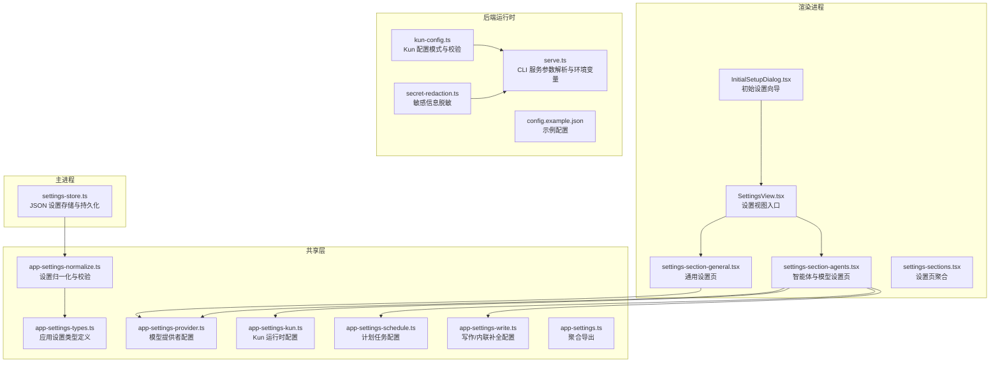
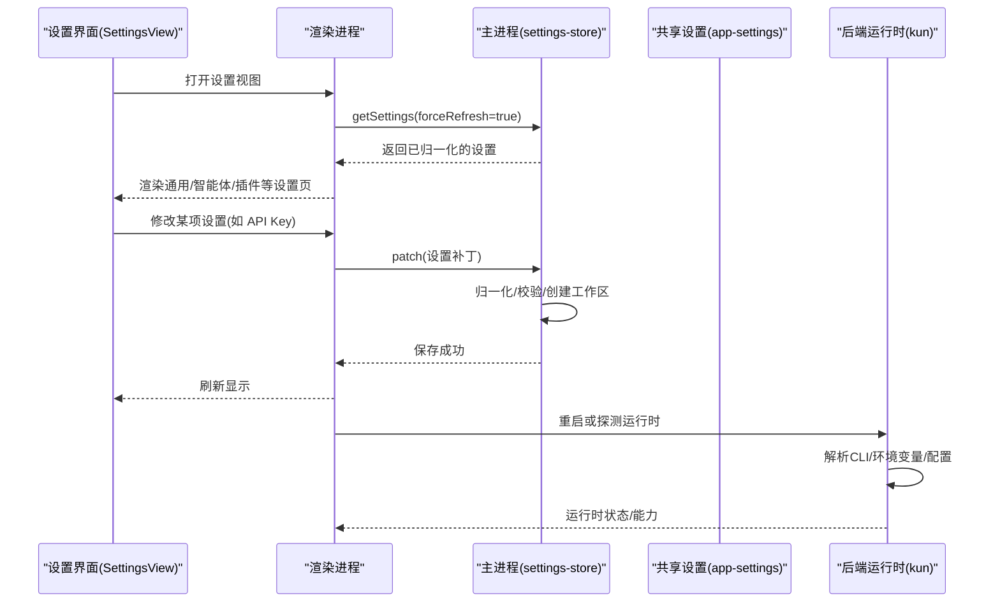
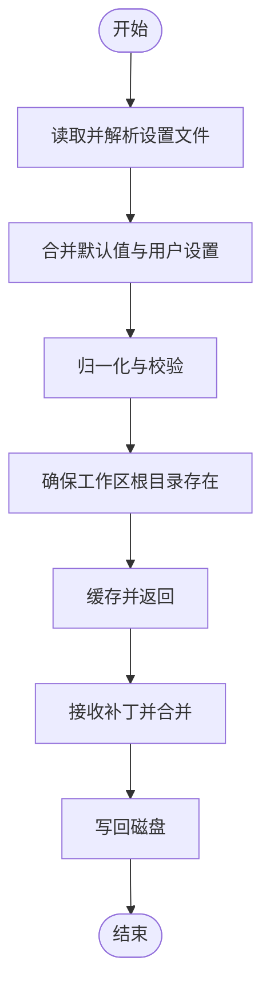
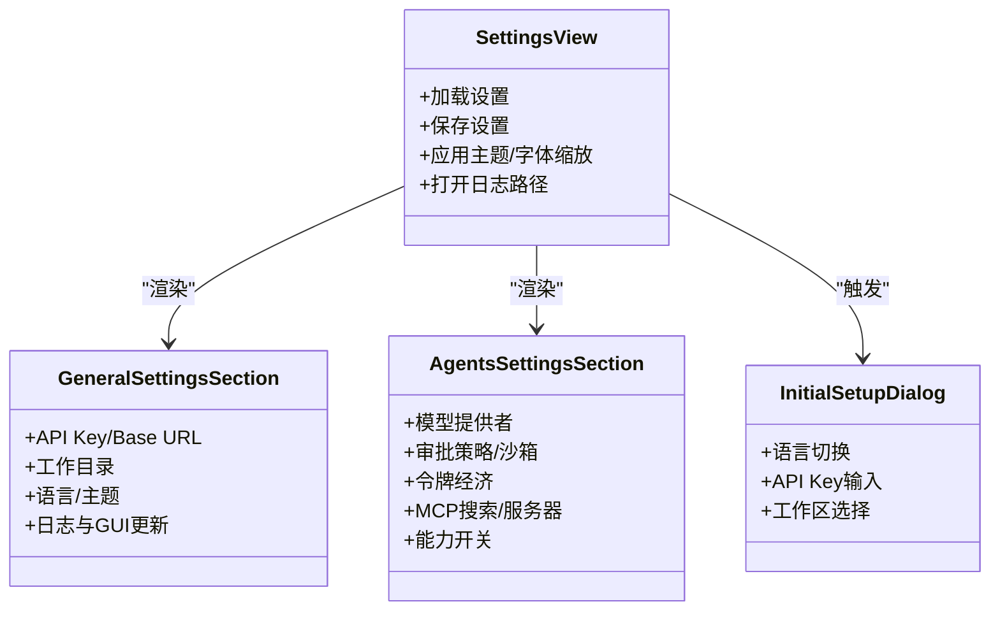
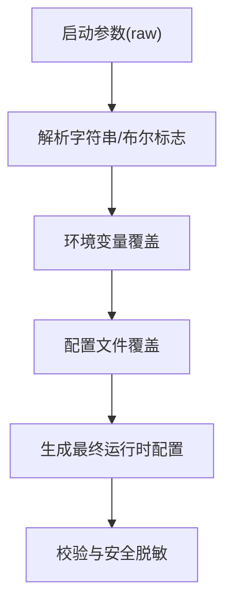
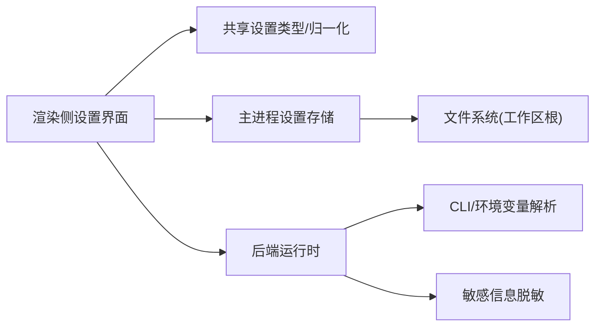

# 配置与设置

<cite>
**本文引用的文件**
- [settings-store.ts](file://src/main/settings-store.ts)
- [settings-store.test.ts](file://src/main/settings-store.test.ts)
- [app-settings.ts](file://src/shared/app-settings.ts)
- [app-settings-types.ts](file://src/shared/app-settings-types.ts)
- [app-settings-normalize.ts](file://src/shared/app-settings-normalize.ts)
- [app-settings-provider.ts](file://src/shared/app-settings-provider.ts)
- [app-settings-kun.ts](file://src/shared/app-settings-kun.ts)
- [app-settings-schedule.ts](file://src/shared/app-settings-schedule.ts)
- [app-settings-write.ts](file://src/shared/app-settings-write.ts)
- [settings-section-general.tsx](file://src/renderer/src/components/settings-section-general.tsx)
- [settings-section-agents.tsx](file://src/renderer/src/components/settings-section-agents.tsx)
- [settings-sections.tsx](file://src/renderer/src/components/settings-sections.tsx)
- [SettingsView.tsx](file://src/renderer/src/components/SettingsView.tsx)
- [InitialSetupDialog.tsx](file://src/renderer/src/components/InitialSetupDialog.tsx)
- [serve.ts](file://kun/src/cli/serve.ts)
- [secret-redaction.ts](file://kun/src/config/secret-redaction.ts)
- [kun-config.ts](file://kun/src/config/kun-config.ts)
- [kun-config.test.ts](file://kun/src/config/kun-config.test.ts)
- [config.example.json](file://kun/config.example.json)
</cite>

## 目录
1. [简介](#简介)
2. [项目结构](#项目结构)
3. [核心组件](#核心组件)
4. [架构总览](#架构总览)
5. [详细组件分析](#详细组件分析)
6. [依赖关系分析](#依赖关系分析)
7. [性能考量](#性能考量)
8. [故障排除指南](#故障排除指南)
9. [结论](#结论)
10. [附录](#附录)

## 简介
本指南面向 DeepSeek GUI 用户与运维人员，系统性讲解应用的配置与设置体系，涵盖配置文件格式、运行时配置、模型与工具配置、权限与能力开关、环境变量优先级、默认值与迁移策略、安全与最佳实践以及常见问题排查。读者可据此按需定制应用行为，确保在不同平台与场景下稳定运行。

## 项目结构
配置与设置涉及主进程存储、共享类型定义、渲染侧设置界面与初始化向导、以及后端运行时服务的配置解析与安全脱敏处理。关键模块如下图所示：

图表来源
- [settings-store.ts:286-318](file://src/main/settings-store.ts#L286-L318)
- [app-settings.ts:1-9](file://src/shared/app-settings.ts#L1-L9)
- [SettingsView.tsx:134-580](file://src/renderer/src/components/SettingsView.tsx#L134-L580)
- [settings-section-general.tsx:44-299](file://src/renderer/src/components/settings-section-general.tsx#L44-L299)
- [settings-section-agents.tsx:1-31](file://src/renderer/src/components/settings-section-agents.tsx#L1-L31)
- [InitialSetupDialog.tsx:30-72](file://src/renderer/src/components/InitialSetupDialog.tsx#L30-L72)
- [serve.ts:77-113](file://kun/src/cli/serve.ts#L77-L113)
- [kun-config.ts](file://kun/src/config/kun-config.ts)
- [secret-redaction.ts:1-36](file://kun/src/config/secret-redaction.ts#L1-L36)
- [config.example.json](file://kun/config.example.json)

章节来源
- [settings-store.ts:286-318](file://src/main/settings-store.ts#L286-L318)
- [app-settings.ts:1-9](file://src/shared/app-settings.ts#L1-L9)
- [SettingsView.tsx:134-580](file://src/renderer/src/components/SettingsView.tsx#L134-L580)

## 核心组件
- 设置存储与持久化：负责从磁盘加载、解析、合并、归一化并保存设置；对工作区根目录进行存在性检查与必要创建；支持增量补丁更新。
- 共享设置类型与归一化：统一定义设置结构、默认值与校验逻辑，保证前后端一致。
- 渲染侧设置界面：提供通用设置（API Key/Base URL、工作目录、语言主题、日志与更新）、智能体与模型设置、插件与 MCP 配置等页面。
- 后端运行时配置：解析 CLI 参数与环境变量，构建 Kun 运行时配置，含能力开关、附件、Web 访问、MCP 搜索等。
- 安全与脱敏：对敏感键与文本进行脱敏处理，避免泄露。

章节来源
- [settings-store.ts:286-318](file://src/main/settings-store.ts#L286-L318)
- [app-settings-types.ts](file://src/shared/app-settings-types.ts)
- [app-settings-normalize.ts](file://src/shared/app-settings-normalize.ts)
- [settings-section-general.tsx:96-126](file://src/renderer/src/components/settings-section-general.tsx#L96-L126)
- [settings-section-agents.tsx:162-177](file://src/renderer/src/components/settings-section-agents.tsx#L162-L177)
- [serve.ts:77-113](file://kun/src/cli/serve.ts#L77-L113)
- [secret-redaction.ts:1-36](file://kun/src/config/secret-redaction.ts#L1-L36)

## 架构总览
设置系统采用“主进程 JSON 存储 + 共享类型 + 渲染侧 UI + 后端运行时解析”的分层设计。渲染侧通过 IPC 获取/提交设置，主进程负责落盘与一致性校验；后端运行时依据设置生成实际执行所需的配置。

图表来源
- [SettingsView.tsx:134-580](file://src/renderer/src/components/SettingsView.tsx#L134-L580)
- [settings-store.ts:286-318](file://src/main/settings-store.ts#L286-L318)
- [app-settings.ts:1-9](file://src/shared/app-settings.ts#L1-L9)
- [serve.ts:77-113](file://kun/src/cli/serve.ts#L77-L113)

## 详细组件分析

### 主进程设置存储与持久化
- 加载流程：解析 JSON 文件，合并默认值，归一化，校验并缓存；确保工作区根目录存在，必要时创建；错误时抛出带原因的异常。
- 保存流程：归一化后写入磁盘，确保目录存在。
- 增量补丁：支持部分字段更新，自动合并模型提供者与 Kun 运行时配置。
- 默认值与新装行为：测试覆盖了 GUI 更新通道与审批策略默认值，以及写作工作区默认创建与内联补全默认启用。

图表来源
- [settings-store.ts:286-318](file://src/main/settings-store.ts#L286-L318)
- [settings-store.test.ts:1-29](file://src/main/settings-store.test.ts#L1-L29)

章节来源
- [settings-store.ts:286-318](file://src/main/settings-store.ts#L286-L318)
- [settings-store.test.ts:1-29](file://src/main/settings-store.test.ts#L1-L29)

### 共享设置类型与归一化
- 类型定义：集中于共享层，包含模型提供者、Kun 运行时、计划任务、写作与内联补全、GUI 更新通道等配置项。
- 归一化：统一默认值、校验范围、继承关系（如内联补全 Base URL 继承自通用设置）。
- 聚合导出：通过单一入口导出，便于渲染侧与主进程复用。

章节来源
- [app-settings.ts:1-9](file://src/shared/app-settings.ts#L1-L9)
- [app-settings-types.ts](file://src/shared/app-settings-types.ts)
- [app-settings-normalize.ts](file://src/shared/app-settings-normalize.ts)

### 渲染侧设置界面
- 通用设置页：包含 API Key/Base URL、工作目录选择与重置、语言与主题、日志开关与保留天数、GUI 更新通道与检查/下载/安装控制。
- 智能体与模型设置页：提供模型提供者配置、审批策略、沙箱模式、令牌经济模式、MCP 搜索与服务器配置、能力开关（附件、Web、技能、MCP）等高级选项。
- 初始设置向导：引导用户完成首次配置，包括语言切换、API Key 输入与可见性切换、工作区选择等。

图表来源
- [SettingsView.tsx:134-580](file://src/renderer/src/components/SettingsView.tsx#L134-L580)
- [settings-section-general.tsx:44-299](file://src/renderer/src/components/settings-section-general.tsx#L44-L299)
- [settings-section-agents.tsx:162-177](file://src/renderer/src/components/settings-section-agents.tsx#L162-L177)
- [InitialSetupDialog.tsx:30-72](file://src/renderer/src/components/InitialSetupDialog.tsx#L30-L72)

章节来源
- [settings-section-general.tsx:96-126](file://src/renderer/src/components/settings-section-general.tsx#L96-L126)
- [settings-section-agents.tsx:134-177](file://src/renderer/src/components/settings-section-agents.tsx#L134-L177)
- [InitialSetupDialog.tsx:201-233](file://src/renderer/src/components/InitialSetupDialog.tsx#L201-L233)

### 后端运行时配置与环境变量
- CLI 参数与环境变量优先级：支持命令行标志、环境变量（如 DEEPSEEK_API_KEY、DEEPSEEK_BASE_URL、KUN_BASE_URL、KUN_MODEL、KUN_RUNTIME_TOKEN）与配置文件的多源合并。
- 布尔值解析：对字符串形式的布尔值进行标准化处理（0/false/off/no 视为 false，其余视为 true）。
- 运行时能力：根据设置动态启用附件、Web 访问、MCP 搜索与服务器注册等能力。

图表来源
- [serve.ts:77-113](file://kun/src/cli/serve.ts#L77-L113)
- [serve.ts:252-280](file://kun/src/cli/serve.ts#L252-L280)
- [kun-config.ts](file://kun/src/config/kun-config.ts)
- [secret-redaction.ts:1-36](file://kun/src/config/secret-redaction.ts#L1-L36)

章节来源
- [serve.ts:77-113](file://kun/src/cli/serve.ts#L77-L113)
- [serve.ts:252-280](file://kun/src/cli/serve.ts#L252-L280)
- [secret-redaction.ts:1-36](file://kun/src/config/secret-redaction.ts#L1-L36)

### 安全与敏感信息脱敏
- 键名与文本匹配：对包含敏感词的键与常见头部/参数中的密钥进行脱敏。
- 文本脱敏：识别 Authorization/Bearer/Key=Value 等模式并替换为占位符。
- 测试验证：通过单元测试确保敏感信息被正确脱敏。

章节来源
- [secret-redaction.ts:1-36](file://kun/src/config/secret-redaction.ts#L1-L36)
- [kun-config.test.ts:85-99](file://kun/src/config/kun-config.test.ts#L85-L99)

## 依赖关系分析
- 渲染侧依赖共享设置类型与归一化逻辑，确保 UI 与数据模型一致。
- 主进程设置存储依赖共享归一化与工作区辅助函数，保障落盘前的数据质量。
- 后端运行时依赖 CLI 解析与配置模式，结合安全脱敏策略输出最终运行时配置。
- 测试覆盖了默认值、工作区创建与内联补全默认启用等关键行为。

图表来源
- [settings-sections.tsx:1-4](file://src/renderer/src/components/settings-sections.tsx#L1-L4)
- [app-settings.ts:1-9](file://src/shared/app-settings.ts#L1-L9)
- [settings-store.ts:286-318](file://src/main/settings-store.ts#L286-L318)
- [serve.ts:77-113](file://kun/src/cli/serve.ts#L77-L113)
- [secret-redaction.ts:1-36](file://kun/src/config/secret-redaction.ts#L1-L36)

章节来源
- [settings-sections.tsx:1-4](file://src/renderer/src/components/settings-sections.tsx#L1-L4)
- [app-settings.ts:1-9](file://src/shared/app-settings.ts#L1-L9)
- [settings-store.ts:286-318](file://src/main/settings-store.ts#L286-L318)
- [serve.ts:77-113](file://kun/src/cli/serve.ts#L77-L113)

## 性能考量
- 设置加载与保存：建议批量更新设置后再一次性保存，减少磁盘 IO。
- 归一化与校验：在主进程进行，避免重复计算；渲染侧仅做轻量级展示。
- 日志与调试：合理设置日志保留天数，避免长期积累造成磁盘压力。
- 运行时能力：按需开启 MCP 搜索与 Web 访问，降低不必要的网络与资源消耗。

## 故障排除指南
- 设置加载失败：检查设置文件格式与权限；查看错误信息中是否包含解析失败原因。
- 工作区不存在：确认工作区根目录存在且可写；主进程会尝试创建但可能受权限限制。
- API Key/Base URL 无效：在通用设置页核对输入；注意大小写与末尾斜杠；确保网络可达。
- GUI 更新通道：若更新失败，尝试切换到稳定通道或手动检查网络代理。
- 日志无法打开：确认日志目录存在且有读取权限；可通过设置界面提供的按钮定位日志路径。
- 敏感信息泄露风险：避免在日志或外部渠道暴露 API Key；系统会对敏感信息进行脱敏处理。

章节来源
- [settings-store.ts:286-318](file://src/main/settings-store.ts#L286-L318)
- [SettingsView.tsx:134-580](file://src/renderer/src/components/SettingsView.tsx#L134-L580)
- [secret-redaction.ts:1-36](file://kun/src/config/secret-redaction.ts#L1-L36)

## 结论
DeepSeek GUI 的配置体系以“共享类型 + 主进程存储 + 渲染界面 + 后端运行时”为核心，既保证了跨进程的一致性，又提供了灵活的定制空间。通过合理的默认值、严格的归一化与校验、以及安全脱敏机制，用户可以在不同环境下快速部署并安全使用。

## 附录

### 配置文件格式与选项概览
- 位置：由主进程设置存储决定，默认位于用户数据目录下的设置文件。
- 结构：包含通用设置（API Key/Base URL、工作目录、语言主题、日志、GUI 更新）、模型提供者、Kun 运行时（能力开关、MCP 搜索、附件、Web）、计划任务、写作与内联补全等。
- 归一化：所有字段在保存前都会经过归一化与校验，确保类型与范围正确。

章节来源
- [settings-store.ts:286-318](file://src/main/settings-store.ts#L286-L318)
- [app-settings-types.ts](file://src/shared/app-settings-types.ts)
- [app-settings-normalize.ts](file://src/shared/app-settings-normalize.ts)

### 运行时配置与环境变量
- CLI 与环境变量优先级：命令行标志 > 环境变量 > 配置文件 > 默认值。
- 支持的关键变量：DEEPSEEK_API_KEY、DEEPSEEK_BASE_URL、KUN_BASE_URL、KUN_MODEL、KUN_RUNTIME_TOKEN 等。
- 布尔值解析：0/false/off/no 视为 false，其余视为 true。

章节来源
- [serve.ts:77-113](file://kun/src/cli/serve.ts#L77-L113)
- [serve.ts:252-280](file://kun/src/cli/serve.ts#L252-L280)

### 默认值与迁移指导
- 新装默认：GUI 更新通道默认稳定版；审批策略默认值；写作工作区默认创建；内联补全默认启用。
- 迁移策略：升级时主进程会自动合并旧设置与新默认值；如遇冲突，建议备份旧设置后重新导入。

章节来源
- [settings-store.test.ts:1-29](file://src/main/settings-store.test.ts#L1-L29)

### 安全考虑与最佳实践
- 密钥管理：优先使用环境变量注入 API Key；在 UI 中可切换可见性，但不建议长期明文显示。
- 网络与代理：确保 Base URL 可达；如需代理，请在系统或应用层面正确配置。
- 权限最小化：仅开启必要的能力（如 Web 访问、MCP 搜索），降低攻击面。
- 日志与审计：合理设置日志级别与保留期；定期清理敏感信息。

章节来源
- [secret-redaction.ts:1-36](file://kun/src/config/secret-redaction.ts#L1-L36)
- [settings-section-general.tsx:96-126](file://src/renderer/src/components/settings-section-general.tsx#L96-L126)