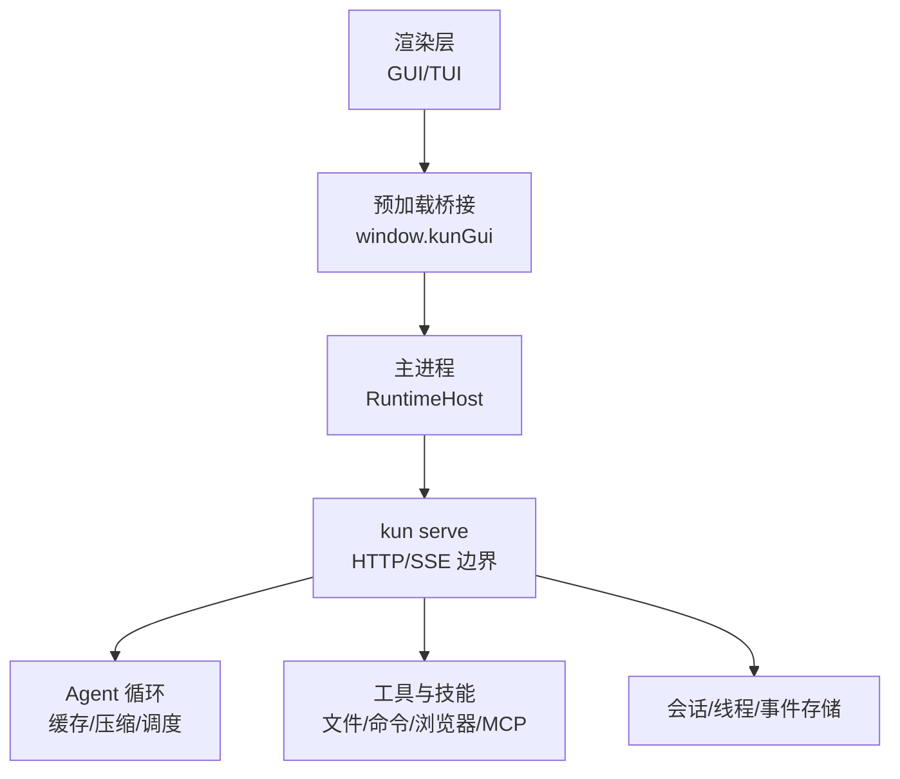
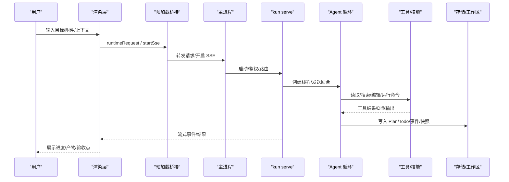
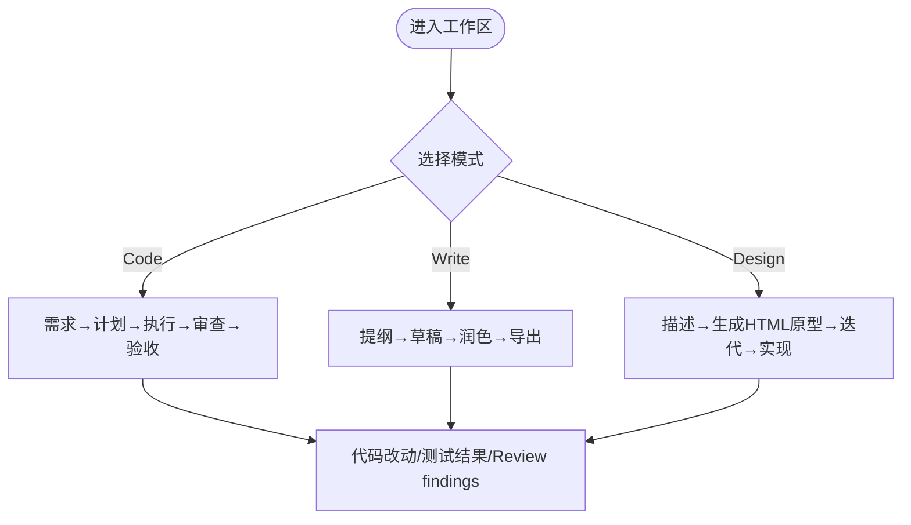
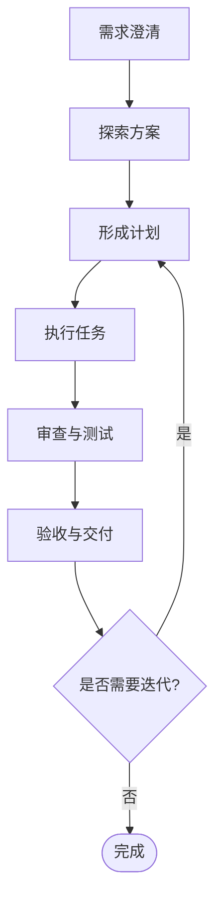
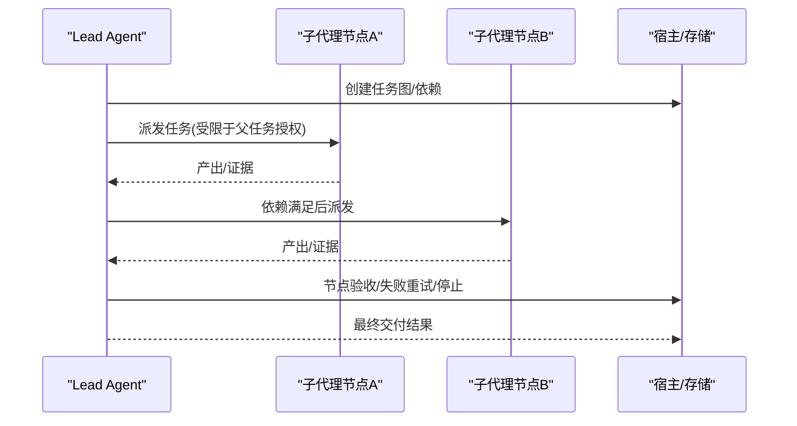
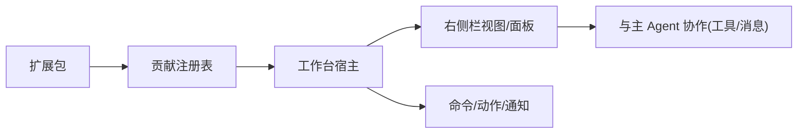
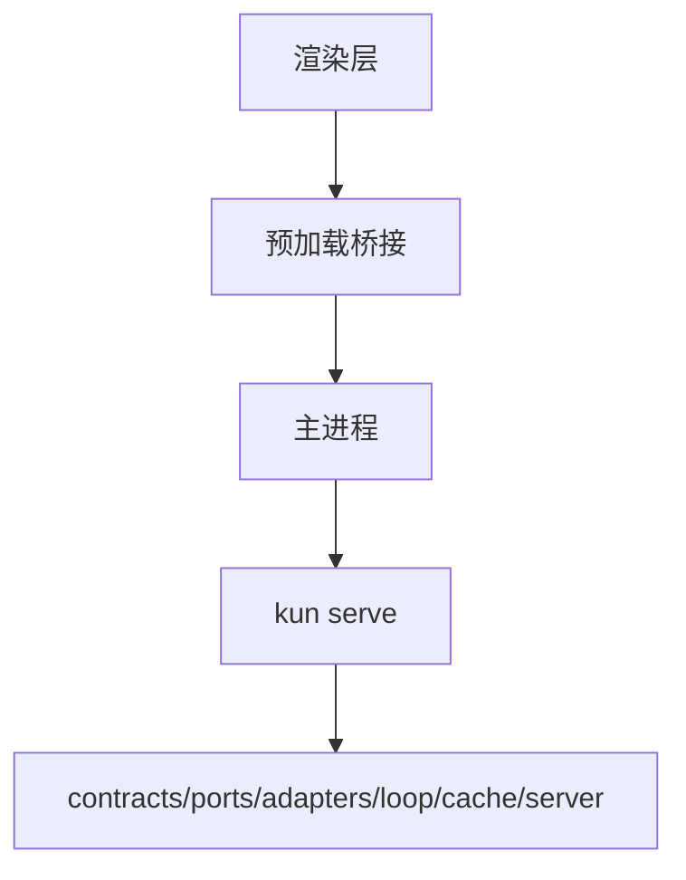

# 产品定位与价值主张

<cite>
**本文引用的文件**
- [README.md](file://README.md)
- [DESIGN_MODE.md](file://docs/DESIGN_MODE.md)
- [kun-architecture.en.md](file://docs/kun-architecture.en.md)
- [workbench.en.md](file://docs/extensions/workbench.en.md)
</cite>

## 目录
1. [引言](#引言)
2. [项目结构](#项目结构)
3. [核心组件](#核心组件)
4. [架构总览](#架构总览)
5. [详细组件分析](#详细组件分析)
6. [依赖关系分析](#依赖关系分析)
7. [性能考量](#性能考量)
8. [故障排查指南](#故障排查指南)
9. [结论](#结论)
10. [附录](#附录)

## 引言
Kun 是一款本地优先的 AI Agent 工作台，面向需要把想法推进到可验收结果的人。它在一个共享运行时中统一桌面 GUI 与终端 TUI，让任务从需求澄清、计划执行到审查验收始终可见、可控、可回溯。与传统聊天框不同，Kun 不是“只生成回答”的工具，而是帮助你在真实工作流中持续推进产出：代码、文档、设计原型、研究笔记与自动化流程，都能在同一工作台内衔接并沉淀为可验证的结果。

## 项目结构
Kun 以单一运行时为中心，GUI 通过 HTTP/SSE 边界与后端交互；Code、Design、Write、Connect phone 等能力都复用同一线程、计划、审批、模型连接和任务记录。这种结构确保上下文连续性、任务可追溯性与多模态处理能力在同一个工作区中自然发生。

图表来源
- [kun-architecture.en.md:16-48](file://docs/kun-architecture.en.md#L16-L48)

章节来源
- [README.md:33-50](file://README.md#L33-L50)
- [kun-architecture.en.md:16-48](file://docs/kun-architecture.en.md#L16-L48)

## 核心组件
- 单一运行时与稳定边界：GUI 不嵌入 Agent 循环，所有能力通过 `kun serve` 暴露的稳定 API 访问，保证状态一致与可回放。
- 连续工作流：需求澄清 → 探索方案 → 形成计划 → 执行任务 → 回到验收，每个阶段都有明确产物（Plan、Todo、Diff、测试、审查证据）。
- 多工作区模式：Code、Write、Design 三大工作区共享同一运行时、Provider 配置、审批与线程机制。
- 多模态与安全：图片/PDF 输入、视觉理解、媒体生成、沙箱、工具审批、Computer Use 权限与敏感操作确认。
- 开放扩展：Schedule、Loop、Hook、MCP、Skills、Extensions，支持一次性或周期性自动化。

章节来源
- [README.md:107-148](file://README.md#L107-L148)
- [DESIGN_MODE.md:27-41](file://docs/DESIGN_MODE.md#L27-L41)
- [kun-architecture.en.md:46-51](file://docs/kun-architecture.en.md#L46-L51)

## 架构总览
Kun 将“对话”升级为“可回溯的工作流”。渲染层通过预加载桥接到主进程，再由主进程管理 `kun serve` 的生命周期与鉴权；服务层提供线程、回合、事件、审批、用量与工作区状态接口；Agent 循环负责提示前缀、缓存命中、上下文压缩、并发工具调用与历史修复。

图表来源
- [kun-architecture.en.md:16-48](file://docs/kun-architecture.en.md#L16-L48)
- [kun-architecture.en.md:189-227](file://docs/kun-architecture.en.md#L189-L227)

## 详细组件分析

### 工作区与模式：Code / Write / Design
- Code：围绕真实仓库进行文件搜索、编辑、命令执行、Plan/Todo 管理与 Diff/测试查看，交付代码改动与实施计划。
- Write：长文写作、资料整理、内联补全与编辑，导出 Markdown/HTML/PDF/DOCX/PPTX。
- Design：将需求、参考图或现有界面转化为可视化方向与交互原型，沉淀设计系统并与 Code 双向打通。

图表来源
- [README.md:77-86](file://README.md#L77-L86)
- [DESIGN_MODE.md:27-41](file://docs/DESIGN_MODE.md#L27-L41)

章节来源
- [README.md:77-86](file://README.md#L77-L86)
- [DESIGN_MODE.md:27-41](file://docs/DESIGN_MODE.md#L27-L41)

### 连续工作流：从需求到验收
Kun 将“和 AI 对话”变成一条可以回到原始目标检查的工作流：
- 澄清需求：建立需求草稿，结合项目内容补充问题、边界与验收标准。
- 探索方案：在 Design、Write 或 Research 中形成视觉方向、原型、资料与方案。
- 形成计划：使用 `/plan` 将目标拆成可执行步骤，并与需求和 Todo 对齐。
- 执行任务：Agent 搜索、修改、调用工具、运行命令；长任务可继续、恢复或交给子代理。
- 回到验收：检查 Diff、测试、浏览器与 `/review` findings，对照原始验收标准确认结果。

图表来源
- [README.md:107-123](file://README.md#L107-L123)

章节来源
- [README.md:107-123](file://README.md#L107-L123)

### Agent Graph：复杂任务的分工与监督
对于跨文件、跨阶段、可明确验收的复杂任务，实验性的 Agent Graph 由 Lead Agent 建立依赖图，按依赖派发受限子代理，持续查看进度、要求补充证据、触发返工，并在必要节点验证通过后交付结果。Graph 不会扩大权限，也不会成为第二套运行时；GUI 与 TUI 通过同一运行时读取状态，节点只有经过真实校验与 Lead 明确验收后，才能向下游交接结果。

图表来源
- [README.md:125-136](file://README.md#L125-L136)

章节来源
- [README.md:125-136](file://README.md#L125-L136)

### 多模态与可追溯性
- 多模态：图片和 PDF 输入、视觉理解、媒体生成，贯穿设计、研究与自动化流程。
- 可追溯：Plan、Todo、持久目标、会话压缩、分叉、归档、旁支问题、后台 Shell 与子代理，全部留在任务旁，便于复盘与继续工作。
- 安全与审批：工具审批、Computer Use 权限、敏感操作确认，保障高权限操作的边界与审计。

章节来源
- [README.md:138-148](file://README.md#L138-L148)

### 工作台扩展与集成
Kun 工作台通过统一的贡献注册表承载内置与扩展 UI，扩展声明视图、命令、设置与行为，宿主负责渲染、排序、焦点、无障碍与生命周期。右侧栏是扩展能力的默认入口，避免重复的工具菜单或嵌套聚合器。

图表来源
- [workbench.en.md:7-44](file://docs/extensions/workbench.en.md#L7-L44)

章节来源
- [workbench.en.md:7-44](file://docs/extensions/workbench.en.md#L7-L44)

## 依赖关系分析
- 渲染层仅负责映射 HTTP/SSE 状态与展示，不实现 Agent 业务逻辑；新增能力应先添加 Kun 工具或 HTTP 端点，再按需接入渲染。
- 主进程职责收敛为启动/停止 `kun serve`、同步配置、计算基础 URL 与附加鉴权头，以及转发 SSE 流。
- 服务层提供线程、回合、事件、审批、用量与工作区状态的稳定边界，GUI 消费这些能力而不感知内部实现。

图表来源
- [kun-architecture.en.md:119-151](file://docs/kun-architecture.en.md#L119-L151)
- [kun-architecture.en.md:248-261](file://docs/kun-architecture.en.md#L248-L261)

章节来源
- [kun-architecture.en.md:119-151](file://docs/kun-architecture.en.md#L119-L151)
- [kun-architecture.en.md:248-261](file://docs/kun-architecture.en.md#L248-L261)

## 性能考量
- 缓存命中优化：优先使用 Provider 原生字段计算命中率；稳定系统提示前缀与工具 Schema 规范化，减少冷启动抖动；历史消息修复避免无效重试。
- 并发与限流：只读工具批量并发执行但保持顺序；对大输出与长参数进行有界控制，避免日志膨胀。
- 资源回收：进行中清理、上下文压缩、使用量与缓存遥测，重启后恢复累计计数。

章节来源
- [kun-architecture.en.md:53-117](file://docs/kun-architecture.en.md#L53-L117)

## 故障排查指南
- 运行时统一：若出现“无法切换运行时/诊断面板异常”，应确认 GUI 仅通过 `kun serve` 访问能力，移除历史运行时相关入口。
- 线程与恢复：线程搜索、归档、分叉/恢复、用户输入应答/取消均通过 HTTP 路径；若界面卡住，检查 `/v1/threads/{id}/fork`、`/v1/sessions/{id}/resume-thread`、`/v1/user-inputs/{id}` 与审批接口。
- 扩展与视图：扩展崩溃会显示受控占位，不影响主渲染；可通过 `kun extension doctor/logs` 排查注册、权限与布局问题。

章节来源
- [kun-architecture.en.md:189-227](file://docs/kun-architecture.en.md#L189-L227)
- [workbench.en.md:246-251](file://docs/extensions/workbench.en.md#L246-L251)

## 结论
Kun 的价值在于把“对话”升级为“可验收的工作流”。它不是另一个只会生成回答的聊天框，而是一个本地优先的 AI Agent 工作台，帮助开发者、写作者、设计师、研究人员与小团队，把需求、上下文、计划、文件改动、测试、审查与最终交付放在一条连续、可追溯、可恢复的路径上。通过单一运行时、稳定边界与开放扩展，Kun 让复杂任务真正分工、监督与验收，让简单任务更快落地。

## 附录
- 适合谁：开发者、写作者、设计师、研究人员，以及需要把重复工作交给 AI 的个人与团队。
- 能做什么：AI 编程与审查、写作与文档导出、设计与原型、PDF/图片研究、多 Agent 自动化。
- 如何使用：在桌面 GUI 观察全过程；或在终端用 TUI 手不离键盘；两者共享同一运行时与任务。
- 何时用 Direct/Graph：单点修改与短任务用 Direct；跨文件、跨阶段且需分工与验收的复杂工作用 Agent Graph。

章节来源
- [README.md:33-50](file://README.md#L33-L50)
- [README.md:77-86](file://README.md#L77-L86)
- [README.md:167-199](file://README.md#L167-L199)