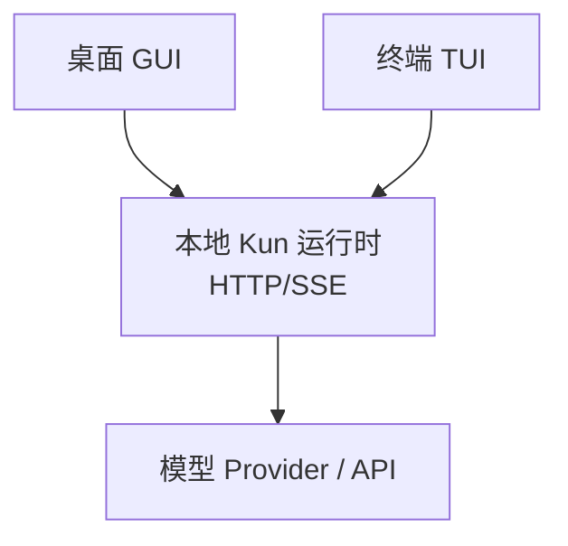
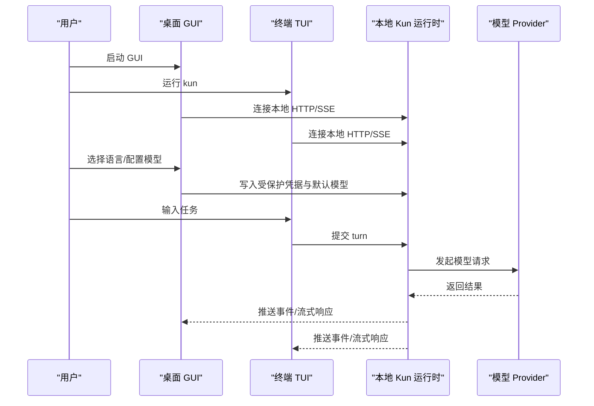

# 快速开始指南

<cite>
**本文引用的文件**
- [README.md](file://README.md)
- [package.json](file://package.json)
- [docs/kun-tui.md](file://docs/kun-tui.md)
- [docs/model-provider-presets.md](file://docs/model-provider-presets.md)
</cite>

## 目录
1. [简介](#简介)
2. [项目结构](#项目结构)
3. [核心组件](#核心组件)
4. [架构总览](#架构总览)
5. [详细组件分析](#详细组件分析)
6. [依赖分析](#依赖分析)
7. [性能注意事项](#性能注意事项)
8. [故障排查指南](#故障排查指南)
9. [结论](#结论)
10. [附录](#附录)

## 简介
本指南帮助你在5分钟内完成DeepSeek-GUI（Kun）的安装、首次启动配置、选择界面语言、配置模型连接，并打开本地项目发送第一个任务。同时提供GUI与TUI共享同一运行时的使用方式，以及开发环境搭建与常见问题解决方案。

## 项目结构
- 桌面应用：Electron GUI + 内置 TUI，安装后即可在桌面和终端中使用。
- 运行时：本地持久化服务，GUI 与 TUI 通过本机 HTTP/SSE 连接同一实例，共享线程、计划、审批、用量与模型连接。
- 文档与示例：仓库包含用户文档、扩展说明、工作区示例等。

图表来源
- [docs/kun-tui.md:35-37](file://docs/kun-tui.md#L35-L37)
- [README.md:33-35](file://README.md#L33-L35)

章节来源
- [README.md:33-35](file://README.md#L33-L35)
- [docs/kun-tui.md:35-37](file://docs/kun-tui.md#L35-L37)

## 核心组件
- 安装包与平台支持：macOS .dmg/.zip、Windows .exe、Linux .AppImage/.deb。
- 首次启动三步：选择语言 → 配置模型 → 发送任务。
- GUI 与 TUI 共享运行时：可同时打开，共享会话与任务状态。
- 开发环境：Node.js 22.19+，npm ci 安装依赖，npm run dev 启动开发环境。

章节来源
- [README.md:51-75](file://README.md#L51-L75)
- [README.md:201-228](file://README.md#L201-L228)
- [docs/kun-tui.md:35-37](file://docs/kun-tui.md#L35-L37)

## 架构总览
Kun 的“本地优先”设计将桌面 GUI、终端 TUI、后台任务与手机连接统一到一个本地运行时中。GUI 与 TUI 只是客户端，通过本机 HTTP/SSE 访问同一个持久化运行时，共享线程、turn、审批、结构化问答、事件序号、用量和模型连接。关闭任一客户端不会终止其他客户端或后台 turn。

图表来源
- [docs/kun-tui.md:35-37](file://docs/kun-tui.md#L35-L37)
- [docs/kun-tui.md:123-151](file://docs/kun-tui.md#L123-L151)

## 详细组件分析

### 5分钟快速体验
- 下载桌面版：从 GitHub Releases 下载对应平台的安装包。
- 首次启动三步：
  1) 选择界面语言；
  2) 登录模型订阅，或配置 API Key、Token Plan 或自定义 Provider；
  3) 打开本地项目或新建工作区，发送一个目标清楚、范围有限且可以验证的任务。
- 同时使用 GUI 与 TUI：在项目目录中打开终端运行 kun，两者会自动连接同一个本地运行时。

章节来源
- [README.md:51-75](file://README.md#L51-L75)

### 各平台安装包下载与安装
- macOS：下载 .dmg 或 .zip，按系统提示安装或解压后运行。
- Windows：下载 .exe 安装器，按向导完成安装。
- Linux：下载 .AppImage 或 .deb，按发行版方式安装或运行。

章节来源
- [README.md:51-62](file://README.md#L51-L62)

### 首次启动配置流程
- 选择语言：首次启动会引导设置界面语言。
- 配置模型：
  - 使用预设 Provider（如 DeepSeek、Xiaomi、MiniMax 等），或在“设置 > Providers”中添加自定义端点。
  - 在 TUI 中输入 /connect 进入共享连接向导，添加账号、填写凭据、探测模型并设置默认模型。
  - 在 GUI 的设置页可同步查看与管理已配置的 Provider 与默认模型。
- 发送任务：打开本地项目或新建工作区，输入清晰的目标与验收标准，直接发送即可。

章节来源
- [README.md:63-68](file://README.md#L63-L68)
- [docs/kun-tui.md:123-151](file://docs/kun-tui.md#L123-L151)
- [docs/model-provider-presets.md:36-135](file://docs/model-provider-presets.md#L36-L135)

### 同时使用 GUI 与 TUI
- GUI 与 TUI 共享同一个本地运行时，可同时打开并继续同一线程。
- 在 GUI 中完成的模型连接与默认模型设置，TUI 可直接复用；反之亦然。
- 关闭 GUI 不会终止 TUI 或后台 turn，关闭 TUI 也不会影响 GUI。

章节来源
- [README.md:69-75](file://README.md#L69-L75)
- [docs/kun-tui.md:35-37](file://docs/kun-tui.md#L35-L37)

### 开发环境搭建
- 环境要求：Node.js 22.19+。
- 安装依赖：npm ci。
- 启动开发环境：npm run dev。
- 单独启动开发版 TUI：npm run dev:tui。
- 中国大陆网络较慢时可使用 npm 镜像：npm ci --registry=https://registry.npmmirror.com。

章节来源
- [README.md:201-228](file://README.md#L201-L228)
- [package.json:6-8](file://package.json#L6-L8)
- [package.json:14-23](file://package.json#L14-L23)

### 模型与 Provider 配置要点
- 预设覆盖：DeepSeek、Xiaomi、MiniMax、Moonshot、Zhipu Coding Plan、Z.ai Coding Plan、Kimi coding subscription 等。
- 自定义端点：支持 OpenAI Chat Completions、OpenAI Responses、Anthropic Messages 等协议。
- 首次运行聚焦默认栈，更多 Provider 可在“设置 > Providers”中按需启用。

章节来源
- [docs/model-provider-presets.md:36-135](file://docs/model-provider-presets.md#L36-L135)
- [README.md:159-165](file://README.md#L159-L165)

## 依赖分析
- Node.js 版本要求：>=22.19.0。
- 构建与开发脚本：通过 package.json 中的 scripts 管理 dev、build、dist 等命令。
- 运行时与前端：Electron GUI 与 Vite 构建链路由 scripts 协调。

章节来源
- [package.json:6-8](file://package.json#L6-L8)
- [package.json:14-88](file://package.json#L14-L88)

## 性能注意事项
- 长任务与上下文：合理使用 Plan、Todo、压缩与归档，避免过长的上下文导致响应变慢。
- 模型选择：根据任务复杂度选择合适的模型与推理强度，平衡速度与质量。
- 工具调用：批量只读发现调用会被聚合展示，减少重复开销。

[本节为通用建议，不直接分析具体文件]

## 故障排查指南
- 无法连接模型：
  - 检查 Provider 的 Base URL、Endpoint format、API Key/Token 是否正确。
  - 在 TUI 中执行 /connect 重新探测模型并保存；在 GUI 设置页确认默认模型。
- 网络问题：
  - 中国大陆可使用 npm 镜像加速依赖安装。
  - 若企业网络需代理，确保环境变量或系统代理对 Node.js 与 Electron 生效。
- 端口冲突或服务异常：
  - 使用 kun runtime status 查看当前运行时状态，必要时重启或停止服务。
  - 若 discovery 冲突，先关闭旧 GUI/TUI 再重新启动。
- 权限与安全：
  - data-dir 权限为 0700，discovery/token 文件在 POSIX 上为 0600。
  - 仅接受 loopback 的本地 HTTP 连接，防止外部进程访问。

章节来源
- [docs/kun-tui.md:35-37](file://docs/kun-tui.md#L35-L37)
- [docs/kun-tui.md:62-72](file://docs/kun-tui.md#L62-L72)
- [docs/kun-tui.md:306-320](file://docs/kun-tui.md#L306-L320)
- [README.md:224-228](file://README.md#L224-L228)

## 结论
通过本指南，你可以在5分钟内完成 DeepSeek-GUI（Kun）的安装、首次启动配置、选择语言、配置模型并发送第一个任务。GUI 与 TUI 共享同一运行时，既可独立使用也可协同工作。遇到网络或连接问题时，可参考故障排查部分进行定位与解决。

[本节为总结性内容，不直接分析具体文件]

## 附录
- 常用命令速查：
  - 启动 GUI：npm run dev
  - 启动 TUI：npm run dev:tui
  - 安装依赖：npm ci
  - 生产构建：npm run build
  - 打包发布：npm run dist:mac / npm run dist:win / npm run dist:linux

章节来源
- [package.json:14-88](file://package.json#L14-L88)
- [README.md:230-242](file://README.md#L230-L242)