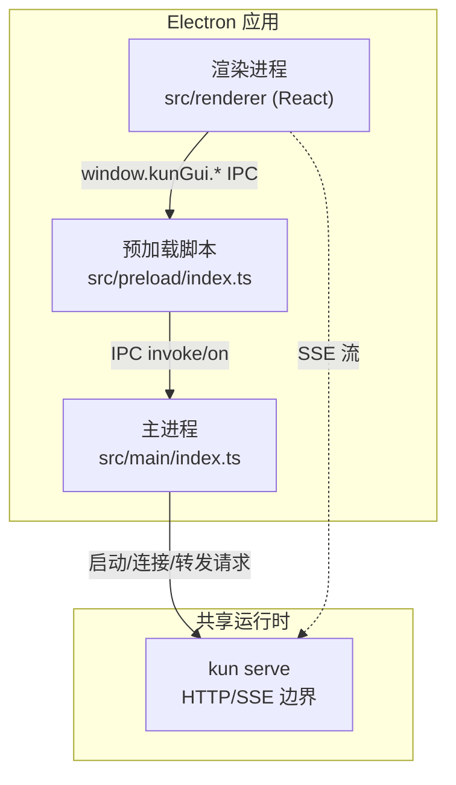
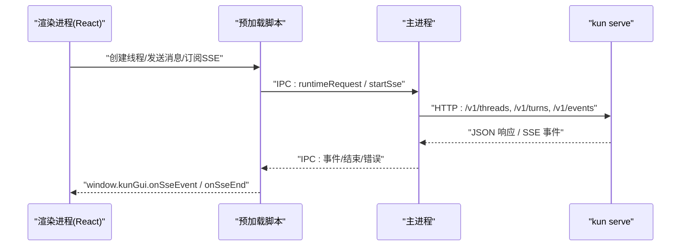
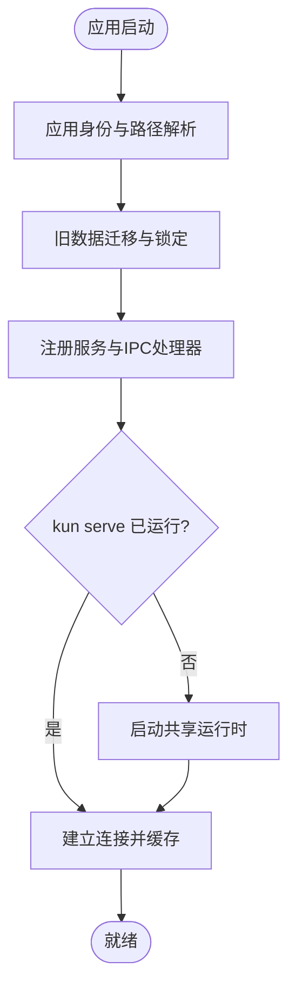
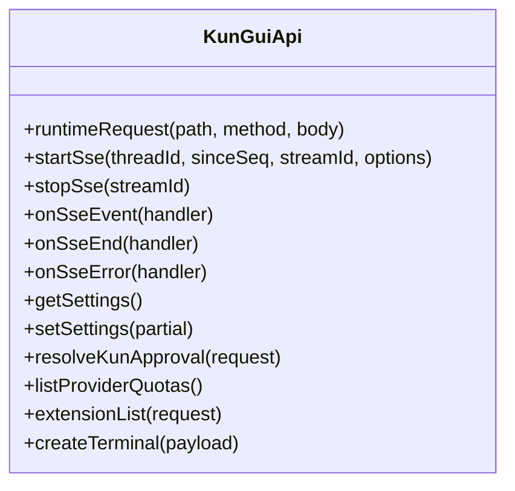
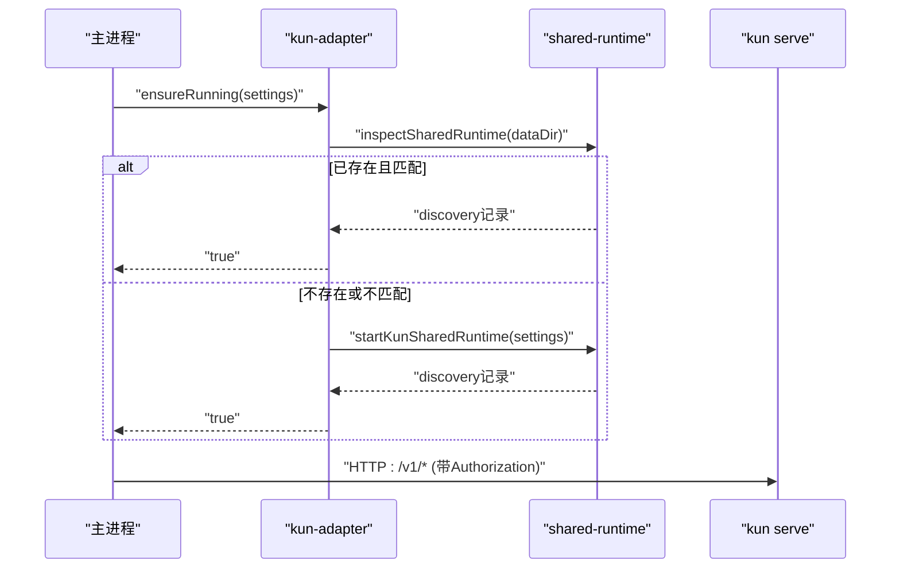
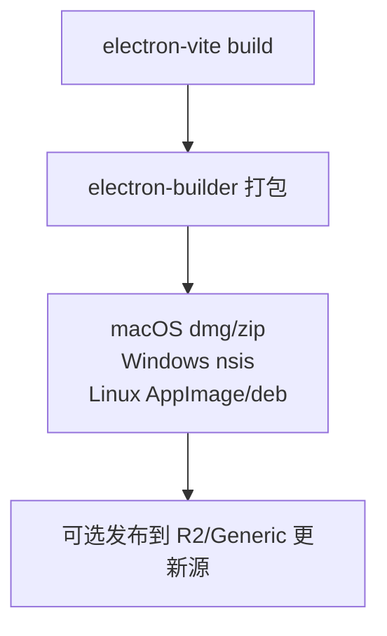
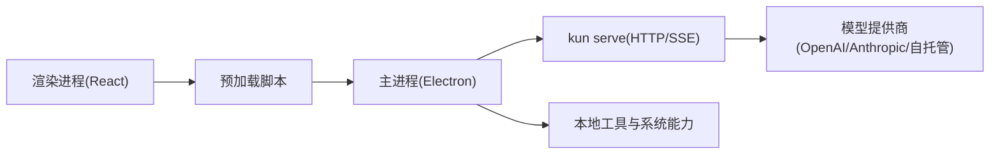

# 技术架构概览

<cite>
**本文引用的文件**
- [package.json](file://package.json)
- [README.md](file://README.md)
- [electron.vite.config.ts](file://electron.vite.config.ts)
- [src/main/index.ts](file://src/main/index.ts)
- [src/preload/index.ts](file://src/preload/index.ts)
- [src/main/kun-process.ts](file://src/main/kun-process.ts)
- [src/main/runtime/kun-adapter.ts](file://src/main/runtime/kun-adapter.ts)
- [electron-builder.config.cjs](file://electron-builder.config.cjs)
- [docs/kun-architecture.en.md](file://docs/kun-architecture.en.md)
- [docs/model-provider-presets.md](file://docs/model-provider-presets.md)
</cite>

## 目录
1. [简介](#简介)
2. [项目结构](#项目结构)
3. [核心组件](#核心组件)
4. [架构总览](#架构总览)
5. [详细组件分析](#详细组件分析)
6. [依赖关系分析](#依赖关系分析)
7. [性能考量](#性能考量)
8. [故障排查指南](#故障排查指南)
9. [结论](#结论)
10. [附录](#附录)

## 简介
本技术架构概览面向 DeepSeek-GUI（Kun）的桌面端实现，聚焦以下目标：
- 技术栈：Electron 桌面应用框架、React 前端界面、TypeScript 类型安全、Vite/electron-vite 构建工具。
- 进程职责：主进程、渲染进程、预加载脚本的职责分工与通信边界。
- 本地优先理念：会话、偏好、日志和运行时数据默认保存在本机；云端模型调用时仅发送必要上下文。
- 共享运行时模式：GUI 与 TUI 共用同一个 kun serve 运行时，统一通过 HTTP/SSE 边界访问线程、事件、审批与用量。
- 跨平台支持：macOS、Windows x64、Linux x64 的安装包与发布配置。
- 模型提供商集成：订阅登录、Coding Plan、Token Plan、API、OpenAI/Anthropic 兼容服务与自托管模型。

## 项目结构
仓库采用多模块组织方式：
- Electron 应用入口与打包配置位于根目录，使用 electron-vite 分别构建 main、preload、renderer。
- 主进程逻辑集中在 src/main，负责应用生命周期、窗口管理、托盘、扩展、运行时管理与 IPC 路由。
- 预加载脚本在 src/preload，暴露受限 API 给渲染进程，屏蔽 Node/Electron 原生能力。
- 渲染进程在 src/renderer，基于 React + TypeScript，使用 Zustand 等状态库构建 UI。
- 共享类型与工具在 src/shared，供主进程与渲染进程复用。
- 运行时核心 kun 作为独立子工程，提供 HTTP/SSE 接口与 Agent Loop，GUI/TUI 均通过该边界交互。

图表来源
- [electron.vite.config.ts:5-53](file://electron.vite.config.ts#L5-L53)
- [src/main/index.ts:1-120](file://src/main/index.ts#L1-L120)
- [src/preload/index.ts:1-120](file://src/preload/index.ts#L1-L120)
- [docs/kun-architecture.en.md:16-48](file://docs/kun-architecture.en.md#L16-L48)

章节来源
- [package.json:1-89](file://package.json#L1-L89)
- [electron.vite.config.ts:1-55](file://electron.vite.config.ts#L1-L55)

## 核心组件
- 主进程（Main）
  - 应用身份、单实例锁、窗口与托盘、更新、扩展、终端、工作区、权限与安全策略。
  - 管理共享 Kun 运行时：发现、启动、健康检查、停止、端口回收、配置同步。
  - 注册 IPC 处理器，将渲染进程请求转发到运行时或系统能力。
- 预加载脚本（Preload）
  - 在沙箱环境中暴露最小化 API（window.kunGui），封装 IPC 通道。
  - 提供 SSE 流式事件订阅、设置读写、文件操作、审批与用户输入、模型探测、扩展管理等能力。
- 渲染进程（Renderer）
  - 基于 React 的 GUI，通过 window.kunGui 调用主进程能力，不直接访问 Node/Electron。
  - 维护会话、线程、事件、用量、审批等状态，映射到 UI。
- 共享运行时（kun serve）
  - 提供稳定的 HTTP/SSE 边界：线程、回合、事件、审批、用户输入、用量、工作区状态等。
  - 内部包含缓存优先的 Agent Loop、工具执行、上下文压缩、使用量统计等。

章节来源
- [src/main/index.ts:1-250](file://src/main/index.ts#L1-L250)
- [src/preload/index.ts:1-200](file://src/preload/index.ts#L1-L200)
- [docs/kun-architecture.en.md:16-48](file://docs/kun-architecture.en.md#L16-L48)

## 架构总览
Kun 的 GUI 采用“单一运行时”设计：所有 Code、Design、Write、Connect Phone 等能力都通过同一个 kun serve 的 HTTP/SSE 边界进行。渲染进程不嵌入 Agent Loop，也不直接管理多个状态机，而是把业务逻辑收敛到运行时中，GUI 只负责状态映射与用户交互。

图表来源
- [docs/kun-architecture.en.md:16-48](file://docs/kun-architecture.en.md#L16-L48)
- [src/preload/index.ts:430-460](file://src/preload/index.ts#L430-L460)
- [src/main/runtime/kun-adapter.ts:107-131](file://src/main/runtime/kun-adapter.ts#L107-L131)

## 详细组件分析

### 主进程：应用生命周期与运行时管理
主进程负责：
- 应用初始化、身份与路径解析、旧数据迁移、日志目录、开发环境缓存。
- 单实例锁、窗口与托盘菜单、通知、电源管理、更新检查。
- 扩展生态：协议注册、视图会话、外部浏览器、内容脚本、权限同意。
- 运行时管理：确保 kun serve 运行、健康监控、配置同步、端口冲突处理、停止与恢复。
- IPC 路由：将渲染进程的请求分发到具体服务（设置、文件、工作区、审批、SSE、终端、扩展等）。

图表来源
- [src/main/index.ts:421-470](file://src/main/index.ts#L421-L470)
- [src/main/index.ts:712-740](file://src/main/index.ts#L712-L740)
- [src/main/runtime/kun-adapter.ts:127-159](file://src/main/runtime/kun-adapter.ts#L127-L159)

章节来源
- [src/main/index.ts:1-250](file://src/main/index.ts#L1-L250)
- [src/main/kun-process.ts:1-120](file://src/main/kun-process.ts#L1-L120)

### 预加载脚本：受限 API 与 IPC 桥接
预加载脚本在沙箱中暴露 window.kunGui，提供：
- 运行时请求与 SSE 流式事件（startSse、stopSse、onSseEvent、onSseEnd、onSseError）。
- 设置读写、凭证显示、CLI 安装状态、模型探测、用量查询。
- 文件与工作区操作、Git 分支与工作树、编辑器打开、预览资源。
- 审批与用户输入、通知、更新、日志、扩展管理、终端控制等。

图表来源
- [src/preload/index.ts:1-200](file://src/preload/index.ts#L1-L200)
- [src/preload/index.ts:430-460](file://src/preload/index.ts#L430-L460)
- [src/preload/index.ts:660-685](file://src/preload/index.ts#L660-L685)

章节来源
- [src/preload/index.ts:1-200](file://src/preload/index.ts#L1-L200)
- [src/preload/index.ts:430-460](file://src/preload/index.ts#L430-L460)
- [src/preload/index.ts:660-685](file://src/preload/index.ts#L660-L685)

### 共享运行时适配器：连接、认证与基础 URL
适配器负责：
- 解析可执行路径、构建参数、发现与验证共享运行时。
- 计算基础 URL、生成 Bearer Token 头、健康恢复与端口回收。
- 在 GUI 关闭或更新安装时安全停止共享运行时。

图表来源
- [src/main/runtime/kun-adapter.ts:41-105](file://src/main/runtime/kun-adapter.ts#L41-L105)
- [src/main/runtime/kun-adapter.ts:107-131](file://src/main/runtime/kun-adapter.ts#L107-L131)
- [src/main/runtime/kun-adapter.ts:133-159](file://src/main/runtime/kun-adapter.ts#L133-L159)

章节来源
- [src/main/runtime/kun-adapter.ts:1-200](file://src/main/runtime/kun-adapter.ts#L1-L200)

### 构建与打包：跨平台发布
- 使用 electron-vite 分别构建 main、preload、renderer，并启用 React 插件。
- 使用 electron-builder 配置产物名称、额外资源、签名与公证、语言包、目标平台。
- macOS 支持 arm64/x64，Windows 支持 x64 NSIS，Linux 支持 AppImage/deb。

图表来源
- [electron.vite.config.ts:5-53](file://electron.vite.config.ts#L5-L53)
- [electron-builder.config.cjs:113-324](file://electron-builder.config.cjs#L113-L324)

章节来源
- [electron.vite.config.ts:1-55](file://electron.vite.config.ts#L1-L55)
- [electron-builder.config.cjs:1-324](file://electron-builder.config.cjs#L1-L324)

### 本地优先的数据与运行时
- 会话、偏好、日志与运行时数据默认保存在本机。
- 首次启动会进行旧数据迁移与锁定，避免并发写入导致损坏。
- 选择云端 Provider 时，提示、附件与任务上下文会发送给所选模型服务；其余数据保留本地。

章节来源
- [README.md:33-50](file://README.md#L33-L50)
- [src/main/index.ts:443-470](file://src/main/index.ts#L443-L470)

### 共享运行时模式：GUI 与 TUI 共用 kun serve
- GUI 与 TUI 通过同一本地 kun serve 运行时共享线程、计划、审批、用量与后台任务。
- 渲染进程通过 HTTP/SSE 边界访问线程、事件、审批、用量与工作区状态。
- 主进程仅负责进程/配置/端口/令牌管理，不实现 Agent 业务逻辑。

章节来源
- [README.md:69-76](file://README.md#L69-L76)
- [docs/kun-architecture.en.md:16-48](file://docs/kun-architecture.en.md#L16-L48)
- [docs/kun-architecture.en.md:137-152](file://docs/kun-architecture.en.md#L137-L152)

### 模型提供商集成方式
- 预设与接入方式覆盖多种生态：DeepSeek、Xiaomi、MiniMax、Zhipu Coding Plan、Z.ai Coding Plan、Kimi、Moonshot 等。
- 支持 OpenAI Chat Completions、OpenAI Responses、Anthropic Messages 兼容协议。
- 用户可在设置中添加自定义 Provider，编辑 base URL、协议与模型 ID。
- 首次运行聚焦默认堆栈，其他 Provider 为可选添加。

章节来源
- [docs/model-provider-presets.md:1-136](file://docs/model-provider-presets.md#L1-L136)
- [README.md:159-164](file://README.md#L159-L164)

## 依赖关系分析
- 应用层依赖：React、Zustand、Tailwind、i18next、Tiptap、CodeMirror、Xterm 等用于构建现代桌面 UI。
- 运行时依赖：better-sqlite3、node-pty、sharp、tesseract.js、pdfjs-dist 等用于本地存储、终端、图像处理与 OCR。
- 构建与发布：electron-vite、electron-builder、vitest、eslint、typescript。
- 运行时核心：kun 子工程提供 HTTP/SSE 边界与 Agent Loop，GUI/TUI 通过该边界交互。

图表来源
- [package.json:90-182](file://package.json#L90-L182)
- [electron-builder.config.cjs:122-158](file://electron-builder.config.cjs#L122-L158)
- [docs/kun-architecture.en.md:16-48](file://docs/kun-architecture.en.md#L16-L48)

章节来源
- [package.json:90-182](file://package.json#L90-L182)
- [electron-builder.config.cjs:122-158](file://electron-builder.config.cjs#L122-L158)

## 性能考量
- 缓存命中优化：稳定系统提示前缀、工具模式规范化、历史消息修复、并发只读工具批处理、累计使用量持久化。
- 冷启动命中率较低，预热后应稳定超过 90%。
- 动态上下文必须追加在稳定前缀之后，避免破坏缓存指纹。
- 大输出与长参数需做 token 边界或标记化处理，避免日志膨胀。
- GUI 不实现 Agent 业务逻辑，减少渲染进程复杂度与状态同步成本。

章节来源
- [docs/kun-architecture.en.md:53-118](file://docs/kun-architecture.en.md#L53-L118)

## 故障排查指南
- 运行时健康检查：主进程通过健康监控与发现记录判断 kun serve 是否可用；若进程死亡或版本不匹配，尝试重启或重新发现。
- 端口冲突：提供端口回收与可用端口解析，避免多实例占用。
- 数据迁移与锁定：迁移失败时回退到旧目录，保证功能不受影响；迁移期间阻止受管运行时写入。
- SSE 流式事件：渲染进程通过 onSseEvent/onSseEnd/onSseError 处理流式输出与异常。
- 日志与诊断：提供日志路径获取与目录打开，便于定位问题。

章节来源
- [src/main/runtime/kun-adapter.ts:127-159](file://src/main/runtime/kun-adapter.ts#L127-L159)
- [src/preload/index.ts:430-460](file://src/preload/index.ts#L430-L460)
- [src/main/index.ts:712-740](file://src/main/index.ts#L712-L740)

## 结论
DeepSeek-GUI（Kun）以 Electron + React + TypeScript + Vite 构建桌面应用，采用“单一共享运行时”的架构，将 GUI 与 TUI 统一到 kun serve 的 HTTP/SSE 边界。主进程负责应用生命周期、运行时管理与 IPC 路由；预加载脚本暴露受限 API；渲染进程专注 UI 与状态映射。数据默认本地保存，模型调用按需发送至 Provider。跨平台安装包覆盖 macOS、Windows x64、Linux x64。模型提供商集成灵活，支持订阅、套餐、API、兼容协议与自托管模型。该设计使复杂任务可追溯、可恢复、可扩展，同时保持界面简洁与性能可控。

## 附录
- 快速开始：下载桌面版，选择语言，登录或配置 Provider，打开本地项目或新建工作区，发送明确任务。
- 开发命令：npm run dev 启动 GUI，npm run dev:tui 启动 TUI，npm run typecheck/lint/test/build/dist 完成开发与发布流程。
- 文档参考：kun-architecture、model-provider-presets、kun-tui、graph-mode、design-mode、workflow-loop 等。

章节来源
- [README.md:51-76](file://README.md#L51-L76)
- [README.md:201-243](file://README.md#L201-L243)
- [docs/kun-architecture.en.md:16-48](file://docs/kun-architecture.en.md#L16-L48)
- [docs/model-provider-presets.md:1-136](file://docs/model-provider-presets.md#L1-L136)