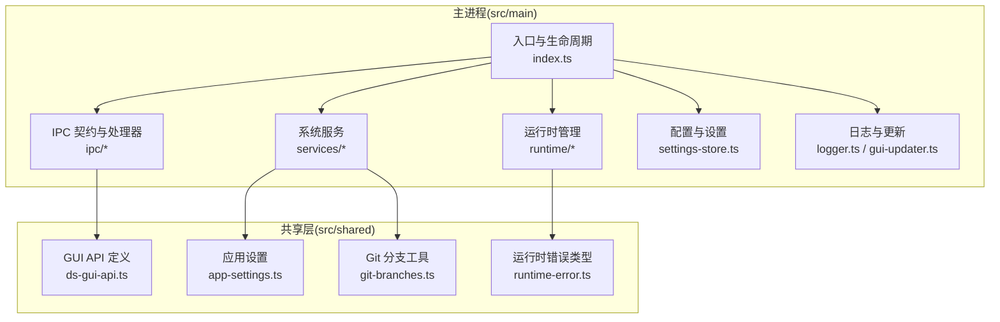
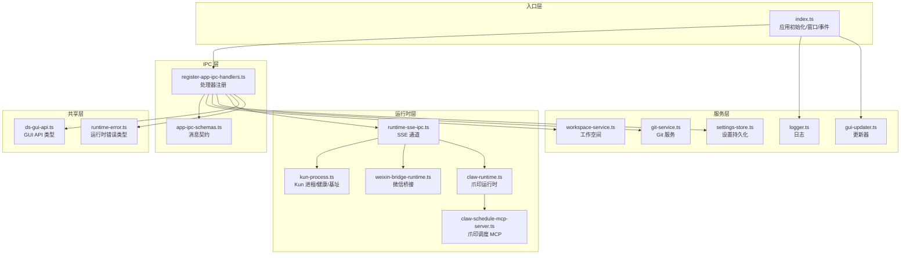
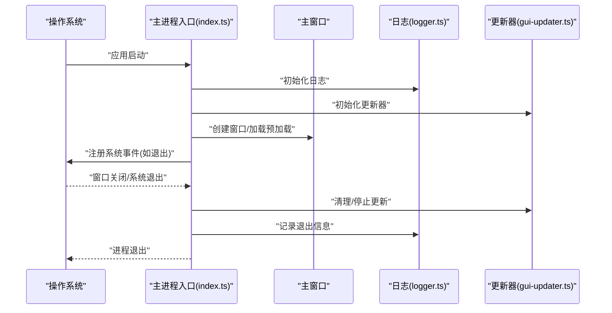
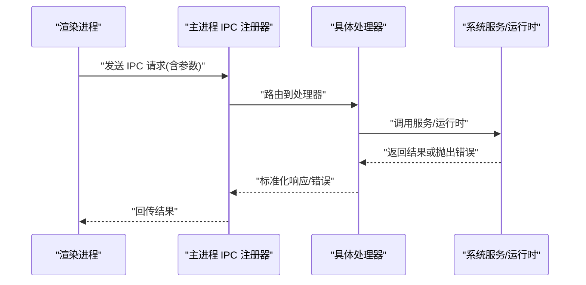
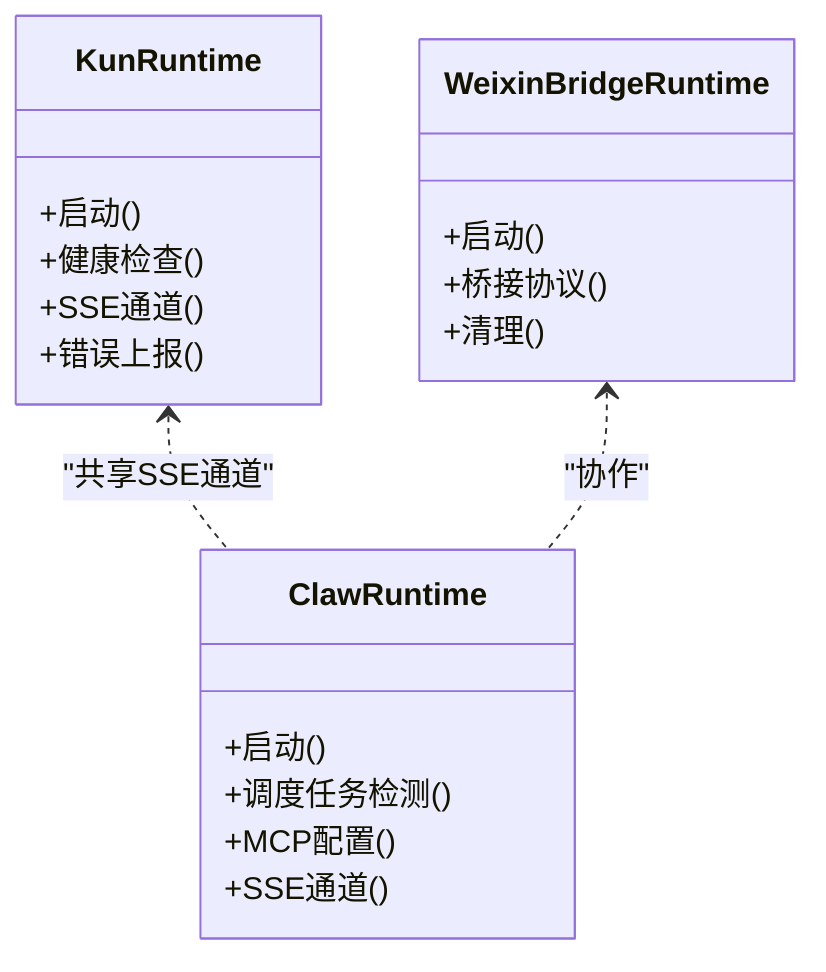
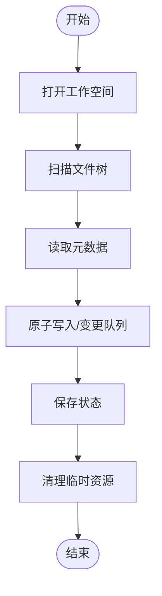
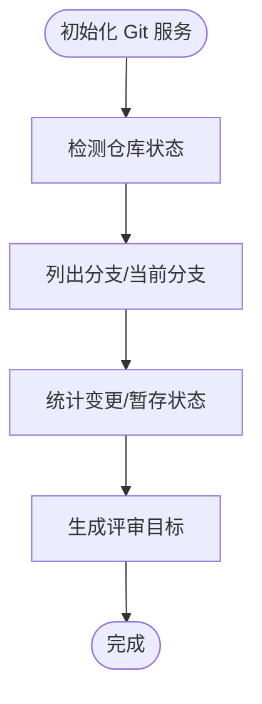
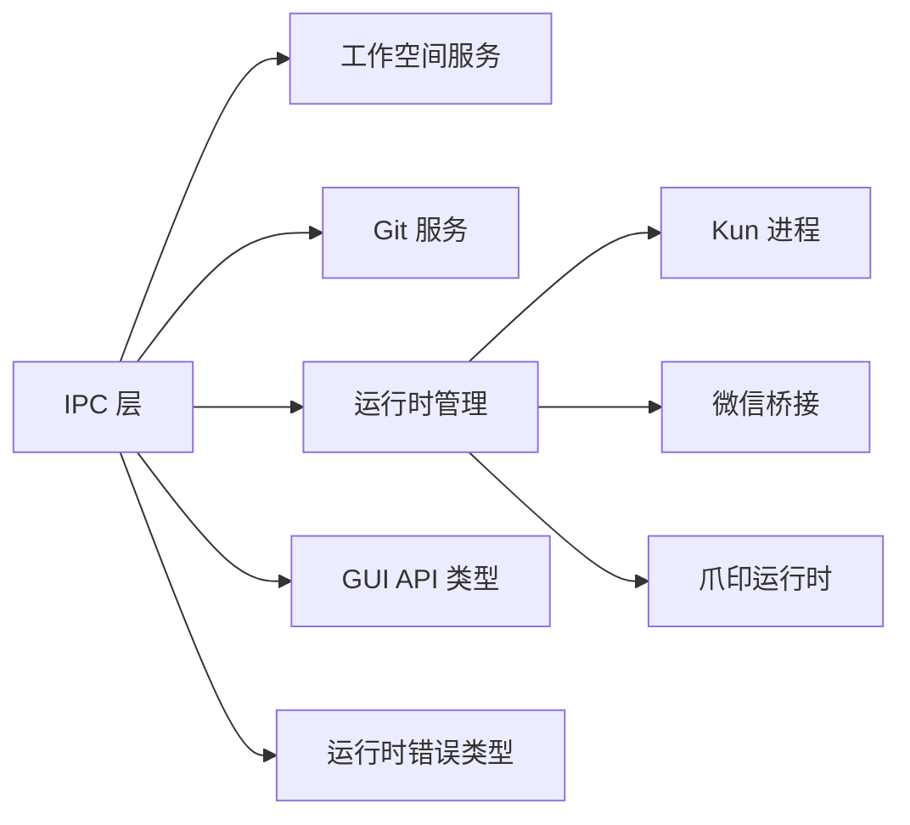

# 主进程层（Electron 主进程）

<cite>
**本文引用的文件**
- [src/main/index.ts](file://src/main/index.ts)
- [src/main/ipc/app-ipc-schemas.ts](file://src/main/ipc/app-ipc-schemas.ts)
- [src/main/ipc/register-app-ipc-handlers.ts](file://src/main/ipc/register-app-ipc-handlers.ts)
- [src/main/kun-process.ts](file://src/main/kun-process.ts)
- [src/main/kun-health.ts](file://src/main/kun-health.ts)
- [src/main/kun-base-url.ts](file://src/main/kun-base-url.ts)
- [src/main/weixin-bridge-runtime.ts](file://src/main/weixin-bridge-runtime.ts)
- [src/main/claw-runtime.ts](file://src/main/claw-runtime.ts)
- [src/main/claw-schedule-mcp-server.ts](file://src/main/claw-schedule-mcp-server.ts)
- [src/main/runtime-sse-ipc.ts](file://src/main/runtime-sse-ipc.ts)
- [src/main/services/workspace-service.ts](file://src/main/services/workspace-service.ts)
- [src/main/services/git-service.ts](file://src/main/services/git-service.ts)
- [src/main/settings-store.ts](file://src/main/settings-store.ts)
- [src/main/logger.ts](file://src/main/logger.ts)
- [src/main/gui-updater.ts](file://src/main/gui-updater.ts)
- [src/main/claw-platform-install.ts](file://src/main/claw-platform-install.ts)
- [src/main/upstream-models.ts](file://src/main/upstream-models.ts)
- [src/shared/ds-gui-api.ts](file://src/shared/ds-gui-api.ts)
- [src/shared/app-settings.ts](file://src/shared/app-settings.ts)
- [src/shared/git-branches.ts](file://src/shared/git-branches.ts)
- [src/shared/runtime-error.ts](file://src/shared/runtime-error.ts)
</cite>

## 目录
1. [简介](#简介)
2. [项目结构](#项目结构)
3. [核心组件](#核心组件)
4. [架构总览](#架构总览)
5. [详细组件分析](#详细组件分析)
6. [依赖关系分析](#依赖关系分析)
7. [性能考量](#性能考量)
8. [故障排查指南](#故障排查指南)
9. [结论](#结论)
10. [附录](#附录)

## 简介
本文件聚焦于 DeepSeek GUI 的 Electron 主进程层，系统性阐述其职责边界与实现方式，涵盖进程生命周期管理、IPC 通信处理、系统服务集成；重点说明主进程如何统一管理多运行时实例（Kun 运行时、微信桥接运行时、爪印运行时），以及如何处理文件系统操作、工作空间管理与 Git 服务集成。文档同时解释 IPC 通信机制的实现细节（消息路由、数据序列化、错误处理），并通过图示展示主进程与渲染层、各运行时之间的交互模式，帮助读者快速理解并高效维护该层。

## 项目结构
主进程相关代码主要位于 src/main 目录下，按功能域划分为：
- 入口与生命周期：入口文件负责应用初始化、窗口创建、事件监听与退出流程
- IPC 层：定义 IPC 消息契约与处理器注册逻辑
- 运行时管理：封装 Kun、微信桥接、爪印等运行时的启动、健康检查、SSE 通道
- 服务层：工作空间、Git、设置、日志、更新器等系统服务
- 共享接口：与渲染层约定的 API 定义与类型约束

图表来源
- [src/main/index.ts](file://src/main/index.ts)
- [src/main/ipc/app-ipc-schemas.ts](file://src/main/ipc/app-ipc-schemas.ts)
- [src/main/ipc/register-app-ipc-handlers.ts](file://src/main/ipc/register-app-ipc-handlers.ts)
- [src/main/kun-process.ts](file://src/main/kun-process.ts)
- [src/main/services/workspace-service.ts](file://src/main/services/workspace-service.ts)
- [src/main/services/git-service.ts](file://src/main/services/git-service.ts)
- [src/main/settings-store.ts](file://src/main/settings-store.ts)
- [src/main/logger.ts](file://src/main/logger.ts)
- [src/main/gui-updater.ts](file://src/main/gui-updater.ts)
- [src/shared/ds-gui-api.ts](file://src/shared/ds-gui-api.ts)
- [src/shared/app-settings.ts](file://src/shared/app-settings.ts)
- [src/shared/git-branches.ts](file://src/shared/git-branches.ts)
- [src/shared/runtime-error.ts](file://src/shared/runtime-error.ts)

章节来源
- [src/main/index.ts](file://src/main/index.ts)
- [src/main/ipc/app-ipc-schemas.ts](file://src/main/ipc/app-ipc-schemas.ts)
- [src/main/ipc/register-app-ipc-handlers.ts](file://src/main/ipc/register-app-ipc-handlers.ts)
- [src/main/kun-process.ts](file://src/main/kun-process.ts)
- [src/main/kun-health.ts](file://src/main/kun-health.ts)
- [src/main/kun-base-url.ts](file://src/main/kun-base-url.ts)
- [src/main/weixin-bridge-runtime.ts](file://src/main/weixin-bridge-runtime.ts)
- [src/main/claw-runtime.ts](file://src/main/claw-runtime.ts)
- [src/main/claw-schedule-mcp-server.ts](file://src/main/claw-schedule-mcp-server.ts)
- [src/main/runtime-sse-ipc.ts](file://src/main/runtime-sse-ipc.ts)
- [src/main/services/workspace-service.ts](file://src/main/services/workspace-service.ts)
- [src/main/services/git-service.ts](file://src/main/services/git-service.ts)
- [src/main/settings-store.ts](file://src/main/settings-store.ts)
- [src/main/logger.ts](file://src/main/logger.ts)
- [src/main/gui-updater.ts](file://src/main/gui-updater.ts)
- [src/shared/ds-gui-api.ts](file://src/shared/ds-gui-api.ts)
- [src/shared/app-settings.ts](file://src/shared/app-settings.ts)
- [src/shared/git-branches.ts](file://src/shared/git-branches.ts)
- [src/shared/runtime-error.ts](file://src/shared/runtime-error.ts)

## 核心组件
- 进程生命周期管理：负责应用启动、窗口创建、菜单/托盘、系统级事件（如 macOS 退出）与优雅退出
- IPC 通信：定义消息契约、注册处理器、路由到具体服务或运行时，并进行错误传播
- 运行时管理：统一管理 Kun、微信桥接、爪印运行时，包含健康检查、SSE 通道、MCP 配置与调度
- 系统服务：工作空间文件读写、Git 仓库状态与分支管理、设置持久化、日志记录、自动更新
- 共享接口：与渲染层约定的 API 类型与错误模型，确保跨进程调用的一致性

章节来源
- [src/main/index.ts](file://src/main/index.ts)
- [src/main/ipc/app-ipc-schemas.ts](file://src/main/ipc/app-ipc-schemas.ts)
- [src/main/ipc/register-app-ipc-handlers.ts](file://src/main/ipc/register-app-ipc-handlers.ts)
- [src/main/kun-process.ts](file://src/main/kun-process.ts)
- [src/main/services/workspace-service.ts](file://src/main/services/workspace-service.ts)
- [src/main/services/git-service.ts](file://src/main/services/git-service.ts)
- [src/main/settings-store.ts](file://src/main/settings-store.ts)
- [src/main/logger.ts](file://src/main/logger.ts)
- [src/main/gui-updater.ts](file://src/main/gui-updater.ts)
- [src/shared/ds-gui-api.ts](file://src/shared/ds-gui-api.ts)
- [src/shared/runtime-error.ts](file://src/shared/runtime-error.ts)

## 架构总览
主进程采用“入口驱动 + IPC 路由 + 运行时编排 + 服务抽象”的分层设计。入口文件负责初始化与事件监听；IPC 层负责消息路由与错误传播；运行时层负责外部进程生命周期与 SSE 通道；服务层封装文件系统、Git、设置等系统能力；共享层提供类型与 API 约束。

图表来源
- [src/main/index.ts](file://src/main/index.ts)
- [src/main/ipc/app-ipc-schemas.ts](file://src/main/ipc/app-ipc-schemas.ts)
- [src/main/ipc/register-app-ipc-handlers.ts](file://src/main/ipc/register-app-ipc-handlers.ts)
- [src/main/kun-process.ts](file://src/main/kun-process.ts)
- [src/main/kun-health.ts](file://src/main/kun-health.ts)
- [src/main/kun-base-url.ts](file://src/main/kun-base-url.ts)
- [src/main/weixin-bridge-runtime.ts](file://src/main/weixin-bridge-runtime.ts)
- [src/main/claw-runtime.ts](file://src/main/claw-runtime.ts)
- [src/main/claw-schedule-mcp-server.ts](file://src/main/claw-schedule-mcp-server.ts)
- [src/main/runtime-sse-ipc.ts](file://src/main/runtime-sse-ipc.ts)
- [src/main/services/workspace-service.ts](file://src/main/services/workspace-service.ts)
- [src/main/services/git-service.ts](file://src/main/services/git-service.ts)
- [src/main/settings-store.ts](file://src/main/settings-store.ts)
- [src/main/logger.ts](file://src/main/logger.ts)
- [src/main/gui-updater.ts](file://src/main/gui-updater.ts)
- [src/shared/ds-gui-api.ts](file://src/shared/ds-gui-api.ts)
- [src/shared/runtime-error.ts](file://src/shared/runtime-error.ts)

## 详细组件分析

### 进程生命周期管理
- 启动流程：入口文件负责创建主窗口、加载上下文隔离预加载脚本、注册系统级事件（如 macOS 退出）、初始化日志与更新器
- 退出流程：捕获关闭事件，触发运行时清理、工作空间保存、设置落盘与资源释放，确保无悬挂进程
- 窗口与菜单：根据平台特性配置窗口行为、托盘与快捷键，保证用户体验一致性

图表来源
- [src/main/index.ts](file://src/main/index.ts)
- [src/main/logger.ts](file://src/main/logger.ts)
- [src/main/gui-updater.ts](file://src/main/gui-updater.ts)

章节来源
- [src/main/index.ts](file://src/main/index.ts)
- [src/main/logger.ts](file://src/main/logger.ts)
- [src/main/gui-updater.ts](file://src/main/gui-updater.ts)

### IPC 通信机制
- 消息契约：通过 IPC 契约文件定义请求/响应结构与错误类型，确保前后端一致
- 处理器注册：集中注册各类 IPC 处理器，按路由规则分发到对应服务或运行时
- 数据序列化：使用安全的序列化策略传递复杂对象，避免循环引用与不可序列化字段
- 错误处理：统一包装运行时错误与业务错误，向渲染层返回标准化错误结构

图表来源
- [src/main/ipc/app-ipc-schemas.ts](file://src/main/ipc/app-ipc-schemas.ts)
- [src/main/ipc/register-app-ipc-handlers.ts](file://src/main/ipc/register-app-ipc-handlers.ts)
- [src/shared/ds-gui-api.ts](file://src/shared/ds-gui-api.ts)
- [src/shared/runtime-error.ts](file://src/shared/runtime-error.ts)

章节来源
- [src/main/ipc/app-ipc-schemas.ts](file://src/main/ipc/app-ipc-schemas.ts)
- [src/main/ipc/register-app-ipc-handlers.ts](file://src/main/ipc/register-app-ipc-handlers.ts)
- [src/shared/ds-gui-api.ts](file://src/shared/ds-gui-api.ts)
- [src/shared/runtime-error.ts](file://src/shared/runtime-error.ts)

### 运行时管理（Kun/微信桥接/爪印）
- Kun 运行时：封装二进制可执行文件解析、进程启动、健康检查与基址暴露，支持 SSE 通道与错误上报
- 微信桥接运行时：负责桥接微信生态的运行时生命周期与通信协议
- 爪印运行时：包含调度任务检测、MCP 配置与服务器启动，支持计划类任务的自动化执行

图表来源
- [src/main/kun-process.ts](file://src/main/kun-process.ts)
- [src/main/kun-health.ts](file://src/main/kun-health.ts)
- [src/main/kun-base-url.ts](file://src/main/kun-base-url.ts)
- [src/main/weixin-bridge-runtime.ts](file://src/main/weixin-bridge-runtime.ts)
- [src/main/claw-runtime.ts](file://src/main/claw-runtime.ts)
- [src/main/claw-schedule-mcp-server.ts](file://src/main/claw-schedule-mcp-server.ts)
- [src/main/runtime-sse-ipc.ts](file://src/main/runtime-sse-ipc.ts)

章节来源
- [src/main/kun-process.ts](file://src/main/kun-process.ts)
- [src/main/kun-health.ts](file://src/main/kun-health.ts)
- [src/main/kun-base-url.ts](file://src/main/kun-base-url.ts)
- [src/main/weixin-bridge-runtime.ts](file://src/main/weixin-bridge-runtime.ts)
- [src/main/claw-runtime.ts](file://src/main/claw-runtime.ts)
- [src/main/claw-schedule-mcp-server.ts](file://src/main/claw-schedule-mcp-server.ts)
- [src/main/runtime-sse-ipc.ts](file://src/main/runtime-sse-ipc.ts)

### 工作空间与文件系统
- 文件读写：提供安全的文件读取、原子写入与会话/线程存储适配，避免并发冲突
- 工作空间 Inspector：扫描与解析本地工作空间，提取文件树与元数据
- 资源清理：在退出或切换工作空间时，释放缓存与锁文件，确保磁盘一致性

图表来源
- [src/main/services/workspace-service.ts](file://src/main/services/workspace-service.ts)
- [kun/src/adapters/file/atomic-write.ts](file://kun/src/adapters/file/atomic-write.ts)
- [kun/src/adapters/file/file-session-store.ts](file://kun/src/adapters/file/file-session-store.ts)
- [kun/src/adapters/file/file-thread-store.ts](file://kun/src/adapters/file/file-thread-store.ts)
- [kun/src/adapters/hybrid/hybrid-session-store.ts](file://kun/src/adapters/hybrid/hybrid-session-store.ts)
- [kun/src/adapters/hybrid/hybrid-thread-store.ts](file://kun/src/adapters/hybrid/hybrid-thread-store.ts)

章节来源
- [src/main/services/workspace-service.ts](file://src/main/services/workspace-service.ts)
- [kun/src/adapters/file/atomic-write.ts](file://kun/src/adapters/file/atomic-write.ts)
- [kun/src/adapters/file/file-session-store.ts](file://kun/src/adapters/file/file-session-store.ts)
- [kun/src/adapters/file/file-thread-store.ts](file://kun/src/adapters/file/file-thread-store.ts)
- [kun/src/adapters/hybrid/hybrid-session-store.ts](file://kun/src/adapters/hybrid/hybrid-session-store.ts)
- [kun/src/adapters/hybrid/hybrid-thread-store.ts](file://kun/src/adapters/hybrid/hybrid-thread-store.ts)

### Git 服务集成
- 仓库状态：检测当前分支、未提交变更、暂存区状态，用于工作空间与评审流程
- 分支管理：提供分支列表、切换与合并建议，辅助用户决策
- 评审目标：生成评审所需的差异与上下文，供上层服务消费

图表来源
- [src/main/services/git-service.ts](file://src/main/services/git-service.ts)
- [src/shared/git-branches.ts](file://src/shared/git-branches.ts)

章节来源
- [src/main/services/git-service.ts](file://src/main/services/git-service.ts)
- [src/shared/git-branches.ts](file://src/shared/git-branches.ts)

### 设置与配置
- 设置持久化：提供键值式设置存储与读取，支持默认值与校验
- 应用设置：集中管理 GUI 行为、模型选择、编辑偏好等
- 平台化配置：区分不同平台的安装路径与运行参数

章节来源
- [src/main/settings-store.ts](file://src/main/settings-store.ts)
- [src/shared/app-settings.ts](file://src/shared/app-settings.ts)
- [src/main/claw-platform-install.ts](file://src/main/claw-platform-install.ts)
- [src/main/upstream-models.ts](file://src/main/upstream-models.ts)

### 日志与更新
- 日志：统一输出格式与级别，支持滚动与导出
- 自动更新：后台检查更新、下载与重启替换，保障版本一致性

章节来源
- [src/main/logger.ts](file://src/main/logger.ts)
- [src/main/gui-updater.ts](file://src/main/gui-updater.ts)

## 依赖关系分析
主进程层内部模块耦合度低，通过 IPC 与共享层解耦。运行时层与服务层均通过 IPC 对外暴露能力，避免直接互相依赖。共享层提供稳定的 API 类型与错误模型，降低跨进程调用的不一致性风险。

图表来源
- [src/main/ipc/register-app-ipc-handlers.ts](file://src/main/ipc/register-app-ipc-handlers.ts)
- [src/main/services/workspace-service.ts](file://src/main/services/workspace-service.ts)
- [src/main/services/git-service.ts](file://src/main/services/git-service.ts)
- [src/main/kun-process.ts](file://src/main/kun-process.ts)
- [src/main/weixin-bridge-runtime.ts](file://src/main/weixin-bridge-runtime.ts)
- [src/main/claw-runtime.ts](file://src/main/claw-runtime.ts)
- [src/shared/ds-gui-api.ts](file://src/shared/ds-gui-api.ts)
- [src/shared/runtime-error.ts](file://src/shared/runtime-error.ts)

章节来源
- [src/main/ipc/register-app-ipc-handlers.ts](file://src/main/ipc/register-app-ipc-handlers.ts)
- [src/main/services/workspace-service.ts](file://src/main/services/workspace-service.ts)
- [src/main/services/git-service.ts](file://src/main/services/git-service.ts)
- [src/main/kun-process.ts](file://src/main/kun-process.ts)
- [src/main/weixin-bridge-runtime.ts](file://src/main/weixin-bridge-runtime.ts)
- [src/main/claw-runtime.ts](file://src/main/claw-runtime.ts)
- [src/shared/ds-gui-api.ts](file://src/shared/ds-gui-api.ts)
- [src/shared/runtime-error.ts](file://src/shared/runtime-error.ts)

## 性能考量
- IPC 路由优化：对高频请求进行批处理与去抖，减少主线程阻塞
- 运行时健康检查：定期探测外部进程状态，及时重启以避免卡死
- 文件系统写入：采用原子写入与变更队列，降低磁盘 IO 抖动
- 缓存与索引：对工作空间扫描结果进行缓存，增量更新以提升响应速度
- 更新策略：后台静默更新，避免影响用户工作流

## 故障排查指南
- IPC 调用失败：检查消息契约是否匹配、处理器是否存在、错误是否被正确包装
- 运行时异常：查看运行时错误类型与日志，确认基址、SSE 通道与健康检查状态
- 工作空间问题：核对文件权限、锁文件残留与原子写入队列状态
- Git 异常：确认仓库路径、分支状态与暂存区一致性，必要时回滚或重置
- 更新失败：检查网络连通性、签名验证与重启策略

章节来源
- [src/main/ipc/register-app-ipc-handlers.ts](file://src/main/ipc/register-app-ipc-handlers.ts)
- [src/shared/runtime-error.ts](file://src/shared/runtime-error.ts)
- [src/main/logger.ts](file://src/main/logger.ts)
- [src/main/gui-updater.ts](file://src/main/gui-updater.ts)

## 结论
主进程层通过清晰的分层设计与严格的 IPC 约束，实现了对多运行时与系统服务的统一编排。其生命周期管理、IPC 路由、运行时控制与文件/Git 服务集成共同构成了 DeepSeek GUI 的核心基础设施。遵循本文档的交互模式与最佳实践，可有效提升系统的稳定性与可维护性。

## 附录
- 关键启动流程参考：[src/main/index.ts](file://src/main/index.ts)
- IPC 消息路由参考：[src/main/ipc/register-app-ipc-handlers.ts](file://src/main/ipc/register-app-ipc-handlers.ts)
- 运行时生命周期参考：[src/main/kun-process.ts](file://src/main/kun-process.ts)、[src/main/claw-runtime.ts](file://src/main/claw-runtime.ts)
- 工作空间与文件系统参考：[src/main/services/workspace-service.ts](file://src/main/services/workspace-service.ts)
- Git 服务参考：[src/main/services/git-service.ts](file://src/main/services/git-service.ts)
- 设置与配置参考：[src/main/settings-store.ts](file://src/main/settings-store.ts)
- 日志与更新参考：[src/main/logger.ts](file://src/main/logger.ts)、[src/main/gui-updater.ts](file://src/main/gui-updater.ts)
- 共享 API 与错误类型参考：[src/shared/ds-gui-api.ts](file://src/shared/ds-gui-api.ts)、[src/shared/runtime-error.ts](file://src/shared/runtime-error.ts)