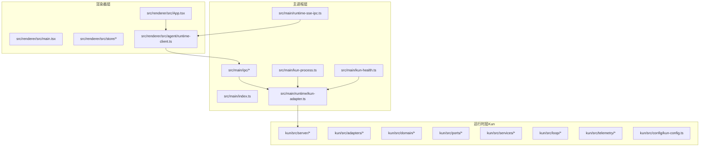
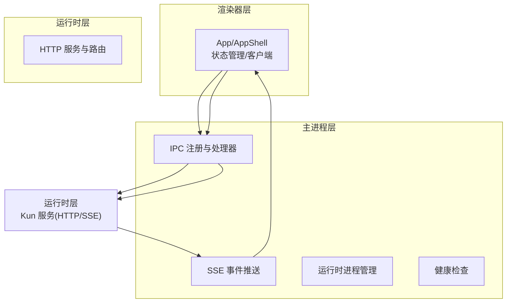
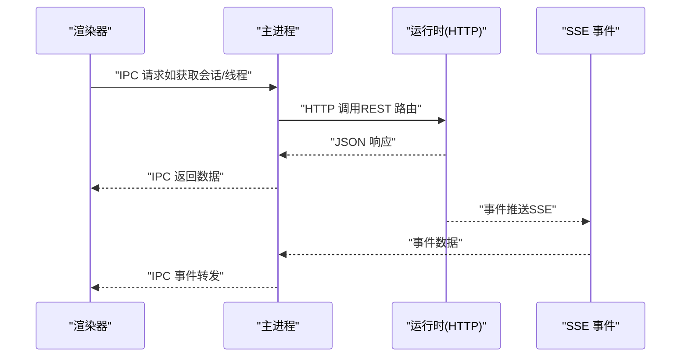
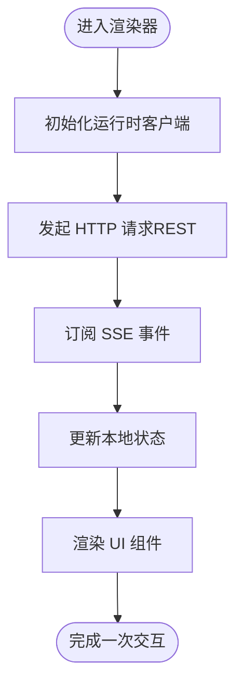
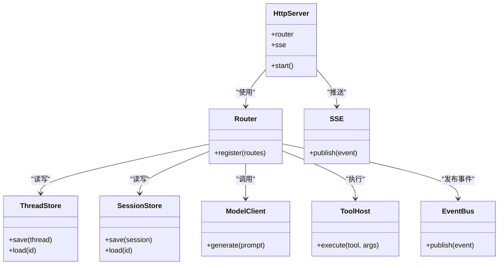
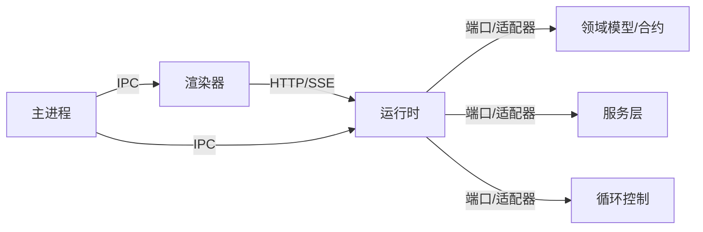

# 分层架构详解

<cite>
**本文引用的文件**
- [src/main/index.ts](file://src/main/index.ts)
- [src/preload/index.ts](file://src/preload/index.ts)
- [src/main/ipc/register-app-ipc-handlers.ts](file://src/main/ipc/register-app-ipc-handlers.ts)
- [src/main/ipc/app-ipc-schemas.ts](file://src/main/ipc/app-ipc-schemas.ts)
- [src/main/runtime/kun-adapter.ts](file://src/main/runtime/kun-adapter.ts)
- [src/main/runtime-sse-ipc.ts](file://src/main/runtime-sse-ipc.ts)
- [src/main/kun-health.ts](file://src/main/kun-health.ts)
- [src/main/kun-process.ts](file://src/main/kun-process.ts)
- [src/renderer/src/main.tsx](file://src/renderer/src/main.tsx)
- [src/renderer/src/App.tsx](file://src/renderer/src/App.tsx)
- [src/renderer/src/AppShell.tsx](file://src/renderer/src/AppShell.tsx)
- [src/renderer/src/agent/runtime-client.ts](file://src/renderer/src/agent/runtime-client.ts)
- [src/renderer/src/store/chat-store.ts](file://src/renderer/src/store/chat-store.ts)
- [src/renderer/src/store/chat-store-runtime.ts](file://src/renderer/src/store/chat-store-runtime.ts)
- [src/shared/ds-gui-api.ts](file://src/shared/ds-gui-api.ts)
- [src/shared/kun-endpoints.ts](file://src/shared/kun-endpoints.ts)
- [kun/src/server/index.ts](file://kun/src/server/index.ts)
- [kun/src/server/http-server.ts](file://kun/src/server/http-server.ts)
- [kun/src/server/sse.ts](file://kun/src/server/sse.ts)
- [kun/src/server/routes/index.ts](file://kun/src/server/routes/index.ts)
- [kun/src/server/routes/threads.ts](file://kun/src/server/routes/threads.ts)
- [kun/src/server/routes/sessions.ts](file://kun/src/server/routes/sessions.ts)
- [kun/src/server/routes/events.ts](file://kun/src/server/routes/events.ts)
- [kun/src/server/routes/health.ts](file://kun/src/server/routes/health.ts)
- [kun/src/server/routes/server-runtime.ts](file://kun/src/server/routes/server-runtime.ts)
- [kun/src/server/routes/runtime-info.ts](file://kun/src/server/routes/runtime-info.ts)
- [kun/src/server/routes/runtime-error.ts](file://kun/src/server/routes/runtime-error.ts)
- [kun/src/server/routes/memory.ts](file://kun/src/server/routes/memory.ts)
- [kun/src/server/routes/usage.ts](file://kun/src/server/routes/usage.ts)
- [kun/src/server/routes/user-inputs.ts](file://kun/src/server/routes/user-inputs.ts)
- [kun/src/server/routes/workspace.ts](file://kun/src/server/routes/workspace.ts)
- [kun/src/server/routes/review.ts](file://kun/src/server/routes/review.ts)
- [kun/src/server/routes/approvals.ts](file://kun/src/server/routes/approvals.ts)
- [kun/src/server/routes/turns.ts](file://kun/src/server/routes/turns.ts)
- [kun/src/server/routes/skills.ts](file://kun/src/server/routes/skills.ts)
- [kun/src/server/routes/attachments.ts](file://kun/src/server/routes/attachments.ts)
- [kun/src/server/router.ts](file://kun/src/server/router.ts)
- [kun/src/server/runtime-factory.ts](file://kun/src/server/runtime-factory.ts)
- [kun/src/adapters/index.ts](file://kun/src/adapters/index.ts)
- [kun/src/adapters/file/index.ts](file://kun/src/adapters/file/index.ts)
- [kun/src/adapters/hybrid/index.ts](file://kun/src/adapters/hybrid/index.ts)
- [kun/src/adapters/in-memory-session-store.ts](file://kun/src/adapters/in-memory-session-store.ts)
- [kun/src/adapters/in-memory-thread-store.ts](file://kun/src/adapters/in-memory-thread-store.ts)
- [kun/src/adapters/model/deepseek-compat-model-client.ts](file://kun/src/adapters/model/deepseek-comcompat-model-client.ts)
- [kun/src/adapters/tool/builtin-tools.ts](file://kun/src/adapters/tool/builtin-tools.ts)
- [kun/src/domain/index.ts](file://kun/src/domain/index.ts)
- [kun/src/domain/thread.ts](file://kun/src/domain/thread.ts)
- [kun/src/domain/session.ts](file://kun/src/domain/session.ts)
- [kun/src/domain/turn.ts](file://kun/src/domain/turn.ts)
- [kun/src/ports/index.ts](file://kun/src/ports/index.ts)
- [kun/src/ports/thread-store.ts](file://kun/src/ports/thread-store.ts)
- [kun/src/ports/session-store.ts](file://kun/src/ports/session-store.ts)
- [kun/src/ports/model-client.ts](file://kun/src/ports/model-client.ts)
- [kun/src/ports/tool-host.ts](file://kun/src/ports/tool-host.ts)
- [kun/src/ports/event-bus.ts](file://kun/src/ports/event-bus.ts)
- [kun/src/services/thread-service.ts](file://kun/src/services/thread-service.ts)
- [kun/src/services/turn-service.ts](file://kun/src/services/turn-service.ts)
- [kun/src/services/usage-service.ts](file://kun/src/services/usage-service.ts)
- [kun/src/loop/agent-loop.ts](file://kun/src/loop/agent-loop.ts)
- [kun/src/loop/context-estimator.ts](file://kun/src/loop/context-estimator.ts)
- [kun/src/loop/token-economy.ts](file://kun/src/loop/token-economy.ts)
- [kun/src/telemetry/usage-counter.ts](file://kun/src/telemetry/usage-counter.ts)
- [kun/src/telemetry/cache-telemetry.ts](file://kun/src/telemetry/cache-telemetry.ts)
- [kun/src/config/kun-config.ts](file://kun/src/config/kun-config.ts)
- [kun/src/cli/serve.ts](file://kun/src/cli/serve.ts)
- [kun/src/cli/serve-entry.ts](file://kun/src/cli/serve-entry.ts)
- [kun/src/cli/agent-cli.ts](file://kun/src/cli/agent-cli.ts)
- [kun/src/contracts/index.ts](file://kun/src/contracts/index.ts)
- [kun/src/contracts/threads.ts](file://kun/src/contracts/threads.ts)
- [kun/src/contracts/sessions.ts](file://kun/src/contracts/sessions.ts)
- [kun/src/contracts/turns.ts](file://kun/src/contracts/turns.ts)
- [kun/src/contracts/events.ts](file://kun/src/contracts/events.ts)
- [kun/src/contracts/runtime-info.ts](file://kun/src/contracts/runtime-info.ts)
- [kun/src/contracts/usage.ts](file://kun/src/contracts/usage.ts)
- [kun/src/contracts/workspace.ts](file://kun/src/contracts/workspace.ts)
- [kun/src/contracts/memory.ts](file://kun/src/contracts/memory.ts)
- [kun/src/contracts/approvals.ts](file://kun/src/contracts/approvals.ts)
- [kun/src/contracts/attachments.ts](file://kun/src/contracts/attachments.ts)
- [kun/src/contracts/policy.ts](file://kun/src/contracts/policy.ts)
- [kun/src/contracts/errors.ts](file://kun/src/contracts/errors.ts)
- [kun/src/contracts/items.ts](file://kun/src/contracts/items.ts)
- [kun/src/contracts/capabilities.ts](file://kun/src/contracts/capabilities.ts)
- [kun/src/contracts/review.ts](file://kun/src/contracts/review.ts)
- [kun/src/contracts/usage.ts](file://kun/src/contracts/usage.ts)
- [kun/src/contracts/runtime-info.ts](file://kun/src/contracts/runtime-info.ts)
- [kun/src/contracts/errors.ts](file://kun/src/contracts/errors.ts)
- [kun/src/contracts/policy.ts](file://kun/src/contracts/policy.ts)
- [kun/src/contracts/items.ts](file://kun/src/contracts/items.ts)
- [kun/src/contracts/capabilities.ts](file://kun/src/contracts/capabilities.ts)
- [kun/src/contracts/review.ts](file://kun/src/contracts/review.ts)
- [kun/src/contracts/usage.ts](file://kun/src/contracts/usage.ts)
- [kun/src/contracts/runtime-info.ts](file://kun/src/contracts/runtime-info.ts)
- [kun/src/contracts/errors.ts](file://kun/src/contracts/errors.ts)
- [kun/src/contracts/policy.ts](file://kun/src/contracts/policy.ts)
- [kun/src/contracts/items.ts](file://kun/src/contracts/items.ts)
- [kun/src/contracts/capabilities.ts](file://kun/src/contracts/capabilities.ts)
- [kun/src/contracts/review.ts](file://kun/src/contracts/review.ts)
</cite>

## 目录
1. [引言](#引言)
2. [项目结构](#项目结构)
3. [核心组件](#核心组件)
4. [架构总览](#架构总览)
5. [详细组件分析](#详细组件分析)
6. [依赖关系分析](#依赖关系分析)
7. [性能考量](#性能考量)
8. [故障排查指南](#故障排查指南)
9. [结论](#结论)
10. [附录](#附录)

## 引言
本文件面向 DeepSeek GUI 的三层架构进行系统化解析：主进程层（Node.js 环境，负责系统级服务、进程管理、GUI 服务）、渲染器层（React 应用，负责用户界面、状态管理、组件交互）、运行时层（Kun 包，负责智能体逻辑、工具系统、存储适配器）。文档将明确每层职责边界、接口定义与数据流向，并解释跨层通信机制（IPC 通信、HTTP API、SSE 推送），最后通过图示与路径引用帮助读者快速定位实现位置。

## 项目结构
DeepSeek GUI 采用 Electron 主进程 + 渲染器 React 前端 + Kun 运行时三层架构。主进程负责应用生命周期、系统集成与与运行时的桥接；渲染器负责 UI 与用户交互；运行时层提供智能体执行、工具调用、存储与事件流等能力。

图表来源
- [src/main/index.ts](file://src/main/index.ts)
- [src/main/ipc/register-app-ipc-handlers.ts](file://src/main/ipc/register-app-ipc-handlers.ts)
- [src/main/runtime/kun-adapter.ts](file://src/main/runtime/kun-adapter.ts)
- [src/main/runtime-sse-ipc.ts](file://src/main/runtime-sse-ipc.ts)
- [src/main/kun-process.ts](file://src/main/kun-process.ts)
- [src/main/kun-health.ts](file://src/main/kun-health.ts)
- [src/renderer/src/App.tsx](file://src/renderer/src/App.tsx)
- [src/renderer/src/agent/runtime-client.ts](file://src/renderer/src/agent/runtime-client.ts)
- [kun/src/server/index.ts](file://kun/src/server/index.ts)

章节来源
- [src/main/index.ts](file://src/main/index.ts)
- [src/renderer/src/main.tsx](file://src/renderer/src/main.tsx)
- [kun/src/server/index.ts](file://kun/src/server/index.ts)

## 核心组件
- 主进程入口与生命周期
  - 主进程入口负责创建窗口、加载预加载脚本、注册 IPC 处理器、启动/管理运行时进程、健康检查与 SSE 推送桥接。
  - 关键文件：[src/main/index.ts](file://src/main/index.ts)、[src/main/kun-process.ts](file://src/main/kun-process.ts)、[src/main/kun-health.ts](file://src/main/kun-health.ts)、[src/main/runtime-sse-ipc.ts](file://src/main/runtime-sse-ipc.ts)

- 预加载脚本与安全上下文
  - 预加载脚本在受控上下文中暴露有限 API 给渲染器，确保 IPC 调用的安全通道。
  - 关键文件：[src/preload/index.ts](file://src/preload/index.ts)

- 渲染器应用与状态管理
  - 渲染器以 React 为主，包含应用壳层、路由与状态管理模块，通过运行时客户端访问运行时服务。
  - 关键文件：[src/renderer/src/App.tsx](file://src/renderer/src/App.tsx)、[src/renderer/src/AppShell.tsx](file://src/renderer/src/AppShell.tsx)、[src/renderer/src/store/chat-store.ts](file://src/renderer/src/store/chat-store.ts)、[src/renderer/src/store/chat-store-runtime.ts](file://src/renderer/src/store/chat-store-runtime.ts)、[src/renderer/src/agent/runtime-client.ts](file://src/renderer/src/agent/runtime-client.ts)

- 运行时服务与 HTTP/SSE
  - 运行时以 HTTP 服务形式对外提供 REST API，同时通过 SSE 推送事件到渲染器；路由覆盖会话、线程、事件、内存、用量、工作区等。
  - 关键文件：[kun/src/server/index.ts](file://kun/src/server/index.ts)、[kun/src/server/http-server.ts](file://kun/src/server/http-server.ts)、[kun/src/server/sse.ts](file://kun/src/server/sse.ts)、[kun/src/server/routes/index.ts](file://kun/src/server/routes/index.ts)

- 存储适配器与领域模型
  - 提供文件、混合与内存适配器，抽象会话/线程存储；领域模型定义线程、会话、回合等核心实体。
  - 关键文件：[kun/src/adapters/index.ts](file://kun/src/adapters/index.ts)、[kun/src/domain/index.ts](file://kun/src/domain/index.ts)、[kun/src/domain/thread.ts](file://kun/src/domain/thread.ts)、[kun/src/domain/session.ts](file://kun/src/domain/session.ts)、[kun/src/domain/turn.ts](file://kun/src/domain/turn.ts)

- 服务层与循环控制
  - 服务层封装业务操作（如线程、回合、用量），循环控制层负责智能体执行周期、上下文估计、令牌经济等。
  - 关键文件：[kun/src/services/thread-service.ts](file://kun/src/services/thread-service.ts)、[kun/src/services/turn-service.ts](file://kun/src/services/turn-service.ts)、[kun/src/services/usage-service.ts](file://kun/src/services/usage-service.ts)、[kun/src/loop/agent-loop.ts](file://kun/src/loop/agent-loop.ts)、[kun/src/loop/context-estimator.ts](file://kun/src/loop/context-estimator.ts)、[kun/src/loop/token-economy.ts](file://kun/src/loop/token-economy.ts)

章节来源
- [src/main/index.ts](file://src/main/index.ts)
- [src/preload/index.ts](file://src/preload/index.ts)
- [src/renderer/src/App.tsx](file://src/renderer/src/App.tsx)
- [kun/src/server/index.ts](file://kun/src/server/index.ts)
- [kun/src/adapters/index.ts](file://kun/src/adapters/index.ts)
- [kun/src/domain/index.ts](file://kun/src/domain/index.ts)
- [kun/src/services/thread-service.ts](file://kun/src/services/thread-service.ts)
- [kun/src/loop/agent-loop.ts](file://kun/src/loop/agent-loop.ts)

## 架构总览
下图展示了三层之间的职责划分与交互路径：主进程负责进程与系统集成，渲染器负责 UI 与状态，运行时负责智能体与数据处理；三者通过 IPC、HTTP 与 SSE 协同。

图表来源
- [src/main/ipc/register-app-ipc-handlers.ts](file://src/main/ipc/register-app-ipc-handlers.ts)
- [src/main/runtime-sse-ipc.ts](file://src/main/runtime-sse-ipc.ts)
- [src/main/kun-process.ts](file://src/main/kun-process.ts)
- [src/main/kun-health.ts](file://src/main/kun-health.ts)
- [src/renderer/src/agent/runtime-client.ts](file://src/renderer/src/agent/runtime-client.ts)
- [kun/src/server/http-server.ts](file://kun/src/server/http-server.ts)
- [kun/src/server/sse.ts](file://kun/src/server/sse.ts)

## 详细组件分析

### 主进程层（Node.js 环境）
- 职责边界
  - 应用生命周期管理（窗口创建、菜单、快捷键、更新）。
  - 与运行时的进程管理与健康检查。
  - 安全的 IPC 桥接与事件转发。
  - SSE 事件到渲染器的桥接。
- 关键接口与数据流
  - 进程管理：启动/停止/重启运行时子进程，监控退出码与错误日志。
  - 健康检查：定期探测运行时健康状态，异常时触发重连或提示。
  - IPC：注册处理器，接收渲染器请求，转换为运行时可理解的命令。
  - SSE：从运行时订阅事件，转发给渲染器。
- 代码路径参考
  - [src/main/index.ts](file://src/main/index.ts)
  - [src/main/kun-process.ts](file://src/main/kun-process.ts)
  - [src/main/kun-health.ts](file://src/main/kun-health.ts)
  - [src/main/ipc/register-app-ipc-handlers.ts](file://src/main/ipc/register-app-ipc-handlers.ts)
  - [src/main/runtime-sse-ipc.ts](file://src/main/runtime-sse-ipc.ts)

图表来源
- [src/main/ipc/register-app-ipc-handlers.ts](file://src/main/ipc/register-app-ipc-handlers.ts)
- [kun/src/server/http-server.ts](file://kun/src/server/http-server.ts)
- [kun/src/server/sse.ts](file://kun/src/server/sse.ts)
- [src/main/runtime-sse-ipc.ts](file://src/main/runtime-sse-ipc.ts)

章节来源
- [src/main/index.ts](file://src/main/index.ts)
- [src/main/kun-process.ts](file://src/main/kun-process.ts)
- [src/main/kun-health.ts](file://src/main/kun-health.ts)
- [src/main/ipc/register-app-ipc-handlers.ts](file://src/main/ipc/register-app-ipc-handlers.ts)
- [src/main/runtime-sse-ipc.ts](file://src/main/runtime-sse-ipc.ts)

### 渲染器层（React 应用）
- 职责边界
  - 用户界面与交互（聊天、写作、计划、日程等）。
  - 状态管理（会话、线程、消息时间线、草稿等）。
  - 运行时客户端封装（HTTP/SSE 访问）。
- 关键接口与数据流
  - 运行时客户端：统一发起 HTTP 请求与订阅 SSE 事件。
  - 状态管理：集中维护 UI 所需的数据与派生状态。
  - 组件层：按功能域拆分（聊天、写作、计划等）。
- 代码路径参考
  - [src/renderer/src/App.tsx](file://src/renderer/src/App.tsx)
  - [src/renderer/src/AppShell.tsx](file://src/renderer/src/AppShell.tsx)
  - [src/renderer/src/agent/runtime-client.ts](file://src/renderer/src/agent/runtime-client.ts)
  - [src/renderer/src/store/chat-store.ts](file://src/renderer/src/store/chat-store.ts)
  - [src/renderer/src/store/chat-store-runtime.ts](file://src/renderer/src/store/chat-store-runtime.ts)

图表来源
- [src/renderer/src/agent/runtime-client.ts](file://src/renderer/src/agent/runtime-client.ts)
- [src/renderer/src/store/chat-store.ts](file://src/renderer/src/store/chat-store.ts)
- [kun/src/server/http-server.ts](file://kun/src/server/http-server.ts)
- [kun/src/server/sse.ts](file://kun/src/server/sse.ts)

章节来源
- [src/renderer/src/App.tsx](file://src/renderer/src/App.tsx)
- [src/renderer/src/AppShell.tsx](file://src/renderer/src/AppShell.tsx)
- [src/renderer/src/agent/runtime-client.ts](file://src/renderer/src/agent/runtime-client.ts)
- [src/renderer/src/store/chat-store.ts](file://src/renderer/src/store/chat-store.ts)
- [src/renderer/src/store/chat-store-runtime.ts](file://src/renderer/src/store/chat-store-runtime.ts)

### 运行时层（Kun 包）
- 职责边界
  - 智能体执行循环与上下文管理。
  - 工具系统与能力注册。
  - 存储适配器（文件/混合/内存）。
  - 事件总线与领域模型。
- 关键接口与数据流
  - HTTP 服务：提供 REST API 路由（会话、线程、事件、内存、用量、工作区、评审、审批、附件等）。
  - SSE：向客户端推送实时事件。
  - 适配器：抽象存储实现，支持多后端切换。
  - 服务层：封装业务操作（线程、回合、用量统计）。
- 代码路径参考
  - [kun/src/server/index.ts](file://kun/src/server/index.ts)
  - [kun/src/server/http-server.ts](file://kun/src/server/http-server.ts)
  - [kun/src/server/sse.ts](file://kun/src/server/sse.ts)
  - [kun/src/server/routes/index.ts](file://kun/src/server/routes/index.ts)
  - [kun/src/adapters/index.ts](file://kun/src/adapters/index.ts)
  - [kun/src/domain/index.ts](file://kun/src/domain/index.ts)
  - [kun/src/services/thread-service.ts](file://kun/src/services/thread-service.ts)
  - [kun/src/services/turn-service.ts](file://kun/src/services/turn-service.ts)
  - [kun/src/loop/agent-loop.ts](file://kun/src/loop/agent-loop.ts)

图表来源
- [kun/src/server/http-server.ts](file://kun/src/server/http-server.ts)
- [kun/src/server/router.ts](file://kun/src/server/router.ts)
- [kun/src/server/sse.ts](file://kun/src/server/sse.ts)
- [kun/src/ports/thread-store.ts](file://kun/src/ports/thread-store.ts)
- [kun/src/ports/session-store.ts](file://kun/src/ports/session-store.ts)
- [kun/src/ports/model-client.ts](file://kun/src/ports/model-client.ts)
- [kun/src/ports/tool-host.ts](file://kun/src/ports/tool-host.ts)
- [kun/src/ports/event-bus.ts](file://kun/src/ports/event-bus.ts)

章节来源
- [kun/src/server/index.ts](file://kun/src/server/index.ts)
- [kun/src/server/http-server.ts](file://kun/src/server/http-server.ts)
- [kun/src/server/sse.ts](file://kun/src/server/sse.ts)
- [kun/src/server/routes/index.ts](file://kun/src/server/routes/index.ts)
- [kun/src/adapters/index.ts](file://kun/src/adapters/index.ts)
- [kun/src/domain/index.ts](file://kun/src/domain/index.ts)
- [kun/src/services/thread-service.ts](file://kun/src/services/thread-service.ts)
- [kun/src/services/turn-service.ts](file://kun/src/services/turn-service.ts)
- [kun/src/loop/agent-loop.ts](file://kun/src/loop/agent-loop.ts)

## 依赖关系分析
- 层间耦合
  - 主进程与运行时通过 HTTP 与 SSE 解耦；IPC 仅用于系统级与进程管理相关请求。
  - 渲染器与运行时通过 HTTP 与 SSE 解耦；运行时客户端封装了协议细节。
- 内部依赖
  - 运行时内部通过端口（ports）解耦适配器、服务与循环控制；领域模型与合约（contracts）定义稳定契约。
- 外部依赖
  - Electron、React、TypeScript、Express 风格路由与 SSE 实现。

图表来源
- [src/renderer/src/agent/runtime-client.ts](file://src/renderer/src/agent/runtime-client.ts)
- [kun/src/server/http-server.ts](file://kun/src/server/http-server.ts)
- [kun/src/server/sse.ts](file://kun/src/server/sse.ts)
- [kun/src/ports/index.ts](file://kun/src/ports/index.ts)
- [kun/src/domain/index.ts](file://kun/src/domain/index.ts)
- [kun/src/services/thread-service.ts](file://kun/src/services/thread-service.ts)
- [kun/src/loop/agent-loop.ts](file://kun/src/loop/agent-loop.ts)

章节来源
- [kun/src/ports/index.ts](file://kun/src/ports/index.ts)
- [kun/src/domain/index.ts](file://kun/src/domain/index.ts)
- [kun/src/services/thread-service.ts](file://kun/src/services/thread-service.ts)
- [kun/src/loop/agent-loop.ts](file://kun/src/loop/agent-loop.ts)

## 性能考量
- IPC 成本控制
  - 将高频数据传输改为 HTTP 或 SSE，减少 IPC 往返次数。
  - 合理批量请求与事件合并，避免过度细粒度的 IPC。
- HTTP 优化
  - 使用分页与增量返回，降低单次响应体积。
  - 对热点资源启用缓存策略（运行时侧缓存与前端缓存协同）。
- SSE 流控
  - 控制事件频率与大小，避免阻塞渲染器主线程。
- 存储适配器选择
  - 文件适配器适合持久化与离线场景；内存适配器适合临时会话；混合适配器平衡两者。
- 循环与上下文
  - 上下文估计与压缩策略减少 Token 消耗，提升吞吐。

## 故障排查指南
- 运行时未启动或崩溃
  - 检查主进程的运行时进程管理与健康检查逻辑，确认启动参数与环境变量。
  - 参考：[src/main/kun-process.ts](file://src/main/kun-process.ts)、[src/main/kun-health.ts](file://src/main/kun-health.ts)
- IPC 无响应或报错
  - 核对 IPC 处理器注册与请求/响应模式，确保预加载脚本正确注入。
  - 参考：[src/main/ipc/register-app-ipc-handlers.ts](file://src/main/ipc/register-app-ipc-handlers.ts)、[src/preload/index.ts](file://src/preload/index.ts)
- SSE 事件丢失或延迟
  - 检查运行时 SSE 推送与主进程桥接，确认网络与防火墙设置。
  - 参考：[kun/src/server/sse.ts](file://kun/src/server/sse.ts)、[src/main/runtime-sse-ipc.ts](file://src/main/runtime-sse-ipc.ts)
- HTTP 接口异常
  - 检查路由注册与中间件链路，核对请求体与响应格式。
  - 参考：[kun/src/server/http-server.ts](file://kun/src/server/http-server.ts)、[kun/src/server/router.ts](file://kun/src/server/router.ts)
- 状态不一致或 UI 卡顿
  - 检查渲染器状态更新与渲染路径，避免在事件回调中做重计算。
  - 参考：[src/renderer/src/store/chat-store.ts](file://src/renderer/src/store/chat-store.ts)、[src/renderer/src/store/chat-store-runtime.ts](file://src/renderer/src/store/chat-store-runtime.ts)

章节来源
- [src/main/kun-process.ts](file://src/main/kun-process.ts)
- [src/main/kun-health.ts](file://src/main/kun-health.ts)
- [src/main/ipc/register-app-ipc-handlers.ts](file://src/main/ipc/register-app-ipc-handlers.ts)
- [src/preload/index.ts](file://src/preload/index.ts)
- [kun/src/server/sse.ts](file://kun/src/server/sse.ts)
- [src/main/runtime-sse-ipc.ts](file://src/main/runtime-sse-ipc.ts)
- [kun/src/server/http-server.ts](file://kun/src/server/http-server.ts)
- [kun/src/server/router.ts](file://kun/src/server/router.ts)
- [src/renderer/src/store/chat-store.ts](file://src/renderer/src/store/chat-store.ts)
- [src/renderer/src/store/chat-store-runtime.ts](file://src/renderer/src/store/chat-store-runtime.ts)

## 结论
DeepSeek GUI 的三层架构清晰地分离了系统集成、用户界面与智能体执行职责，通过 IPC、HTTP 与 SSE 实现松耦合协作。主进程负责进程与系统级事务，渲染器专注 UI 与状态，运行时提供稳定的智能体执行与数据服务。建议在后续开发中继续强化运行时的可观测性与性能优化，完善错误恢复与事件幂等处理，以提升整体稳定性与用户体验。

## 附录
- 常用端点与用途（节选）
  - 会话管理：获取/创建/更新会话，关联线程列表。
  - 线程管理：创建新回合、追加消息、查询历史。
  - 事件与健康：运行时健康检查、事件订阅。
  - 内存与用量：工作区内容检索、Token 使用统计。
  - 评审与附件：代码评审流程、附件上传与索引。
- 代码路径参考（端点）
  - [kun/src/server/routes/sessions.ts](file://kun/src/server/routes/sessions.ts)
  - [kun/src/server/routes/threads.ts](file://kun/src/server/routes/threads.ts)
  - [kun/src/server/routes/events.ts](file://kun/src/server/routes/events.ts)
  - [kun/src/server/routes/health.ts](file://kun/src/server/routes/health.ts)
  - [kun/src/server/routes/memory.ts](file://kun/src/server/routes/memory.ts)
  - [kun/src/server/routes/usage.ts](file://kun/src/server/routes/usage.ts)
  - [kun/src/server/routes/workspace.ts](file://kun/src/server/routes/workspace.ts)
  - [kun/src/server/routes/review.ts](file://kun/src/server/routes/review.ts)
  - [kun/src/server/routes/approvals.ts](file://kun/src/server/routes/approvals.ts)
  - [kun/src/server/routes/turns.ts](file://kun/src/server/routes/turns.ts)
  - [kun/src/server/routes/skills.ts](file://kun/src/server/routes/skills.ts)
  - [kun/src/server/routes/attachments.ts](file://kun/src/server/routes/attachments.ts)

章节来源
- [kun/src/server/routes/index.ts](file://kun/src/server/routes/index.ts)
- [kun/src/server/routes/sessions.ts](file://kun/src/server/routes/sessions.ts)
- [kun/src/server/routes/threads.ts](file://kun/src/server/routes/threads.ts)
- [kun/src/server/routes/events.ts](file://kun/src/server/routes/events.ts)
- [kun/src/server/routes/health.ts](file://kun/src/server/routes/health.ts)
- [kun/src/server/routes/memory.ts](file://kun/src/server/routes/memory.ts)
- [kun/src/server/routes/usage.ts](file://kun/src/server/routes/usage.ts)
- [kun/src/server/routes/workspace.ts](file://kun/src/server/routes/workspace.ts)
- [kun/src/server/routes/review.ts](file://kun/src/server/routes/review.ts)
- [kun/src/server/routes/approvals.ts](file://kun/src/server/routes/approvals.ts)
- [kun/src/server/routes/turns.ts](file://kun/src/server/routes/turns.ts)
- [kun/src/server/routes/skills.ts](file://kun/src/server/routes/skills.ts)
- [kun/src/server/routes/attachments.ts](file://kun/src/server/routes/attachments.ts)