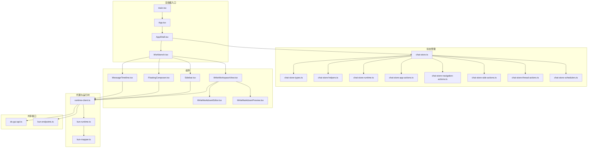
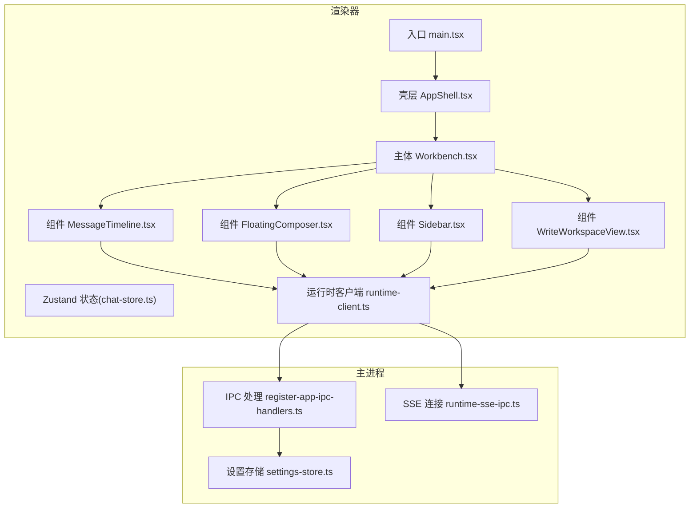
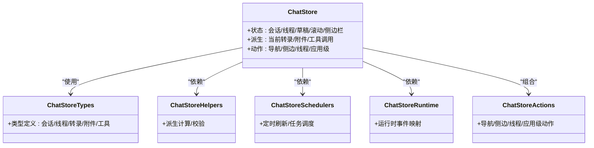
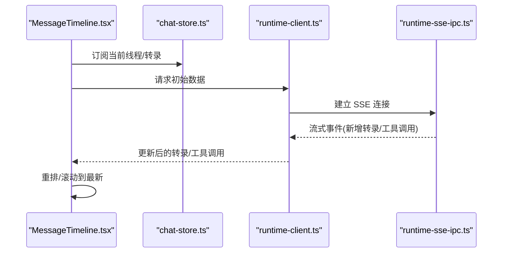
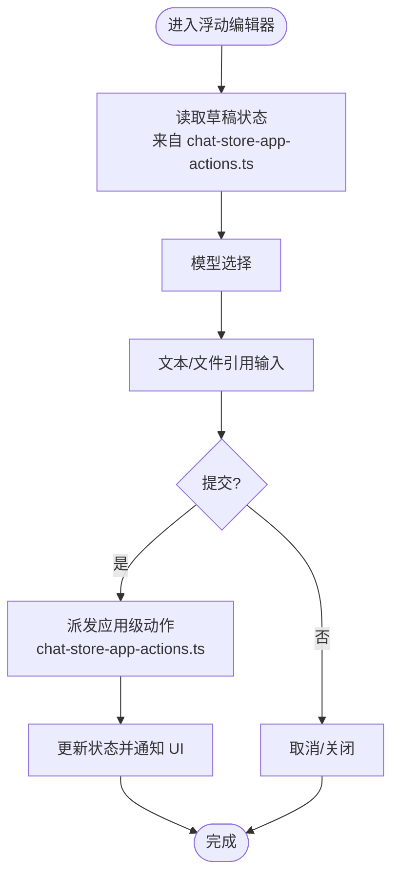
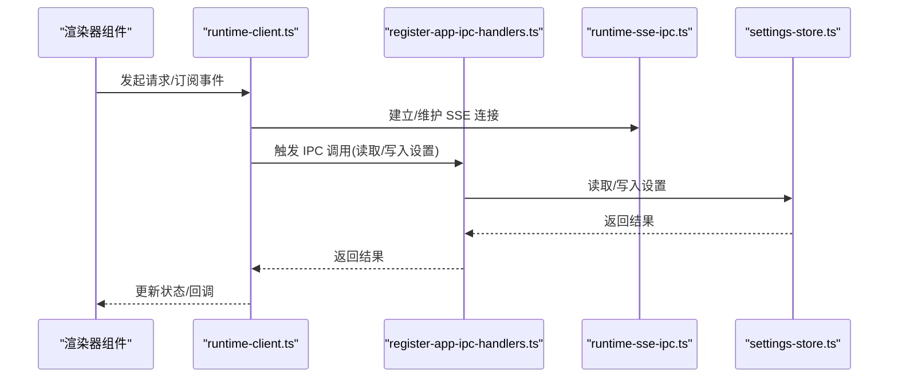
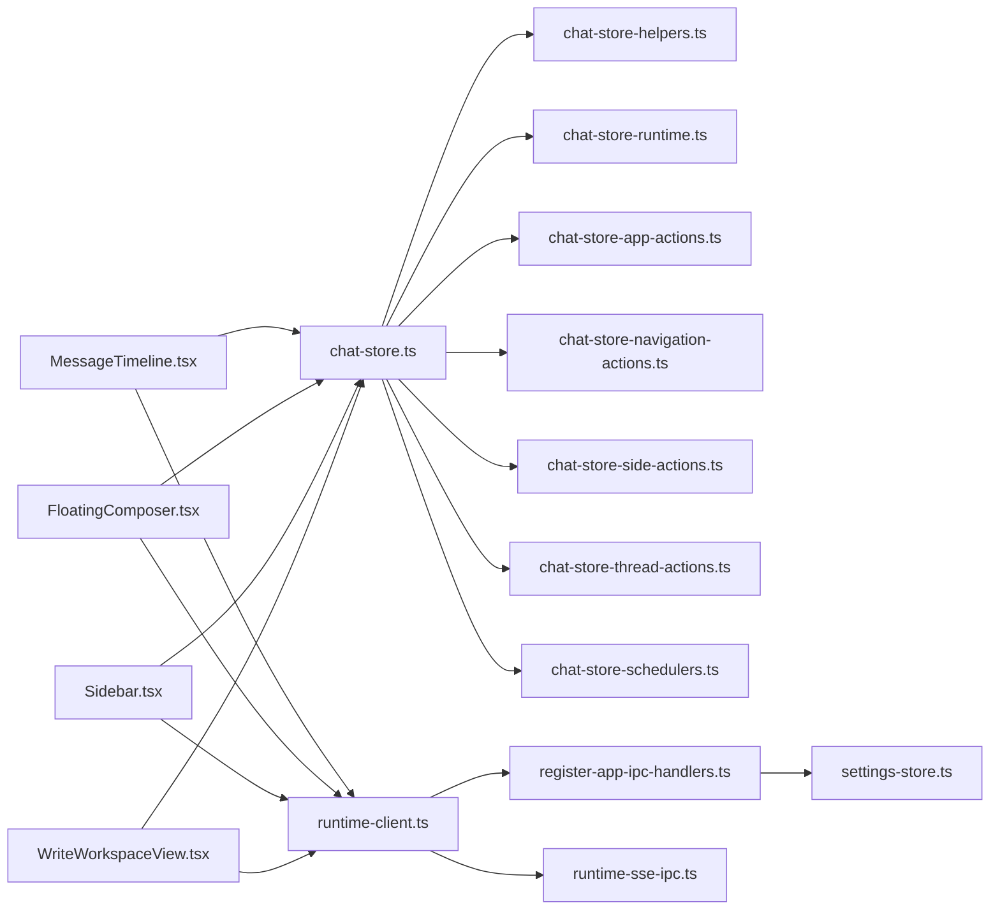

# 渲染器层（React 应用）

<cite>
**本文引用的文件**
- [App.tsx](file://src/renderer/src/App.tsx)
- [AppShell.tsx](file://src/renderer/src/AppShell.tsx)
- [main.tsx](file://src/renderer/src/main.tsx)
- [index.css](file://src/renderer/src/index.css)
- [i18n.ts](file://src/renderer/src/i18n.ts)
- [chat-store.ts](file://src/renderer/src/store/chat-store.ts)
- [chat-store-types.ts](file://src/renderer/src/store/chat-store-types.ts)
- [chat-store-helpers.ts](file://src/renderer/src/store/chat-store-helpers.ts)
- [chat-store-runtime.ts](file://src/renderer/src/store/chat-store-runtime.ts)
- [chat-store-navigation-actions.ts](file://src/renderer/src/store/chat-store-navigation-actions.ts)
- [chat-store-side-actions.ts](file://src/renderer/src/store/chat-store-side-actions.ts)
- [chat-store-thread-actions.ts](file://src/renderer/src/store/chat-store-thread-actions.ts)
- [chat-store-app-actions.ts](file://src/renderer/src/store/chat-store-app-actions.ts)
- [chat-store-schedulers.ts](file://src/renderer/src/store/chat-store-schedulers.ts)
- [MessageTimeline.tsx](file://src/renderer/src/components/chat/MessageTimeline.tsx)
- [FloatingComposer.tsx](file://src/renderer/src/components/chat/FloatingComposer.tsx)
- [Sidebar.tsx](file://src/renderer/src/components/chat/Sidebar.tsx)
- [WriteWorkspaceView.tsx](file://src/renderer/src/components/write/WriteWorkspaceView.tsx)
- [WriteMarkdownEditor.tsx](file://src/renderer/src/components/write/WriteMarkdownEditor.tsx)
- [WriteMarkdownPreview.tsx](file://src/renderer/src/components/write/WriteMarkdownPreview.tsx)
- [Workbench.tsx](file://src/renderer/src/components/Workbench.tsx)
- [runtime-client.ts](file://src/renderer/src/agent/runtime-client.ts)
- [kun-runtime.ts](file://src/renderer/src/agent/kun-runtime.ts)
- [kun-mapper.ts](file://src/renderer/src/agent/kun-mapper.ts)
- [ds-gui-api.ts](file://src/shared/ds-gui-api.ts)
- [kun-endpoints.ts](file://src/shared/kun-endpoints.ts)
- [settings-store.ts](file://src/main/settings-store.ts)
- [register-app-ipc-handlers.ts](file://src/main/ipc/register-app-ipc-handlers.ts)
- [app-ipc-schemas.ts](file://src/main/ipc/app-ipc-schemas.ts)
- [runtime-sse-ipc.ts](file://src/main/runtime-sse-ipc.ts)
</cite>

## 目录
1. [引言](#引言)
2. [项目结构](#项目结构)
3. [核心组件](#核心组件)
4. [架构总览](#架构总览)
5. [详细组件分析](#详细组件分析)
6. [依赖关系分析](#依赖关系分析)
7. [性能考量](#性能考量)
8. [故障排查指南](#故障排查指南)
9. [结论](#结论)
10. [附录](#附录)

## 引言
本文件聚焦 DeepSeek GUI 渲染器层（Electron 渲染进程中的 React 应用），系统性梳理其架构设计、组件层次、状态管理与 UI 交互逻辑。重点覆盖以下方面：
- Zustand 状态管理在聊天、工作空间与设置场景下的组织方式与职责边界
- 组件间通信机制：props 传递、事件处理、状态订阅
- 核心 UI 组件：浮动编辑器、消息时间线、侧边栏、写作工作区等的设计与实现要点
- 渲染器层与主进程的通信路径：IPC、SSE、REST 接口
- 用户输入到系统响应的完整链路与错误处理策略

## 项目结构
渲染器层位于 src/renderer/src，采用按功能域分层的组织方式：
- 入口与壳层：main.tsx、App.tsx、AppShell.tsx、Workbench.tsx
- 组件库：components 下按领域划分（chat、write、plan、schedule、sdd、todo 等）
- 状态管理：store 目录下围绕聊天会话的状态模型与动作集合
- 代理与运行时：agent 目录封装与后端运行时的交互
- 国际化与样式：i18n.ts、index.css
- 共享接口：shared 目录提供 GUI 与后端的 API 定义与端点

图表来源
- [main.tsx:1-50](file://src/renderer/src/main.tsx#L1-L50)
- [App.tsx:1-120](file://src/renderer/src/App.tsx#L1-L120)
- [AppShell.tsx:1-120](file://src/renderer/src/AppShell.tsx#L1-L120)
- [Workbench.tsx:1-120](file://src/renderer/src/components/Workbench.tsx#L1-L120)
- [chat-store.ts:1-200](file://src/renderer/src/store/chat-store.ts#L1-L200)
- [MessageTimeline.tsx:1-120](file://src/renderer/src/components/chat/MessageTimeline.tsx#L1-L120)
- [FloatingComposer.tsx:1-120](file://src/renderer/src/components/chat/FloatingComposer.tsx#L1-L120)
- [Sidebar.tsx:1-120](file://src/renderer/src/components/chat/Sidebar.tsx#L1-L120)
- [WriteWorkspaceView.tsx:1-120](file://src/renderer/src/components/write/WriteWorkspaceView.tsx#L1-L120)
- [runtime-client.ts:1-120](file://src/renderer/src/agent/runtime-client.ts#L1-L120)
- [kun-runtime.ts:1-120](file://src/renderer/src/agent/kun-runtime.ts#L1-L120)
- [kun-mapper.ts:1-120](file://src/renderer/src/agent/kun-mapper.ts#L1-L120)
- [ds-gui-api.ts:1-120](file://src/shared/ds-gui-api.ts#L1-L120)
- [kun-endpoints.ts:1-120](file://src/shared/kun-endpoints.ts#L1-L120)

章节来源
- [main.tsx:1-50](file://src/renderer/src/main.tsx#L1-L50)
- [App.tsx:1-120](file://src/renderer/src/App.tsx#L1-L120)
- [AppShell.tsx:1-120](file://src/renderer/src/AppShell.tsx#L1-L120)
- [Workbench.tsx:1-120](file://src/renderer/src/components/Workbench.tsx#L1-L120)

## 核心组件
本节概述渲染器层的关键 UI 组件及其职责：
- Workbench：应用主布局容器，协调侧边栏、内容区与工具栏
- MessageTimeline：消息时间线渲染与滚动控制，支持工具调用、代码块、Markdown 渲染
- FloatingComposer：浮动输入框，支持多模态输入、模型选择、草稿与队列消息
- Sidebar：侧边栏导航，包含项目、会话、计划、日程、SDD、待办等模块入口
- WriteWorkspaceView：写作工作区视图，集成编辑器与预览、文件树、工具栏
- WriteMarkdownEditor/WriteMarkdownPreview：编辑与实时预览组件
- RuntimeClient：与后端运行时交互的客户端封装，负责 SSE、HTTP 调用与事件订阅

章节来源
- [Workbench.tsx:1-120](file://src/renderer/src/components/Workbench.tsx#L1-L120)
- [MessageTimeline.tsx:1-120](file://src/renderer/src/components/chat/MessageTimeline.tsx#L1-L120)
- [FloatingComposer.tsx:1-120](file://src/renderer/src/components/chat/FloatingComposer.tsx#L1-L120)
- [Sidebar.tsx:1-120](file://src/renderer/src/components/chat/Sidebar.tsx#L1-L120)
- [WriteWorkspaceView.tsx:1-120](file://src/renderer/src/components/write/WriteWorkspaceView.tsx#L1-L120)
- [WriteMarkdownEditor.tsx:1-120](file://src/renderer/src/components/write/WriteMarkdownEditor.tsx#L1-L120)
- [WriteMarkdownPreview.tsx:1-120](file://src/renderer/src/components/write/WriteMarkdownPreview.tsx#L1-L120)
- [runtime-client.ts:1-120](file://src/renderer/src/agent/runtime-client.ts#L1-L120)

## 架构总览
渲染器层采用“入口 -> 壳层 -> 主体组件 -> 状态管理 -> 运行时代理”的分层架构。Zustand 将聊天相关状态集中管理，通过动作函数驱动 UI 更新；组件通过订阅状态进行响应式渲染；运行时代理负责与主进程通信。

图表来源
- [main.tsx:1-50](file://src/renderer/src/main.tsx#L1-L50)
- [AppShell.tsx:1-120](file://src/renderer/src/AppShell.tsx#L1-L120)
- [Workbench.tsx:1-120](file://src/renderer/src/components/Workbench.tsx#L1-L120)
- [chat-store.ts:1-200](file://src/renderer/src/store/chat-store.ts#L1-L200)
- [MessageTimeline.tsx:1-120](file://src/renderer/src/components/chat/MessageTimeline.tsx#L1-L120)
- [FloatingComposer.tsx:1-120](file://src/renderer/src/components/chat/FloatingComposer.tsx#L1-L120)
- [Sidebar.tsx:1-120](file://src/renderer/src/components/chat/Sidebar.tsx#L1-L120)
- [WriteWorkspaceView.tsx:1-120](file://src/renderer/src/components/write/WriteWorkspaceView.tsx#L1-L120)
- [runtime-client.ts:1-120](file://src/renderer/src/agent/runtime-client.ts#L1-L120)
- [register-app-ipc-handlers.ts:1-120](file://src/main/ipc/register-app-ipc-handlers.ts#L1-L120)
- [runtime-sse-ipc.ts:1-120](file://src/main/runtime-sse-ipc.ts#L1-L120)
- [settings-store.ts:1-120](file://src/main/settings-store.ts#L1-L120)

## 详细组件分析

### Zustand 状态管理（聊天、工作空间、设置）
- 状态模型与类型：chat-store-types.ts 定义了会话、线程、转录、附件、工具调用等数据结构与枚举
- 核心状态：chat-store.ts 提供全局状态与派生计算，包含当前会话、线程、草稿、滚动位置、侧边栏可见性等
- 助手与调度：chat-store-helpers.ts 提供状态推导与校验；chat-store-schedulers.ts 管理定时任务与刷新策略
- 运行时集成：chat-store-runtime.ts 将运行时事件映射到状态；chat-store-app-actions.ts、chat-store-navigation-actions.ts、chat-store-side-actions.ts、chat-store-thread-actions.ts 分别封装应用级、导航、侧边与线程相关动作
- 设置状态：settings-store.ts 在主进程维护设置持久化，渲染器通过 IPC 读取与更新

图表来源
- [chat-store.ts:1-200](file://src/renderer/src/store/chat-store.ts#L1-L200)
- [chat-store-types.ts:1-120](file://src/renderer/src/store/chat-store-types.ts#L1-L120)
- [chat-store-helpers.ts:1-120](file://src/renderer/src/store/chat-store-helpers.ts#L1-L120)
- [chat-store-schedulers.ts:1-120](file://src/renderer/src/store/chat-store-schedulers.ts#L1-L120)
- [chat-store-runtime.ts:1-120](file://src/renderer/src/store/chat-store-runtime.ts#L1-L120)
- [chat-store-navigation-actions.ts:1-120](file://src/renderer/src/store/chat-store-navigation-actions.ts#L1-L120)
- [chat-store-side-actions.ts:1-120](file://src/renderer/src/store/chat-store-side-actions.ts#L1-L120)
- [chat-store-thread-actions.ts:1-120](file://src/renderer/src/store/chat-store-thread-actions.ts#L1-L120)
- [chat-store-app-actions.ts:1-120](file://src/renderer/src/store/chat-store-app-actions.ts#L1-L120)

章节来源
- [chat-store.ts:1-200](file://src/renderer/src/store/chat-store.ts#L1-L200)
- [chat-store-types.ts:1-120](file://src/renderer/src/store/chat-store-types.ts#L1-L120)
- [chat-store-helpers.ts:1-120](file://src/renderer/src/store/chat-store-helpers.ts#L1-L120)
- [chat-store-schedulers.ts:1-120](file://src/renderer/src/store/chat-store-schedulers.ts#L1-L120)
- [chat-store-runtime.ts:1-120](file://src/renderer/src/store/chat-store-runtime.ts#L1-L120)
- [chat-store-navigation-actions.ts:1-120](file://src/renderer/src/store/chat-store-navigation-actions.ts#L1-L120)
- [chat-store-side-actions.ts:1-120](file://src/renderer/src/store/chat-store-side-actions.ts#L1-L120)
- [chat-store-thread-actions.ts:1-120](file://src/renderer/src/store/chat-store-thread-actions.ts#L1-L120)
- [chat-store-app-actions.ts:1-120](file://src/renderer/src/store/chat-store-app-actions.ts#L1-L120)
- [settings-store.ts:1-120](file://src/main/settings-store.ts#L1-L120)

### 消息时间线（MessageTimeline）
- 职责：渲染消息气泡、工具调用卡片、代码块、Markdown 内容；维护滚动与定位；支持空态与加载态
- 数据流：从 Zustand 订阅当前线程与转录，结合运行时事件（SSE）增量更新
- 交互：点击工具调用展开详情、复制代码、执行操作；滚动到最新消息或指定转录

图表来源
- [MessageTimeline.tsx:1-120](file://src/renderer/src/components/chat/MessageTimeline.tsx#L1-L120)
- [chat-store.ts:1-200](file://src/renderer/src/store/chat-store.ts#L1-L200)
- [runtime-client.ts:1-120](file://src/renderer/src/agent/runtime-client.ts#L1-L120)
- [runtime-sse-ipc.ts:1-120](file://src/main/runtime-sse-ipc.ts#L1-L120)

章节来源
- [MessageTimeline.tsx:1-120](file://src/renderer/src/components/chat/MessageTimeline.tsx#L1-L120)

### 浮动编辑器（FloatingComposer）
- 职责：提供快速输入通道，支持模型选择、文件引用、草稿保存、队列消息处理
- 状态：通过 Zustand 的应用级动作与草稿状态协同；与消息时间线联动
- 交互：回车提交、Esc 取消、拖拽上传、快捷命令触发

图表来源
- [FloatingComposer.tsx:1-120](file://src/renderer/src/components/chat/FloatingComposer.tsx#L1-L120)
- [chat-store-app-actions.ts:1-120](file://src/renderer/src/store/chat-store-app-actions.ts#L1-L120)

章节来源
- [FloatingComposer.tsx:1-120](file://src/renderer/src/components/chat/FloatingComposer.tsx#L1-L120)
- [chat-store-app-actions.ts:1-120](file://src/renderer/src/store/chat-store-app-actions.ts#L1-L120)

### 侧边栏（Sidebar）
- 职责：导航至不同功能域（聊天、写作、计划、日程、SDD、待办），切换项目与会话
- 状态：通过导航动作与侧边动作更新当前选中项与可见性
- 集成：与运行时客户端协作，拉取项目与会话列表

章节来源
- [Sidebar.tsx:1-120](file://src/renderer/src/components/chat/Sidebar.tsx#L1-L120)
- [chat-store-navigation-actions.ts:1-120](file://src/renderer/src/store/chat-store-navigation-actions.ts#L1-L120)
- [chat-store-side-actions.ts:1-120](file://src/renderer/src/store/chat-store-side-actions.ts#L1-L120)

### 写作工作区（WriteWorkspaceView）
- 职责：统一编辑器与预览、文件树、工具栏与导出能力
- 数据流：编辑器变更通过动作同步到状态；预览基于 Markdown 渲染；文件树与路径解析由运行时提供
- 协同：与消息时间线共享运行时客户端，实现跨域数据联动

章节来源
- [WriteWorkspaceView.tsx:1-120](file://src/renderer/src/components/write/WriteWorkspaceView.tsx#L1-L120)
- [WriteMarkdownEditor.tsx:1-120](file://src/renderer/src/components/write/WriteMarkdownEditor.tsx#L1-L120)
- [WriteMarkdownPreview.tsx:1-120](file://src/renderer/src/components/write/WriteMarkdownPreview.tsx#L1-L120)

### 运行时客户端与主进程通信
- 运行时客户端：runtime-client.ts 封装 SSE 与 HTTP 调用，订阅事件并转发给 Zustand
- 主进程 IPC：register-app-ipc-handlers.ts 注册 IPC 处理器，settings-store.ts 提供设置持久化
- 共享接口：ds-gui-api.ts、kun-endpoints.ts 定义 GUI 与后端的 API 端点

图表来源
- [runtime-client.ts:1-120](file://src/renderer/src/agent/runtime-client.ts#L1-L120)
- [register-app-ipc-handlers.ts:1-120](file://src/main/ipc/register-app-ipc-handlers.ts#L1-L120)
- [runtime-sse-ipc.ts:1-120](file://src/main/runtime-sse-ipc.ts#L1-L120)
- [settings-store.ts:1-120](file://src/main/settings-store.ts#L1-L120)
- [ds-gui-api.ts:1-120](file://src/shared/ds-gui-api.ts#L1-L120)
- [kun-endpoints.ts:1-120](file://src/shared/kun-endpoints.ts#L1-L120)

章节来源
- [runtime-client.ts:1-120](file://src/renderer/src/agent/runtime-client.ts#L1-L120)
- [register-app-ipc-handlers.ts:1-120](file://src/main/ipc/register-app-ipc-handlers.ts#L1-L120)
- [runtime-sse-ipc.ts:1-120](file://src/main/runtime-sse-ipc.ts#L1-L120)
- [settings-store.ts:1-120](file://src/main/settings-store.ts#L1-L120)
- [ds-gui-api.ts:1-120](file://src/shared/ds-gui-api.ts#L1-L120)
- [kun-endpoints.ts:1-120](file://src/shared/kun-endpoints.ts#L1-L120)

## 依赖关系分析
- 组件耦合：Workbench 作为容器聚合多个功能域组件；各组件通过 Zustand 订阅状态，降低直接耦合
- 状态内聚：聊天状态集中在 chat-store.ts，动作按职责拆分，避免状态分散
- 运行时解耦：运行时客户端抽象了 IPC 与 SSE，组件仅感知事件与数据
- 外部依赖：共享接口定义了 GUI 与后端契约，确保前后端一致性

图表来源
- [MessageTimeline.tsx:1-120](file://src/renderer/src/components/chat/MessageTimeline.tsx#L1-L120)
- [FloatingComposer.tsx:1-120](file://src/renderer/src/components/chat/FloatingComposer.tsx#L1-L120)
- [Sidebar.tsx:1-120](file://src/renderer/src/components/chat/Sidebar.tsx#L1-L120)
- [WriteWorkspaceView.tsx:1-120](file://src/renderer/src/components/write/WriteWorkspaceView.tsx#L1-L120)
- [chat-store.ts:1-200](file://src/renderer/src/store/chat-store.ts#L1-L200)
- [runtime-client.ts:1-120](file://src/renderer/src/agent/runtime-client.ts#L1-L120)
- [register-app-ipc-handlers.ts:1-120](file://src/main/ipc/register-app-ipc-handlers.ts#L1-L120)
- [runtime-sse-ipc.ts:1-120](file://src/main/runtime-sse-ipc.ts#L1-L120)
- [settings-store.ts:1-120](file://src/main/settings-store.ts#L1-L120)

章节来源
- [chat-store.ts:1-200](file://src/renderer/src/store/chat-store.ts#L1-L200)
- [runtime-client.ts:1-120](file://src/renderer/src/agent/runtime-client.ts#L1-L120)

## 性能考量
- 状态粒度：将聊天状态细分为导航、侧边、线程、应用级动作，避免全量重渲染
- 派生计算：在 helpers 中集中派生，减少重复计算与渲染
- 滚动优化：消息时间线维护滚动位置，避免每次更新都重排 DOM
- SSE 流控：运行时客户端对事件进行去抖与合并，降低 UI 抖动
- 缓存与懒加载：共享接口与运行时客户端可结合本地缓存策略，减少网络往返

## 故障排查指南
- 无法连接运行时：检查 runtime-sse-ipc.ts 的连接建立与错误回调；确认 register-app-ipc-handlers.ts 的处理器是否注册成功
- 状态不更新：核对 chat-store-runtime.ts 的事件映射与 chat-store.ts 的订阅；检查动作是否正确派发
- 设置读取失败：确认 settings-store.ts 的键值与渲染器侧的 IPC 调用路径
- UI 卡顿：检查消息时间线的滚动与渲染逻辑；评估 SSE 事件频率与批处理策略

章节来源
- [runtime-sse-ipc.ts:1-120](file://src/main/runtime-sse-ipc.ts#L1-L120)
- [register-app-ipc-handlers.ts:1-120](file://src/main/ipc/register-app-ipc-handlers.ts#L1-L120)
- [settings-store.ts:1-120](file://src/main/settings-store.ts#L1-L120)
- [chat-store-runtime.ts:1-120](file://src/renderer/src/store/chat-store-runtime.ts#L1-L120)
- [chat-store.ts:1-200](file://src/renderer/src/store/chat-store.ts#L1-L200)

## 结论
渲染器层以 Zustand 为核心，围绕聊天状态构建了高内聚、低耦合的状态管理方案；通过运行时客户端与主进程 IPC/SSE 解耦通信；组件以订阅状态的方式实现响应式更新。整体架构清晰、扩展性强，适合在多功能域（聊天、写作、计划、日程等）持续演进。

## 附录
- 国际化：i18n.ts 提供语言包加载与切换
- 样式：index.css 提供基础样式与主题变量
- 入口：main.tsx 初始化 React 应用与全局样式

章节来源
- [i18n.ts:1-120](file://src/renderer/src/i18n.ts#L1-L120)
- [index.css:1-120](file://src/renderer/src/index.css#L1-L120)
- [main.tsx:1-50](file://src/renderer/src/main.tsx#L1-L50)