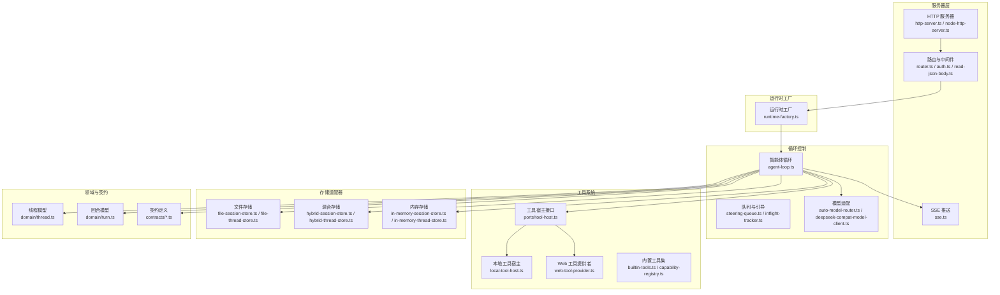
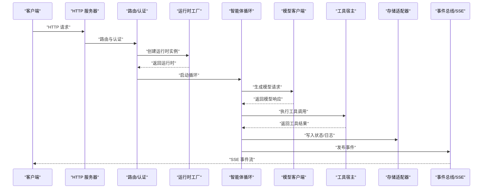
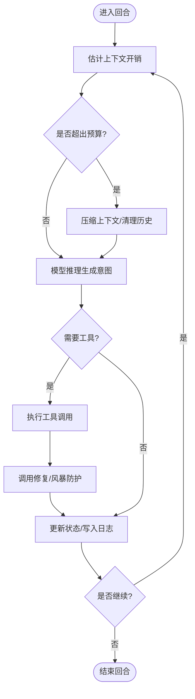
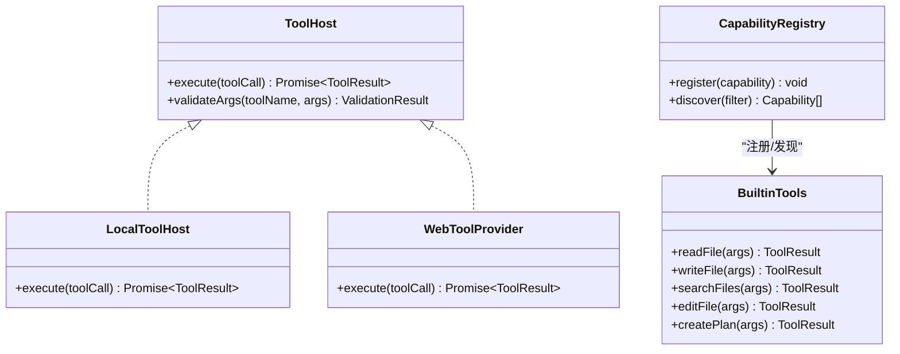
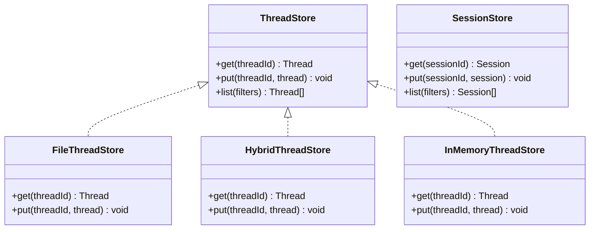
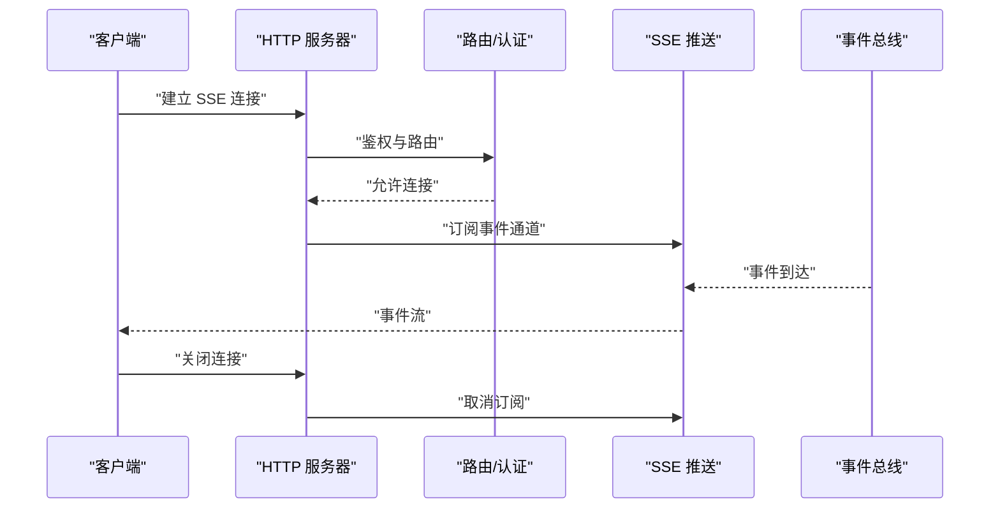
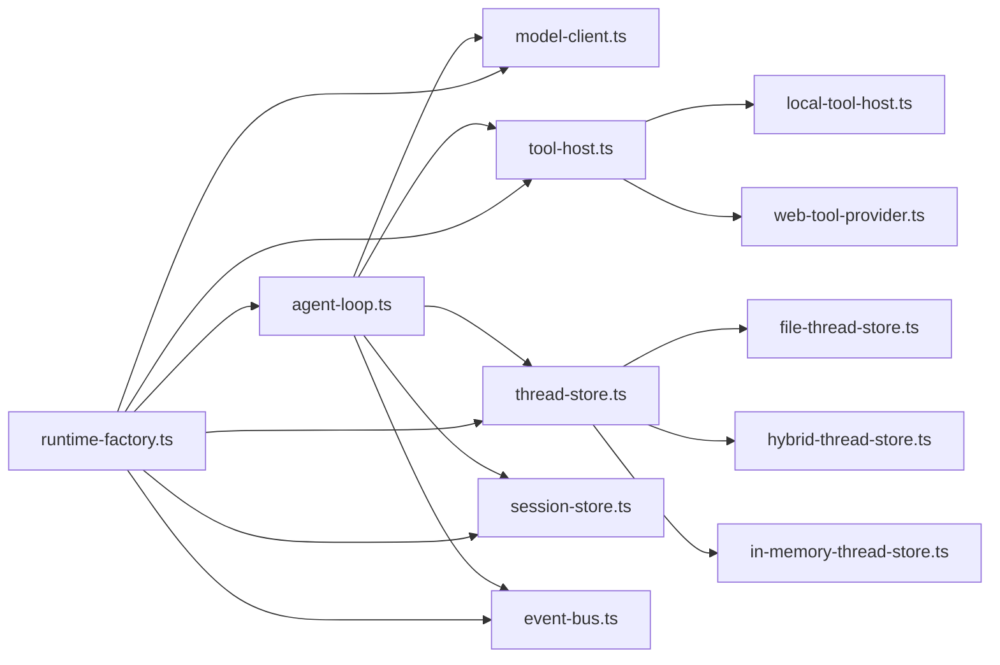

# 运行时层（Kun 包）

<cite>
**本文引用的文件**
- [kun/src/index.ts](file://kun/src/index.ts)
- [kun/src/server/index.ts](file://kun/src/server/index.ts)
- [kun/src/server/http-server.ts](file://kun/src/server/http-server.ts)
- [kun/src/server/node-http-server.ts](file://kun/src/server/node-http-server.ts)
- [kun/src/server/sse.ts](file://kun/src/server/sse.ts)
- [kun/src/server/runtime-factory.ts](file://kun/src/server/runtime-factory.ts)
- [kun/src/loop/agent-loop.ts](file://kun/src/loop/agent-loop.ts)
- [kun/src/loop/auto-model-router.ts](file://kun/src/loop/auto-model-router.ts)
- [kun/src/loop/tool-call-repair.ts](file://kun/src/loop/tool-call-repair.ts)
- [kun/src/loop/tool-storm-breaker.ts](file://kun/src/loop/tool-storm-breaker.ts)
- [kun/src/ports/tool-host.ts](file://kun/src/ports/tool-host.ts)
- [kun/src/adapters/tool/builtin-tools.ts](file://kun/src/adapters/tool/builtin-tools.ts)
- [kun/src/adapters/tool/capability-registry.ts](file://kun/src/adapters/tool/capability-registry.ts)
- [kun/src/adapters/tool/local-tool-host.ts](file://kun/src/adapters/tool/local-tool-host.ts)
- [kun/src/adapters/tool/web-tool-provider.ts](file://kun/src/adapters/tool/web-tool-provider.ts)
- [kun/src/adapters/file/index.ts](file://kun/src/adapters/file/index.ts)
- [kun/src/adapters/file/file-session-store.ts](file://kun/src/adapters/file/file-session-store.ts)
- [kun/src/adapters/file/file-thread-store.ts](file://kun/src/adapters/file/file-thread-store.ts)
- [kun/src/adapters/hybrid/index.ts](file://kun/src/adapters/hybrid/index.ts)
- [kun/src/adapters/hybrid/hybrid-session-store.ts](file://kun/src/adapters/hybrid/hybrid-session-store.ts)
- [kun/src/adapters/hybrid/hybrid-thread-store.ts](file://kun/src/adapters/hybrid/hybrid-thread-store.ts)
- [kun/src/adapters/in-memory-session-store.ts](file://kun/src/adapters/in-memory-session-store.ts)
- [kun/src/adapters/in-memory-thread-store.ts](file://kun/src/adapters/in-memory-thread-store.ts)
- [kun/src/adapters/model/deepseek-compat-model-client.ts](file://kun/src/adapters/model/deepseek-compat-model-client.ts)
- [kun/src/adapters/model/tool-argument-repair.ts](file://kun/src/adapters/model/tool-argument-repair.ts)
- [kun/src/contracts/threads.ts](file://kun/src/contracts/threads.ts)
- [kun/src/contracts/turns.ts](file://kun/src/contracts/turns.ts)
- [kun/src/contracts/runtime-info.ts](file://kun/src/contracts/runtime-info.ts)
- [kun/src/services/thread-service.ts](file://kun/src/services/thread-service.ts)
- [kun/src/services/turn-service.ts](file://kun/src/services/turn-service.ts)
- [kun/src/domain/thread.ts](file://kun/src/domain/thread.ts)
- [kun/src/domain/turn.ts](file://kun/src/domain/turn.ts)
- [kun/src/ports/thread-store.ts](file://kun/src/ports/thread-store.ts)
- [kun/src/ports/session-store.ts](file://kun/src/ports/session-store.ts)
- [kun/src/ports/event-bus.ts](file://kun/src/ports/event-bus.ts)
- [kun/src/ports/model-client.ts](file://kun/src/ports/model-client.ts)
- [kun/src/ports/tool-host.ts](file://kun/src/ports/tool-host.ts)
- [kun/src/ports/approval-gate.ts](file://kun/src/ports/approval-gate.ts)
- [kun/src/ports/user-input-gate.ts](file://kun/src/ports/user-input-gate.ts)
- [kun/src/ports/workspace-inspector.ts](file://kun/src/ports/workspace-inspector.ts)
- [kun/src/ports/id-generator.ts](file://kun/src/ports/id-generator.ts)
- [kun/src/ports/clock.ts](file://kun/src/ports/clock.ts)
- [kun/src/config/kun-config.ts](file://kun/src/config/kun-config.ts)
- [kun/src/cache/lru-cache.ts](file://kun/src/cache/lru-cache.ts)
- [kun/src/cache/ttl-lru-cache.ts](file://kun/src/cache/ttl-lru-cache.ts)
- [kun/src/cache/prefix-volatility.ts](file://kun/src/cache/prefix-volatility.ts)
- [kun/src/cache/immutable-prefix.ts](file://kun/src/cache/immutable-prefix.ts)
- [kun/src/memory/memory-store.ts](file://kun/src/memory/memory-store.ts)
- [kun/src/delegation/delegation-runtime.ts](file://kun/src/delegation/delegation-runtime.ts)
- [kun/src/delegation/child-agent-executor.ts](file://kun/src/delegation/child-agent-executor.ts)
- [kun/src/cli/serve.ts](file://kun/src/cli/serve.ts)
- [kun/src/cli/serve-entry.ts](file://kun/src/cli/serve-entry.ts)
- [kun/src/server/routes/threads.ts](file://kun/src/server/routes/threads.ts)
- [kun/src/server/routes/turns.ts](file://kun/src/server/routes/turns.ts)
- [kun/src/server/routes/sessions.ts](file://kun/src/server/routes/sessions.ts)
- [kun/src/server/routes/events.ts](file://kun/src/server/routes/events.ts)
- [kun/src/server/routes/server-runtime.ts](file://kun/src/server/routes/server-runtime.ts)
- [kun/src/server/routes/runtime-info.ts](file://kun/src/server/routes/runtime-info.ts)
- [kun/src/server/routes/runtime-error.ts](file://kun/src/server/routes/runtime-error.ts)
- [kun/src/server/routes/health.ts](file://kun/src/server/routes/health.ts)
- [kun/src/server/routes/usage.ts](file://kun/src/server/routes/usage.ts)
- [kun/src/server/routes/attachments.ts](file://kun/src/server/routes/attachments.ts)
- [kun/src/server/routes/user-inputs.ts](file://kun/src/server/routes/user-inputs.ts)
- [kun/src/server/routes/memory.ts](file://kun/src/server/routes/memory.ts)
- [kun/src/server/routes/workspace.ts](file://kun/src/server/routes/workspace.ts)
- [kun/src/server/routes/review.ts](file://kun/src/server/routes/review.ts)
- [kun/src/server/routes/skills.ts](file://kun/src/server/routes/skills.ts)
- [kun/src/server/routes/approvals.ts](file://kun/src/server/routes/approvals.ts)
- [kun/src/server/router.ts](file://kun/src/server/router.ts)
- [kun/src/server/read-json-body.ts](file://kun/src/server/read-json-body.ts)
- [kun/src/server/response.ts](file://kun/src/server/response.ts)
- [kun/src/server/auth.ts](file://kun/src/server/auth.ts)
- [kun/src/shared/gui-plan.ts](file://kun/src/shared/gui-plan.ts)
- [kun/src/shared/todos.ts](file://kun/src/shared/todos.ts)
- [kun/src/skills/skill-runtime.ts](file://kun/src/skills/skill-runtime.ts)
- [kun/src/skills/index.ts](file://kun/src/skills/index.ts)
- [kun/src/telemetry/usage-counter.ts](file://kun/src/telemetry/usage-counter.ts)
- [kun/src/telemetry/cache-telemetry.ts](file://kun/src/telemetry/cache-telemetry.ts)
- [kun/src/telemetry/index.ts](file://kun/src/telemetry/index.ts)
- [kun/src/attachments/attachment-store.ts](file://kun/src/attachments/attachment-store.ts)
- [kun/src/attachments/index.ts](file://kun/src/attachments/index.ts)
- [kun/src/domain/session.ts](file://kun/src/domain/session.ts)
- [kun/src/domain/event.ts](file://kun/src/domain/event.ts)
- [kun/src/domain/approval.ts](file://kun/src/domain/approval.ts)
- [kun/src/domain/item.ts](file://kun/src/domain/item.ts)
- [kun/src/domain/usage.ts](file://kun/src/domain/usage.ts)
- [kun/src/domain/runtime-event-reducer.ts](file://kun/src/domain/runtime-event-reducer.ts)
- [kun/src/domain/model-history-repair.ts](file://kun/src/domain/model-history-repair.ts)
- [kun/src/loop/context-estimator.ts](file://kun/src/loop/context-estimator.ts)
- [kun/src/loop/token-economy.ts](file://kun/src/loop/token-economy.ts)
- [kun/src/loop/history-healing.ts](file://kun/src/loop/history-healing.ts)
- [kun/src/loop/request-history-hygiene.ts](file://kun/src/loop/request-history-hygiene.ts)
- [kun/src/loop/steering-queue.ts](file://kun/src/loop/steering-queue.ts)
- [kun/src/loop/inflight-tracker.ts](file://kun/src/loop/inflight-tracker.ts)
- [kun/src/loop/model-context-profile.ts](file://kun/src/loop/model-context-profile.ts)
- [kun/src/loop/model-request-estimator.ts](file://kun/src/loop/model-request-estimator.ts)
- [kun/src/loop/compaction-marker.ts](file://kun/src/loop/compaction-marker.ts)
- [kun/src/loop/context-compactor.ts](file://kun/src/loop/context-compactor.ts)
- [kun/src/loop/append-only-session-log.ts](file://kun/src/loop/append-only-session-log.ts)
- [kun/src/loop/index.ts](file://kun/src/loop/index.ts)
- [kun/src/adapters/index.ts](file://kun/src/adapters/index.ts)
- [kun/src/ports/index.ts](file://kun/src/ports/index.ts)
- [kun/src/services/index.ts](file://kun/src/services/index.ts)
- [kun/src/contracts/index.ts](file://kun/src/contracts/index.ts)
- [kun/src/config/kun-config.test.ts](file://kun/src/config/kun-config.test.ts)
- [kun/src/tests/builtin-tools.test.ts](file://kun/src/tests/builtin-tools.test.ts)
- [kun/src/tests/http-server.test.ts](file://kun/src/tests/http-server.test.ts)
- [kun/src/tests/loop.test.ts](file://kun/src/tests/loop.test.ts)
- [kun/src/tests/route.test.ts](file://kun/src/tests/route.test.ts)
</cite>

## 目录
1. [引言](#引言)
2. [项目结构](#项目结构)
3. [核心组件](#核心组件)
4. [架构总览](#架构总览)
5. [详细组件分析](#详细组件分析)
6. [依赖关系分析](#依赖关系分析)
7. [性能考量](#性能考量)
8. [故障排查指南](#故障排查指南)
9. [结论](#结论)
10. [附录](#附录)

## 引言
本文件面向 DeepSeek GUI 的运行时层（Kun 包），聚焦于运行时层如何通过 HTTP API 提供服务、如何通过 Server-Sent Events（SSE）进行事件推送、以及如何驱动智能体在会话与线程维度上进行“推理—行动”循环。同时，文档深入解析工具执行器的扩展机制（内置工具、注册流程、参数校验与错误处理）、存储适配器的设计模式（文件存储、混合存储、内存存储）及其适用场景，并给出运行时层内部协作机制与对外接口的使用方法。

## 项目结构
Kun 包采用按领域分层的组织方式：服务层（services）、领域模型（domain）、端口与适配器（ports/adapters）、循环控制（loop）、服务器（server）、配置（config）、缓存（cache）、技能（skills）、遥测（telemetry）等模块协同工作，形成从请求接入到工具执行、状态持久化与事件广播的完整闭环。

图表来源
- [kun/src/server/http-server.ts](file://kun/src/server/http-server.ts)
- [kun/src/server/node-http-server.ts](file://kun/src/server/node-http-server.ts)
- [kun/src/server/sse.ts](file://kun/src/server/sse.ts)
- [kun/src/server/runtime-factory.ts](file://kun/src/server/runtime-factory.ts)
- [kun/src/loop/agent-loop.ts](file://kun/src/loop/agent-loop.ts)
- [kun/src/loop/auto-model-router.ts](file://kun/src/loop/auto-model-router.ts)
- [kun/src/ports/tool-host.ts](file://kun/src/ports/tool-host.ts)
- [kun/src/adapters/tool/local-tool-host.ts](file://kun/src/adapters/tool/local-tool-host.ts)
- [kun/src/adapters/tool/web-tool-provider.ts](file://kun/src/adapters/tool/web-tool-provider.ts)
- [kun/src/adapters/file/file-session-store.ts](file://kun/src/adapters/file/file-session-store.ts)
- [kun/src/adapters/file/file-thread-store.ts](file://kun/src/adapters/file/file-thread-store.ts)
- [kun/src/adapters/hybrid/hybrid-session-store.ts](file://kun/src/adapters/hybrid/hybrid-session-store.ts)
- [kun/src/adapters/hybrid/hybrid-thread-store.ts](file://kun/src/adapters/hybrid/hybrid-thread-store.ts)
- [kun/src/adapters/in-memory-session-store.ts](file://kun/src/adapters/in-memory-session-store.ts)
- [kun/src/adapters/in-memory-thread-store.ts](file://kun/src/adapters/in-memory-thread-store.ts)
- [kun/src/domain/thread.ts](file://kun/src/domain/thread.ts)
- [kun/src/domain/turn.ts](file://kun/src/domain/turn.ts)
- [kun/src/contracts/threads.ts](file://kun/src/contracts/threads.ts)
- [kun/src/contracts/turns.ts](file://kun/src/contracts/turns.ts)

章节来源
- [kun/src/index.ts](file://kun/src/index.ts)
- [kun/src/server/index.ts](file://kun/src/server/index.ts)
- [kun/src/server/http-server.ts](file://kun/src/server/http-server.ts)
- [kun/src/server/node-http-server.ts](file://kun/src/server/node-http-server.ts)
- [kun/src/server/sse.ts](file://kun/src/server/sse.ts)
- [kun/src/server/runtime-factory.ts](file://kun/src/server/runtime-factory.ts)
- [kun/src/loop/agent-loop.ts](file://kun/src/loop/agent-loop.ts)
- [kun/src/loop/auto-model-router.ts](file://kun/src/loop/auto-model-router.ts)
- [kun/src/ports/tool-host.ts](file://kun/src/ports/tool-host.ts)
- [kun/src/adapters/tool/local-tool-host.ts](file://kun/src/adapters/tool/local-tool-host.ts)
- [kun/src/adapters/tool/web-tool-provider.ts](file://kun/src/adapters/tool/web-tool-provider.ts)
- [kun/src/adapters/file/file-session-store.ts](file://kun/src/adapters/file/file-session-store.ts)
- [kun/src/adapters/file/file-thread-store.ts](file://kun/src/adapters/file/file-thread-store.ts)
- [kun/src/adapters/hybrid/hybrid-session-store.ts](file://kun/src/adapters/hybrid/hybrid-session-store.ts)
- [kun/src/adapters/hybrid/hybrid-thread-store.ts](file://kun/src/adapters/hybrid/hybrid-thread-store.ts)
- [kun/src/adapters/in-memory-session-store.ts](file://kun/src/adapters/in-memory-session-store.ts)
- [kun/src/adapters/in-memory-thread-store.ts](file://kun/src/adapters/in-memory-thread-store.ts)
- [kun/src/domain/thread.ts](file://kun/src/domain/thread.ts)
- [kun/src/domain/turn.ts](file://kun/src/domain/turn.ts)
- [kun/src/contracts/threads.ts](file://kun/src/contracts/threads.ts)
- [kun/src/contracts/turns.ts](file://kun/src/contracts/turns.ts)

## 核心组件
- 智能体循环系统：负责在单个线程内推进“推理—行动”迭代，协调模型调用、工具执行、状态更新与事件广播。
- 工具执行器：抽象出工具宿主接口，支持本地与 Web 工具提供者，内置工具集通过能力注册表统一管理。
- 存储适配器：提供文件、混合与内存三种存储后端，分别用于会话与线程的状态持久化与检索。
- 服务器接口：提供 HTTP API 路由与 SSE 事件推送，封装认证、请求体解析与响应格式化。
- 配置与缓存：集中式配置与多级缓存策略，支撑运行时性能与一致性。
- 遥测与附件：用量统计与附件存储，辅助运行时可观测性与数据管理。

章节来源
- [kun/src/loop/agent-loop.ts](file://kun/src/loop/agent-loop.ts)
- [kun/src/ports/tool-host.ts](file://kun/src/ports/tool-host.ts)
- [kun/src/adapters/file/index.ts](file://kun/src/adapters/file/index.ts)
- [kun/src/adapters/hybrid/index.ts](file://kun/src/adapters/hybrid/index.ts)
- [kun/src/server/http-server.ts](file://kun/src/server/http-server.ts)
- [kun/src/server/sse.ts](file://kun/src/server/sse.ts)
- [kun/src/config/kun-config.ts](file://kun/src/config/kun-config.ts)
- [kun/src/cache/lru-cache.ts](file://kun/src/cache/lru-cache.ts)

## 架构总览
运行时层以“服务器—工厂—循环—适配器—端口”的层次化结构组织，HTTP 请求进入后经路由与认证，交由运行时工厂创建运行时实例；运行时实例驱动智能体循环，循环中通过模型客户端进行推理，通过工具宿主执行工具，通过存储适配器持久化状态，并通过 SSE 广播事件给客户端。

图表来源
- [kun/src/server/http-server.ts](file://kun/src/server/http-server.ts)
- [kun/src/server/router.ts](file://kun/src/server/router.ts)
- [kun/src/server/auth.ts](file://kun/src/server/auth.ts)
- [kun/src/server/runtime-factory.ts](file://kun/src/server/runtime-factory.ts)
- [kun/src/loop/agent-loop.ts](file://kun/src/loop/agent-loop.ts)
- [kun/src/ports/model-client.ts](file://kun/src/ports/model-client.ts)
- [kun/src/ports/tool-host.ts](file://kun/src/ports/tool-host.ts)
- [kun/src/ports/thread-store.ts](file://kun/src/ports/thread-store.ts)
- [kun/src/ports/session-store.ts](file://kun/src/ports/session-store.ts)
- [kun/src/ports/event-bus.ts](file://kun/src/ports/event-bus.ts)
- [kun/src/server/sse.ts](file://kun/src/server/sse.ts)

## 详细组件分析

### 智能体循环系统
- 循环入口与控制流：循环在单个线程维度推进，依据回合历史、上下文估计与模型预算，决定是否继续推理或执行工具。
- 上下文压缩与历史修复：通过上下文估计器与压缩器减少开销，通过历史修复与清洗保持对话连贯性。
- 工具风暴防护与调用修复：在工具调用异常或风暴时进行保护与修复，避免资源耗尽。
- 自动模型路由：根据输入长度与预算动态选择合适模型，平衡成本与质量。

图表来源
- [kun/src/loop/agent-loop.ts](file://kun/src/loop/agent-loop.ts)
- [kun/src/loop/context-estimator.ts](file://kun/src/loop/context-estimator.ts)
- [kun/src/loop/context-compactor.ts](file://kun/src/loop/context-compactor.ts)
- [kun/src/loop/history-healing.ts](file://kun/src/loop/history-healing.ts)
- [kun/src/loop/request-history-hygiene.ts](file://kun/src/loop/request-history-hygiene.ts)
- [kun/src/loop/tool-call-repair.ts](file://kun/src/loop/tool-call-repair.ts)
- [kun/src/loop/tool-storm-breaker.ts](file://kun/src/loop/tool-storm-breaker.ts)
- [kun/src/loop/auto-model-router.ts](file://kun/src/loop/auto-model-router.ts)

章节来源
- [kun/src/loop/agent-loop.ts](file://kun/src/loop/agent-loop.ts)
- [kun/src/loop/context-estimator.ts](file://kun/src/loop/context-estimator.ts)
- [kun/src/loop/context-compactor.ts](file://kun/src/loop/context-compactor.ts)
- [kun/src/loop/history-healing.ts](file://kun/src/loop/history-healing.ts)
- [kun/src/loop/request-history-hygiene.ts](file://kun/src/loop/request-history-hygiene.ts)
- [kun/src/loop/tool-call-repair.ts](file://kun/src/loop/tool-call-repair.ts)
- [kun/src/loop/tool-storm-breaker.ts](file://kun/src/loop/tool-storm-breaker.ts)
- [kun/src/loop/auto-model-router.ts](file://kun/src/loop/auto-model-router.ts)

### 工具执行器与扩展机制
- 工具宿主接口：统一抽象工具执行能力，支持本地与 Web 两类工具提供者。
- 内置工具集：包含文件读写、搜索、编辑、计划等常用工具，通过能力注册表集中管理。
- 注册与发现：工具通过注册表注册，运行时在循环中按需发现并执行。
- 参数校验与错误处理：对工具参数进行校验，捕获并上报工具执行错误，结合调用修复与风暴防护提升鲁棒性。

图表来源
- [kun/src/ports/tool-host.ts](file://kun/src/ports/tool-host.ts)
- [kun/src/adapters/tool/local-tool-host.ts](file://kun/src/adapters/tool/local-tool-host.ts)
- [kun/src/adapters/tool/web-tool-provider.ts](file://kun/src/adapters/tool/web-tool-provider.ts)
- [kun/src/adapters/tool/capability-registry.ts](file://kun/src/adapters/tool/capability-registry.ts)
- [kun/src/adapters/tool/builtin-tools.ts](file://kun/src/adapters/tool/builtin-tools.ts)

章节来源
- [kun/src/ports/tool-host.ts](file://kun/src/ports/tool-host.ts)
- [kun/src/adapters/tool/local-tool-host.ts](file://kun/src/adapters/tool/local-tool-host.ts)
- [kun/src/adapters/tool/web-tool-provider.ts](file://kun/src/adapters/tool/web-tool-provider.ts)
- [kun/src/adapters/tool/capability-registry.ts](file://kun/src/adapters/tool/capability-registry.ts)
- [kun/src/adapters/tool/builtin-tools.ts](file://kun/src/adapters/tool/builtin-tools.ts)

### 存储适配器设计模式
- 文件存储：基于文件系统的原子写入与会话/线程存储，适合持久化与跨进程共享。
- 混合存储：结合内存与文件的混合策略，兼顾性能与持久性。
- 内存存储：纯内存实现，适合测试与临时状态管理。
- 统一接口：通过会话与线程存储接口屏蔽具体实现差异，便于切换与扩展。

图表来源
- [kun/src/ports/thread-store.ts](file://kun/src/ports/thread-store.ts)
- [kun/src/ports/session-store.ts](file://kun/src/ports/session-store.ts)
- [kun/src/adapters/file/file-thread-store.ts](file://kun/src/adapters/file/file-thread-store.ts)
- [kun/src/adapters/file/file-session-store.ts](file://kun/src/adapters/file/file-session-store.ts)
- [kun/src/adapters/hybrid/hybrid-thread-store.ts](file://kun/src/adapters/hybrid/hybrid-thread-store.ts)
- [kun/src/adapters/hybrid/hybrid-session-store.ts](file://kun/src/adapters/hybrid/hybrid-session-store.ts)
- [kun/src/adapters/in-memory-thread-store.ts](file://kun/src/adapters/in-memory-thread-store.ts)
- [kun/src/adapters/in-memory-session-store.ts](file://kun/src/adapters/in-memory-session-store.ts)

章节来源
- [kun/src/ports/thread-store.ts](file://kun/src/ports/thread-store.ts)
- [kun/src/ports/session-store.ts](file://kun/src/ports/session-store.ts)
- [kun/src/adapters/file/file-thread-store.ts](file://kun/src/adapters/file/file-thread-store.ts)
- [kun/src/adapters/file/file-session-store.ts](file://kun/src/adapters/file/file-session-store.ts)
- [kun/src/adapters/hybrid/hybrid-thread-store.ts](file://kun/src/adapters/hybrid/hybrid-thread-store.ts)
- [kun/src/adapters/hybrid/hybrid-session-store.ts](file://kun/src/adapters/hybrid/hybrid-session-store.ts)
- [kun/src/adapters/in-memory-thread-store.ts](file://kun/src/adapters/in-memory-thread-store.ts)
- [kun/src/adapters/in-memory-session-store.ts](file://kun/src/adapters/in-memory-session-store.ts)

### 服务器接口与 SSE 推送
- HTTP 服务器：提供 Node 原生 HTTP 实现与通用接口，统一处理请求生命周期。
- 路由与认证：集中式路由与认证中间件，确保安全访问。
- SSE 推送：将运行时事件转换为 Server-Sent Events，向客户端实时推送状态变更。
- API 路由：围绕线程、回合、会话、事件、运行时信息、健康检查、用量、附件、用户输入、内存、工作区、评审、技能、审批等主题提供 REST 接口。

图表来源
- [kun/src/server/http-server.ts](file://kun/src/server/http-server.ts)
- [kun/src/server/node-http-server.ts](file://kun/src/server/node-http-server.ts)
- [kun/src/server/router.ts](file://kun/src/server/router.ts)
- [kun/src/server/auth.ts](file://kun/src/server/auth.ts)
- [kun/src/server/sse.ts](file://kun/src/server/sse.ts)
- [kun/src/ports/event-bus.ts](file://kun/src/ports/event-bus.ts)

章节来源
- [kun/src/server/http-server.ts](file://kun/src/server/http-server.ts)
- [kun/src/server/node-http-server.ts](file://kun/src/server/node-http-server.ts)
- [kun/src/server/router.ts](file://kun/src/server/router.ts)
- [kun/src/server/auth.ts](file://kun/src/server/auth.ts)
- [kun/src/server/sse.ts](file://kun/src/server/sse.ts)
- [kun/src/ports/event-bus.ts](file://kun/src/ports/event-bus.ts)

### 运行时工厂与对外接口
- 运行时工厂：根据配置创建运行时实例，注入模型客户端、工具宿主、存储适配器与事件总线。
- 对外接口：通过 HTTP 路由暴露运行时能力，包括线程与回合管理、事件订阅、运行时信息查询、健康检查、用量统计、附件上传与评审、技能与审批等。

章节来源
- [kun/src/server/runtime-factory.ts](file://kun/src/server/runtime-factory.ts)
- [kun/src/server/routes/threads.ts](file://kun/src/server/routes/threads.ts)
- [kun/src/server/routes/turns.ts](file://kun/src/server/routes/turns.ts)
- [kun/src/server/routes/sessions.ts](file://kun/src/server/routes/sessions.ts)
- [kun/src/server/routes/events.ts](file://kun/src/server/routes/events.ts)
- [kun/src/server/routes/server-runtime.ts](file://kun/src/server/routes/server-runtime.ts)
- [kun/src/server/routes/runtime-info.ts](file://kun/src/server/routes/runtime-info.ts)
- [kun/src/server/routes/health.ts](file://kun/src/server/routes/health.ts)
- [kun/src/server/routes/usage.ts](file://kun/src/server/routes/usage.ts)
- [kun/src/server/routes/attachments.ts](file://kun/src/server/routes/attachments.ts)
- [kun/src/server/routes/user-inputs.ts](file://kun/src/server/routes/user-inputs.ts)
- [kun/src/server/routes/memory.ts](file://kun/src/server/routes/memory.ts)
- [kun/src/server/routes/workspace.ts](file://kun/src/server/routes/workspace.ts)
- [kun/src/server/routes/review.ts](file://kun/src/server/routes/review.ts)
- [kun/src/server/routes/skills.ts](file://kun/src/server/routes/skills.ts)
- [kun/src/server/routes/approvals.ts](file://kun/src/server/routes/approvals.ts)

## 依赖关系分析
- 松耦合设计：通过端口接口隔离具体实现，循环、工具、存储与服务器之间通过接口交互，降低耦合度。
- 可替换性：存储适配器与工具宿主可按需替换，不影响上层逻辑。
- 外部依赖：模型客户端兼容 DeepSeek 兼容接口，工具参数修复与错误探测增强稳定性。

图表来源
- [kun/src/loop/agent-loop.ts](file://kun/src/loop/agent-loop.ts)
- [kun/src/ports/model-client.ts](file://kun/src/ports/model-client.ts)
- [kun/src/ports/tool-host.ts](file://kun/src/ports/tool-host.ts)
- [kun/src/ports/thread-store.ts](file://kun/src/ports/thread-store.ts)
- [kun/src/ports/session-store.ts](file://kun/src/ports/session-store.ts)
- [kun/src/ports/event-bus.ts](file://kun/src/ports/event-bus.ts)
- [kun/src/adapters/tool/local-tool-host.ts](file://kun/src/adapters/tool/local-tool-host.ts)
- [kun/src/adapters/tool/web-tool-provider.ts](file://kun/src/adapters/tool/web-tool-provider.ts)
- [kun/src/adapters/file/file-thread-store.ts](file://kun/src/adapters/file/file-thread-store.ts)
- [kun/src/adapters/hybrid/hybrid-thread-store.ts](file://kun/src/adapters/hybrid/hybrid-thread-store.ts)
- [kun/src/adapters/in-memory-thread-store.ts](file://kun/src/adapters/in-memory-thread-store.ts)
- [kun/src/server/runtime-factory.ts](file://kun/src/server/runtime-factory.ts)

章节来源
- [kun/src/loop/agent-loop.ts](file://kun/src/loop/agent-loop.ts)
- [kun/src/ports/model-client.ts](file://kun/src/ports/model-client.ts)
- [kun/src/ports/tool-host.ts](file://kun/src/ports/tool-host.ts)
- [kun/src/ports/thread-store.ts](file://kun/src/ports/thread-store.ts)
- [kun/src/ports/session-store.ts](file://kun/src/ports/session-store.ts)
- [kun/src/ports/event-bus.ts](file://kun/src/ports/event-bus.ts)
- [kun/src/adapters/tool/local-tool-host.ts](file://kun/src/adapters/tool/local-tool-host.ts)
- [kun/src/adapters/tool/web-tool-provider.ts](file://kun/src/adapters/tool/web-tool-provider.ts)
- [kun/src/adapters/file/file-thread-store.ts](file://kun/src/adapters/file/file-thread-store.ts)
- [kun/src/adapters/hybrid/hybrid-thread-store.ts](file://kun/src/adapters/hybrid/hybrid-thread-store.ts)
- [kun/src/adapters/in-memory-thread-store.ts](file://kun/src/adapters/in-memory-thread-store.ts)
- [kun/src/server/runtime-factory.ts](file://kun/src/server/runtime-factory.ts)

## 性能考量
- 缓存策略：LRU 与 TTL-LRU 缓存结合前缀波动性与不可变前缀，优化热点数据命中率与一致性。
- 上下文压缩：通过上下文估计器与压缩器减少模型输入规模，降低延迟与成本。
- 队列与限流：工具风暴防护与调用修复保障高并发下的稳定性。
- 模型路由：自动模型路由在预算约束下选择最优模型，平衡性能与质量。

章节来源
- [kun/src/cache/lru-cache.ts](file://kun/src/cache/lru-cache.ts)
- [kun/src/cache/ttl-lru-cache.ts](file://kun/src/cache/ttl-lru-cache.ts)
- [kun/src/cache/prefix-volatility.ts](file://kun/src/cache/prefix-volatility.ts)
- [kun/src/cache/immutable-prefix.ts](file://kun/src/cache/immutable-prefix.ts)
- [kun/src/loop/context-estimator.ts](file://kun/src/loop/context-estimator.ts)
- [kun/src/loop/context-compactor.ts](file://kun/src/loop/context-compactor.ts)
- [kun/src/loop/tool-storm-breaker.ts](file://kun/src/loop/tool-storm-breaker.ts)
- [kun/src/loop/auto-model-router.ts](file://kun/src/loop/auto-model-router.ts)

## 故障排查指南
- SSE 连接失败：检查路由与认证配置、SSE 订阅通道与事件总线状态。
- 工具执行错误：查看工具参数校验结果与错误上报，结合调用修复与风暴防护策略定位问题。
- 存储读写异常：确认存储适配器实现与权限设置，核对文件路径与并发写入冲突。
- 模型调用失败：检查模型客户端兼容性与参数修复策略，关注上下文估计与预算限制。

章节来源
- [kun/src/server/sse.ts](file://kun/src/server/sse.ts)
- [kun/src/server/auth.ts](file://kun/src/server/auth.ts)
- [kun/src/loop/tool-call-repair.ts](file://kun/src/loop/tool-call-repair.ts)
- [kun/src/loop/tool-storm-breaker.ts](file://kun/src/loop/tool-storm-breaker.ts)
- [kun/src/adapters/file/atomic-write.ts](file://kun/src/adapters/file/atomic-write.ts)
- [kun/src/adapters/model/deepseek-compat-model-client.ts](file://kun/src/adapters/model/deepseek-compat-model-client.ts)
- [kun/src/adapters/model/tool-argument-repair.ts](file://kun/src/adapters/model/tool-argument-repair.ts)

## 结论
运行时层通过清晰的分层与接口设计，实现了从 HTTP 接入到 SSE 推送、从模型推理到工具执行、从状态持久化到事件广播的全链路能力。工具系统与存储适配器的可插拔设计，使得扩展与定制变得简单而稳健；循环控制中的上下文压缩、预算管理与风暴防护，确保了在复杂任务下的性能与稳定性。

## 附录
- CLI 启动：通过命令行入口启动 HTTP 服务，便于开发与集成测试。
- 配置与契约：集中式配置与契约定义保证运行时行为的一致性与可预测性。
- 遥测与附件：用量统计与附件存储为运行时提供了可观测性与数据管理能力。

章节来源
- [kun/src/cli/serve.ts](file://kun/src/cli/serve.ts)
- [kun/src/cli/serve-entry.ts](file://kun/src/cli/serve-entry.ts)
- [kun/src/config/kun-config.ts](file://kun/src/config/kun-config.ts)
- [kun/src/contracts/index.ts](file://kun/src/contracts/index.ts)
- [kun/src/telemetry/index.ts](file://kun/src/telemetry/index.ts)
- [kun/src/attachments/attachment-store.ts](file://kun/src/attachments/attachment-store.ts)