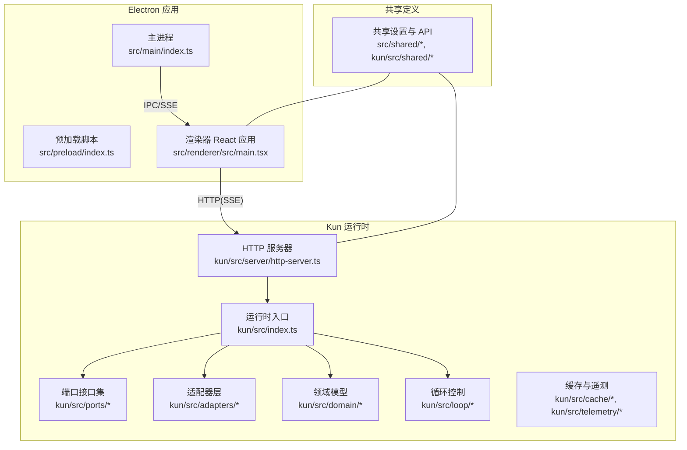
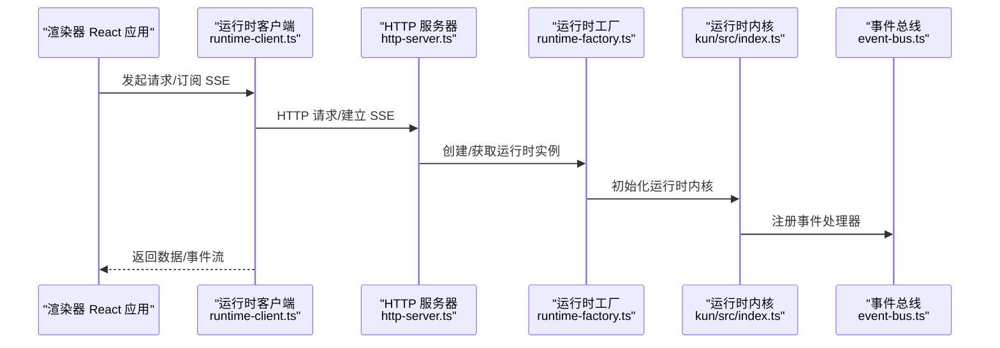
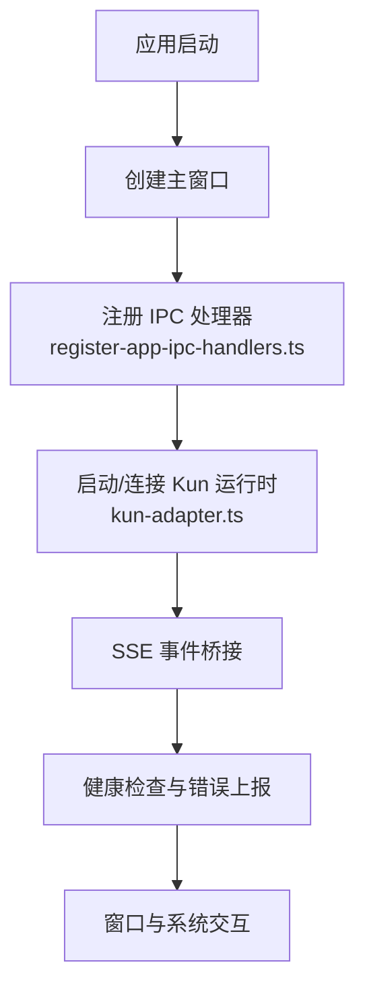
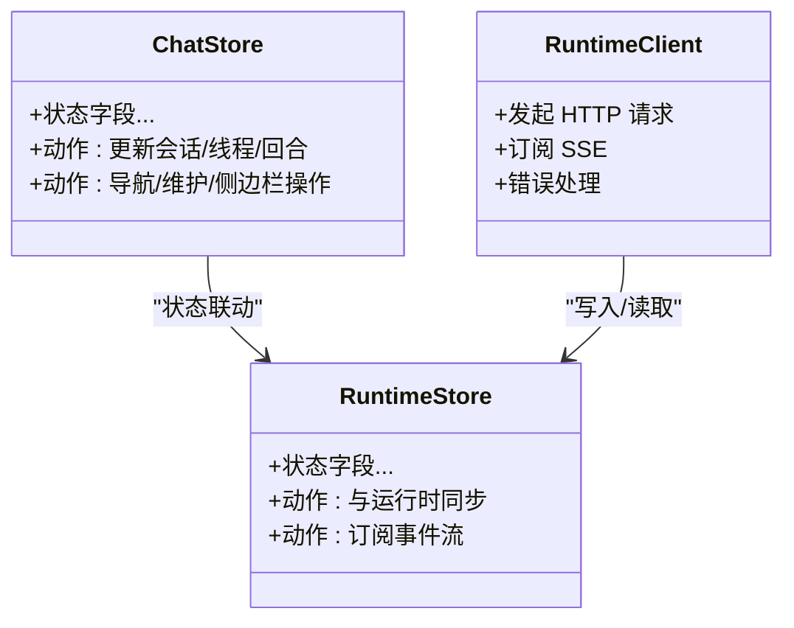
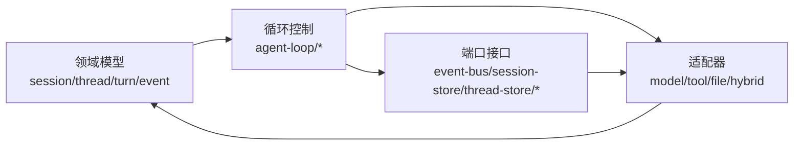
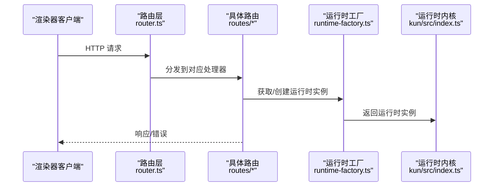
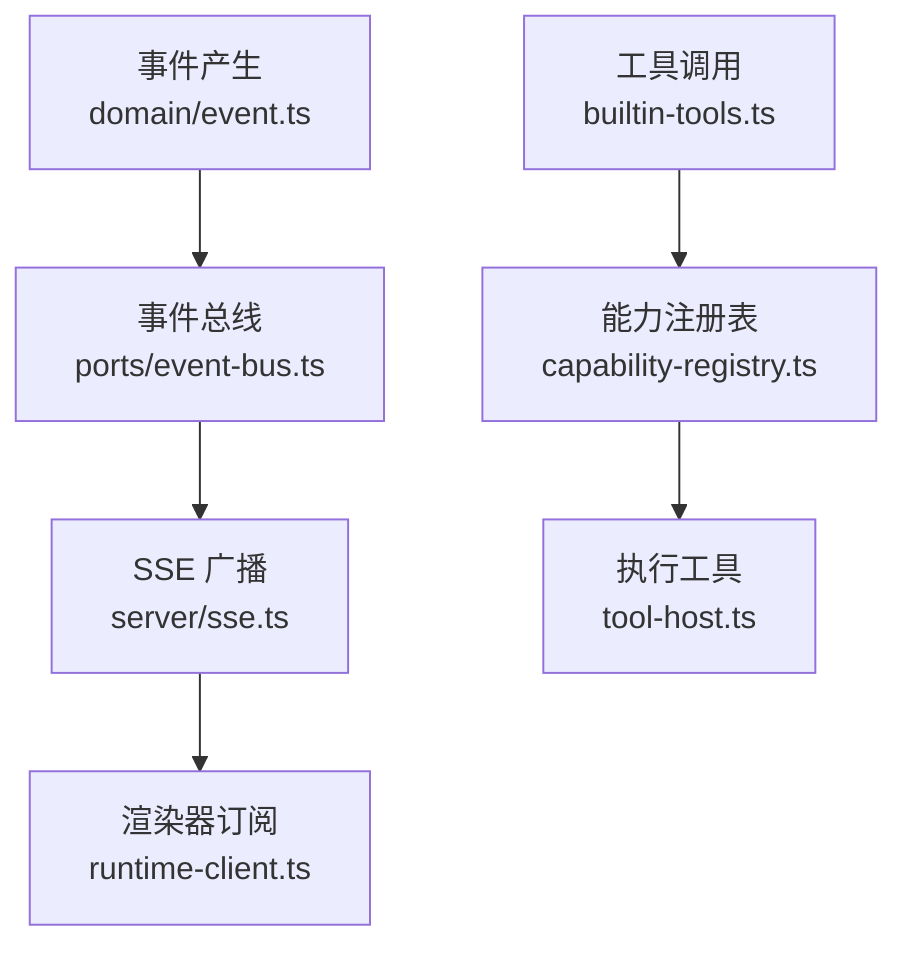
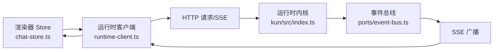
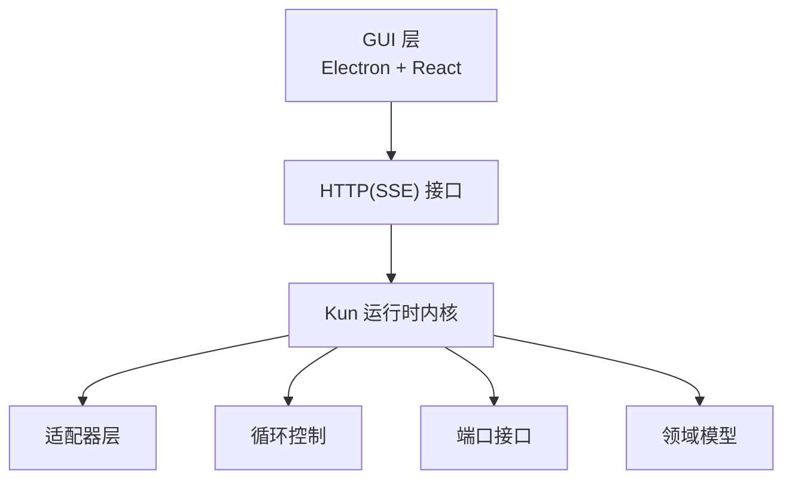

# 技术架构概览

<cite>
**本文档引用的文件**
- [package.json](file://package.json)
- [kun/package.json](file://kun/package.json)
- [src/main/index.ts](file://src/main/index.ts)
- [src/preload/index.ts](file://src/preload/index.ts)
- [src/renderer/src/main.tsx](file://src/renderer/src/main.tsx)
- [src/renderer/src/App.tsx](file://src/renderer/src/App.tsx)
- [src/renderer/src/store/chat-store.ts](file://src/renderer/src/store/chat-store.ts)
- [src/renderer/src/store/chat-store-runtime.ts](file://src/renderer/src/store/chat-store-runtime.ts)
- [src/renderer/src/agent/kun-runtime.ts](file://src/renderer/src/agent/kun-runtime.ts)
- [src/renderer/src/agent/runtime-client.ts](file://src/renderer/src/agent/runtime-client.ts)
- [src/main/runtime/kun-adapter.ts](file://src/main/runtime/kun-adapter.ts)
- [src/main/ipc/register-app-ipc-handlers.ts](file://src/main/ipc/register-app-ipc-handlers.ts)
- [src/main/services/workspace-service.ts](file://src/main/services/workspace-service.ts)
- [src/main/claw-runtime.ts](file://src/main/claw-runtime.ts)
- [kun/src/index.ts](file://kun/src/index.ts)
- [kun/src/server/index.ts](file://kun/src/server/index.ts)
- [kun/src/ports/index.ts](file://kun/src/ports/index.ts)
- [kun/src/adapters/index.ts](file://kun/src/adapters/index.ts)
- [kun/src/domain/index.ts](file://kun/src/domain/index.ts)
- [kun/src/loop/index.ts](file://kun/src/loop/index.ts)
- [kun/src/memory/index.ts](file://kun/src/memory/index.ts)
- [kun/src/cache/index.ts](file://kun/src/cache/index.ts)
- [kun/src/telemetry/index.ts](file://kun/src/telemetry/index.ts)
- [kun/src/config/kun-config.ts](file://kun/src/config/kun-config.ts)
- [kun/src/contracts/index.ts](file://kun/src/contracts/index.ts)
- [kun/src/server/routes/sessions.ts](file://kun/src/server/routes/sessions.ts)
- [kun/src/server/routes/threads.ts](file://kun/src/server/routes/threads.ts)
- [kun/src/server/routes/turns.ts](file://kun/src/server/routes/turns.ts)
- [kun/src/server/routes/events.ts](file://kun/src/server/routes/events.ts)
- [kun/src/server/routes/memory.ts](file://kun/src/server/routes/memory.ts)
- [kun/src/server/routes/workspace.ts](file://kun/src/server/routes/workspace.ts)
- [kun/src/server/routes/health.ts](file://kun/src/server/routes/health.ts)
- [kun/src/server/http-server.ts](file://kun/src/server/http-server.ts)
- [kun/src/ports/event-bus.ts](file://kun/src/ports/event-bus.ts)
- [kun/src/ports/session-store.ts](file://kun/src/ports/session-store.ts)
- [kun/src/ports/thread-store.ts](file://kun/src/ports/thread-store.ts)
- [kun/src/ports/tool-host.ts](file://kun/src/ports/tool-host.ts)
- [kun/src/ports/model-client.ts](file://kun/src/ports/model-client.ts)
- [kun/src/ports/workspace-inspector.ts](file://kun/src/ports/workspace-inspector.ts)
- [kun/src/ports/approval-gate.ts](file://kun/src/ports/approval-gate.ts)
- [kun/src/ports/user-input-gate.ts](file://kun/src/ports/user-input-gate.ts)
- [kun/src/ports/web-provider.ts](file://kun/src/ports/web-provider.ts)
- [kun/src/adapters/file/file-session-store.ts](file://kun/src/adapters/file/file-session-store.ts)
- [kun/src/adapters/file/file-thread-store.ts](file://kun/src/adapters/file/file-thread-store.ts)
- [kun/src/adapters/hybrid/hybrid-session-store.ts](file://kun/src/adapters/hybrid/hybrid-session-store.ts)
- [kun/src/adapters/hybrid/hybrid-thread-store.ts](file://kun/src/adapters/hybrid/hybrid-thread-store.ts)
- [kun/src/adapters/model/deepseek-compat-model-client.ts](file://kun/src/adapters/model/deepseek-compat-model-client.ts)
- [kun/src/adapters/tool/builtin-tools.ts](file://kun/src/adapters/tool/builtin-tools.ts)
- [kun/src/adapters/tool/capability-registry.ts](file://kun/src/adapters/tool/capability-registry.ts)
- [kun/src/domain/session.ts](file://kun/src/domain/session.ts)
- [kun/src/domain/thread.ts](file://kun/src/domain/thread.ts)
- [kun/src/domain/turn.ts](file://kun/src/domain/turn.ts)
- [kun/src/domain/event.ts](file://kun/src/domain/event.ts)
- [kun/src/loop/agent-loop.ts](file://kun/src/loop/agent-loop.ts)
- [kun/src/loop/context-compactor.ts](file://kun/src/loop/context-compactor.ts)
- [kun/src/loop/token-economy.ts](file://kun/src/loop/token-energy.ts)
- [kun/src/loop/auto-model-router.ts](file://kun/src/loop/auto-model-router.ts)
- [kun/src/loop/inflight-tracker.ts](file://kun/src/loop/inflight-tracker.ts)
- [kun/src/loop/steering-queue.ts](file://kun/src/loop/steering-queue.ts)
- [kun/src/loop/tool-call-repair.ts](file://kun/src/loop/tool-call-repair.ts)
- [kun/src/loop/tool-storm-breaker.ts](file://kun/src/loop/tool-storm-breaker.ts)
- [kun/src/loop/history-healing.ts](file://kun/src/loop/history-healing.ts)
- [kun/src/loop/request-history-hygiene.ts](file://kun/src/loop/request-history-hygiene.ts)
- [kun/src/loop/model-request-estimator.ts](file://kun/src/loop/model-request-estimator.ts)
- [kun/src/loop/context-estimator.ts](file://kun/src/loop/context-estimator.ts)
- [kun/src/loop/model-context-profile.ts](file://kun/src/loop/model-context-profile.ts)
- [kun/src/loop/compaction-marker.ts](file://kun/src/loop/compaction-marker.ts)
- [kun/src/loop/append-only-session-log.ts](file://kun/src/loop/append-only-session-log.ts)
- [kun/src/loop/token-economy.ts](file://kun/src/loop/token-economy.ts)
- [kun/src/services/thread-service.ts](file://kun/src/services/thread-service.ts)
- [kun/src/services/turn-service.ts](file://kun/src/services/turn-service.ts)
- [kun/src/services/usage-service.ts](file://kun/src/services/usage-service.ts)
- [kun/src/services/review-service.ts](file://kun/src/services/review-service.ts)
- [kun/src/services/runtime-event-recorder.ts](file://kun/src/services/runtime-event-recorder.ts)
- [kun/src/skills/skill-runtime.ts](file://kun/src/skills/skill-runtime.ts)
- [kun/src/delegation/delegation-runtime.ts](file://kun/src/delegation/delegation-runtime.ts)
- [kun/src/delegation/child-agent-executor.ts](file://kun/src/delegation/child-agent-executor.ts)
- [kun/src/memory/memory-store.ts](file://kun/src/memory/memory-store.ts)
- [kun/src/cache/lru-cache.ts](file://kun/src/cache/lru-cache.ts)
- [kun/src/cache/ttl-lru-cache.ts](file://kun/src/cache/ttl-lru-cache.ts)
- [kun/src/cache/prefix-volatility.ts](file://kun/src/cache/prefix-volatility.ts)
- [kun/src/cache/immutable-prefix.ts](file://kun/src/cache/immutable-prefix.ts)
- [kun/src/cache/tool-catalog-fingerprint.ts](file://kun/src/cache/tool-catalog-fingerprint.ts)
- [kun/src/telemetry/cache-telemetry.ts](file://kun/src/telemetry/cache-telemetry.ts)
- [kun/src/telemetry/usage-counter.ts](file://kun/src/telemetry/usage-counter.ts)
- [kun/src/cli/serve.ts](file://kun/src/cli/serve.ts)
- [kun/src/cli/agent-cli.ts](file://kun/src/cli/agent-cli.ts)
- [kun/src/server/runtime-factory.ts](file://kun/src/server/runtime-factory.ts)
- [kun/src/server/node-http-server.ts](file://kun/src/server/node-http-server.ts)
- [kun/src/server/router.ts](file://kun/src/server/router.ts)
- [kun/src/server/read-json-body.ts](file://kun/src/server/read-json-body.ts)
- [kun/src/server/response.ts](file://kun/src/server/response.ts)
- [kun/src/server/sse.ts](file://kun/src/server/sse.ts)
- [kun/src/server/auth.ts](file://kun/src/server/auth.ts)
- [kun/src/server/routes/server-runtime.ts](file://kun/src/server/routes/server-runtime.ts)
- [kun/src/server/routes/runtime-info.ts](file://kun/src/server/routes/runtime-info.ts)
- [kun/src/server/routes/runtime-error.ts](file://kun/src/server/routes/runtime-error.ts)
- [kun/src/server/routes/approvals.ts](file://kun/src/server/routes/approvals.ts)
- [kun/src/server/routes/attachments.ts](file://kun/src/server/routes/attachments.ts)
- [kun/src/server/routes/user-inputs.ts](file://kun/src/server/routes/user-inputs.ts)
- [kun/src/server/routes/skills.ts](file://kun/src/server/routes/skills.ts)
- [kun/src/server/routes/review.ts](file://kun/src/server/routes/review.ts)
- [kun/src/server/routes/usage.ts](file://kun/src/server/routes/usage.ts)
- [kun/src/server/routes/health.ts](file://kun/src/server/routes/health.ts)
- [kun/src/server/routes/server-runtime.ts](file://kun/src/server/routes/server-runtime.ts)
- [kun/src/server/routes/runtime-info.ts](file://kun/src/server/routes/runtime-info.ts)
- [kun/src/server/routes/runtime-error.ts](file://kun/src/server/routes/runtime-error.ts)
- [kun/src/server/routes/approvals.ts](file://kun/src/server/routes/approvals.ts)
- [kun/src/server/routes/attachments.ts](file://kun/src/server/routes/attachments.ts)
- [kun/src/server/routes/user-inputs.ts](file://kun/src/server/routes/user-inputs.ts)
- [kun/src/server/routes/skills.ts](file://kun/src/server/routes/skills.ts)
- [kun/src/server/routes/review.ts](file://kun/src/server/routes/review.ts)
- [kun/src/server/routes/usage.ts](file://kun/src/server/routes/usage.ts)
- [kun/src/server/routes/health.ts](file://kun/src/server/routes/health.ts)
- [kun/src/shared/gui-plan.ts](file://kun/src/shared/gui-plan.ts)
- [kun/src/shared/todos.ts](file://kun/src/shared/todos.ts)
- [src/shared/ds-gui-api.ts](file://src/shared/ds-gui-api.ts)
- [src/shared/kun-endpoints.ts](file://src/shared/kun-endpoints.ts)
- [src/shared/app-settings.ts](file://src/shared/app-settings.ts)
- [src/shared/write-inline-completion.ts](file://src/shared/write-inline-completion.ts)
- [src/shared/write-inline-edit.ts](file://src/shared/write-inline-edit.ts)
- [src/shared/write-markdown-resource.ts](file://src/shared/write-markdown-resource.ts)
- [src/shared/editor.ts](file://src/shared/editor.ts)
- [src/shared/git-branches.ts](file://src/shared/git-branches.ts)
- [src/shared/workspace-file.ts](file://src/shared/workspace-file.ts)
- [src/shared/write-export.ts](file://src/shared/write-export.ts)
- [src/shared/sdd.ts](file://src/shared/sdd.ts)
- [src/shared/gui-update.ts](file://src/shared/gui-update.ts)
- [src/shared/gui-update-schedule.ts](file://src/shared/gui-update-schedule.ts)
- [src/shared/app-settings-types.ts](file://src/shared/app-settings-types.ts)
- [src/shared/app-settings-claw.ts](file://src/shared/app-settings-claw.ts)
- [src/shared/app-settings-kun.ts](file://src/shared/app-settings-kun.ts)
- [src/shared/app-settings-normalize.ts](file://src/shared/app-settings-normalize.ts)
- [src/shared/app-settings-normalizers.ts](file://src/shared/app-settings-normalizers.ts)
- [src/shared/app-settings-prompts.ts](file://src/shared/app-settings-prompts.ts)
- [src/shared/app-settings-provider.ts](file://src/shared/app-settings-provider.ts)
- [src/shared/app-settings-schedule.ts](file://src/shared/app-settings-schedule.ts)
- [src/shared/app-settings-write.ts](file://src/shared/app-settings-write.ts)
- [src/shared/claw-commands.ts](file://src/shared/claw-commands.ts)
- [src/shared/default-composer-models.ts](file://src/shared/default-composer-models.ts)
- [src/shared/dev-preview-url.ts](file://src/shared/dev-preview-url.ts)
- [src/shared/runtime-error.ts](file://src/shared/runtime-error.ts)
- [src/shared/openai-compat-url.ts](file://src/shared/openai-compat-url.ts)
- [src/shared/editor.ts](file://src/shared/editor.ts)
- [src/shared/git-branches.ts](file://src/shared/git-branches.ts)
- [src/shared/workspace-file.ts](file://src/shared/workspace-file.ts)
- [src/shared/write-export.ts](file://src/shared/write-export.ts)
- [src/shared/sdd.ts](file://src/shared/sdd.ts)
- [src/shared/gui-update.ts](file://src/shared/gui-update.ts)
- [src/shared/gui-update-schedule.ts](file://src/shared/gui-update-schedule.ts)
- [src/shared/app-settings-types.ts](file://src/shared/app-settings-types.ts)
- [src/shared/app-settings-claw.ts](file://src/shared/app-settings-claw.ts)
- [src/shared/app-settings-kun.ts](file://src/shared/app-settings-kun.ts)
- [src/shared/app-settings-normalize.ts](file://src/shared/app-settings-normalize.ts)
- [src/shared/app-settings-normalizers.ts](file://src/shared/app-settings-normalizers.ts)
- [src/shared/app-settings-prompts.ts](file://src/shared/app-settings-prompts.ts)
- [src/shared/app-settings-provider.ts](file://src/shared/app-settings-provider.ts)
- [src/shared/app-settings-schedule.ts](file://src/shared/app-settings-schedule.ts)
- [src/shared/app-settings-write.ts](file://src/shared/app-settings-write.ts)
- [src/shared/claw-commands.ts](file://src/shared/claw-commands.ts)
- [src/shared/default-composer-models.ts](file://src/shared/default-composer-models.ts)
- [src/shared/dev-preview-url.ts](file://src/shared/dev-preview-url.ts)
- [src/shared/runtime-error.ts](file://src/shared/runtime-error.ts)
- [src/shared/openai-compat-url.ts](file://src/shared/openai-compat-url.ts)
</cite>

## 目录
1. [引言](#引言)
2. [项目结构](#项目结构)
3. [核心组件](#核心组件)
4. [架构总览](#架构总览)
5. [详细组件分析](#详细组件分析)
6. [依赖分析](#依赖分析)
7. [性能考虑](#性能考虑)
8. [故障排除指南](#故障排除指南)
9. [结论](#结论)
10. [附录](#附录)

## 引言
本文件为 DeepSeek GUI 的技术架构概览，面向开发者与架构师，系统性阐述三层架构：Electron 主进程、React 渲染器应用、Kun 运行时核心。文档重点说明：
- 各层职责与交互方式（IPC、HTTP、事件总线）
- 设计模式应用（事件驱动、工具模式、适配器模式）
- 数据流与状态管理（Zustand Store、渲染器状态与运行时状态同步）
- 关键技术选型（TypeScript、React 19、Zustand 5、TailwindCSS）及其优势
- 从 GUI 到 Kun 的端到端调用链路与错误处理策略

## 项目结构
项目采用多包分层组织：
- 根包：Electron 应用主进程、预加载脚本、渲染器 React 应用、共享配置与 API 定义
- Kun 包：运行时内核（领域模型、循环控制、适配器、服务、缓存、遥测、HTTP 服务器）

图表来源
- [src/main/index.ts:1-200](file://src/main/index.ts#L1-L200)
- [src/preload/index.ts:1-120](file://src/preload/index.ts#L1-L120)
- [src/renderer/src/main.tsx:1-120](file://src/renderer/src/main.tsx#L1-L120)
- [kun/src/index.ts:1-200](file://kun/src/index.ts#L1-L200)
- [kun/src/server/http-server.ts:1-200](file://kun/src/server/http-server.ts#L1-L200)

章节来源
- [package.json:1-200](file://package.json#L1-L200)
- [kun/package.json:1-200](file://kun/package.json#L1-L200)

## 核心组件
- Electron 主进程：负责应用生命周期、窗口管理、进程间通信（IPC）、与 Kun 运行时的集成（启动/停止、SSE 通道、健康检查）
- 预加载脚本：在受限上下文暴露受控 API 给渲染器，确保安全隔离
- React 渲染器：以 Zustand 状态管理为核心，承载聊天、写作、计划、日程等功能视图，并通过运行时客户端与 Kun 交互
- Kun 运行时：包含领域模型（会话/线程/回合/事件）、循环控制（自动路由、上下文压缩、工具风暴防护）、适配器（模型、工具、存储）、服务（线程/回合/用量/评审）、缓存与遥测、HTTP 服务器

章节来源
- [src/main/index.ts:1-200](file://src/main/index.ts#L1-L200)
- [src/preload/index.ts:1-120](file://src/preload/index.ts#L1-L120)
- [src/renderer/src/main.tsx:1-120](file://src/renderer/src/main.tsx#L1-L120)
- [kun/src/index.ts:1-200](file://kun/src/index.ts#L1-L200)

## 架构总览
DeepSeek GUI 采用“GUI 层 + Kun 运行时”的双层架构。GUI 通过 HTTP(SSE) 与 Kun 通信；主进程负责 IPC、系统集成与运行时生命周期管理。

图表来源
- [src/renderer/src/agent/runtime-client.ts:1-200](file://src/renderer/src/agent/runtime-client.ts#L1-L200)
- [kun/src/server/http-server.ts:1-200](file://kun/src/server/http-server.ts#L1-L200)
- [kun/src/server/runtime-factory.ts:1-200](file://kun/src/server/runtime-factory.ts#L1-L200)
- [kun/src/index.ts:1-200](file://kun/src/index.ts#L1-L200)
- [kun/src/ports/event-bus.ts:1-200](file://kun/src/ports/event-bus.ts#L1-L200)

## 详细组件分析

### 1) Electron 主进程与 IPC
- 职责：应用启动、窗口创建、菜单/托盘、系统级能力（剪贴板、对话框、文件系统）、与渲染器的 IPC 通信、与 Kun 运行时的集成（SSE、健康检查、二进制解析）
- 关键点：IPC Schema 定义、SSE IPC、运行时生命周期管理、更新与打包集成

图表来源
- [src/main/index.ts:1-200](file://src/main/index.ts#L1-L200)
- [src/main/ipc/register-app-ipc-handlers.ts:1-200](file://src/main/ipc/register-app-ipc-handlers.ts#L1-L200)
- [src/main/runtime/kun-adapter.ts:1-200](file://src/main/runtime/kun-adapter.ts#L1-L200)

章节来源
- [src/main/index.ts:1-200](file://src/main/index.ts#L1-L200)
- [src/main/ipc/register-app-ipc-handlers.ts:1-200](file://src/main/ipc/register-app-ipc-handlers.ts#L1-L200)
- [src/main/runtime/kun-adapter.ts:1-200](file://src/main/runtime/kun-adapter.ts#L1-L200)

### 2) 预加载脚本与安全上下文
- 职责：在受限上下文中暴露受控 API，实现主进程与渲染器的安全通信
- 关键点：类型安全的 API 暴露、CSP 配置、最小权限原则

章节来源
- [src/preload/index.ts:1-120](file://src/preload/index.ts#L1-L120)

### 3) React 渲染器与状态管理
- 职责：用户界面、交互逻辑、状态管理（Zustand）、与运行时客户端通信
- 关键点：Store 分层（chat-store、chat-store-runtime）、渲染器侧状态与运行时状态同步、主题与国际化

图表来源
- [src/renderer/src/store/chat-store.ts:1-200](file://src/renderer/src/store/chat-store.ts#L1-L200)
- [src/renderer/src/store/chat-store-runtime.ts:1-200](file://src/renderer/src/store/chat-store-runtime.ts#L1-L200)
- [src/renderer/src/agent/runtime-client.ts:1-200](file://src/renderer/src/agent/runtime-client.ts#L1-L200)

章节来源
- [src/renderer/src/main.tsx:1-120](file://src/renderer/src/main.tsx#L1-L120)
- [src/renderer/src/App.tsx:1-120](file://src/renderer/src/App.tsx#L1-L120)
- [src/renderer/src/store/chat-store.ts:1-200](file://src/renderer/src/store/chat-store.ts#L1-L200)
- [src/renderer/src/store/chat-store-runtime.ts:1-200](file://src/renderer/src/store/chat-store-runtime.ts#L1-L200)
- [src/renderer/src/agent/runtime-client.ts:1-200](file://src/renderer/src/agent/runtime-client.ts#L1-L200)

### 4) Kun 运行时核心（领域、循环、适配器）
- 领域模型：会话、线程、回合、事件，支撑对话与任务编排
- 循环控制：自动模型路由、上下文压缩、历史修复、请求卫生、工具风暴防护、飞行中跟踪、经济模型（Token 预算）
- 适配器：模型客户端（兼容 DeepSeek）、工具（内置工具、MCP、Web Provider）、文件/混合持久化存储
- 端口接口：事件总线、会话/线程存储、工具宿主、模型客户端、工作区检查器、审批/用户输入门

图表来源
- [kun/src/domain/index.ts:1-200](file://kun/src/domain/index.ts#L1-L200)
- [kun/src/loop/index.ts:1-200](file://kun/src/loop/index.ts#L1-L200)
- [kun/src/adapters/index.ts:1-200](file://kun/src/adapters/index.ts#L1-L200)
- [kun/src/ports/index.ts:1-200](file://kun/src/ports/index.ts#L1-L200)

章节来源
- [kun/src/domain/session.ts:1-200](file://kun/src/domain/session.ts#L1-L200)
- [kun/src/domain/thread.ts:1-200](file://kun/src/domain/thread.ts#L1-L200)
- [kun/src/domain/turn.ts:1-200](file://kun/src/domain/turn.ts#L1-L200)
- [kun/src/domain/event.ts:1-200](file://kun/src/domain/event.ts#L1-L200)
- [kun/src/loop/agent-loop.ts:1-200](file://kun/src/loop/agent-loop.ts#L1-L200)
- [kun/src/loop/auto-model-router.ts:1-200](file://kun/src/loop/auto-model-router.ts#L1-L200)
- [kun/src/loop/context-compactor.ts:1-200](file://kun/src/loop/context-compactor.ts#L1-L200)
- [kun/src/loop/tool-storm-breaker.ts:1-200](file://kun/src/loop/tool-storm-breaker.ts#L1-L200)
- [kun/src/loop/inflight-tracker.ts:1-200](file://kun/src/loop/inflight-tracker.ts#L1-L200)
- [kun/src/loop/token-economy.ts:1-200](file://kun/src/loop/token-economy.ts#L1-L200)
- [kun/src/ports/event-bus.ts:1-200](file://kun/src/ports/event-bus.ts#L1-L200)
- [kun/src/ports/session-store.ts:1-200](file://kun/src/ports/session-store.ts#L1-L200)
- [kun/src/ports/thread-store.ts:1-200](file://kun/src/ports/thread-store.ts#L1-L200)
- [kun/src/ports/tool-host.ts:1-200](file://kun/src/ports/tool-host.ts#L1-L200)
- [kun/src/ports/model-client.ts:1-200](file://kun/src/ports/model-client.ts#L1-L200)
- [kun/src/ports/workspace-inspector.ts:1-200](file://kun/src/ports/workspace-inspector.ts#L1-L200)
- [kun/src/adapters/model/deepseek-compat-model-client.ts:1-200](file://kun/src/adapters/model/deepseek-compat-model-client.ts#L1-L200)
- [kun/src/adapters/tool/builtin-tools.ts:1-200](file://kun/src/adapters/tool/builtin-tools.ts#L1-L200)
- [kun/src/adapters/file/file-session-store.ts:1-200](file://kun/src/adapters/file/file-session-store.ts#L1-L200)
- [kun/src/adapters/hybrid/hybrid-session-store.ts:1-200](file://kun/src/adapters/hybrid/hybrid-session-store.ts#L1-L200)

### 5) HTTP 服务器与路由
- 职责：提供 REST API 与 SSE，路由到运行时服务（会话、线程、回合、事件、内存、工作区、审批、附件、用量、评审、运行时信息/错误）
- 关键点：统一响应体、JSON 解析、认证中间件、运行时工厂注入

图表来源
- [kun/src/server/router.ts:1-200](file://kun/src/server/router.ts#L1-L200)
- [kun/src/server/read-json-body.ts:1-200](file://kun/src/server/read-json-body.ts#L1-L200)
- [kun/src/server/response.ts:1-200](file://kun/src/server/response.ts#L1-L200)
- [kun/src/server/auth.ts:1-200](file://kun/src/server/auth.ts#L1-L200)
- [kun/src/server/runtime-factory.ts:1-200](file://kun/src/server/runtime-factory.ts#L1-L200)
- [kun/src/server/routes/sessions.ts:1-200](file://kun/src/server/routes/sessions.ts#L1-L200)
- [kun/src/server/routes/threads.ts:1-200](file://kun/src/server/routes/threads.ts#L1-L200)
- [kun/src/server/routes/turns.ts:1-200](file://kun/src/server/routes/turns.ts#L1-L200)
- [kun/src/server/routes/events.ts:1-200](file://kun/src/server/routes/events.ts#L1-L200)
- [kun/src/server/routes/memory.ts:1-200](file://kun/src/server/routes/memory.ts#L1-L200)
- [kun/src/server/routes/workspace.ts:1-200](file://kun/src/server/routes/workspace.ts#L1-L200)
- [kun/src/server/routes/approvals.ts:1-200](file://kun/src/server/routes/approvals.ts#L1-L200)
- [kun/src/server/routes/attachments.ts:1-200](file://kun/src/server/routes/attachments.ts#L1-L200)
- [kun/src/server/routes/user-inputs.ts:1-200](file://kun/src/server/routes/user-inputs.ts#L1-L200)
- [kun/src/server/routes/skills.ts:1-200](file://kun/src/server/routes/skills.ts#L1-L200)
- [kun/src/server/routes/review.ts:1-200](file://kun/src/server/routes/review.ts#L1-L200)
- [kun/src/server/routes/usage.ts:1-200](file://kun/src/server/routes/usage.ts#L1-L200)
- [kun/src/server/routes/runtime-info.ts:1-200](file://kun/src/server/routes/runtime-info.ts#L1-L200)
- [kun/src/server/routes/runtime-error.ts:1-200](file://kun/src/server/routes/runtime-error.ts#L1-L200)
- [kun/src/server/routes/health.ts:1-200](file://kun/src/server/routes/health.ts#L1-L200)

章节来源
- [kun/src/server/http-server.ts:1-200](file://kun/src/server/http-server.ts#L1-L200)
- [kun/src/server/node-http-server.ts:1-200](file://kun/src/server/node-http-server.ts#L1-L200)
- [kun/src/server/sse.ts:1-200](file://kun/src/server/sse.ts#L1-L200)

### 6) 事件驱动架构与工具模式
- 事件驱动：运行时内核通过事件总线发布/订阅，渲染器通过 SSE 订阅事件，实现解耦与实时更新
- 工具模式：内置工具、MCP 工具、Web Provider 工具、能力注册表，统一抽象工具调用协议
- 适配器模式：模型适配器、存储适配器、工具适配器，屏蔽底层差异

图表来源
- [kun/src/domain/event.ts:1-200](file://kun/src/domain/event.ts#L1-L200)
- [kun/src/ports/event-bus.ts:1-200](file://kun/src/ports/event-bus.ts#L1-L200)
- [kun/src/server/sse.ts:1-200](file://kun/src/server/sse.ts#L1-L200)
- [src/renderer/src/agent/runtime-client.ts:1-200](file://src/renderer/src/agent/runtime-client.ts#L1-L200)
- [kun/src/adapters/tool/builtin-tools.ts:1-200](file://kun/src/adapters/tool/builtin-tools.ts#L1-L200)
- [kun/src/adapters/tool/capability-registry.ts:1-200](file://kun/src/adapters/tool/capability-registry.ts#L1-L200)
- [kun/src/ports/tool-host.ts:1-200](file://kun/src/ports/tool-host.ts#L1-L200)

章节来源
- [kun/src/domain/event.ts:1-200](file://kun/src/domain/event.ts#L1-L200)
- [kun/src/ports/event-bus.ts:1-200](file://kun/src/ports/event-bus.ts#L1-L200)
- [kun/src/server/sse.ts:1-200](file://kun/src/server/sse.ts#L1-L200)
- [src/renderer/src/agent/runtime-client.ts:1-200](file://src/renderer/src/agent/runtime-client.ts#L1-L200)
- [kun/src/adapters/tool/builtin-tools.ts:1-200](file://kun/src/adapters/tool/builtin-tools.ts#L1-L200)
- [kun/src/adapters/tool/capability-registry.ts:1-200](file://kun/src/adapters/tool/capability-registry.ts#L1-L200)
- [kun/src/ports/tool-host.ts:1-200](file://kun/src/ports/tool-host.ts#L1-L200)

### 7) 数据流与状态管理
- 渲染器状态：以 Zustand Store 为中心，拆分聊天、运行时、计划、日程等子状态域
- 数据流向：渲染器 Store -> 运行时客户端 -> HTTP(SSE) -> 运行时内核 -> 事件总线 -> SSE -> 渲染器 Store
- 状态同步：通过 SSE 实时事件流保持 UI 与运行时状态一致

图表来源
- [src/renderer/src/store/chat-store.ts:1-200](file://src/renderer/src/store/chat-store.ts#L1-L200)
- [src/renderer/src/agent/runtime-client.ts:1-200](file://src/renderer/src/agent/runtime-client.ts#L1-L200)
- [kun/src/index.ts:1-200](file://kun/src/index.ts#L1-L200)
- [kun/src/ports/event-bus.ts:1-200](file://kun/src/ports/event-bus.ts#L1-L200)
- [kun/src/server/sse.ts:1-200](file://kun/src/server/sse.ts#L1-L200)

章节来源
- [src/renderer/src/store/chat-store.ts:1-200](file://src/renderer/src/store/chat-store.ts#L1-L200)
- [src/renderer/src/store/chat-store-runtime.ts:1-200](file://src/renderer/src/store/chat-store-runtime.ts#L1-L200)
- [src/renderer/src/agent/runtime-client.ts:1-200](file://src/renderer/src/agent/runtime-client.ts#L1-L200)

### 8) 技术选型与优势
- TypeScript：强类型保障，降低跨层耦合带来的风险，提升 IDE 开发体验
- React 19：函数式组件与并发特性，提升渲染性能与开发效率
- Zustand 5：轻量状态管理，避免样板代码，便于 Store 分层与模块化
- TailwindCSS：原子类样式，快速构建一致的 UI，减少样式冲突
- Electron：跨平台桌面应用框架，结合 IPC 与系统集成
- Kun 运行时：模块化内核、事件驱动、适配器/工具模式，支持扩展与演进

章节来源
- [package.json:1-200](file://package.json#L1-L200)
- [kun/package.json:1-200](file://kun/package.json#L1-L200)

## 依赖分析
- 内聚性：Kun 包内部按领域/循环/适配器/端口划分清晰，内聚度高
- 耦合性：GUI 通过 HTTP(SSE) 与 Kun 解耦；主进程仅承担系统集成与 IPC，不直接依赖业务细节
- 外部依赖：Electron、React、Zustand、TailwindCSS、Express 生态、SSE

图表来源
- [src/main/index.ts:1-200](file://src/main/index.ts#L1-L200)
- [src/renderer/src/main.tsx:1-120](file://src/renderer/src/main.tsx#L1-L120)
- [kun/src/index.ts:1-200](file://kun/src/index.ts#L1-L200)

章节来源
- [src/main/index.ts:1-200](file://src/main/index.ts#L1-L200)
- [src/renderer/src/main.tsx:1-120](file://src/renderer/src/main.tsx#L1-L120)
- [kun/src/index.ts:1-200](file://kun/src/index.ts#L1-L200)

## 性能考虑
- 缓存策略：LRU/TTL LRU 缓存、前缀可变性与不可变前缀、工具目录指纹，降低重复计算与 IO
- 上下文压缩：自动模型路由与上下文压缩，控制 Token 使用
- 工具风暴防护：工具风暴 breaker 与飞行中跟踪，防止资源滥用
- SSE 流式传输：事件驱动推送，减少轮询开销
- 状态分层：Store 拆分与选择器优化，避免全局重渲染

章节来源
- [kun/src/cache/lru-cache.ts:1-200](file://kun/src/cache/lru-cache.ts#L1-L200)
- [kun/src/cache/ttl-lru-cache.ts:1-200](file://kun/src/cache/ttl-lru-cache.ts#L1-L200)
- [kun/src/cache/prefix-volatility.ts:1-200](file://kun/src/cache/prefix-volatility.ts#L1-L200)
- [kun/src/cache/immutable-prefix.ts:1-200](file://kun/src/cache/immutable-prefix.ts#L1-L200)
- [kun/src/cache/tool-catalog-fingerprint.ts:1-200](file://kun/src/cache/tool-catalog-fingerprint.ts#L1-L200)
- [kun/src/loop/context-compactor.ts:1-200](file://kun/src/loop/context-compactor.ts#L1-L200)
- [kun/src/loop/auto-model-router.ts:1-200](file://kun/src/loop/auto-model-router.ts#L1-L200)
- [kun/src/loop/tool-storm-breaker.ts:1-200](file://kun/src/loop/tool-storm-breaker.ts#L1-L200)
- [kun/src/loop/inflight-tracker.ts:1-200](file://kun/src/loop/inflight-tracker.ts#L1-L200)
- [kun/src/server/sse.ts:1-200](file://kun/src/server/sse.ts#L1-L200)

## 故障排除指南
- 健康检查：通过健康路由与主进程健康检查，定位运行时异常
- 错误路由：统一错误响应格式，便于前端展示与日志追踪
- 日志与诊断：共享运行时错误格式化工具，辅助定位问题
- 更新与回滚：GUI 更新调度与版本管理，配合运行时健康检查

章节来源
- [kun/src/server/routes/health.ts:1-200](file://kun/src/server/routes/health.ts#L1-L200)
- [kun/src/server/routes/runtime-error.ts:1-200](file://kun/src/server/routes/runtime-error.ts#L1-L200)
- [src/shared/runtime-error.ts:1-200](file://src/shared/runtime-error.ts#L1-L200)
- [src/shared/gui-update-schedule.ts:1-200](file://src/shared/gui-update-schedule.ts#L1-L200)

## 结论
DeepSeek GUI 通过清晰的三层架构实现了 GUI 与运行时的解耦：Electron 主进程负责系统集成与 IPC，React 渲染器以 Zustand 管理状态并通过 HTTP(SSE) 与 Kun 通信，Kun 运行时以事件驱动、工具与适配器模式支撑复杂业务场景。该架构具备良好的可扩展性、可观测性与可维护性，适合持续演进与团队协作。

## 附录
- 共享设置与 API：集中管理 GUI 与运行时的配置、端点、编辑器与导出能力
- 写作与插件生态：内联补全/编辑、Markdown 预览、插件市场等扩展点

章节来源
- [src/shared/app-settings.ts:1-200](file://src/shared/app-settings.ts#L1-L200)
- [src/shared/kun-endpoints.ts:1-200](file://src/shared/kun-endpoints.ts#L1-L200)
- [src/shared/write-inline-completion.ts:1-200](file://src/shared/write-inline-completion.ts#L1-L200)
- [src/shared/write-inline-edit.ts:1-200](file://src/shared/write-inline-edit.ts#L1-L200)
- [src/shared/write-markdown-resource.ts:1-200](file://src/shared/write-markdown-resource.ts#L1-L200)
- [src/shared/editor.ts:1-200](file://src/shared/editor.ts#L1-L200)
- [src/shared/git-branches.ts:1-200](file://src/shared/git-branches.ts#L1-L200)
- [src/shared/workspace-file.ts:1-200](file://src/shared/workspace-file.ts#L1-L200)
- [src/shared/write-export.ts:1-200](file://src/shared/write-export.ts#L1-L200)
- [src/shared/sdd.ts:1-200](file://src/shared/sdd.ts#L1-L200)
- [src/shared/gui-update.ts:1-200](file://src/shared/gui-update.ts#L1-L200)
- [src/shared/gui-update-schedule.ts:1-200](file://src/shared/gui-update-schedule.ts#L1-L200)
- [kun/src/shared/gui-plan.ts:1-200](file://kun/src/shared/gui-plan.ts#L1-L200)
- [kun/src/shared/todos.ts:1-200](file://kun/src/shared/todos.ts#L1-L200)