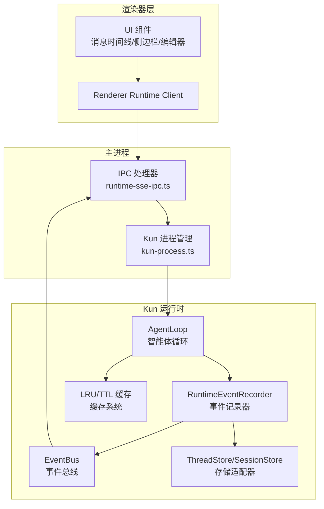
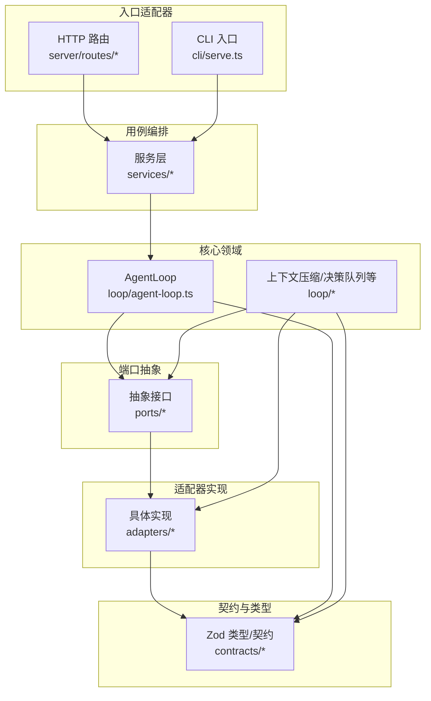
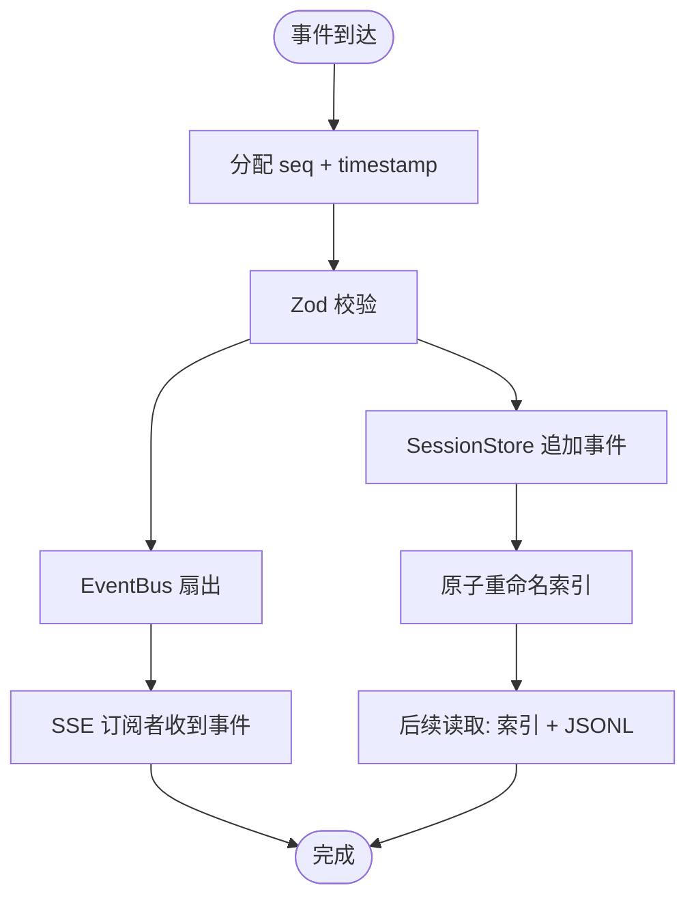
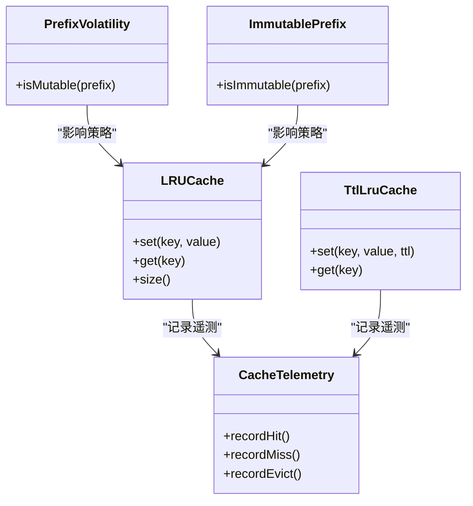
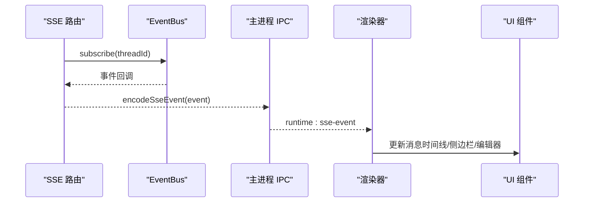
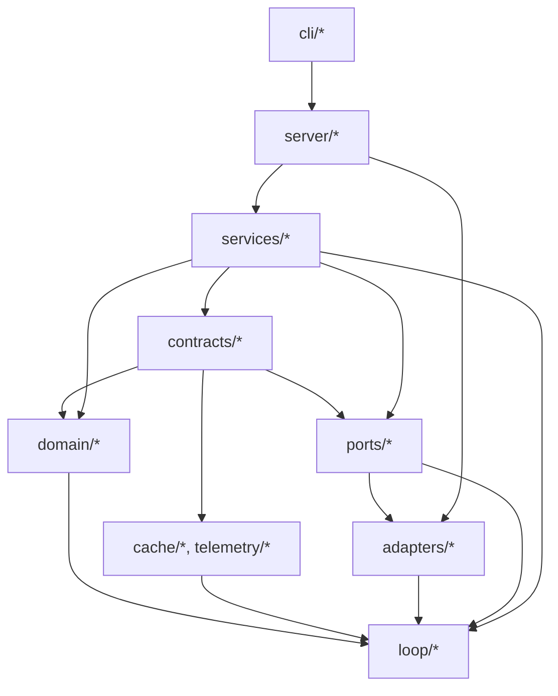

# 数据流架构

<cite>
**本文引用的文件**
- [kun/src/loop/agent-loop.ts](file://kun/src/loop/agent-loop.ts)
- [kun/src/services/runtime-event-recorder.ts](file://kun/src/services/runtime-event-recorder.ts)
- [kun/src/adapters/in-memory-event-bus.ts](file://kun/src/adapters/in-memory-event-bus.ts)
- [kun/src/ports/event-bus.ts](file://kun/src/ports/event-bus.ts)
- [kun/src/ports/thread-store.ts](file://kun/src/ports/thread-store.ts)
- [kun/src/ports/session-store.ts](file://kun/src/ports/session-store.ts)
- [kun/src/server/sse.ts](file://kun/src/server/sse.ts)
- [kun/src/server/routes/events.ts](file://kun/src/server/routes/events.ts)
- [src/main/runtime-sse-ipc.ts](file://src/main/runtime-sse-ipc.ts)
- [src/renderer/src/agent/runtime-client.ts](file://src/renderer/src/agent/runtime-client.ts)
- [src/main/kun-adapter.ts](file://src/main/kun-adapter.ts)
- [src/main/kun-process.ts](file://src/main/kun-process.ts)
- [kun/src/adapters/file/file-thread-store.ts](file://kun/src/adapters/file/file-thread-store.ts)
- [kun/src/adapters/file/file-session-store.ts](file://kun/src/adapters/file/file-session-store.ts)
- [kun/src/adapters/hybrid/hybrid-thread-store.ts](file://kun/src/adapters/hybrid/hybrid-thread-store.ts)
- [kun/src/adapters/hybrid/hybrid-session-store.ts](file://kun/src/adapters/hybrid/hybrid-session-store.ts)
- [kun/src/cache/lru-cache.ts](file://kun/src/cache/lru-cache.ts)
- [kun/src/cache/ttl-lru-cache.ts](file://kun/src/cache/ttl-lru-cache.ts)
- [kun/src/cache/prefix-volatility.ts](file://kun/src/cache/prefix-volatility.ts)
- [kun/src/cache/immutable-prefix.ts](file://kun/src/cache/immutable-prefix.ts)
- [kun/src/telemetry/cache-telemetry.ts](file://kun/src/telemetry/cache-telemetry.ts)
- [kun/src/telemetry/usage-counter.ts](file://kun/src/telemetry/usage-counter.ts)
- [kun/src/contracts/events.ts](file://kun/src/contracts/events.ts)
- [kun/src/contracts/threads.ts](file://kun/src/contracts/threads.ts)
- [kun/src/contracts/turns.ts](file://kun/src/contracts/turns.ts)
- [kun/src/ports/model-client.ts](file://kun/src/ports/model-client.ts)
- [kun/src/ports/tool-host.ts](file://kun/src/ports/tool-host.ts)
- [kun/src/ports/workspace-inspector.ts](file://kun/src/ports/workspace-inspector.ts)
- [kun/src/ports/approval-gate.ts](file://kun/src/ports/approval-gate.ts)
- [kun/src/ports/user-input-gate.ts](file://kun/src/ports/user-input-gate.ts)
- [kun/src/ports/id-generator.ts](file://kun/src/ports/id-generator.ts)
- [kun/src/ports/clock.ts](file://kun/src/ports/clock.ts)
- [kun/src/domain/thread.ts](file://kun/src/domain/thread.ts)
- [kun/src/domain/turn.ts](file://kun/src/domain/turn.ts)
- [kun/src/domain/event.ts](file://kun/src/domain/event.ts)
- [kun/src/domain/session.ts](file://kun/src/domain/session.ts)
- [kun/src/domain/item.ts](file://kun/src/domain/item.ts)
- [kun/src/domain/usage.ts](file://kun/src/domain/usage.ts)
- [kun/src/adapters/tool/builtin-tools.ts](file://kun/src/adapters/tool/builtin-tools.ts)
- [kun/src/adapters/tool/file-mutation-queue.ts](file://kun/src/adapters/tool/file-mutation-queue.ts)
- [kun/src/adapters/tool/edit-diff.ts](file://kun/src/adapters/tool/edit-diff.ts)
- [kun/src/adapters/tool/write.ts](file://kun/src/adapters/tool/write.ts)
- [kun/src/adapters/tool/read.ts](file://kun/src/adapters/tool/read.ts)
- [kun/src/adapters/tool/find.ts](file://kun/src/adapters/tool/find.ts)
- [kun/src/adapters/tool/grep.ts](file://kun/src/adapters/tool/grep.ts)
- [kun/src/adapters/tool/ls.ts](file://kun/src/adapters/tool/ls.ts)
- [kun/src/adapters/tool/todo-tools.ts](file://kun/src/adapters/tool/todo-tools.ts)
- [kun/src/adapters/tool/goal-tools.ts](file://kun/src/adapters/tool/goal-tools.ts)
- [kun/src/adapters/tool/create-plan-tool.ts](file://kun/src/adapters/tool/create-plan-tool.ts)
- [kun/src/adapters/tool/memory-tool-provider.ts](file://kun/src/adapters/tool/memory-tool-provider.ts)
- [kun/src/adapters/tool/web-tool-provider.ts](file://kun/src/adapters/tool/web-tool-provider.ts)
- [kun/src/adapters/tool/mcp-tool-provider.ts](file://kun/src/adapters/tool/mcp-tool-provider.ts)
- [kun/src/adapters/tool/builtin-tool-operations.ts](file://kun/src/adapters/tool/builtin-tool-operations.ts)
- [kun/src/adapters/tool/builtin-tool-utils.ts](file://kun/src/adapters/tool/builtin-tool-utils.ts)
- [kun/src/adapters/tool/tool-hooks.ts](file://kun/src/adapters/tool/tool-hooks.ts)
- [kun/src/adapters/tool/tool-rate-limit.ts](file://kun/src/adapters/tool/tool-rate-limit.ts)
- [kun/src/adapters/model/deepseek-compat-model-client.ts](file://kun/src/adapters/model/deepseek-compat-model-client.ts)
- [kun/src/adapters/workspace/local-workspace-inspector.ts](file://kun/src/adapters/workspace/local-workspace-inspector.ts)
- [kun/src/adapters/file/atomic-write.ts](file://kun/src/adapters/file/atomic-write.ts)
- [kun/src/adapters/file/file-session-store.ts](file://kun/src/adapters/file/file-session-store.ts)
- [kun/src/adapters/file/file-thread-store.ts](file://kun/src/adapters/file/file-thread-store.ts)
- [kun/src/adapters/hybrid/hybrid-session-store.ts](file://kun/src/adapters/hybrid/hybrid-session-store.ts)
- [kun/src/adapters/hybrid/hybrid-thread-store.ts](file://kun/src/adapters/hybrid/hybrid-thread-store.ts)
- [kun/src/in-memory-approval-gate.ts](file://kun/src/in-memory-approval-gate.ts)
- [kun/src/in-memory-user-input-gate.ts](file://kun/src/in-memory-user-input-gate.ts)
- [kun/src/in-memory-session-store.ts](file://kun/src/in-memory-session-store.ts)
- [kun/src/in-memory-thread-store.ts](file://kun/src/in-memory-thread-store.ts)
- [kun/src/server/runtime-factory.ts](file://kun/src/server/runtime-factory.ts)
- [kun/src/server/index.ts](file://kun/src/server/index.ts)
- [kun/src/cli/serve.ts](file://kun/src/cli/serve.ts)
- [kun/src/cli/serve-entry.ts](file://kun/src/cli/serve-entry.ts)
- [kun/src/server/node-http-server.ts](file://kun/src/server/node-http-server.ts)
- [kun/src/server/http-server.ts](file://kun/src/server/http-server.ts)
- [kun/src/server/router.ts](file://kun/src/server/router.ts)
- [kun/src/server/routes/threads.ts](file://kun/src/server/routes/threads.ts)
- [kun/src/server/routes/turns.ts](file://kun/src/server/routes/turns.ts)
- [kun/src/server/routes/sessions.ts](file://kun/src/server/routes/sessions.ts)
- [kun/src/server/routes/events.ts](file://kun/src/server/routes/events.ts)
- [kun/src/server/routes/user-inputs.ts](file://kun/src/server/routes/user-inputs.ts)
- [kun/src/server/routes/approvals.ts](file://kun/src/server/routes/approvals.ts)
- [kun/src/server/routes/memory.ts](file://kun/src/server/routes/memory.ts)
- [kun/src/server/routes/review.ts](file://kun/src/server/routes/review.ts)
- [kun/src/server/routes/usage.ts](file://kun/src/server/routes/usage.ts)
- [kun/src/server/routes/workspace.ts](file://kun/src/server/routes/workspace.ts)
- [kun/src/server/routes/health.ts](file://kun/src/server/routes/health.ts)
- [kun/src/server/routes/runtime-info.ts](file://kun/src/server/routes/runtime-info.ts)
- [kun/src/server/routes/runtime-error.ts](file://kun/src/server/routes/runtime-error.ts)
- [kun/src/server/auth.ts](file://kun/src/server/auth.ts)
- [kun/src/server/read-json-body.ts](file://kun/src/server/read-json-body.ts)
- [kun/src/server/response.ts](file://kun/src/server/response.ts)
- [kun/src/shared/gui-plan.ts](file://kun/src/shared/gui-plan.ts)
- [kun/src/shared/todos.ts](file://kun/src/shared/todos.ts)
- [kun/src/skills/skill-runtime.ts](file://kun/src/skills/skill-runtime.ts)
- [kun/src/delegation/child-agent-executor.ts](file://kun/src/delegation/child-agent-executor.ts)
- [kun/src/delegation/delegation-runtime.ts](file://kun/src/delegation/delegation-runtime.ts)
- [kun/src/services/thread-service.ts](file://kun/src/services/thread-service.ts)
- [kun/src/services/turn-service.ts](file://kun/src/services/turn-service.ts)
- [kun/src/services/usage-service.ts](file://kun/src/services/usage-service.ts)
- [kun/src/services/review-service.ts](file://kun/src/services/review-service.ts)
- [kun/src/loop/context-compactor.ts](file://kun/src/loop/context-compactor.ts)
- [kun/src/loop/steering-queue.ts](file://kun/src/loop/steering-queue.ts)
- [kun/src/loop/inflight-tracker.ts](file://kun/src/loop/inflight-tracker.ts)
- [kun/src/loop/auto-model-router.ts](file://kun/src/loop/auto-model-router.ts)
- [kun/src/loop/token-economy.ts](file://kun/src/loop/token-economy.ts)
- [kun/src/loop/tool-call-repair.ts](file://kun/src/loop/tool-call-repair.ts)
- [kun/src/loop/tool-storm-breaker.ts](file://kun/src/loop/tool-storm-breaker.ts)
- [kun/src/loop/history-healing.ts](file://kun/src/loop/history-healing.ts)
- [kun/src/loop/request-history-hygiene.ts](file://kun/src/loop/request-history-hygiene.ts)
- [kun/src/loop/model-context-profile.ts](file://kun/src/loop/model-context-profile.ts)
- [kun/src/loop/model-request-estimator.ts](file://kun/src/loop/model-request-estimator.ts)
- [kun/src/loop/context-estimator.ts](file://kun/src/loop/context-estimator.ts)
- [kun/src/loop/compaction-marker.ts](file://kun/src/loop/compaction-marker.ts)
- [kun/src/loop/append-only-session-log.ts](file://kun/src/loop/append-only-session-log.ts)
- [kun/src/loop/index.ts](file://kun/src/loop/index.ts)
- [kun/src/ports/index.ts](file://kun/src/ports/index.ts)
- [kun/src/adapters/index.ts](file://kun/src/adapters/index.ts)
- [kun/src/services/index.ts](file://kun/src/services/index.ts)
- [kun/src/server/routes/index.ts](file://kun/src/server/routes/index.ts)
- [kun/src/cli/index.ts](file://kun/src/cli/index.ts)
- [kun/src/index.ts](file://kun/src/index.ts)
- [docs/kun-contributing.md](file://docs/kun-contributing.md)
- [docs/kun-architecture.md](file://docs/kun-architecture.md)
- [docs/kun-cache-optimization.md](file://docs/kun-cache-optimization.md)
</cite>

## 目录
1. [引言](#引言)
2. [项目结构](#项目结构)
3. [核心组件](#核心组件)
4. [架构总览](#架构总览)
5. [详细组件分析](#详细组件分析)
6. [依赖关系分析](#依赖关系分析)
7. [性能考量](#性能考量)
8. [故障排查指南](#故障排查指南)
9. [结论](#结论)
10. [附录](#附录)

## 引言
本文件面向 DeepSeek GUI 的数据流架构，聚焦“用户输入经由渲染器层进入主进程，再传递到 Kun 运行时；智能体循环产生工具调用与文件变更；存储系统更新状态；事件总线传播变更；UI 层通过 SSE 推送接收并更新界面”的完整闭环。我们将从数据流关键节点（事件总线、状态管理、缓存系统、存储适配器）入手，解释数据一致性保障机制、错误处理策略与性能优化措施，并提供数据流图与时序图帮助开发者理解系统的动态行为。

## 项目结构
DeepSeek GUI 采用“主进程 + 渲染器 + Kun 运行时”三层协作：
- 渲染器层：负责用户交互与 UI 更新，通过 IPC 与主进程通信。
- 主进程：负责启动/管理 Kun 进程、转发请求、处理 SSE 并将事件推送给渲染器。
- Kun 运行时：基于六边形架构（Ports & Adapters），通过事件驱动的状态机推进智能体循环，持久化事件并广播到事件总线。



图表来源
- [src/renderer/src/agent/runtime-client.ts:39-70](file://src/renderer/src/agent/runtime-client.ts#L39-L70)
- [src/main/runtime-sse-ipc.ts:133-257](file://src/main/runtime-sse-ipc.ts#L133-L257)
- [src/main/kun-process.ts](file://src/main/kun-process.ts)
- [kun/src/loop/agent-loop.ts](file://kun/src/loop/agent-loop.ts)
- [kun/src/services/runtime-event-recorder.ts](file://kun/src/services/runtime-event-recorder.ts)
- [kun/src/adapters/in-memory-event-bus.ts](file://kun/src/adapters/in-memory-event-bus.ts)
- [kun/src/ports/thread-store.ts](file://kun/src/ports/thread-store.ts)
- [kun/src/ports/session-store.ts](file://kun/src/ports/session-store.ts)
- [kun/src/cache/lru-cache.ts](file://kun/src/cache/lru-cache.ts)

章节来源
- [docs/kun-contributing.md:28-93](file://docs/kun-contributing.md#L28-L93)
- [docs/kun-architecture.md](file://docs/kun-architecture.md)

## 核心组件
- 事件总线（EventBus）：统一事件分发，支持订阅/取消订阅与心跳保活。
- 状态管理（ThreadStore/SessionStore）：以事件为真相，采用追加日志+原子索引的持久化模型。
- 缓存系统（LRU/TTL 缓存）：提升热点数据访问性能，避免成为可用性瓶颈。
- 存储适配器（File/Hybrid）：提供文件系统与混合存储实现，确保数据一致性与可恢复性。
- 智能体循环（AgentLoop）：协调模型调用、工具执行、上下文压缩与决策队列。
- SSE 推送链路：服务端事件编码、客户端解析与断线重连。

章节来源
- [kun/src/ports/event-bus.ts](file://kun/src/ports/event-bus.ts)
- [kun/src/ports/thread-store.ts](file://kun/src/ports/thread-store.ts)
- [kun/src/ports/session-store.ts](file://kun/src/ports/session-store.ts)
- [kun/src/cache/lru-cache.ts](file://kun/src/cache/lru-cache.ts)
- [kun/src/cache/ttl-lru-cache.ts](file://kun/src/cache/ttl-lru-cache.ts)
- [kun/src/adapters/file/file-thread-store.ts](file://kun/src/adapters/file/file-thread-store.ts)
- [kun/src/adapters/file/file-session-store.ts](file://kun/src/adapters/file/file-session-store.ts)
- [kun/src/adapters/hybrid/hybrid-thread-store.ts](file://kun/src/adapters/hybrid/hybrid-thread-store.ts)
- [kun/src/adapters/hybrid/hybrid-session-store.ts](file://kun/src/adapters/hybrid/hybrid-session-store.ts)
- [kun/src/loop/agent-loop.ts](file://kun/src/loop/agent-loop.ts)
- [kun/src/server/sse.ts:1-5](file://kun/src/server/sse.ts#L1-L5)
- [kun/src/server/routes/events.ts:1-72](file://kun/src/server/routes/events.ts#L1-L72)
- [src/main/runtime-sse-ipc.ts:133-257](file://src/main/runtime-sse-ipc.ts#L133-L257)

## 架构总览
Kun 严格遵循“六边形架构 + 功能核心/命令外壳”的设计原则，数据流以事件为核心，贯穿适配器层、端口层、领域层与服务层，最终由服务器路由与 SSE 推送至渲染器。



图表来源
- [docs/kun-contributing.md:28-93](file://docs/kun-contributing.md#L28-L93)
- [kun/src/server/routes/index.ts](file://kun/src/server/routes/index.ts)
- [kun/src/services/index.ts](file://kun/src/services/index.ts)
- [kun/src/loop/index.ts](file://kun/src/loop/index.ts)
- [kun/src/ports/index.ts](file://kun/src/ports/index.ts)
- [kun/src/adapters/index.ts](file://kun/src/adapters/index.ts)
- [kun/src/contracts/index.ts](file://kun/src/contracts/index.ts)

## 详细组件分析

### 事件总线与事件记录器
- 事件记录器负责为事件分配序列号与时间戳、进行边界校验、向事件总线广播并持久化到会话存储。
- 事件总线在内存中进行扇出，供 SSE 订阅者消费；断线后自动清理并等待重连。
- SSE 编码器将事件序列化为标准格式，包含事件 ID、事件类型与数据体。

```mermaid
sequenceDiagram
participant Loop as "AgentLoop"
participant Recorder as "RuntimeEventRecorder"
participant Bus as "EventBus"
participant Store as "SessionStore"
participant SSE as "SSE 路由"
participant IPC as "主进程 IPC"
participant Renderer as "渲染器"
Loop->>Recorder : record(event)
Recorder->>Recorder : 分配 seq + timestamp
Recorder->>Recorder : Zod 校验
Recorder->>Bus : publish(event)
Recorder->>Store : appendEvent(threadId, event)
Bus-->>SSE : 事件回调
SSE-->>IPC : 编码为 SSE 文本块
IPC-->>Renderer : 发送 runtime : sse-event
Renderer-->>Renderer : 更新 UI 状态
```

图表来源
- [kun/src/services/runtime-event-recorder.ts](file://kun/src/services/runtime-event-recorder.ts)
- [kun/src/adapters/in-memory-event-bus.ts](file://kun/src/adapters/in-memory-event-bus.ts)
- [kun/src/server/sse.ts:1-5](file://kun/src/server/sse.ts#L1-L5)
- [kun/src/server/routes/events.ts:1-72](file://kun/src/server/routes/events.ts#L1-L72)
- [src/main/runtime-sse-ipc.ts:133-257](file://src/main/runtime-sse-ipc.ts#L133-L257)
- [src/renderer/src/agent/runtime-client.ts:39-70](file://src/renderer/src/agent/runtime-client.ts#L39-L70)

章节来源
- [kun/src/services/runtime-event-recorder.ts](file://kun/src/services/runtime-event-recorder.ts)
- [kun/src/server/sse.ts:1-5](file://kun/src/server/sse.ts#L1-L5)
- [kun/src/server/routes/events.ts:1-72](file://kun/src/server/routes/events.ts#L1-L72)
- [kun/src/adapters/in-memory-event-bus.ts](file://kun/src/adapters/in-memory-event-bus.ts)
- [kun/src/ports/event-bus.ts](file://kun/src/ports/event-bus.ts)

### 存储系统与数据一致性
- 文件存储与混合存储均采用“追加日志 + 原子索引”的模式，列表/详情读取依赖索引，实时事件与历史回放依赖 JSONL。
- 事件持久化仅通过事件记录器完成，避免分散写入导致的一致性问题。
- 断电/异常场景下，原子重命名确保索引与日志的一致性。



图表来源
- [kun/src/services/runtime-event-recorder.ts](file://kun/src/services/runtime-event-recorder.ts)
- [kun/src/adapters/file/file-session-store.ts](file://kun/src/adapters/file/file-session-store.ts)
- [kun/src/adapters/file/file-thread-store.ts](file://kun/src/adapters/file/file-thread-store.ts)
- [kun/src/adapters/hybrid/hybrid-session-store.ts](file://kun/src/adapters/hybrid/hybrid-session-store.ts)
- [kun/src/adapters/hybrid/hybrid-thread-store.ts](file://kun/src/adapters/hybrid/hybrid-thread-store.ts)

章节来源
- [docs/kun-contributing.md:330-337](file://docs/kun-contributing.md#L330-L337)
- [kun/src/adapters/file/atomic-write.ts](file://kun/src/adapters/file/atomic-write.ts)
- [kun/src/ports/session-store.ts](file://kun/src/ports/session-store.ts)
- [kun/src/ports/thread-store.ts](file://kun/src/ports/thread-store.ts)

### 缓存系统与性能优化
- LRU 缓存与 TTL-LRU 缓存用于热点数据加速，满载时静默淘汰，避免成为可用性瓶颈。
- 前缀可变性与不可变前缀策略配合缓存，减少无效缓存污染。
- 缓存遥测统计命中率与淘汰情况，辅助性能调优。



图表来源
- [kun/src/cache/lru-cache.ts](file://kun/src/cache/lru-cache.ts)
- [kun/src/cache/ttl-lru-cache.ts](file://kun/src/cache/ttl-lru-cache.ts)
- [kun/src/cache/prefix-volatility.ts](file://kun/src/cache/prefix-volatility.ts)
- [kun/src/cache/immutable-prefix.ts](file://kun/src/cache/immutable-prefix.ts)
- [kun/src/telemetry/cache-telemetry.ts](file://kun/src/telemetry/cache-telemetry.ts)

章节来源
- [docs/kun-cache-optimization.md](file://docs/kun-cache-optimization.md)
- [kun/src/cache/lru-cache.ts](file://kun/src/cache/lru-cache.ts)
- [kun/src/cache/ttl-lru-cache.ts](file://kun/src/cache/ttl-lru-cache.ts)
- [kun/src/telemetry/cache-telemetry.ts](file://kun/src/telemetry/cache-telemetry.ts)

### 智能体循环与工具调用
- AgentLoop 协调模型请求、工具执行、上下文压缩与决策队列，确保每次迭代的确定性与可观测性。
- 工具集包括文件读写、搜索、计划创建、目标管理、待办任务等，均通过工具宿主与能力注册表进行统一调度。
- 工具执行可能触发文件变更队列，最终落盘并被事件系统捕获。

```mermaid
sequenceDiagram
participant UI as "渲染器 UI"
participant IPC as "主进程 IPC"
participant Loop as "AgentLoop"
participant Tools as "工具集"
participant FS as "文件系统"
participant Recorder as "事件记录器"
UI->>IPC : 用户输入/操作
IPC->>Loop : 触发智能体循环
Loop->>Tools : 选择并执行工具
Tools->>FS : 读/写/搜索/变更
FS-->>Tools : 返回结果
Tools-->>Loop : 工具输出
Loop->>Recorder : record(tool_result)
Recorder-->>UI : SSE 推送事件
```

图表来源
- [kun/src/loop/agent-loop.ts](file://kun/src/loop/agent-loop.ts)
- [kun/src/adapters/tool/builtin-tools.ts](file://kun/src/adapters/tool/builtin-tools.ts)
- [kun/src/adapters/tool/file-mutation-queue.ts](file://kun/src/adapters/tool/file-mutation-queue.ts)
- [kun/src/adapters/tool/write.ts](file://kun/src/adapters/tool/write.ts)
- [kun/src/adapters/tool/read.ts](file://kun/src/adapters/tool/read.ts)
- [kun/src/services/runtime-event-recorder.ts](file://kun/src/services/runtime-event-recorder.ts)

章节来源
- [kun/src/loop/agent-loop.ts](file://kun/src/loop/agent-loop.ts)
- [kun/src/adapters/tool/builtin-tools.ts](file://kun/src/adapters/tool/builtin-tools.ts)
- [kun/src/adapters/tool/file-mutation-queue.ts](file://kun/src/adapters/tool/file-mutation-queue.ts)

### SSE 推送链路与 UI 更新
- 服务端事件路由负责回放持久化事件、订阅实时事件并发送心跳；客户端解析 SSE 文本块，提取事件 ID、事件类型与数据体。
- 主进程 IPC 将事件转发给渲染器，渲染器根据事件类型更新 UI 状态与视图。



图表来源
- [kun/src/server/routes/events.ts:1-72](file://kun/src/server/routes/events.ts#L1-L72)
- [kun/src/server/sse.ts:1-5](file://kun/src/server/sse.ts#L1-L5)
- [src/main/runtime-sse-ipc.ts:133-257](file://src/main/runtime-sse-ipc.ts#L133-L257)
- [src/renderer/src/agent/runtime-client.ts:39-70](file://src/renderer/src/agent/runtime-client.ts#L39-L70)

章节来源
- [kun/src/server/routes/events.ts:1-72](file://kun/src/server/routes/events.ts#L1-L72)
- [src/main/runtime-sse-ipc.ts:133-257](file://src/main/runtime-sse-ipc.ts#L133-L257)
- [src/renderer/src/agent/runtime-client.ts:39-70](file://src/renderer/src/agent/runtime-client.ts#L39-L70)

## 依赖关系分析
- 依赖方向自上而下：contracts 依赖最少，domain/ports/cache/telemetry 仅依赖 contracts，adapters/loop/services/server/cli 逐层依赖下层。
- 事件记录器是唯一出口，禁止在 loop 中直接发布事件或写存储，确保一致性与可测试性。
- 端口层抽象清晰，适配器层实现具体逻辑，便于替换与扩展。



图表来源
- [docs/kun-contributing.md:80-93](file://docs/kun-contributing.md#L80-L93)
- [kun/src/contracts/index.ts](file://kun/src/contracts/index.ts)
- [kun/src/domain/index.ts](file://kun/src/domain/index.ts)
- [kun/src/ports/index.ts](file://kun/src/ports/index.ts)
- [kun/src/cache/index.ts](file://kun/src/cache/index.ts)
- [kun/src/telemetry/index.ts](file://kun/src/telemetry/index.ts)
- [kun/src/adapters/index.ts](file://kun/src/adapters/index.ts)
- [kun/src/loop/index.ts](file://kun/src/loop/index.ts)
- [kun/src/services/index.ts](file://kun/src/services/index.ts)
- [kun/src/server/index.ts](file://kun/src/server/index.ts)
- [kun/src/cli/index.ts](file://kun/src/cli/index.ts)

章节来源
- [docs/kun-contributing.md:80-93](file://docs/kun-contributing.md#L80-L93)

## 性能考量
- 缓存策略：LRU/TTL 缓存优先命中热点数据；满载时静默淘汰，避免阻塞主流程。
- 上下文压缩：ContextCompactor 与 AutoModelRouter 控制上下文大小，降低延迟与成本。
- 工具限流：ToolRateLimit 限制并发与频率，防止资源争用。
- 断线重连：SSE 客户端指数退避重连，网络异常时自动恢复。
- 追加日志：避免随机写，提高磁盘吞吐与可靠性。

章节来源
- [docs/kun-cache-optimization.md](file://docs/kun-cache-optimization.md)
- [kun/src/loop/context-compactor.ts](file://kun/src/loop/context-compactor.ts)
- [kun/src/loop/auto-model-router.ts](file://kun/src/loop/auto-model-router.ts)
- [kun/src/adapters/tool/tool-rate-limit.ts](file://kun/src/adapters/tool/tool-rate-limit.ts)
- [src/main/runtime-sse-ipc.ts:224-236](file://src/main/runtime-sse-ipc.ts#L224-L236)

## 故障排查指南
- 事件类型缺失：在 contracts/events.ts 添加新的 RuntimeEvent 变体，确保 discriminated union 完整。
- SSE 连接失败：检查主进程 IPC 是否正确启动 SSE，确认网络超时与断线重连逻辑是否生效。
- 事件未持久化：确认事件记录器是否被调用，避免在 loop 中直接写存储。
- 工具执行异常：检查工具宿主与能力注册表，定位具体工具实现与权限问题。
- 缓存命中异常：查看缓存遥测统计，评估前缀策略与 TTL 设置。

章节来源
- [docs/kun-contributing.md:588-603](file://docs/kun-contributing.md#L588-L603)
- [kun/src/contracts/events.ts](file://kun/src/contracts/events.ts)
- [kun/src/services/runtime-event-recorder.ts](file://kun/src/services/runtime-event-recorder.ts)
- [src/main/runtime-sse-ipc.ts:224-236](file://src/main/runtime-sse-ipc.ts#L224-L236)
- [kun/src/adapters/tool/builtin-tools.ts](file://kun/src/adapters/tool/builtin-tools.ts)
- [kun/src/telemetry/cache-telemetry.ts](file://kun/src/telemetry/cache-telemetry.ts)

## 结论
DeepSeek GUI 的数据流以事件为核心，通过严格的六边形架构与事件记录器实现“以事件为真相”的一致性模型。主进程负责连接渲染器与 Kun 运行时，Kun 运行时内部通过智能体循环、事件总线与存储适配器协同工作，最终以 SSE 推送至 UI 层。缓存系统与性能优化策略确保高吞吐与低延迟，错误处理与断线重连保障用户体验与系统稳定性。

## 附录
- 关键文件路径与职责概览
  - 渲染器客户端：src/renderer/src/agent/runtime-client.ts
  - 主进程 IPC：src/main/runtime-sse-ipc.ts
  - Kun 进程管理：src/main/kun-process.ts
  - 智能体循环：kun/src/loop/agent-loop.ts
  - 事件记录器：kun/src/services/runtime-event-recorder.ts
  - 事件总线：kun/src/adapters/in-memory-event-bus.ts
  - 存储适配器：kun/src/adapters/file/* 与 kun/src/adapters/hybrid/*
  - SSE 路由：kun/src/server/routes/events.ts
  - 缓存系统：kun/src/cache/*