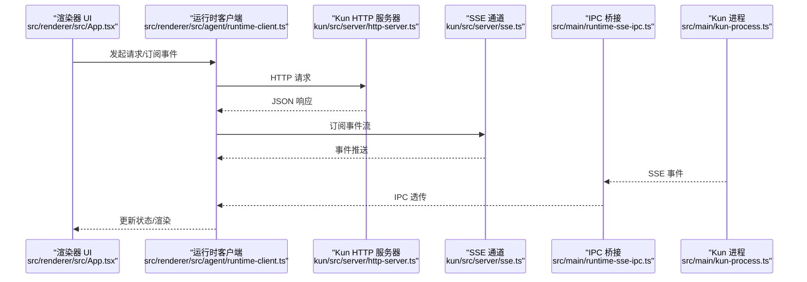
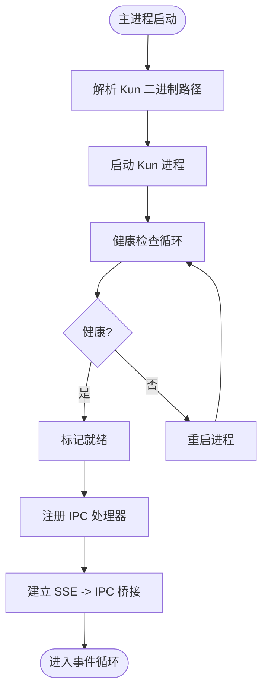
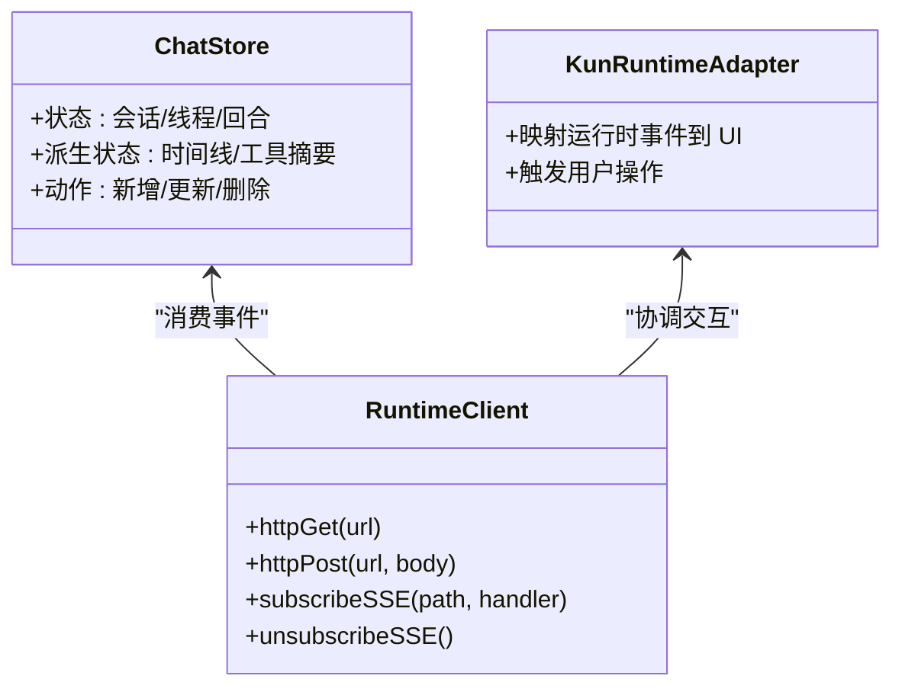
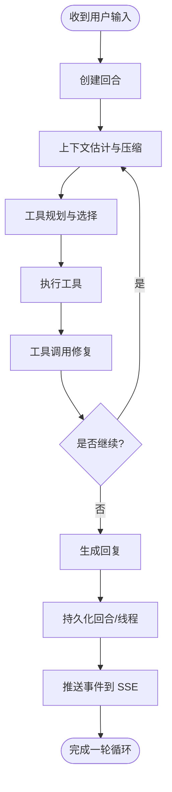
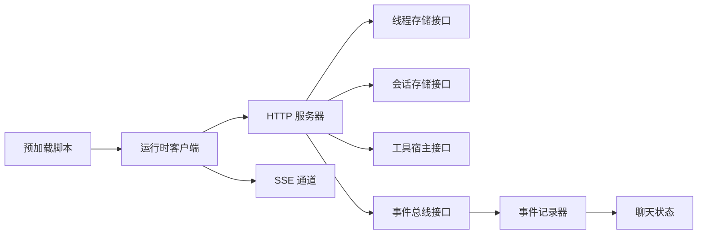

# 三层架构详解

<cite>
**本文引用的文件**
- [src/main/index.ts](file://src/main/index.ts)
- [src/main/kun-process.ts](file://src/main/kun-process.ts)
- [src/main/runtime-sse-ipc.ts](file://src/main/runtime-sse-ipc.ts)
- [src/main/ipc/app-ipc-schemas.ts](file://src/main/ipc/app-ipc-schemas.ts)
- [src/main/ipc/register-app-ipc-handlers.ts](file://src/main/ipc/register-app-ipc-handlers.ts)
- [src/preload/index.ts](file://src/preload/index.ts)
- [src/renderer/src/main.tsx](file://src/renderer/src/main.tsx)
- [src/renderer/src/App.tsx](file://src/renderer/src/App.tsx)
- [src/renderer/src/store/chat-store.ts](file://src/renderer/src/store/chat-store.ts)
- [src/renderer/src/agent/runtime-client.ts](file://src/renderer/src/agent/runtime-client.ts)
- [src/renderer/src/agent/kun-runtime.ts](file://src/renderer/src/agent/kun-runtime.ts)
- [src/renderer/src/lib/load-kun-diagnostics.ts](file://src/renderer/src/lib/load-kun-diagnostics.ts)
- [kun/src/server/http-server.ts](file://kun/src/server/http-server.ts)
- [kun/src/server/sse.ts](file://kun/src/server/sse.ts)
- [kun/src/server/routes/index.ts](file://kun/src/server/routes/index.ts)
- [kun/src/server/routes/server-runtime.ts](file://kun/src/server/routes/server-runtime.ts)
- [kun/src/server/routes/events.ts](file://kun/src/server/routes/events.ts)
- [kun/src/server/routes/health.ts](file://kun/src/server/routes/health.ts)
- [kun/src/server/routes/sessions.ts](file://kun/src/server/routes/sessions.ts)
- [kun/src/server/routes/threads.ts](file://kun/src/server/routes/threads.ts)
- [kun/src/server/routes/turns.ts](file://kun/src/server/routes/turns.ts)
- [kun/src/server/routes/memory.ts](file://kun/src/server/routes/memory.ts)
- [kun/src/server/routes/workspace.ts](file://kun/src/server/routes/workspace.ts)
- [kun/src/server/routes/user-inputs.ts](file://kun/src/server/routes/user-inputs.ts)
- [kun/src/server/routes/usage.ts](file://kun/src/server/routes/usage.ts)
- [kun/src/server/routes/review.ts](file://kun/src/server/routes/review.ts)
- [kun/src/server/routes/approvals.ts](file://kun/src/server/routes/approvals.ts)
- [kun/src/server/routes/runtime-info.ts](file://kun/src/server/routes/runtime-info.ts)
- [kun/src/server/routes/runtime-error.ts](file://kun/src/server/routes/runtime-error.ts)
- [kun/src/loop/agent-loop.ts](file://kun/src/loop/agent-loop.ts)
- [kun/src/services/thread-service.ts](file://kun/src/services/thread-service.ts)
- [kun/src/services/turn-service.ts](file://kun/src/services/turn-service.ts)
- [kun/src/services/usage-service.ts](file://kun/src/services/usage-service.ts)
- [kun/src/services/runtime-event-recorder.ts](file://kun/src/services/runtime-event-recorder.ts)
- [kun/src/ports/thread-store.ts](file://kun/src/ports/thread-store.ts)
- [kun/src/ports/session-store.ts](file://kun/src/ports/session-store.ts)
- [kun/src/ports/tool-host.ts](file://kun/src/ports/tool-host.ts)
- [kun/src/ports/event-bus.ts](file://kun/src/ports/event-bus.ts)
- [kun/src/ports/model-client.ts](file://kun/src/ports/model-client.ts)
- [kun/src/ports/user-input-gate.ts](file://kun/src/ports/user-input-gate.ts)
- [kun/src/ports/approval-gate.ts](file://kun/src/ports/approval-gate.ts)
- [kun/src/ports/workspace-inspector.ts](file://kun/src/ports/workspace-inspector.ts)
- [kun/src/adapters/file/file-session-store.ts](file://kun/src/adapters/file/file-session-store.ts)
- [kun/src/adapters/file/file-thread-store.ts](file://kun/src/adapters/file/file-thread-store.ts)
- [kun/src/adapters/hybrid/hybrid-session-store.ts](file://kun/src/adapters/hybrid/hybrid-session-store.ts)
- [kun/src/adapters/hybrid/hybrid-thread-store.ts](file://kun/src/adapters/hybrid/hybrid-thread-store.ts)
- [kun/src/adapters/in-memory/in-memory-session-store.ts](file://kun/src/adapters/in-memory/in-memory-session-store.ts)
- [kun/src/adapters/in-memory/in-memory-thread-store.ts](file://kun/src/adapters/in-memory/in-memory-thread-store.ts)
- [kun/src/shared/gui-plan.ts](file://kun/src/shared/gui-plan.ts)
- [kun/src/shared/todos.ts](file://kun/src/shared/todos.ts)
- [src/shared/ds-gui-api.ts](file://src/shared/ds-gui-api.ts)
- [src/shared/kun-endpoints.ts](file://src/shared/kun-endpoints.ts)
- [src/main/kun-base-url.ts](file://src/main/kun-base-url.ts)
- [src/main/kun-health.ts](file://src/main/kun-health.ts)
- [src/main/settings-store.ts](file://src/main/settings-store.ts)
- [src/main/services/workspace-service.ts](file://src/main/services/workspace-service.ts)
- [src/main/services/git-service.ts](file://src/main/services/git-service.ts)
- [src/main/services/write-inline-completion-service.ts](file://src/main/services/write-inline-completion-service.ts)
- [src/main/services/write-retrieval-service.ts](file://src/main/services/write-retrieval-service.ts)
- [src/main/services/write-export-service.ts](file://src/main/services/write-export-service.ts)
- [src/main/services/skill-service.ts](file://src/main/services/skill-service.ts)
- [src/main/claw-runtime.ts](file://src/main/claw-runtime.ts)
- [src/main/claw-schedule-mcp-server.ts](file://src/main/claw-schedule-mcp-server.ts)
- [src/main/claw-schedule-mcp-config.ts](file://src/main/claw-schedule-mcp-config.ts)
- [src/main/claw-schedule-mcp-node-entry.ts](file://src/main/claw-schedule-mcp-node-entry.ts)
- [src/main/claw-scheduled-task-detector.ts](file://src/main/claw-scheduled-task-detector.ts)
- [src/main/schedule-runtime.ts](file://src/main/schedule-runtime.ts)
- [src/main/schedule-runtime-helpers.ts](file://src/main/schedule-runtime-helpers.ts)
- [src/main/weixin-bridge-runtime.ts](file://src/main/weixin-bridge-runtime.ts)
- [src/main/gui-updater.ts](file://src/main/gui-updater.ts)
- [src/main/logger.ts](file://src/main/logger.ts)
- [src/main/runtime/kun-adapter.ts](file://src/main/runtime/kun-adapter.ts)
- [src/main/runtime/kun-adapter.test.ts](file://src/main/runtime/kun-adapter.test.ts)
- [kun/src/cli/serve.ts](file://kun/src/cli/serve.ts)
- [kun/src/cli/serve-entry.ts](file://kun/src/cli/serve-entry.ts)
- [kun/src/cli/agent-cli.ts](file://kun/src/cli/agent-cli.ts)
- [kun/src/config/kun-config.ts](file://kun/src/config/kun-config.ts)
- [kun/src/config/kun-config.test.ts](file://kun/src/config/kun-config.test.ts)
- [kun/src/telemetry/cache-telemetry.ts](file://kun/src/telemetry/cache-telemetry.ts)
- [kun/src/telemetry/usage-counter.ts](file://kun/src/telemetry/usage-counter.ts)
- [kun/src/memory/memory-store.ts](file://kun/src/memory/memory-store.ts)
- [kun/src/attachments/attachment-store.ts](file://kun/src/attachments/attachment-store.ts)
- [kun/src/delegation/delegation-runtime.ts](file://kun/src/delegation/delegation-runtime.ts)
- [kun/src/delegation/child-agent-executor.ts](file://kun/src/delegation/child-agent-executor.ts)
- [kun/src/skills/skill-runtime.ts](file://kun/src/skills/skill-runtime.ts)
- [kun/src/domain/thread.ts](file://kun/src/domain/thread.ts)
- [kun/src/domain/session.ts](file://kun/src/domain/session.ts)
- [kun/src/domain/turn.ts](file://kun/src/domain/turn.ts)
- [kun/src/domain/event.ts](file://kun/src/domain/event.ts)
- [kun/src/domain/item.ts](file://kun/src/domain/item.ts)
- [kun/src/domain/approval.ts](file://kun/src/domain/approval.ts)
- [kun/src/domain/usage.ts](file://kun/src/domain/usage.ts)
- [kun/docs/kun-architecture.md](file://kun/docs/kun-architecture.md)
</cite>

## 目录
1. [引言](#引言)
2. [项目结构](#项目结构)
3. [核心组件](#核心组件)
4. [架构总览](#架构总览)
5. [详细组件分析](#详细组件分析)
6. [依赖关系分析](#依赖关系分析)
7. [性能考量](#性能考量)
8. [故障排查指南](#故障排查指南)
9. [结论](#结论)
10. [附录](#附录)

## 引言
本文件面向开发者与架构师，系统性阐述 DeepSeek GUI 的三层架构：Electron 主进程、React 渲染器应用、Kun 运行时核心。文档聚焦三者的职责边界、交互协议（HTTP API、SSE 推送、IPC 通信）以及关键实现位置，辅以架构图与流程图，帮助快速理解整体设计思路与落地细节。

## 项目结构
DeepSeek GUI 采用 Electron + React 前端 + Kun 后端运行时的分层设计：
- Electron 主进程：负责运行时托管、系统集成、GUI 服务、IPC 通信桥接与本地资源管理。
- React 渲染器：负责用户界面、状态管理、用户体验与与运行时的 HTTP/SSE 通信。
- Kun 运行时：负责智能体循环、工具执行、事件总线、数据持久化与对外 HTTP API。

```mermaid
graph TB
subgraph "Electron 主进程"
MIDX["主入口<br/>src/main/index.ts"]
IPC["IPC 注册<br/>src/main/ipc/register-app-ipc-handlers.ts"]
KPROC["Kun 进程管理<br/>src/main/kun-process.ts"]
SSEIPC["SSE -> IPC 桥接<br/>src/main/runtime-sse-ipc.ts"]
PRE["预加载脚本<br/>src/preload/index.ts"]
SET["设置存储<br/>src/main/settings-store.ts"]
WSVC["工作区服务<br/>src/main/services/workspace-service.ts"]
GITSVC["Git 服务<br/>src/main/services/git-service.ts"]
WICS["内联补全服务<br/>src/main/services/write-inline-completion-service.ts"]
WRS["检索写作服务<br/>src/main/services/write-retrieval-service.ts"]
WES["导出服务<br/>src/main/services/write-export-service.ts"]
SKS["技能服务<br/>src/main/services/skill-service.ts"]
CLAW["CLAW 运行时<br/>src/main/claw-runtime.ts"]
SCH["调度运行时<br/>src/main/schedule-runtime.ts"]
WEIXIN["微信桥接<br/>src/main/weixin-bridge-runtime.ts"]
UPD["GUI 更新器<br/>src/main/gui-updater.ts"]
LOG["日志<br/>src/main/logger.ts"]
end
subgraph "React 渲染器"
RAPP["应用入口<br/>src/renderer/src/main.tsx"]
APP["应用壳<br/>src/renderer/src/App.tsx"]
STORE["聊天状态管理<br/>src/renderer/src/store/chat-store.ts"]
RC["运行时客户端<br/>src/renderer/src/agent/runtime-client.ts"]
KR["Kun 运行时适配<br/>src/renderer/src/agent/kun-runtime.ts"]
DIAG["诊断加载<br/>src/renderer/src/lib/load-kun-diagnostics.ts"]
end
subgraph "Kun 运行时"
HSRV["HTTP 服务器<br/>kun/src/server/http-server.ts"]
SSE["SSE 通道<br/>kun/src/server/sse.ts"]
ROUTES["路由集合<br/>kun/src/server/routes/index.ts"]
SR["server-runtime 路由<br/>kun/src/server/routes/server-runtime.ts"]
SESS["会话路由<br/>kun/src/server/routes/sessions.ts"]
THRD["线程路由<br/>kun/src/server/routes/threads.ts"]
TURN["回合路由<br/>kun/src/server/routes/turns.ts"]
MEM["内存路由<br/>kun/src/server/routes/memory.ts"]
WS["工作区路由<br/>kun/src/server/routes/workspace.ts"]
UIN["用户输入路由<br/>kun/src/server/routes/user-inputs.ts"]
USG["用量路由<br/>kun/src/server/routes/usage.ts"]
REV["评审路由<br/>kun/src/server/routes/review.ts"]
APPR["审批路由<br/>kun/src/server/routes/approvals.ts"]
RINF["运行时信息路由<br/>kun/src/server/routes/runtime-info.ts"]
ERR["错误路由<br/>kun/src/server/routes/runtime-error.ts"]
AL["智能体循环<br/>kun/src/loop/agent-loop.ts"]
TSV["线程服务<br/>kun/src/services/thread-service.ts"]
TV["回合服务<br/>kun/src/services/turn-service.ts"]
USGS["用量服务<br/>kun/src/services/usage-service.ts"]
RER["事件记录器<br/>kun/src/services/runtime-event-recorder.ts"]
PTH["线程存储接口<br/>kun/src/ports/thread-store.ts"]
PSP["会话存储接口<br/>kun/src/ports/session-store.ts"]
PH["工具宿主接口<br/>kun/src/ports/tool-host.ts"]
PEB["事件总线接口<br/>kun/src/ports/event-bus.ts"]
PMC["模型客户端接口<br/>kun/src/ports/model-client.ts"]
PUG["用户输入门控<br/>kun/src/ports/user-input-gate.ts"]
PAP["审批门控<br/>kun/src/ports/approval-gate.ts"]
PWI["工作区检查器<br/>kun/src/ports/workspace-inspector.ts"]
FSS["文件会话存储<br/>kun/src/adapters/file/file-session-store.ts"]
FTS["文件线程存储<br/>kun/src/adapters/file/file-thread-store.ts"]
HYS["混合会话存储<br/>kun/src/adapters/hybrid/hybrid-session-store.ts"]
HTS["混合线程存储<br/>kun/src/adapters/hybrid/hybrid-thread-store.ts"]
IMS["内存会话存储<br/>kun/src/adapters/in-memory/in-memory-session-store.ts"]
ITMS["内存线程存储<br/>kun/src/adapters/in-memory/in-memory-thread-store.ts"]
PLAN["GUI 计划共享<br/>kun/src/shared/gui-plan.ts"]
TODO["待办共享<br/>kun/src/shared/todos.ts"]
end
MIDX --> KPROC
MIDX --> IPC
MIDX --> PRE
MIDX --> SET
MIDX --> WSVC
MIDX --> GITSVC
MIDX --> WICS
MIDX --> WRS
MIDX --> WES
MIDX --> SKS
MIDX --> CLAW
MIDX --> SCH
MIDX --> WEIXIN
MIDX --> UPD
MIDX --> LOG
RAPP --> APP
APP --> STORE
STORE --> RC
RC --> HSRV
RC --> SSE
RC --> RER
KPROC --> HSRV
KPROC --> SSE
HSRV --> ROUTES
ROUTES --> SR
ROUTES --> SESS
ROUTES --> THRD
ROUTES --> TURN
ROUTES --> MEM
ROUTES --> WS
ROUTES --> UIN
ROUTES --> USG
ROUTES --> REV
ROUTES --> APPR
ROUTES --> RINF
ROUTES --> ERR
HSRV --> PTH
HSRV --> PSP
HSRV --> PH
HSRV --> PEB
HSRV --> PMC
HSRV --> PUG
HSRV --> PAP
HSRV --> PWI
SSE --> PEB
PEB --> RER
RER --> STORE
```

**图表来源**
- [src/main/index.ts:1-200](file://src/main/index.ts#L1-L200)
- [src/main/kun-process.ts:1-200](file://src/main/kun-process.ts#L1-L200)
- [src/main/runtime-sse-ipc.ts:1-200](file://src/main/runtime-sse-ipc.ts#L1-L200)
- [src/main/ipc/register-app-ipc-handlers.ts:1-200](file://src/main/ipc/register-app-ipc-handlers.ts#L1-L200)
- [src/preload/index.ts:1-200](file://src/preload/index.ts#L1-L200)
- [src/renderer/src/main.tsx:1-200](file://src/renderer/src/main.tsx#L1-L200)
- [src/renderer/src/App.tsx:1-200](file://src/renderer/src/App.tsx#L1-L200)
- [src/renderer/src/store/chat-store.ts:1-200](file://src/renderer/src/store/chat-store.ts#L1-L200)
- [src/renderer/src/agent/runtime-client.ts:1-200](file://src/renderer/src/agent/runtime-client.ts#L1-L200)
- [src/renderer/src/agent/kun-runtime.ts:1-200](file://src/renderer/src/agent/kun-runtime.ts#L1-L200)
- [kun/src/server/http-server.ts:1-200](file://kun/src/server/http-server.ts#L1-L200)
- [kun/src/server/sse.ts:1-200](file://kun/src/server/sse.ts#L1-L200)
- [kun/src/server/routes/index.ts:1-200](file://kun/src/server/routes/index.ts#L1-L200)
- [kun/src/loop/agent-loop.ts:1-200](file://kun/src/loop/agent-loop.ts#L1-L200)
- [kun/src/services/thread-service.ts:1-200](file://kun/src/services/thread-service.ts#L1-L200)
- [kun/src/services/turn-service.ts:1-200](file://kun/src/services/turn-service.ts#L1-L200)
- [kun/src/services/usage-service.ts:1-200](file://kun/src/services/usage-service.ts#L1-L200)
- [kun/src/services/runtime-event-recorder.ts:1-200](file://kun/src/services/runtime-event-recorder.ts#L1-L200)
- [kun/src/ports/thread-store.ts:1-200](file://kun/src/ports/thread-store.ts#L1-L200)
- [kun/src/ports/session-store.ts:1-200](file://kun/src/ports/session-store.ts#L1-L200)
- [kun/src/ports/tool-host.ts:1-200](file://kun/src/ports/tool-host.ts#L1-L200)
- [kun/src/ports/event-bus.ts:1-200](file://kun/src/ports/event-bus.ts#L1-L200)
- [kun/src/ports/model-client.ts:1-200](file://kun/src/ports/model-client.ts#L1-L200)
- [kun/src/ports/user-input-gate.ts:1-200](file://kun/src/ports/user-input-gate.ts#L1-L200)
- [kun/src/ports/approval-gate.ts:1-200](file://kun/src/ports/approval-gate.ts#L1-L200)
- [kun/src/ports/workspace-inspector.ts:1-200](file://kun/src/ports/workspace-inspector.ts#L1-L200)
- [kun/src/adapters/file/file-session-store.ts:1-200](file://kun/src/adapters/file/file-session-store.ts#L1-L200)
- [kun/src/adapters/file/file-thread-store.ts:1-200](file://kun/src/adapters/file/file-thread-store.ts#L1-L200)
- [kun/src/adapters/hybrid/hybrid-session-store.ts:1-200](file://kun/src/adapters/hybrid/hybrid-session-store.ts#L1-L200)
- [kun/src/adapters/hybrid/hybrid-thread-store.ts:1-200](file://kun/src/adapters/hybrid/hybrid-thread-store.ts#L1-L200)
- [kun/src/adapters/in-memory/in-memory-session-store.ts:1-200](file://kun/src/adapters/in-memory/in-memory-session-store.ts#L1-L200)
- [kun/src/adapters/in-memory/in-memory-thread-store.ts:1-200](file://kun/src/adapters/in-memory/in-memory-thread-store.ts#L1-L200)
- [kun/src/shared/gui-plan.ts:1-200](file://kun/src/shared/gui-plan.ts#L1-L200)
- [kun/src/shared/todos.ts:1-200](file://kun/src/shared/todos.ts#L1-L200)

**章节来源**
- [src/main/index.ts:1-200](file://src/main/index.ts#L1-L200)
- [kun/src/server/http-server.ts:1-200](file://kun/src/server/http-server.ts#L1-L200)

## 核心组件
本节从三层视角梳理关键职责与实现位置：

- Electron 主进程
  - 运行时托管：启动/停止 Kun 进程，管理生命周期与健康检查。
  - GUI 服务：工作区、Git、内联补全、检索写作、导出、技能等服务。
  - 系统集成：设置存储、日志、更新器、微信桥接等。
  - IPC 通信：注册主进程与渲染器之间的 IPC 处理器，桥接 SSE。
  - 预加载脚本：向渲染器暴露受控 API，确保安全上下文。

- React 渲染器
  - 用户界面：基于 React 组件构建聊天、写作、计划、调度等视图。
  - 状态管理：集中式聊天状态与派生状态，驱动 UI 更新。
  - 用户体验：消息时间线、侧边栏、工具卡片、插件市场等。
  - 运行时客户端：封装 HTTP API 与 SSE，统一与 Kun 交互。

- Kun 运行时核心
  - 智能体循环：Agent Loop 驱动多轮对话、工具调用与上下文压缩。
  - 工具执行：内置工具与 MCP 工具提供者，能力注册与限流。
  - 数据持久化：会话/线程存储适配器（文件/混合/内存），事件记录与遥测。
  - 对外服务：HTTP API 路由集合，SSE 事件推送，运行时信息与健康检查。

**章节来源**
- [src/main/kun-process.ts:1-200](file://src/main/kun-process.ts#L1-L200)
- [src/main/ipc/register-app-ipc-handlers.ts:1-200](file://src/main/ipc/register-app-ipc-handlers.ts#L1-L200)
- [src/preload/index.ts:1-200](file://src/preload/index.ts#L1-L200)
- [src/renderer/src/store/chat-store.ts:1-200](file://src/renderer/src/store/chat-store.ts#L1-L200)
- [src/renderer/src/agent/runtime-client.ts:1-200](file://src/renderer/src/agent/runtime-client.ts#L1-L200)
- [kun/src/loop/agent-loop.ts:1-200](file://kun/src/loop/agent-loop.ts#L1-L200)
- [kun/src/server/http-server.ts:1-200](file://kun/src/server/http-server.ts#L1-L200)

## 架构总览
下图展示三层之间的典型交互序列：渲染器通过 HTTP API 与 SSE 访问 Kun，主进程负责运行时托管与 IPC 桥接。

**图表来源**
- [src/renderer/src/agent/runtime-client.ts:1-200](file://src/renderer/src/agent/runtime-client.ts#L1-L200)
- [kun/src/server/http-server.ts:1-200](file://kun/src/server/http-server.ts#L1-L200)
- [kun/src/server/sse.ts:1-200](file://kun/src/server/sse.ts#L1-L200)
- [src/main/runtime-sse-ipc.ts:1-200](file://src/main/runtime-sse-ipc.ts#L1-L200)
- [src/main/kun-process.ts:1-200](file://src/main/kun-process.ts#L1-L200)

## 详细组件分析

### Electron 主进程：运行时托管与系统集成
- 运行时托管
  - Kun 进程启动与停止：负责二进制解析、命令行参数、环境变量注入与进程生命周期管理。
  - 健康检查：定期探测运行时健康状态，异常时重启或上报。
- 系统集成
  - 设置存储：持久化 GUI 设置，支持默认值与归一化。
  - 日志：统一日志输出，便于问题定位。
  - 更新器：检查与安装 GUI 更新。
  - 微信桥接：桥接外部系统事件到运行时。
- IPC 与预加载
  - 注册 IPC 处理器，处理来自渲染器的系统级请求。
  - 预加载脚本暴露受限 API，确保安全上下文。

**图表来源**
- [src/main/kun-process.ts:1-200](file://src/main/kun-process.ts#L1-L200)
- [src/main/kun-health.ts:1-200](file://src/main/kun-health.ts#L1-L200)
- [src/main/runtime-sse-ipc.ts:1-200](file://src/main/runtime-sse-ipc.ts#L1-L200)
- [src/main/ipc/register-app-ipc-handlers.ts:1-200](file://src/main/ipc/register-app-ipc-handlers.ts#L1-L200)
- [src/preload/index.ts:1-200](file://src/preload/index.ts#L1-L200)

**章节来源**
- [src/main/kun-process.ts:1-200](file://src/main/kun-process.ts#L1-L200)
- [src/main/kun-health.ts:1-200](file://src/main/kun-health.ts#L1-L200)
- [src/main/runtime-sse-ipc.ts:1-200](file://src/main/runtime-sse-ipc.ts#L1-L200)
- [src/main/ipc/register-app-ipc-handlers.ts:1-200](file://src/main/ipc/register-app-ipc-handlers.ts#L1-L200)
- [src/preload/index.ts:1-200](file://src/preload/index.ts#L1-L200)

### React 渲染器：用户界面与状态管理
- 应用入口与壳
  - 入口负责挂载 React 应用与主题初始化。
  - 应用壳组织导航、侧边栏与主工作区。
- 状态管理
  - 聊天状态集中管理，包含会话、线程、回合与附件。
  - 派生状态用于时间线渲染、工具摘要与草稿恢复。
- 运行时客户端
  - 封装 HTTP API 调用与 SSE 订阅，统一错误处理与重试策略。
  - 与 Kun 运行时的契约定义在共享模块中，保证前后端一致性。

**图表来源**
- [src/renderer/src/store/chat-store.ts:1-200](file://src/renderer/src/store/chat-store.ts#L1-L200)
- [src/renderer/src/agent/runtime-client.ts:1-200](file://src/renderer/src/agent/runtime-client.ts#L1-L200)
- [src/renderer/src/agent/kun-runtime.ts:1-200](file://src/renderer/src/agent/kun-runtime.ts#L1-L200)

**章节来源**
- [src/renderer/src/main.tsx:1-200](file://src/renderer/src/main.tsx#L1-L200)
- [src/renderer/src/App.tsx:1-200](file://src/renderer/src/App.tsx#L1-L200)
- [src/renderer/src/store/chat-store.ts:1-200](file://src/renderer/src/store/chat-store.ts#L1-L200)
- [src/renderer/src/agent/runtime-client.ts:1-200](file://src/renderer/src/agent/runtime-client.ts#L1-L200)
- [src/renderer/src/agent/kun-runtime.ts:1-200](file://src/renderer/src/agent/kun-runtime.ts#L1-L200)

### Kun 运行时核心：智能体循环与工具执行
- 智能体循环
  - Agent Loop 负责多轮对话、上下文估计与压缩、工具调用修复与风暴防护。
  - 支持自动模型路由与请求历史卫生，降低 Token 消耗。
- 工具执行
  - 内置工具集与 MCP 工具提供者，能力注册与限流控制。
  - 输出累积器与读写追踪，保障工具结果可审计。
- 数据持久化
  - 会话/线程存储适配器：文件、混合（内存+文件）、纯内存。
  - 事件记录器与遥测，记录运行时事件与用量统计。
- 对外服务
  - HTTP 路由覆盖会话、线程、回合、内存、工作区、用户输入、用量、评审、审批、运行时信息与错误。
  - SSE 事件推送，主进程通过 IPC 将事件透传给渲染器。

**图表来源**
- [kun/src/loop/agent-loop.ts:1-200](file://kun/src/loop/agent-loop.ts#L1-L200)
- [kun/src/services/thread-service.ts:1-200](file://kun/src/services/thread-service.ts#L1-L200)
- [kun/src/services/turn-service.ts:1-200](file://kun/src/services/turn-service.ts#L1-L200)
- [kun/src/services/runtime-event-recorder.ts:1-200](file://kun/src/services/runtime-event-recorder.ts#L1-L200)
- [kun/src/server/sse.ts:1-200](file://kun/src/server/sse.ts#L1-L200)

**章节来源**
- [kun/src/loop/agent-loop.ts:1-200](file://kun/src/loop/agent-loop.ts#L1-L200)
- [kun/src/services/thread-service.ts:1-200](file://kun/src/services/thread-service.ts#L1-L200)
- [kun/src/services/turn-service.ts:1-200](file://kun/src/services/turn-service.ts#L1-L200)
- [kun/src/services/runtime-event-recorder.ts:1-200](file://kun/src/services/runtime-event-recorder.ts#L1-L200)
- [kun/src/server/sse.ts:1-200](file://kun/src/server/sse.ts#L1-L200)

## 依赖关系分析
- 层间耦合
  - 主进程对运行时的耦合通过进程管理与 IPC 桥接实现，避免直接依赖运行时内部实现。
  - 渲染器仅通过 HTTP API 与 SSE 访问运行时，保持 UI 与业务逻辑解耦。
- 存储适配器
  - 文件/混合/内存适配器实现统一接口，便于切换与测试。
- 事件总线
  - 事件总线作为运行时内部通信中枢，连接循环、服务与记录器。

**图表来源**
- [src/preload/index.ts:1-200](file://src/preload/index.ts#L1-L200)
- [src/renderer/src/agent/runtime-client.ts:1-200](file://src/renderer/src/agent/runtime-client.ts#L1-L200)
- [kun/src/server/http-server.ts:1-200](file://kun/src/server/http-server.ts#L1-L200)
- [kun/src/ports/thread-store.ts:1-200](file://kun/src/ports/thread-store.ts#L1-L200)
- [kun/src/ports/session-store.ts:1-200](file://kun/src/ports/session-store.ts#L1-L200)
- [kun/src/ports/tool-host.ts:1-200](file://kun/src/ports/tool-host.ts#L1-L200)
- [kun/src/ports/event-bus.ts:1-200](file://kun/src/ports/event-bus.ts#L1-L200)
- [kun/src/services/runtime-event-recorder.ts:1-200](file://kun/src/services/runtime-event-recorder.ts#L1-L200)
- [src/renderer/src/store/chat-store.ts:1-200](file://src/renderer/src/store/chat-store.ts#L1-L200)

**章节来源**
- [kun/src/ports/thread-store.ts:1-200](file://kun/src/ports/thread-store.ts#L1-L200)
- [kun/src/ports/session-store.ts:1-200](file://kun/src/ports/session-store.ts#L1-L200)
- [kun/src/ports/tool-host.ts:1-200](file://kun/src/ports/tool-host.ts#L1-L200)
- [kun/src/ports/event-bus.ts:1-200](file://kun/src/ports/event-bus.ts#L1-L200)
- [kun/src/services/runtime-event-recorder.ts:1-200](file://kun/src/services/runtime-event-recorder.ts#L1-L200)

## 性能考量
- 上下文压缩与估计：减少 Token 使用，提升响应速度。
- 缓存与 TTL：工具目录指纹与 TTL LRU 缓存，降低重复计算成本。
- 事件记录与遥测：用量计数器与缓存遥测，辅助性能优化与容量规划。
- SSE 流式推送：相比轮询显著降低延迟与带宽占用。

**章节来源**
- [kun/src/loop/context-compactor.ts:1-200](file://kun/src/loop/context-compactor.ts#L1-L200)
- [kun/src/loop/context-estimator.ts:1-200](file://kun/src/loop/context-estimator.ts#L1-L200)
- [kun/src/telemetry/cache-telemetry.ts:1-200](file://kun/src/telemetry/cache-telemetry.ts#L1-L200)
- [kun/src/telemetry/usage-counter.ts:1-200](file://kun/src/telemetry/usage-counter.ts#L1-L200)

## 故障排查指南
- 健康检查失败
  - 检查运行时进程状态与日志输出，确认二进制路径与环境变量。
- SSE 未推送
  - 确认事件总线已正确发布事件，SSE 通道正常，主进程 IPC 桥接未阻塞。
- IPC 无响应
  - 核对 IPC 处理器注册与预加载脚本暴露的 API。
- HTTP API 错误
  - 查看路由返回的状态码与错误路由内容，结合运行时错误记录器定位问题。

**章节来源**
- [src/main/kun-health.ts:1-200](file://src/main/kun-health.ts#L1-L200)
- [src/main/runtime-sse-ipc.ts:1-200](file://src/main/runtime-sse-ipc.ts#L1-L200)
- [kun/src/server/routes/runtime-error.ts:1-200](file://kun/src/server/routes/runtime-error.ts#L1-L200)
- [kun/src/services/runtime-event-recorder.ts:1-200](file://kun/src/services/runtime-event-recorder.ts#L1-L200)

## 结论
DeepSeek GUI 的三层架构以清晰的职责分离实现了高内聚、低耦合的设计：主进程负责运行时托管与系统集成，渲染器专注 UI 与状态管理，Kun 运行时专注于智能体循环与工具执行。通过 HTTP API、SSE 与 IPC 的组合通信协议，系统在功能完整性与可维护性之间取得平衡，适合进一步扩展与演进。

## 附录
- 关键实现位置速览
  - 主进程入口与 IPC：[src/main/index.ts:1-200](file://src/main/index.ts#L1-L200)，[src/main/ipc/register-app-ipc-handlers.ts:1-200](file://src/main/ipc/register-app-ipc-handlers.ts#L1-L200)
  - 预加载与运行时客户端：[src/preload/index.ts:1-200](file://src/preload/index.ts#L1-L200)，[src/renderer/src/agent/runtime-client.ts:1-200](file://src/renderer/src/agent/runtime-client.ts#L1-L200)
  - HTTP 与 SSE：[kun/src/server/http-server.ts:1-200](file://kun/src/server/http-server.ts#L1-L200)，[kun/src/server/sse.ts:1-200](file://kun/src/server/sse.ts#L1-L200)
  - 存储适配器：[kun/src/adapters/file/file-session-store.ts:1-200](file://kun/src/adapters/file/file-session-store.ts#L1-L200)，[kun/src/adapters/hybrid/hybrid-session-store.ts:1-200](file://kun/src/adapters/hybrid/hybrid-session-store.ts#L1-L200)，[kun/src/adapters/in-memory/in-memory-session-store.ts:1-200](file://kun/src/adapters/in-memory/in-memory-session-store.ts#L1-L200)
  - 运行时核心：[kun/src/loop/agent-loop.ts:1-200](file://kun/src/loop/agent-loop.ts#L1-L200)，[kun/src/services/thread-service.ts:1-200](file://kun/src/services/thread-service.ts#L1-L200)