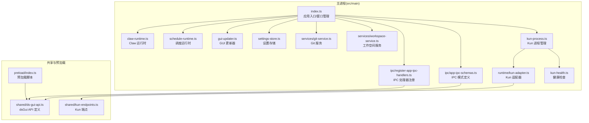
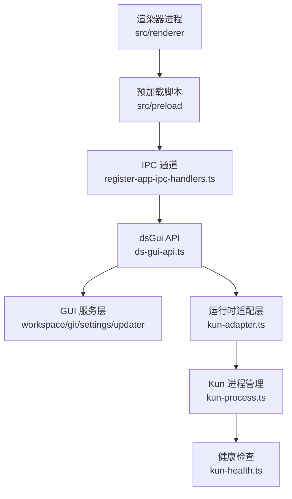
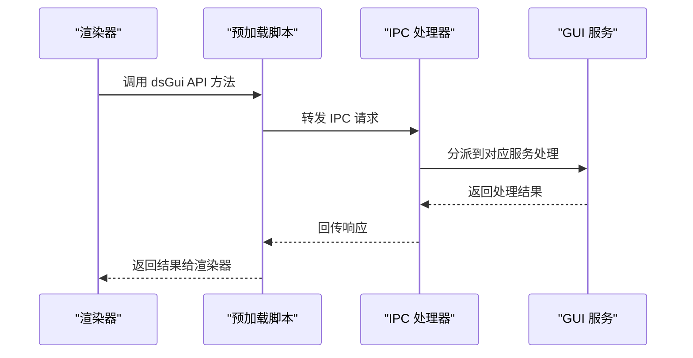
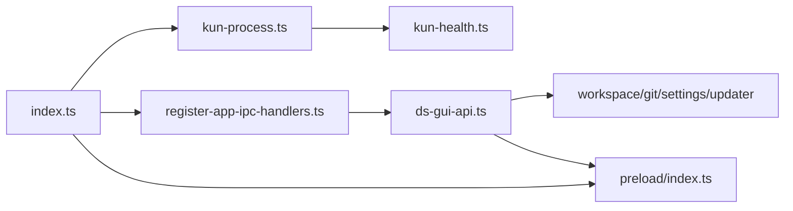

# 主进程层（Electron 主进程）

<cite>
**本文引用的文件**
- [src/main/index.ts](file://src/main/index.ts)
- [src/main/kun-process.ts](file://src/main/kun-process.ts)
- [src/main/kun-health.ts](file://src/main/kun-health.ts)
- [src/main/runtime/kun-adapter.ts](file://src/main/runtime/kun-adapter.ts)
- [src/main/ipc/app-ipc-schemas.ts](file://src/main/ipc/app-ipc-schemas.ts)
- [src/main/ipc/register-app-ipc-handlers.ts](file://src/main/ipc/register-app-ipc-handlers.ts)
- [src/main/services/workspace-service.ts](file://src/main/services/workspace-service.ts)
- [src/main/services/git-service.ts](file://src/main/services/git-service.ts)
- [src/main/settings-store.ts](file://src/main/settings-store.ts)
- [src/main/gui-updater.ts](file://src/main/gui-updater.ts)
- [src/main/schedule-runtime.ts](file://src/main/schedule-runtime.ts)
- [src/main/claw-runtime.ts](file://src/main/claw-runtime.ts)
- [src/shared/ds-gui-api.ts](file://src/shared/ds-gui-api.ts)
- [src/shared/kun-endpoints.ts](file://src/shared/kun-endpoints.ts)
- [src/preload/index.ts](file://src/preload/index.ts)
- [electron.vite.config.ts](file://electron.vite.config.ts)
</cite>

## 目录
1. [引言](#引言)
2. [项目结构](#项目结构)
3. [核心组件](#核心组件)
4. [架构总览](#架构总览)
5. [详细组件分析](#详细组件分析)
6. [依赖关系分析](#依赖关系分析)
7. [性能考量](#性能考量)
8. [故障排查指南](#故障排查指南)
9. [结论](#结论)
10. [附录](#附录)

## 引言
本文件聚焦 DeepSeek GUI 的 Electron 主进程层，系统性阐述其核心职责与实现：运行时托管、GUI 服务、系统集成与进程间通信（IPC）。重点覆盖 Kun 运行时进程的生命周期管理（启动、停止、重启、健康检查），dsGui API 的设计与实现，以及与渲染器进程的数据交换协议。同时，介绍主进程提供的 GUI 专用服务，如工作空间管理、Git 集成、设置存储、更新服务等，帮助开发者快速理解并扩展主进程架构。

## 项目结构
主进程代码位于 src/main 目录，按功能域划分为：
- 运行时管理：kun-process.ts、kun-health.ts、runtime/kun-adapter.ts、schedule-runtime.ts、claw-runtime.ts
- IPC 与 API：ipc/app-ipc-schemas.ts、ipc/register-app-ipc-handlers.ts、shared/ds-gui-api.ts
- GUI 服务：services/workspace-service.ts、services/git-service.ts、settings-store.ts、gui-updater.ts
- 启动与窗口：index.ts
- 预加载脚本：preload/index.ts
- 构建配置：electron.vite.config.ts

图表来源
- [src/main/index.ts](file://src/main/index.ts)
- [src/main/kun-process.ts](file://src/main/kun-process.ts)
- [src/main/kun-health.ts](file://src/main/kun-health.ts)
- [src/main/runtime/kun-adapter.ts](file://src/main/runtime/kun-adapter.ts)
- [src/main/ipc/app-ipc-schemas.ts](file://src/main/ipc/app-ipc-schemas.ts)
- [src/main/ipc/register-app-ipc-handlers.ts](file://src/main/ipc/register-app-ipc-handlers.ts)
- [src/main/services/workspace-service.ts](file://src/main/services/workspace-service.ts)
- [src/main/services/git-service.ts](file://src/main/services/git-service.ts)
- [src/main/settings-store.ts](file://src/main/settings-store.ts)
- [src/main/gui-updater.ts](file://src/main/gui-updater.ts)
- [src/main/schedule-runtime.ts](file://src/main/schedule-runtime.ts)
- [src/main/claw-runtime.ts](file://src/main/claw-runtime.ts)
- [src/shared/ds-gui-api.ts](file://src/shared/ds-gui-api.ts)
- [src/shared/kun-endpoints.ts](file://src/shared/kun-endpoints.ts)
- [src/preload/index.ts](file://src/preload/index.ts)

章节来源
- [electron.vite.config.ts](file://electron.vite.config.ts)

## 核心组件
- 应用入口与窗口管理：负责创建 BrowserWindow、加载预加载脚本、处理窗口生命周期事件与开发服务器加载逻辑。
- Kun 运行时管理：封装 Kun 进程的启动、停止、重启与健康检查，确保 GUI 与后端运行时稳定协同。
- IPC 与 dsGui API：定义 IPC 数据模式与处理器，提供 dsGui API 供渲染器调用，实现主进程能力暴露。
- GUI 专用服务：工作空间管理、Git 集成、设置存储、更新服务等，支撑用户界面与系统交互。
- 预加载脚本：在隔离上下文中注入安全的主进程桥接能力，限制渲染器访问敏感 API。

章节来源
- [src/main/index.ts](file://src/main/index.ts)
- [src/main/kun-process.ts](file://src/main/kun-process.ts)
- [src/main/kun-health.ts](file://src/main/kun-health.ts)
- [src/main/runtime/kun-adapter.ts](file://src/main/runtime/kun-adapter.ts)
- [src/main/ipc/app-ipc-schemas.ts](file://src/main/ipc/app-ipc-schemas.ts)
- [src/main/ipc/register-app-ipc-handlers.ts](file://src/main/ipc/register-app-ipc-handlers.ts)
- [src/main/services/workspace-service.ts](file://src/main/services/workspace-service.ts)
- [src/main/services/git-service.ts](file://src/main/services/git-service.ts)
- [src/main/settings-store.ts](file://src/main/settings-store.ts)
- [src/main/gui-updater.ts](file://src/main/gui-updater.ts)
- [src/preload/index.ts](file://src/preload/index.ts)

## 架构总览
主进程采用“模块化分层”设计：
- 入口层：统一初始化、窗口创建与生命周期管理。
- 服务层：围绕 GUI 功能拆分的服务模块，职责清晰、低耦合。
- 适配层：将外部运行时（Kun、Claw）与内部服务对接，屏蔽差异。
- 通信层：通过 IPC 与 dsGui API 实现渲染器与主进程的解耦交互。

图表来源
- [src/main/index.ts](file://src/main/index.ts)
- [src/main/ipc/register-app-ipc-handlers.ts](file://src/main/ipc/register-app-ipc-handlers.ts)
- [src/shared/ds-gui-api.ts](file://src/shared/ds-gui-api.ts)
- [src/main/runtime/kun-adapter.ts](file://src/main/runtime/kun-adapter.ts)
- [src/main/kun-process.ts](file://src/main/kun-process.ts)
- [src/main/kun-health.ts](file://src/main/kun-health.ts)
- [src/preload/index.ts](file://src/preload/index.ts)

## 详细组件分析

### 应用入口与窗口管理（index.ts）
- 职责
  - 创建 BrowserWindow，配置标题栏样式、菜单可见性、webPreferences（上下文隔离、沙箱、webviewTag）。
  - 加载开发服务器或打包后的页面，处理窗口 ready-to-show 与 did-finish-load 事件，确保首次显示稳定性。
  - 注册预加载错误监听，记录失败原因以便诊断。
  - 提供 Kun 运行时配置变更检测，用于触发重启或热更新策略。
- 关键流程
  - 窗口创建 → 预加载加载 → 页面加载 → 首次显示 → 生命周期事件清理。
- 安全与体验
  - 启用上下文隔离与沙箱，避免渲染器直接访问 Node.js API。
  - 根据平台调整标题栏与菜单策略，提升桌面一致性。

章节来源
- [src/main/index.ts](file://src/main/index.ts)

### Kun 运行时进程管理（kun-process.ts）
- 职责
  - 解析与定位 Kun 可执行二进制，构建启动参数与环境变量。
  - 启动、停止、重启 Kun 进程；监听退出事件并进行重试或上报。
  - 与健康检查模块协作，定期探测运行时状态，异常时触发重启或降级。
- 生命周期
  - 启动：解析二进制路径、合并配置、spawn 子进程。
  - 健康：周期性探测，失败次数阈值触发重启。
  - 停止：优雅关闭，超时强制终止。
  - 重启：基于策略（自动/手动）与条件（配置变更、崩溃）执行。
- 错误处理
  - 记录启动失败、退出码、stderr 输出，便于诊断。
  - 对不可恢复错误进行降级提示与回退策略。

章节来源
- [src/main/kun-process.ts](file://src/main/kun-process.ts)

### 健康检查（kun-health.ts）
- 职责
  - 定期向 Kun 发送健康探测请求，验证服务可用性。
  - 统计连续失败次数，达到阈值触发重启或告警。
- 策略
  - 探测间隔可配置；失败阈值与重试策略可调。
  - 支持 SSE 或 HTTP 探测两种模式（依据实现选择）。

章节来源
- [src/main/kun-health.ts](file://src/main/kun-health.ts)

### 运行时适配器（runtime/kun-adapter.ts）
- 职责
  - 将 Kun 运行时的内部协议与 GUI 侧 API 对接，抽象统一的调用接口。
  - 提供端点解析、请求封装、响应映射与错误转换。
- 与端点定义协作
  - 读取共享端点常量，确保主/渲染两端一致。

章节来源
- [src/main/runtime/kun-adapter.ts](file://src/main/runtime/kun-adapter.ts)
- [src/shared/kun-endpoints.ts](file://src/shared/kun-endpoints.ts)

### IPC 与 dsGui API（app-ipc-schemas.ts、register-app-ipc-handlers.ts）
- IPC 模式定义
  - 在 app-ipc-schemas.ts 中声明请求/响应数据结构与校验规则，保证类型安全与契约清晰。
- 处理器注册
  - register-app-ipc-handlers.ts 将 IPC 请求路由到具体服务函数，实现主进程能力暴露。
- dsGui API
  - shared/ds-gui-api.ts 定义渲染器可调用的 API 列表与签名，预加载脚本注入安全桥接。
  - 预加载脚本仅暴露受控方法，避免直接暴露 Node/Electron API。

图表来源
- [src/main/ipc/app-ipc-schemas.ts](file://src/main/ipc/app-ipc-schemas.ts)
- [src/main/ipc/register-app-ipc-handlers.ts](file://src/main/ipc/register-app-ipc-handlers.ts)
- [src/shared/ds-gui-api.ts](file://src/shared/ds-gui-api.ts)
- [src/preload/index.ts](file://src/preload/index.ts)

章节来源
- [src/main/ipc/app-ipc-schemas.ts](file://src/main/ipc/app-ipc-schemas.ts)
- [src/main/ipc/register-app-ipc-handlers.ts](file://src/main/ipc/register-app-ipc-handlers.ts)
- [src/shared/ds-gui-api.ts](file://src/shared/ds-gui-api.ts)
- [src/preload/index.ts](file://src/preload/index.ts)

### GUI 专用服务

#### 工作空间服务（workspace-service.ts）
- 职责
  - 管理用户工作空间路径、文件浏览与编辑、会话与线程持久化。
  - 与本地文件系统交互，提供安全的路径解析与访问控制。
- 与 IPC 协作
  - 通过 dsGui API 暴露工作空间操作，供渲染器调用。

章节来源
- [src/main/services/workspace-service.ts](file://src/main/services/workspace-service.ts)

#### Git 集成（git-service.ts）
- 职责
  - 提供 Git 操作封装（分支、提交、拉取、推送等），支持与工作空间联动。
- 场景
  - 代码评审、版本控制与协作流程集成。

章节来源
- [src/main/services/git-service.ts](file://src/main/services/git-service.ts)

#### 设置存储（settings-store.ts）
- 职责
  - 提供应用设置的读写、迁移与校验，支持默认值与类型约束。
- 与 IPC 协作
  - 通过 dsGui API 暴露设置读写接口，渲染器可动态更新 GUI 行为。

章节来源
- [src/main/settings-store.ts](file://src/main/settings-store.ts)

#### GUI 更新服务（gui-updater.ts）
- 职责
  - 检查更新、下载、安装与重启，确保 GUI 版本及时升级。
- 流程
  - 检查更新 → 下载包 → 安装 → 重启应用。

章节来源
- [src/main/gui-updater.ts](file://src/main/gui-updater.ts)

### 调度运行时与 Claw 运行时
- 调度运行时（schedule-runtime.ts）
  - 管理计划任务与调度相关运行时，提供任务探测、配置与执行。
- Claw 运行时（claw-runtime.ts）
  - 管理 Claw 平台相关运行时，包含安装、配置与服务编排。

章节来源
- [src/main/schedule-runtime.ts](file://src/main/schedule-runtime.ts)
- [src/main/claw-runtime.ts](file://src/main/claw-runtime.ts)

## 依赖关系分析
- 模块内聚与耦合
  - index.ts 作为入口，聚合各子系统但保持低耦合；通过 IPC 与服务层解耦。
  - kun-process 与 kun-health 形成强关联，共同保障运行时稳定性。
  - dsGui API 与 IPC 处理器形成契约边界，预加载脚本作为桥接层。
- 外部依赖
  - Electron 渲染器/主进程通信、Node.js 进程管理、HTTP/SSE 健康探测。
- 循环依赖规避
  - 通过共享契约（IPC 模式、API 定义）与分层职责避免循环导入。

图表来源
- [src/main/index.ts](file://src/main/index.ts)
- [src/main/kun-process.ts](file://src/main/kun-process.ts)
- [src/main/kun-health.ts](file://src/main/kun-health.ts)
- [src/main/ipc/register-app-ipc-handlers.ts](file://src/main/ipc/register-app-ipc-handlers.ts)
- [src/shared/ds-gui-api.ts](file://src/shared/ds-gui-api.ts)
- [src/preload/index.ts](file://src/preload/index.ts)

## 性能考量
- 进程启动与窗口显示
  - 使用 ready-to-show 与 did-finish-load 事件控制首次显示时机，减少白屏时间。
  - 预加载错误早发现早记录，避免后续渲染阻塞。
- IPC 与序列化
  - IPC 数据结构尽量扁平化，避免大对象频繁传输；必要时使用分片或增量更新。
- 健康检查频率
  - 合理设置健康检查间隔与失败阈值，平衡可靠性与资源消耗。
- 文件系统与 Git 操作
  - 批量操作合并，避免频繁 IO；对大文件操作采用异步与进度反馈。

## 故障排查指南
- 预加载失败
  - 现象：窗口无法正常显示或控制台报错。
  - 排查：检查预加载路径、权限与依赖；关注 preload-error 事件日志。
- Kun 进程异常
  - 现象：运行时无响应或反复重启。
  - 排查：查看启动参数、stderr 日志、健康检查失败次数；确认二进制路径与权限。
- IPC 调用失败
  - 现象：渲染器调用 dsGui API 抛错或无响应。
  - 排查：核对 IPC 模式定义、处理器注册顺序与参数校验；检查预加载桥接是否生效。
- 设置读写异常
  - 现象：设置不生效或丢失。
  - 排查：检查设置存储文件权限、迁移逻辑与默认值覆盖。

章节来源
- [src/main/index.ts](file://src/main/index.ts)
- [src/main/kun-process.ts](file://src/main/kun-process.ts)
- [src/main/kun-health.ts](file://src/main/kun-health.ts)
- [src/main/ipc/register-app-ipc-handlers.ts](file://src/main/ipc/register-app-ipc-handlers.ts)
- [src/shared/ds-gui-api.ts](file://src/shared/ds-gui-api.ts)

## 结论
主进程层以模块化与分层设计为核心，结合 IPC 与 dsGui API，实现了运行时托管、GUI 服务与系统集成的高效协同。通过严格的健康检查与错误处理策略，确保 DeepSeek GUI 在复杂场景下的稳定性与可维护性。开发者可在此基础上扩展新服务、优化 IPC 协议与运行时策略，持续提升用户体验。

## 附录
- 配置与构建
  - electron.vite.config.ts 指定主进程入口与打包配置，确保开发与生产环境一致。
- API 参考
  - ds-gui-api.ts 定义渲染器可调用的 API 列表，预加载脚本注入安全桥接方法。
- 端点参考
  - kun-endpoints.ts 提供 Kun 运行时端点常量，确保主/渲染两端一致。

章节来源
- [electron.vite.config.ts](file://electron.vite.config.ts)
- [src/shared/ds-gui-api.ts](file://src/shared/ds-gui-api.ts)
- [src/shared/kun-endpoints.ts](file://src/shared/kun-endpoints.ts)