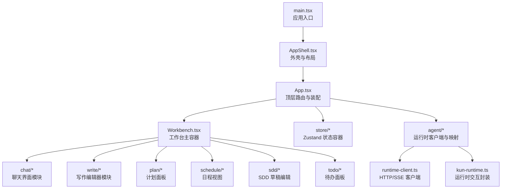
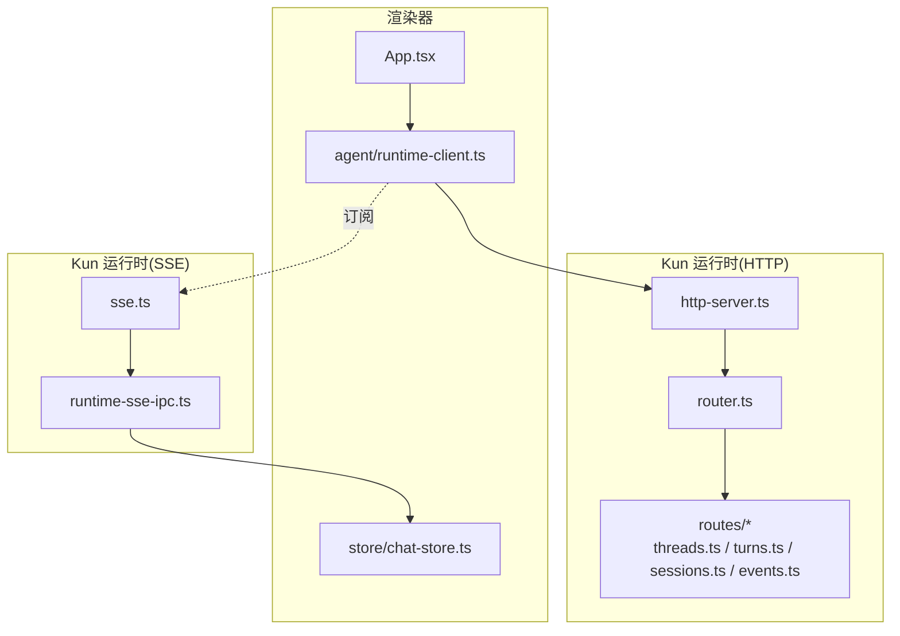
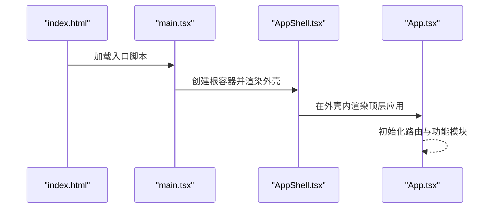
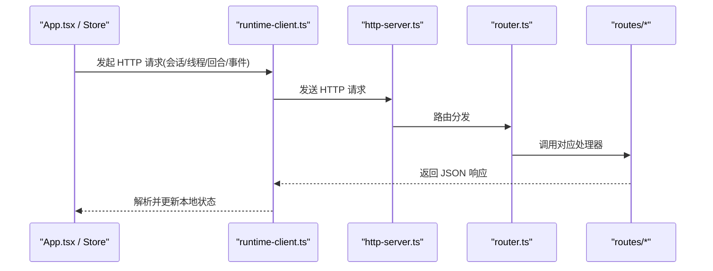
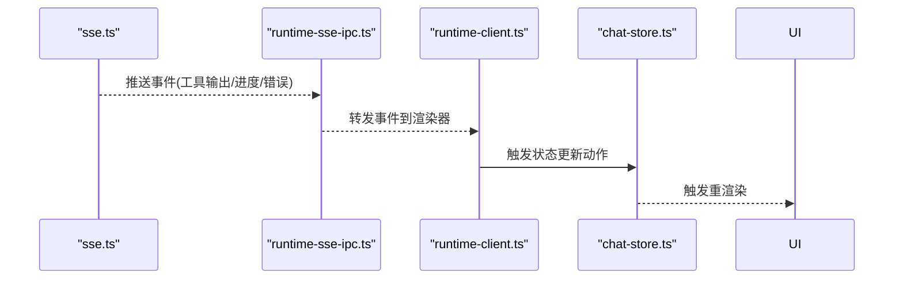
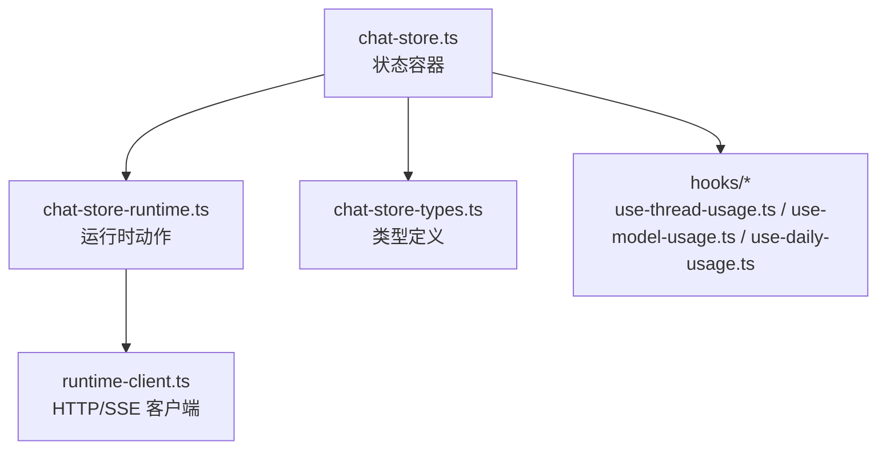
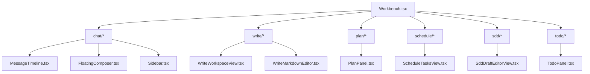
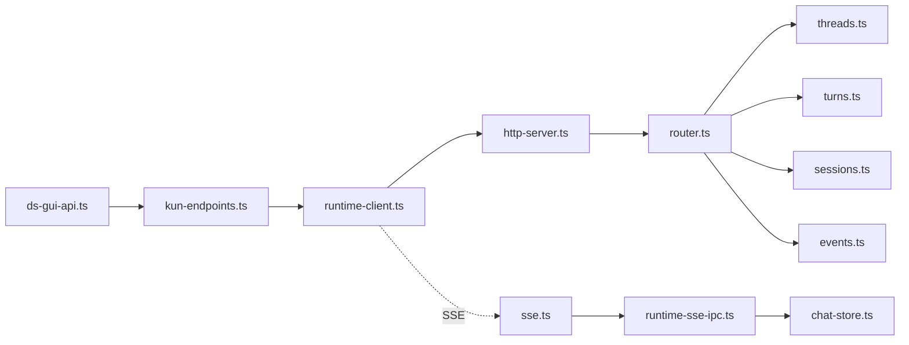

# 渲染器层（React 渲染器应用）

<cite>
**本文引用的文件**
- [App.tsx](file://src/renderer/src/App.tsx)
- [AppShell.tsx](file://src/renderer/src/AppShell.tsx)
- [main.tsx](file://src/renderer/src/main.tsx)
- [index.html](file://src/renderer/index.html)
- [runtime-client.ts](file://src/renderer/src/agent/runtime-client.ts)
- [kun-runtime.ts](file://src/renderer/src/agent/kun-runtime.ts)
- [chat-store.ts](file://src/renderer/src/store/chat-store.ts)
- [chat-store-runtime.ts](file://src/renderer/src/store/chat-store-runtime.ts)
- [chat-store-types.ts](file://src/renderer/src/store/chat-store-types.ts)
- [Workbench.tsx](file://src/renderer/src/components/Workbench.tsx)
- [WriteWorkspaceView.tsx](file://src/renderer/src/components/write/WriteWorkspaceView.tsx)
- [WriteMarkdownEditor.tsx](file://src/renderer/src/components/write/WriteMarkdownEditor.tsx)
- [MessageTimeline.tsx](file://src/renderer/src/components/chat/MessageTimeline.tsx)
- [FloatingComposer.tsx](file://src/renderer/src/components/chat/FloatingComposer.tsx)
- [Sidebar.tsx](file://src/renderer/src/components/chat/Sidebar.tsx)
- [PlanPanel.tsx](file://src/renderer/src/components/plan/PlanPanel.tsx)
- [ScheduleTasksView.tsx](file://src/renderer/src/components/schedule/ScheduleTasksView.tsx)
- [SddDraftEditorView.tsx](file://src/renderer/src/components/sdd/SddDraftEditorView.tsx)
- [TodoPanel.tsx](file://src/renderer/src/components/todo/TodoPanel.tsx)
- [use-thread-usage.ts](file://src/renderer/src/hooks/use-thread-usage.ts)
- [use-model-usage.ts](file://src/renderer/src/hooks/use-model-usage.ts)
- [use-daily-usage.ts](file://src/renderer/src/hooks/use-daily-usage.ts)
- [write-workspace-store.ts](file://src/renderer/src/write/write-workspace-store.ts)
- [write-workspace-store-types.ts](file://src/renderer/src/write/write-workspace-store-types.ts)
- [ds-gui-api.ts](file://src/shared/ds-gui-api.ts)
- [kun-endpoints.ts](file://src/shared/kun-endpoints.ts)
- [runtime-sse-ipc.ts](file://src/main/runtime-sse-ipc.ts)
- [http-server.ts](file://kun/src/server/http-server.ts)
- [sse.ts](file://kun/src/server/sse.ts)
- [router.ts](file://kun/src/server/router.ts)
- [threads.ts](file://kun/src/server/routes/threads.ts)
- [turns.ts](file://kun/src/server/routes/turns.ts)
- [sessions.ts](file://kun/src/server/routes/sessions.ts)
- [events.ts](file://kun/src/server/routes/events.ts)
- [read-json-body.ts](file://kun/src/server/read-json-body.ts)
- [response.ts](file://kun/src/server/response.ts)
- [kun-config.ts](file://kun/src/config/kun-config.ts)
- [kun-config.test.ts](file://kun/src/config/kun-config.test.ts)
</cite>

## 目录
1. [简介](#简介)
2. [项目结构](#项目结构)
3. [核心组件](#核心组件)
4. [架构总览](#架构总览)
5. [详细组件分析](#详细组件分析)
6. [依赖关系分析](#依赖关系分析)
7. [性能考量](#性能考量)
8. [故障排查指南](#故障排查指南)
9. [结论](#结论)
10. [附录](#附录)

## 简介
本文件面向 DeepSeek GUI 的渲染器层（React 渲染器应用），系统性阐述其架构设计、组件层次、状态管理以及与 Kun 运行时的通信机制。重点覆盖以下方面：
- 渲染器应用的启动流程与外壳结构
- 与 Kun 运行时通过 HTTP API 与 SSE 的双向通信
- 基于 Zustand 的状态容器设计与使用模式
- 用户界面模块化组织：工作台布局、聊天界面、写作编辑器、侧边栏等
- 实时数据更新与错误处理策略
- 组件使用示例与最佳实践

## 项目结构
渲染器层位于 src/renderer 目录，采用“入口 -> 外壳 -> 功能模块”的分层组织方式：
- 入口与挂载：main.tsx 负责挂载 React 应用；index.html 提供 DOM 容器
- 应用外壳：AppShell.tsx 提供全局布局与主题；App.tsx 作为顶层路由与功能装配
- 功能模块：components 下按领域划分（chat、write、plan、schedule、sdd、todo 等）
- 状态管理：store 目录下集中定义 Zustand 状态容器与动作
- 与运行时通信：agent 目录封装 runtime-client 与 kun-runtime，共享端点定义在 shared

图表来源
- [main.tsx:1-50](file://src/renderer/src/main.tsx#L1-L50)
- [AppShell.tsx:1-120](file://src/renderer/src/AppShell.tsx#L1-L120)
- [App.tsx:1-120](file://src/renderer/src/App.tsx#L1-L120)
- [Workbench.tsx:1-120](file://src/renderer/src/components/Workbench.tsx#L1-L120)

章节来源
- [main.tsx:1-50](file://src/renderer/src/main.tsx#L1-L50)
- [index.html:1-50](file://src/renderer/index.html#L1-L50)
- [AppShell.tsx:1-120](file://src/renderer/src/AppShell.tsx#L1-L120)
- [App.tsx:1-120](file://src/renderer/src/App.tsx#L1-L120)

## 核心组件
- 应用外壳与布局：AppShell.tsx 提供全局样式、主题与基础布局；Workbench.tsx 作为工作台主容器承载各功能模块
- 聊天模块：MessageTimeline.tsx 展示消息时间线；FloatingComposer.tsx 提供浮动输入与模型选择；Sidebar.tsx 提供会话与侧边导航
- 写作模块：WriteWorkspaceView.tsx 与 WriteMarkdownEditor.tsx 构成文档编辑与预览体系
- 计划/日程/SDD/Todo：PlanPanel.tsx、ScheduleTasksView.tsx、SddDraftEditorView.tsx、TodoPanel.tsx 分别对应相应功能域
- 状态容器：chat-store.ts 为核心状态容器，配合 runtime 与 helpers 实现与后端的同步与维护

章节来源
- [Workbench.tsx:1-120](file://src/renderer/src/components/Workbench.tsx#L1-L120)
- [MessageTimeline.tsx:1-120](file://src/renderer/src/components/chat/MessageTimeline.tsx#L1-L120)
- [FloatingComposer.tsx:1-120](file://src/renderer/src/components/chat/FloatingComposer.tsx#L1-L120)
- [Sidebar.tsx:1-120](file://src/renderer/src/components/chat/Sidebar.tsx#L1-L120)
- [WriteWorkspaceView.tsx:1-120](file://src/renderer/src/components/write/WriteWorkspaceView.tsx#L1-L120)
- [WriteMarkdownEditor.tsx:1-120](file://src/renderer/src/components/write/WriteMarkdownEditor.tsx#L1-L120)
- [PlanPanel.tsx:1-120](file://src/renderer/src/components/plan/PlanPanel.tsx#L1-L120)
- [ScheduleTasksView.tsx:1-120](file://src/renderer/src/components/schedule/ScheduleTasksView.tsx#L1-L120)
- [SddDraftEditorView.tsx:1-120](file://src/renderer/src/components/sdd/SddDraftEditorView.tsx#L1-L120)
- [TodoPanel.tsx:1-120](file://src/renderer/src/components/todo/TodoPanel.tsx#L1-L120)

## 架构总览
渲染器与运行时的交互分为两条主线：
- HTTP API：用于会话、线程、回合、事件等资源的增删改查与控制流
- SSE 推送：用于实时事件流（如工具调用输出、进度、错误）的订阅与消费

图表来源
- [runtime-client.ts:1-200](file://src/renderer/src/agent/runtime-client.ts#L1-L200)
- [http-server.ts:1-200](file://kun/src/server/http-server.ts#L1-L200)
- [router.ts:1-200](file://kun/src/server/router.ts#L1-L200)
- [threads.ts:1-200](file://kun/src/server/routes/threads.ts#L1-L200)
- [turns.ts:1-200](file://kun/src/server/routes/turns.ts#L1-L200)
- [sessions.ts:1-200](file://kun/src/server/routes/sessions.ts#L1-L200)
- [events.ts:1-200](file://kun/src/server/routes/events.ts#L1-L200)
- [sse.ts:1-200](file://kun/src/server/sse.ts#L1-L200)
- [runtime-sse-ipc.ts:1-200](file://src/main/runtime-sse-ipc.ts#L1-L200)

## 详细组件分析

### 渲染器启动与外壳
- main.tsx 负责创建根节点并挂载 React 应用
- AppShell.tsx 提供全局样式与布局骨架，Workbench.tsx 作为工作台容器承载各功能区域
- App.tsx 作为顶层装配，负责路由与功能模块的组合

图表来源
- [index.html:1-50](file://src/renderer/index.html#L1-L50)
- [main.tsx:1-50](file://src/renderer/src/main.tsx#L1-L50)
- [AppShell.tsx:1-120](file://src/renderer/src/AppShell.tsx#L1-L120)
- [App.tsx:1-120](file://src/renderer/src/App.tsx#L1-L120)

章节来源
- [main.tsx:1-50](file://src/renderer/src/main.tsx#L1-L50)
- [AppShell.tsx:1-120](file://src/renderer/src/AppShell.tsx#L1-L120)
- [App.tsx:1-120](file://src/renderer/src/App.tsx#L1-L120)

### 与运行时的 HTTP 通信
- 端点定义：shared/kun-endpoints.ts 提供统一的运行时端点常量
- 客户端封装：agent/runtime-client.ts 将 HTTP 请求抽象为可复用的方法，支持会话、线程、回合、事件等操作
- 服务器路由：kun/src/server/router.ts 将请求分发到具体路由处理器（threads.ts、turns.ts、sessions.ts、events.ts）
- 请求体与响应：read-json-body.ts 与 response.ts 提供通用的请求体解析与响应封装

图表来源
- [kun-endpoints.ts:1-200](file://src/shared/kun-endpoints.ts#L1-L200)
- [runtime-client.ts:1-200](file://src/renderer/src/agent/runtime-client.ts#L1-L200)
- [http-server.ts:1-200](file://kun/src/server/http-server.ts#L1-L200)
- [router.ts:1-200](file://kun/src/server/router.ts#L1-L200)
- [threads.ts:1-200](file://kun/src/server/routes/threads.ts#L1-L200)
- [turns.ts:1-200](file://kun/src/server/routes/turns.ts#L1-L200)
- [sessions.ts:1-200](file://kun/src/server/routes/sessions.ts#L1-L200)
- [events.ts:1-200](file://kun/src/server/routes/events.ts#L1-L200)
- [read-json-body.ts:1-200](file://kun/src/server/read-json-body.ts#L1-L200)
- [response.ts:1-200](file://kun/src/server/response.ts#L1-L200)

章节来源
- [kun-endpoints.ts:1-200](file://src/shared/kun-endpoints.ts#L1-L200)
- [runtime-client.ts:1-200](file://src/renderer/src/agent/runtime-client.ts#L1-L200)
- [http-server.ts:1-200](file://kun/src/server/http-server.ts#L1-L200)
- [router.ts:1-200](file://kun/src/server/router.ts#L1-L200)
- [threads.ts:1-200](file://kun/src/server/routes/threads.ts#L1-L200)
- [turns.ts:1-200](file://kun/src/server/routes/turns.ts#L1-L200)
- [sessions.ts:1-200](file://kun/src/server/routes/sessions.ts#L1-L200)
- [events.ts:1-200](file://kun/src/server/routes/events.ts#L1-L200)
- [read-json-body.ts:1-200](file://kun/src/server/read-json-body.ts#L1-L200)
- [response.ts:1-200](file://kun/src/server/response.ts#L1-L200)

### 与运行时的 SSE 实时推送
- SSE 服务：kun/src/server/sse.ts 提供事件流发布能力
- IPC 桥接：src/main/runtime-sse-ipc.ts 将 SSE 事件桥接到渲染器进程
- 客户端订阅：agent/runtime-client.ts 订阅事件流并回调至状态容器
- 状态更新：store/chat-store.ts 与 runtime 辅助模块根据事件更新 UI

图表来源
- [sse.ts:1-200](file://kun/src/server/sse.ts#L1-L200)
- [runtime-sse-ipc.ts:1-200](file://src/main/runtime-sse-ipc.ts#L1-L200)
- [runtime-client.ts:1-200](file://src/renderer/src/agent/runtime-client.ts#L1-L200)
- [chat-store.ts:1-200](file://src/renderer/src/store/chat-store.ts#L1-L200)

章节来源
- [sse.ts:1-200](file://kun/src/server/sse.ts#L1-L200)
- [runtime-sse-ipc.ts:1-200](file://src/main/runtime-sse-ipc.ts#L1-L200)
- [runtime-client.ts:1-200](file://src/renderer/src/agent/runtime-client.ts#L1-L200)
- [chat-store.ts:1-200](file://src/renderer/src/store/chat-store.ts#L1-L200)

### 状态管理（Zustand）
- chat-store.ts 定义核心状态容器，包含会话、线程、回合、工具调用、附件等状态域
- chat-store-runtime.ts 提供与运行时交互的动作（创建线程、发送消息、订阅事件等）
- chat-store-types.ts 定义状态类型与动作签名，确保类型安全
- hooks 如 use-thread-usage.ts、use-model-usage.ts、use-daily-usage.ts 提供便捷的状态读取与派生逻辑

图表来源
- [chat-store.ts:1-200](file://src/renderer/src/store/chat-store.ts#L1-L200)
- [chat-store-runtime.ts:1-200](file://src/renderer/src/store/chat-store-runtime.ts#L1-L200)
- [chat-store-types.ts:1-200](file://src/renderer/src/store/chat-store-types.ts#L1-L200)
- [runtime-client.ts:1-200](file://src/renderer/src/agent/runtime-client.ts#L1-L200)
- [use-thread-usage.ts:1-200](file://src/renderer/src/hooks/use-thread-usage.ts#L1-L200)
- [use-model-usage.ts:1-200](file://src/renderer/src/hooks/use-model-usage.ts#L1-L200)
- [use-daily-usage.ts:1-200](file://src/renderer/src/hooks/use-daily-usage.ts#L1-L200)

章节来源
- [chat-store.ts:1-200](file://src/renderer/src/store/chat-store.ts#L1-L200)
- [chat-store-runtime.ts:1-200](file://src/renderer/src/store/chat-store-runtime.ts#L1-L200)
- [chat-store-types.ts:1-200](file://src/renderer/src/store/chat-store-types.ts#L1-L200)
- [runtime-client.ts:1-200](file://src/renderer/src/agent/runtime-client.ts#L1-L200)
- [use-thread-usage.ts:1-200](file://src/renderer/src/hooks/use-thread-usage.ts#L1-L200)
- [use-model-usage.ts:1-200](file://src/renderer/src/hooks/use-model-usage.ts#L1-L200)
- [use-daily-usage.ts:1-200](file://src/renderer/src/hooks/use-daily-usage.ts#L1-L200)

### 用户界面模块组织
- 工作台布局：Workbench.tsx 作为主容器，协调侧边栏、内容区与顶部工具条
- 聊天界面：MessageTimeline.tsx 展示消息与工具调用结果；FloatingComposer.tsx 提供输入与模型选择；Sidebar.tsx 提供会话列表与导航
- 写作编辑器：WriteWorkspaceView.tsx 与 WriteMarkdownEditor.tsx 支持文档树、编辑与预览联动
- 计划/日程/SDD/Todo：PlanPanel.tsx、ScheduleTasksView.tsx、SddDraftEditorView.tsx、TodoPanel.tsx 提供各自领域的可视化与交互

图表来源
- [Workbench.tsx:1-120](file://src/renderer/src/components/Workbench.tsx#L1-L120)
- [MessageTimeline.tsx:1-120](file://src/renderer/src/components/chat/MessageTimeline.tsx#L1-L120)
- [FloatingComposer.tsx:1-120](file://src/renderer/src/components/chat/FloatingComposer.tsx#L1-L120)
- [Sidebar.tsx:1-120](file://src/renderer/src/components/chat/Sidebar.tsx#L1-L120)
- [WriteWorkspaceView.tsx:1-120](file://src/renderer/src/components/write/WriteWorkspaceView.tsx#L1-L120)
- [WriteMarkdownEditor.tsx:1-120](file://src/renderer/src/components/write/WriteMarkdownEditor.tsx#L1-L120)
- [PlanPanel.tsx:1-120](file://src/renderer/src/components/plan/PlanPanel.tsx#L1-L120)
- [ScheduleTasksView.tsx:1-120](file://src/renderer/src/components/schedule/ScheduleTasksView.tsx#L1-L120)
- [SddDraftEditorView.tsx:1-120](file://src/renderer/src/components/sdd/SddDraftEditorView.tsx#L1-L120)
- [TodoPanel.tsx:1-120](file://src/renderer/src/components/todo/TodoPanel.tsx#L1-L120)

章节来源
- [Workbench.tsx:1-120](file://src/renderer/src/components/Workbench.tsx#L1-L120)
- [MessageTimeline.tsx:1-120](file://src/renderer/src/components/chat/MessageTimeline.tsx#L1-L120)
- [FloatingComposer.tsx:1-120](file://src/renderer/src/components/chat/FloatingComposer.tsx#L1-L120)
- [Sidebar.tsx:1-120](file://src/renderer/src/components/chat/Sidebar.tsx#L1-L120)
- [WriteWorkspaceView.tsx:1-120](file://src/renderer/src/components/write/WriteWorkspaceView.tsx#L1-L120)
- [WriteMarkdownEditor.tsx:1-120](file://src/renderer/src/components/write/WriteMarkdownEditor.tsx#L1-L120)
- [PlanPanel.tsx:1-120](file://src/renderer/src/components/plan/PlanPanel.tsx#L1-L120)
- [ScheduleTasksView.tsx:1-120](file://src/renderer/src/components/schedule/ScheduleTasksView.tsx#L1-L120)
- [SddDraftEditorView.tsx:1-120](file://src/renderer/src/components/sdd/SddDraftEditorView.tsx#L1-L120)
- [TodoPanel.tsx:1-120](file://src/renderer/src/components/todo/TodoPanel.tsx#L1-L120)

### 写作工作区状态与存储
- write-workspace-store.ts 与 write-workspace-store-types.ts 定义写作工作区的状态与类型，支持文档打开、滚动同步、设置变更等
- 与 chat-store 协同：通过统一的运行时客户端与 SSE 事件实现跨模块的数据一致性

章节来源
- [write-workspace-store.ts:1-200](file://src/renderer/src/write/write-workspace-store.ts#L1-L200)
- [write-workspace-store-types.ts:1-200](file://src/renderer/src/write/write-workspace-store-types.ts#L1-L200)

## 依赖关系分析
- 渲染器对外部依赖主要集中在 shared 端点定义与运行时客户端封装
- 服务器端通过 router 将请求路由到具体业务路由（threads、turns、sessions、events）
- SSE 与 IPC 桥接确保实时事件能及时传递到渲染器状态容器

图表来源
- [ds-gui-api.ts:1-200](file://src/shared/ds-gui-api.ts#L1-L200)
- [kun-endpoints.ts:1-200](file://src/shared/kun-endpoints.ts#L1-L200)
- [runtime-client.ts:1-200](file://src/renderer/src/agent/runtime-client.ts#L1-L200)
- [http-server.ts:1-200](file://kun/src/server/http-server.ts#L1-L200)
- [router.ts:1-200](file://kun/src/server/router.ts#L1-L200)
- [threads.ts:1-200](file://kun/src/server/routes/threads.ts#L1-L200)
- [turns.ts:1-200](file://kun/src/server/routes/turns.ts#L1-L200)
- [sessions.ts:1-200](file://kun/src/server/routes/sessions.ts#L1-L200)
- [events.ts:1-200](file://kun/src/server/routes/events.ts#L1-L200)
- [sse.ts:1-200](file://kun/src/server/sse.ts#L1-L200)
- [runtime-sse-ipc.ts:1-200](file://src/main/runtime-sse-ipc.ts#L1-L200)
- [chat-store.ts:1-200](file://src/renderer/src/store/chat-store.ts#L1-L200)

章节来源
- [ds-gui-api.ts:1-200](file://src/shared/ds-gui-api.ts#L1-L200)
- [kun-endpoints.ts:1-200](file://src/shared/kun-endpoints.ts#L1-L200)
- [runtime-client.ts:1-200](file://src/renderer/src/agent/runtime-client.ts#L1-L200)
- [http-server.ts:1-200](file://kun/src/server/http-server.ts#L1-L200)
- [router.ts:1-200](file://kun/src/server/router.ts#L1-L200)
- [threads.ts:1-200](file://kun/src/server/routes/threads.ts#L1-L200)
- [turns.ts:1-200](file://kun/src/server/routes/turns.ts#L1-L200)
- [sessions.ts:1-200](file://kun/src/server/routes/sessions.ts#L1-L200)
- [events.ts:1-200](file://kun/src/server/routes/events.ts#L1-L200)
- [sse.ts:1-200](file://kun/src/server/sse.ts#L1-L200)
- [runtime-sse-ipc.ts:1-200](file://src/main/runtime-sse-ipc.ts#L1-L200)
- [chat-store.ts:1-200](file://src/renderer/src/store/chat-store.ts#L1-L200)

## 性能考量
- 状态粒度与选择器：在 Zustand 中合理拆分状态与派生计算，避免不必要的重渲染
- SSE 流控：对高频事件进行节流或合并，减少 UI 更新频率
- 图像与大文件：对图片与附件采用懒加载与缓存策略
- 首屏与增量渲染：利用 Suspense 与分片渲染优化首屏体验
- 本地存储：结合浏览器存储与内存缓存，平衡持久化与性能

## 故障排查指南
- HTTP 请求失败
  - 检查端点常量与运行时地址配置是否一致
  - 查看 read-json-body 与 response 的解析与封装是否正确
- SSE 事件未到达
  - 确认 SSE 服务端已启用并正常推送
  - 检查 runtime-sse-ipc 是否正确桥接事件
- 状态不一致
  - 对照 chat-store-runtime 的动作与事件回调，确认状态更新路径
  - 使用 hooks 的派生逻辑验证状态有效性
- 配置问题
  - 参考 kun-config.ts 的默认值与测试用例，核对本地配置

章节来源
- [read-json-body.ts:1-200](file://kun/src/server/read-json-body.ts#L1-L200)
- [response.ts:1-200](file://kun/src/server/response.ts#L1-L200)
- [kun-config.ts:1-200](file://kun/src/config/kun-config.ts#L1-L200)
- [kun-config.test.ts:1-200](file://kun/src/config/kun-config.test.ts#L1-L200)

## 结论
渲染器层以清晰的分层与模块化设计实现了与 Kun 运行时的高效协作。通过 HTTP API 与 SSE 的组合，渲染器能够稳定地完成资源管理与实时事件处理；基于 Zustand 的状态容器提供了良好的可维护性与扩展性。建议在后续开发中持续关注状态粒度、事件流控与配置健壮性，以进一步提升用户体验与系统稳定性。

## 附录
- 组件使用示例与最佳实践
  - 在 App.tsx 中装配功能模块，并通过 AppShell.tsx 统一布局
  - 使用 runtime-client.ts 的统一方法发起 HTTP 请求，避免重复封装
  - 在 chat-store-runtime.ts 中集中定义与运行时交互的动作，保持状态更新的一致性
  - 对高频事件采用节流或去抖策略，结合 hooks 派生状态，降低渲染成本
  - 对图像与附件采用懒加载与缓存策略，优化首屏与滚动性能