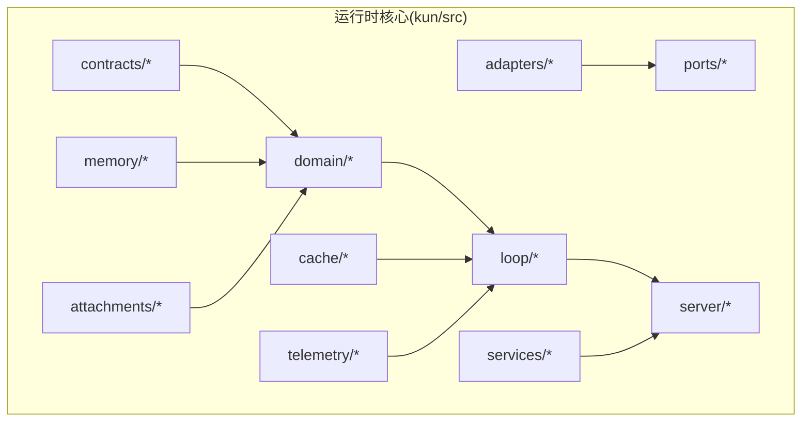
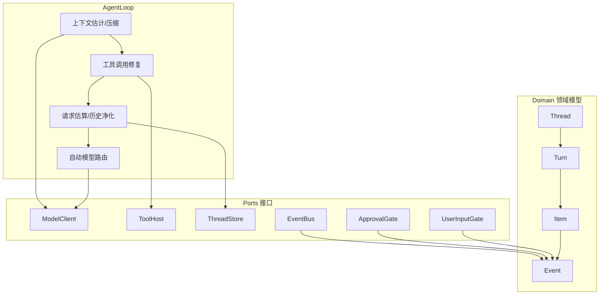
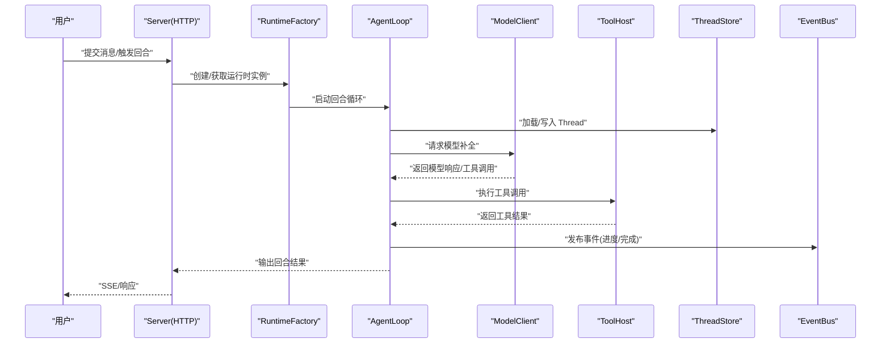
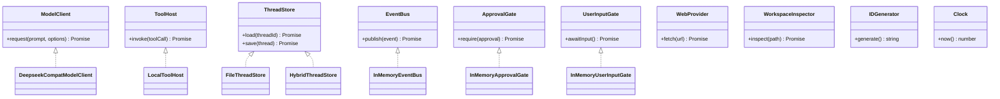
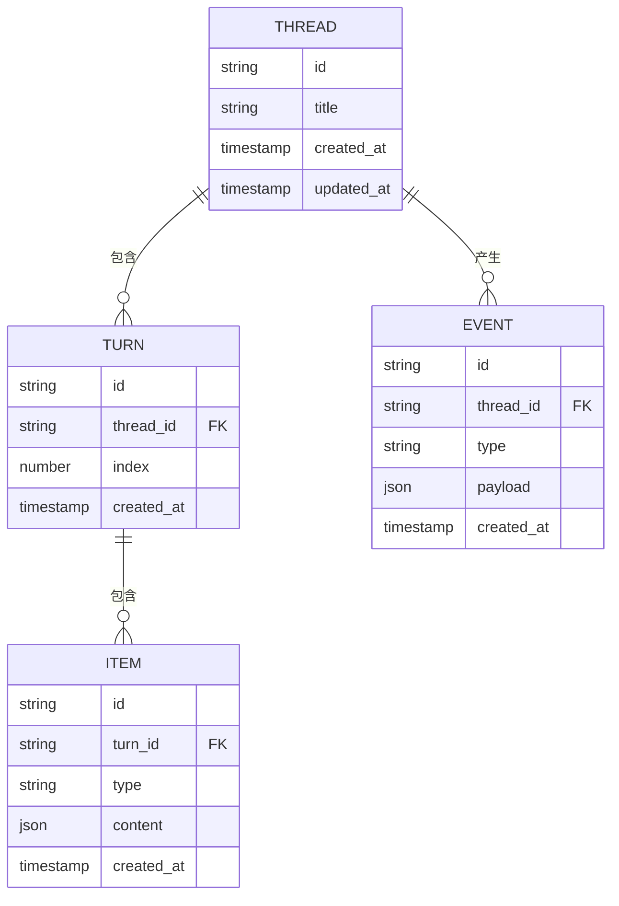
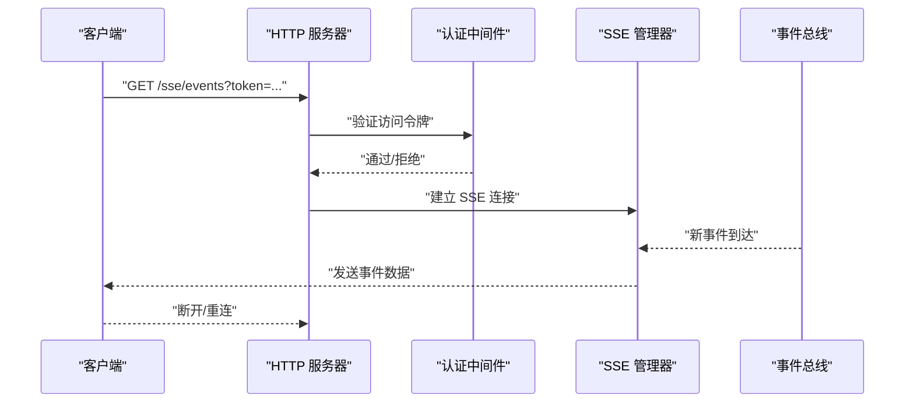
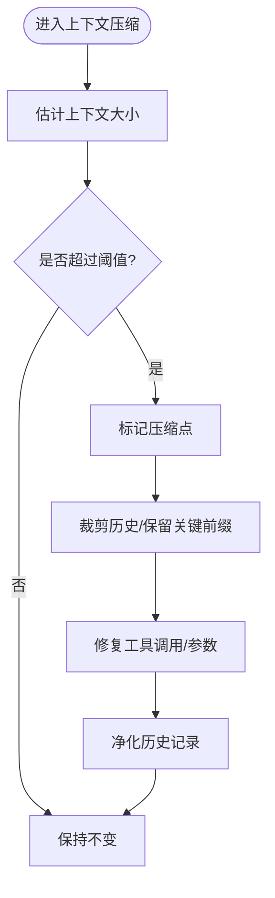
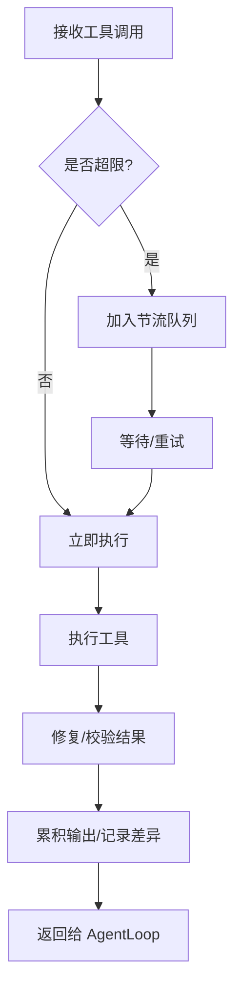
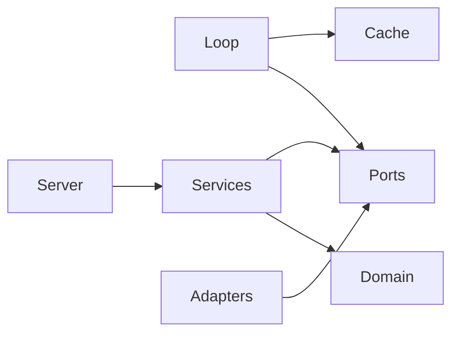

# 运行时核心层（Kun 运行时）

<cite>
**本文引用的文件**
- [kun/src/index.ts](file://kun/src/index.ts)
- [kun/src/loop/agent-loop.ts](file://kun/src/loop/agent-loop.ts)
- [kun/src/ports/model-client.ts](file://kun/src/ports/model-client.ts)
- [kun/src/ports/tool-host.ts](file://kun/src/ports/tool-host.ts)
- [kun/src/ports/thread-store.ts](file://kun/src/ports/thread-store.ts)
- [kun/src/domain/thread.ts](file://kun/src/domain/thread.ts)
- [kun/src/domain/turn.ts](file://kun/src/domain/turn.ts)
- [kun/src/domain/item.ts](file://kun/src/domain/item.ts)
- [kun/src/domain/event.ts](file://kun/src/domain/event.ts)
- [kun/src/server/http-server.ts](file://kun/src/server/http-server.ts)
- [kun/src/server/sse.ts](file://kun/src/server/sse.ts)
- [kun/src/server/routes/index.ts](file://kun/src/server/routes/index.ts)
- [kun/src/server/auth.ts](file://kun/src/server/auth.ts)
- [kun/src/cache/lru-cache.ts](file://kun/src/cache/lru-cache.ts)
- [kun/src/cache/ttl-lru-cache.ts](file://kun/src/cache/ttl-lru-cache.ts)
- [kun/src/loop/context-compactor.ts](file://kun/src/loop/context-compactor.ts)
- [kun/src/loop/history-healing.ts](file://kun/src/loop/history-healing.ts)
- [kun/src/loop/tool-call-repair.ts](file://kun/src/loop/tool-call-repair.ts)
- [kun/src/loop/tool-storm-breaker.ts](file://kun/src/loop/tool-storm-breaker.ts)
- [kun/src/loop/token-economy.ts](file://kun/src/loop/token-economy.ts)
- [kun/src/loop/auto-model-router.ts](file://kun/src/loop/auto-model-router.ts)
- [kun/src/loop/inflight-tracker.ts](file://kun/src/loop/inflight-tracker.ts)
- [kun/src/loop/request-history-hygiene.ts](file://kun/src/loop/request-history-hygiene.ts)
- [kun/src/loop/steering-queue.ts](file://kun/src/loop/steering-queue.ts)
- [kun/src/loop/model-context-profile.ts](file://kun/src/loop/model-context-profile.ts)
- [kun/src/loop/model-request-estimator.ts](file://kun/src/loop/model-request-estimator.ts)
- [kun/src/loop/context-estimator.ts](file://kun/src/loop/context-estimator.ts)
- [kun/src/loop/compaction-marker.ts](file://kun/src/loop/compaction-marker.ts)
- [kun/src/loop/append-only-session-log.ts](file://kun/src/loop/append-only-session-log.ts)
- [kun/src/loop/tool-storm-breaker.ts](file://kun/src/loop/tool-storm-breaker.ts)
- [kun/src/ports/event-bus.ts](file://kun/src/ports/event-bus.ts)
- [kun/src/ports/approval-gate.ts](file://kun/src/ports/approval-gate.ts)
- [kun/src/ports/user-input-gate.ts](file://kun/src/ports/user-input-gate.ts)
- [kun/src/ports/workspace-inspector.ts](file://kun/src/ports/workspace-inspector.ts)
- [kun/src/ports/web-provider.ts](file://kun/src/ports/web-provider.ts)
- [kun/src/ports/id-generator.ts](file://kun/src/ports/id-generator.ts)
- [kun/src/ports/clock.ts](file://kun/src/ports/clock.ts)
- [kun/src/ports/session-store.ts](file://kun/src/ports/session-store.ts)
- [kun/src/services/thread-service.ts](file://kun/src/services/thread-service.ts)
- [kun/src/services/turn-service.ts](file://kun/src/services/turn-service.ts)
- [kun/src/services/usage-service.ts](file://kun/src/services/usage-service.ts)
- [kun/src/delegation/delegation-runtime.ts](file://kun/src/delegation/delegation-runtime.ts)
- [kun/src/delegation/child-agent-executor.ts](file://kun/src/delegation/child-agent-executor.ts)
- [kun/src/adapters/model/deepseek-compat-model-client.ts](file://kun/src/adapters/model/deepseek-compat-model-client.ts)
- [kun/src/adapters/tool/local-tool-host.ts](file://kun/src/adapters/tool/local-tool-host.ts)
- [kun/src/adapters/file/file-thread-store.ts](file://kun/src/adapters/file/file-thread-store.ts)
- [kun/src/adapters/file/file-session-store.ts](file://kun/src/adapters/file/file-session-store.ts)
- [kun/src/adapters/hybrid/hybrid-thread-store.ts](file://kun/src/adapters/hybrid/hybrid-thread-store.ts)
- [kun/src/adapters/hybrid/hybrid-session-store.ts](file://kun/src/adapters/hybrid/hybrid-session-store.ts)
- [kun/src/adapters/in-memory-thread-store.ts](file://kun/src/adapters/in-memory-thread-store.ts)
- [kun/src/adapters/in-memory-session-store.ts](file://kun/src/adapters/in-memory-session-store.ts)
- [kun/src/adapters/in-memory-event-bus.ts](file://kun/src/adapters/in-memory-event-bus.ts)
- [kun/src/adapters/in-memory-approval-gate.ts](file://kun/src/adapters/in-memory-approval-gate.ts)
- [kun/src/adapters/in-memory-user-input-gate.ts](file://kun/src/adapters/in-memory-user-input-gate.ts)
- [kun/src/config/kun-config.ts](file://kun/src/config/kun-config.ts)
- [kun/src/contracts/threads.ts](file://kun/src/contracts/threads.ts)
- [kun/src/contracts/turns.ts](file://kun/src/contracts/turns.ts)
- [kun/src/contracts/items.ts](file://kun/src/contracts/items.ts)
- [kun/src/contracts/events.ts](file://kun/src/contracts/events.ts)
- [kun/src/contracts/runtime-info.ts](file://kun/src/contracts/runtime-info.ts)
- [kun/src/contracts/usage.ts](file://kun/src/contracts/usage.ts)
- [kun/src/telemetry/usage-counter.ts](file://kun/src/telemetry/usage-counter.ts)
- [kun/src/telemetry/cache-telemetry.ts](file://kun/src/telemetry/cache-telemetry.ts)
- [kun/src/memory/memory-store.ts](file://kun/src/memory/memory-store.ts)
- [kun/src/attachments/attachment-store.ts](file://kun/src/attachments/attachment-store.ts)
- [kun/src/cli/serve.ts](file://kun/src/cli/serve.ts)
- [kun/src/cli/serve-entry.ts](file://kun/src/cli/serve-entry.ts)
- [kun/src/server/runtime-factory.ts](file://kun/src/server/runtime-factory.ts)
</cite>

## 目录
1. [引言](#引言)
2. [项目结构](#项目结构)
3. [核心组件](#核心组件)
4. [架构总览](#架构总览)
5. [详细组件分析](#详细组件分析)
6. [依赖关系分析](#依赖关系分析)
7. [性能考量](#性能考量)
8. [故障排查指南](#故障排查指南)
9. [结论](#结论)
10. [附录](#附录)

## 引言
本文件面向 DeepSeek GUI 的运行时核心层（Kun 运行时），系统性阐述其“单一智能体运行时”的设计理念与实现架构。重点覆盖以下方面：
- 智能体循环系统（AgentLoop）的执行流程、缓存机制、上下文压缩与工具调用管理
- 端口适配器模式：ModelClient、ToolHost、ThreadStore 等核心接口的设计与实现
- 领域模型：Thread、Turn、Item、Event 的关系与生命周期
- HTTP 服务器与 SSE 推送：路由设计、认证机制与事件流管理
- 使用示例与扩展指南，帮助开发者快速理解并定制运行时

## 项目结构
Kun 运行时位于独立的包内，采用分层与模块化组织方式：
- adapters：适配器层，提供具体实现（文件存储、内存存储、本地工具宿主、兼容模型客户端等）
- cache：缓存策略与实现（LRU、TTL-LRU、不可变前缀等）
- contracts：对外契约与数据模型定义
- domain：领域模型与事件聚合
- loop：智能体循环与上下文管理
- ports：端口接口定义（抽象能力边界）
- server：HTTP 服务、路由、SSE、认证
- services：业务服务（线程、回合、用量统计等）
- telemetry：遥测与计数
- 其他：配置、CLI、内存存储、附件、工具注册等

**章节来源**
- [kun/src/index.ts](file://kun/src/index.ts)
- [kun/src/ports/index.ts](file://kun/src/ports/index.ts)
- [kun/src/adapters/index.ts](file://kun/src/adapters/index.ts)

## 核心组件
- AgentLoop：智能体循环核心，负责回合推进、上下文压缩、工具调用、请求估算与历史净化
- 端口接口（Ports）：以抽象接口定义能力边界，便于替换不同实现（如内存、文件、Hybrid）
- 领域模型（Domain）：Thread/Turn/Item/Event 聚合，承载对话与任务状态
- 服务层（Services）：线程、回合、用量等业务服务
- 缓存层（Cache）：提升上下文压缩与工具调用的性能
- 服务器（Server）：HTTP 路由、认证、SSE 事件推送
- 遥测（Telemetry）：用量计数与缓存统计

**章节来源**
- [kun/src/loop/agent-loop.ts](file://kun/src/loop/agent-loop.ts)
- [kun/src/ports/model-client.ts](file://kun/src/ports/model-client.ts)
- [kun/src/ports/tool-host.ts](file://kun/src/ports/tool-host.ts)
- [kun/src/ports/thread-store.ts](file://kun/src/ports/thread-store.ts)
- [kun/src/domain/thread.ts](file://kun/src/domain/thread.ts)
- [kun/src/domain/turn.ts](file://kun/src/domain/turn.ts)
- [kun/src/domain/item.ts](file://kun/src/domain/item.ts)
- [kun/src/domain/event.ts](file://kun/src/domain/event.ts)
- [kun/src/server/http-server.ts](file://kun/src/server/http-server.ts)
- [kun/src/server/sse.ts](file://kun/src/server/sse.ts)
- [kun/src/services/thread-service.ts](file://kun/src/services/thread-service.ts)
- [kun/src/services/turn-service.ts](file://kun/src/services/turn-service.ts)
- [kun/src/services/usage-service.ts](file://kun/src/services/usage-service.ts)
- [kun/src/cache/lru-cache.ts](file://kun/src/cache/lru-cache.ts)
- [kun/src/cache/ttl-lru-cache.ts](file://kun/src/cache/ttl-lru-cache.ts)
- [kun/src/telemetry/usage-counter.ts](file://kun/src/telemetry/usage-counter.ts)
- [kun/src/telemetry/cache-telemetry.ts](file://kun/src/telemetry/cache-telemetry.ts)

## 架构总览
Kun 运行时采用“端口适配器”模式，将业务逻辑与外部依赖解耦。核心交互如下：
- AgentLoop 通过 Ports 接口与外部系统交互（模型、工具、存储、事件总线等）
- Domain 层维护 Thread/Turn/Item/Event 的聚合状态
- Loop 层负责上下文压缩、工具调用修复、请求估算与历史净化
- Server 层提供 HTTP API 与 SSE 事件推送
- Services 层封装业务操作（线程、回合、用量）

**图示来源**
- [kun/src/loop/agent-loop.ts](file://kun/src/loop/agent-loop.ts)
- [kun/src/ports/model-client.ts](file://kun/src/ports/model-client.ts)
- [kun/src/ports/tool-host.ts](file://kun/src/ports/tool-host.ts)
- [kun/src/ports/thread-store.ts](file://kun/src/ports/thread-store.ts)
- [kun/src/ports/event-bus.ts](file://kun/src/ports/event-bus.ts)
- [kun/src/ports/approval-gate.ts](file://kun/src/ports/approval-gate.ts)
- [kun/src/ports/user-input-gate.ts](file://kun/src/ports/user-input-gate.ts)
- [kun/src/domain/thread.ts](file://kun/src/domain/thread.ts)
- [kun/src/domain/turn.ts](file://kun/src/domain/turn.ts)
- [kun/src/domain/item.ts](file://kun/src/domain/item.ts)
- [kun/src/domain/event.ts](file://kun/src/domain/event.ts)

## 详细组件分析

### AgentLoop 执行流程与优化
AgentLoop 是运行时的心脏，负责从输入到输出的完整闭环。其关键流程包括：
- 上下文估计与压缩：根据模型上下文限制动态裁剪历史，避免超出阈值
- 工具调用修复：对模型生成的工具调用进行参数修复与重试控制
- 请求估算与历史净化：预估 Token 消耗，清理冗余或无效的历史记录
- 自动模型路由：依据上下文与成本选择最优模型
- 飞行中跟踪与节流：避免并发风暴与资源争用

**图示来源**
- [kun/src/server/http-server.ts](file://kun/src/server/http-server.ts)
- [kun/src/server/runtime-factory.ts](file://kun/src/server/runtime-factory.ts)
- [kun/src/loop/agent-loop.ts](file://kun/src/loop/agent-loop.ts)
- [kun/src/ports/model-client.ts](file://kun/src/ports/model-client.ts)
- [kun/src/ports/tool-host.ts](file://kun/src/ports/tool-host.ts)
- [kun/src/ports/thread-store.ts](file://kun/src/ports/thread-store.ts)
- [kun/src/ports/event-bus.ts](file://kun/src/ports/event-bus.ts)

**章节来源**
- [kun/src/loop/agent-loop.ts](file://kun/src/loop/agent-loop.ts)
- [kun/src/loop/context-compactor.ts](file://kun/src/loop/context-compactor.ts)
- [kun/src/loop/tool-call-repair.ts](file://kun/src/loop/tool-call-repair.ts)
- [kun/src/loop/tool-storm-breaker.ts](file://kun/src/loop/tool-storm-breaker.ts)
- [kun/src/loop/token-economy.ts](file://kun/src/loop/token-economy.ts)
- [kun/src/loop/auto-model-router.ts](file://kun/src/loop/auto-model-router.ts)
- [kun/src/loop/inflight-tracker.ts](file://kun/src/loop/inflight-tracker.ts)
- [kun/src/loop/request-history-hygiene.ts](file://kun/src/loop/request-history-hygiene.ts)
- [kun/src/loop/steering-queue.ts](file://kun/src/loop/steering-queue.ts)
- [kun/src/loop/model-context-profile.ts](file://kun/src/loop/model-context-profile.ts)
- [kun/src/loop/model-request-estimator.ts](file://kun/src/loop/model-request-estimator.ts)
- [kun/src/loop/context-estimator.ts](file://kun/src/loop/context-estimator.ts)
- [kun/src/loop/compaction-marker.ts](file://kun/src/loop/compaction-marker.ts)
- [kun/src/loop/append-only-session-log.ts](file://kun/src/loop/append-only-session-log.ts)

### 端口适配器模式：核心接口设计与实现
端口接口定义了运行时与外部系统的抽象边界，便于替换实现。关键接口与实现概览：
- ModelClient：模型请求抽象，兼容多种后端（DeepSeek 兼容客户端）
- ToolHost：工具执行抽象，支持本地工具与 MCP 工具
- ThreadStore：线程持久化抽象，支持文件与 Hybrid 实现
- EventBus：事件总线抽象，用于发布/订阅运行时事件
- ApprovalGate/UserInputGate：审批与用户输入门控抽象
- WebProvider/WorkspaceInspector：Web 与工作区检查抽象
- IDGenerator/Clock：标识与时间抽象

**图示来源**
- [kun/src/ports/model-client.ts](file://kun/src/ports/model-client.ts)
- [kun/src/ports/tool-host.ts](file://kun/src/ports/tool-host.ts)
- [kun/src/ports/thread-store.ts](file://kun/src/ports/thread-store.ts)
- [kun/src/ports/event-bus.ts](file://kun/src/ports/event-bus.ts)
- [kun/src/ports/approval-gate.ts](file://kun/src/ports/approval-gate.ts)
- [kun/src/ports/user-input-gate.ts](file://kun/src/ports/user-input-gate.ts)
- [kun/src/ports/web-provider.ts](file://kun/src/ports/web-provider.ts)
- [kun/src/ports/workspace-inspector.ts](file://kun/src/ports/workspace-inspector.ts)
- [kun/src/ports/id-generator.ts](file://kun/src/ports/id-generator.ts)
- [kun/src/ports/clock.ts](file://kun/src/ports/clock.ts)
- [kun/src/adapters/model/deepseek-compat-model-client.ts](file://kun/src/adapters/model/deepseek-compat-model-client.ts)
- [kun/src/adapters/tool/local-tool-host.ts](file://kun/src/adapters/tool/local-tool-host.ts)
- [kun/src/adapters/file/file-thread-store.ts](file://kun/src/adapters/file/file-thread-store.ts)
- [kun/src/adapters/hybrid/hybrid-thread-store.ts](file://kun/src/adapters/hybrid/hybrid-thread-store.ts)
- [kun/src/adapters/in-memory-event-bus.ts](file://kun/src/adapters/in-memory-event-bus.ts)
- [kun/src/adapters/in-memory-approval-gate.ts](file://kun/src/adapters/in-memory-approval-gate.ts)
- [kun/src/adapters/in-memory-user-input-gate.ts](file://kun/src/adapters/in-memory-user-input-gate.ts)

**章节来源**
- [kun/src/ports/model-client.ts](file://kun/src/ports/model-client.ts)
- [kun/src/ports/tool-host.ts](file://kun/src/ports/tool-host.ts)
- [kun/src/ports/thread-store.ts](file://kun/src/ports/thread-store.ts)
- [kun/src/ports/event-bus.ts](file://kun/src/ports/event-bus.ts)
- [kun/src/ports/approval-gate.ts](file://kun/src/ports/approval-gate.ts)
- [kun/src/ports/user-input-gate.ts](file://kun/src/ports/user-input-gate.ts)
- [kun/src/ports/web-provider.ts](file://kun/src/ports/web-provider.ts)
- [kun/src/ports/workspace-inspector.ts](file://kun/src/ports/workspace-inspector.ts)
- [kun/src/ports/id-generator.ts](file://kun/src/ports/id-generator.ts)
- [kun/src/ports/clock.ts](file://kun/src/ports/clock.ts)
- [kun/src/adapters/model/deepseek-compat-model-client.ts](file://kun/src/adapters/model/deepseek-compat-model-client.ts)
- [kun/src/adapters/tool/local-tool-host.ts](file://kun/src/adapters/tool/local-tool-host.ts)
- [kun/src/adapters/file/file-thread-store.ts](file://kun/src/adapters/file/file-thread-store.ts)
- [kun/src/adapters/hybrid/hybrid-thread-store.ts](file://kun/src/adapters/hybrid/hybrid-thread-store.ts)
- [kun/src/adapters/in-memory-event-bus.ts](file://kun/src/adapters/in-memory-event-bus.ts)
- [kun/src/adapters/in-memory-approval-gate.ts](file://kun/src/adapters/in-memory-approval-gate.ts)
- [kun/src/adapters/in-memory-user-input-gate.ts](file://kun/src/adapters/in-memory-user-input-gate.ts)

### 领域模型：Thread、Turn、Item、Event 的关系与生命周期
- Thread：一次或多轮对话的容器，包含多个 Turn
- Turn：单次回合，包含多个 Item
- Item：回合内的具体条目（文本、工具调用、工具结果等）
- Event：运行时事件（开始、进度、完成、错误等），用于驱动 UI 与审计

**图示来源**
- [kun/src/domain/thread.ts](file://kun/src/domain/thread.ts)
- [kun/src/domain/turn.ts](file://kun/src/domain/turn.ts)
- [kun/src/domain/item.ts](file://kun/src/domain/item.ts)
- [kun/src/domain/event.ts](file://kun/src/domain/event.ts)
- [kun/src/contracts/threads.ts](file://kun/src/contracts/threads.ts)
- [kun/src/contracts/turns.ts](file://kun/src/contracts/turns.ts)
- [kun/src/contracts/items.ts](file://kun/src/contracts/items.ts)
- [kun/src/contracts/events.ts](file://kun/src/contracts/events.ts)

**章节来源**
- [kun/src/domain/thread.ts](file://kun/src/domain/thread.ts)
- [kun/src/domain/turn.ts](file://kun/src/domain/turn.ts)
- [kun/src/domain/item.ts](file://kun/src/domain/item.ts)
- [kun/src/domain/event.ts](file://kun/src/domain/event.ts)
- [kun/src/contracts/threads.ts](file://kun/src/contracts/threads.ts)
- [kun/src/contracts/turns.ts](file://kun/src/contracts/turns.ts)
- [kun/src/contracts/items.ts](file://kun/src/contracts/items.ts)
- [kun/src/contracts/events.ts](file://kun/src/contracts/events.ts)

### HTTP 服务器与 SSE 推送
- 路由设计：按资源划分（threads、turns、events、sessions、usage、runtime-info 等）
- 认证机制：基于密钥或令牌的鉴权中间件
- SSE 事件推送：将运行时事件实时推送给客户端，支持断线重连与心跳

**图示来源**
- [kun/src/server/http-server.ts](file://kun/src/server/http-server.ts)
- [kun/src/server/sse.ts](file://kun/src/server/sse.ts)
- [kun/src/server/routes/index.ts](file://kun/src/server/routes/index.ts)
- [kun/src/server/auth.ts](file://kun/src/server/auth.ts)
- [kun/src/ports/event-bus.ts](file://kun/src/ports/event-bus.ts)

**章节来源**
- [kun/src/server/http-server.ts](file://kun/src/server/http-server.ts)
- [kun/src/server/sse.ts](file://kun/src/server/sse.ts)
- [kun/src/server/routes/index.ts](file://kun/src/server/routes/index.ts)
- [kun/src/server/auth.ts](file://kun/src/server/auth.ts)

### 缓存机制与上下文压缩
- LRU 缓存：通用键值缓存，适合短期热点数据
- TTL-LRU 缓存：带过期时间的缓存，适合会话与工具目录指纹
- 不可变前缀：在上下文压缩中保留关键前缀，确保语义一致性
- 压缩标记与历史修复：通过标记与修复算法减少上下文膨胀

**图示来源**
- [kun/src/cache/lru-cache.ts](file://kun/src/cache/lru-cache.ts)
- [kun/src/cache/ttl-lru-cache.ts](file://kun/src/cache/ttl-lru-cache.ts)
- [kun/src/loop/context-compactor.ts](file://kun/src/loop/context-compactor.ts)
- [kun/src/loop/compaction-marker.ts](file://kun/src/loop/compaction-marker.ts)
- [kun/src/loop/history-healing.ts](file://kun/src/loop/history-healing.ts)
- [kun/src/loop/tool-call-repair.ts](file://kun/src/loop/tool-call-repair.ts)

**章节来源**
- [kun/src/cache/lru-cache.ts](file://kun/src/cache/lru-cache.ts)
- [kun/src/cache/ttl-lru-cache.ts](file://kun/src/cache/ttl-lru-cache.ts)
- [kun/src/loop/context-compactor.ts](file://kun/src/loop/context-compactor.ts)
- [kun/src/loop/compaction-marker.ts](file://kun/src/loop/compaction-marker.ts)
- [kun/src/loop/history-healing.ts](file://kun/src/loop/history-healing.ts)
- [kun/src/loop/tool-call-repair.ts](file://kun/src/loop/tool-call-repair.ts)

### 工具调用管理与节流
- 工具风暴防护：限制并发工具调用，防止资源耗尽
- 调用修复：对模型生成的工具调用进行参数修复与重试
- 输出累积与差异处理：对文件/编辑类工具的结果进行累积与差异计算

**图示来源**
- [kun/src/loop/tool-storm-breaker.ts](file://kun/src/loop/tool-storm-breaker.ts)
- [kun/src/loop/tool-call-repair.ts](file://kun/src/loop/tool-call-repair.ts)
- [kun/src/ports/tool-host.ts](file://kun/src/ports/tool-host.ts)

**章节来源**
- [kun/src/loop/tool-storm-breaker.ts](file://kun/src/loop/tool-storm-breaker.ts)
- [kun/src/loop/tool-call-repair.ts](file://kun/src/loop/tool-call-repair.ts)
- [kun/src/ports/tool-host.ts](file://kun/src/ports/tool-host.ts)

### 服务层与用量统计
- 线程服务：线程的创建、查询、更新与归档
- 回合服务：回合的推进、合并与回滚
- 用量服务：Token 统计、成本估算与限额控制
- 遥测：用量计数与缓存命中率统计

**章节来源**
- [kun/src/services/thread-service.ts](file://kun/src/services/thread-service.ts)
- [kun/src/services/turn-service.ts](file://kun/src/services/turn-service.ts)
- [kun/src/services/usage-service.ts](file://kun/src/services/usage-service.ts)
- [kun/src/telemetry/usage-counter.ts](file://kun/src/telemetry/usage-counter.ts)
- [kun/src/telemetry/cache-telemetry.ts](file://kun/src/telemetry/cache-telemetry.ts)

### 配置与 CLI
- 配置：集中式配置加载与敏感信息脱敏
- CLI：服务启动入口，支持开发与生产环境

**章节来源**
- [kun/src/config/kun-config.ts](file://kun/src/config/kun-config.ts)
- [kun/src/cli/serve.ts](file://kun/src/cli/serve.ts)
- [kun/src/cli/serve-entry.ts](file://kun/src/cli/serve-entry.ts)

## 依赖关系分析
- 循环层（Loop）依赖端口接口（Ports）与缓存（Cache）
- 服务层（Services）依赖领域模型（Domain）与端口接口
- 服务器（Server）依赖服务层与认证模块
- 适配器（Adapters）实现端口接口，提供具体能力

**图示来源**
- [kun/src/loop/agent-loop.ts](file://kun/src/loop/agent-loop.ts)
- [kun/src/ports/index.ts](file://kun/src/ports/index.ts)
- [kun/src/cache/lru-cache.ts](file://kun/src/cache/lru-cache.ts)
- [kun/src/services/thread-service.ts](file://kun/src/services/thread-service.ts)
- [kun/src/services/turn-service.ts](file://kun/src/services/turn-service.ts)
- [kun/src/services/usage-service.ts](file://kun/src/services/usage-service.ts)
- [kun/src/server/http-server.ts](file://kun/src/server/http-server.ts)
- [kun/src/adapters/index.ts](file://kun/src/adapters/index.ts)

**章节来源**
- [kun/src/loop/agent-loop.ts](file://kun/src/loop/agent-loop.ts)
- [kun/src/ports/index.ts](file://kun/src/ports/index.ts)
- [kun/src/adapters/index.ts](file://kun/src/adapters/index.ts)

## 性能考量
- 上下文压缩与历史净化：降低 Token 消耗，提升吞吐
- 缓存策略：LRU/TTL-LRU 提升热点数据访问速度
- 工具风暴防护：避免并发风暴导致的资源争用
- 自动模型路由：按成本与质量选择最优模型
- SSE 事件流：增量推送，减少轮询开销

## 故障排查指南
- 认证失败：检查令牌与密钥配置
- SSE 断连：确认网络与心跳设置
- 工具调用异常：查看工具修复与节流日志
- 上下文溢出：调整压缩阈值与前缀保留策略
- 用量异常：核对用量计数与缓存命中统计

**章节来源**
- [kun/src/server/auth.ts](file://kun/src/server/auth.ts)
- [kun/src/server/sse.ts](file://kun/src/server/sse.ts)
- [kun/src/loop/tool-call-repair.ts](file://kun/src/loop/tool-call-repair.ts)
- [kun/src/loop/tool-storm-breaker.ts](file://kun/src/loop/tool-storm-breaker.ts)
- [kun/src/telemetry/usage-counter.ts](file://kun/src/telemetry/usage-counter.ts)
- [kun/src/telemetry/cache-telemetry.ts](file://kun/src/telemetry/cache-telemetry.ts)

## 结论
Kun 运行时通过“单一智能体运行时”的设计，将复杂的对话与工具调用流程抽象为清晰的循环与端口接口，配合完善的缓存、上下文压缩与事件推送机制，实现了高性能、可观测且易扩展的运行时内核。开发者可通过替换适配器与扩展工具集，快速定制符合场景的运行时行为。

## 附录
- 使用示例与扩展指南（建议）
  - 替换模型客户端：实现 ModelClient 接口，接入新的推理后端
  - 扩展工具集：实现 ToolHost 接口，注册自定义工具
  - 自定义存储：实现 ThreadStore 接口，切换持久化方案
  - 定制认证：实现认证中间件，适配企业级鉴权
  - 事件订阅：通过 EventBus 订阅运行时事件，驱动前端或审计系统