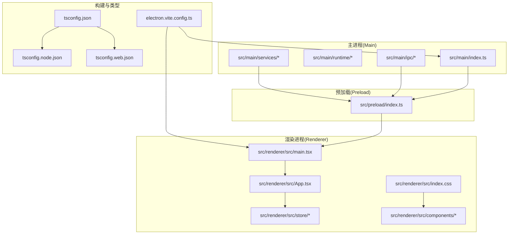
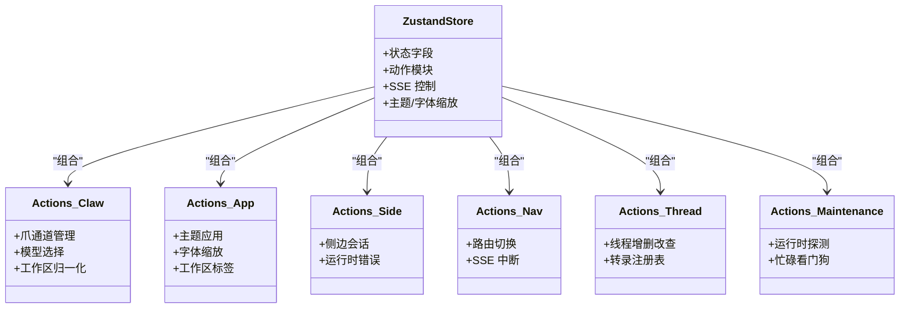
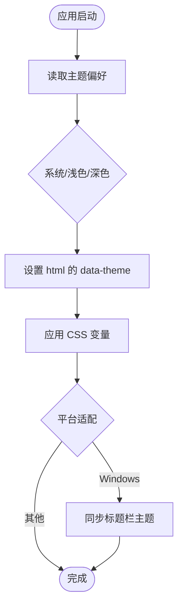
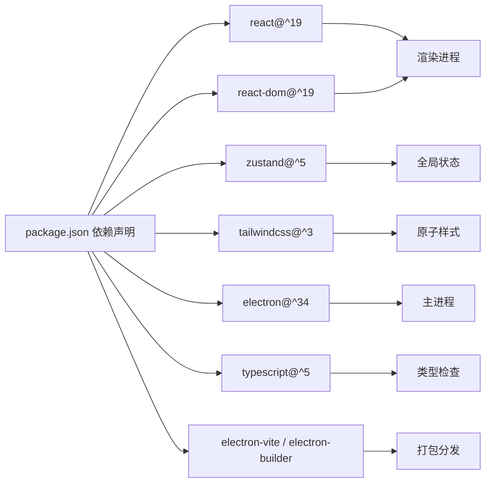

# 技术选型

<cite>
**本文引用的文件**
- [package.json](file://package.json)
- [electron.vite.config.ts](file://electron.vite.config.ts)
- [tailwind.config.js](file://tailwind.config.js)
- [tsconfig.json](file://tsconfig.json)
- [tsconfig.node.json](file://tsconfig.node.json)
- [tsconfig.web.json](file://tsconfig.web.json)
- [src/renderer/src/main.tsx](file://src/renderer/src/main.tsx)
- [src/renderer/src/App.tsx](file://src/renderer/src/App.tsx)
- [src/renderer/src/store/chat-store.ts](file://src/renderer/src/store/chat-store.ts)
- [src/renderer/src/lib/apply-theme.ts](file://src/renderer/src/lib/apply-theme.ts)
- [src/renderer/src/index.css](file://src/renderer/src/index.css)
- [src/preload/index.ts](file://src/preload/index.ts)
- [DESIGN.md](file://DESIGN.md)
- [DESIGN.zh-CN.md](file://DESIGN.zh-CN.md)
</cite>

## 目录
1. [引言](#引言)
2. [项目结构](#项目结构)
3. [核心组件](#核心组件)
4. [架构总览](#架构总览)
5. [详细组件分析](#详细组件分析)
6. [依赖关系分析](#依赖关系分析)
7. [性能考量](#性能考量)
8. [故障排查指南](#故障排查指南)
9. [结论](#结论)
10. [附录](#附录)

## 引言
本文件系统化阐述 DeepSeek GUI 的技术栈选型与实现方式，重点覆盖以下核心技术与框架：
- 桌面应用框架：Electron（主进程、预加载、渲染进程职责分离）
- 用户界面库：React 19（函数式组件、Suspense、严格模式）
- 状态管理：Zustand 5（轻量、可组合的全局状态）
- 样式系统：TailwindCSS 3（原子类、主题变量、暗色模式）
- 类型系统：TypeScript（分层 tsconfig、路径别名、严格类型）

文档将从架构视角解释各技术选型的优势与适用场景，并结合仓库中的实际配置与代码片段，说明技术栈如何支撑项目的架构需求，同时给出版本信息、兼容性与性能考量建议。

## 项目结构
DeepSeek GUI 采用 Electron + Vite 的现代桌面应用工程结构，区分主进程、预加载与渲染进程三部分，配合 TypeScript 分层编译与 TailwindCSS 原子样式体系，形成清晰的职责边界与开发体验。



图示来源
- [electron.vite.config.ts:1-38](file://electron.vite.config.ts#L1-L38)
- [tsconfig.json:1-5](file://tsconfig.json#L1-L5)
- [tsconfig.node.json:1-13](file://tsconfig.node.json#L1-L13)
- [tsconfig.web.json:1-21](file://tsconfig.web.json#L1-L21)
- [src/renderer/src/main.tsx:1-18](file://src/renderer/src/main.tsx#L1-L18)
- [src/renderer/src/App.tsx:1-23](file://src/renderer/src/App.tsx#L1-L23)
- [src/preload/index.ts:141-169](file://src/preload/index.ts#L141-L169)

章节来源
- [DESIGN.md:889-901](file://DESIGN.md#L889-L901)
- [DESIGN.zh-CN.md:889-901](file://DESIGN.zh-CN.md#L889-L901)

## 核心组件
本节聚焦四大技术栈的关键实现点与配置，解释其在项目中的落地方式与优势。

- Electron（桌面应用框架）
  - 主进程负责运行后端服务、IPC、更新器、日志等；预加载通过 contextBridge 暴露受控 API；渲染进程承载 React 应用。
  - 配置要点：electron-vite 定义主/预加载/渲染三入口，路径别名与插件体系明确。
  - 参考路径：[electron.vite.config.ts:1-38](file://electron.vite.config.ts#L1-L38)，[src/preload/index.ts:141-169](file://src/preload/index.ts#L141-L169)

- React 19（用户界面库）
  - 使用 StrictMode、Suspense 懒加载 AppShell，提升启动体验与错误边界表现。
  - 参考路径：[src/renderer/src/main.tsx:1-18](file://src/renderer/src/main.tsx#L1-L18)，[src/renderer/src/App.tsx:1-23](file://src/renderer/src/App.tsx#L1-L23)

- Zustand 5（状态管理）
  - 全局聊天状态集中在一个 store 中，按功能拆分 actions 模块化组合，支持 SSE 流式处理与运行时交互。
  - 参考路径：[src/renderer/src/store/chat-store.ts:1-211](file://src/renderer/src/store/chat-store.ts#L1-L211)

- TailwindCSS 3（样式系统）
  - 通过 CSS 变量桥接设计令牌，支持暗色模式与主题切换；content 覆盖渲染侧组件与第三方包。
  - 参考路径：[tailwind.config.js:1-70](file://tailwind.config.js#L1-L70)，[src/renderer/src/index.css:1-5](file://src/renderer/src/index.css#L1-L5)，[src/renderer/src/lib/apply-theme.ts:1-54](file://src/renderer/src/lib/apply-theme.ts#L1-L54)

- TypeScript（类型系统）
  - 分层 tsconfig：node 与 web 分离，严格类型检查，路径别名统一，确保主/预加载/渲染三进程类型安全。
  - 参考路径：[tsconfig.json:1-5](file://tsconfig.json#L1-L5)，[tsconfig.node.json:1-13](file://tsconfig.node.json#L1-L13)，[tsconfig.web.json:1-21](file://tsconfig.web.json#L1-L21)

章节来源
- [electron.vite.config.ts:1-38](file://electron.vite.config.ts#L1-L38)
- [src/renderer/src/main.tsx:1-18](file://src/renderer/src/main.tsx#L1-L18)
- [src/renderer/src/App.tsx:1-23](file://src/renderer/src/App.tsx#L1-L23)
- [src/renderer/src/store/chat-store.ts:1-211](file://src/renderer/src/store/chat-store.ts#L1-L211)
- [tailwind.config.js:1-70](file://tailwind.config.js#L1-L70)
- [src/renderer/src/index.css:1-5](file://src/renderer/src/index.css#L1-L5)
- [src/renderer/src/lib/apply-theme.ts:1-54](file://src/renderer/src/lib/apply-theme.ts#L1-L54)
- [tsconfig.json:1-5](file://tsconfig.json#L1-L5)
- [tsconfig.node.json:1-13](file://tsconfig.node.json#L1-L13)
- [tsconfig.web.json:1-21](file://tsconfig.web.json#L1-L21)

## 架构总览
下图展示 Electron 进程模型与前端技术栈的协作关系，以及 TailwindCSS 主题与 Zustand 状态流的交互。

```mermaid
graph TB
subgraph "Electron 进程"
Main["主进程<br/>Node 运行时"]
Preload["预加载脚本<br/>contextBridge 暴露 API"]
Renderer["渲染进程<br/>Chromium"]
end
subgraph "前端技术栈"
React["React 19<br/>函数组件/Suspense"]
Zustand["Zustand 5<br/>全局状态"]
Tailwind["TailwindCSS 3<br/>原子类/主题变量"]
TS["TypeScript<br/>分层编译/严格类型"]
end
subgraph "外部依赖"
IPC["IPC 通道"]
SSE["SSE 流式事件"]
Theme["主题/字体缩放"]
end
Main <- --> IPC
Preload <- --> IPC
Renderer --> React
React --> Zustand
React --> Tailwind
Zustand --> SSE
Tailwind --> Theme
TS --> React
TS --> Zustand
TS --> Tailwind
```

图示来源
- [DESIGN.md:889-901](file://DESIGN.md#L889-L901)
- [src/preload/index.ts:141-169](file://src/preload/index.ts#L141-L169)
- [src/renderer/src/store/chat-store.ts:1-211](file://src/renderer/src/store/chat-store.ts#L1-L211)
- [src/renderer/src/lib/apply-theme.ts:1-54](file://src/renderer/src/lib/apply-theme.ts#L1-L54)
- [tailwind.config.js:1-70](file://tailwind.config.js#L1-L70)

## 详细组件分析

### Electron 进程与 IPC
- 主进程负责运行后端能力、管理子进程、处理更新与打包逻辑；预加载通过 contextBridge 暴露受控 API 给渲染进程；渲染进程承载 React 应用。
- 预加载导出的 dsGui API 包含命令执行、通知、日志、版本查询等方法，避免 Node 能力直接泄漏到渲染环境。
- 参考路径：[DESIGN.md:889-901](file://DESIGN.md#L889-L901)，[src/preload/index.ts:141-169](file://src/preload/index.ts#L141-L169)

章节来源
- [DESIGN.md:889-901](file://DESIGN.md#L889-L901)
- [DESIGN.zh-CN.md:889-901](file://DESIGN.zh-CN.md#L889-L901)
- [src/preload/index.ts:141-169](file://src/preload/index.ts#L141-L169)

### React 19 渲染与懒加载
- 渲染入口引入样式与国际化，根组件通过 Suspense 懒加载 AppShell，减少首屏负担。
- StrictMode 在开发阶段启用，有助于提前发现副作用问题。
- 参考路径：[src/renderer/src/main.tsx:1-18](file://src/renderer/src/main.tsx#L1-L18)，[src/renderer/src/App.tsx:1-23](file://src/renderer/src/App.tsx#L1-L23)

章节来源
- [src/renderer/src/main.tsx:1-18](file://src/renderer/src/main.tsx#L1-L18)
- [src/renderer/src/App.tsx:1-23](file://src/renderer/src/App.tsx#L1-L23)

### Zustand 5 全局状态
- chat-store 将状态与动作解耦，按功能拆分为爪类、应用、侧边、导航、线程、维护等动作模块，便于扩展与测试。
- 支持 SSE 流中断控制、转录模型加载、运行时错误格式化、主题与字体缩放应用等。
- 参考路径：[src/renderer/src/store/chat-store.ts:1-211](file://src/renderer/src/store/chat-store.ts#L1-L211)



图示来源
- [src/renderer/src/store/chat-store.ts:1-211](file://src/renderer/src/store/chat-store.ts#L1-L211)

章节来源
- [src/renderer/src/store/chat-store.ts:1-211](file://src/renderer/src/store/chat-store.ts#L1-L211)

### TailwindCSS 3 主题与暗色模式
- 通过 CSS 变量映射设计令牌，darkMode 使用 selector 方式绑定到 html 的 data-theme 属性，实现系统/浅色/深色三态切换。
- 内容扫描覆盖渲染入口 HTML、渲染侧源码与 streamdown 第三方包，保证原子类按需生成。
- 参考路径：[tailwind.config.js:1-70](file://tailwind.config.js#L1-L70)，[src/renderer/src/index.css:1-5](file://src/renderer/src/index.css#L1-L5)，[src/renderer/src/lib/apply-theme.ts:1-54](file://src/renderer/src/lib/apply-theme.ts#L1-L54)



图示来源
- [src/renderer/src/lib/apply-theme.ts:1-54](file://src/renderer/src/lib/apply-theme.ts#L1-L54)

章节来源
- [tailwind.config.js:1-70](file://tailwind.config.js#L1-L70)
- [src/renderer/src/index.css:1-5](file://src/renderer/src/index.css#L1-L5)
- [src/renderer/src/lib/apply-theme.ts:1-54](file://src/renderer/src/lib/apply-theme.ts#L1-L54)

### TypeScript 分层编译
- 根 tsconfig 引入 node 与 web 两个子配置，分别约束主/预加载与渲染进程的编译目标、模块解析与路径别名。
- web 配置启用 React JSX 与 Vite 类型，node 配置启用 Electron/Vite Node 类型，确保类型覆盖全链路。
- 参考路径：[tsconfig.json:1-5](file://tsconfig.json#L1-L5)，[tsconfig.node.json:1-13](file://tsconfig.node.json#L1-L13)，[tsconfig.web.json:1-21](file://tsconfig.web.json#L1-L21)

章节来源
- [tsconfig.json:1-5](file://tsconfig.json#L1-L5)
- [tsconfig.node.json:1-13](file://tsconfig.node.json#L1-L13)
- [tsconfig.web.json:1-21](file://tsconfig.web.json#L1-L21)

## 依赖关系分析
- 依赖声明集中在 package.json，包含 React 19、Zustand 5、TailwindCSS 3、Electron、TypeScript 等核心依赖。
- 开发依赖涵盖 ESLint、Vite、Tailwind、TypeScript 生态工具，构建脚本通过 electron-vite 与 electron-builder 协作。
- 参考路径：[package.json:1-93](file://package.json#L1-L93)，[electron.vite.config.ts:1-38](file://electron.vite.config.ts#L1-L38)



图示来源
- [package.json:1-93](file://package.json#L1-L93)
- [electron.vite.config.ts:1-38](file://electron.vite.config.ts#L1-L38)

章节来源
- [package.json:1-93](file://package.json#L1-L93)
- [electron.vite.config.ts:1-38](file://electron.vite.config.ts#L1-L38)

## 性能考量
- 渲染启动优化
  - 使用 Suspense 懒加载 AppShell，降低首屏渲染压力；结合延迟渲染钩子可进一步推迟非关键节点的挂载。
  - 参考路径：[src/renderer/src/App.tsx:1-23](file://src/renderer/src/App.tsx#L1-L23)，[src/renderer/src/hooks/use-deferred-render.ts](file://src/renderer/src/hooks/use-deferred-render.ts)

- 状态与流式处理
  - Zustand 动作模块化拆分，避免单点臃肿；SSE 中断控制器与轮询调度器配合，保障长连接稳定性与资源回收。
  - 参考路径：[src/renderer/src/store/chat-store.ts:1-211](file://src/renderer/src/store/chat-store.ts#L1-L211)

- 样式体积控制
  - Tailwind 内容扫描精确覆盖渲染侧与必要第三方包，避免无用类进入产物；CSS 变量集中管理主题令牌，减少重复计算。
  - 参考路径：[tailwind.config.js:1-70](file://tailwind.config.js#L1-L70)，[src/renderer/src/index.css:1-5](file://src/renderer/src/index.css#L1-L5)

- 构建与打包
  - electron-vite 提供快速热更新与多入口构建；生产构建结合 electron-builder 实现跨平台分发。
  - 参考路径：[electron.vite.config.ts:1-38](file://electron.vite.config.ts#L1-L38)，[package.json:7-34](file://package.json#L7-L34)

## 故障排查指南
- 主进程与渲染进程通信异常
  - 检查预加载是否正确暴露 dsGui API，确认 IPC 通道名称与参数类型一致。
  - 参考路径：[src/preload/index.ts:141-169](file://src/preload/index.ts#L141-L169)

- 样式未生效或暗色模式不切换
  - 确认 html 的 data-theme 是否被设置，Tailwind CSS 变量是否注入，内容扫描路径是否覆盖到目标组件。
  - 参考路径：[src/renderer/src/lib/apply-theme.ts:1-54](file://src/renderer/src/lib/apply-theme.ts#L1-L54)，[tailwind.config.js:1-70](file://tailwind.config.js#L1-L70)，[src/renderer/src/index.css:1-5](file://src/renderer/src/index.css#L1-L5)

- Zustand 状态未更新或动作未触发
  - 检查动作模块是否正确合并到 store，状态字段命名与派发逻辑是否一致；关注 SSE 中断与轮询调度。
  - 参考路径：[src/renderer/src/store/chat-store.ts:1-211](file://src/renderer/src/store/chat-store.ts#L1-L211)

- TypeScript 编译报错
  - 对照 tsconfig.node.json 与 tsconfig.web.json 的 compilerOptions，确保模块解析、路径别名与 JSX 设置一致。
  - 参考路径：[tsconfig.node.json:1-13](file://tsconfig.node.json#L1-L13)，[tsconfig.web.json:1-21](file://tsconfig.web.json#L1-L21)

章节来源
- [src/preload/index.ts:141-169](file://src/preload/index.ts#L141-L169)
- [src/renderer/src/lib/apply-theme.ts:1-54](file://src/renderer/src/lib/apply-theme.ts#L1-L54)
- [tailwind.config.js:1-70](file://tailwind.config.js#L1-L70)
- [src/renderer/src/index.css:1-5](file://src/renderer/src/index.css#L1-L5)
- [src/renderer/src/store/chat-store.ts:1-211](file://src/renderer/src/store/chat-store.ts#L1-L211)
- [tsconfig.node.json:1-13](file://tsconfig.node.json#L1-L13)
- [tsconfig.web.json:1-21](file://tsconfig.web.json#L1-L21)

## 结论
DeepSeek GUI 的技术栈以 Electron 为载体，结合 React 19 的现代开发范式、Zustand 5 的轻量状态管理、TailwindCSS 3 的原子样式体系与 TypeScript 的严格类型约束，形成了高内聚、低耦合且易于扩展的桌面应用架构。该组合在开发效率、运行性能与可维护性之间取得平衡，适合需要复杂 UI 与后端集成的桌面产品。

## 附录
- 版本与兼容性
  - Electron：^34（主进程运行时）
  - React 19：^19（渲染进程）
  - Zustand 5：^5（状态管理）
  - TailwindCSS 3：^3（样式系统）
  - TypeScript：^5（类型系统）
  - 参考路径：[package.json:36-84](file://package.json#L36-L84)

- 关键配置速览
  - electron-vite 多入口与路径别名：[electron.vite.config.ts:1-38](file://electron.vite.config.ts#L1-L38)
  - Tailwind 内容扫描与主题变量：[tailwind.config.js:1-70](file://tailwind.config.js#L1-L70)
  - 分层 tsconfig 与路径别名：[tsconfig.json:1-5](file://tsconfig.json#L1-L5)，[tsconfig.node.json:1-13](file://tsconfig.node.json#L1-L13)，[tsconfig.web.json:1-21](file://tsconfig.web.json#L1-L21)