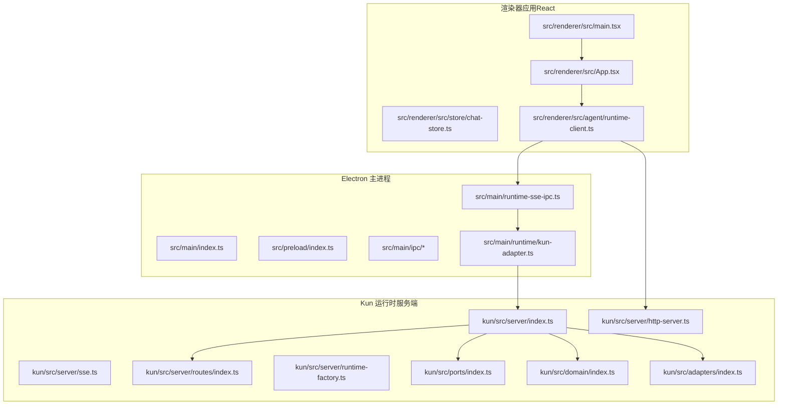
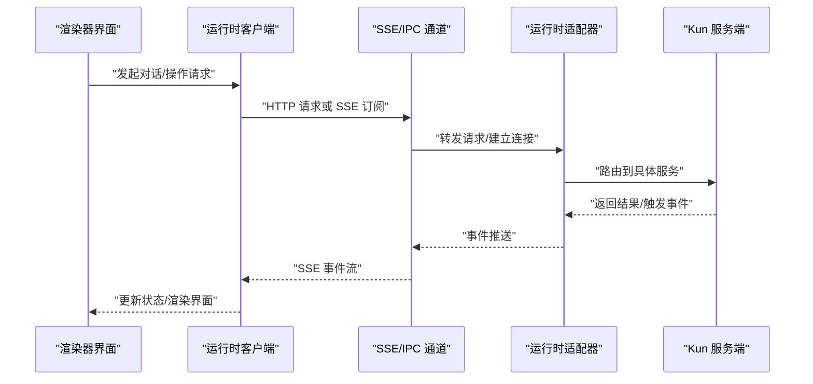
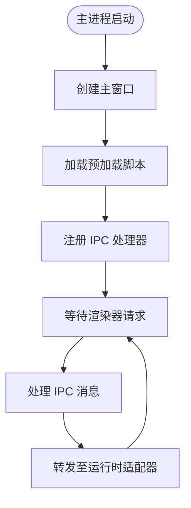
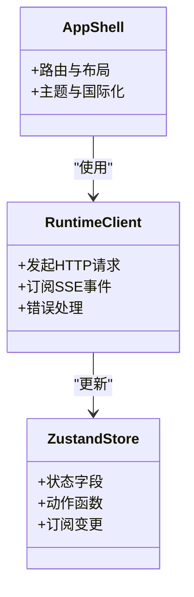
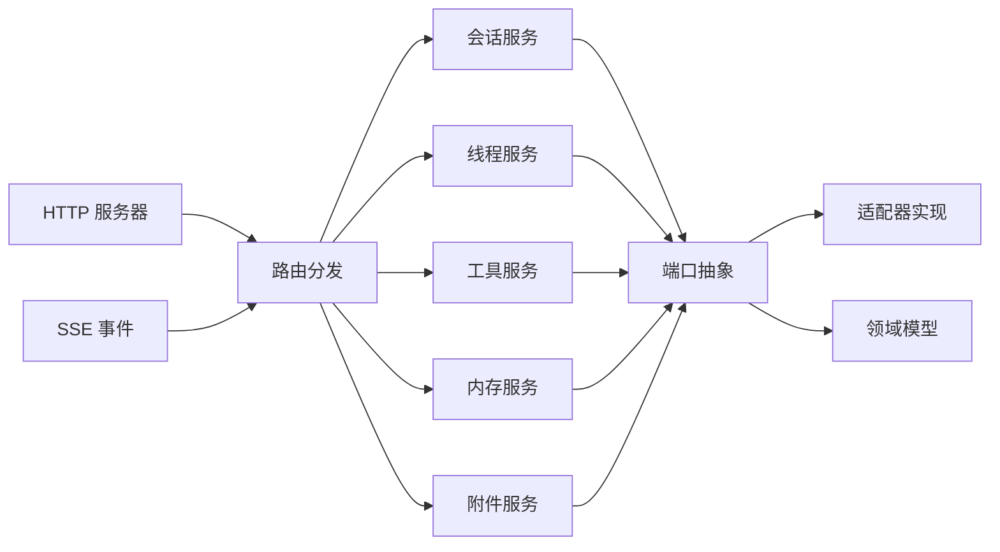
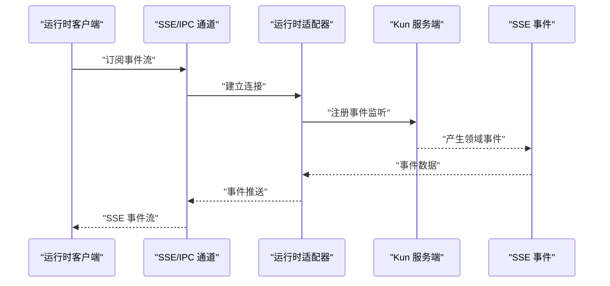
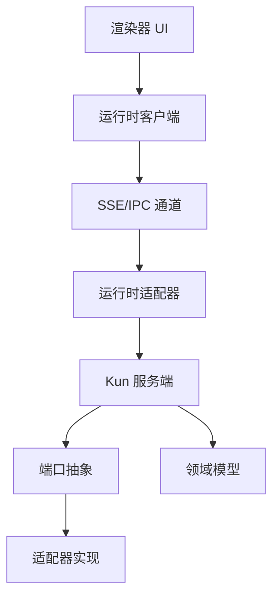

# 整体架构设计

<cite>
**本文引用的文件**
- [README.md](file://README.md)
- [DESIGN.md](file://DESIGN.md)
- [kun/README.md](file://kun/README.md)
- [src/main/index.ts](file://src/main/index.ts)
- [src/main/runtime/kun-adapter.ts](file://src/main/runtime/kun-adapter.ts)
- [src/main/runtime-sse-ipc.ts](file://src/main/runtime-sse-ipc.ts)
- [src/main/ipc/app-ipc-schemas.ts](file://src/main/ipc/app-ipc-schemas.ts)
- [src/main/ipc/register-app-ipc-handlers.ts](file://src/main/ipc/register-app-ipc-handlers.ts)
- [src/preload/index.ts](file://src/preload/index.ts)
- [src/renderer/src/main.tsx](file://src/renderer/src/main.tsx)
- [src/renderer/src/App.tsx](file://src/renderer/src/App.tsx)
- [src/renderer/src/agent/runtime-client.ts](file://src/renderer/src/agent/runtime-client.ts)
- [src/renderer/src/store/chat-store.ts](file://src/renderer/src/store/chat-store.ts)
- [kun/src/server/index.ts](file://kun/src/server/index.ts)
- [kun/src/server/http-server.ts](file://kun/src/server/http-server.ts)
- [kun/src/server/sse.ts](file://kun/src/server/sse.ts)
- [kun/src/server/routes/index.ts](file://kun/src/server/routes/index.ts)
- [kun/src/server/runtime-factory.ts](file://kun/src/server/runtime-factory.ts)
- [kun/src/ports/index.ts](file://kun/src/ports/index.ts)
- [kun/src/domain/index.ts](file://kun/src/domain/index.ts)
- [kun/src/adapters/index.ts](file://kun/src/adapters/index.ts)
- [kun/src/shared/gui-plan.ts](file://kun/src/shared/gui-plan.ts)
- [src/shared/ds-gui-api.ts](file://src/shared/ds-gui-api.ts)
- [src/shared/kun-endpoints.ts](file://src/shared/kun-endpoints.ts)
</cite>

## 目录
1. [引言](#引言)
2. [项目结构](#项目结构)
3. [核心组件](#核心组件)
4. [架构总览](#架构总览)
5. [详细组件分析](#详细组件分析)
6. [依赖关系分析](#依赖关系分析)
7. [性能考量](#性能考量)
8. [故障排查指南](#故障排查指南)
9. [结论](#结论)
10. [附录](#附录)

## 引言
本架构设计文档面向 DeepSeek GUI 的三层架构：Electron 主进程、React 渲染器应用、Kun 运行时核心。文档系统化阐述三层职责边界与交互机制，重点覆盖 HTTP/SSE 通信协议、IPC 通信、事件驱动架构，并总结“单一运行时边界、本地优先、可观测性、可控性”四大设计原则。同时介绍技术选型优势（TypeScript 类型安全、React 19 组件模型、Zustand 状态管理、TailwindCSS 设计系统），帮助开发者建立全局视角。

## 项目结构
DeepSeek GUI 采用主进程（Electron）+ 渲染器（React）+ Kun 运行时（服务端）的分层组织方式：
- Electron 主进程负责应用生命周期、窗口管理、与 Kun 运行时的 IPC/SSE 通信、系统集成（如更新、工作区访问）。
- React 渲染器负责用户界面、状态管理（Zustand）、与运行时客户端交互、国际化与主题等。
- Kun 运行时作为独立的服务端，提供 HTTP API 与 SSE 流式事件，承载会话、线程、工具调用、内存与缓存等核心域逻辑。

图表来源
- [src/main/index.ts:1-200](file://src/main/index.ts#L1-L200)
- [src/main/runtime/kun-adapter.ts:1-200](file://src/main/runtime/kun-adapter.ts#L1-L200)
- [src/main/runtime-sse-ipc.ts:1-200](file://src/main/runtime-sse-ipc.ts#L1-L200)
- [src/main/ipc/app-ipc-schemas.ts:1-200](file://src/main/ipc/app-ipc-schemas.ts#L1-L200)
- [src/renderer/src/main.tsx:1-120](file://src/renderer/src/main.tsx#L1-L120)
- [src/renderer/src/App.tsx:1-120](file://src/renderer/src/App.tsx#L1-L120)
- [src/renderer/src/agent/runtime-client.ts:1-200](file://src/renderer/src/agent/runtime-client.ts#L1-L200)
- [kun/src/server/index.ts:1-200](file://kun/src/server/index.ts#L1-L200)
- [kun/src/server/http-server.ts:1-200](file://kun/src/server/http-server.ts#L1-L200)
- [kun/src/server/sse.ts:1-200](file://kun/src/server/sse.ts#L1-L200)
- [kun/src/server/routes/index.ts:1-200](file://kun/src/server/routes/index.ts#L1-L200)
- [kun/src/server/runtime-factory.ts:1-200](file://kun/src/server/runtime-factory.ts#L1-L200)
- [kun/src/ports/index.ts:1-200](file://kun/src/ports/index.ts#L1-L200)
- [kun/src/domain/index.ts:1-200](file://kun/src/domain/index.ts#L1-L200)
- [kun/src/adapters/index.ts:1-200](file://kun/src/adapters/index.ts#L1-L200)

章节来源
- [src/main/index.ts:1-200](file://src/main/index.ts#L1-L200)
- [src/renderer/src/main.tsx:1-120](file://src/renderer/src/main.tsx#L1-L120)
- [kun/src/server/index.ts:1-200](file://kun/src/server/index.ts#L1-L200)

## 核心组件
- Electron 主进程入口与生命周期管理：负责窗口创建、菜单、热重载、打包后资源定位、系统级能力接入。
- 预加载脚本与安全上下文：在受控环境中暴露有限 API，实现主进程与渲染器的安全 IPC。
- IPC 通道与消息契约：定义应用级 IPC 消息格式与处理器注册，确保主进程与渲染器稳定通信。
- 运行时适配器与 SSE 通道：封装与 Kun 运行时的连接、事件订阅与请求转发。
- 渲染器应用与状态管理：基于 React 19 组件模型与 Zustand 状态管理，构建聊天、写作、计划等功能视图。
- Kun 运行时服务端：提供 HTTP API 与 SSE，路由到领域服务，通过端口抽象与适配器实现可插拔存储与工具。

章节来源
- [src/main/index.ts:1-200](file://src/main/index.ts#L1-L200)
- [src/preload/index.ts:1-200](file://src/preload/index.ts#L1-L200)
- [src/main/ipc/app-ipc-schemas.ts:1-200](file://src/main/ipc/app-ipc-schemas.ts#L1-L200)
- [src/main/ipc/register-app-ipc-handlers.ts:1-200](file://src/main/ipc/register-app-ipc-handlers.ts#L1-L200)
- [src/main/runtime-sse-ipc.ts:1-200](file://src/main/runtime-sse-ipc.ts#L1-L200)
- [src/main/runtime/kun-adapter.ts:1-200](file://src/main/runtime/kun-adapter.ts#L1-L200)
- [src/renderer/src/App.tsx:1-120](file://src/renderer/src/App.tsx#L1-L120)
- [src/renderer/src/store/chat-store.ts:1-200](file://src/renderer/src/store/chat-store.ts#L1-L200)
- [kun/src/server/index.ts:1-200](file://kun/src/server/index.ts#L1-L200)

## 架构总览
三层架构遵循“单一运行时边界”，即 Kun 运行时作为统一的业务边界，Electron 主进程负责系统集成与 IPC，渲染器负责用户交互与状态呈现。数据流以事件驱动为主，结合 HTTP 请求与 SSE 实时流，形成“请求-响应-事件”的混合通信模式。

图表来源
- [src/renderer/src/agent/runtime-client.ts:1-200](file://src/renderer/src/agent/runtime-client.ts#L1-L200)
- [src/main/runtime-sse-ipc.ts:1-200](file://src/main/runtime-sse-ipc.ts#L1-L200)
- [src/main/runtime/kun-adapter.ts:1-200](file://src/main/runtime/kun-adapter.ts#L1-L200)
- [kun/src/server/http-server.ts:1-200](file://kun/src/server/http-server.ts#L1-L200)
- [kun/src/server/sse.ts:1-200](file://kun/src/server/sse.ts#L1-L200)

## 详细组件分析

### Electron 主进程与预加载
- 主进程入口负责窗口初始化、菜单、托盘、自动更新、日志与健康检查等。
- 预加载脚本在受限上下文中暴露受控 API，避免直接注入全局对象，降低 XSS 风险。
- IPC 消息契约定义了请求/响应格式与处理器注册流程，保证主进程与渲染器的类型安全通信。

图表来源
- [src/main/index.ts:1-200](file://src/main/index.ts#L1-L200)
- [src/preload/index.ts:1-200](file://src/preload/index.ts#L1-L200)
- [src/main/ipc/app-ipc-schemas.ts:1-200](file://src/main/ipc/app-ipc-schemas.ts#L1-L200)
- [src/main/ipc/register-app-ipc-handlers.ts:1-200](file://src/main/ipc/register-app-ipc-handlers.ts#L1-L200)

章节来源
- [src/main/index.ts:1-200](file://src/main/index.ts#L1-L200)
- [src/preload/index.ts:1-200](file://src/preload/index.ts#L1-L200)
- [src/main/ipc/app-ipc-schemas.ts:1-200](file://src/main/ipc/app-ipc-schemas.ts#L1-L200)
- [src/main/ipc/register-app-ipc-handlers.ts:1-200](file://src/main/ipc/register-app-ipc-handlers.ts#L1-L200)

### 渲染器应用与状态管理
- 渲染器入口负责挂载 React 应用与国际化配置。
- Zustand 状态管理用于会话、线程、侧边栏可见性、写入工作区等状态的集中维护。
- 运行时客户端封装 HTTP 与 SSE 调用，统一错误处理与事件订阅。

图表来源
- [src/renderer/src/App.tsx:1-120](file://src/renderer/src/App.tsx#L1-L120)
- [src/renderer/src/store/chat-store.ts:1-200](file://src/renderer/src/store/chat-store.ts#L1-L200)
- [src/renderer/src/agent/runtime-client.ts:1-200](file://src/renderer/src/agent/runtime-client.ts#L1-L200)

章节来源
- [src/renderer/src/main.tsx:1-120](file://src/renderer/src/main.tsx#L1-L120)
- [src/renderer/src/App.tsx:1-120](file://src/renderer/src/App.tsx#L1-L120)
- [src/renderer/src/store/chat-store.ts:1-200](file://src/renderer/src/store/chat-store.ts#L1-L200)
- [src/renderer/src/agent/runtime-client.ts:1-200](file://src/renderer/src/agent/runtime-client.ts#L1-L200)

### Kun 运行时核心
- 服务端入口聚合 HTTP 服务器、SSE 事件系统与路由分发。
- 路由模块将请求映射到会话、线程、工具、内存、附件等服务。
- 端口抽象与适配器实现可插拔的数据存储与外部能力接入。
- 领域模型定义会话、线程、回合、使用量等核心实体与关系。

图表来源
- [kun/src/server/index.ts:1-200](file://kun/src/server/index.ts#L1-L200)
- [kun/src/server/http-server.ts:1-200](file://kun/src/server/http-server.ts#L1-L200)
- [kun/src/server/sse.ts:1-200](file://kun/src/server/sse.ts#L1-L200)
- [kun/src/server/routes/index.ts:1-200](file://kun/src/server/routes/index.ts#L1-L200)
- [kun/src/ports/index.ts:1-200](file://kun/src/ports/index.ts#L1-L200)
- [kun/src/adapters/index.ts:1-200](file://kun/src/adapters/index.ts#L1-L200)
- [kun/src/domain/index.ts:1-200](file://kun/src/domain/index.ts#L1-L200)

章节来源
- [kun/src/server/index.ts:1-200](file://kun/src/server/index.ts#L1-L200)
- [kun/src/server/http-server.ts:1-200](file://kun/src/server/http-server.ts#L1-L200)
- [kun/src/server/sse.ts:1-200](file://kun/src/server/sse.ts#L1-L200)
- [kun/src/server/routes/index.ts:1-200](file://kun/src/server/routes/index.ts#L1-L200)
- [kun/src/ports/index.ts:1-200](file://kun/src/ports/index.ts#L1-L200)
- [kun/src/adapters/index.ts:1-200](file://kun/src/adapters/index.ts#L1-L200)
- [kun/src/domain/index.ts:1-200](file://kun/src/domain/index.ts#L1-L200)

### 通信协议与事件驱动
- HTTP 协议：渲染器通过运行时客户端发起 REST 请求，主进程转发至 Kun 服务端；服务端路由到相应领域服务并返回 JSON 响应。
- SSE 协议：渲染器订阅运行时事件流，主进程通过 SSE/IPC 通道将事件推送到渲染器，实现低延迟的实时交互。
- 事件驱动：Kun 服务端在业务过程中产生领域事件，经 SSE 推送至渲染器，驱动 UI 更新与用户反馈。

图表来源
- [src/renderer/src/agent/runtime-client.ts:1-200](file://src/renderer/src/agent/runtime-client.ts#L1-L200)
- [src/main/runtime-sse-ipc.ts:1-200](file://src/main/runtime-sse-ipc.ts#L1-L200)
- [src/main/runtime/kun-adapter.ts:1-200](file://src/main/runtime/kun-adapter.ts#L1-L200)
- [kun/src/server/sse.ts:1-200](file://kun/src/server/sse.ts#L1-L200)

章节来源
- [src/renderer/src/agent/runtime-client.ts:1-200](file://src/renderer/src/agent/runtime-client.ts#L1-L200)
- [src/main/runtime-sse-ipc.ts:1-200](file://src/main/runtime-sse-ipc.ts#L1-L200)
- [src/main/runtime/kun-adapter.ts:1-200](file://src/main/runtime/kun-adapter.ts#L1-L200)
- [kun/src/server/sse.ts:1-200](file://kun/src/server/sse.ts#L1-L200)

## 依赖关系分析
- 层间耦合：主进程与渲染器通过 IPC/SSE 解耦；渲染器与运行时通过 HTTP/SSE 解耦；运行时内部通过端口抽象与适配器解耦。
- 外部依赖：Electron、React、Zustand、TailwindCSS、TypeScript 等。
- 内聚性：每层职责清晰，渲染器专注 UI，主进程专注系统集成，运行时专注业务与数据。

图表来源
- [src/renderer/src/agent/runtime-client.ts:1-200](file://src/renderer/src/agent/runtime-client.ts#L1-L200)
- [src/main/runtime-sse-ipc.ts:1-200](file://src/main/runtime-sse-ipc.ts#L1-L200)
- [src/main/runtime/kun-adapter.ts:1-200](file://src/main/runtime/kun-adapter.ts#L1-L200)
- [kun/src/server/index.ts:1-200](file://kun/src/server/index.ts#L1-L200)
- [kun/src/ports/index.ts:1-200](file://kun/src/ports/index.ts#L1-L200)
- [kun/src/adapters/index.ts:1-200](file://kun/src/adapters/index.ts#L1-L200)
- [kun/src/domain/index.ts:1-200](file://kun/src/domain/index.ts#L1-L200)

章节来源
- [src/renderer/src/agent/runtime-client.ts:1-200](file://src/renderer/src/agent/runtime-client.ts#L1-L200)
- [src/main/runtime/kun-adapter.ts:1-200](file://src/main/runtime/kun-adapter.ts#L1-L200)
- [kun/src/server/index.ts:1-200](file://kun/src/server/index.ts#L1-L200)

## 性能考量
- 本地优先：尽可能在本地缓存与索引，减少网络往返；对频繁读取的数据采用 LRU/TTL 缓存策略。
- 观测性：通过运行时事件记录与使用统计，持续监控性能瓶颈与异常路径。
- 可控性：通过 SSE 事件流与 HTTP 请求的分离，实现对实时性与可靠性的权衡；对高吞吐场景采用批量与节流策略。
- 状态管理：Zustand 的轻量与易组合特性有助于减少不必要的重渲染，提升交互流畅度。

## 故障排查指南
- 健康检查：主进程提供运行时健康检查接口，便于快速判断运行时可用性。
- 日志与诊断：主进程与运行时均提供日志输出与诊断信息加载能力，辅助定位问题。
- 错误处理：运行时客户端统一封装错误处理，包含网络异常、超时与业务错误分类。

章节来源
- [src/main/kun-health.ts:1-200](file://src/main/kun-health.ts#L1-L200)
- [src/renderer/src/lib/load-kun-diagnostics.ts:1-200](file://src/renderer/src/lib/load-kun-diagnostics.ts#L1-L200)
- [src/renderer/src/agent/runtime-client.ts:1-200](file://src/renderer/src/agent/runtime-client.ts#L1-L200)

## 结论
DeepSeek GUI 的三层架构以 Kun 运行时为核心边界，通过 HTTP/SSE 与 IPC 实现跨层通信，结合事件驱动与状态管理，达成“本地优先、可观测性、可控性”的工程目标。该设计既保证了系统的可扩展性与可维护性，也为后续功能演进提供了清晰的演进路径。

## 附录
- 设计原则与技术选型：TypeScript 提供强类型保障；React 19 组件模型提升开发体验；Zustand 状态管理简洁高效；TailwindCSS 快速构建一致的设计系统。
- 关键端点与 API：GUI 与运行时之间的端点定义与 API 约束，详见共享模块中的端点与 API 定义文件。

章节来源
- [src/shared/ds-gui-api.ts:1-200](file://src/shared/ds-gui-api.ts#L1-L200)
- [src/shared/kun-endpoints.ts:1-200](file://src/shared/kun-endpoints.ts#L1-L200)
- [kun/src/shared/gui-plan.ts:1-200](file://kun/src/shared/gui-plan.ts#L1-L200)