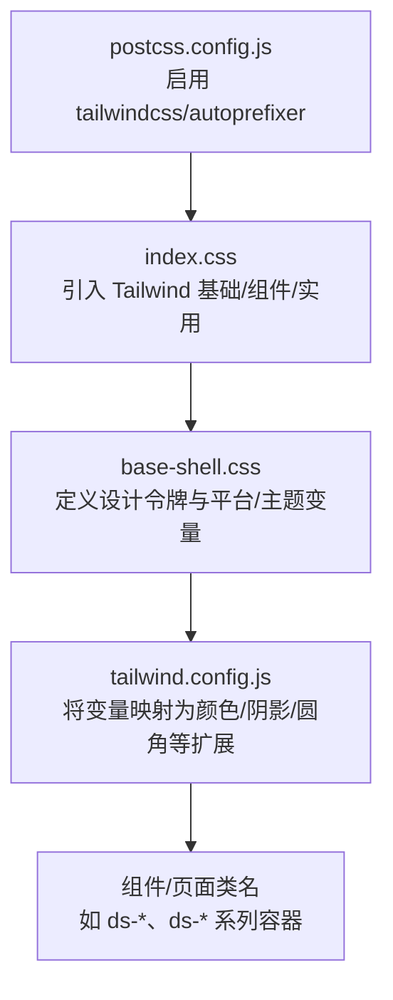
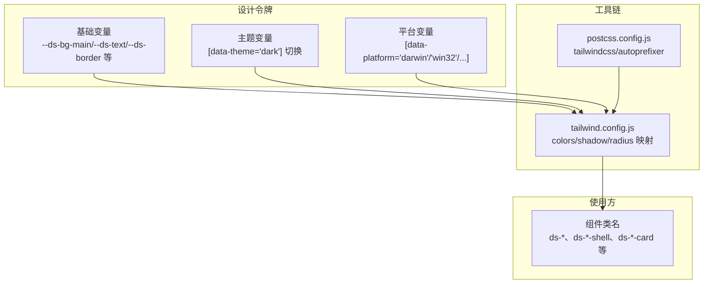
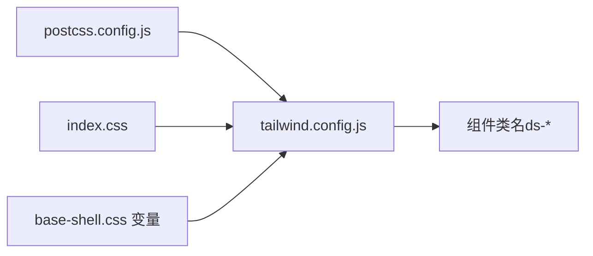

# 视觉系统

<cite>
**本文引用的文件**
- [index.css](file://src/renderer/src/index.css)
- [base-shell.css](file://src/renderer/src/styles/base-shell.css)
- [surfaces-write.css](file://src/renderer/src/styles/surfaces-write.css)
- [tailwind.config.js](file://tailwind.config.js)
- [postcss.config.js](file://postcss.config.js)
</cite>

## 目录
1. [引言](#引言)
2. [项目结构](#项目结构)
3. [核心组件](#核心组件)
4. [架构总览](#架构总览)
5. [详细组件分析](#详细组件分析)
6. [依赖关系分析](#依赖关系分析)
7. [性能考量](#性能考量)
8. [故障排查指南](#故障排查指南)
9. [结论](#结论)
10. [附录](#附录)

## 引言
本文件系统化阐述 DeepSeek GUI 的视觉系统与设计令牌体系，覆盖以下主题：
- 设计令牌：调色板（浅色/深色主题）、字体系统（sans/display/mono 三族）、间距系统（以 4px 为基准）、圆角半径体系、阴影层级、动画时序与过渡节奏
- 视觉系统设计哲学：近纸张/近炭黑画布、电蓝色强调色、玻璃质感表面、简洁专业工具感
- 使用方法与最佳实践：如何在组件开发中正确应用视觉系统，确保一致性与可维护性

## 项目结构
视觉系统由“设计令牌 + 工具链”两部分构成：
- 设计令牌集中于 CSS 变量，定义在基础样式文件中，并通过 Tailwind 配置映射到原子类
- 工具链通过 PostCSS + Tailwind 实现从变量到样式的自动注入与按需生成

图表来源
- [index.css:1-6](file://src/renderer/src/index.css#L1-L6)
- [base-shell.css:1-92](file://src/renderer/src/styles/base-shell.css#L1-L92)
- [tailwind.config.js:1-70](file://tailwind.config.js#L1-L70)
- [postcss.config.js:1-7](file://postcss.config.js#L1-L7)

章节来源
- [index.css:1-6](file://src/renderer/src/index.css#L1-L6)
- [tailwind.config.js:1-70](file://tailwind.config.js#L1-L70)
- [postcss.config.js:1-7](file://postcss.config.js#L1-L7)

## 核心组件
- 设计令牌层（CSS 变量）
  - 调色板：主背景、侧栏、画布、卡片与悬停面、边框、文本、强调色与语义色（成功/危险/差异/技能）等
  - 阴影：壳体、面板、组合器（消息输入区）等多级阴影
  - 动画与过渡：统一的过渡时序与缓动曲线，以及若干专用动画序列
- 工具链层（Tailwind + PostCSS）
  - 将 CSS 变量映射为 Tailwind 扩展，支持在组件中直接使用原子类
  - 深色模式通过选择器开关实现，与设计令牌联动

章节来源
- [base-shell.css:1-92](file://src/renderer/src/styles/base-shell.css#L1-L92)
- [tailwind.config.js:9-66](file://tailwind.config.js#L9-L66)

## 架构总览
视觉系统采用“变量驱动 + 原子类扩展”的架构，确保设计一致性与高可维护性。

图表来源
- [base-shell.css:1-92](file://src/renderer/src/styles/base-shell.css#L1-L92)
- [tailwind.config.js:9-66](file://tailwind.config.js#L9-L66)
- [postcss.config.js:1-7](file://postcss.config.js#L1-L7)

## 详细组件分析

### 设计令牌：调色板（浅色/深色主题）
- 浅色主题
  - 主背景/侧栏/画布：柔和灰白系，营造近纸张画布感
  - 文本与边框：低对比度灰黑系，保证可读性
  - 强调色：电蓝色，用于关键交互与重要状态
  - 语义色：成功/危险/差异/技能等，均提供“实色 + 软色”两档
- 深色主题
  - 主背景/侧栏/画布：近炭黑系，提升沉浸感
  - 强调色：电蓝色偏亮，兼顾科技感与可读性
  - 阴影与玻璃：更重的投影与更强的玻璃模糊，强化层次
- 主题切换机制
  - 通过属性选择器 [data-theme="dark"] 切换整套变量，确保全局一致

章节来源
- [base-shell.css:106-200](file://src/renderer/src/styles/base-shell.css#L106-L200)
- [base-shell.css:374-451](file://src/renderer/src/styles/base-shell.css#L374-L451)

### 设计令牌：字体系统（sans/display/mono 三族）
- 字体族
  - sans：系统无衬线字体栈，适配正文与通用界面
  - display：用于标题与强调文案，强调专业工具感
  - mono：用于代码与等宽内容
- 应用方式
  - 在基础样式中统一声明字体族，组件通过类名或原子类继承
  - Tailwind 配置未对字体族做额外扩展，建议在组件内显式设置

章节来源
- [base-shell.css:453-462](file://src/renderer/src/styles/base-shell.css#L453-L462)
- [tailwind.config.js:9-66](file://tailwind.config.js#L9-L66)

### 设计令牌：间距系统（以 4px 为基准）
- 基础单位：以 4px 为最小步进，便于网格化布局与一致性
- 典型用法
  - 内边距/外边距：使用 4、8、12、16、20、24、32、40、48 等倍数
  - 组件内留白：遵循“小-中-大”三级节奏，避免过度拥挤
- 实践建议
  - 优先使用原子类或受控变量，避免硬编码像素值
  - 在容器与网格中保持一致的栅格对齐

章节来源
- [surfaces-write.css:64-87](file://src/renderer/src/styles/surfaces-write.css#L64-L87)
- [surfaces-write.css:105-123](file://src/renderer/src/styles/surfaces-write.css#L105-L123)

### 设计令牌：圆角半径体系
- 体系
  - 小圆角：4–8px，用于细小控件与装饰
  - 中圆角：12–16px，用于卡片与面板
  - 大圆角：18–24px，用于组合器与对话区域
- 统一映射
  - Tailwind 主题扩展了圆角键值，组件可直接使用原子类

章节来源
- [tailwind.config.js:61-65](file://tailwind.config.js#L61-L65)
- [base-shell.css:561-598](file://src/renderer/src/styles/base-shell.css#L561-L598)

### 设计令牌：阴影层级
- 层级
  - 壳体阴影：最外层容器与工作台背景
  - 面板阴影：侧栏与主要面板
  - 组合器阴影：消息输入区，包含多重投影与描边
- 深色优化
  - 深色主题下阴影更重，配合玻璃滤镜增强层次

章节来源
- [base-shell.css:47-51](file://src/renderer/src/styles/base-shell.css#L47-L51)
- [base-shell.css:520-534](file://src/renderer/src/styles/base-shell.css#L520-L534)
- [base-shell.css:148-151](file://src/renderer/src/styles/base-shell.css#L148-L151)

### 设计令牌：动画时序与过渡
- 过渡节奏
  - 统一时长与缓动：0.12s–0.18s，确保交互顺滑且不拖沓
  - 典型场景：悬停、选中、激活、禁用等状态切换
- 专用动画
  - 卡片升起、面板进入、进度条扫光、呼吸态等，用于关键反馈
- 动画命名规范
  - 以组件域前缀区分（如 sdd-*），避免冲突

章节来源
- [base-shell.css:615-622](file://src/renderer/src/styles/base-shell.css#L615-L622)
- [base-shell.css:624-652](file://src/renderer/src/styles/base-shell.css#L624-L652)
- [base-shell.css:688-702](file://src/renderer/src/styles/base-shell.css#L688-L702)
- [base-shell.css:723-725](file://src/renderer/src/styles/base-shell.css#L723-L725)

### 视觉系统设计哲学
- 近纸张/近炭黑画布：浅色主题柔和自然，深色主题沉浸稳重
- 电蓝色强调色：科技感与品牌识别并存，贯穿关键交互
- 玻璃质感表面：通过 backdrop-filter 与半透明叠加，营造空间深度
- 简洁专业工具感：清晰的层级、克制的装饰与一致的动效，聚焦任务本身

章节来源
- [surfaces-write.css:137-144](file://src/renderer/src/styles/surfaces-write.css#L137-L144)
- [surfaces-write.css:153-154](file://src/renderer/src/styles/surfaces-write.css#L153-L154)

### 使用方法与最佳实践
- 在组件中优先使用 ds-* 类名与 Tailwind 原子类，确保与设计令牌一致
- 主题切换通过设置根元素属性 [data-theme="dark"] 实现，避免硬编码颜色
- 圆角与阴影尽量复用主题扩展，避免重复定义
- 动画与过渡遵循统一时序，必要时在组件域内扩展专用动画
- 字体族在需要强调显示效果时显式设置，避免跨组件风格漂移

章节来源
- [tailwind.config.js:9-66](file://tailwind.config.js#L9-L66)
- [base-shell.css:106-200](file://src/renderer/src/styles/base-shell.css#L106-L200)

## 依赖关系分析
- 工具链依赖
  - PostCSS 启用 Tailwind 与 Autoprefixer
  - Tailwind 读取配置，将 CSS 变量映射为颜色、阴影、圆角等扩展
- 样式入口
  - index.css 引入 Tailwind 基础与组件，确保变量在全局生效

图表来源
- [postcss.config.js:1-7](file://postcss.config.js#L1-L7)
- [tailwind.config.js:1-70](file://tailwind.config.js#L1-L70)
- [index.css:1-6](file://src/renderer/src/index.css#L1-L6)
- [base-shell.css:1-92](file://src/renderer/src/styles/base-shell.css#L1-L92)

章节来源
- [postcss.config.js:1-7](file://postcss.config.js#L1-L7)
- [tailwind.config.js:1-70](file://tailwind.config.js#L1-L70)
- [index.css:1-6](file://src/renderer/src/index.css#L1-L6)

## 性能考量
- 变量驱动：减少重复样式定义，降低 CSS 体积
- 原子类：按需生成，避免全局污染
- 深色模式与玻璃滤镜：在低端设备上可能带来额外开销，建议在性能敏感区域谨慎使用
- 动画与过渡：统一时序与缓动，避免过度复杂的关键帧动画

## 故障排查指南
- 深色主题不生效
  - 检查根元素是否设置了 [data-theme="dark"]
  - 确认变量覆盖顺序正确，主题块在基础变量之后
- 颜色/阴影不一致
  - 确认使用了 Tailwind 扩展类而非硬编码值
  - 检查 tailwind.config.js 是否正确映射变量
- 动画异常
  - 检查动画时序与缓动是否符合统一节奏
  - 确保动画命名域前缀唯一，避免冲突

章节来源
- [base-shell.css:106-200](file://src/renderer/src/styles/base-shell.css#L106-L200)
- [tailwind.config.js:9-66](file://tailwind.config.js#L9-L66)

## 结论
DeepSeek GUI 的视觉系统以“变量驱动 + 原子类扩展”为核心，结合统一的调色板、字体、间距、圆角、阴影与动画体系，形成稳定、可扩展且富有品牌识别度的视觉语言。遵循本文的最佳实践，可在组件开发中高效、一致地应用视觉系统，提升整体体验与开发效率。

## 附录
- 关键变量与类名参考
  - 调色板：--ds-bg-main/--ds-text/--ds-border 等
  - 主题：[data-theme="dark"]
  - 圆角：xl/2xl/3xl 对应 14/18/22px
  - 阴影：composer/shell/panel
  - 动画：sdd-* 前缀的专用序列

章节来源
- [base-shell.css:1-92](file://src/renderer/src/styles/base-shell.css#L1-L92)
- [tailwind.config.js:56-65](file://tailwind.config.js#L56-L65)