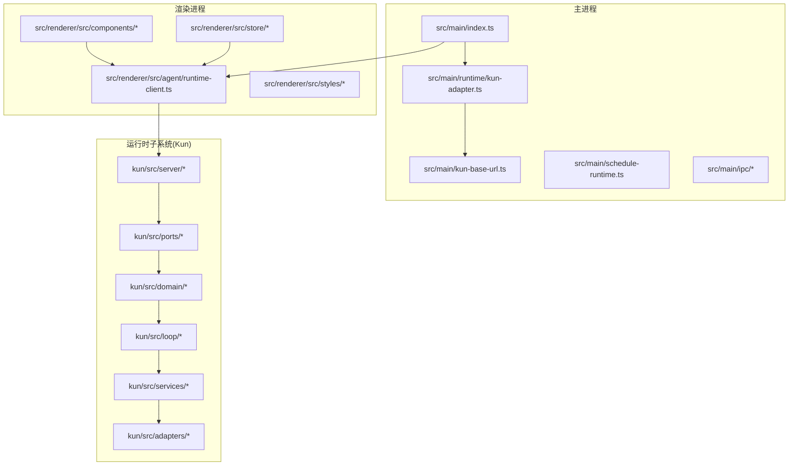
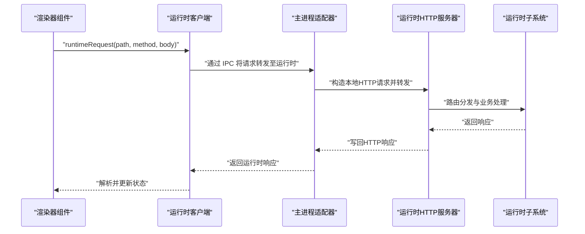
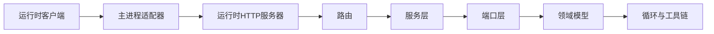

# 设计原则

<cite>
**本文引用的文件**
- [DESIGN.md](file://DESIGN.md)
- [DESIGN.zh-CN.md](file://DESIGN.zh-CN.md)
- [kun-contributing.md](file://docs/kun-contributing.md)
- [src/main/index.ts](file://src/main/index.ts)
- [src/main/kun-base-url.ts](file://src/main/kun-base-url.ts)
- [src/main/runtime/kun-adapter.ts](file://src/main/runtime/kun-adapter.ts)
- [src/main/schedule-runtime.ts](file://src/main/schedule-runtime.ts)
- [src/main/ipc/app-ipc-schemas.ts](file://src/main/ipc/app-ipc-schemas.ts)
- [src/main/ipc/register-app-ipc-handlers.ts](file://src/main/ipc/register-app-ipc-handlers.ts)
- [src/renderer/src/agent/runtime-client.ts](file://src/renderer/src/agent/runtime-client.ts)
- [src/renderer/src/store/chat-store-navigation-actions.ts](file://src/renderer/src/store/chat-store-navigation-actions.ts)
- [src/renderer/src/styles/base-shell.css](file://src/renderer/src/styles/base-shell.css)
- [src/renderer/src/index.css](file://src/renderer/src/index.css)
- [src/renderer/src/components/chat/AnimatedWorkLogo.tsx](file://src/renderer/src/components/chat/AnimatedWorkLogo.tsx)
- [src/renderer/src/components/chat/WorkbenchTopBar.tsx](file://src/renderer/src/components/chat/WorkbenchTopBar.tsx)
- [src/renderer/src/components/chat/WorkspaceModeTabs.tsx](file://src/renderer/src/components/chat/WorkspaceModeTabs.tsx)
- [src/renderer/src/components/chat/FloatingComposer.tsx](file://src/renderer/src/components/chat/FloatingComposer.tsx)
- [src/renderer/src/components/chat/Sidebar.tsx](file://src/renderer/src/components/chat/Sidebar.tsx)
- [src/renderer/src/components/chat/SidebarClaw.tsx](file://src/renderer/src/components/chat/SidebarClaw.tsx)
- [src/renderer/src/components/chat/SidebarClawDialog.tsx](file://src/renderer/src/components/chat/SidebarClawDialog.tsx)
- [src/renderer/src/components/chat/SidebarProjectsSection.tsx](file://src/renderer/src/components/chat/SidebarProjectsSection.tsx)
- [src/renderer/src/components/chat/MessageTimeline.tsx](file://src/renderer/src/components/chat/MessageTimeline.tsx)
- [src/renderer/src/components/chat/WriteWorkspaceView.tsx](file://src/renderer/src/components/chat/WriteWorkspaceView.tsx)
- [src/renderer/src/components/chat/WriteWorkspaceToolbar.tsx](file://src/renderer/src/components/chat/WriteWorkspaceToolbar.tsx)
- [src/renderer/src/components/chat/WriteWorkspaceDocumentPane.tsx](file://src/renderer/src/components/chat/WriteWorkspaceDocumentPane.tsx)
- [src/renderer/src/components/chat/WriteMarkdownEditor.tsx](file://src/renderer/src/components/chat/WriteMarkdownEditor.tsx)
- [src/renderer/src/components/chat/WriteMarkdownPreview.tsx](file://src/renderer/src/components/chat/WriteMarkdownPreview.tsx)
- [src/renderer/src/components/chat/DiffView.tsx](file://src/renderer/src/components/chat/DiffView.tsx)
- [src/renderer/src/components/chat/DevBrowserPanel.tsx](file://src/renderer/src/components/chat/DevBrowserPanel.tsx)
- [src/renderer/src/components/chat/PluginMarketplaceView.tsx](file://src/renderer/src/components/chat/PluginMarketplaceView.tsx)
- [src/renderer/src/components/chat/RuntimeBanner.tsx](file://src/renderer/src/components/chat/RuntimeBanner.tsx)
- [src/renderer/src/components/chat/SettingsView.tsx](file://src/renderer/src/components/chat/SettingsView.tsx)
- [src/renderer/src/components/chat/WindowsTitleBar.tsx](file://src/renderer/src/components/chat/WindowsTitleBar.tsx)
- [src/renderer/src/components/chat/InitialSetupDialog.tsx](file://src/renderer/src/components/chat/InitialSetupDialog.tsx)
- [src/renderer/src/components/chat/ConnectPhoneView.tsx](file://src/renderer/src/components/chat/ConnectPhoneView.tsx)
- [src/renderer/src/components/chat/StreamdownAssistant.tsx](file://src/renderer/src/components/chat/StreamdownAssistant.tsx)
- [src/renderer/src/components/chat/StreamdownCode.tsx](file://src/renderer/src/components/chat/StreamdownCode.tsx)
- [src/renderer/src/components/chat/WhaleHeroStage.tsx](file://src/renderer/src/components/chat/WhaleHeroStage.tsx)
- [src/renderer/src/components/chat/PlanPanel.tsx](file://src/renderer/src/components/chat/PlanPanel.tsx)
- [src/renderer/src/components/chat/TodoPanel.tsx](file://src/renderer/src/components/chat/TodoPanel.tsx)
- [src/renderer/src/components/chat/ScheduleTasksView.tsx](file://src/renderer/src/components/chat/ScheduleTasksView.tsx)
- [src/renderer/src/components/chat/ScheduleDefaultsDialog.tsx](file://src/renderer/src/components/chat/ScheduleDefaultsDialog.tsx)
- [src/renderer/src/components/chat/SddAssistantPanel.tsx](file://src/renderer/src/components/chat/SddAssistantPanel.tsx)
- [src/renderer/src/components/chat/SddDraftEditorView.tsx](file://src/renderer/src/components/chat/SddDraftEditorView.tsx)
- [src/renderer/src/lib/load-kun-diagnostics.ts](file://src/renderer/src/lib/load-kun-diagnostics.ts)
- [src/renderer/src/lib/open-workspace-path.ts](file://src/renderer/src/lib/open-workspace-path.ts)
- [src/renderer/src/lib/workspace-label.ts](file://src/renderer/src/lib/workspace-label.ts)
- [src/shared/ds-gui-api.ts](file://src/shared/ds-gui-api.ts)
- [src/shared/app-settings.ts](file://src/shared/app-settings.ts)
- [src/shared/kun-endpoints.ts](file://src/shared/kun-endpoints.ts)
- [kun/src/server/node-http-server.ts](file://kun/src/server/node-http-server.ts)
- [kun/src/server/http-server.ts](file://kun/src/server/http-server.ts)
- [kun/src/server/router.ts](file://kun/src/server/router.ts)
- [kun/src/server/routes/index.ts](file://kun/src/server/routes/index.ts)
- [kun/src/server/routes/runtime-info.ts](file://kun/src/server/routes/runtime-info.ts)
- [kun/src/server/routes/server-runtime.ts](file://kun/src/server/routes/server-runtime.ts)
- [kun/src/server/routes/health.ts](file://kun/src/server/routes/health.ts)
- [kun/src/server/routes/sessions.ts](file://kun/src/server/routes/sessions.ts)
- [kun/src/server/routes/threads.ts](file://kun/src/server/routes/threads.ts)
- [kun/src/server/routes/turns.ts](file://kun/src/server/routes/turns.ts)
- [kun/src/server/routes/memory.ts](file://kun/src/server/routes/memory.ts)
- [kun/src/server/routes/usage.ts](file://kun/src/server/routes/usage.ts)
- [kun/src/server/routes/events.ts](file://kun/src/server/routes/events.ts)
- [kun/src/server/routes/approvals.ts](file://kun/src/server/routes/approvals.ts)
- [kun/src/server/routes/review.ts](file://kun/src/server/routes/review.ts)
- [kun/src/server/routes/workspace.ts](file://kun/src/server/routes/workspace.ts)
- [kun/src/server/routes/attachments.ts](file://kun/src/server/routes/attachments.ts)
- [kun/src/server/routes/user-inputs.ts](file://kun/src/server/routes/user-inputs.ts)
- [kun/src/server/routes/runtime-error.ts](file://kun/src/server/routes/runtime-error.ts)
- [kun/src/server/routes/server-runtime.ts](file://kun/src/server/routes/server-runtime.ts)
- [kun/src/server/runtime-factory.ts](file://kun/src/server/runtime-factory.ts)
- [kun/src/server/auth.ts](file://kun/src/server/auth.ts)
- [kun/src/server/sse.ts](file://kun/src/server/sse.ts)
- [kun/src/server/response.ts](file://kun/src/server/response.ts)
- [kun/src/server/read-json-body.ts](file://kun/src/server/read-json-body.ts)
- [kun/src/server/routes/index.ts](file://kun/src/server/routes/index.ts)
- [kun/src/ports/model-client.ts](file://kun/src/ports/model-client.ts)
- [kun/src/ports/tool-host.ts](file://kun/src/ports/tool-host.ts)
- [kun/src/ports/event-bus.ts](file://kun/src/ports/event-bus.ts)
- [kun/src/ports/session-store.ts](file://kun/src/ports/session-store.ts)
- [kun/src/ports/thread-store.ts](file://kun/src/ports/thread-store.ts)
- [kun/src/ports/web-provider.ts](file://kun/src/ports/web-provider.ts)
- [kun/src/ports/workspace-inspector.ts](file://kun/src/ports/workspace-inspector.ts)
- [kun/src/ports/user-input-gate.ts](file://kun/src/ports/user-input-gate.ts)
- [kun/src/ports/approval-gate.ts](file://kun/src/ports/approval-gate.ts)
- [kun/src/ports/clock.ts](file://kun/src/ports/clock.ts)
- [kun/src/ports/id-generator.ts](file://kun/src/ports/id-generator.ts)
- [kun/src/domain/session.ts](file://kun/src/domain/session.ts)
- [kun/src/domain/thread.ts](file://kun/src/domain/thread.ts)
- [kun/src/domain/turn.ts](file://kun/src/domain/turn.ts)
- [kun/src/domain/item.ts](file://kun/src/domain/item.ts)
- [kun/src/domain/event.ts](file://kun/src/domain/event.ts)
- [kun/src/domain/approval.ts](file://kun/src/domain/approval.ts)
- [kun/src/domain/usage.ts](file://kun/src/domain/usage.ts)
- [kun/src/loop/agent-loop.ts](file://kun/src/loop/agent-loop.ts)
- [kun/src/loop/auto-model-router.ts](file://kun/src/loop/auto-model-router.ts)
- [kun/src/loop/context-estimator.ts](file://kun/src/loop/context-estimator.ts)
- [kun/src/loop/token-economy.ts](file://kun/src/loop/token-economy.ts)
- [kun/src/loop/tool-call-repair.ts](file://kun/src/loop/tool-call-repair.ts)
- [kun/src/loop/tool-storm-breaker.ts](file://kun/src/loop/tool-storm-breaker.ts)
- [kun/src/services/thread-service.ts](file://kun/src/services/thread-service.ts)
- [kun/src/services/turn-service.ts](file://kun/src/services/turn-service.ts)
- [kun/src/services/usage-service.ts](file://kun/src/services/usage-service.ts)
- [kun/src/services/review-service.ts](file://kun/src/services/review-service.ts)
- [kun/src/services/runtime-event-recorder.ts](file://kun/src/services/runtime-event-recorder.ts)
- [kun/src/cache/lru-cache.ts](file://kun/src/cache/lru-cache.ts)
- [kun/src/cache/ttl-lru-cache.ts](file://kun/src/cache/ttl-lru-cache.ts)
- [kun/src/cache/immutable-prefix.ts](file://kun/src/cache/immutable-prefix.ts)
- [kun/src/cache/prefix-volatility.ts](file://kun/src/cache/prefix-volatility.ts)
- [kun/src/cache/tool-catalog-fingerprint.ts](file://kun/src/cache/tool-catalog-fingerprint.ts)
- [kun/src/adapters/file/file-session-store.ts](file://kun/src/adapters/file/file-session-store.ts)
- [kun/src/adapters/file/file-thread-store.ts](file://kun/src/adapters/file/file-thread-store.ts)
- [kun/src/adapters/hybrid/hybrid-session-store.ts](file://kun/src/adapters/hybrid/hybrid-session-store.ts)
- [kun/src/adapters/hybrid/hybrid-thread-store.ts](file://kun/src/adapters/hybrid/hybrid-thread-store.ts)
- [kun/src/adapters/model/deepseek-compat-model-client.ts](file://kun/src/adapters/model/deepseek-compat-model-client.ts)
- [kun/src/adapters/tool/builtin-tools.ts](file://kun/src/adapters/tool/builtin-tools.ts)
- [kun/src/adapters/tool/builtin-tool-operations.ts](file://kun/src/adapters/tool/builtin-tool-operations.ts)
- [kun/src/adapters/tool/builtin-tool-types.ts](file://kun/src/adapters/tool/builtin-tool-types.ts)
- [kun/src/adapters/tool/builtin-tool-utils.ts](file://kun/src/adapters/tool/builtin-tool-utils.ts)
- [kun/src/adapters/tool/local-tool-host.ts](file://kun/src/adapters/tool/local-tool-host.ts)
- [kun/src/adapters/tool/mcp-tool-provider.ts](file://kun/src/adapters/tool/mcp-tool-provider.ts)
- [kun/src/adapters/tool/mcp-tool-search.ts](file://kun/src/adapters/tool/mcp-tool-search.ts)
- [kun/src/adapters/tool/web-tool-provider.ts](file://kun/src/adapters/tool/web-tool-provider.ts)
- [kun/src/adapters/tool/memory-tool-provider.ts](file://kun/src/adapters/tool/memory-tool-provider.ts)
- [kun/src/adapters/tool/capability-registry.ts](file://kun/src/adapters/tool/capability-registry.ts)
- [kun/src/adapters/tool/create-plan-tool.ts](file://kun/src/adapters/tool/create-plan-tool.ts)
- [kun/src/adapters/tool/goal-tools.ts](file://kun/src/adapters/tool/goal-tools.ts)
- [kun/src/adapters/tool/todo-tools.ts](file://kun/src/adapters/tool/todo-tools.ts)
- [kun/src/adapters/tool/edit.ts](file://kun/src/adapters/tool/edit.ts)
- [kun/src/adapters/tool/find.ts](file://kun/src/adapters/tool/find.ts)
- [kun/src/adapters/tool/grep.ts](file://kun/src/adapters/tool/grep.ts)
- [kun/src/adapters/tool/ls.ts](file://kun/src/adapters/tool/ls.ts)
- [kun/src/adapters/tool/read.ts](file://kun/src/adapters/tool/read.ts)
- [kun/src/adapters/tool/write.ts](file://kun/src/adapters/tool/write.ts)
- [kun/src/adapters/tool/truncate.ts](file://kun/src/adapters/tool/truncate.ts)
- [kun/src/adapters/tool/file-mutation-queue.ts](file://kun/src/adapters/tool/file-mutation-queue.ts)
- [kun/src/adapters/tool/output-accumulator.ts](file://kun/src/adapters/tool/output-accumulator.ts)
- [kun/src/adapters/tool/read-tracker.ts](file://kun/src/adapters/tool/read-tracker.ts)
- [kun/src/adapters/tool/edit-diff.ts](file://kun/src/adapters/tool/edit-diff.ts)
- [kun/src/adapters/tool/builtin-bash-tool.ts](file://kun/src/adapters/tool/builtin-bash-tool.ts)
- [kun/src/adapters/tool/builtin-file-tools.ts](file://kun/src/adapters/tool/builtin-file-tools.ts)
- [kun/src/adapters/tool/builtin-read-tool.ts](file://kun/src/adapters/tool/builtin-read-tool.ts)
- [kun/src/adapters/tool/builtin-search-tools.ts](file://kun/src/adapters/tool/builtin-search-tools.ts)
- [kun/src/adapters/tool/tool-hooks.ts](file://kun/src/adapters/tool/tool-hooks.ts)
- [kun/src/adapters/tool/tool-rate-limit.ts](file://kun/src/adapters/tool/tool-rate-limit.ts)
- [kun/src/delegation/delegation-runtime.ts](file://kun/src/delegation/delegation-runtime.ts)
- [kun/src/delegation/child-agent-executor.ts](file://kun/src/delegation/child-agent-executor.ts)
- [kun/src/memory/memory-store.ts](file://kun/src/memory/memory-store.ts)
- [kun/src/telemetry/cache-telemetry.ts](file://kun/src/telemetry/cache-telemetry.ts)
- [kun/src/telemetry/usage-counter.ts](file://kun/src/telemetry/usage-counter.ts)
- [kun/src/config/kun-config.ts](file://kun/src/config/kun-config.ts)
- [kun/src/config/secret-redaction.ts](file://kun/src/config/secret-redaction.ts)
- [kun/src/contracts/runtime-info.ts](file://kun/src/contracts/runtime-info.ts)
- [kun/src/contracts/threads.ts](file://kun/src/contracts/threads.ts)
- [kun/src/contracts/turns.ts](file://kun/src/contracts/turns.ts)
- [kun/src/contracts/items.ts](file://kun/src/contracts/items.ts)
- [kun/src/contracts/events.ts](file://kun/src/contracts/events.ts)
- [kun/src/contracts/usage.ts](file://kun/src/contracts/usage.ts)
- [kun/src/contracts/workspace.ts](file://kun/src/contracts/workspace.ts)
- [kun/src/contracts/approvals.ts](file://kun/src/contracts/approvals.ts)
- [kun/src/contracts/memory.ts](file://kun/src/contracts/memory.ts)
- [kun/src/contracts/policy.ts](file://kun/src/contracts/policy.ts)
- [kun/src/contracts/errors.ts](file://kun/src/contracts/errors.ts)
- [kun/src/contracts/review.ts](file://kun/src/contracts/review.ts)
- [kun/src/contracts/capabilities.ts](file://kun/src/contracts/capabilities.ts)
- [kun/src/contracts/attachments.ts](file://kun/src/contracts/attachments.ts)
- [kun/src/contracts/user-inputs.ts](file://kun/src/contracts/user-inputs.ts)
- [kun/src/contracts/runtime-info.ts](file://kun/src/contracts/runtime-info.ts)
- [kun/src/contracts/index.ts](file://kun/src/contracts/index.ts)
</cite>

## 目录
1. [引言](#引言)
2. [项目结构](#项目结构)
3. [核心组件](#核心组件)
4. [架构总览](#架构总览)
5. [详细组件分析](#详细组件分析)
6. [依赖关系分析](#依赖关系分析)
7. [性能考量](#性能考量)
8. [故障排查指南](#故障排查指南)
9. [结论](#结论)
10. [附录](#附录)

## 引言
本文件系统化阐述 DeepSeek GUI 的六大核心设计原则，并结合代码库中的实际实现与约束，解释其技术含义与实践意义。六大原则如下：
- 单一运行时边界
- 本地优先可观测可控
- 无代理切换器无运行时控制台
- 渲染器映射 HTTP 不实现代理逻辑
- 稳定视觉身份
- 默认平静的设计理念

这些原则共同指导产品设计与开发决策，确保系统在一致性、可维护性、用户体验与性能之间取得平衡。

## 项目结构
DeepSeek GUI 采用主进程（Electron）+ 渲染进程（React/Vite）+ 运行时子系统（Kun）的三层架构：
- 主进程负责应用生命周期、窗口管理、IPC、与运行时子进程的启动与端口管理。
- 渲染进程负责用户界面、状态管理、与运行时的 HTTP 映射调用。
- 运行时子系统（Kun）提供对话、工具、存储、事件等能力，通过本地 HTTP 暴露接口。

图表来源
- [src/main/index.ts:569-608](file://src/main/index.ts#L569-L608)
- [src/main/kun-base-url.ts:1-8](file://src/main/kun-base-url.ts#L1-L8)
- [src/main/runtime/kun-adapter.ts:45-92](file://src/main/runtime/kun-adapter.ts#L45-L92)
- [src/main/schedule-runtime.ts:647-683](file://src/main/schedule-runtime.ts#L647-L683)
- [src/main/ipc/app-ipc-schemas.ts](file://src/main/ipc/app-ipc-schemas.ts)
- [src/renderer/src/agent/runtime-client.ts:1-70](file://src/renderer/src/agent/runtime-client.ts#L1-L70)
- [kun/src/server/node-http-server.ts:1-86](file://kun/src/server/node-http-server.ts#L1-L86)
- [kun/src/server/http-server.ts](file://kun/src/server/http-server.ts)
- [kun/src/server/router.ts](file://kun/src/server/router.ts)
- [kun/src/ports/model-client.ts](file://kun/src/ports/model-client.ts)
- [kun/src/ports/tool-host.ts](file://kun/src/ports/tool-host.ts)
- [kun/src/ports/event-bus.ts](file://kun/src/ports/event-bus.ts)
- [kun/src/ports/session-store.ts](file://kun/src/ports/session-store.ts)
- [kun/src/ports/thread-store.ts](file://kun/src/ports/thread-store.ts)
- [kun/src/ports/web-provider.ts](file://kun/src/ports/web-provider.ts)
- [kun/src/ports/workspace-inspector.ts](file://kun/src/ports/workspace-inspector.ts)
- [kun/src/ports/user-input-gate.ts](file://kun/src/ports/user-input-gate.ts)
- [kun/src/ports/approval-gate.ts](file://kun/src/ports/approval-gate.ts)
- [kun/src/ports/clock.ts](file://kun/src/ports/clock.ts)
- [kun/src/ports/id-generator.ts](file://kun/src/ports/id-generator.ts)

章节来源
- [src/main/index.ts:569-608](file://src/main/index.ts#L569-L608)
- [src/main/kun-base-url.ts:1-8](file://src/main/kun-base-url.ts#L1-L8)
- [src/main/runtime/kun-adapter.ts:45-92](file://src/main/runtime/kun-adapter.ts#L45-L92)
- [src/main/schedule-runtime.ts:647-683](file://src/main/schedule-runtime.ts#L647-L683)
- [src/renderer/src/agent/runtime-client.ts:1-70](file://src/renderer/src/agent/runtime-client.ts#L1-L70)
- [kun/src/server/node-http-server.ts:1-86](file://kun/src/server/node-http-server.ts#L1-L86)

## 核心组件
- 渲染器运行时客户端：封装对运行时的 HTTP 请求与 SSE 订阅，提供设置读取、缓存与失效机制。
- 主进程运行时适配器：负责运行时子进程的启动/停止、端口回收、基础 URL 构造与鉴权头生成。
- 运行时 HTTP 服务器：基于 Fetch 标准的 Node HTTP 服务器，统一路由与响应处理。
- 前端组件与样式：以“稳定视觉身份”和“默认平静”为指导，提供一致的交互节奏与动效策略。

章节来源
- [src/renderer/src/agent/runtime-client.ts:1-70](file://src/renderer/src/agent/runtime-client.ts#L1-L70)
- [src/main/runtime/kun-adapter.ts:45-92](file://src/main/runtime/kun-adapter.ts#L45-L92)
- [kun/src/server/node-http-server.ts:1-86](file://kun/src/server/node-http-server.ts#L1-L86)
- [DESIGN.md:563-587](file://DESIGN.md#L563-L587)

## 架构总览
下图展示渲染器到运行时的典型请求路径与控制流，体现“渲染器映射 HTTP 不实现代理逻辑”的原则。

图表来源
- [src/renderer/src/agent/runtime-client.ts:41-67](file://src/renderer/src/agent/runtime-client.ts#L41-L67)
- [src/main/runtime/kun-adapter.ts:86-120](file://src/main/runtime/kun-adapter.ts#L86-L120)
- [kun/src/server/node-http-server.ts:41-86](file://kun/src/server/node-http-server.ts#L41-L86)
- [kun/src/server/http-server.ts](file://kun/src/server/http-server.ts)
- [kun/src/server/router.ts](file://kun/src/server/router.ts)

## 详细组件分析

### 原则一：单一运行时边界
- 技术含义：GUI 仅使用一个“Live Agent 运行时”，即 Kun；不允许引入第二套实时运行时或运行时切换器。
- 实践意义：降低复杂度、统一可观测性与控制面，避免配置漂移与资源竞争。
- 代码证据：
  - 设计文档明确禁止添加“第二个实时代理运行时”“代理切换器/连接状态栏/运行时诊断对话框”等。
  - 主进程适配器仅管理一个运行时实例，提供启动/停止与端口回收。
  - 渲染器通过统一的运行时客户端访问本地 HTTP 接口，不直接与多套运行时交互。

章节来源
- [DESIGN.md:312-324](file://DESIGN.md#L312-L324)
- [DESIGN.zh-CN.md:312-346](file://DESIGN.zh-CN.md#L312-L346)
- [src/main/runtime/kun-adapter.ts:45-92](file://src/main/runtime/kun-adapter.ts#L45-L92)
- [src/renderer/src/agent/runtime-client.ts:1-70](file://src/renderer/src/agent/runtime-client.ts#L1-L70)

### 原则二：本地优先可观测可控
- 技术含义：运行时服务绑定在本地回环地址，通过主进程统一端口管理与鉴权头注入；前端通过 IPC 与主进程交互，再由主进程发起本地 HTTP 请求。
- 实践意义：提升安全性与可控性，便于日志、诊断与网络隔离。
- 代码证据：
  - 运行时基础 URL 总是本地回环地址与端口组合。
  - 主进程适配器提供鉴权头生成与运行时请求封装。
  - 主进程负责运行时健康检查与启动队列，确保“可控”。

章节来源
- [src/main/kun-base-url.ts:1-8](file://src/main/kun-base-url.ts#L1-L8)
- [src/main/runtime/kun-adapter.ts:70-92](file://src/main/runtime/kun-adapter.ts#L70-L92)
- [src/main/index.ts:380-420](file://src/main/index.ts#L380-L420)

### 原则三：无代理切换器无运行时控制台
- 技术含义：不提供运行时切换器、连接状态栏或运行时控制台；所有运行时控制通过统一入口与最小化 UI 完成。
- 实践意义：减少认知负担与误操作风险，保持界面简洁。
- 代码证据：
  - 设计文档明确列出多项“禁止项”，包括代理切换器、连接状态栏、运行时诊断对话框等。
  - 渲染器侧未见运行时切换或控制台组件。

章节来源
- [DESIGN.md:312-324](file://DESIGN.md#L312-L324)
- [DESIGN.zh-CN.md:312-346](file://DESIGN.zh-CN.md#L312-L346)

### 原则四：渲染器映射 HTTP 不实现代理逻辑
- 技术含义：渲染器仅负责将用户意图映射为 HTTP 请求，运行时内部的代理、路由、工具执行等逻辑均由运行时完成。
- 实践意义：前后端职责清晰，前端专注体验，后端专注能力。
- 代码证据：
  - 运行时客户端提供 runtimeRequest/startSse/stopSse 等方法，渲染器仅调用。
  - 运行时 HTTP 服务器统一处理请求与响应，路由层将请求分发给具体服务。
  - 代理逻辑（如工具执行、模型调用）在运行时内部实现，前端不感知。

章节来源
- [src/renderer/src/agent/runtime-client.ts:41-67](file://src/renderer/src/agent/runtime-client.ts#L41-L67)
- [kun/src/server/node-http-server.ts:41-86](file://kun/src/server/node-http-server.ts#L41-L86)
- [kun/src/server/router.ts](file://kun/src/server/router.ts)

### 原则五：稳定视觉身份
- 技术含义：设计令牌、色彩体系、阴影与动效均来自单一权威设计文档，前端样式与组件严格遵循。
- 实践意义：保证品牌一致性与可维护性。
- 代码证据：
  - 设计文档包含精确的设计令牌（颜色、字体、半径、阴影、动效时间），作为机器可读规范。
  - 前端样式文件与组件实现遵循该规范，例如工作标识动画、主题变量与动效节奏。

章节来源
- [DESIGN.md:44-79](file://DESIGN.md#L44-L79)
- [DESIGN.md:563-587](file://DESIGN.md#L563-L587)
- [src/renderer/src/styles/base-shell.css:39-1011](file://src/renderer/src/styles/base-shell.css#L39-L1011)
- [src/renderer/src/index.css:1-5](file://src/renderer/src/index.css#L1-L5)
- [src/renderer/src/components/chat/AnimatedWorkLogo.tsx](file://src/renderer/src/components/chat/AnimatedWorkLogo.tsx)

### 原则六：默认平静的设计理念
- 技术含义：动效应功能性而非装饰性；强调确认点击、悬停反馈、面板切换与指示活性的节奏，避免过度动画。
- 实践意义：降低干扰、提升专注度与可预测性。
- 代码证据：
  - 设计文档明确规定动效目标与时间线，强调“功能性动效”。
  - 组件层面体现为：状态点脉冲、流式文本闪烁、面板切换过渡等，且限制了不必要的动画。

章节来源
- [DESIGN.md:563-587](file://DESIGN.md#L563-L587)
- [src/renderer/src/components/chat/AnimatedWorkLogo.tsx](file://src/renderer/src/components/chat/AnimatedWorkLogo.tsx)
- [src/renderer/src/components/chat/WorkbenchTopBar.tsx](file://src/renderer/src/components/chat/WorkbenchTopBar.tsx)
- [src/renderer/src/components/chat/WorkspaceModeTabs.tsx](file://src/renderer/src/components/chat/WorkspaceModeTabs.tsx)
- [src/renderer/src/components/chat/FloatingComposer.tsx](file://src/renderer/src/components/chat/FloatingComposer.tsx)
- [src/renderer/src/components/chat/Sidebar.tsx](file://src/renderer/src/components/chat/Sidebar.tsx)
- [src/renderer/src/components/chat/SidebarClaw.tsx](file://src/renderer/src/components/chat/SidebarClaw.tsx)
- [src/renderer/src/components/chat/SidebarClawDialog.tsx](file://src/renderer/src/components/chat/SidebarClawDialog.tsx)
- [src/renderer/src/components/chat/SidebarProjectsSection.tsx](file://src/renderer/src/components/chat/SidebarProjectsSection.tsx)
- [src/renderer/src/components/chat/MessageTimeline.tsx](file://src/renderer/src/components/chat/MessageTimeline.tsx)
- [src/renderer/src/components/chat/WriteWorkspaceView.tsx](file://src/renderer/src/components/chat/WriteWorkspaceView.tsx)
- [src/renderer/src/components/chat/WriteWorkspaceToolbar.tsx](file://src/renderer/src/components/chat/WriteWorkspaceToolbar.tsx)
- [src/renderer/src/components/chat/WriteWorkspaceDocumentPane.tsx](file://src/renderer/src/components/chat/WriteWorkspaceDocumentPane.tsx)
- [src/renderer/src/components/chat/WriteMarkdownEditor.tsx](file://src/renderer/src/components/chat/WriteMarkdownEditor.tsx)
- [src/renderer/src/components/chat/WriteMarkdownPreview.tsx](file://src/renderer/src/components/chat/WriteMarkdownPreview.tsx)
- [src/renderer/src/components/chat/DiffView.tsx](file://src/renderer/src/components/chat/DiffView.tsx)
- [src/renderer/src/components/chat/DevBrowserPanel.tsx](file://src/renderer/src/components/chat/DevBrowserPanel.tsx)
- [src/renderer/src/components/chat/PluginMarketplaceView.tsx](file://src/renderer/src/components/chat/PluginMarketplaceView.tsx)
- [src/renderer/src/components/chat/RuntimeBanner.tsx](file://src/renderer/src/components/chat/RuntimeBanner.tsx)
- [src/renderer/src/components/chat/SettingsView.tsx](file://src/renderer/src/components/chat/SettingsView.tsx)
- [src/renderer/src/components/chat/WindowsTitleBar.tsx](file://src/renderer/src/components/chat/WindowsTitleBar.tsx)
- [src/renderer/src/components/chat/InitialSetupDialog.tsx](file://src/renderer/src/components/chat/InitialSetupDialog.tsx)
- [src/renderer/src/components/chat/ConnectPhoneView.tsx](file://src/renderer/src/components/chat/ConnectPhoneView.tsx)
- [src/renderer/src/components/chat/StreamdownAssistant.tsx](file://src/renderer/src/components/chat/StreamdownAssistant.tsx)
- [src/renderer/src/components/chat/StreamdownCode.tsx](file://src/renderer/src/components/chat/StreamdownCode.tsx)
- [src/renderer/src/components/chat/WhaleHeroStage.tsx](file://src/renderer/src/components/chat/WhaleHeroStage.tsx)
- [src/renderer/src/components/chat/PlanPanel.tsx](file://src/renderer/src/components/chat/PlanPanel.tsx)
- [src/renderer/src/components/chat/TodoPanel.tsx](file://src/renderer/src/components/chat/TodoPanel.tsx)
- [src/renderer/src/components/chat/ScheduleTasksView.tsx](file://src/renderer/src/components/chat/ScheduleTasksView.tsx)
- [src/renderer/src/components/chat/ScheduleDefaultsDialog.tsx](file://src/renderer/src/components/chat/ScheduleDefaultsDialog.tsx)
- [src/renderer/src/components/chat/SddAssistantPanel.tsx](file://src/renderer/src/components/chat/SddAssistantPanel.tsx)
- [src/renderer/src/components/chat/SddDraftEditorView.tsx](file://src/renderer/src/components/chat/SddDraftEditorView.tsx)

## 依赖关系分析
- 渲染器依赖主进程提供的运行时客户端，主进程再依赖运行时 HTTP 服务器。
- 运行时 HTTP 服务器通过路由将请求分发到各服务模块（会话、线程、回合、内存、用量、事件、审批、评审、工作区、附件、用户输入、运行时错误等）。
- 服务模块进一步依赖端口层（模型客户端、工具宿主、事件总线、存储、工作区检查器、用户输入门、审批门、时钟、ID 生成器等）。
- 领域模型（会话、线程、回合、条目、事件、审批、用量）定义数据契约，循环与工具链围绕其演进。

图表来源
- [src/renderer/src/agent/runtime-client.ts:1-70](file://src/renderer/src/agent/runtime-client.ts#L1-L70)
- [src/main/runtime/kun-adapter.ts:86-120](file://src/main/runtime/kun-adapter.ts#L86-L120)
- [kun/src/server/node-http-server.ts:1-86](file://kun/src/server/node-http-server.ts#L1-L86)
- [kun/src/server/router.ts](file://kun/src/server/router.ts)
- [kun/src/server/routes/index.ts](file://kun/src/server/routes/index.ts)
- [kun/src/ports/model-client.ts](file://kun/src/ports/model-client.ts)
- [kun/src/ports/tool-host.ts](file://kun/src/ports/tool-host.ts)
- [kun/src/ports/event-bus.ts](file://kun/src/ports/event-bus.ts)
- [kun/src/ports/session-store.ts](file://kun/src/ports/session-store.ts)
- [kun/src/ports/thread-store.ts](file://kun/src/ports/thread-store.ts)
- [kun/src/ports/web-provider.ts](file://kun/src/ports/web-provider.ts)
- [kun/src/ports/workspace-inspector.ts](file://kun/src/ports/workspace-inspector.ts)
- [kun/src/ports/user-input-gate.ts](file://kun/src/ports/user-input-gate.ts)
- [kun/src/ports/approval-gate.ts](file://kun/src/ports/approval-gate.ts)
- [kun/src/ports/clock.ts](file://kun/src/ports/clock.ts)
- [kun/src/ports/id-generator.ts](file://kun/src/ports/id-generator.ts)
- [kun/src/domain/session.ts](file://kun/src/domain/session.ts)
- [kun/src/domain/thread.ts](file://kun/src/domain/thread.ts)
- [kun/src/domain/turn.ts](file://kun/src/domain/turn.ts)
- [kun/src/domain/item.ts](file://kun/src/domain/item.ts)
- [kun/src/domain/event.ts](file://kun/src/domain/event.ts)
- [kun/src/domain/approval.ts](file://kun/src/domain/approval.ts)
- [kun/src/domain/usage.ts](file://kun/src/domain/usage.ts)
- [kun/src/loop/agent-loop.ts](file://kun/src/loop/agent-loop.ts)
- [kun/src/loop/auto-model-router.ts](file://kun/src/loop/auto-model-router.ts)
- [kun/src/loop/context-estimator.ts](file://kun/src/loop/context-estimator.ts)
- [kun/src/loop/token-economy.ts](file://kun/src/loop/token-economy.ts)
- [kun/src/loop/tool-call-repair.ts](file://kun/src/loop/tool-call-repair.ts)
- [kun/src/loop/tool-storm-breaker.ts](file://kun/src/loop/tool-storm-breaker.ts)

## 性能考量
- 本地回环通信：减少网络开销，提高稳定性。
- 缓存与静默降级：在不影响用户体验的前提下，对非关键路径进行静默优化（如缓存满时的逐出）。
- 动效节制：遵循设计文档的动效节奏，避免不必要的动画造成性能损耗。
- 启动与健康检查：主进程对运行时进行健康检查与延迟显示策略，确保首屏体验。

章节来源
- [kun/src/cache/lru-cache.ts](file://kun/src/cache/lru-cache.ts)
- [kun/src/cache/ttl-lru-cache.ts](file://kun/src/cache/ttl-lru-cache.ts)
- [DESIGN.md:563-587](file://DESIGN.md#L563-L587)
- [src/main/index.ts:380-420](file://src/main/index.ts#L380-L420)

## 故障排查指南
- 运行时连接异常：渲染器在连接失败时会格式化错误并根据需要跳转到设置页；主进程负责运行时的启动与端口回收。
- 设置刷新与缓存：运行时客户端提供强制刷新与缓存失效机制，避免陈旧配置影响行为。
- 日志与诊断：前端提供加载运行时诊断的能力，辅助定位问题。

章节来源
- [src/renderer/src/store/chat-store-navigation-actions.ts:293-358](file://src/renderer/src/store/chat-store-navigation-actions.ts#L293-L358)
- [src/renderer/src/agent/runtime-client.ts:13-39](file://src/renderer/src/agent/runtime-client.ts#L13-L39)
- [src/renderer/src/lib/load-kun-diagnostics.ts](file://src/renderer/src/lib/load-kun-diagnostics.ts)

## 结论
六大设计原则为 DeepSeek GUI 提供了统一的架构与设计基线。它们在代码层面得到了严格的约束与实现验证：单一运行时边界确保了控制面的一致性；本地优先可观测可控提升了安全与可维护性；无代理切换器与无运行时控制台降低了复杂度；渲染器映射 HTTP 不实现代理逻辑明确了职责边界；稳定视觉身份与默认平静的设计理念保障了用户体验的一致性与专注度。在新功能开发中，应始终以这些原则为准则，避免引入反模式与不必要的复杂性。

## 附录
- 反面案例与正确实现建议（示例性说明，不对应具体代码片段）：
  - 反面案例：在渲染器中直接管理多个运行时或引入运行时切换器。正确做法：通过运行时客户端统一访问，主进程适配器集中管理。
  - 反面案例：在渲染器中实现代理逻辑（如工具执行、模型路由）。正确做法：将代理逻辑下沉到运行时内部，渲染器仅做请求映射。
  - 反面案例：引入运行时控制台或连接状态栏。正确做法：通过最小化 UI 与设置页完成必要配置，避免冗余控制面。
  - 反面案例：滥用动效或动画导致性能下降。正确做法：遵循设计文档的动效节奏，保持“功能性动效”。