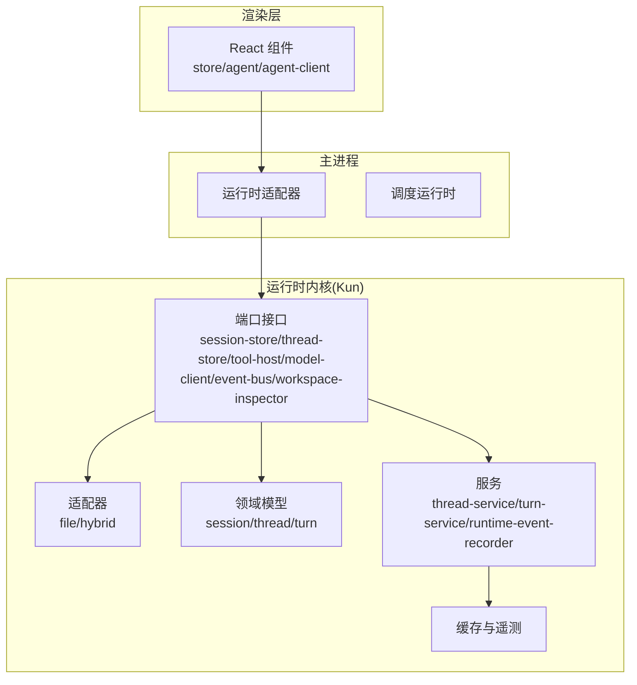
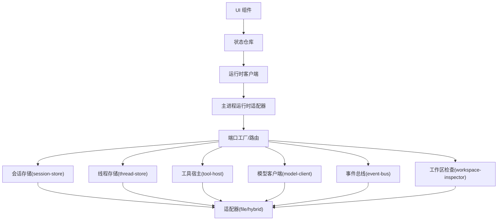
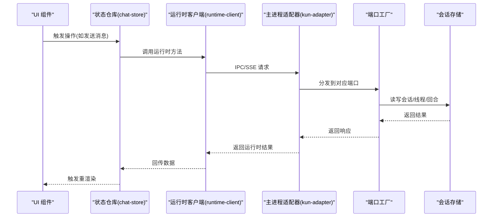
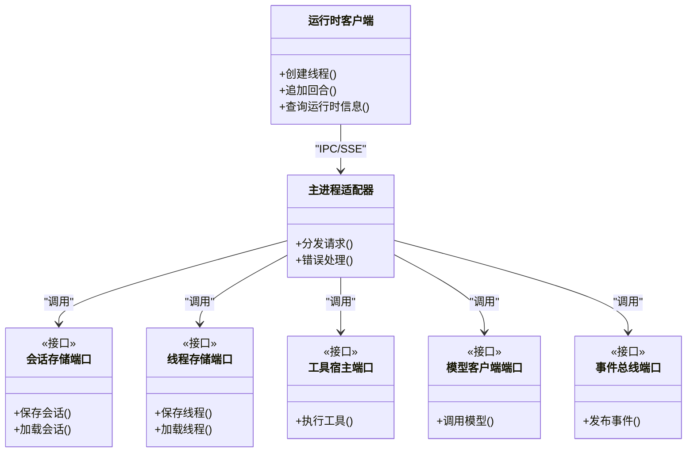
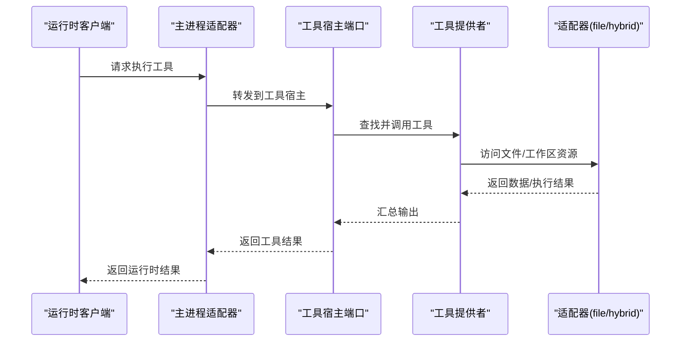
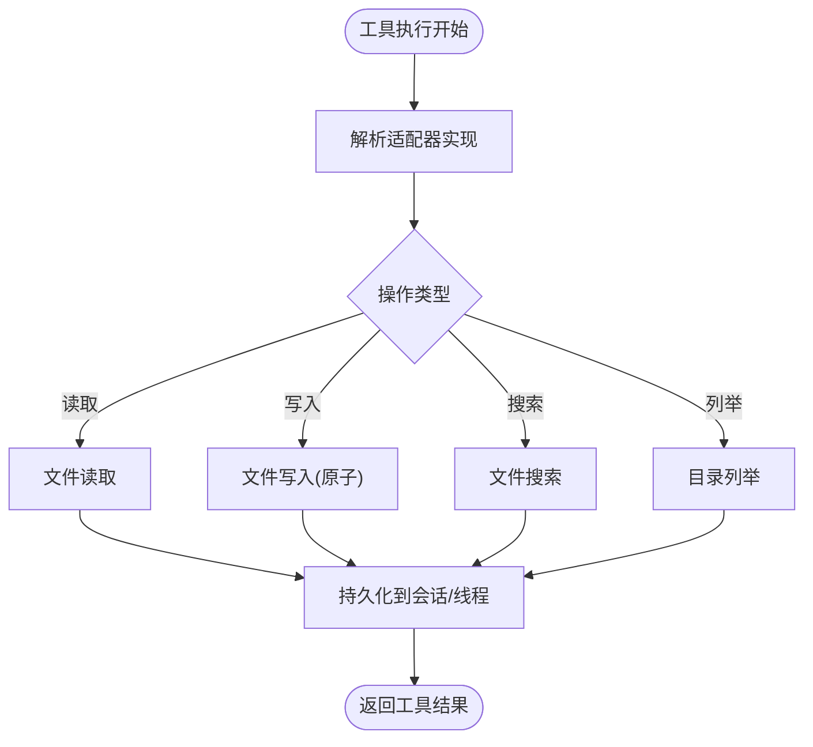
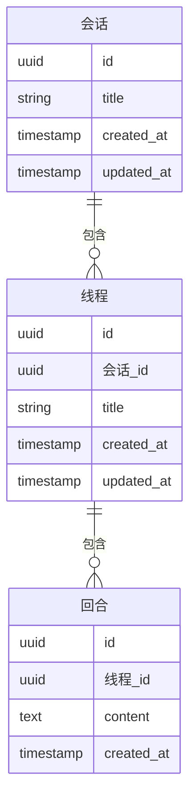
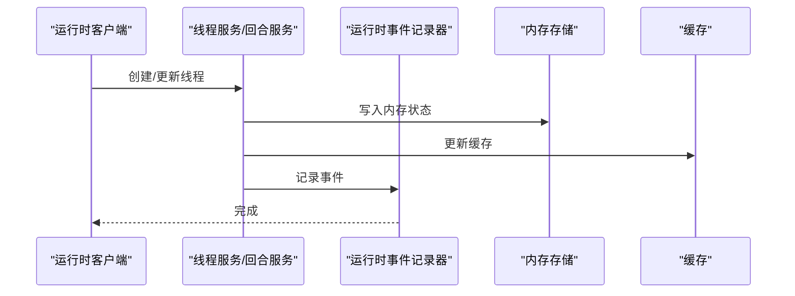
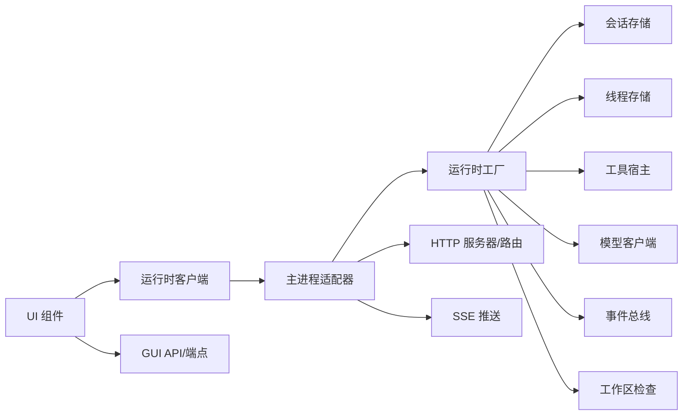

# 组件交互关系

<cite>
**本文引用的文件**
- [src/renderer/src/main.tsx](file://src/renderer/src/main.tsx)
- [src/renderer/src/App.tsx](file://src/renderer/src/App.tsx)
- [src/renderer/src/store/chat-store.ts](file://src/renderer/src/store/chat-store.ts)
- [src/renderer/src/store/chat-store-runtime.ts](file://src/renderer/src/store/chat-store-runtime.ts)
- [src/renderer/src/agent/kun-runtime.ts](file://src/renderer/src/agent/kun-runtime.ts)
- [src/renderer/src/agent/runtime-client.ts](file://src/renderer/src/agent/runtime-client.ts)
- [src/main/runtime/kun-adapter.ts](file://src/main/runtime/kun-adapter.ts)
- [src/main/claw-runtime.ts](file://src/main/claw-runtime.ts)
- [src/main/schedule-runtime.ts](file://src/main/schedule-runtime.ts)
- [kun/src/index.ts](file://kun/src/index.ts)
- [kun/src/adapters/index.ts](file://kun/src/adapters/index.ts)
- [kun/src/adapters/file/index.ts](file://kun/src/adapters/file/index.ts)
- [kun/src/adapters/hybrid/index.ts](file://kun/src/adapters/hybrid/index.ts)
- [kun/src/ports/index.ts](file://kun/src/ports/index.ts)
- [kun/src/ports/session-store.ts](file://kun/src/ports/session-store.ts)
- [kun/src/ports/thread-store.ts](file://kun/src/ports/thread-store.ts)
- [kun/src/ports/tool-host.ts](file://kun/src/ports/tool-host.ts)
- [kun/src/ports/model-client.ts](file://kun/src/ports/model-client.ts)
- [kun/src/ports/event-bus.ts](file://kun/src/ports/event-bus.ts)
- [kun/src/ports/workspace-inspector.ts](file://kun/src/ports/workspace-inspector.ts)
- [kun/src/domain/index.ts](file://kun/src/domain/index.ts)
- [kun/src/domain/session.ts](file://kun/src/domain/session.ts)
- [kun/src/domain/thread.ts](file://kun/src/domain/thread.ts)
- [kun/src/domain/turn.ts](file://kun/src/domain/turn.ts)
- [kun/src/contracts/index.ts](file://kun/src/contracts/index.ts)
- [kun/src/contracts/threads.ts](file://kun/src/contracts/threads.ts)
- [kun/src/contracts/runtime-info.ts](file://kun/src/contracts/runtime-info.ts)
- [kun/src/server/runtime-factory.ts](file://kun/src/server/runtime-factory.ts)
- [kun/src/server/node-http-server.ts](file://kun/src/server/node-http-server.ts)
- [kun/src/server/routes/server-runtime.ts](file://kun/src/server/routes/server-runtime.ts)
- [kun/src/services/thread-service.ts](file://kun/src/services/thread-service.ts)
- [kun/src/services/turn-service.ts](file://kun/src/services/turn-service.ts)
- [kun/src/services/runtime-event-recorder.ts](file://kun/src/services/runtime-event-recorder.ts)
- [kun/src/cache/index.ts](file://kun/src/cache/index.ts)
- [kun/src/memory/memory-store.ts](file://kun/src/memory/memory-store.ts)
- [kun/src/telemetry/index.ts](file://kun/src/telemetry/index.ts)
- [src/shared/ds-gui-api.ts](file://src/shared/ds-gui-api.ts)
- [src/shared/kun-endpoints.ts](file://src/shared/kun-endpoints.ts)
</cite>

## 目录
1. [引言](#引言)
2. [项目结构](#项目结构)
3. [核心组件](#核心组件)
4. [架构总览](#架构总览)
5. [详细组件分析](#详细组件分析)
6. [依赖分析](#依赖分析)
7. [性能考虑](#性能考虑)
8. [故障排查指南](#故障排查指南)
9. [结论](#结论)
10. [附录](#附录)

## 引言
本文件聚焦 DeepSeek GUI 的组件交互关系，围绕以下主线展开：UI 组件与状态管理的绑定、状态管理与运行时服务的通信、运行时服务与工具系统的协作、工具系统与存储适配器的交互。文档通过类图、序列图与流程图，解释组件间的依赖关系、调用链路与数据传递方式，并总结解耦设计原则（接口抽象、依赖注入、事件通信），最后给出典型用户场景下的协作流程与扩展指导。

## 项目结构
DeepSeek GUI 采用“渲染层（Renderer）+ 主进程（Main）+ 运行时内核（Kun）”三层架构：
- 渲染层：React 组件、状态仓库、运行时客户端、代理层（Agent）
- 主进程：运行时适配器、调度运行时、平台集成
- 运行时内核（Kun）：领域模型、端口接口、适配器、服务、缓存与遥测

图表来源
- [src/renderer/src/main.tsx](file://src/renderer/src/main.tsx)
- [src/renderer/src/store/chat-store.ts](file://src/renderer/src/store/chat-store.ts)
- [src/renderer/src/agent/runtime-client.ts](file://src/renderer/src/agent/runtime-client.ts)
- [src/main/runtime/kun-adapter.ts](file://src/main/runtime/kun-adapter.ts)
- [kun/src/ports/index.ts](file://kun/src/ports/index.ts)
- [kun/src/adapters/index.ts](file://kun/src/adapters/index.ts)
- [kun/src/domain/index.ts](file://kun/src/domain/index.ts)
- [kun/src/services/thread-service.ts](file://kun/src/services/thread-service.ts)
- [kun/src/cache/index.ts](file://kun/src/cache/index.ts)

章节来源
- [src/renderer/src/main.tsx](file://src/renderer/src/main.tsx)
- [src/renderer/src/App.tsx](file://src/renderer/src/App.tsx)
- [src/main/runtime/kun-adapter.ts](file://src/main/runtime/kun-adapter.ts)
- [kun/src/index.ts](file://kun/src/index.ts)

## 核心组件
- 渲染层入口与应用壳：负责挂载 React 应用与全局布局。
- 状态仓库与运行时绑定：将 UI 状态与运行时客户端连接，驱动会话、线程、回合等生命周期。
- 运行时客户端：封装与主进程运行时适配器的 IPC/SSE 通信，暴露统一的运行时 API。
- 主进程运行时适配器：桥接渲染层与 Kun 内核，协调端口实现与工具宿主。
- Kun 端口与适配器：定义抽象接口与具体实现（文件/混合），承载会话/线程/工具等能力。
- 领域模型：会话、线程、回合等核心实体，承载业务状态与行为。
- 服务层：线程服务、回合服务、运行时事件记录器等，提供业务编排与持久化支持。
- 缓存与遥测：提升性能与可观测性。

章节来源
- [src/renderer/src/main.tsx](file://src/renderer/src/main.tsx)
- [src/renderer/src/App.tsx](file://src/renderer/src/App.tsx)
- [src/renderer/src/store/chat-store.ts](file://src/renderer/src/store/chat-store.ts)
- [src/renderer/src/store/chat-store-runtime.ts](file://src/renderer/src/store/chat-store-runtime.ts)
- [src/renderer/src/agent/runtime-client.ts](file://src/renderer/src/agent/runtime-client.ts)
- [src/main/runtime/kun-adapter.ts](file://src/main/runtime/kun-adapter.ts)
- [kun/src/ports/index.ts](file://kun/src/ports/index.ts)
- [kun/src/adapters/index.ts](file://kun/src/adapters/index.ts)
- [kun/src/domain/index.ts](file://kun/src/domain/index.ts)
- [kun/src/services/thread-service.ts](file://kun/src/services/thread-service.ts)
- [kun/src/cache/index.ts](file://kun/src/cache/index.ts)

## 架构总览
下图展示了从 UI 到运行时内核的关键交互路径与职责边界：

图表来源
- [src/renderer/src/store/chat-store-runtime.ts](file://src/renderer/src/store/chat-store-runtime.ts)
- [src/renderer/src/agent/runtime-client.ts](file://src/renderer/src/agent/runtime-client.ts)
- [src/main/runtime/kun-adapter.ts](file://src/main/runtime/kun-adapter.ts)
- [kun/src/ports/index.ts](file://kun/src/ports/index.ts)
- [kun/src/adapters/index.ts](file://kun/src/adapters/index.ts)

## 详细组件分析

### UI 组件与状态管理的绑定
- 入口与壳层：应用在入口文件中初始化并挂载到 DOM；App 负责布局与路由。
- 状态仓库：chat-store 提供会话、线程、回合的状态与动作；chat-store-runtime 将状态与运行时客户端对接，形成“状态驱动运行时”的闭环。
- 绑定策略：通过运行时客户端暴露的方法，将 UI 操作（如发送消息、切换线程）转化为对运行时的调用；运行时返回的数据回流到状态仓库，驱动 UI 更新。

图表来源
- [src/renderer/src/store/chat-store.ts](file://src/renderer/src/store/chat-store.ts)
- [src/renderer/src/store/chat-store-runtime.ts](file://src/renderer/src/store/chat-store-runtime.ts)
- [src/renderer/src/agent/runtime-client.ts](file://src/renderer/src/agent/runtime-client.ts)
- [src/main/runtime/kun-adapter.ts](file://src/main/runtime/kun-adapter.ts)
- [kun/src/ports/session-store.ts](file://kun/src/ports/session-store.ts)

章节来源
- [src/renderer/src/main.tsx](file://src/renderer/src/main.tsx)
- [src/renderer/src/App.tsx](file://src/renderer/src/App.tsx)
- [src/renderer/src/store/chat-store.ts](file://src/renderer/src/store/chat-store.ts)
- [src/renderer/src/store/chat-store-runtime.ts](file://src/renderer/src/store/chat-store-runtime.ts)

### 状态管理与运行时服务的通信
- 运行时客户端：封装与主进程的通信细节，提供统一的 API（如创建线程、追加回合、查询运行时信息）。
- 主进程适配器：接收来自客户端的请求，解析为对 Kun 端口的调用，处理错误与回退逻辑。
- 端口接口：以抽象接口定义能力边界，确保上层不直接依赖具体实现。

图表来源
- [src/renderer/src/agent/runtime-client.ts](file://src/renderer/src/agent/runtime-client.ts)
- [src/main/runtime/kun-adapter.ts](file://src/main/runtime/kun-adapter.ts)
- [kun/src/ports/session-store.ts](file://kun/src/ports/session-store.ts)
- [kun/src/ports/thread-store.ts](file://kun/src/ports/thread-store.ts)
- [kun/src/ports/tool-host.ts](file://kun/src/ports/tool-host.ts)
- [kun/src/ports/model-client.ts](file://kun/src/ports/model-client.ts)
- [kun/src/ports/event-bus.ts](file://kun/src/ports/event-bus.ts)

章节来源
- [src/renderer/src/agent/runtime-client.ts](file://src/renderer/src/agent/runtime-client.ts)
- [src/main/runtime/kun-adapter.ts](file://src/main/runtime/kun-adapter.ts)
- [kun/src/ports/index.ts](file://kun/src/ports/index.ts)

### 运行时服务与工具系统的协作
- 工具宿主端口：抽象出工具执行的统一入口，支持内置工具、MCP 工具、内存工具等。
- 工具注册与能力：工具系统维护能力注册表，按需加载与执行，支持速率限制、输出累积、参数修复等横切能力。
- 与存储适配器的协作：工具执行可能涉及文件读写、搜索、编辑等，这些能力由适配器提供。

图表来源
- [kun/src/ports/tool-host.ts](file://kun/src/ports/tool-host.ts)
- [kun/src/adapters/file/index.ts](file://kun/src/adapters/file/index.ts)
- [kun/src/adapters/hybrid/index.ts](file://kun/src/adapters/hybrid/index.ts)

章节来源
- [kun/src/ports/tool-host.ts](file://kun/src/ports/tool-host.ts)
- [kun/src/adapters/file/index.ts](file://kun/src/adapters/file/index.ts)
- [kun/src/adapters/hybrid/index.ts](file://kun/src/adapters/hybrid/index.ts)

### 工具系统与存储适配器的交互
- 存储适配器：提供文件与混合两种实现，分别面向本地文件系统与混合（内存+文件）策略。
- 读写与搜索：工具系统通过适配器进行文件读取、写入、搜索、列出等操作，适配器内部负责原子写入、会话/线程持久化等细节。
- 数据一致性：适配器与端口配合，保证工具执行过程中的数据一致性与并发安全。

图表来源
- [kun/src/adapters/file/file-session-store.ts](file://kun/src/adapters/file/file-session-store.ts)
- [kun/src/adapters/file/file-thread-store.ts](file://kun/src/adapters/file/file-thread-store.ts)
- [kun/src/adapters/file/atomic-write.ts](file://kun/src/adapters/file/atomic-write.ts)
- [kun/src/adapters/hybrid/hybrid-session-store.ts](file://kun/src/adapters/hybrid/hybrid-session-store.ts)
- [kun/src/adapters/hybrid/hybrid-thread-store.ts](file://kun/src/adapters/hybrid/hybrid-thread-store.ts)

章节来源
- [kun/src/adapters/file/index.ts](file://kun/src/adapters/file/index.ts)
- [kun/src/adapters/hybrid/index.ts](file://kun/src/adapters/hybrid/index.ts)

### 领域模型与契约
- 领域模型：会话、线程、回合构成核心业务实体，承载状态与生命周期。
- 契约定义：线程、运行时信息等契约用于前后端一致的数据结构与协议。

图表来源
- [kun/src/domain/session.ts](file://kun/src/domain/session.ts)
- [kun/src/domain/thread.ts](file://kun/src/domain/thread.ts)
- [kun/src/domain/turn.ts](file://kun/src/domain/turn.ts)
- [kun/src/contracts/threads.ts](file://kun/src/contracts/threads.ts)
- [kun/src/contracts/runtime-info.ts](file://kun/src/contracts/runtime-info.ts)

章节来源
- [kun/src/domain/index.ts](file://kun/src/domain/index.ts)
- [kun/src/contracts/index.ts](file://kun/src/contracts/index.ts)

### 服务层与事件记录
- 线程服务与回合服务：提供线程生命周期管理、回合追加与查询等能力。
- 运行时事件记录器：记录运行时关键事件，便于审计与诊断。
- 与缓存/内存存储的协作：通过内存存储与缓存提升查询与回放性能。

图表来源
- [kun/src/services/thread-service.ts](file://kun/src/services/thread-service.ts)
- [kun/src/services/turn-service.ts](file://kun/src/services/turn-service.ts)
- [kun/src/services/runtime-event-recorder.ts](file://kun/src/services/runtime-event-recorder.ts)
- [kun/src/memory/memory-store.ts](file://kun/src/memory/memory-store.ts)
- [kun/src/cache/index.ts](file://kun/src/cache/index.ts)

章节来源
- [kun/src/services/thread-service.ts](file://kun/src/services/thread-service.ts)
- [kun/src/services/turn-service.ts](file://kun/src/services/turn-service.ts)
- [kun/src/services/runtime-event-recorder.ts](file://kun/src/services/runtime-event-recorder.ts)
- [kun/src/memory/memory-store.ts](file://kun/src/memory/memory-store.ts)
- [kun/src/cache/index.ts](file://kun/src/cache/index.ts)

## 依赖分析
- 解耦设计原则
  - 接口抽象：通过端口接口隔离具体实现，UI 与运行时仅依赖抽象。
  - 依赖注入：主进程适配器作为容器，将具体端口实现注入到运行时工厂。
  - 事件通信：事件总线提供松耦合的消息通道，避免直接调用链过深。
- 外部依赖与集成点
  - HTTP 服务器与路由：提供运行时信息、会话、线程、回合、附件等接口。
  - SSE：用于实时推送运行时事件与增量更新。
  - GUI API 与端点：统一前端与后端的通信协议。

图表来源
- [src/renderer/src/agent/runtime-client.ts](file://src/renderer/src/agent/runtime-client.ts)
- [src/main/runtime/kun-adapter.ts](file://src/main/runtime/kun-adapter.ts)
- [kun/src/server/runtime-factory.ts](file://kun/src/server/runtime-factory.ts)
- [kun/src/server/node-http-server.ts](file://kun/src/server/node-http-server.ts)
- [kun/src/server/routes/server-runtime.ts](file://kun/src/server/routes/server-runtime.ts)
- [src/shared/ds-gui-api.ts](file://src/shared/ds-gui-api.ts)
- [src/shared/kun-endpoints.ts](file://src/shared/kun-endpoints.ts)

章节来源
- [kun/src/server/runtime-factory.ts](file://kun/src/server/runtime-factory.ts)
- [kun/src/server/node-http-server.ts](file://kun/src/server/node-http-server.ts)
- [kun/src/server/routes/server-runtime.ts](file://kun/src/server/routes/server-runtime.ts)
- [src/shared/ds-gui-api.ts](file://src/shared/ds-gui-api.ts)
- [src/shared/kun-endpoints.ts](file://src/shared/kun-endpoints.ts)

## 性能考虑
- 缓存策略：LRU/TTL 缓存、不可变前缀缓存、工具目录指纹，减少重复计算与 IO。
- 内存存储：内存存储用于高频读写，降低磁盘压力。
- 上下文压缩与历史净化：在循环层对上下文进行压缩与历史清理，控制成本。
- 事件记录与遥测：记录关键指标，辅助性能优化与问题定位。

章节来源
- [kun/src/cache/index.ts](file://kun/src/cache/index.ts)
- [kun/src/memory/memory-store.ts](file://kun/src/memory/memory-store.ts)
- [kun/src/telemetry/index.ts](file://kun/src/telemetry/index.ts)
- [kun/src/loop/context-compactor.ts](file://kun/src/loop/context-compactor.ts)
- [kun/src/loop/request-history-hygiene.ts](file://kun/src/loop/request-history-hygiene.ts)

## 故障排查指南
- 运行时健康检查：通过健康端点与运行时信息端点确认服务可用性与版本。
- 错误格式化：提供统一的运行时错误格式化工具，便于前端展示与日志分析。
- 日志与诊断：加载运行时诊断信息，结合事件记录器定位异常。
- 端到端测试：利用测试夹具验证 HTTP 服务器、运行时工厂与路由的正确性。

章节来源
- [kun/src/server/routes/health.ts](file://kun/src/server/routes/health.ts)
- [kun/src/server/routes/runtime-info.ts](file://kun/src/server/routes/runtime-info.ts)
- [src/renderer/src/lib/format-runtime-error.ts](file://src/renderer/src/lib/format-runtime-error.ts)
- [src/renderer/src/lib/load-kun-diagnostics.ts](file://src/renderer/src/lib/load-kun-diagnostics.ts)
- [kun/src/tests/http-server.test.ts](file://kun/src/tests/http-server.test.ts)
- [kun/src/tests/runtime-factory.test.ts](file://kun/src/tests/runtime-factory.test.ts)

## 结论
DeepSeek GUI 通过清晰的三层架构与严格的接口抽象，实现了 UI、运行时与内核的低耦合协作。状态仓库与运行时客户端的绑定确保了 UI 行为可追踪、可回放；主进程适配器与端口工厂承担了依赖注入与路由职责；工具系统与存储适配器的分离使得能力扩展与数据访问解耦；缓存与遥测提升了整体性能与可观测性。遵循本文提出的解耦原则与扩展指导，可在不破坏现有契约的前提下快速迭代新功能。

## 附录
- 典型用户场景：在聊天界面发起一次“写入文件并生成摘要”的工具调用，从 UI 到运行时再到工具宿主与适配器的完整调用链见“运行时服务与工具系统的协作”与“工具系统与存储适配器的交互”。