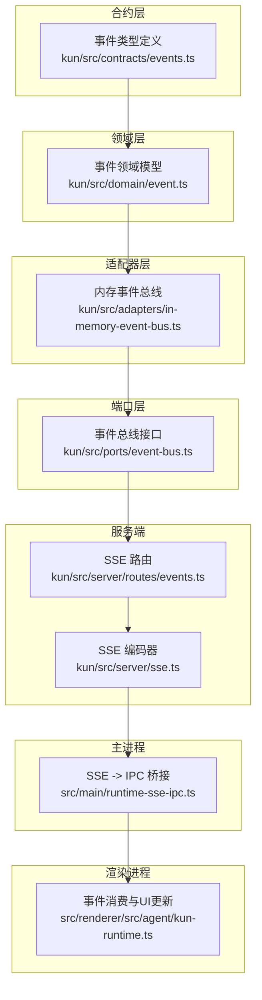
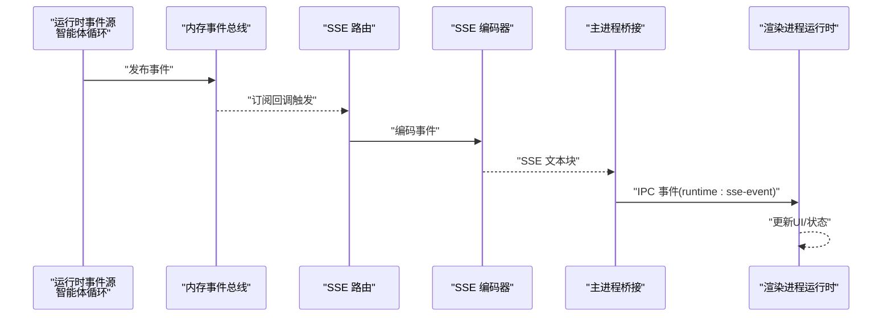
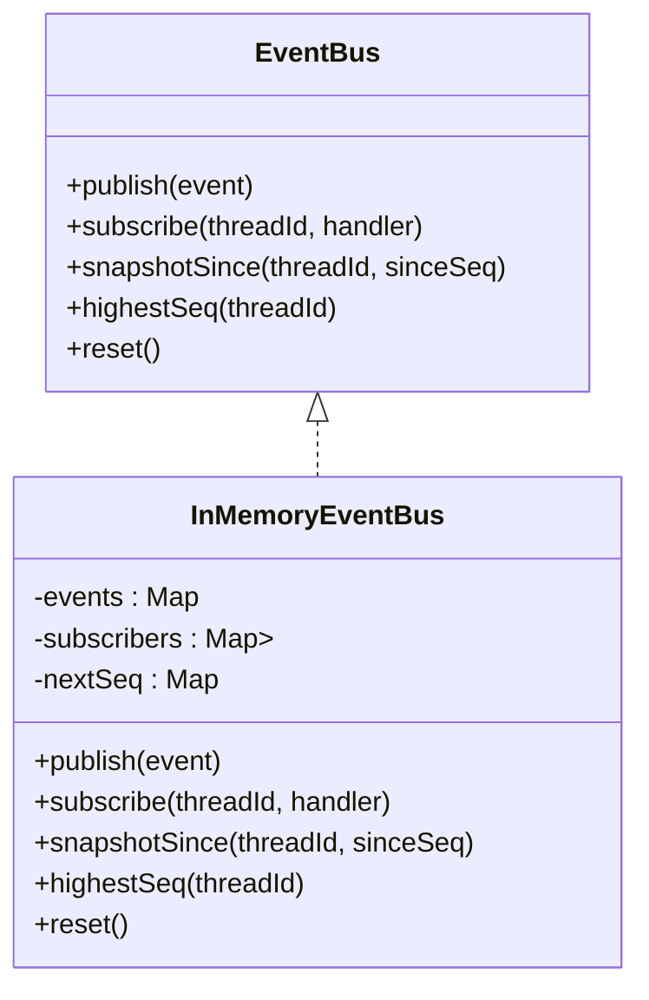
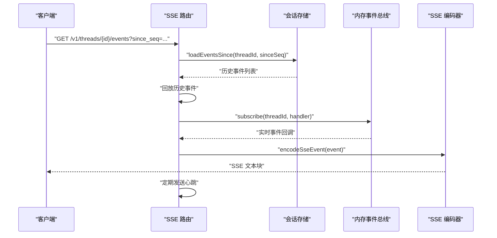
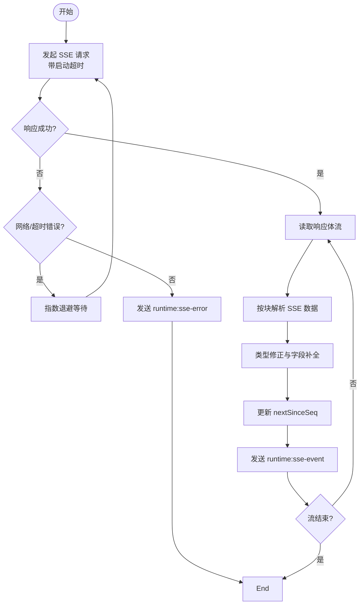
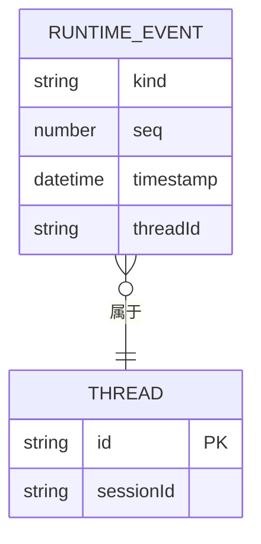
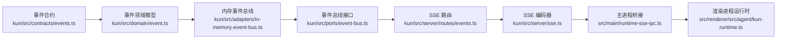

# 事件驱动模式

<cite>
**本文引用的文件**
- [kun/src/adapters/in-memory-event-bus.ts](file://kun/src/adapters/in-memory-event-bus.ts)
- [kun/src/ports/event-bus.ts](file://kun/src/ports/event-bus.ts)
- [kun/src/server/routes/events.ts](file://kun/src/server/routes/events.ts)
- [kun/src/server/sse.ts](file://kun/src/server/sse.ts)
- [src/main/runtime-sse-ipc.ts](file://src/main/runtime-sse-ipc.ts)
- [kun/src/contracts/events.ts](file://kun/src/contracts/events.ts)
- [kun/src/domain/event.ts](file://kun/src/domain/event.ts)
- [kun/src/loop/agent-loop.ts](file://kun/src/loop/agent-loop.ts)
- [src/renderer/src/agent/kun-runtime.ts](file://src/renderer/src/agent/kun-runtime.ts)
</cite>

## 目录
1. [引言](#引言)
2. [项目结构](#项目结构)
3. [核心组件](#核心组件)
4. [架构总览](#架构总览)
5. [详细组件分析](#详细组件分析)
6. [依赖关系分析](#依赖关系分析)
7. [性能考量](#性能考量)
8. [故障排查指南](#故障排查指南)
9. [结论](#结论)
10. [附录](#附录)

## 引言
本文件系统性阐述 DeepSeek GUI 中的事件驱动模式设计与实现，覆盖内存事件总线、服务器推送事件（SSE）与 IPC 事件通信三类机制。文档重点说明事件的发布订阅模型、事件类型定义、事件处理器注册与执行流程，并通过序列图与流程图展示智能体循环中的事件处理、UI 更新的事件驱动机制，以及跨进程事件通信的实现方式。最后总结事件驱动模式如何实现系统的松耦合、异步处理能力与实时响应特性，并给出性能优化与错误处理策略。

## 项目结构
事件驱动相关代码主要分布在以下模块：
- 合约层：事件类型定义
- 领域层：事件领域模型与事件归约器
- 适配器层：内存事件总线（同步发布订阅）
- 端口层：事件总线接口（抽象）
- 服务端：SSE 路由与编码器
- 主进程：SSE 到 IPC 的桥接与重连策略
- 渲染进程：事件消费与 UI 更新

图表来源
- [kun/src/contracts/events.ts](file://kun/src/contracts/events.ts)
- [kun/src/domain/event.ts](file://kun/src/domain/event.ts)
- [kun/src/adapters/in-memory-event-bus.ts](file://kun/src/adapters/in-memory-event-bus.ts)
- [kun/src/ports/event-bus.ts](file://kun/src/ports/event-bus.ts)
- [kun/src/server/routes/events.ts](file://kun/src/server/routes/events.ts)
- [kun/src/server/sse.ts](file://kun/src/server/sse.ts)
- [src/main/runtime-sse-ipc.ts](file://src/main/runtime-sse-ipc.ts)
- [src/renderer/src/agent/kun-runtime.ts](file://src/renderer/src/agent/kun-runtime.ts)

章节来源
- [kun/src/contracts/events.ts](file://kun/src/contracts/events.ts)
- [kun/src/domain/event.ts](file://kun/src/domain/event.ts)
- [kun/src/adapters/in-memory-event-bus.ts](file://kun/src/adapters/in-memory-event-bus.ts)
- [kun/src/ports/event-bus.ts](file://kun/src/ports/event-bus.ts)
- [kun/src/server/routes/events.ts](file://kun/src/server/routes/events.ts)
- [kun/src/server/sse.ts](file://kun/src/server/sse.ts)
- [src/main/runtime-sse-ipc.ts](file://src/main/runtime-sse-ipc.ts)
- [src/renderer/src/agent/kun-runtime.ts](file://src/renderer/src/agent/kun-runtime.ts)

## 核心组件
- 内存事件总线：基于线程维度的同步发布订阅，维护事件列表、订阅者集合与序列号；发布时对订阅者逐一调用并隔离异常，保证发布链路不中断。
- 事件总线接口：抽象出发布、订阅、快照查询、最高序号与重置等能力，便于替换实现。
- SSE 路由：在连接建立时先回放历史事件（按 since_seq），再订阅实时事件流；支持心跳与断开清理。
- SSE 编码器：将事件对象编码为标准 SSE 文本块。
- 主进程桥接：解析 SSE 块，转发为 IPC 事件，内置指数退避重连与错误上报。
- 渲染进程运行时：消费 IPC 事件，驱动 UI 更新与状态管理。

章节来源
- [kun/src/adapters/in-memory-event-bus.ts](file://kun/src/adapters/in-memory-event-bus.ts)
- [kun/src/ports/event-bus.ts](file://kun/src/ports/event-bus.ts)
- [kun/src/server/routes/events.ts](file://kun/src/server/routes/events.ts)
- [kun/src/server/sse.ts](file://kun/src/server/sse.ts)
- [src/main/runtime-sse-ipc.ts](file://src/main/runtime-sse-ipc.ts)
- [src/renderer/src/agent/kun-runtime.ts](file://src/renderer/src/agent/kun-runtime.ts)

## 架构总览
事件驱动架构以“内存事件总线”为核心枢纽，贯穿服务端 SSE 推送与主/渲染进程 IPC 通信，形成从运行时到 UI 的完整事件链路。

图表来源
- [kun/src/adapters/in-memory-event-bus.ts](file://kun/src/adapters/in-memory-event-bus.ts)
- [kun/src/server/routes/events.ts](file://kun/src/server/routes/events.ts)
- [kun/src/server/sse.ts](file://kun/src/server/sse.ts)
- [src/main/runtime-sse-ipc.ts](file://src/main/runtime-sse-ipc.ts)
- [src/renderer/src/agent/kun-runtime.ts](file://src/renderer/src/agent/kun-runtime.ts)

## 详细组件分析

### 内存事件总线（InMemoryEventBus）
- 设计要点
  - 按 threadId 维度隔离事件与订阅者，确保订阅者仅接收对应会话的事件。
  - 发布时遍历订阅者集合，使用 try/catch 隔离订阅者异常，避免影响后续分发。
  - 维护每个 threadId 的事件列表与下一个序列号，支持快照查询与最高序号查询。
- 关键方法
  - publish(event)：入队事件并广播给订阅者。
  - subscribe(threadId, handler)：注册订阅者，返回取消函数。
  - snapshotSince(threadId, sinceSeq)：返回自指定序号之后的所有事件。
  - highestSeq(threadId)：返回当前最高序号。
  - reset()：清空内部状态。
- 复杂度
  - 发布：O(k)，k 为该 threadId 的订阅者数量。
  - 订阅/取消：O(1)。
  - 快照：O(n)，n 为该 threadId 的事件数。

图表来源
- [kun/src/ports/event-bus.ts](file://kun/src/ports/event-bus.ts)
- [kun/src/adapters/in-memory-event-bus.ts](file://kun/src/adapters/in-memory-event-bus.ts)

章节来源
- [kun/src/adapters/in-memory-event-bus.ts](file://kun/src/adapters/in-memory-event-bus.ts)
- [kun/src/ports/event-bus.ts](file://kun/src/ports/event-bus.ts)

### SSE 路由与编码器
- SSE 路由
  - 支持从查询参数或 Last-Event-ID 头部读取 since_seq，用于回放历史事件。
  - 先从会话存储加载 backlog，再订阅内存事件总线，实时推送新事件。
  - 定期发送心跳事件，保持连接活跃。
  - 监听请求的 AbortSignal，在断开或停止时清理订阅与定时器。
- SSE 编码器
  - 将事件对象编码为标准 SSE 文本块，包含 id、event、data 字段。

图表来源
- [kun/src/server/routes/events.ts](file://kun/src/server/routes/events.ts)
- [kun/src/server/sse.ts](file://kun/src/server/sse.ts)
- [kun/src/adapters/in-memory-event-bus.ts](file://kun/src/adapters/in-memory-event-bus.ts)

章节来源
- [kun/src/server/routes/events.ts](file://kun/src/server/routes/events.ts)
- [kun/src/server/sse.ts](file://kun/src/server/sse.ts)

### 主进程 SSE -> IPC 桥接
- 功能概述
  - 解析 SSE 文本块，提取 event、id、data 并进行类型修正。
  - 将事件通过 IPC 发送到渲染进程，事件名为 runtime:sse-event。
  - 实现指数退避重连，区分网络超时与致命错误，向渲染进程发送 runtime:sse-error。
  - 提供 runtime:sse:stop 控制器停止事件流。
- 关键行为
  - 流式读取响应体，按块解析，累积缓冲区处理不完整块。
  - 维护 nextSinceSeq，用于恢复点记录。
  - 在 finally 中发送 runtime:sse-end，清理控制器集合。

图表来源
- [src/main/runtime-sse-ipc.ts](file://src/main/runtime-sse-ipc.ts)

章节来源
- [src/main/runtime-sse-ipc.ts](file://src/main/runtime-sse-ipc.ts)

### 渲染进程事件消费与 UI 更新
- 运行时集成
  - 渲染进程通过运行时客户端订阅 runtime:sse-event，根据事件类型更新 UI 状态与视图。
  - 结合会话/线程上下文，选择性地渲染消息、工具调用结果、使用量统计等。
- 交互与状态
  - 事件驱动的 UI 更新确保界面与后端状态保持一致，同时避免轮询带来的延迟与开销。

章节来源
- [src/renderer/src/agent/kun-runtime.ts](file://src/renderer/src/agent/kun-runtime.ts)

### 事件类型定义与领域模型
- 事件类型定义
  - 事件类型在合约层集中定义，包含 kind、seq、timestamp、threadId 等字段，以及具体事件载荷。
- 领域模型
  - 领域层对事件进行建模，配合事件归约器实现状态演进与副作用控制。
- 智能体循环中的事件
  - 智能体循环在推理、工具调用、输出生成等阶段产生事件，统一经内存事件总线发布。

图表来源
- [kun/src/contracts/events.ts](file://kun/src/contracts/events.ts)
- [kun/src/domain/event.ts](file://kun/src/domain/event.ts)

章节来源
- [kun/src/contracts/events.ts](file://kun/src/contracts/events.ts)
- [kun/src/domain/event.ts](file://kun/src/domain/event.ts)
- [kun/src/loop/agent-loop.ts](file://kun/src/loop/agent-loop.ts)

## 依赖关系分析
- 松耦合
  - 通过 EventBus 接口解耦内存实现与上层逻辑；SSE 路由与主进程桥接均依赖抽象接口。
- 分层清晰
  - 合约层定义事件契约，领域层负责事件语义，适配器层提供可替换实现，端口层暴露能力。
- 可扩展性
  - 新增事件类型只需扩展合约与领域模型；新增订阅者只需实现处理器并注册到总线。

图表来源
- [kun/src/contracts/events.ts](file://kun/src/contracts/events.ts)
- [kun/src/domain/event.ts](file://kun/src/domain/event.ts)
- [kun/src/adapters/in-memory-event-bus.ts](file://kun/src/adapters/in-memory-event-bus.ts)
- [kun/src/ports/event-bus.ts](file://kun/src/ports/event-bus.ts)
- [kun/src/server/routes/events.ts](file://kun/src/server/routes/events.ts)
- [kun/src/server/sse.ts](file://kun/src/server/sse.ts)
- [src/main/runtime-sse-ipc.ts](file://src/main/runtime-sse-ipc.ts)
- [src/renderer/src/agent/kun-runtime.ts](file://src/renderer/src/agent/kun-runtime.ts)

## 性能考量
- 发布性能
  - 发布为 O(k) 复杂度，k 为订阅者数量；建议限制单线程订阅者数量或采用分片订阅。
- 回放与快照
  - 历史回放基于 since_seq 查询，建议在会话存储层实现高效索引与分页。
- 流式解析
  - 主进程采用流式读取与缓冲区拼接，避免一次性加载大块数据；注意内存占用与碎片化。
- 心跳与保活
  - SSE 路由定时发送心跳，降低空闲连接断开概率；渲染侧可根据业务需求调整心跳间隔。
- 错误与重连
  - 指数退避重连避免雪崩效应；对致命错误（如 4xx 非 408/429）直接终止并上报。

## 故障排查指南
- SSE 连接失败
  - 检查路由参数 since_seq 与 Last-Event-ID 是否正确传递；确认会话存储是否返回历史事件。
  - 观察主进程日志中的 runtime:sse-error，定位网络/解析/协议问题。
- 订阅未生效
  - 确认订阅线程 ID 与事件 threadId 一致；检查取消订阅是否提前释放。
- UI 不更新
  - 核对渲染进程是否收到 runtime:sse-event；检查事件 kind 与 UI 映射逻辑。
- 性能问题
  - 监控发布峰值与订阅者数量；评估会话存储回放缓冲区大小与分页策略。

章节来源
- [kun/src/server/routes/events.ts](file://kun/src/server/routes/events.ts)
- [src/main/runtime-sse-ipc.ts](file://src/main/runtime-sse-ipc.ts)
- [src/renderer/src/agent/kun-runtime.ts](file://src/renderer/src/agent/kun-runtime.ts)

## 结论
DeepSeek GUI 的事件驱动模式通过内存事件总线、SSE 与 IPC 的协同，实现了运行时与 UI 的松耦合、异步与实时响应。事件类型在合约层统一定义，领域层承载语义，适配器层提供可替换实现，端口层屏蔽细节，使系统具备良好的可扩展性与可维护性。结合合理的性能优化与错误处理策略，事件驱动模式为复杂 AI 工作流提供了稳定可靠的基础设施。

## 附录
- 事件类型路径参考
  - [事件类型定义](file://kun/src/contracts/events.ts)
  - [事件领域模型](file://kun/src/domain/event.ts)
- 内存事件总线路径参考
  - [内存事件总线实现](file://kun/src/adapters/in-memory-event-bus.ts)
  - [事件总线接口](file://kun/src/ports/event-bus.ts)
- SSE 与 IPC 路径参考
  - [SSE 路由](file://kun/src/server/routes/events.ts)
  - [SSE 编码器](file://kun/src/server/sse.ts)
  - [SSE -> IPC 桥接](file://src/main/runtime-sse-ipc.ts)
- 智能体循环与 UI 更新路径参考
  - [智能体循环](file://kun/src/loop/agent-loop.ts)
  - [渲染进程运行时](file://src/renderer/src/agent/kun-runtime.ts)