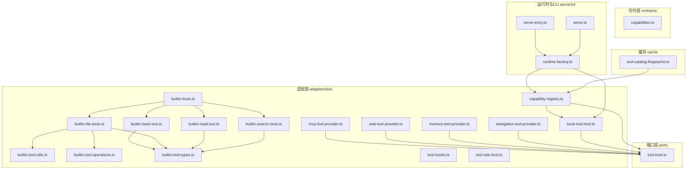
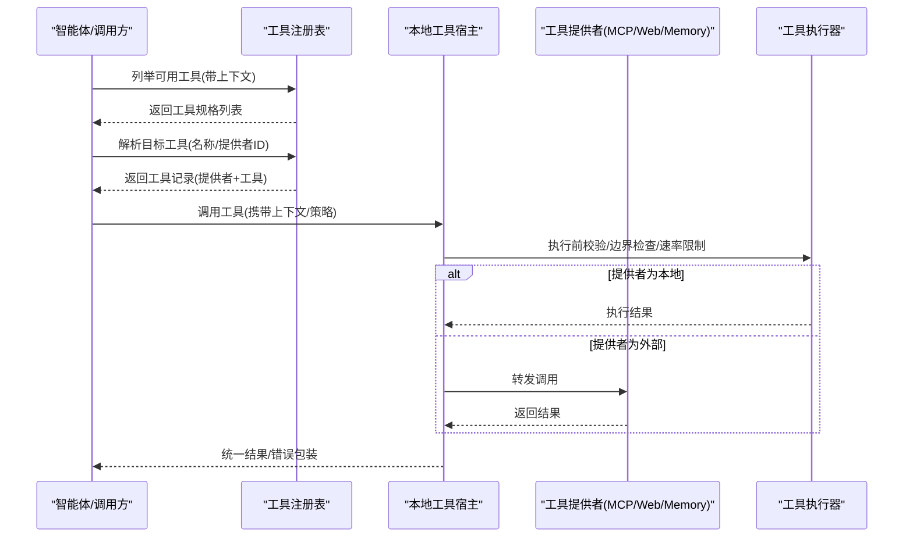
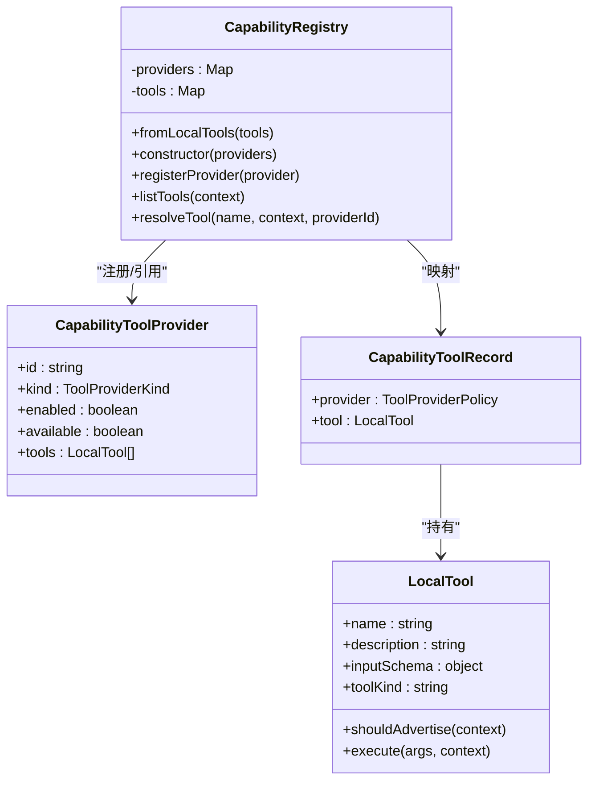
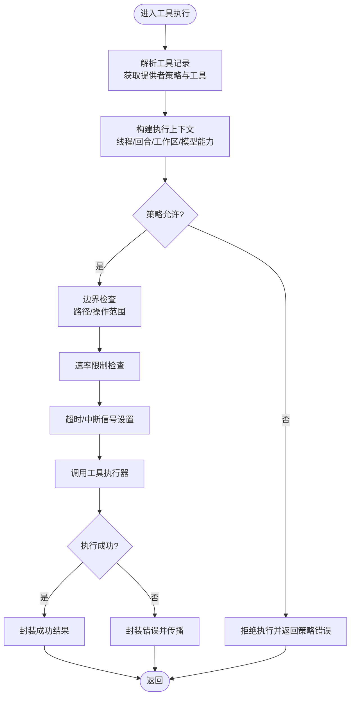
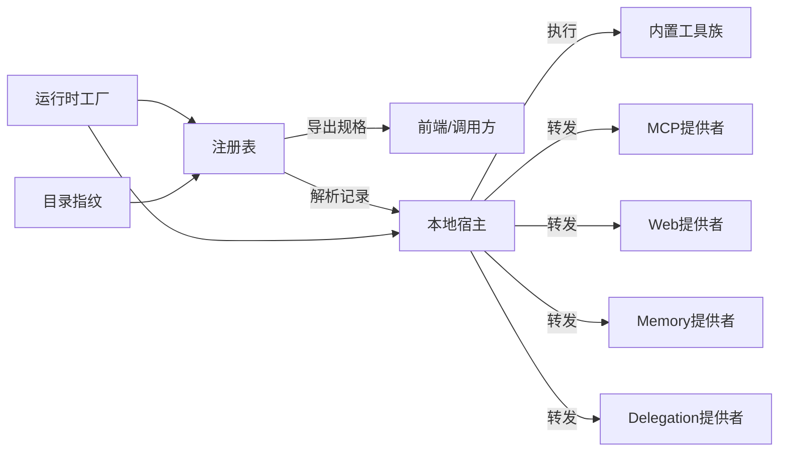

# 工具模式

<cite>
**本文引用的文件**
- [capability-registry.ts](file://kun/src/adapters/tool/capability-registry.ts)
- [local-tool-host.ts](file://kun/src/adapters/tool/local-tool-host.ts)
- [builtin-tools.ts](file://kun/src/adapters/tool/builtin-tools.ts)
- [builtin-bash-tool.ts](file://kun/src/adapters/tool/builtin-bash-tool.ts)
- [builtin-file-tools.ts](file://kun/src/adapters/tool/builtin-file-tools.ts)
- [builtin-read-tool.ts](file://kun/src/adapters/tool/builtin-read-tool.ts)
- [builtin-search-tools.ts](file://kun/src/adapters/tool/builtin-search-tools.ts)
- [builtin-tool-utils.ts](file://kun/src/adapters/tool/builtin-tool-utils.ts)
- [builtin-tool-operations.ts](file://kun/src/adapters/tool/builtin-tool-operations.ts)
- [builtin-tool-types.ts](file://kun/src/adapters/tool/builtin-tool-types.ts)
- [tool-host.ts](file://kun/src/ports/tool-host.ts)
- [tool-hooks.ts](file://kun/src/adapters/tool/tool-hooks.ts)
- [tool-rate-limit.ts](file://kun/src/adapters/tool/tool-rate-limit.ts)
- [mcp-tool-provider.ts](file://kun/src/adapters/tool/mcp-tool-provider.ts)
- [memory-tool-provider.ts](file://kun/src/adapters/tool/memory-tool-provider.ts)
- [web-tool-provider.ts](file://kun/src/adapters/tool/web-tool-provider.ts)
- [delegation-tool-provider.ts](file://kun/src/adapters/tool/delegation-tool-provider.ts)
- [tool-catalog-fingerprint.ts](file://kun/src/cache/tool-catalog-fingerprint.ts)
- [tool-call-repair.ts](file://kun/src/loop/tool-call-repair.ts)
- [tool-storm-breaker.ts](file://kun/src/loop/tool-storm-breaker.ts)
- [index.ts](file://kun/src/adapters/tool/index.ts)
- [index.ts](file://kun/src/adapters/index.ts)
- [capabilities.ts](file://kun/src/contracts/capabilities.ts)
- [runtime-factory.ts](file://kun/src/server/runtime-factory.ts)
- [serve-entry.ts](file://kun/src/cli/serve-entry.ts)
- [serve.ts](file://kun/src/cli/serve.ts)
- [kun-config.ts](file://kun/src/config/kun-config.ts)
- [kun-config.test.ts](file://kun/src/config/kun-config.test.ts)
- [capability-registry.test.ts](file://kun/tests/capability-registry.test.ts)
- [builtin-tools.test.ts](file://kun/tests/builtin-tools.test.ts)
- [mcp-tool-provider.test.ts](file://kun/tests/mcp-tool-provider.test.ts)
- [web-tool-provider.test.ts](file://kun/tests/web-tool-provider.test.ts)
</cite>

## 目录
1. [引言](#引言)
2. [项目结构](#项目结构)
3. [核心组件](#核心组件)
4. [架构总览](#架构总览)
5. [详细组件分析](#详细组件分析)
6. [依赖关系分析](#依赖关系分析)
7. [性能考量](#性能考量)
8. [故障排查指南](#故障排查指南)
9. [结论](#结论)
10. [附录](#附录)

## 引言
本文件系统化阐述 DeepSeek GUI 中“工具模式”的架构与实现，覆盖工具注册机制、工具执行流程、能力管理与安全隔离、错误处理策略，并给出内置工具的实现范式、工具注册表工作原理、本地工具宿主管理机制，以及第三方工具（如 MCP/Web/Memory/Delegation）的集成路径。文档同时总结性能优化策略与最佳实践，帮助开发者在不牺牲安全性与稳定性的前提下扩展智能体的工具能力。

## 项目结构
工具系统主要位于后端运行时模块 kun 中，核心文件组织如下：
- 适配层（adapters/tool）：工具定义、注册、宿主、内置工具实现、MCP/Web/Memory/Delegation 提供者
- 合约层（contracts）：能力描述等协议定义
- 端口层（ports）：工具宿主接口规范
- 缓存层（cache）：工具目录指纹等缓存策略
- 运行时与 CLI（server、cli）：工具能力暴露、运行时工厂、服务入口
- 测试（tests）：工具注册、内置工具、MCP/Web 提供者的单元测试

图表来源
- [capability-registry.ts:1-86](file://kun/src/adapters/tool/capability-registry.ts#L1-L86)
- [local-tool-host.ts](file://kun/src/adapters/tool/local-tool-host.ts)
- [builtin-tools.ts:1-13](file://kun/src/adapters/tool/builtin-tools.ts#L1-L13)
- [builtin-bash-tool.ts:1-200](file://kun/src/adapters/tool/builtin-bash-tool.ts#L1-L200)
- [builtin-file-tools.ts:1-200](file://kun/src/adapters/tool/builtin-file-tools.ts#L1-L200)
- [builtin-read-tool.ts:1-200](file://kun/src/adapters/tool/builtin-read-tool.ts#L1-L200)
- [builtin-search-tools.ts:1-200](file://kun/src/adapters/tool/builtin-search-tools.ts#L1-L200)
- [builtin-tool-utils.ts:1-200](file://kun/src/adapters/tool/builtin-tool-utils.ts#L1-L200)
- [builtin-tool-operations.ts:1-200](file://kun/src/adapters/tool/builtin-tool-operations.ts#L1-L200)
- [builtin-tool-types.ts:1-200](file://kun/src/adapters/tool/builtin-tool-types.ts#L1-L200)
- [mcp-tool-provider.ts:1-200](file://kun/src/adapters/tool/mcp-tool-provider.ts#L1-L200)
- [web-tool-provider.ts:1-200](file://kun/src/adapters/tool/web-tool-provider.ts#L1-L200)
- [memory-tool-provider.ts:1-200](file://kun/src/adapters/tool/memory-tool-provider.ts#L1-L200)
- [delegation-tool-provider.ts:1-200](file://kun/src/adapters/tool/delegation-tool-provider.ts#L1-L200)
- [tool-host.ts:1-200](file://kun/src/ports/tool-host.ts#L1-L200)
- [capabilities.ts:1-200](file://kun/src/contracts/capabilities.ts#L1-L200)
- [tool-catalog-fingerprint.ts:1-200](file://kun/src/cache/tool-catalog-fingerprint.ts#L1-L200)
- [runtime-factory.ts:1-200](file://kun/src/server/runtime-factory.ts#L1-L200)
- [serve-entry.ts:1-200](file://kun/src/cli/serve-entry.ts#L1-L200)
- [serve.ts:1-200](file://kun/src/cli/serve.ts#L1-L200)

章节来源
- [index.ts:1-200](file://kun/src/adapters/tool/index.ts#L1-L200)
- [index.ts:1-200](file://kun/src/adapters/index.ts#L1-L200)

## 核心组件
- 工具注册表（CapabilityRegistry）：集中管理工具提供者与工具条目，负责去重校验、能力过滤、工具规格导出与解析定位
- 本地工具宿主（LocalToolHost）：承载工具生命周期、执行上下文、策略控制与边界保护
- 内置工具族（Builtin Tools）：文件读写、搜索、命令执行、编辑等常用工具的实现与编排
- 工具提供者（Providers）：MCP/Web/Memory/Delegation 等外部或代理工具能力的桥接
- 端口与合约（Tool Host、Capabilities）：统一工具接口契约与能力描述协议
- 运行时与缓存（Runtime Factory、Catalog Fingerprint）：工具目录与能力暴露、缓存优化

章节来源
- [capability-registry.ts:26-86](file://kun/src/adapters/tool/capability-registry.ts#L26-L86)
- [local-tool-host.ts](file://kun/src/adapters/tool/local-tool-host.ts)
- [builtin-tools.ts:1-13](file://kun/src/adapters/tool/builtin-tools.ts#L1-L13)
- [tool-host.ts:1-200](file://kun/src/ports/tool-host.ts#L1-L200)
- [capabilities.ts:1-200](file://kun/src/contracts/capabilities.ts#L1-L200)
- [tool-catalog-fingerprint.ts:1-200](file://kun/src/cache/tool-catalog-fingerprint.ts#L1-L200)

## 架构总览
工具模式采用“注册表 + 宿主 + 多提供者”的分层架构：
- 注册表统一收集与校验工具，按上下文过滤并导出工具规格
- 宿主负责执行策略、边界与安全隔离、错误处理
- 提供者将外部能力（MCP/Web/Memory/Delegation）以统一接口接入
- 运行时通过工厂创建并注入工具能力，CLI 提供启动入口

图表来源
- [capability-registry.ts:61-86](file://kun/src/adapters/tool/capability-registry.ts#L61-L86)
- [local-tool-host.ts](file://kun/src/adapters/tool/local-tool-host.ts)
- [mcp-tool-provider.ts:1-200](file://kun/src/adapters/tool/mcp-tool-provider.ts#L1-L200)
- [web-tool-provider.ts:1-200](file://kun/src/adapters/tool/web-tool-provider.ts#L1-L200)
- [memory-tool-provider.ts:1-200](file://kun/src/adapters/tool/memory-tool-provider.ts#L1-L200)

## 详细组件分析

### 工具注册表（CapabilityRegistry）
职责与特性
- 提供者注册：去重校验、工具名去重、记录映射
- 工具列举：根据上下文过滤（启用状态、策略、广告开关）
- 工具解析：按名称与可选提供者ID解析到具体工具记录
- 规格导出：输出标准化工具规格（名称、描述、输入模式、工具类型、提供者信息）

关键数据结构
- 记录项：包含提供者策略与本地工具实例
- 规格项：标准化导出字段，便于前端/调用方消费

图表来源
- [capability-registry.ts:8-86](file://kun/src/adapters/tool/capability-registry.ts#L8-L86)

章节来源
- [capability-registry.ts:26-86](file://kun/src/adapters/tool/capability-registry.ts#L26-L86)
- [capability-registry.test.ts:1-69](file://kun/tests/capability-registry.test.ts#L1-L69)

### 本地工具宿主（LocalToolHost）
职责与特性
- 工具定义与执行：定义工具签名、执行上下文、策略与边界
- 上下文驱动：基于线程/回合/工作区/模型能力等上下文进行策略决策
- 安全边界：工作区路径解析、操作边界封装、超时与中断信号
- 错误处理：统一异常捕获、错误归因与返回格式化

内置工具族（文件、读取、搜索、命令）
- 文件工具：读取、写入、编辑、列出、查找、匹配等
- 读取工具：文本切片、编码处理、内容截断
- 搜索工具：文件名/内容检索、正则匹配
- 命令工具：安全的进程执行、超时控制、输出截断

图表来源
- [local-tool-host.ts](file://kun/src/adapters/tool/local-tool-host.ts)
- [builtin-file-tools.ts:1-200](file://kun/src/adapters/tool/builtin-file-tools.ts#L1-L200)
- [builtin-read-tool.ts:1-200](file://kun/src/adapters/tool/builtin-read-tool.ts#L1-L200)
- [builtin-search-tools.ts:1-200](file://kun/src/adapters/tool/builtin-search-tools.ts#L1-L200)
- [builtin-bash-tool.ts:1-200](file://kun/src/adapters/tool/builtin-bash-tool.ts#L1-L200)
- [builtin-tool-utils.ts:1-200](file://kun/src/adapters/tool/builtin-tool-utils.ts#L1-L200)
- [builtin-tool-operations.ts:1-200](file://kun/src/adapters/tool/builtin-tool-operations.ts#L1-L200)
- [builtin-tool-types.ts:1-200](file://kun/src/adapters/tool/builtin-tool-types.ts#L1-L200)

章节来源
- [local-tool-host.ts](file://kun/src/adapters/tool/local-tool-host.ts)
- [builtin-tools.ts:1-13](file://kun/src/adapters/tool/builtin-tools.ts#L1-L13)
- [builtin-file-tools.ts:1-200](file://kun/src/adapters/tool/builtin-file-tools.ts#L1-L200)
- [builtin-read-tool.ts:1-200](file://kun/src/adapters/tool/builtin-read-tool.ts#L1-L200)
- [builtin-search-tools.ts:1-200](file://kun/src/adapters/tool/builtin-search-tools.ts#L1-L200)
- [builtin-bash-tool.ts:1-200](file://kun/src/adapters/tool/builtin-bash-tool.ts#L1-L200)
- [builtin-tool-utils.ts:1-200](file://kun/src/adapters/tool/builtin-tool-utils.ts#L1-L200)
- [builtin-tool-operations.ts:1-200](file://kun/src/adapters/tool/builtin-tool-operations.ts#L1-L200)
- [builtin-tool-types.ts:1-200](file://kun/src/adapters/tool/builtin-tool-types.ts#L1-L200)

### 工具接口标准化与能力管理
- 接口契约：工具具备名称、描述、输入模式、工具类型、执行函数与可选广告开关
- 能力描述：通过标准化规格导出，前端与调用方可一致消费
- 策略与上下文：提供者策略、内存/授权策略、委托策略、模型能力等影响工具可用性与行为

章节来源
- [tool-host.ts:1-200](file://kun/src/ports/tool-host.ts#L1-L200)
- [capabilities.ts:1-200](file://kun/src/contracts/capabilities.ts#L1-L200)
- [capability-registry.ts:17-24](file://kun/src/adapters/tool/capability-registry.ts#L17-L24)

### 工具发现与加载机制
- 发现：注册表按上下文过滤后导出工具规格
- 加载：宿主解析工具记录，结合策略与边界进行加载与准备
- 外部提供者：MCP/Web/Memory/Delegation 通过各自提供者桥接至统一接口

章节来源
- [capability-registry.ts:61-86](file://kun/src/adapters/tool/capability-registry.ts#L61-L86)
- [mcp-tool-provider.ts:1-200](file://kun/src/adapters/tool/mcp-tool-provider.ts#L1-L200)
- [web-tool-provider.ts:1-200](file://kun/src/adapters/tool/web-tool-provider.ts#L1-L200)
- [memory-tool-provider.ts:1-200](file://kun/src/adapters/tool/memory-tool-provider.ts#L1-L200)
- [delegation-tool-provider.ts:1-200](file://kun/src/adapters/tool/delegation-tool-provider.ts#L1-L200)

### 工具执行的安全隔离与错误处理
- 安全隔离：工作区边界、路径解析、操作白名单、超时与中断
- 错误处理：统一异常捕获、策略拒绝、上下文取消、结果包装
- 边界保护：工具钩子、速率限制、风暴防护（避免过度调用）

章节来源
- [builtin-tool-utils.ts:1-200](file://kun/src/adapters/tool/builtin-tool-utils.ts#L1-L200)
- [tool-hooks.ts:1-200](file://kun/src/adapters/tool/tool-hooks.ts#L1-L200)
- [tool-rate-limit.ts:1-200](file://kun/src/adapters/tool/tool-rate-limit.ts#L1-L200)
- [tool-storm-breaker.ts:1-200](file://kun/src/loop/tool-storm-breaker.ts#L1-L200)

### 第三方工具集成（MCP/Web/Memory/Delegation）
- MCP：通过 MCP 工具提供者对接外部 MCP 服务器，实现跨语言/跨进程工具能力
- Web：通过 Web 提供者发起 HTTP 请求，适配 REST 风格工具
- Memory：通过内存提供者访问会话/线程级内存数据
- Delegation：通过委托提供者将复杂任务委派给子智能体

章节来源
- [mcp-tool-provider.ts:1-200](file://kun/src/adapters/tool/mcp-tool-provider.ts#L1-L200)
- [web-tool-provider.ts:1-200](file://kun/src/adapters/tool/web-tool-provider.ts#L1-L200)
- [memory-tool-provider.ts:1-200](file://kun/src/adapters/tool/memory-tool-provider.ts#L1-L200)
- [delegation-tool-provider.ts:1-200](file://kun/src/adapters/tool/delegation-tool-provider.ts#L1-L200)

### 运行时与配置
- 运行时工厂：创建并注入工具能力，连接注册表与宿主
- CLI 入口：提供服务启动与工具能力暴露
- 配置：工具能力开关、策略与安全参数

章节来源
- [runtime-factory.ts:1-200](file://kun/src/server/runtime-factory.ts#L1-L200)
- [serve-entry.ts:1-200](file://kun/src/cli/serve-entry.ts#L1-L200)
- [serve.ts:1-200](file://kun/src/cli/serve.ts#L1-L200)
- [kun-config.ts:1-200](file://kun/src/config/kun-config.ts#L1-L200)
- [kun-config.test.ts:1-200](file://kun/src/config/kun-config.test.ts#L1-L200)

## 依赖关系分析
- 低耦合高内聚：注册表仅依赖工具与提供者策略；宿主独立于具体工具实现
- 可插拔提供者：MCP/Web/Memory/Delegation 提供者均实现统一接口
- 缓存优化：工具目录指纹用于快速检测变更，减少重复计算

图表来源
- [capability-registry.ts:61-86](file://kun/src/adapters/tool/capability-registry.ts#L61-L86)
- [local-tool-host.ts](file://kun/src/adapters/tool/local-tool-host.ts)
- [mcp-tool-provider.ts:1-200](file://kun/src/adapters/tool/mcp-tool-provider.ts#L1-L200)
- [web-tool-provider.ts:1-200](file://kun/src/adapters/tool/web-tool-provider.ts#L1-L200)
- [memory-tool-provider.ts:1-200](file://kun/src/adapters/tool/memory-tool-provider.ts#L1-L200)
- [delegation-tool-provider.ts:1-200](file://kun/src/adapters/tool/delegation-tool-provider.ts#L1-L200)
- [runtime-factory.ts:1-200](file://kun/src/server/runtime-factory.ts#L1-L200)
- [tool-catalog-fingerprint.ts:1-200](file://kun/src/cache/tool-catalog-fingerprint.ts#L1-L200)

章节来源
- [capability-registry.ts:26-86](file://kun/src/adapters/tool/capability-registry.ts#L26-L86)
- [local-tool-host.ts](file://kun/src/adapters/tool/local-tool-host.ts)
- [runtime-factory.ts:1-200](file://kun/src/server/runtime-factory.ts#L1-L200)
- [tool-catalog-fingerprint.ts:1-200](file://kun/src/cache/tool-catalog-fingerprint.ts#L1-L200)

## 性能考量
- 工具目录指纹：通过指纹快速判断工具目录变化，避免重复扫描与规格重建
- 速率限制：对工具调用频率进行限制，防止资源争用与风暴效应
- 超时与中断：为工具执行设置超时与中断信号，避免阻塞与资源泄漏
- 结果截断与压缩：对大输出进行截断与压缩，降低传输与渲染成本
- 执行修复与风暴防护：在工具调用失败或异常时进行修复与限流，提升鲁棒性

章节来源
- [tool-catalog-fingerprint.ts:1-200](file://kun/src/cache/tool-catalog-fingerprint.ts#L1-L200)
- [tool-rate-limit.ts:1-200](file://kun/src/adapters/tool/tool-rate-limit.ts#L1-L200)
- [tool-call-repair.ts:1-200](file://kun/src/loop/tool-call-repair.ts#L1-L200)
- [tool-storm-breaker.ts:1-200](file://kun/src/loop/tool-storm-breaker.ts#L1-L200)

## 故障排查指南
常见问题与定位建议
- 工具不可见或被隐藏：检查注册表是否正确注册、提供者是否启用、工具广告开关与上下文过滤条件
- 执行被拒绝：检查策略配置（自动/需要审批）、内存/授权/委托策略
- 路径越界或权限错误：检查工作区边界与路径解析逻辑
- 超时或中断：检查超时阈值与中断信号传递
- 第三方提供者失败：检查 MCP/Web/Memory/Delegation 提供者连通性与认证

章节来源
- [capability-registry.test.ts:1-69](file://kun/tests/capability-registry.test.ts#L1-L69)
- [builtin-tools.test.ts:1-200](file://kun/tests/builtin-tools.test.ts#L1-L200)
- [mcp-tool-provider.test.ts:1-200](file://kun/tests/mcp-tool-provider.test.ts#L1-L200)
- [web-tool-provider.test.ts:1-200](file://kun/tests/web-tool-provider.test.ts#L1-L200)

## 结论
工具模式通过“注册表 + 宿主 + 多提供者”的架构实现了工具能力的可扩展性与安全性。内置工具族提供了高频场景的即用能力，注册表与宿主确保了统一的接口、策略与边界控制，第三方提供者则开放了生态集成空间。配合缓存、速率限制、风暴防护与执行修复等机制，工具系统在保证稳定性的同时兼顾性能与可维护性。

## 附录
- 内置工具实现范式：参考文件工具族的定义与边界封装，遵循输入模式、执行上下文、边界保护与错误包装
- 工具注册表工作原理：参考注册表的去重校验、上下文过滤与规格导出
- 本地工具宿主管理机制：参考宿主的策略控制、超时与中断、钩子与速率限制
- 第三方工具集成：参考 MCP/Web/Memory/Delegation 提供者的桥接实现