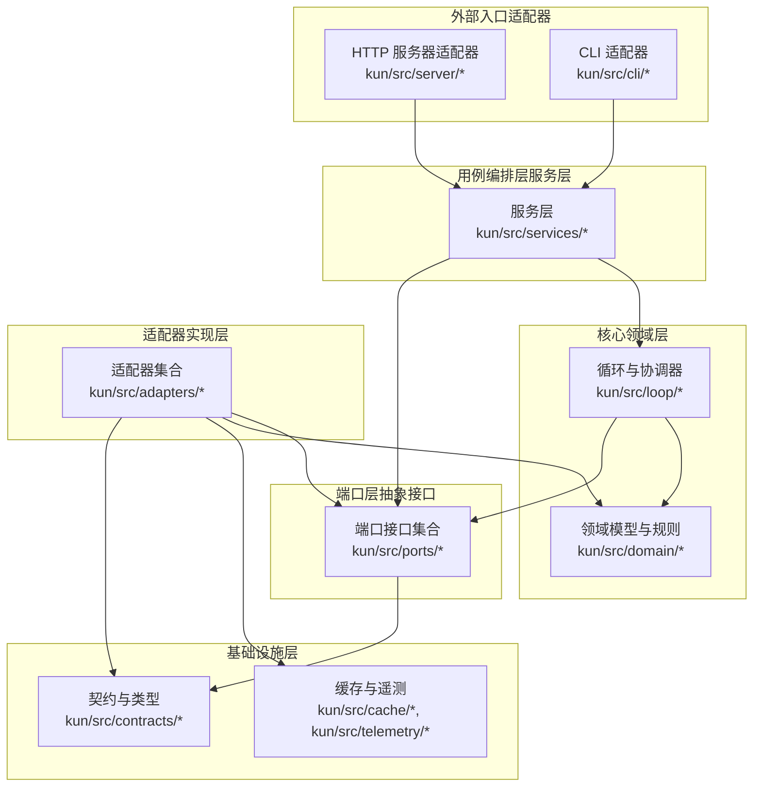
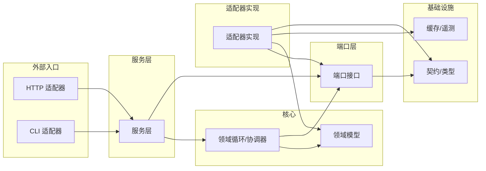
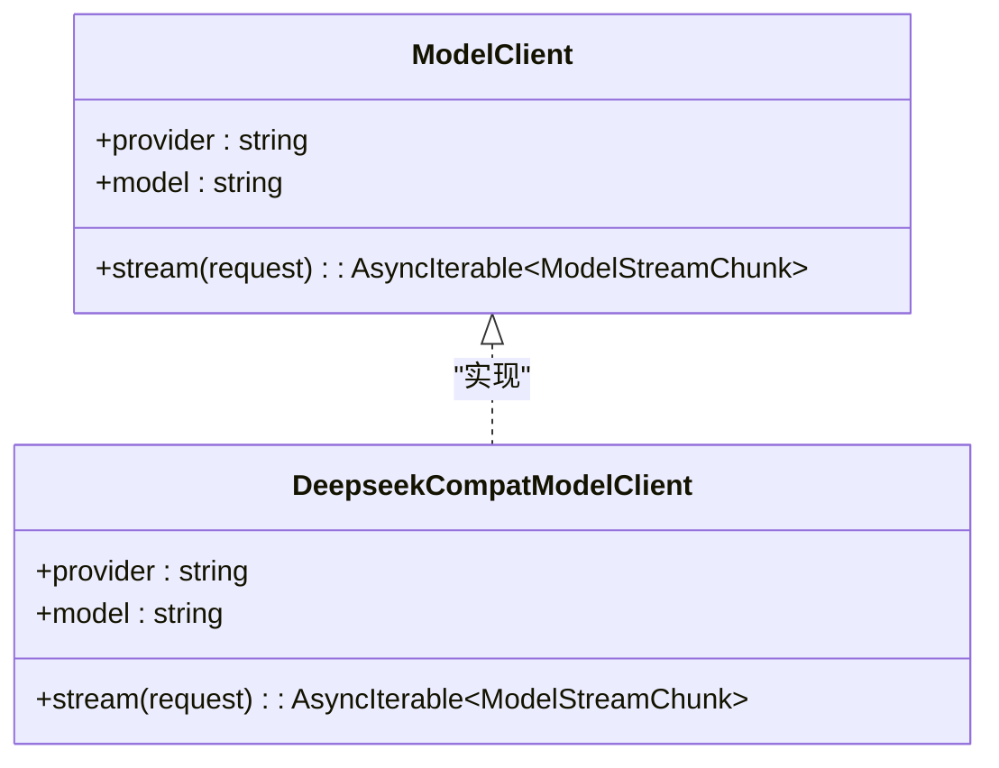
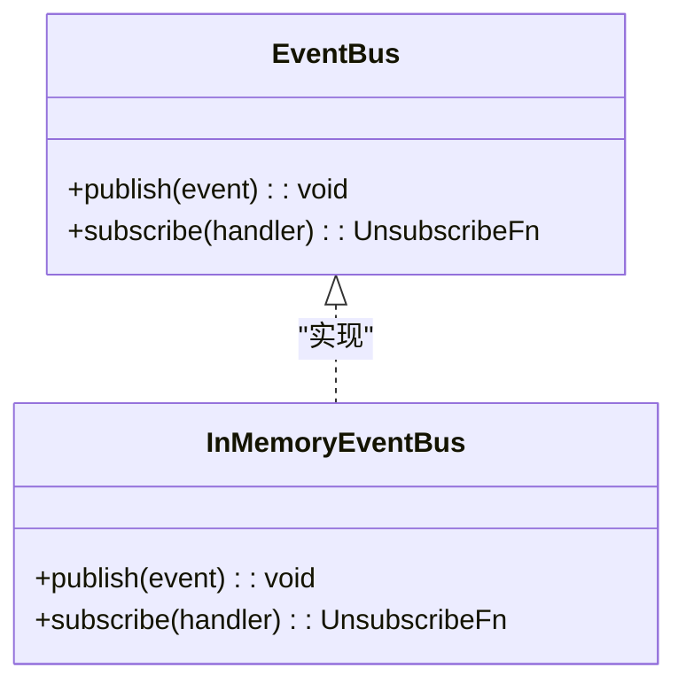
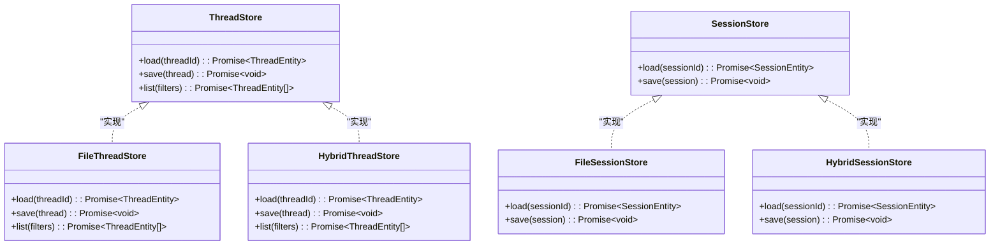
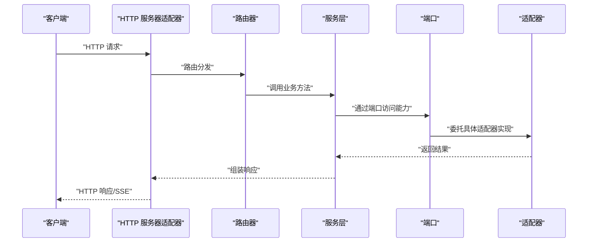
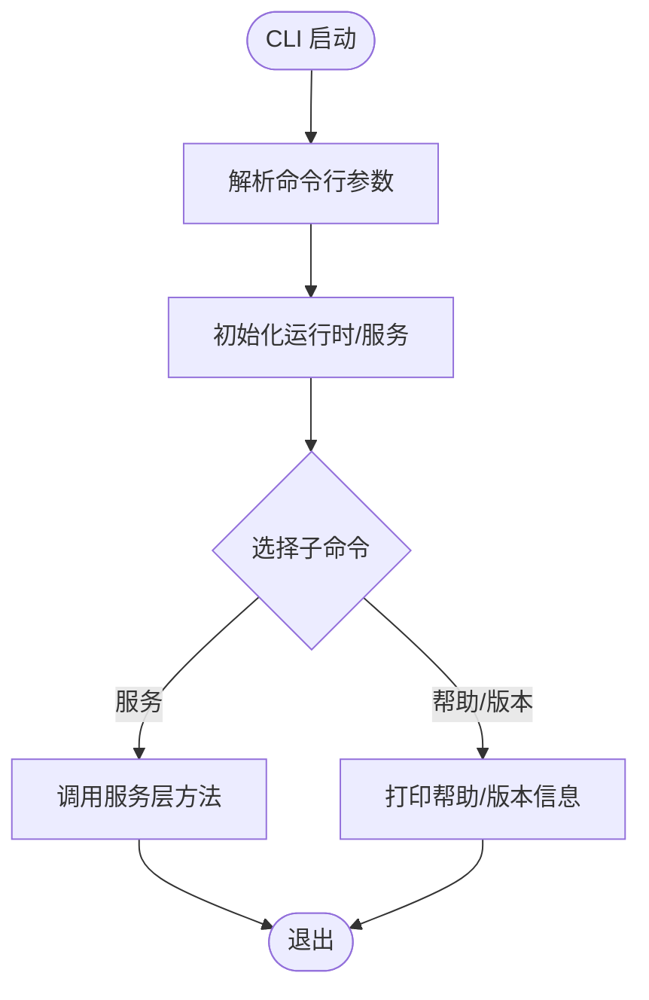
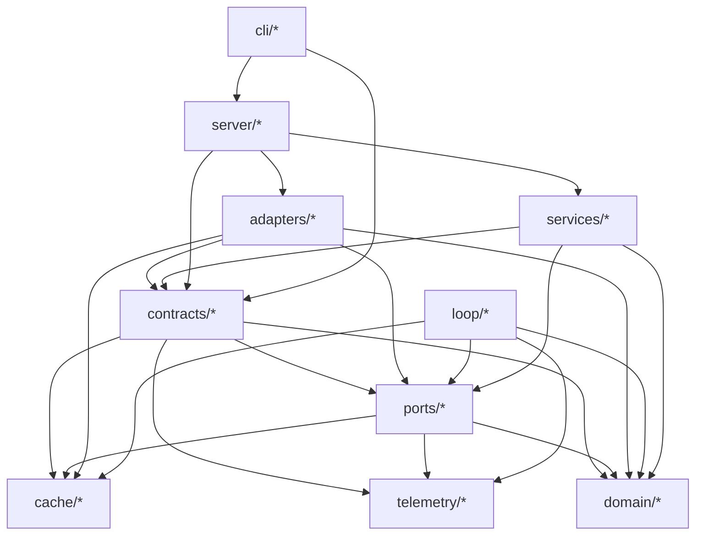

# 端口-适配器模式

<cite>
**本文引用的文件**
- [kun-contributing.md](file://docs/kun-contributing.md)
- [kun-contributing.en.md](file://docs/kun-contributing.en.md)
- [model-client.ts](file://kun/src/ports/model-client.ts)
- [deepseek-compat-model-client.ts](file://kun/src/adapters/model/deepseek-compat-model-client.ts)
- [in-memory-event-bus.ts](file://kun/src/adapters/in-memory-event-bus.ts)
- [event-bus.ts](file://kun/src/ports/event-bus.ts)
- [thread-store.ts](file://kun/src/ports/thread-store.ts)
- [session-store.ts](file://kun/src/ports/session-store.ts)
- [file-thread-store.ts](file://kun/src/adapters/file/file-thread-store.ts)
- [file-session-store.ts](file://kun/src/adapters/file/file-session-store.ts)
- [hybrid-thread-store.ts](file://kun/src/adapters/hybrid/hybrid-thread-store.ts)
- [hybrid-session-store.ts](file://kun/src/adapters/hybrid/hybrid-session-store.ts)
- [http-server.ts](file://kun/src/server/http-server.ts)
- [node-http-server.ts](file://kun/src/server/node-http-server.ts)
- [router.ts](file://kun/src/server/router.ts)
- [serve.ts](file://kun/src/cli/serve.ts)
- [agent-cli.ts](file://kun/src/cli/agent-cli.ts)
- [runtime-factory.ts](file://kun/src/server/runtime-factory.ts)
- [events.ts](file://kun/src/server/routes/events.ts)
- [threads.ts](file://kun/src/server/routes/threads.ts)
- [sessions.ts](file://kun/src/server/routes/sessions.ts)
- [usage.ts](file://kun/src/server/routes/usage.ts)
- [health.ts](file://kun/src/server/routes/health.ts)
- [ports.test.ts](file://kun/tests/ports.test.ts)
- [http-server.test.ts](file://kun/tests/http-server.test.ts)
- [http-server-test-harness.ts](file://kun/tests/http-server-test-harness.ts)
</cite>

## 目录
1. [引言](#引言)
2. [项目结构](#项目结构)
3. [核心组件](#核心组件)
4. [架构总览](#架构总览)
5. [详细组件分析](#详细组件分析)
6. [依赖关系分析](#依赖关系分析)
7. [性能考量](#性能考量)
8. [故障排查指南](#故障排查指南)
9. [结论](#结论)
10. [附录](#附录)

## 引言
本文件系统化阐述 DeepSeek GUI 项目中“端口-适配器”（Ports & Adapters，亦称六边形架构）在 Kun 子系统内的落地实践。重点说明：
- 端口（Ports）：定义业务能力的抽象接口层，隔离外部依赖，确保领域层与基础设施层解耦；
- 适配器（Adapters）：具体实现层，负责对接真实外部系统（HTTP、CLI、文件系统、模型服务等），并以最小侵入的方式接入端口契约；
- 通过端口定义业务规则，通过适配器实现外部系统集成，从而提升系统的可测试性、可替换性与可维护性。

## 项目结构
Kun 的目录即六边形的物理布局：外部适配器位于最外层，向内依次为用例编排层、领域层、端口层、基础设施层；端口层之上再由适配器层提供具体实现，最终通过服务层与 HTTP/CLI 入口对外提供能力。

图表来源
- [kun-contributing.md:28-158](file://docs/kun-contributing.md#L28-L158)

章节来源
- [kun-contributing.md:28-158](file://docs/kun-contributing.md#L28-L158)

## 核心组件
- 端口（Ports）：以纯 TypeScript 接口形式定义系统对外能力边界，如模型客户端、事件总线、会话/线程存储、工作区检查器等。端口层不包含任何具体实现，仅描述“调用者拥有什么、调用方承诺什么”，确保领域层与基础设施解耦。
- 适配器（Adapters）：面向端口的具体实现，如文件系统存储、内存事件总线、DeepSeek 兼容模型客户端、本地工具宿主等。通过组合注入端口，实现对真实外部系统的集成。
- 服务层（Services）：用例编排层，协调端口与领域逻辑，组织事务脚本式流程。
- 领域层（Domain）：核心业务规则与状态机，保持纯函数与不可变数据处理，避免直接依赖外部系统。
- 基础设施层（Infrastructure）：缓存、遥测、契约类型等，向上游提供通用能力，向下不反向依赖。

章节来源
- [kun-contributing.md:116-158](file://docs/kun-contributing.md#L116-L158)

## 架构总览
下图展示了“端口-适配器”在系统中的交互关系与依赖方向：自顶向下依赖，端口层之上由适配器实现，服务层与领域层仅依赖端口与契约，保证测试友好与替换自由。

图表来源
- [kun-contributing.md:80-93](file://docs/kun-contributing.md#L80-L93)

章节来源
- [kun-contributing.md:80-93](file://docs/kun-contributing.md#L80-L93)

## 详细组件分析

### 模型客户端端口与适配器
- 端口定义：模型客户端接口抽象了“提供方标识”“模型标识”以及“流式请求”的统一能力，确保领域层与具体模型供应商解耦。
- 适配器实现：DeepSeek 兼容模型客户端适配器将 HTTP+SSE 响应解析为流式分片序列，满足端口契约。
- 测试策略：通过构造“假模型”注入到循环中进行无网络测试，验证端口契约与业务流程。

图表来源
- [model-client.ts:127-135](file://kun/src/ports/model-client.ts#L127-L135)
- [deepseek-compat-model-client.ts:1-50](file://kun/src/adapters/model/deepseek-compat-model-client.ts#L1-L50)

章节来源
- [kun-contributing.md:125-148](file://docs/kun-contributing.md#L125-L148)
- [model-client.ts:127-135](file://kun/src/ports/model-client.ts#L127-L135)
- [deepseek-compat-model-client.ts:1-50](file://kun/src/adapters/model/deepseek-compat-model-client.ts#L1-L50)

### 事件总线端口与适配器
- 端口定义：事件总线端口抽象发布/订阅能力，领域层通过统一接口产生事件，避免直接依赖具体消息系统。
- 适配器实现：内存事件总线适配器基于内存存储实现发布/订阅，便于测试与快速开发。
- 使用场景：在代理循环中实际发出事件，HTTP 路由层将其编码为 SSE 输出。

图表来源
- [event-bus.ts:1-50](file://kun/src/ports/event-bus.ts#L1-L50)
- [in-memory-event-bus.ts:1-80](file://kun/src/adapters/in-memory-event-bus.ts#L1-L80)

章节来源
- [kun-contributing.md:116-158](file://docs/kun-contributing.md#L116-L158)
- [event-bus.ts:1-50](file://kun/src/ports/event-bus.ts#L1-L50)
- [in-memory-event-bus.ts:1-80](file://kun/src/adapters/in-memory-event-bus.ts#L1-L80)

### 会话与线程存储端口与适配器
- 端口定义：会话存储与线程存储端口分别抽象会话与线程的持久化能力，确保领域层不感知存储细节。
- 适配器实现：
  - 文件存储适配器：基于文件系统实现持久化，适合本地开发与简单部署；
  - 混合存储适配器：结合内存与文件的混合策略，兼顾性能与持久化需求。
- 切换策略：通过启动配置在运行时切换不同存储适配器，不影响领域与服务层。

图表来源
- [thread-store.ts:1-60](file://kun/src/ports/thread-store.ts#L1-L60)
- [session-store.ts:1-60](file://kun/src/ports/session-store.ts#L1-L60)
- [file-thread-store.ts:1-120](file://kun/src/adapters/file/file-thread-store.ts#L1-L120)
- [file-session-store.ts:1-120](file://kun/src/adapters/file/file-session-store.ts#L1-L120)
- [hybrid-thread-store.ts:1-120](file://kun/src/adapters/hybrid/hybrid-thread-store.ts#L1-L120)
- [hybrid-session-store.ts:1-120](file://kun/src/adapters/hybrid/hybrid-session-store.ts#L1-L120)

章节来源
- [kun-contributing.md:534-546](file://docs/kun-contributing.md#L534-L546)
- [thread-store.ts:1-60](file://kun/src/ports/thread-store.ts#L1-L60)
- [session-store.ts:1-60](file://kun/src/ports/session-store.ts#L1-L60)
- [file-thread-store.ts:1-120](file://kun/src/adapters/file/file-thread-store.ts#L1-L120)
- [file-session-store.ts:1-120](file://kun/src/adapters/file/file-session-store.ts#L1-L120)
- [hybrid-thread-store.ts:1-120](file://kun/src/adapters/hybrid/hybrid-thread-store.ts#L1-L120)
- [hybrid-session-store.ts:1-120](file://kun/src/adapters/hybrid/hybrid-session-store.ts#L1-L120)

### HTTP 服务器适配器
- 入口与路由：HTTP 服务器适配器负责接收 HTTP 请求、路由分发、参数解析与响应封装，并将请求委派给服务层。
- 路由模块：各业务路由（事件、线程、会话、用量、健康等）以模块化方式组织，遵循统一的输入输出契约。
- SSE 与运行时：支持事件推送与运行时工厂，便于实时交互与动态运行时管理。

图表来源
- [http-server.ts:1-120](file://kun/src/server/http-server.ts#L1-L120)
- [node-http-server.ts:1-120](file://kun/src/server/node-http-server.ts#L1-L120)
- [router.ts:1-120](file://kun/src/server/router.ts#L1-L120)
- [events.ts:1-120](file://kun/src/server/routes/events.ts#L1-L120)
- [threads.ts:1-120](file://kun/src/server/routes/threads.ts#L1-L120)
- [sessions.ts:1-120](file://kun/src/server/routes/sessions.ts#L1-L120)
- [usage.ts:1-120](file://kun/src/server/routes/usage.ts#L1-L120)
- [health.ts:1-120](file://kun/src/server/routes/health.ts#L1-L120)

章节来源
- [http-server.ts:1-120](file://kun/src/server/http-server.ts#L1-L120)
- [node-http-server.ts:1-120](file://kun/src/server/node-http-server.ts#L1-L120)
- [router.ts:1-120](file://kun/src/server/router.ts#L1-L120)
- [events.ts:1-120](file://kun/src/server/routes/events.ts#L1-L120)
- [threads.ts:1-120](file://kun/src/server/routes/threads.ts#L1-L120)
- [sessions.ts:1-120](file://kun/src/server/routes/sessions.ts#L1-L120)
- [usage.ts:1-120](file://kun/src/server/routes/usage.ts#L1-L120)
- [health.ts:1-120](file://kun/src/server/routes/health.ts#L1-L120)

### CLI 适配器
- CLI 入口：CLI 适配器提供命令行入口，负责参数解析、上下文初始化与服务调度。
- 服务编排：通过 CLI 调用服务层，实现与 HTTP 适配器一致的业务流程，但以命令行方式执行。

图表来源
- [serve.ts:1-120](file://kun/src/cli/serve.ts#L1-L120)
- [agent-cli.ts:1-120](file://kun/src/cli/agent-cli.ts#L1-L120)

章节来源
- [serve.ts:1-120](file://kun/src/cli/serve.ts#L1-L120)
- [agent-cli.ts:1-120](file://kun/src/cli/agent-cli.ts#L1-L120)

### 端口-适配器模式如何提升可测试性与可维护性
- 可替换性：通过在启动阶段注入不同适配器，可在不改动服务层与领域层的前提下切换实现（如存储、模型客户端、事件总线）。
- 可测试性：测试可用内存适配器或“假实现”替代真实外部系统，隔离外部依赖，提升测试稳定性与速度。
- 可维护性：端口层清晰定义边界，变更仅限于适配器层，降低跨层影响，便于演进与扩展。

章节来源
- [kun-contributing.md:116-158](file://docs/kun-contributing.md#L116-L158)
- [ports.test.ts:1-200](file://kun/tests/ports.test.ts#L1-L200)

## 依赖关系分析
- 层间依赖方向严格自上而下：contracts 不依赖任何层；domain/ports 只依赖 contracts；cache/telemetry 依赖 contracts；adapters/loop/services 依赖 ports/domain/contracts/cache/telemetry；server/cli 依赖 services/adapters/contracts 并装配具体实现。
- 违反依赖方向的改动将破坏六边形架构，因此 PR 审查严格要求层间依赖方向正确。

图表来源
- [kun-contributing.md:80-93](file://docs/kun-contributing.md#L80-L93)

章节来源
- [kun-contributing.md:80-93](file://docs/kun-contributing.md#L80-L93)

## 性能考量
- 适配器层的 I/O 与外部系统交互应尽量异步化与批量化，减少阻塞；
- 缓存与遥测适配器可显著降低重复计算与外部调用开销；
- 对于高并发场景，建议采用连接池、背压与限流策略，避免适配器成为瓶颈；
- 在测试中优先使用内存适配器，减少磁盘与网络 IO，提升测试吞吐。

## 故障排查指南
- 端口契约不匹配：检查端口定义与适配器实现是否一致，确保参数与返回值符合契约；
- 适配器注入错误：确认启动阶段的组合根（composition root）正确装配了所需适配器；
- HTTP/CLI 路由问题：核对路由注册与中间件顺序，确保请求被正确分发；
- 测试失败：优先使用内存适配器或假实现，定位是端口契约问题还是适配器实现问题。

章节来源
- [http-server.test.ts:1-200](file://kun/tests/http-server.test.ts#L1-L200)
- [http-server-test-harness.ts:1-200](file://kun/tests/http-server-test-harness.ts#L1-L200)

## 结论
通过“端口-适配器”模式，DeepSeek GUI 将业务规则与外部系统实现解耦，实现了高可测试性、高可替换性与强可维护性。端口定义清晰的能力边界，适配器承载真实集成，服务层与领域层专注于业务逻辑，形成稳定可靠的六边形架构。

## 附录
- 设计流程参考：定义契约 → 描述端口 → 编写函数式核心 → 编写命令式外壳 → 编写适配器 → 编写服务器路由 → 编写测试 → 同步文档。这一流程强调“先契约后实现”，确保设计一致性与可演进性。

章节来源
- [kun-contributing.en.md:627-631](file://docs/kun-contributing.en.md#L627-L631)