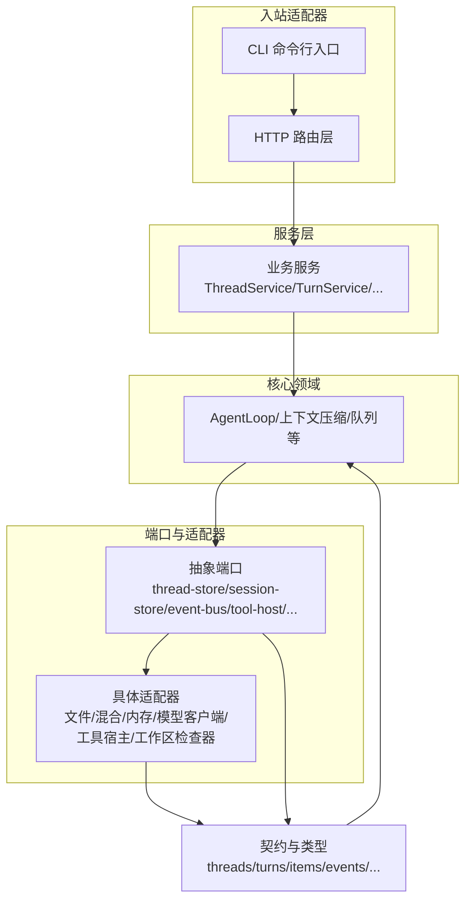
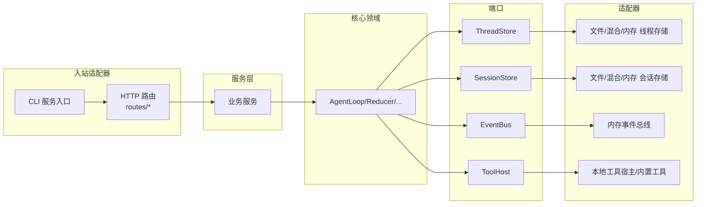
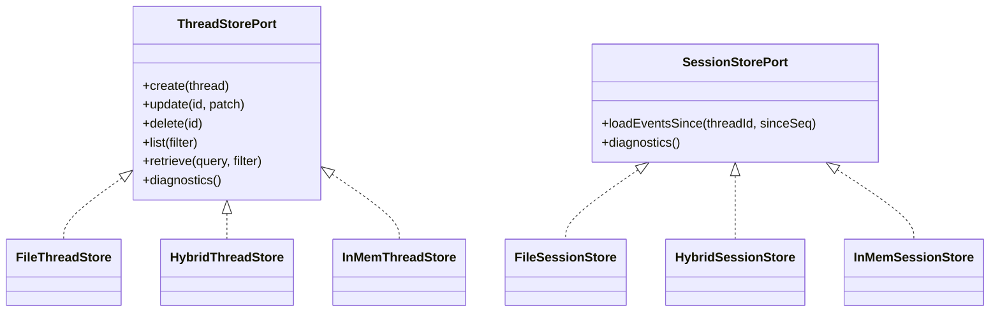
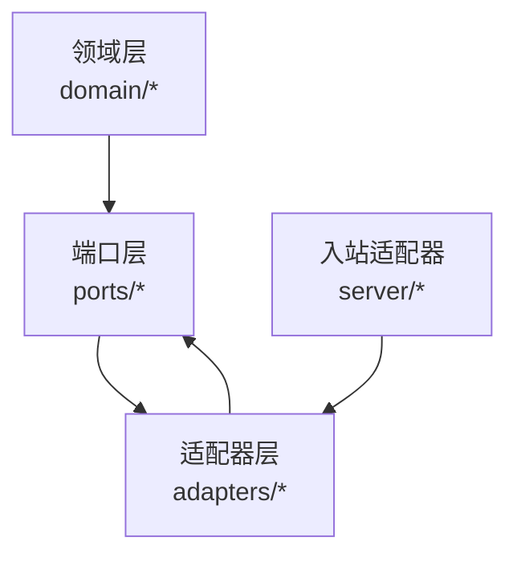
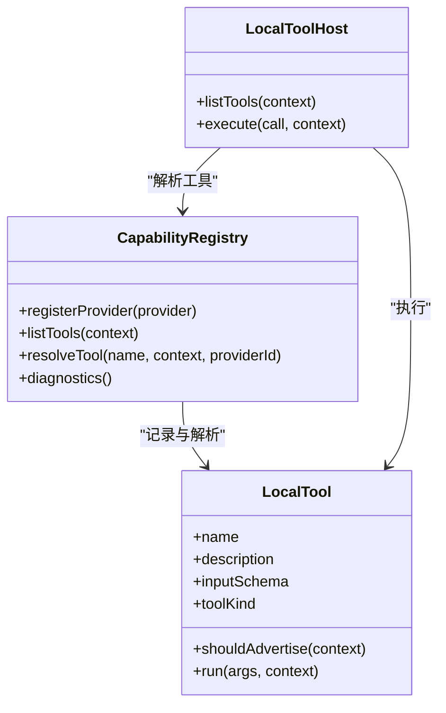
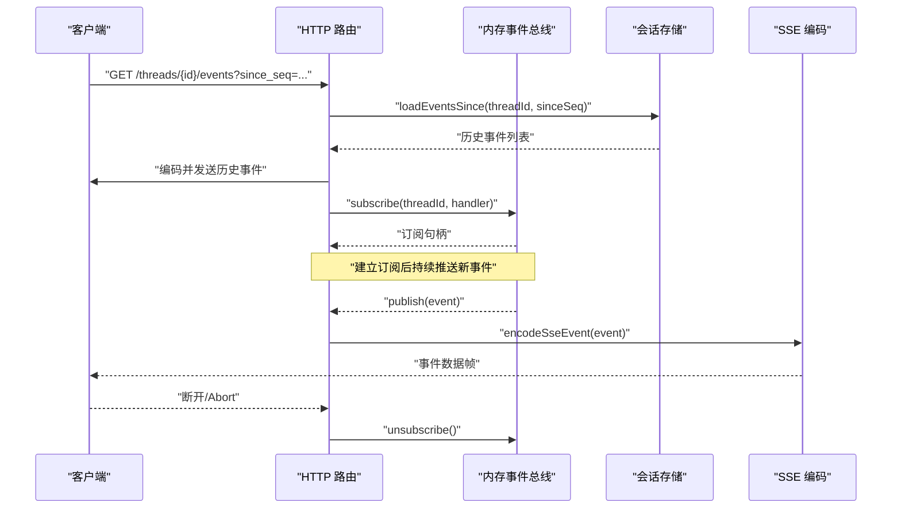
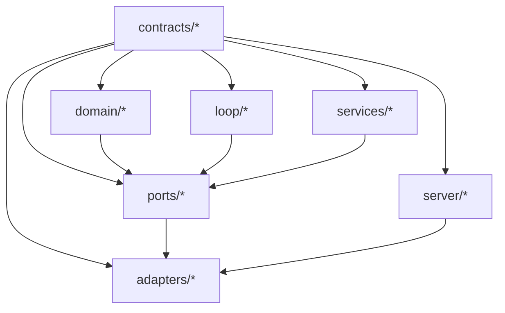

# 设计模式应用

<cite>
**本文引用的文件**
- [kun/src/adapters/file/file-thread-store.ts](file://kun/src/adapters/file/file-thread-store.ts)
- [kun/src/adapters/file/file-session-store.ts](file://kun/src/adapters/file/file-session-store.ts)
- [kun/src/adapters/hybrid/hybrid-thread-store.ts](file://kun/src/adapters/hybrid/hybrid-thread-store.ts)
- [kun/src/adapters/hybrid/hybrid-session-store.ts](file://kun/src/adapters/hybrid/hybrid-session-store.ts)
- [kun/src/adapters/in-memory-thread-store.ts](file://kun/src/adapters/in-memory-thread-store.ts)
- [kun/src/adapters/in-memory-session-store.ts](file://kun/src/adapters/in-memory-session-store.ts)
- [kun/src/ports/thread-store.ts](file://kun/src/ports/thread-store.ts)
- [kun/src/ports/session-store.ts](file://kun/src/ports/session-store.ts)
- [kun/src/ports/event-bus.ts](file://kun/src/ports/event-bus.ts)
- [kun/src/adapters/in-memory-event-bus.ts](file://kun/src/adapters/in-memory-event-bus.ts)
- [kun/src/server/sse.ts](file://kun/src/server/sse.ts)
- [kun/src/server/routes/events.ts](file://kun/src/server/routes/events.ts)
- [kun/src/adapters/tool/capability-registry.ts](file://kun/src/adapters/tool/capability-registry.ts)
- [kun/src/adapters/tool/local-tool-host.ts](file://kun/src/adapters/tool/local-tool-host.ts)
- [kun/src/adapters/tool/builtin-tools.ts](file://kun/src/adapters/tool/builtin-tools.ts)
- [kun/src/adapters/tool/index.ts](file://kun/src/adapters/tool/index.ts)
- [kun/src/ports/tool-host.ts](file://kun/src/ports/tool-host.ts)
- [kun/src/memory/memory-store.ts](file://kun/src/memory/memory-store.ts)
- [kun/src/memory/index.ts](file://kun/src/memory/index.ts)
- [docs/kun-contributing.md](file://docs/kun-contributing.md)
</cite>

## 目录
1. [引言](#引言)
2. [项目结构](#项目结构)
3. [核心组件](#核心组件)
4. [架构总览](#架构总览)
5. [详细组件分析](#详细组件分析)
6. [依赖关系分析](#依赖关系分析)
7. [性能考量](#性能考量)
8. [故障排查指南](#故障排查指南)
9. [结论](#结论)
10. [附录](#附录)

## 引言
本文件聚焦于 DeepSeek GUI（后文简称“Kun”）在后端运行时子系统中对多种经典设计模式的应用与落地，包括：
- 适配器模式：统一文件存储、混合存储、内存存储的接口，屏蔽底层差异
- 端口适配器模式（Hexagonal Architecture）：以“端口”隔离领域层与基础设施层，提升可测试性与可替换性
- 工具模式：可扩展的工具系统，支持内置工具、本地工具宿主与能力注册表
- 事件驱动模式：内存事件总线与 SSE 推送，实现领域事件的发布订阅与实时流式传输

文档将结合仓库源码，逐项说明每种模式的应用场景、实现方式与带来的收益，并提供图示与参考路径，帮助读者深入理解架构设计的深层原理。

## 项目结构
Kun 的后端运行时采用清晰的分层组织：contracts 定义不变数据与类型；domain 提供纯函数与领域模型；ports 定义抽象端口；adapters 提供具体适配器；services 编排用例；server/cli 作为入站适配器对接外部世界。这种布局天然契合六边形架构，确保“上层不依赖下层”，并以端口为边界进行解耦。

图表来源
- [docs/kun-contributing.md](file://docs/kun-contributing.md)

章节来源
- [docs/kun-contributing.md](file://docs/kun-contributing.md)

## 核心组件
本节概览与设计模式密切相关的四大组件群组及其职责：
- 存储适配器群：统一线程与会话的持久化接口，分别提供文件、混合与内存三种实现
- 事件总线与 SSE：内存事件总线作为发布订阅中枢，配合 HTTP 层的 SSE 编码与路由，实现事件流推送
- 工具系统：能力注册表、本地工具宿主与内置工具集合，形成可扩展的工具生态
- 端口与适配器：以端口定义抽象契约，适配器实现具体细节，确保领域层与基础设施层解耦

章节来源
- [kun/src/ports/thread-store.ts](file://kun/src/ports/thread-store.ts)
- [kun/src/ports/session-store.ts](file://kun/src/ports/session-store.ts)
- [kun/src/ports/event-bus.ts](file://kun/src/ports/event-bus.ts)
- [kun/src/ports/tool-host.ts](file://kun/src/ports/tool-host.ts)

## 架构总览
下图展示了“端口适配器模式”的整体交互：领域层仅依赖端口；服务层编排用例；入站适配器（HTTP/CLI）注入具体适配器；事件总线与 SSE 作为基础设施的一部分参与运行时事件的发布与推送。

图表来源
- [docs/kun-contributing.md](file://docs/kun-contributing.md)
- [kun/src/server/routes/events.ts](file://kun/src/server/routes/events.ts)
- [kun/src/adapters/in-memory-event-bus.ts](file://kun/src/adapters/in-memory-event-bus.ts)
- [kun/src/adapters/tool/local-tool-host.ts](file://kun/src/adapters/tool/local-tool-host.ts)

## 详细组件分析

### 适配器模式：统一存储接口
目标：为线程与会话提供一致的 CRUD 与查询接口，屏蔽文件系统、内存与混合策略的差异，便于替换与测试。

- 线程存储端口与适配器
  - 端口定义：线程存储端口提供创建、更新、删除、查询、诊断等方法，用于管理线程生命周期与元数据
  - 文件实现：基于文件系统的持久化，适合离线与长期保存
  - 混合实现：结合内存与文件，兼顾性能与持久化
  - 内存实现：仅驻留内存，适合测试与临时场景
  - 统一出口：通过索引导出，供上层按需选择

- 会话存储端口与适配器
  - 端口定义：会话存储端口提供会话级事件回放与订阅能力，支撑 SSE 实时推送
  - 文件/混合/内存实现：与线程存储类似，提供多实现以适配不同部署场景

图表来源
- [kun/src/ports/thread-store.ts](file://kun/src/ports/thread-store.ts)
- [kun/src/ports/session-store.ts](file://kun/src/ports/session-store.ts)
- [kun/src/adapters/file/file-thread-store.ts](file://kun/src/adapters/file/file-thread-store.ts)
- [kun/src/adapters/file/file-session-store.ts](file://kun/src/adapters/file/file-session-store.ts)
- [kun/src/adapters/hybrid/hybrid-thread-store.ts](file://kun/src/adapters/hybrid/hybrid-thread-store.ts)
- [kun/src/adapters/hybrid/hybrid-session-store.ts](file://kun/src/adapters/hybrid/hybrid-session-store.ts)
- [kun/src/adapters/in-memory-thread-store.ts](file://kun/src/adapters/in-memory-thread-store.ts)
- [kun/src/adapters/in-memory-session-store.ts](file://kun/src/adapters/in-memory-session-store.ts)

章节来源
- [kun/src/ports/thread-store.ts](file://kun/src/ports/thread-store.ts)
- [kun/src/ports/session-store.ts](file://kun/src/ports/session-store.ts)
- [kun/src/adapters/file/file-thread-store.ts](file://kun/src/adapters/file/file-thread-store.ts)
- [kun/src/adapters/file/file-session-store.ts](file://kun/src/adapters/file/file-session-store.ts)
- [kun/src/adapters/hybrid/hybrid-thread-store.ts](file://kun/src/adapters/hybrid/hybrid-thread-store.ts)
- [kun/src/adapters/hybrid/hybrid-session-store.ts](file://kun/src/adapters/hybrid/hybrid-session-store.ts)
- [kun/src/adapters/in-memory-thread-store.ts](file://kun/src/adapters/in-memory-thread-store.ts)
- [kun/src/adapters/in-memory-session-store.ts](file://kun/src/adapters/in-memory-session-store.ts)

### 端口适配器模式（Hexagonal Architecture）
目标：以端口隔离领域层与基础设施层，使领域逻辑不依赖具体实现，从而提升可测试性与可替换性。

- 端口定义：线程/会话/事件/工具等端口均位于 ports 目录，仅包含类型与契约，不含实现细节
- 适配器实现：adapters 目录提供文件/混合/内存等具体实现，遵循端口契约
- 依赖方向：严格自上而下，contracts/domain/ports 不能依赖 adapters/services/server
- 运行时事件：内存事件总线作为端口实现，服务于 SSE 路由层

图表来源
- [docs/kun-contributing.md](file://docs/kun-contributing.md)
- [kun/src/ports/event-bus.ts](file://kun/src/ports/event-bus.ts)
- [kun/src/adapters/in-memory-event-bus.ts](file://kun/src/adapters/in-memory-event-bus.ts)

章节来源
- [docs/kun-contributing.md](file://docs/kun-contributing.md)
- [kun/src/ports/event-bus.ts](file://kun/src/ports/event-bus.ts)
- [kun/src/adapters/in-memory-event-bus.ts](file://kun/src/adapters/in-memory-event-bus.ts)

### 工具模式：可扩展的工具系统
目标：构建可发现、可配置、可执行的工具生态，支持内置工具与本地工具宿主，通过能力注册表统一管理。

- 能力注册表：集中登记工具提供方与工具清单，校验可用性与上下文可见性，输出标准化工具规格
- 本地工具宿主：负责解析工具调用、执行上下文与权限策略，协调工具执行与结果聚合
- 内置工具：提供默认可用的工具族，如只读检索、文件操作、命令执行等
- 扩展点：新增工具只需实现 LocalTool 并注册到注册表，即可被上层统一调度

图表来源
- [kun/src/adapters/tool/capability-registry.ts](file://kun/src/adapters/tool/capability-registry.ts)
- [kun/src/adapters/tool/local-tool-host.ts](file://kun/src/adapters/tool/local-tool-host.ts)
- [kun/src/adapters/tool/builtin-tools.ts](file://kun/src/adapters/tool/builtin-tools.ts)
- [kun/src/ports/tool-host.ts](file://kun/src/ports/tool-host.ts)

章节来源
- [kun/src/adapters/tool/capability-registry.ts](file://kun/src/adapters/tool/capability-registry.ts)
- [kun/src/adapters/tool/local-tool-host.ts](file://kun/src/adapters/tool/local-tool-host.ts)
- [kun/src/adapters/tool/builtin-tools.ts](file://kun/src/adapters/tool/builtin-tools.ts)
- [kun/src/adapters/tool/index.ts](file://kun/src/adapters/tool/index.ts)
- [kun/src/ports/tool-host.ts](file://kun/src/ports/tool-host.ts)

### 事件驱动模式：内存事件总线与 SSE 推送
目标：以事件驱动的方式在运行时传播状态变化，通过内存事件总线实现高内聚的发布订阅，再经由 SSE 将事件流式推送给客户端。

- 内存事件总线：维护每个线程的事件列表与订阅者集合，支持发布、订阅、快照与序列号管理
- SSE 编码：将领域事件编码为标准的 Server-Sent Events 文本帧
- 事件路由：HTTP 路由负责回放历史事件、建立订阅、心跳保活与断开清理
- 一致性：通过会话存储的事件回放与 Last-Event-ID/查询参数保证断线重连的一致性

图表来源
- [kun/src/server/routes/events.ts](file://kun/src/server/routes/events.ts)
- [kun/src/server/sse.ts](file://kun/src/server/sse.ts)
- [kun/src/adapters/in-memory-event-bus.ts](file://kun/src/adapters/in-memory-event-bus.ts)
- [kun/src/ports/event-bus.ts](file://kun/src/ports/event-bus.ts)

章节来源
- [kun/src/server/routes/events.ts](file://kun/src/server/routes/events.ts)
- [kun/src/server/sse.ts](file://kun/src/server/sse.ts)
- [kun/src/adapters/in-memory-event-bus.ts](file://kun/src/adapters/in-memory-event-bus.ts)
- [kun/src/ports/event-bus.ts](file://kun/src/ports/event-bus.ts)

## 依赖关系分析
- 分层依赖：contracts/domain/ports 仅向下依赖，adapters/services/server 向上依赖端口与领域
- 端口契约：线程/会话/事件/工具等端口定义清晰，避免上层直接依赖具体实现
- 适配器替换：同一端口可自由切换文件/混合/内存实现，不影响领域与服务层
- 事件回放：SSE 路由依赖会话存储的事件回放能力，确保断线重连一致性

图表来源
- [docs/kun-contributing.md](file://docs/kun-contributing.md)

章节来源
- [docs/kun-contributing.md](file://docs/kun-contributing.md)

## 性能考量
- 存储策略选择
  - 内存存储：读写最快，适合测试与短期会话
  - 混合存储：兼顾性能与持久化，适合大多数生产场景
  - 文件存储：可靠性强，适合离线与长期归档
- 事件总线
  - 内存事件总线同步发布，订阅者异常不影响整体发布链路
  - SSE 心跳与断线重连机制降低长连接维护成本
- 工具执行
  - 能力注册表与本地工具宿主分离，减少工具解析与调度开销
  - 上下文感知的工具广告与策略过滤，避免无效调用

## 故障排查指南
- SSE 断线重连
  - 使用 Last-Event-ID 或 since_seq 参数恢复事件流
  - 关注心跳事件与异常关闭处理
- 事件总线异常
  - 订阅者抛错不应影响其他订阅者；检查订阅集合与序列号管理
- 存储适配器
  - 文件/混合/内存实现差异导致的行为差异，优先核对根目录与权限
- 工具执行
  - 工具名称解析失败或上下文不可用时，检查能力注册表与工具策略

章节来源
- [kun/src/server/routes/events.ts](file://kun/src/server/routes/events.ts)
- [kun/src/adapters/in-memory-event-bus.ts](file://kun/src/adapters/in-memory-event-bus.ts)
- [kun/src/adapters/tool/capability-registry.ts](file://kun/src/adapters/tool/capability-registry.ts)

## 结论
Kun 通过适配器模式统一了存储接口，通过端口适配器模式实现了领域与基础设施的彻底解耦，通过工具模式构建了可扩展的工具生态，通过事件驱动模式实现了运行时事件的高效传播与实时推送。这些模式相互协同，既提升了系统的可测试性与可替换性，也增强了可维护性与演进弹性。

## 附录
- 参考路径
  - 端口与适配器分层与依赖方向说明：[docs/kun-contributing.md](file://docs/kun-contributing.md)
  - 线程存储端口与适配器实现：[kun/src/ports/thread-store.ts](file://kun/src/ports/thread-store.ts)、[kun/src/adapters/file/file-thread-store.ts](file://kun/src/adapters/file/file-thread-store.ts)、[kun/src/adapters/hybrid/hybrid-thread-store.ts](file://kun/src/adapters/hybrid/hybrid-thread-store.ts)、[kun/src/adapters/in-memory-thread-store.ts](file://kun/src/adapters/in-memory-thread-store.ts)
  - 会话存储端口与适配器实现：[kun/src/ports/session-store.ts](file://kun/src/ports/session-store.ts)、[kun/src/adapters/file/file-session-store.ts](file://kun/src/adapters/file/file-session-store.ts)、[kun/src/adapters/hybrid/hybrid-session-store.ts](file://kun/src/adapters/hybrid/hybrid-session-store.ts)、[kun/src/adapters/in-memory-session-store.ts](file://kun/src/adapters/in-memory-session-store.ts)
  - 事件总线端口与内存实现：[kun/src/ports/event-bus.ts](file://kun/src/ports/event-bus.ts)、[kun/src/adapters/in-memory-event-bus.ts](file://kun/src/adapters/in-memory-event-bus.ts)
  - SSE 编码与事件路由：[kun/src/server/sse.ts](file://kun/src/server/sse.ts)、[kun/src/server/routes/events.ts](file://kun/src/server/routes/events.ts)
  - 工具系统：能力注册表、本地工具宿主与内置工具集合
    - [kun/src/adapters/tool/capability-registry.ts](file://kun/src/adapters/tool/capability-registry.ts)
    - [kun/src/adapters/tool/local-tool-host.ts](file://kun/src/adapters/tool/local-tool-host.ts)
    - [kun/src/adapters/tool/builtin-tools.ts](file://kun/src/adapters/tool/builtin-tools.ts)
    - [kun/src/adapters/tool/index.ts](file://kun/src/adapters/tool/index.ts)
    - [kun/src/ports/tool-host.ts](file://kun/src/ports/tool-host.ts)
  - 内存存储接口与实现：[kun/src/memory/memory-store.ts](file://kun/src/memory/memory-store.ts)、[kun/src/memory/index.ts](file://kun/src/memory/index.ts)