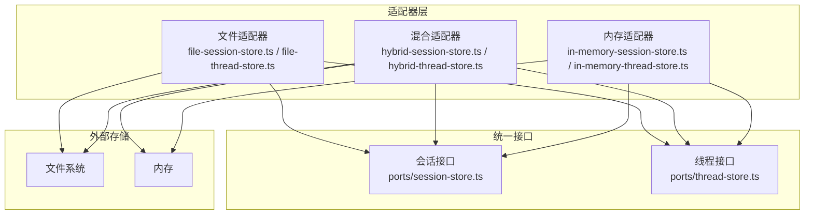
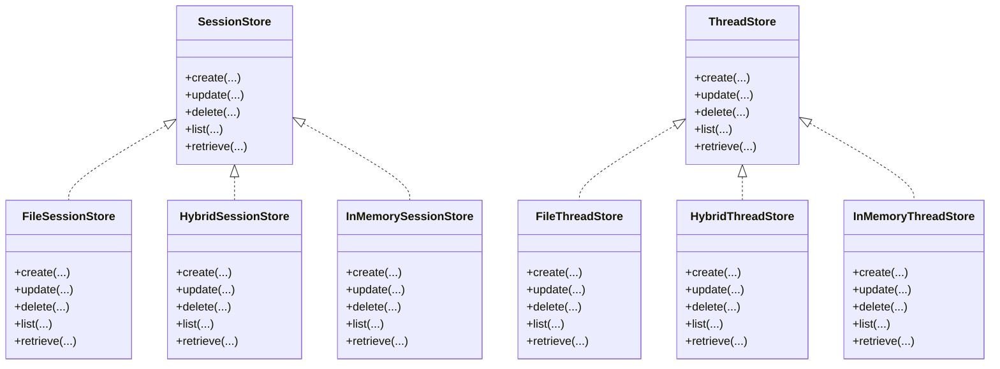
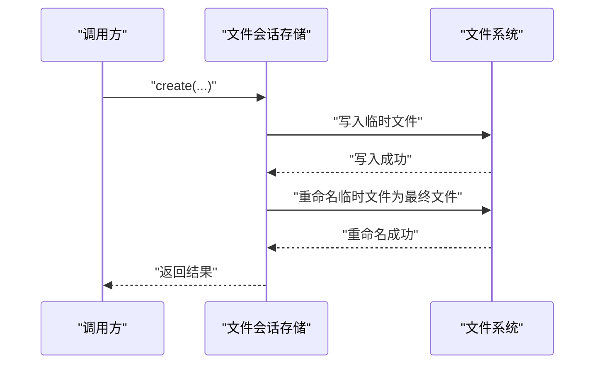
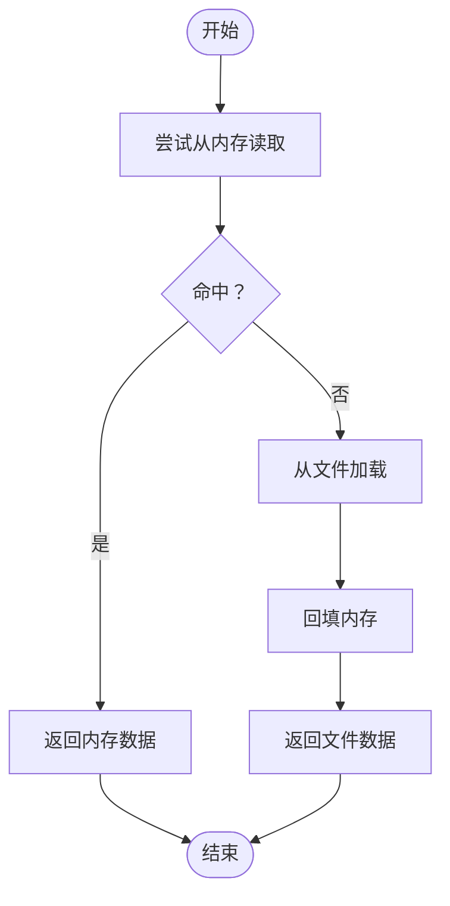
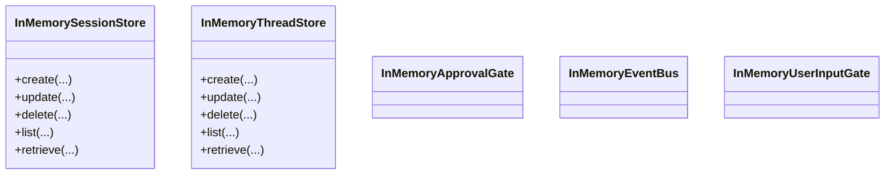
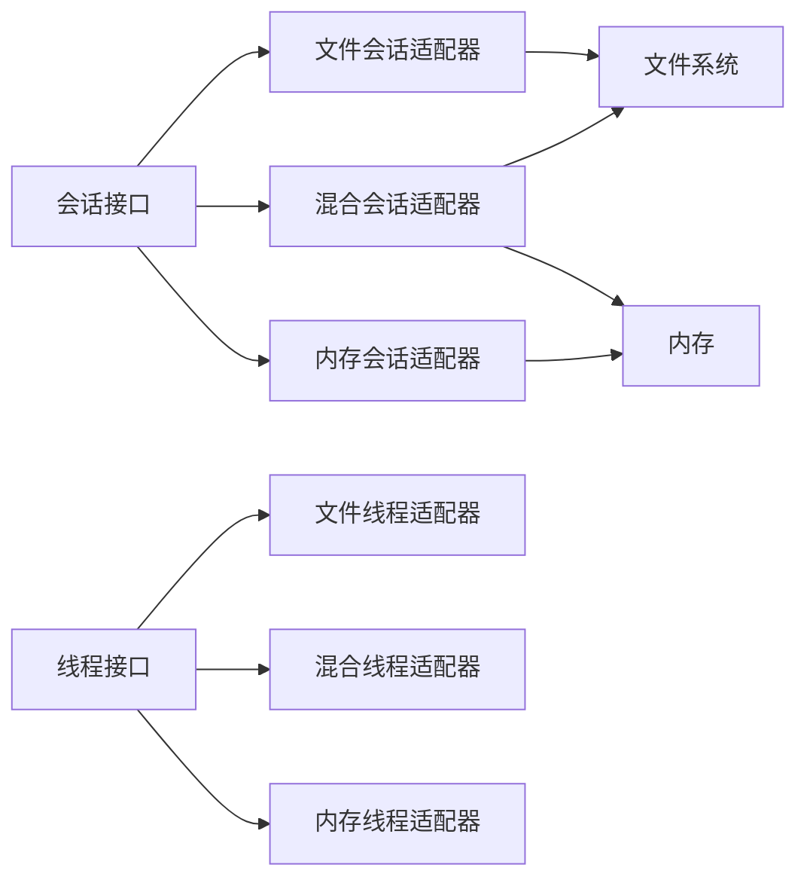

# 适配器模式

<cite>
**本文引用的文件**
- [kun/src/adapters/index.ts](file://kun/src/adapters/index.ts)
- [kun/src/adapters/file/index.ts](file://kun/src/adapters/file/index.ts)
- [kun/src/adapters/file/file-session-store.ts](file://kun/src/adapters/file/file-session-store.ts)
- [kun/src/adapters/file/file-thread-store.ts](file://kun/src/adapters/file/file-thread-store.ts)
- [kun/src/adapters/file/atomic-write.ts](file://kun/src/adapters/file/atomic-write.ts)
- [kun/src/adapters/hybrid/index.ts](file://kun/src/adapters/hybrid/index.ts)
- [kun/src/adapters/hybrid/hybrid-session-store.ts](file://kun/src/adapters/hybrid/hybrid-session-store.ts)
- [kun/src/adapters/hybrid/hybrid-thread-store.ts](file://kun/src/adapters/hybrid/hybrid-thread-store.ts)
- [kun/src/adapters/in-memory-session-store.ts](file://kun/src/adapters/in-memory-session-store.ts)
- [kun/src/adapters/in-memory-thread-store.ts](file://kun/src/adapters/in-memory-thread-store.ts)
- [kun/src/adapters/in-memory-approval-gate.ts](file://kun/src/adapters/in-memory-approval-gate.ts)
- [kun/src/adapters/in-memory-event-bus.ts](file://kun/src/adapters/in-memory-event-bus.ts)
- [kun/src/adapters/in-memory-user-input-gate.ts](file://kun/src/adapters/in-memory-user-input-gate.ts)
- [kun/src/ports/session-store.ts](file://kun/src/ports/session-store.ts)
- [kun/src/ports/thread-store.ts](file://kun/src/ports/thread-store.ts)
- [kun/src/memory/memory-store.ts](file://kun/src/memory/memory-store.ts)
- [kun/tests/file-session-store.test.ts](file://kun/tests/file-session-store.test.ts)
- [kun/tests/hybrid-store.test.ts](file://kun/tests/hybrid-store.test.ts)
- [kun/tests/memory-store.test.ts](file://kun/tests/memory-store.test.ts)
</cite>

## 目录
1. [引言](#引言)
2. [项目结构](#项目结构)
3. [核心组件](#核心组件)
4. [架构总览](#架构总览)
5. [详细组件分析](#详细组件分析)
6. [依赖关系分析](#依赖关系分析)
7. [性能考量](#性能考量)
8. [故障排查指南](#故障排查指南)
9. [结论](#结论)
10. [附录](#附录)

## 引言
本文件围绕 DeepSeek GUI 的“适配器模式”展开，聚焦于会话与线程存储的适配器实现：文件存储适配器、混合存储适配器、内存存储适配器。通过统一接口抽象不同存储后端（文件系统、内存、文件+内存组合），实现存储系统的可插拔与扩展；并结合测试用例说明如何在运行时切换存储策略，以满足不同场景下的持久化与性能需求。

## 项目结构
适配器相关代码主要位于以下位置：
- 适配器入口与导出：kun/src/adapters/index.ts、kun/src/adapters/file/index.ts、kun/src/adapters/hybrid/index.ts
- 文件存储适配器：kun/src/adapters/file/file-session-store.ts、kun/src/adapters/file/file-thread-store.ts、kun/src/adapters/file/atomic-write.ts
- 混合存储适配器：kun/src/adapters/hybrid/hybrid-session-store.ts、kun/src/adapters/hybrid/hybrid-thread-store.ts
- 内存存储适配器：kun/src/adapters/in-memory-session-store.ts、kun/src/adapters/in-memory-thread-store.ts、kun/src/adapters/in-memory-approval-gate.ts、kun/src/adapters/in-memory-event-bus.ts、kun/src/adapters/in-memory-user-input-gate.ts
- 统一接口定义：kun/src/ports/session-store.ts、kun/src/ports/thread-store.ts
- 记忆体存储（文件）：kun/src/memory/memory-store.ts
- 测试用例：kun/tests/file-session-store.test.ts、kun/tests/hybrid-store.test.ts、kun/tests/memory-store.test.ts

图表来源
- [kun/src/adapters/file/file-session-store.ts](file://kun/src/adapters/file/file-session-store.ts)
- [kun/src/adapters/file/file-thread-store.ts](file://kun/src/adapters/file/file-thread-store.ts)
- [kun/src/adapters/hybrid/hybrid-session-store.ts](file://kun/src/adapters/hybrid/hybrid-session-store.ts)
- [kun/src/adapters/hybrid/hybrid-thread-store.ts](file://kun/src/adapters/hybrid/hybrid-thread-store.ts)
- [kun/src/adapters/in-memory-session-store.ts](file://kun/src/adapters/in-memory-session-store.ts)
- [kun/src/adapters/in-memory-thread-store.ts](file://kun/src/adapters/in-memory-thread-store.ts)
- [kun/src/ports/session-store.ts](file://kun/src/ports/session-store.ts)
- [kun/src/ports/thread-store.ts](file://kun/src/ports/thread-store.ts)

章节来源
- [kun/src/adapters/index.ts](file://kun/src/adapters/index.ts)
- [kun/src/adapters/file/index.ts](file://kun/src/adapters/file/index.ts)
- [kun/src/adapters/hybrid/index.ts](file://kun/src/adapters/hybrid/index.ts)

## 核心组件
- 统一接口（会话/线程）
  - 会话接口：定义 create、update、delete、list、retrieve 等方法，用于抽象不同存储后端的会话能力。
  - 线程接口：定义 create、update、delete、list、retrieve 等方法，用于抽象不同存储后端的线程能力。
- 文件存储适配器
  - 基于文件系统的实现，负责将数据序列化到磁盘，支持原子写入以保证一致性。
- 混合存储适配器
  - 结合文件与内存两种后端，优先读取内存，回退到文件；写入同时更新内存与文件，兼顾性能与持久化。
- 内存存储适配器
  - 完全基于内存的数据结构，适合临时状态或测试环境，不进行持久化。

章节来源
- [kun/src/ports/session-store.ts](file://kun/src/ports/session-store.ts)
- [kun/src/ports/thread-store.ts](file://kun/src/ports/thread-store.ts)
- [kun/src/adapters/file/file-session-store.ts](file://kun/src/adapters/file/file-session-store.ts)
- [kun/src/adapters/file/file-thread-store.ts](file://kun/src/adapters/file/file-thread-store.ts)
- [kun/src/adapters/hybrid/hybrid-session-store.ts](file://kun/src/adapters/hybrid/hybrid-session-store.ts)
- [kun/src/adapters/hybrid/hybrid-thread-store.ts](file://kun/src/adapters/hybrid/hybrid-thread-store.ts)
- [kun/src/adapters/in-memory-session-store.ts](file://kun/src/adapters/in-memory-session-store.ts)
- [kun/src/adapters/in-memory-thread-store.ts](file://kun/src/adapters/in-memory-thread-store.ts)

## 架构总览
适配器模式通过“统一接口 + 多种实现”的方式，屏蔽底层存储差异，使上层逻辑无需关心具体存储类型。文件适配器直接对接文件系统；混合适配器在内存与文件之间做读写协调；内存适配器提供快速访问但不持久化。三者均可被注入到运行时配置中，实现存储策略的动态切换。

图表来源
- [kun/src/ports/session-store.ts](file://kun/src/ports/session-store.ts)
- [kun/src/ports/thread-store.ts](file://kun/src/ports/thread-store.ts)
- [kun/src/adapters/file/file-session-store.ts](file://kun/src/adapters/file/file-session-store.ts)
- [kun/src/adapters/file/file-thread-store.ts](file://kun/src/adapters/file/file-thread-store.ts)
- [kun/src/adapters/hybrid/hybrid-session-store.ts](file://kun/src/adapters/hybrid/hybrid-session-store.ts)
- [kun/src/adapters/hybrid/hybrid-thread-store.ts](file://kun/src/adapters/hybrid/hybrid-thread-store.ts)
- [kun/src/adapters/in-memory-session-store.ts](file://kun/src/adapters/in-memory-session-store.ts)
- [kun/src/adapters/in-memory-thread-store.ts](file://kun/src/adapters/in-memory-thread-store.ts)

## 详细组件分析

### 文件存储适配器
- 设计要点
  - 使用统一接口抽象文件系统上的会话与线程数据读写。
  - 采用原子写入机制，避免并发写入导致的数据损坏。
  - 将数据序列化为文件，便于调试与备份。
- 关键实现
  - 会话存储：会话创建、更新、删除、列表与检索均基于文件系统操作。
  - 线程存储：线程创建、更新、删除、列表与检索均基于文件系统操作。
  - 原子写入：通过临时文件写入与重命名实现原子提交，确保一致性。
- 应用场景
  - 需要持久化的生产环境。
  - 数据可审计、可迁移的场景。
- 代码示例路径
  - [文件会话存储实现](file://kun/src/adapters/file/file-session-store.ts)
  - [文件线程存储实现](file://kun/src/adapters/file/file-thread-store.ts)
  - [原子写入工具](file://kun/src/adapters/file/atomic-write.ts)

图表来源
- [kun/src/adapters/file/file-session-store.ts](file://kun/src/adapters/file/file-session-store.ts)
- [kun/src/adapters/file/atomic-write.ts](file://kun/src/adapters/file/atomic-write.ts)

章节来源
- [kun/src/adapters/file/file-session-store.ts](file://kun/src/adapters/file/file-session-store.ts)
- [kun/src/adapters/file/file-thread-store.ts](file://kun/src/adapters/file/file-thread-store.ts)
- [kun/src/adapters/file/atomic-write.ts](file://kun/src/adapters/file/atomic-write.ts)

### 混合存储适配器
- 设计要点
  - 读取优先内存，提升响应速度；写入同时更新内存与文件，兼顾性能与持久化。
  - 在内存中维护最新状态，文件作为持久化后备。
- 关键实现
  - 会话存储：读取命中内存则直接返回；未命中则从文件加载并回填内存。
  - 线程存储：读取命中内存则直接返回；未命中则从文件加载并回填内存。
  - 写入：先更新内存，再异步写入文件，失败时可回滚内存状态。
- 应用场景
  - 高频读取、低频写入的交互场景。
  - 对延迟敏感但又需要持久化的业务。
- 代码示例路径
  - [混合会话存储实现](file://kun/src/adapters/hybrid/hybrid-session-store.ts)
  - [混合线程存储实现](file://kun/src/adapters/hybrid/hybrid-thread-store.ts)

图表来源
- [kun/src/adapters/hybrid/hybrid-session-store.ts](file://kun/src/adapters/hybrid/hybrid-session-store.ts)
- [kun/src/adapters/hybrid/hybrid-thread-store.ts](file://kun/src/adapters/hybrid/hybrid-thread-store.ts)

章节来源
- [kun/src/adapters/hybrid/hybrid-session-store.ts](file://kun/src/adapters/hybrid/hybrid-session-store.ts)
- [kun/src/adapters/hybrid/hybrid-thread-store.ts](file://kun/src/adapters/hybrid/hybrid-thread-store.ts)

### 内存存储适配器
- 设计要点
  - 完全基于内存的数据结构，适合临时状态或测试环境。
  - 不进行持久化，启动即空，关闭即失。
- 关键实现
  - 会话存储：内存字典保存会话数据，提供增删改查。
  - 线程存储：内存字典保存线程数据，提供增删改查。
  - 其他门控与事件总线：内存实现用于测试与演示。
- 应用场景
  - 开发与测试阶段。
  - 短生命周期任务或临时状态管理。
- 代码示例路径
  - [内存会话存储实现](file://kun/src/adapters/in-memory-session-store.ts)
  - [内存线程存储实现](file://kun/src/adapters/in-memory-thread-store.ts)
  - [内存审批门控实现](file://kun/src/adapters/in-memory-approval-gate.ts)
  - [内存事件总线实现](file://kun/src/adapters/in-memory-event-bus.ts)
  - [内存用户输入门控实现](file://kun/src/adapters/in-memory-user-input-gate.ts)

图表来源
- [kun/src/adapters/in-memory-session-store.ts](file://kun/src/adapters/in-memory-session-store.ts)
- [kun/src/adapters/in-memory-thread-store.ts](file://kun/src/adapters/in-memory-thread-store.ts)
- [kun/src/adapters/in-memory-approval-gate.ts](file://kun/src/adapters/in-memory-approval-gate.ts)
- [kun/src/adapters/in-memory-event-bus.ts](file://kun/src/adapters/in-memory-event-bus.ts)
- [kun/src/adapters/in-memory-user-input-gate.ts](file://kun/src/adapters/in-memory-user-input-gate.ts)

章节来源
- [kun/src/adapters/in-memory-session-store.ts](file://kun/src/adapters/in-memory-session-store.ts)
- [kun/src/adapters/in-memory-thread-store.ts](file://kun/src/adapters/in-memory-thread-store.ts)
- [kun/src/adapters/in-memory-approval-gate.ts](file://kun/src/adapters/in-memory-approval-gate.ts)
- [kun/src/adapters/in-memory-event-bus.ts](file://kun/src/adapters/in-memory-event-bus.ts)
- [kun/src/adapters/in-memory-user-input-gate.ts](file://kun/src/adapters/in-memory-user-input-gate.ts)

### 统一接口与兼容性
- 会话接口与线程接口定义了统一的方法签名，屏蔽不同存储后端的差异，使得上层逻辑可以无感切换存储策略。
- 通过接口抽象，文件、内存、混合三种实现均可被替换注入，从而实现存储策略的动态切换。

章节来源
- [kun/src/ports/session-store.ts](file://kun/src/ports/session-store.ts)
- [kun/src/ports/thread-store.ts](file://kun/src/ports/thread-store.ts)

### 记忆体存储（文件）
- 虽非适配器模式，但与会话/线程存储同属“存储层”，其文件实现体现了统一接口思想：通过接口约束与文件实现分离，便于替换与扩展。
- 代码示例路径
  - [记忆体存储接口与文件实现](file://kun/src/memory/memory-store.ts)

章节来源
- [kun/src/memory/memory-store.ts](file://kun/src/memory/memory-store.ts)

## 依赖关系分析
- 适配器与接口
  - 文件、混合、内存适配器均实现统一接口，解耦上层逻辑与具体存储实现。
- 适配器与外部存储
  - 文件适配器依赖文件系统；混合适配器同时依赖内存与文件系统；内存适配器仅依赖内存。
- 运行时策略切换
  - 通过在运行时选择不同适配器实例注入到上层服务，即可实现存储策略的动态切换。

图表来源
- [kun/src/ports/session-store.ts](file://kun/src/ports/session-store.ts)
- [kun/src/ports/thread-store.ts](file://kun/src/ports/thread-store.ts)
- [kun/src/adapters/file/file-session-store.ts](file://kun/src/adapters/file/file-session-store.ts)
- [kun/src/adapters/file/file-thread-store.ts](file://kun/src/adapters/file/file-thread-store.ts)
- [kun/src/adapters/hybrid/hybrid-session-store.ts](file://kun/src/adapters/hybrid/hybrid-session-store.ts)
- [kun/src/adapters/hybrid/hybrid-thread-store.ts](file://kun/src/adapters/hybrid/hybrid-thread-store.ts)
- [kun/src/adapters/in-memory-session-store.ts](file://kun/src/adapters/in-memory-session-store.ts)
- [kun/src/adapters/in-memory-thread-store.ts](file://kun/src/adapters/in-memory-thread-store.ts)

章节来源
- [kun/src/ports/session-store.ts](file://kun/src/ports/session-store.ts)
- [kun/src/ports/thread-store.ts](file://kun/src/ports/thread-store.ts)

## 性能考量
- 文件适配器
  - 优点：持久化可靠，适合生产环境。
  - 缺点：I/O 成本较高，随机访问较慢。
  - 优化：批量写入、合并更新、缓存热点数据。
- 混合适配器
  - 优点：读取快（内存），写入兼顾持久化。
  - 缺点：内存占用随数据量增长；需处理内存与文件的一致性。
  - 优化：LRU 淘汰策略、懒加载、后台刷盘。
- 内存适配器
  - 优点：极快的读写性能。
  - 缺点：不可持久化，重启丢失。
  - 适用：测试、临时状态、短生命周期任务。

## 故障排查指南
- 文件写入失败
  - 检查目标目录权限与磁盘空间。
  - 确认原子写入流程是否完整执行（临时文件写入与重命名）。
  - 参考测试用例定位问题范围。
  - 代码示例路径
    - [文件会话存储测试](file://kun/tests/file-session-store.test.ts)
- 混合读取不一致
  - 检查内存与文件的同步时机与顺序。
  - 确认写入是否先更新内存再写文件。
  - 代码示例路径
    - [混合存储测试](file://kun/tests/hybrid-store.test.ts)
- 内存泄漏或状态异常
  - 检查内存适存器的生命周期管理与清理逻辑。
  - 代码示例路径
    - [内存会话存储实现](file://kun/src/adapters/in-memory-session-store.ts)
    - [内存线程存储实现](file://kun/src/adapters/in-memory-thread-store.ts)
- 记忆体存储异常
  - 检查文件读写与解析流程。
  - 代码示例路径
    - [记忆体存储测试](file://kun/tests/memory-store.test.ts)

章节来源
- [kun/tests/file-session-store.test.ts](file://kun/tests/file-session-store.test.ts)
- [kun/tests/hybrid-store.test.ts](file://kun/tests/hybrid-store.test.ts)
- [kun/tests/memory-store.test.ts](file://kun/tests/memory-store.test.ts)
- [kun/src/adapters/in-memory-session-store.ts](file://kun/src/adapters/in-memory-session-store.ts)
- [kun/src/adapters/in-memory-thread-store.ts](file://kun/src/adapters/in-memory-thread-store.ts)
- [kun/src/memory/memory-store.ts](file://kun/src/memory/memory-store.ts)

## 结论
通过统一接口与多种适配器实现，DeepSeek GUI 的存储层具备良好的可插拔性与扩展性。文件适配器提供可靠的持久化能力；混合适配器在性能与持久化之间取得平衡；内存适配器提供极致性能与便捷的测试支持。借助测试用例与清晰的接口设计，系统可在不同运行环境下灵活切换存储策略，满足多样化的业务需求。

## 附录
- 代码示例路径（仅列出路径，不展示具体代码内容）
  - [文件会话存储实现](file://kun/src/adapters/file/file-session-store.ts)
  - [文件线程存储实现](file://kun/src/adapters/file/file-thread-store.ts)
  - [混合会话存储实现](file://kun/src/adapters/hybrid/hybrid-session-store.ts)
  - [混合线程存储实现](file://kun/src/adapters/hybrid/hybrid-thread-store.ts)
  - [内存会话存储实现](file://kun/src/adapters/in-memory-session-store.ts)
  - [内存线程存储实现](file://kun/src/adapters/in-memory-thread-store.ts)
  - [会话接口定义](file://kun/src/ports/session-store.ts)
  - [线程接口定义](file://kun/src/ports/thread-store.ts)
  - [记忆体存储接口与文件实现](file://kun/src/memory/memory-store.ts)