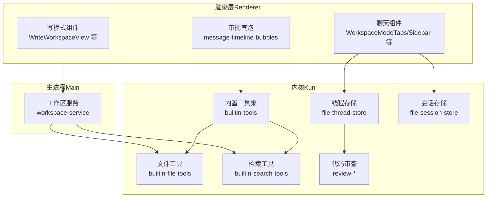
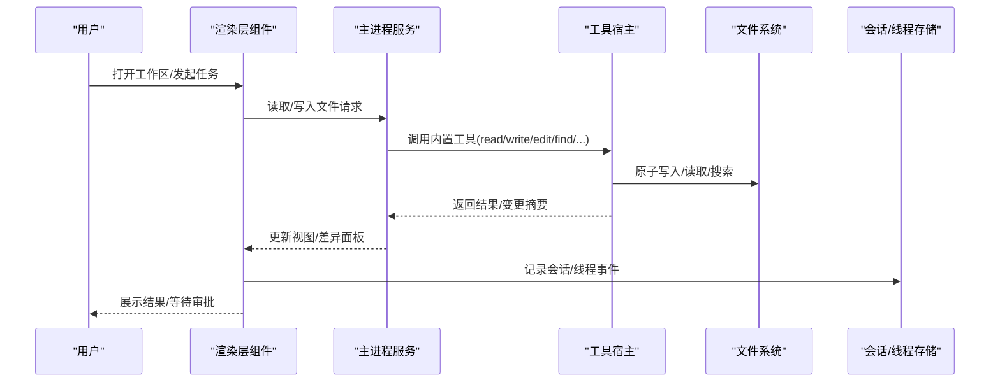
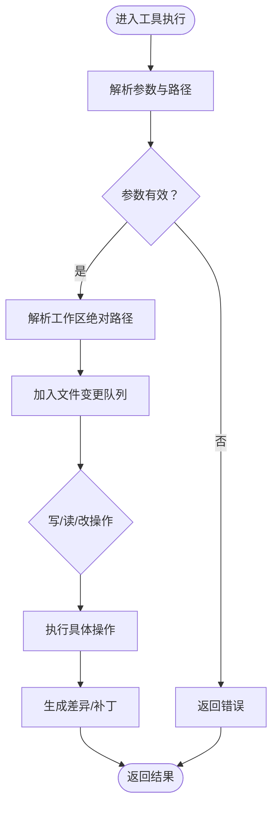
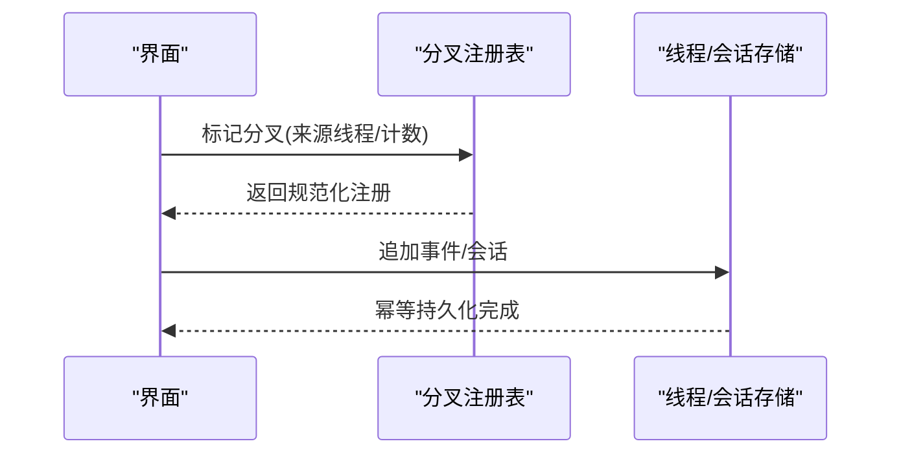
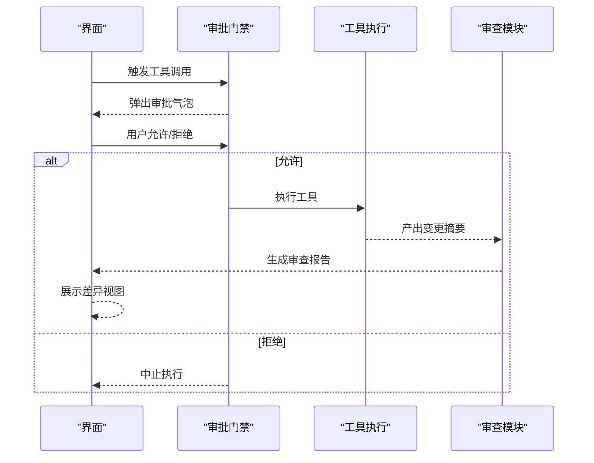
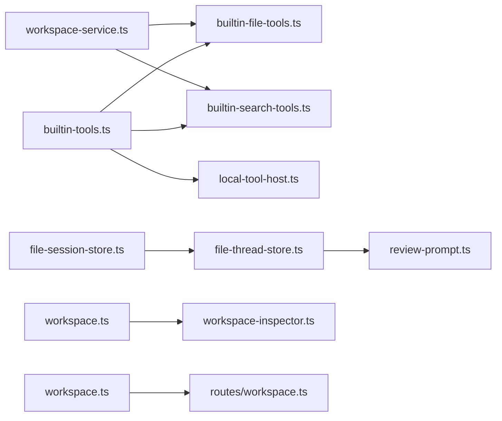

# Code 模式（项目工作）

<cite>
**本文引用的文件**
- [kun/src/adapters/tool/builtin-tools.ts](file://kun/src/adapters/tool/builtin-tools.ts)
- [kun/src/adapters/tool/builtin-file-tools.ts](file://kun/src/adapters/tool/builtin-file-tools.ts)
- [kun/src/adapters/tool/builtin-search-tools.ts](file://kun/src/adapters/tool/builtin-search-tools.ts)
- [kun/src/adapters/tool/local-tool-host.ts](file://kun/src/adapters/tool/local-tool-host.ts)
- [kun/src/adapters/file/file-thread-store.ts](file://kun/src/adapters/file/file-thread-store.ts)
- [kun/src/adapters/file/file-session-store.ts](file://kun/src/adapters/file/file-session-store.ts)
- [kun/src/contracts/workspace.ts](file://kun/src/contracts/workspace.ts)
- [kun/src/ports/workspace-inspector.ts](file://kun/src/ports/workspace-inspector.ts)
- [kun/src/server/routes/workspace.ts](file://kun/src/server/routes/workspace.ts)
- [src/main/services/workspace-service.ts](file://src/main/services/workspace-service.ts)
- [src/renderer/src/lib/open-workspace-path.ts](file://src/renderer/src/lib/open-workspace-path.ts)
- [src/renderer/src/components/chat/WorkspaceModeTabs.tsx](file://src/renderer/src/components/chat/WorkspaceModeTabs.tsx)
- [src/renderer/src/components/chat/Sidebar.tsx](file://src/renderer/src/components/chat/Sidebar.tsx)
- [src/renderer/src/components/chat/SessionHeader.tsx](file://src/renderer/src/components/chat/SessionHeader.tsx)
- [src/renderer/src/lib/thread-fork-registry.ts](file://src/renderer/src/lib/thread-fork-registry.ts)
- [src/renderer/src/components/chat/message-timeline-bubbles.tsx](file://src/renderer/src/components/chat/message-timeline-bubbles.tsx)
- [kun/src/contracts/approvals.ts](file://kun/src/contracts/approvals.ts)
- [kun/src/ports/approval-gate.ts](file://kun/src/ports/approval-gate.ts)
- [kun/src/server/routes/approvals.ts](file://kun/src/server/routes/approvals.ts)
- [kun/src/review/git-review-target.ts](file://kun/src/review/git-review-target.ts)
- [kun/src/review/review-prompt.ts](file://kun/src/review/review-prompt.ts)
- [kun/src/review/review-output.ts](file://kun/src/review/review-output.ts)
- [src/renderer/src/components/DiffView.tsx](file://src/renderer/src/components/DiffView.tsx)
- [src/renderer/src/components/write/WriteWorkspaceView.tsx](file://src/renderer/src/components/write/WriteWorkspaceView.tsx)
- [src/renderer/src/components/write/WriteWorkspaceToolbar.tsx](file://src/renderer/src/components/write/WriteWorkspaceToolbar.tsx)
- [src/renderer/src/components/write/WriteWorkspaceDocumentPane.tsx](file://src/renderer/src/components/write/WriteWorkspaceDocumentPane.tsx)
- [src/renderer/src/components/write/WriteFileTree.tsx](file://src/renderer/src/components/write/WriteFileTree.tsx)
- [src/renderer/src/lib/workspace-label.ts](file://src/renderer/src/lib/workspace-label.ts)
- [src/renderer/src/lib/workspace-path.ts](file://src/renderer/src/lib/workspace-path.ts)
- [src/renderer/src/lib/format-workspace-picker-error.ts](file://src/renderer/src/lib/format-workspace-picker-error.ts)
- [src/renderer/src/lib/thread-title.ts](file://src/renderer/src/lib/thread-title.ts)
- [src/renderer/src/lib/thread-sidebar-visibility.ts](file://src/renderer/src/lib/thread-sidebar-visibility.ts)
- [src/renderer/src/lib/thread-fork-registry.ts](file://src/renderer/src/lib/thread-fork-registry.ts)
- [src/renderer/src/store/chat-store.ts](file://src/renderer/src/store/chat-store.ts)
- [src/renderer/src/store/chat-store-types.ts](file://src/renderer/src/store/chat-store-types.ts)
- [src/renderer/src/store/chat-store-helpers.ts](file://src/renderer/src/store/chat-store-helpers.ts)
- [src/renderer/src/store/chat-store-thread-actions.ts](file://src/renderer/src/store/chat-store-thread-actions.ts)
- [src/renderer/src/store/chat-store-side-actions.ts](file://src/renderer/src/store/chat-store-side-actions.ts)
- [src/renderer/src/store/chat-store-runtime.ts](file://src/renderer/src/store/chat-store-runtime.ts)
- [src/renderer/src/store/chat-store-runtime-helpers.ts](file://src/renderer/src/store/chat-store-runtime-helpers.ts)
- [src/renderer/src/hooks/use-thread-usage.ts](file://src/renderer/src/hooks/use-thread-usage.ts)
- [src/renderer/src/hooks/use-model-usage.ts](file://src/renderer/src/hooks/use-model-usage.ts)
- [src/renderer/src/lib/apply-theme.ts](file://src/renderer/src/lib/apply-theme.ts)
- [src/renderer/src/lib/code-highlighting.ts](file://src/renderer/src/lib/code-highlighting.ts)
- [src/renderer/src/lib/diff-stats.ts](file://src/renderer/src/lib/diff-stats.ts)
- [src/renderer/src/lib/editor-preferences.ts](file://src/renderer/src/lib/editor-preferences.ts)
- [src/renderer/src/lib/file-reference-validation.ts](file://src/renderer/src/lib/file-reference-validation.ts)
- [src/renderer/src/lib/format-relative-time.ts](file://src/renderer/src/lib/format-relative-time.ts)
- [src/renderer/src/lib/format-runtime-error.ts](file://src/renderer/src/lib/format-runtime-error.ts)
- [src/renderer/src/lib/load-kun-diagnostics.ts](file://src/renderer/src/lib/load-kun-diagnostics.ts)
- [src/renderer/src/lib/skill-root-preference.ts](file://src/renderer/src/lib/skill-root-preference.ts)
- [src/renderer/src/lib/workspace-file-preview.ts](file://src/renderer/src/lib/workspace-file-preview.ts)
- [src/renderer/src/lib/open-workspace-path.ts](file://src/renderer/src/lib/open-workspace-path.ts)
- [src/renderer/src/lib/thread-fork-registry.ts](file://src/renderer/src/lib/thread-fork-registry.ts)
- [src/renderer/src/lib/thread-title.ts](file://src/renderer/src/lib/thread-title.ts)
- [src/renderer/src/lib/thread-sidebar-visibility.ts](file://src/renderer/src/lib/thread-sidebar-visibility.ts)
- [src/renderer/src/lib/workspace-label.ts](file://src/renderer/src/lib/workspace-label.ts)
- [src/renderer/src/lib/workspace-path.ts](file://src/renderer/src/lib/workspace-path.ts)
- [src/renderer/src/lib/format-workspace-picker-error.ts](file://src/renderer/src/lib/format-workspace-picker-error.ts)
- [src/renderer/src/lib/diff-stats.ts](file://src/renderer/src/lib/diff-stats.ts)
- [src/renderer/src/lib/code-highlighting.ts](file://src/renderer/src/lib/code-highlighting.ts)
- [src/renderer/src/lib/apply-theme.ts](file://src/renderer/src/lib/apply-theme.ts)
- [src/renderer/src/lib/editor-preferences.ts](file://src/renderer/src/lib/editor-preferences.ts)
- [src/renderer/src/lib/file-reference-validation.ts](file://src/renderer/src/lib/file-reference-validation.ts)
- [src/renderer/src/lib/format-relative-time.ts](file://src/renderer/src/lib/format-relative-time.ts)
- [src/renderer/src/lib/format-runtime-error.ts](file://src/renderer/src/lib/format-runtime-error.ts)
- [src/renderer/src/lib/load-kun-diagnostics.ts](file://src/renderer/src/lib/load-kun-diagnostics.ts)
- [src/renderer/src/lib/skill-root-preference.ts](file://src/renderer/src/lib/skill-root-preference.ts)
- [src/renderer/src/lib/workspace-file-preview.ts](file://src/renderer/src/lib/workspace-file-preview.ts)
- [src/renderer/src/lib/open-workspace-path.ts](file://src/renderer/src/lib/open-workspace-path.ts)
- [src/renderer/src/lib/thread-fork-registry.ts](file://src/renderer/src/lib/thread-fork-registry.ts)
- [src/renderer/src/lib/thread-title.ts](file://src/renderer/src/lib/thread-title.ts)
- [src/renderer/src/lib/thread-sidebar-visibility.ts](file://src/renderer/src/lib/thread-sidebar-visibility.ts)
- [src/renderer/src/lib/workspace-label.ts](file://src/renderer/src/lib/workspace-label.ts)
- [src/renderer/src/lib/workspace-path.ts](file://src/renderer/src/lib/workspace-path.ts)
- [src/renderer/src/lib/format-workspace-picker-error.ts](file://src/renderer/src/lib/format-workspace-picker-error.ts)
- [src/renderer/src/lib/diff-stats.ts](file://src/renderer/src/lib/diff-stats.ts)
- [src/renderer/src/lib/code-highlighting.ts](file://src/renderer/src/lib/code-highlighting.ts)
- [src/renderer/src/lib/apply-theme.ts](file://src/renderer/src/lib/apply-theme.ts)
- [src/renderer/src/lib/editor-preferences.ts](file://src/renderer/src/lib/editor-preferences.ts)
- [src/renderer/src/lib/file-reference-validation.ts](file://src/renderer/src/lib/file-reference-validation.ts)
- [src/renderer/src/lib/format-relative-time.ts](file://src/renderer/src/lib/format-relative-time.ts)
- [src/renderer/src/lib/format-runtime-error.ts](file://src/renderer/src/lib/format-runtime-error.ts)
- [src/renderer/src/lib/load-kun-diagnostics.ts](file://src/renderer/src/lib/load-kun-diagnostics.ts)
- [src/renderer/src/lib/skill-root-preference.ts](file://src/renderer/src/lib/skill-root-preference.ts)
- [src/renderer/src/lib/workspace-file-preview.ts](file://src/renderer/src/lib/workspace-file-preview.ts)
- [src/renderer/src/lib/open-workspace-path.ts](file://src/renderer/src/lib/open-workspace-path.ts)
- [src/renderer/src/lib/thread-fork-registry.ts](file://src/renderer/src/lib/thread-fork-registry.ts)
- [src/renderer/src/lib/thread-title.ts](file://src/renderer/src/lib/thread-title.ts)
- [src/renderer/src/lib/thread-sidebar-visibility.ts](file://src/renderer/src/lib/thread-sidebar-visibility.ts)
- [src/renderer/src/lib/workspace-label.ts](file://src/renderer/src/lib/workspace-label.ts)
- [src/renderer/src/lib/workspace-path.ts](file://src/renderer/src/lib/workspace-path.ts)
- [src/renderer/src/lib/format-workspace-picker-error.ts](file://src/renderer/src/lib/format-workspace-picker-error.ts)
- [src/renderer/src/lib/diff-stats.ts](file://src/renderer/src/lib/diff-stats.ts)
- [src/renderer/src/lib/code-highlighting.ts](file://src/renderer/src/lib/code-highlighting.ts)
- [src/renderer/src/lib/apply-theme.ts](file://src/renderer/src/lib/apply-theme.ts)
- [src/renderer/src/lib/editor-preferences.ts](file://src/renderer/src/lib/editor-preferences.ts)
- [src/renderer/src/lib/file-reference-validation.ts](file://src/renderer/src/lib/file-reference-validation.ts)
- [src/renderer/src/lib/format-relative-time.ts](file://src/renderer/src/lib/format-relative-time.ts)
- [src/renderer/src/lib/format-runtime-error.ts](file://src/renderer/src/lib/format-runtime-error.ts)
- [src/renderer/src/lib/load-kun-diagnostics.ts](file://src/renderer/src/lib/load-kun-diagnostics.ts)
- [src/renderer/src/lib/skill-root-preference.ts](file://src/renderer/src/lib/skill-root-preference.ts)
- [src/renderer/src/lib/workspace-file-preview.ts](file://src/renderer/src/lib/workspace-file-preview.ts)
- [src/renderer/src/lib/open-workspace-path.ts](file://src/renderer/src/lib/open-workspace-path.ts)
- [src/renderer/src/lib/thread-fork-registry.ts](file://src/renderer/src/lib/thread-fork-registry.ts)
- [src/renderer/src/lib/thread-title.ts](file://src/renderer/src/lib/thread-title.ts)
- [src/renderer/src/lib/thread-sidebar-visibility.ts](file://src/renderer/src/lib/thread-sidebar-visibility.ts)
- [src/renderer/src/lib/workspace-label.ts](file://src/renderer/src/lib/workspace-label.ts)
- [src/renderer/src/lib/workspace-path.ts](file://src/renderer/src/lib/workspace-path.ts)
- [src/renderer/src/lib/format-workspace-picker-error.ts](file://src/renderer/src/lib/format-workspace-picker-error.ts)
- [src/renderer/src/lib/diff-stats.ts](file://src/renderer/src/lib/diff-stats.ts)
- [src/renderer/src/lib/code-highlighting.ts](file://src/renderer/src/lib/code-highlighting.ts)
- [src/renderer/src/lib/apply-theme.ts](file://src/renderer/src/lib/apply-theme.ts)
- [src/renderer/src/lib/editor-preferences.ts](file://src/renderer/src/lib/editor-preferences.ts)
- [src/renderer/src/lib/file-reference-validation.ts](file://src/renderer/src/lib/file-reference-validation.ts)
- [src/renderer/src/lib/format-relative-time.ts](file://src/renderer/src/lib/format-relative-time.ts)
- [src/renderer/src/lib/format-runtime-error.ts](file://src/renderer/src/lib/format-runtime-error.ts)
- [src/renderer/src/lib/load-kun-diagnostics.ts](file://src/renderer/src/lib/load-kun-diagnostics.ts)
- [src/renderer/src/lib/skill-root-preference.ts](file://src/renderer/src/lib/skill-root-preference.ts)
- [src/renderer/src/lib/workspace-file-preview.ts](file://src/renderer/src/lib/workspace-file-preview.ts)
- [src/renderer/src/lib/open-workspace-path.ts](file://src/renderer/src/lib/open-workspace-path.ts)
- [src/renderer/src/lib/thread-fork-registry.ts](file://src/renderer/src/lib/thread-fork-registry.ts)
- [src/renderer/src/lib/thread-title.ts](file://src/renderer/src/lib/thread-title.ts)
- [src/renderer/src/lib/thread-sidebar-visibility.ts](file://src/renderer/src/lib/thread-sidebar-visibility.ts)
- [src/renderer/src/lib/workspace-label.ts](file://src/renderer/src/lib/workspace-label.ts)
- [src/renderer/src/lib/workspace-path.ts](file://src/renderer/src/lib/workspace-path.ts)
- [src/renderer/src/lib/format-workspace-picker-error.ts](file://src/renderer/src/lib/format-workspace-picker-error.ts)
- [src/renderer/src/lib/diff-stats.ts](file://src/renderer/src/lib/diff-stats.ts)
- [src/renderer/src/lib/code-highlighting.ts](file://src/renderer/src/lib/code-highlighting.ts)
- [src/renderer/src/lib/apply-theme.ts](file://src/renderer/src/lib/apply-theme.ts)
- [src/renderer/src/lib/editor-preferences.ts](file://src/renderer/src/lib/editor-preferences.ts)
- [src/renderer/src/lib/file-reference-validation.ts](file://src/renderer/src/lib/file-reference-validation.ts)
- [src/renderer/src/lib/format-relative-time.ts](file://src/renderer/src/lib/format-relative-time.ts)
- [src/renderer/src/lib/format-runtime-error.ts](file://src/renderer/src/lib/format-runtime-error.ts)
- [src/renderer/src/lib/load-kun-diagnostics.ts](file://src/renderer/src/lib/load-kun-diagnostics.ts)
- [src/renderer/src/lib/skill-root-preference.ts](file://src/renderer/src/lib/skill-root-preference.ts)
- [src/renderer/src/lib/workspace-file-preview.ts](file://src/renderer/src/lib/workspace-file-preview.ts)
- [src/renderer/src/lib/open-workspace-path.ts](file://src/renderer/src/lib/open-workspace-path.ts)
- [src/renderer/src/lib/thread-fork-registry.ts](file://src/renderer/src/lib/thread-fork-registry.ts)
- [src/renderer/src/lib/thread-title.ts](file://src/renderer/src/lib/thread-title.ts)
- [src/renderer/src/lib/thread-sidebar-visibility.ts](file://src/renderer/src/lib/thread-sidebar-visibility.ts)
- [src/renderer/src/lib/workspace-label.ts](file://src/renderer/src/lib/workspace-label.ts)
- [src/renderer/src/lib/workspace-path.ts](file://src/renderer/src/lib/workspace-path.ts)
- [src/renderer/src/lib/format-workspace-picker-error.ts](file://src/renderer/src/lib/format-workspace-picker-error.ts)
- [src/renderer/src/lib/diff-stats.ts](file://src/renderer/src/lib/diff-stats.ts)
- [src/renderer/src/lib/code-highlighting.ts](file://src/renderer/src/lib/code-highlighting.ts)
- [src/renderer/src/lib/apply-theme.ts](file://src/renderer/src/lib/apply-theme.ts)
- [src/renderer/src/lib/editor-preferences.ts](......
</cite>

## 目录
1. 引言
2. 项目结构
3. 核心组件
4. 架构总览
5. 组件详解
6. 依赖关系分析
7. 性能与可靠性
8. 故障排查指南
9. 结论
10. 附录

## 引言
本文件面向使用 DeepSeek GUI Code 模式的开发者，系统性阐述“项目工作”模式下的核心能力与使用方法，包括：本地工作空间绑定、文件读写与编辑、工具调用执行、代码审查流程；会话管理机制（旁支对话、压缩、分叉、归档）；权限控制（只读、工作区可写、完全访问）；审批流程与文件变更审查面板；常用快捷任务卡片（结构梳理、排错、实现方案、UI 优化）；以及真实项目开发中的使用场景与最佳实践。

## 项目结构
Code 模式围绕“会话线程（Thread）—会话（Session）—工作空间（Workspace）—工具（Tool）—文件系统（FS）”展开，前后端通过适配器与运行时连接，渲染层提供工作区视图与交互控件。

图表来源
- [src/renderer/src/components/write/WriteWorkspaceView.tsx](file://src/renderer/src/components/write/WriteWorkspaceView.tsx)
- [src/renderer/src/components/chat/WorkspaceModeTabs.tsx](file://src/renderer/src/components/chat/WorkspaceModeTabs.tsx)
- [src/renderer/src/components/chat/Sidebar.tsx](file://src/renderer/src/components/chat/Sidebar.tsx)
- [src/renderer/src/components/chat/message-timeline-bubbles.tsx](file://src/renderer/src/components/chat/message-timeline-bubbles.tsx)
- [src/main/services/workspace-service.ts](file://src/main/services/workspace-service.ts)
- [kun/src/adapters/tool/builtin-tools.ts](file://kun/src/adapters/tool/builtin-tools.ts)
- [kun/src/adapters/tool/builtin-file-tools.ts](file://kun/src/adapters/tool/builtin-file-tools.ts)
- [kun/src/adapters/tool/builtin-search-tools.ts](file://kun/src/adapters/tool/builtin-search-tools.ts)
- [kun/src/adapters/file/file-thread-store.ts](file://kun/src/adapters/file/file-thread-store.ts)
- [kun/src/adapters/file/file-session-store.ts](file://kun/src/adapters/file/file-session-store.ts)
- [kun/src/review/review-prompt.ts](file://kun/src/review/review-prompt.ts)

章节来源
- [src/renderer/src/components/write/WriteWorkspaceView.tsx](file://src/renderer/src/components/write/WriteWorkspaceView.tsx)
- [src/renderer/src/components/chat/WorkspaceModeTabs.tsx](file://src/renderer/src/components/chat/WorkspaceModeTabs.tsx)
- [src/renderer/src/components/chat/Sidebar.tsx](file://src/renderer/src/components/chat/Sidebar.tsx)
- [src/renderer/src/components/chat/message-timeline-bubbles.tsx](file://src/renderer/src/components/chat/message-timeline-bubbles.tsx)
- [src/main/services/workspace-service.ts](file://src/main/services/workspace-service.ts)
- [kun/src/adapters/tool/builtin-tools.ts](file://kun/src/adapters/tool/builtin-tools.ts)
- [kun/src/adapters/tool/builtin-file-tools.ts](file://kun/src/adapters/tool/builtin-file-tools.ts)
- [kun/src/adapters/tool/builtin-search-tools.ts](file://kun/src/adapters/tool/builtin-search-tools.ts)
- [kun/src/adapters/file/file-thread-store.ts](file://kun/src/adapters/file/file-thread-store.ts)
- [kun/src/adapters/file/file-session-store.ts](file://kun/src/adapters/file/file-session-store.ts)
- [kun/src/review/review-prompt.ts](file://kun/src/review/review-prompt.ts)

## 核心组件
- 工作空间绑定与选择
  - 渲染层提供打开工作区路径与标签展示，主进程提供工作区文件/编辑器服务，后端提供工作区检查与路由。
- 文件读写与编辑
  - 内置工具提供 read、write、edit 等能力，支持原子写入、冲突队列、差异生成与补丁输出。
- 工具调用执行
  - 本地工具宿主统一定义工具输入输出、策略与边界保护，支持自动或请求式策略。
- 代码审查流程
  - 审查目标、提示词与输出格式化模块协同，结合 Git 提交范围与差异生成审查报告。
- 会话管理
  - 线程/会话持久化、分叉注册、标题与元信息显示、侧边栏可见性与使用统计。
- 权限控制
  - 通过工具集合区分只读与可写模式，配合审批门禁与用户输入门禁实现安全执行。
- 审批与变更审查面板
  - 审批气泡弹窗、允许/拒绝操作、错误信息展示与状态反馈。

章节来源
- [src/renderer/src/lib/open-workspace-path.ts](file://src/renderer/src/lib/open-workspace-path.ts)
- [src/renderer/src/lib/workspace-label.ts](file://src/renderer/src/lib/workspace-label.ts)
- [src/renderer/src/lib/workspace-path.ts](file://src/renderer/src/lib/workspace-path.ts)
- [src/main/services/workspace-service.ts](file://src/main/services/workspace-service.ts)
- [kun/src/contracts/workspace.ts](file://kun/src/contracts/workspace.ts)
- [kun/src/ports/workspace-inspector.ts](file://kun/src/ports/workspace-inspector.ts)
- [kun/src/server/routes/workspace.ts](file://kun/src/server/routes/workspace.ts)
- [kun/src/adapters/tool/builtin-tools.ts](file://kun/src/adapters/tool/builtin-tools.ts)
- [kun/src/adapters/tool/builtin-file-tools.ts](file://kun/src/adapters/tool/builtin-file-tools.ts)
- [kun/src/adapters/tool/builtin-search-tools.ts](file://kun/src/adapters/tool/builtin-search-tools.ts)
- [kun/src/adapters/tool/local-tool-host.ts](file://kun/src/adapters/tool/local-tool-host.ts)
- [kun/src/review/git-review-target.ts](file://kun/src/review/git-review-target.ts)
- [kun/src/review/review-prompt.ts](file://kun/src/review/review-prompt.ts)
- [kun/src/review/review-output.ts](file://kun/src/review/review-output.ts)
- [src/renderer/src/components/DiffView.tsx](file://src/renderer/src/components/DiffView.tsx)
- [src/renderer/src/lib/thread-fork-registry.ts](file://src/renderer/src/lib/thread-fork-registry.ts)
- [src/renderer/src/components/chat/SessionHeader.tsx](file://src/renderer/src/components/chat/SessionHeader.tsx)
- [kun/src/contracts/approvals.ts](file://kun/src/contracts/approvals.ts)
- [kun/src/ports/approval-gate.ts](file://kun/src/ports/approval-gate.ts)
- [kun/src/server/routes/approvals.ts](file://kun/src/server/routes/approvals.ts)

## 架构总览
下图展示从用户操作到工具执行、文件变更与审查输出的关键链路。

图表来源
- [src/renderer/src/components/write/WriteWorkspaceView.tsx](file://src/renderer/src/components/write/WriteWorkspaceView.tsx)
- [src/renderer/src/components/DiffView.tsx](file://src/renderer/src/components/DiffView.tsx)
- [src/main/services/workspace-service.ts](file://src/main/services/workspace-service.ts)
- [kun/src/adapters/tool/builtin-tools.ts](file://kun/src/adapters/tool/builtin-tools.ts)
- [kun/src/adapters/tool/builtin-file-tools.ts](file://kun/src/adapters/tool/builtin-file-tools.ts)
- [kun/src/adapters/file/file-thread-store.ts](file://kun/src/adapters/file/file-thread-store.ts)
- [kun/src/adapters/file/file-session-store.ts](file://kun/src/adapters/file/file-session-store.ts)

## 组件详解

### 本地工作空间绑定与文件浏览
- 工作区打开与标签
  - 渲染层提供打开工作区路径与标签展示，便于识别当前工作目录与模式。
- 主进程工作区服务
  - 提供文件读写、编辑器集成与路径解析能力，作为前后端桥接。
- 合同与端口
  - 工作区合同定义数据结构，端口抽象检查器，路由暴露工作区接口。

章节来源
- [src/renderer/src/lib/open-workspace-path.ts](file://src/renderer/src/lib/open-workspace-path.ts)
- [src/renderer/src/lib/workspace-label.ts](file://src/renderer/src/lib/workspace-label.ts)
- [src/renderer/src/lib/workspace-path.ts](file://src/renderer/src/lib/workspace-path.ts)
- [src/renderer/src/components/write/WriteFileTree.tsx](file://src/renderer/src/components/write/WriteFileTree.tsx)
- [src/main/services/workspace-service.ts](file://src/main/services/workspace-service.ts)
- [kun/src/contracts/workspace.ts](file://kun/src/contracts/workspace.ts)
- [kun/src/ports/workspace-inspector.ts](file://kun/src/ports/workspace-inspector.ts)
- [kun/src/server/routes/workspace.ts](file://kun/src/server/routes/workspace.ts)

### 文件读写与编辑工具
- 工具集合
  - 内置工具按模式构建：只读模式包含 read/grep/find/ls；可写模式包含 read/bash/edit/write。
- 写入与编辑
  - write：创建/覆盖文件，支持目录创建与字节统计。
  - edit：精确文本替换，支持多处不相交编辑，生成差异与补丁。
- 原子写入与冲突队列
  - 使用临时文件+重命名确保读取一致性；同一文件并发变更排队执行。
- 搜索与列出
  - find 支持通配符匹配与限制；ls 提供目录枚举。

图表来源
- [kun/src/adapters/tool/builtin-tools.ts](file://kun/src/adapters/tool/builtin-tools.ts)
- [kun/src/adapters/tool/builtin-file-tools.ts](file://kun/src/adapters/tool/builtin-file-tools.ts)
- [kun/src/adapters/tool/builtin-search-tools.ts](file://kun/src/adapters/tool/builtin-search-tools.ts)
- [kun/src/adapters/tool/local-tool-host.ts](file://kun/src/adapters/tool/local-tool-host.ts)

章节来源
- [kun/src/adapters/tool/builtin-tools.ts](file://kun/src/adapters/tool/builtin-tools.ts)
- [kun/src/adapters/tool/builtin-file-tools.ts](file://kun/src/adapters/tool/builtin-file-tools.ts)
- [kun/src/adapters/tool/builtin-search-tools.ts](file://kun/src/adapters/tool/builtin-search-tools.ts)
- [kun/src/adapters/tool/local-tool-host.ts](file://kun/src/adapters/tool/local-tool-host.ts)

### 会话管理机制（旁支、压缩、分叉、归档）
- 分叉注册
  - 记录线程分叉来源、消息数与轮次，便于追踪上下文来源。
- 会话/线程存储
  - 文件存储保障原子写入与幂等追加，避免半写与重复。
- 标题与元信息
  - 显示工作区标签、模式、时间与分叉来源，提升可追溯性。
- 侧边栏与使用统计
  - 控制侧边栏可见性与线程/模型使用统计，辅助导航与资源管理。

图表来源
- [src/renderer/src/lib/thread-fork-registry.ts](file://src/renderer/src/lib/thread-fork-registry.ts)
- [kun/src/adapters/file/file-thread-store.ts](file://kun/src/adapters/file/file-thread-store.ts)
- [kun/src/adapters/file/file-session-store.ts](file://kun/src/adapters/file/file-session-store.ts)
- [src/renderer/src/components/chat/SessionHeader.tsx](file://src/renderer/src/components/chat/SessionHeader.tsx)
- [src/renderer/src/lib/thread-sidebar-visibility.ts](file://src/renderer/src/lib/thread-sidebar-visibility.ts)
- [src/renderer/src/hooks/use-thread-usage.ts](file://src/renderer/src/hooks/use-thread-usage.ts)
- [src/renderer/src/hooks/use-model-usage.ts](file://src/renderer/src/hooks/use-model-usage.ts)

章节来源
- [src/renderer/src/lib/thread-fork-registry.ts](file://src/renderer/src/lib/thread-fork-registry.ts)
- [kun/src/adapters/file/file-thread-store.ts](file://kun/src/adapters/file/file-thread-store.ts)
- [kun/src/adapters/file/file-session-store.ts](file://kun/src/adapters/file/file-session-store.ts)
- [src/renderer/src/components/chat/SessionHeader.tsx](file://src/renderer/src/components/chat/SessionHeader.tsx)
- [src/renderer/src/lib/thread-sidebar-visibility.ts](file://src/renderer/src/lib/thread-sidebar-visibility.ts)
- [src/renderer/src/hooks/use-thread-usage.ts](file://src/renderer/src/hooks/use-thread-usage.ts)
- [src/renderer/src/hooks/use-model-usage.ts](file://src/renderer/src/hooks/use-model-usage.ts)

### 权限控制系统（只读、工作区可写、完全访问）
- 工具集合区分
  - 只读：read/grep/find/ls；可写：read/bash/edit/write。
- 执行策略
  - 工具策略支持自动执行或请求式，配合审批门禁实现安全控制。
- 用户输入门禁
  - 在需要交互确认时阻断执行，待用户明确同意后继续。

章节来源
- [kun/src/adapters/tool/builtin-tools.ts](file://kun/src/adapters/tool/builtin-tools.ts)
- [kun/src/ports/approval-gate.ts](file://kun/src/ports/approval-gate.ts)
- [kun/src/server/routes/approvals.ts](file://kun/src/server/routes/approvals.ts)
- [kun/src/ports/user-input-gate.ts](file://kun/src/ports/user-input-gate.ts)

### 审批流程与文件变更审查面板
- 审批气泡
  - 展示工具名称、摘要与错误信息，提供允许/拒绝按钮。
- 审查输出
  - 基于差异与目标生成审查报告，支持预览与导出。
- 差异视图
  - 展示变更前后的对比，统计行数变化与类型。

图表来源
- [src/renderer/src/components/chat/message-timeline-bubbles.tsx](file://src/renderer/src/components/chat/message-timeline-bubbles.tsx)
- [kun/src/contracts/approvals.ts](file://kun/src/contracts/approvals.ts)
- [kun/src/review/git-review-target.ts](file://kun/src/review/git-review-target.ts)
- [kun/src/review/review-output.ts](file://kun/src/review/review-output.ts)
- [src/renderer/src/components/DiffView.tsx](file://src/renderer/src/components/DiffView.tsx)

章节来源
- [src/renderer/src/components/chat/message-timeline-bubbles.tsx](file://src/renderer/src/components/chat/message-timeline-bubbles.tsx)
- [kun/src/contracts/approvals.ts](file://kun/src/contracts/approvals.ts)
- [kun/src/review/git-review-target.ts](file://kun/src/review/git-review-target.ts)
- [kun/src/review/review-output.ts](file://kun/src/review/review-output.ts)
- [src/renderer/src/components/DiffView.tsx](file://src/renderer/src/components/DiffView.tsx)

### 常用快捷任务卡片（一键发起）
- 结构梳理：基于检索工具与文件树，快速定位模块与依赖。
- 排错：利用 grep/find 定位问题文件与上下文，结合差异视图定位根因。
- 实现方案：以编辑工具精确替换，生成补丁预览后再提交。
- UI 优化：在写模式中使用高亮与预览，结合主题与偏好设置提升效率。

章节来源
- [kun/src/adapters/tool/builtin-search-tools.ts](file://kun/src/adapters/tool/builtin-search-tools.ts)
- [src/renderer/src/components/write/WriteWorkspaceView.tsx](file://src/renderer/src/components/write/WriteWorkspaceView.tsx)
- [src/renderer/src/lib/code-highlighting.ts](file://src/renderer/src/lib/code-highlighting.ts)
- [src/renderer/src/lib/apply-theme.ts](file://src/renderer/src/lib/apply-theme.ts)
- [src/renderer/src/lib/editor-preferences.ts](file://src/renderer/src/lib/editor-preferences.ts)

## 依赖关系分析

图表来源
- [kun/src/adapters/tool/builtin-tools.ts](file://kun/src/adapters/tool/builtin-tools.ts)
- [kun/src/adapters/tool/builtin-file-tools.ts](file://kun/src/adapters/tool/builtin-file-tools.ts)
- [kun/src/adapters/tool/builtin-search-tools.ts](file://kun/src/adapters/tool/builtin-search-tools.ts)
- [kun/src/adapters/tool/local-tool-host.ts](file://kun/src/adapters/tool/local-tool-host.ts)
- [src/main/services/workspace-service.ts](file://src/main/services/workspace-service.ts)
- [kun/src/adapters/file/file-thread-store.ts](file://kun/src/adapters/file/file-thread-store.ts)
- [kun/src/adapters/file/file-session-store.ts](file://kun/src/adapters/file/file-session-store.ts)
- [kun/src/review/review-prompt.ts](file://kun/src/review/review-prompt.ts)
- [kun/src/contracts/workspace.ts](file://kun/src/contracts/workspace.ts)
- [kun/src/ports/workspace-inspector.ts](file://kun/src/ports/workspace-inspector.ts)
- [kun/src/server/routes/workspace.ts](file://kun/src/server/routes/workspace.ts)

章节来源
- [kun/src/adapters/tool/builtin-tools.ts](file://kun/src/adapters/tool/builtin-tools.ts)
- [kun/src/adapters/tool/builtin-file-tools.ts](file://kun/src/adapters/tool/builtin-file-tools.ts)
- [kun/src/adapters/tool/builtin-search-tools.ts](file://kun/src/adapters/tool/builtin-search-tools.ts)
- [kun/src/adapters/tool/local-tool-host.ts](file://kun/src/adapters/tool/local-tool-host.ts)
- [src/main/services/workspace-service.ts](file://src/main/services/workspace-service.ts)
- [kun/src/adapters/file/file-thread-store.ts](file://kun/src/adapters/file/file-thread-store.ts)
- [kun/src/adapters/file/file-session-store.ts](file://kun/src/adapters/file/file-session-store.ts)
- [kun/src/review/review-prompt.ts](file://kun/src/review/review-prompt.ts)
- [kun/src/contracts/workspace.ts](file://kun/src/contracts/workspace.ts)
- [kun/src/ports/workspace-inspector.ts](file://kun/src/ports/workspace-inspector.ts)
- [kun/src/server/routes/workspace.ts](file://kun/src/server/routes/workspace.ts)

## 性能与可靠性
- 原子写入与幂等持久化
  - 采用临时文件+重命名策略，避免半写；追加写入与去重保障幂等。
- 并发变更队列
  - 同一文件的多次变更排队执行，降低冲突与竞争条件。
- 搜索与列表基于索引
  - 列表/搜索基于索引而非扫描磁盘，减少 IO 开销。
- 审批与速率限制
  - 工具调用策略与速率限制结合，避免滥用与资源争用。

章节来源
- [kun/src/adapters/file/file-thread-store.ts](file://kun/src/adapters/file/file-thread-store.ts)
- [kun/src/adapters/file/file-session-store.ts](file://kun/src/adapters/file/file-session-store.ts)
- [kun/src/adapters/tool/builtin-file-tools.ts](file://kun/src/adapters/tool/builtin-file-tools.ts)
- [kun/src/adapters/tool/tool-rate-limit.ts](file://kun/src/adapters/tool/tool-rate-limit.ts)

## 故障排查指南
- 工作区打开失败
  - 检查路径合法性与权限，查看格式化错误信息。
- 工具执行报错
  - 查看审批气泡中的错误信息，确认是否需要允许或修正参数。
- 文件变更未生效
  - 确认是否触发原子写入与队列执行，检查差异视图与审查输出。
- 会话/线程异常
  - 检查存储文件完整性与幂等写入日志，必要时清理缓存或重建索引。

章节来源
- [src/renderer/src/lib/format-workspace-picker-error.ts](file://src/renderer/src/lib/format-workspace-picker-error.ts)
- [src/renderer/src/components/chat/message-timeline-bubbles.tsx](file://src/renderer/src/components/chat/message-timeline-bubbles.tsx)
- [src/renderer/src/components/DiffView.tsx](file://src/renderer/src/components/DiffView.tsx)
- [kun/src/adapters/file/file-thread-store.ts](file://kun/src/adapters/file/file-thread-store.ts)
- [kun/src/adapters/file/file-session-store.ts](file://kun/src/adapters/file/file-session-store.ts)

## 结论
Code 模式通过“工作空间绑定—工具执行—文件变更—审查输出”的闭环，为真实项目开发提供了安全、可靠且高效的协作与自动化能力。配合会话管理与权限控制，用户可在复杂工程中保持可追溯与可控的开发节奏。

## 附录
- 最佳实践
  - 使用只读模式先探索与检索，再在可写模式中进行精确编辑。
  - 对大范围变更先生成补丁预览，经审查后再提交。
  - 利用分叉机制隔离实验性改动，便于回溯与合并。
  - 合理配置主题与编辑偏好，提升阅读与写作效率。
- 快速上手
  - 打开工作区 → 选择任务卡片 → 审批工具调用 → 查看差异与审查 → 归档或合并。