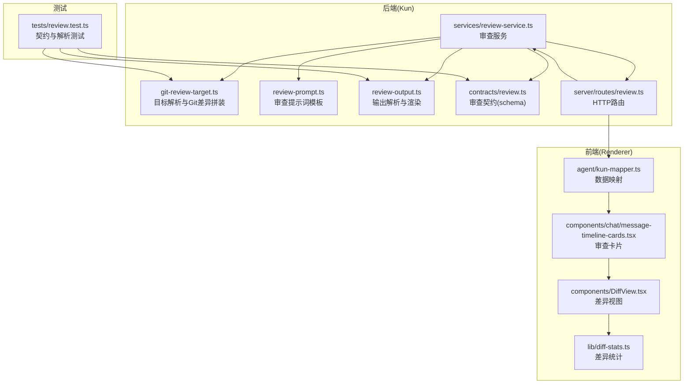
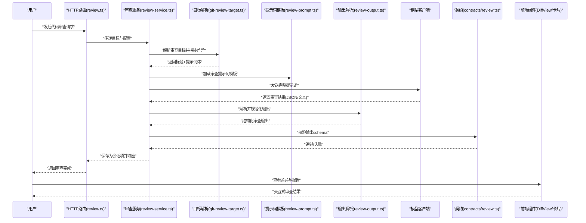
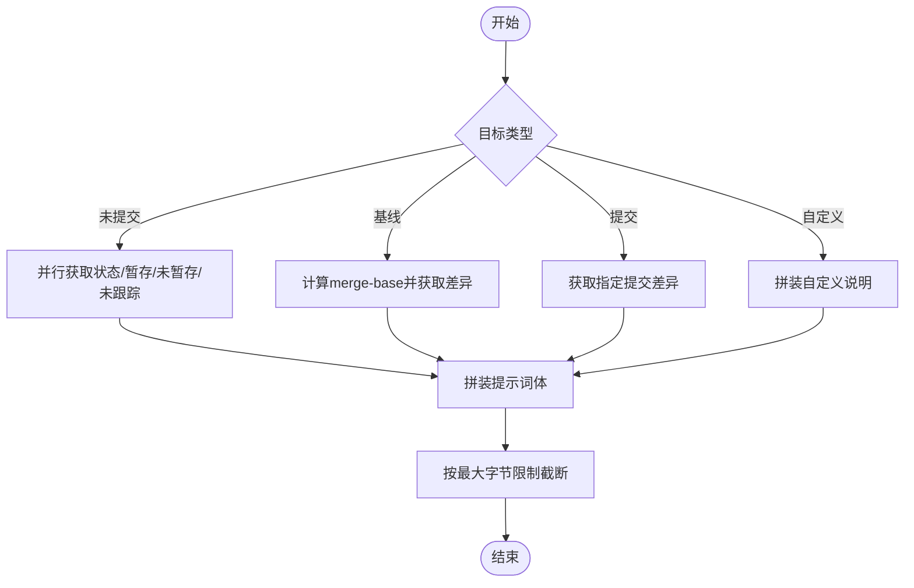
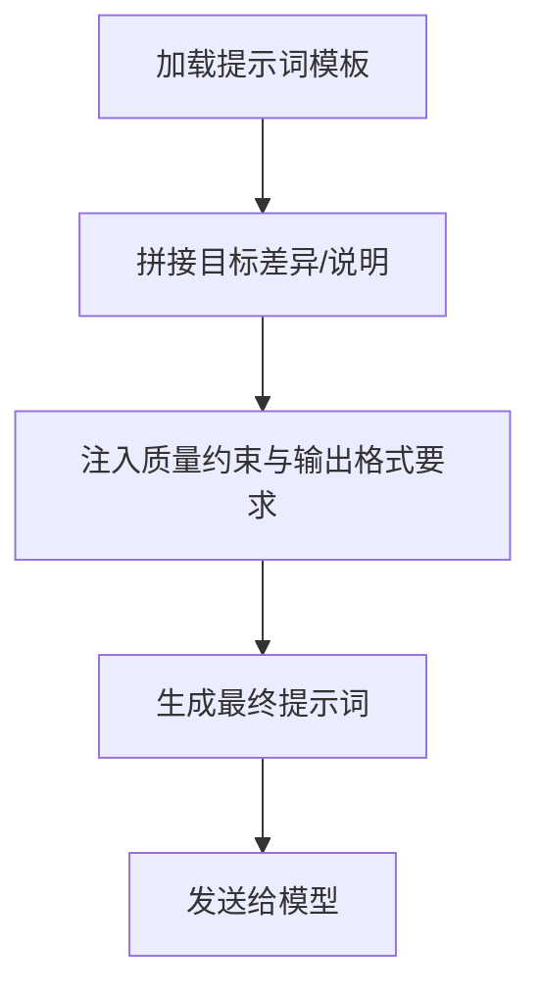
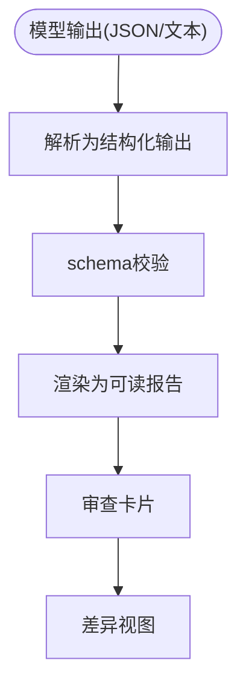
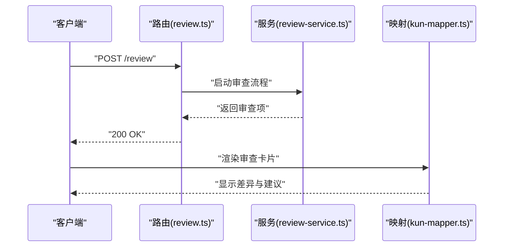
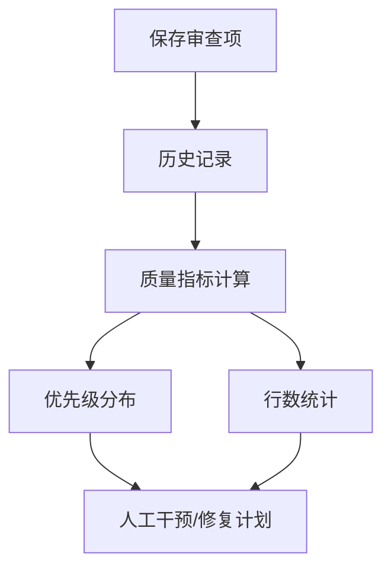
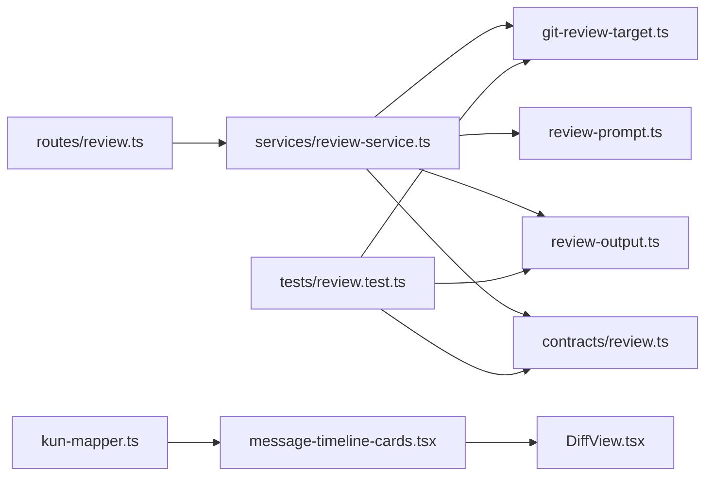

# 代码审查流程

<cite>
**本文引用的文件**
- [kun/src/review/git-review-target.ts](file://kun/src/review/git-review-target.ts)
- [kun/src/review/review-prompt.ts](file://kun/src/review/review-prompt.ts)
- [kun/src/review/review-output.ts](file://kun/src/review/review-output.ts)
- [kun/src/contracts/review.ts](file://kun/src/contracts/review.ts)
- [kun/src/services/review-service.ts](file://kun/src/services/review-service.ts)
- [kun/src/server/routes/review.ts](file://kun/src/server/routes/review.ts)
- [kun/tests/review.test.ts](file://kun/tests/review.test.ts)
- [src/renderer/src/components/DiffView.tsx](file://src/renderer/src/components/DiffView.tsx)
- [src/renderer/src/components/chat/message-timeline-cards.tsx](file://src/renderer/src/components/chat/message-timeline-cards.tsx)
- [src/renderer/src/lib/diff-stats.ts](file://src/renderer/src/lib/diff-stats.ts)
- [src/renderer/src/agent/kun-mapper.ts](file://src/renderer/src/agent/kun-mapper.ts)
</cite>

## 目录
1. [简介](#简介)
2. [项目结构](#项目结构)
3. [核心组件](#核心组件)
4. [架构总览](#架构总览)
5. [详细组件分析](#详细组件分析)
6. [依赖关系分析](#依赖关系分析)
7. [性能考量](#性能考量)
8. [故障排查指南](#故障排查指南)
9. [结论](#结论)
10. [附录](#附录)

## 简介
本文件系统性阐述 Code 模式下的代码审查流程：从触发机制、审查目标确定、提示词生成，到审查结果解析与呈现；覆盖 Git 差异分析、变更评估、建议生成与报告展示；并说明流程自动化程度、人工干预点及审查历史管理策略。同时给出最佳实践与质量评估标准，帮助团队在保证效率的同时提升代码质量。

## 项目结构
围绕代码审查的关键模块分布于后端服务层（Kun）、前端渲染层（Renderer）与测试用例中，形成“目标解析 → 提示词构建 → 结果解析 → 历史持久化 → 前端展示”的闭环。

**图表来源**
- [kun/src/review/git-review-target.ts:1-120](file://kun/src/review/git-review-target.ts#L1-L120)
- [kun/src/review/review-prompt.ts:1-41](file://kun/src/review/review-prompt.ts#L1-L41)
- [kun/src/review/review-output.ts](file://kun/src/review/review-output.ts)
- [kun/src/contracts/review.ts:1-44](file://kun/src/contracts/review.ts#L1-L44)
- [kun/src/services/review-service.ts](file://kun/src/services/review-service.ts)
- [kun/src/server/routes/review.ts](file://kun/src/server/routes/review.ts)
- [src/renderer/src/components/DiffView.tsx](file://src/renderer/src/components/DiffView.tsx)
- [src/renderer/src/components/chat/message-timeline-cards.tsx:1-33](file://src/renderer/src/components/chat/message-timeline-cards.tsx#L1-L33)
- [src/renderer/src/lib/diff-stats.ts](file://src/renderer/src/lib/diff-stats.ts)
- [src/renderer/src/agent/kun-mapper.ts:592-625](file://src/renderer/src/agent/kun-mapper.ts#L592-L625)
- [kun/tests/review.test.ts:1-80](file://kun/tests/review.test.ts#L1-L80)

**章节来源**
- [kun/src/review/git-review-target.ts:1-120](file://kun/src/review/git-review-target.ts#L1-L120)
- [kun/src/review/review-prompt.ts:1-41](file://kun/src/review/review-prompt.ts#L1-L41)
- [kun/src/review/review-output.ts](file://kun/src/review/review-output.ts)
- [kun/src/contracts/review.ts:1-44](file://kun/src/contracts/review.ts#L1-L44)
- [kun/src/services/review-service.ts](file://kun/src/services/review-service.ts)
- [kun/src/server/routes/review.ts](file://kun/src/server/routes/review.ts)
- [src/renderer/src/components/DiffView.tsx](file://src/renderer/src/components/DiffView.tsx)
- [src/renderer/src/components/chat/message-timeline-cards.tsx:1-33](file://src/renderer/src/components/chat/message-timeline-cards.tsx#L1-L33)
- [src/renderer/src/lib/diff-stats.ts](file://src/renderer/src/lib/diff-stats.ts)
- [src/renderer/src/agent/kun-mapper.ts:592-625](file://src/renderer/src/agent/kun-mapper.ts#L592-L625)
- [kun/tests/review.test.ts:1-80](file://kun/tests/review.test.ts#L1-L80)

## 核心组件
- 审查目标解析器：根据目标类型（未提交变更、基线分支、指定提交、自定义指令）拼装 Git 差异或自定义说明，并限制差异大小以控制上下文长度。
- 审查提示词模板：定义审查职责、优先级、JSON 输出格式与字段约束，确保模型稳定返回结构化结果。
- 审查输出解析器：兼容 Codex 风格 snake_case JSON 与纯文本输出，支持渲染为可读报告。
- 审查契约(schema)：统一审查输入目标、输出结构与字段范围，保障前后端一致性。
- 审查服务与HTTP路由：承接请求、调用目标解析与提示词模板、执行模型推理、解析输出并持久化为会话项。
- 前端展示：差异视图、审查卡片、差异统计与数据映射，实现审查结果可视化与交互。

**章节来源**
- [kun/src/review/git-review-target.ts:23-54](file://kun/src/review/git-review-target.ts#L23-L54)
- [kun/src/review/review-prompt.ts:1-41](file://kun/src/review/review-prompt.ts#L1-L41)
- [kun/src/review/review-output.ts](file://kun/src/review/review-output.ts)
- [kun/src/contracts/review.ts:1-44](file://kun/src/contracts/review.ts#L1-L44)
- [kun/src/services/review-service.ts](file://kun/src/services/review-service.ts)
- [kun/src/server/routes/review.ts](file://kun/src/server/routes/review.ts)
- [src/renderer/src/components/DiffView.tsx](file://src/renderer/src/components/DiffView.tsx)
- [src/renderer/src/components/chat/message-timeline-cards.tsx:1-33](file://src/renderer/src/components/chat/message-timeline-cards.tsx#L1-L33)
- [src/renderer/src/lib/diff-stats.ts](file://src/renderer/src/lib/diff-stats.ts)
- [src/renderer/src/agent/kun-mapper.ts:592-625](file://src/renderer/src/agent/kun-mapper.ts#L592-L625)

## 架构总览
下图展示了从用户触发到审查结果呈现的端到端流程，涵盖后端目标解析、提示词构建、模型推理、输出解析与前端展示。

**图表来源**
- [kun/src/server/routes/review.ts](file://kun/src/server/routes/review.ts)
- [kun/src/services/review-service.ts](file://kun/src/services/review-service.ts)
- [kun/src/review/git-review-target.ts:23-54](file://kun/src/review/git-review-target.ts#L23-L54)
- [kun/src/review/review-prompt.ts:1-41](file://kun/src/review/review-prompt.ts#L1-L41)
- [kun/src/review/review-output.ts](file://kun/src/review/review-output.ts)
- [kun/src/contracts/review.ts:1-44](file://kun/src/contracts/review.ts#L1-L44)
- [src/renderer/src/components/DiffView.tsx](file://src/renderer/src/components/DiffView.tsx)
- [src/renderer/src/components/chat/message-timeline-cards.tsx:1-33](file://src/renderer/src/components/chat/message-timeline-cards.tsx#L1-L33)

## 详细组件分析

### 组件一：审查目标解析与Git差异分析
- 支持的目标类型：
  - 未提交变更：收集暂存区、工作区与未跟踪文件的差异。
  - 基线分支：计算 HEAD 与目标分支的 merge-base 并获取差异。
  - 指定提交：直接获取该提交的差异。
  - 自定义指令：无需 Git 工作区，直接使用用户提供的说明作为审查上下文。
- 关键参数：
  - 最大差异字节数：默认 256KB，避免过长上下文影响性能与成本。
  - Git 命令超时与缓冲区限制：防止长时间阻塞与内存溢出。
- 处理逻辑：
  - 并行执行多个 Git 子进程以缩短等待时间。
  - 将状态与差异拼装进提示词体，便于模型理解当前变更范围。

**图表来源**
- [kun/src/review/git-review-target.ts:23-120](file://kun/src/review/git-review-target.ts#L23-L120)

**章节来源**
- [kun/src/review/git-review-target.ts:1-120](file://kun/src/review/git-review-target.ts#L1-L120)

### 组件二：审查提示词生成与质量约束
- 角色与职责：面向“已提议变更”的资深审查者，聚焦具体、可操作的缺陷。
- 优先级与范围：正确性、安全性、性能、并发、数据丢失、接口契约回归、缺失测试等。
- 输出规范：严格 JSON 结构，包含 findings 数组、整体正确性判断、解释与置信度分数。
- 字段约束：行号范围、绝对路径、优先级(0~3)、置信度(0~1)等，确保可落地修复。

**图表来源**
- [kun/src/review/review-prompt.ts:1-41](file://kun/src/review/review-prompt.ts#L1-L41)

**章节来源**
- [kun/src/review/review-prompt.ts:1-41](file://kun/src/review/review-prompt.ts#L1-L41)

### 组件三：审查输出解析与渲染
- 解析策略：
  - 兼容 Codex 风格 snake_case 字段与驼峰字段。
  - 若模型返回纯文本，则将整体解释作为无问题场景的兜底。
- 渲染规则：
  - 将每个 findings 转换为可读的条目，包含标题、原因、优先级、置信度与定位信息。
  - 对整体正确性进行总结，便于快速决策是否阻塞合并。
- 前端展示：
  - 使用差异视图组件高亮变更区域。
  - 在消息时间线卡片中聚合审查结果，支持展开/折叠与跳转。

**图表来源**
- [kun/src/review/review-output.ts](file://kun/src/review/review-output.ts)
- [kun/src/contracts/review.ts:1-44](file://kun/src/contracts/review.ts#L1-L44)
- [src/renderer/src/components/DiffView.tsx](file://src/renderer/src/components/DiffView.tsx)
- [src/renderer/src/components/chat/message-timeline-cards.tsx:1-33](file://src/renderer/src/components/chat/message-timeline-cards.tsx#L1-L33)

**章节来源**
- [kun/src/review/review-output.ts](file://kun/src/review/review-output.ts)
- [kun/src/contracts/review.ts:1-44](file://kun/src/contracts/review.ts#L1-L44)
- [src/renderer/src/components/DiffView.tsx](file://src/renderer/src/components/DiffView.tsx)
- [src/renderer/src/components/chat/message-timeline-cards.tsx:1-33](file://src/renderer/src/components/chat/message-timeline-cards.tsx#L1-L33)

### 组件四：审查服务与HTTP路由
- 路由职责：接收审查请求，解析目标与模型配置，交由服务层处理。
- 服务职责：串联目标解析、提示词构建、模型调用、输出解析与持久化，确保输出符合契约。
- 数据映射：将后端审查输出映射为前端可消费的数据结构，驱动 UI 展示。

**图表来源**
- [kun/src/server/routes/review.ts](file://kun/src/server/routes/review.ts)
- [kun/src/services/review-service.ts](file://kun/src/services/review-service.ts)
- [src/renderer/src/agent/kun-mapper.ts:592-625](file://src/renderer/src/agent/kun-mapper.ts#L592-L625)

**章节来源**
- [kun/src/server/routes/review.ts](file://kun/src/server/routes/review.ts)
- [kun/src/services/review-service.ts](file://kun/src/services/review-service.ts)
- [src/renderer/src/agent/kun-mapper.ts:592-625](file://src/renderer/src/agent/kun-mapper.ts#L592-L625)

### 组件五：审查历史管理与质量评估
- 历史持久化：审查项作为会话项存储，包含标题、目标、审查文本与结构化输出，支持后续检索与对比。
- 质量评估指标：
  - 整体正确性：patch 是否需要修复。
  - 整体解释：简要总结风险与结论。
  - 置信度分数：对整体结论的可信度量化。
  - 缺陷优先级分布：P0/P1/P2/P3 的数量与占比，辅助资源分配。
  - 变更规模统计：新增/修改/删除行数，辅助回归评估。
- 人工干预：前端可直接在差异视图中进行讨论与标注，审查卡片支持展开/折叠与跳转至具体文件位置。

**图表来源**
- [kun/src/contracts/review.ts:1-44](file://kun/src/contracts/review.ts#L1-L44)
- [src/renderer/src/lib/diff-stats.ts](file://src/renderer/src/lib/diff-stats.ts)
- [src/renderer/src/components/chat/message-timeline-cards.tsx:1-33](file://src/renderer/src/components/chat/message-timeline-cards.tsx#L1-L33)

**章节来源**
- [kun/src/contracts/review.ts:1-44](file://kun/src/contracts/review.ts#L1-L44)
- [src/renderer/src/lib/diff-stats.ts](file://src/renderer/src/lib/diff-stats.ts)
- [src/renderer/src/components/chat/message-timeline-cards.tsx:1-33](file://src/renderer/src/components/chat/message-timeline-cards.tsx#L1-L33)

## 依赖关系分析
- 后端依赖链：
  - 路由依赖服务；服务依赖目标解析器、提示词模板、输出解析器与契约校验。
  - 输出解析依赖契约 schema 进行强约束。
- 前端依赖链：
  - 数据映射依赖后端契约；差异视图与审查卡片依赖映射后的数据结构。
- 测试覆盖：
  - 契约与输出解析：验证结构化输出与渲染行为。
  - 目标解析：验证自定义指令与不同目标类型的提示词生成。

**图表来源**
- [kun/src/server/routes/review.ts](file://kun/src/server/routes/review.ts)
- [kun/src/services/review-service.ts](file://kun/src/services/review-service.ts)
- [kun/src/review/git-review-target.ts:1-120](file://kun/src/review/git-review-target.ts#L1-L120)
- [kun/src/review/review-prompt.ts:1-41](file://kun/src/review/review-prompt.ts#L1-L41)
- [kun/src/review/review-output.ts](file://kun/src/review/review-output.ts)
- [kun/src/contracts/review.ts:1-44](file://kun/src/contracts/review.ts#L1-L44)
- [src/renderer/src/agent/kun-mapper.ts:592-625](file://src/renderer/src/agent/kun-mapper.ts#L592-L625)
- [src/renderer/src/components/chat/message-timeline-cards.tsx:1-33](file://src/renderer/src/components/chat/message-timeline-cards.tsx#L1-L33)
- [src/renderer/src/components/DiffView.tsx](file://src/renderer/src/components/DiffView.tsx)
- [kun/tests/review.test.ts:1-80](file://kun/tests/review.test.ts#L1-L80)

**章节来源**
- [kun/src/server/routes/review.ts](file://kun/src/server/routes/review.ts)
- [kun/src/services/review-service.ts](file://kun/src/services/review-service.ts)
- [kun/src/review/git-review-target.ts:1-120](file://kun/src/review/git-review-target.ts#L1-L120)
- [kun/src/review/review-prompt.ts:1-41](file://kun/src/review/review-prompt.ts#L1-L41)
- [kun/src/review/review-output.ts](file://kun/src/review/review-output.ts)
- [kun/src/contracts/review.ts:1-44](file://kun/src/contracts/review.ts#L1-L44)
- [src/renderer/src/agent/kun-mapper.ts:592-625](file://src/renderer/src/agent/kun-mapper.ts#L592-L625)
- [src/renderer/src/components/chat/message-timeline-cards.tsx:1-33](file://src/renderer/src/components/chat/message-timeline-cards.tsx#L1-L33)
- [src/renderer/src/components/DiffView.tsx](file://src/renderer/src/components/DiffView.tsx)
- [kun/tests/review.test.ts:1-80](file://kun/tests/review.test.ts#L1-L80)

## 性能考量
- Git 差异截断：默认 256KB，避免超长差异导致上下文膨胀与成本上升。
- 并行子进程：状态与多类差异并行获取，减少等待时间。
- 命令超时与缓冲区：设置合理上限，防止极端情况阻塞。
- 前端延迟渲染：差异视图与卡片采用延迟渲染策略，优化首屏性能。
- 行为建议：在大规模变更时优先选择“基线分支”目标，缩小审查范围；必要时拆分 PR 降低差异体积。

[本节为通用指导，不涉及具体文件分析]

## 故障排查指南
- 目标解析失败：
  - 检查 Git 工作区是否存在、分支名是否有效、提交 SHA 是否存在。
  - 关注 merge-base 计算失败与空差异场景。
- 输出解析异常：
  - 确认模型输出是否严格遵循 JSON 结构；若返回纯文本，检查兜底逻辑是否生效。
  - 使用契约 schema 校验，定位字段缺失或类型错误。
- 前端展示异常：
  - 检查数据映射是否正确转换后端输出；确认差异视图组件是否正确接收路径与行号范围。
- 测试参考：
  - 使用现有测试用例验证目标解析、输出解析与契约一致性。

**章节来源**
- [kun/tests/review.test.ts:1-80](file://kun/tests/review.test.ts#L1-L80)
- [kun/src/review/git-review-target.ts:94-120](file://kun/src/review/git-review-target.ts#L94-L120)
- [kun/src/review/review-output.ts](file://kun/src/review/review-output.ts)
- [kun/src/contracts/review.ts:1-44](file://kun/src/contracts/review.ts#L1-L44)
- [src/renderer/src/agent/kun-mapper.ts:592-625](file://src/renderer/src/agent/kun-mapper.ts#L592-L625)

## 结论
该代码审查流程以“目标明确、提示规范、输出结构化、历史可追溯、前端可交互”为核心设计原则，结合 Git 差异分析与模型推理，实现了从触发到展示的全链路自动化。通过严格的契约约束与测试覆盖，保障了结果的一致性与可维护性；前端的差异视图与审查卡片进一步提升了可读性与协作效率。建议在实践中持续优化差异截断阈值与提示词模板，以平衡质量与成本。

[本节为总结性内容，不涉及具体文件分析]

## 附录
- 最佳实践清单：
  - 明确审查目标：优先使用“基线分支”或“指定提交”，避免无关变更干扰。
  - 控制差异规模：单次审查不超过 256KB，默认阈值可根据项目规模调整。
  - 强化提示词：在自定义指令中明确关注点（如安全、性能、并发），提升针对性。
  - 结果分级：依据 P0/P1 优先修复，P2/P3 后续迭代，确保阻塞项及时处理。
  - 人工复核：前端可直接标注与讨论，形成“模型初审 + 人工复核”的双保险。
- 质量评估标准：
  - 整体正确性：patch 是否需要修复。
  - 整体解释：简洁明了的风险总结。
  - 置信度分数：对结论的可信度量化，辅助决策。
  - 缺陷优先级分布：P0/P1 应零容忍，P2/P3 需纳入后续计划。
  - 变更规模统计：新增/修改/删除行数，用于回归评估与资源规划。

[本节为通用指导，不涉及具体文件分析]