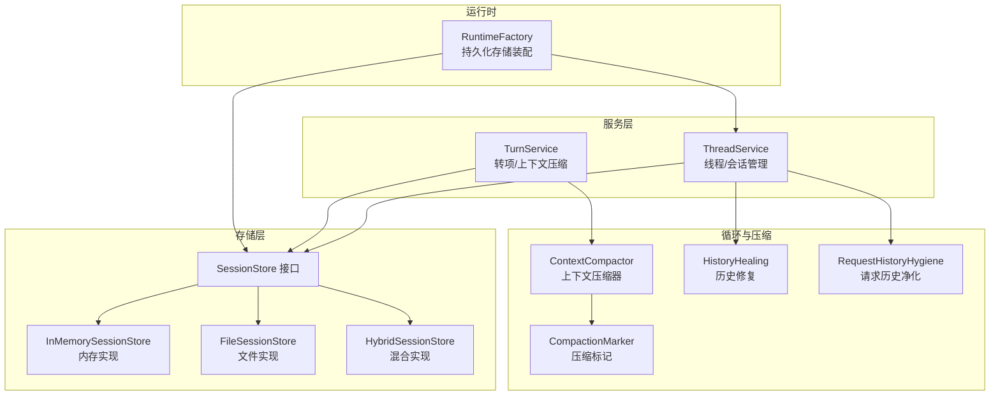
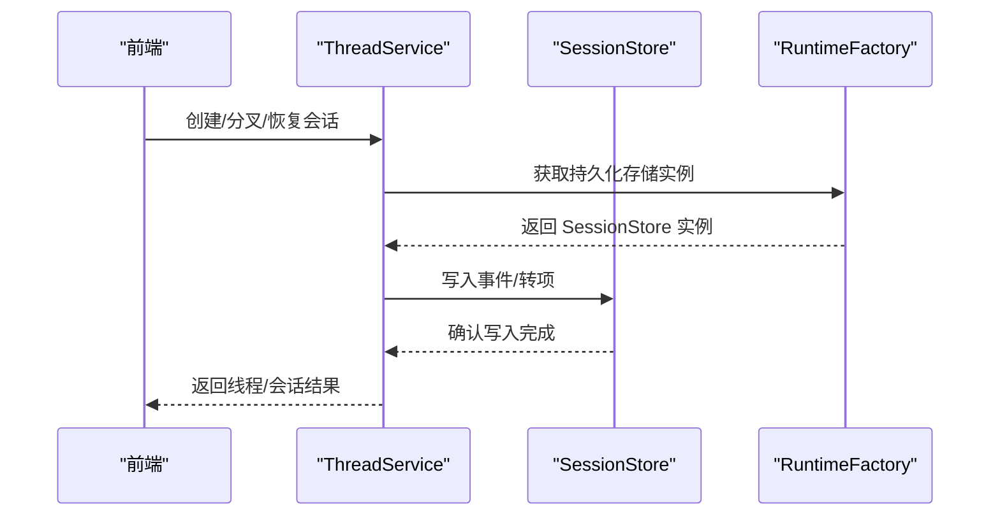
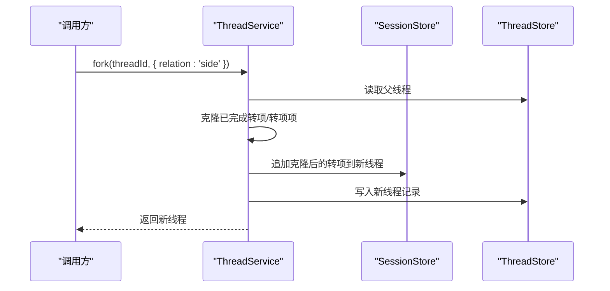
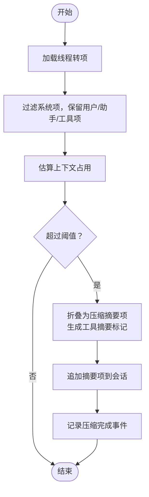
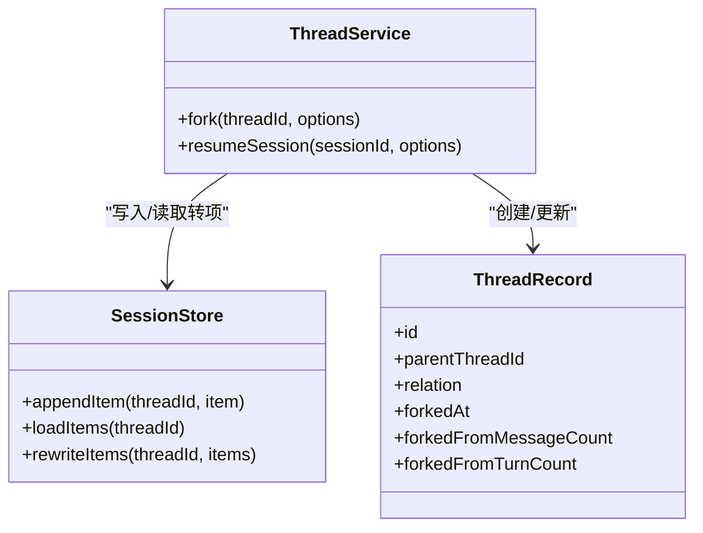
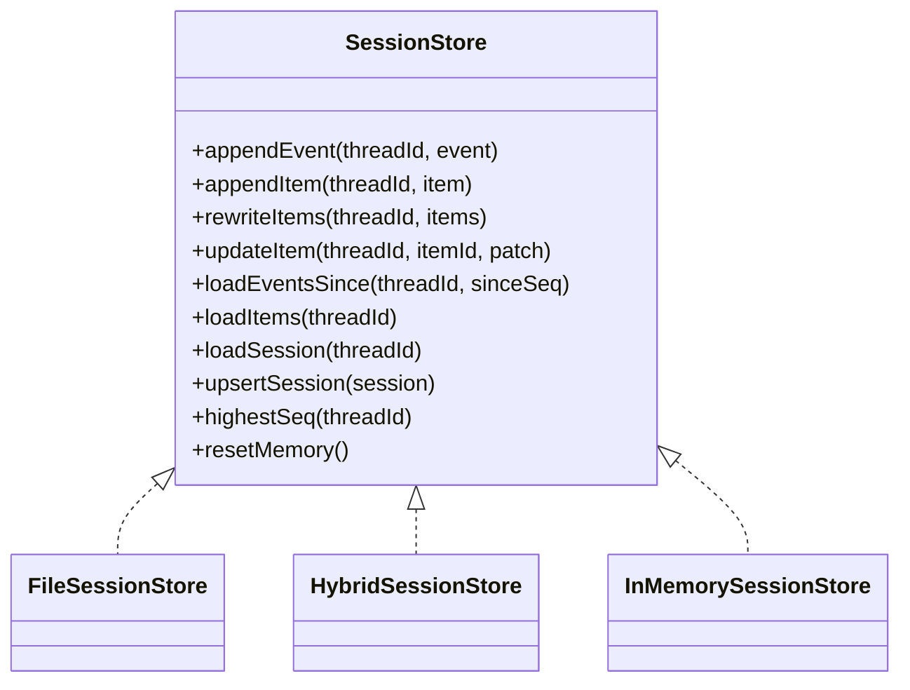
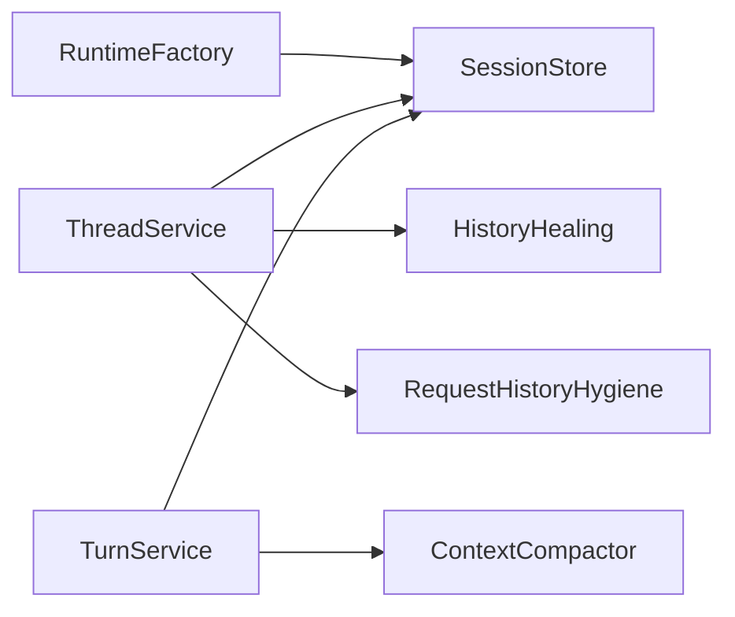

# 会话管理机制

<cite>
**本文引用的文件**
- [session-store.ts](file://kun/src/ports/session-store.ts)
- [in-memory-session-store.ts](file://kun/src/adapters/in-memory-session-store.ts)
- [file-session-store.ts](file://kun/src/adapters/file/file-session-store.ts)
- [hybrid-session-store.ts](file://kun/src/adapters/hybrid/hybrid-session-store.ts)
- [runtime-factory.ts](file://kun/src/server/runtime-factory.ts)
- [thread-service.ts](file://kun/src/services/thread-service.ts)
- [thread-fork-registry.ts](file://src/renderer/src/lib/thread-fork-registry.ts)
- [context-compactor.ts](file://kun/src/loop/context-compactor.ts)
- [compaction-marker.ts](file://kun/src/loop/compaction-marker.ts)
- [history-healing.ts](file://kun/src/loop/history-healing.ts)
- [request-history-hygiene.ts](file://kun/src/loop/request-history-hygiene.ts)
- [turn-service.ts](file://kun/src/services/turn-service.ts)
- [session.ts](file://kun/src/domain/session.ts)
- [file-session-store.test.ts](file://kun/tests/file-session-store.test.ts)
- [thread-service.test.ts](file://kun/tests/thread-service.test.ts)
</cite>

## 目录
1. [简介](#简介)
2. [项目结构](#项目结构)
3. [核心组件](#核心组件)
4. [架构总览](#架构总览)
5. [详细组件分析](#详细组件分析)
6. [依赖分析](#依赖分析)
7. [性能考虑](#性能考虑)
8. [故障排查指南](#故障排查指南)
9. [结论](#结论)
10. [附录](#附录)

## 简介
本文件系统性阐述 Code 模式下的会话管理机制，覆盖旁支对话（Side Thread）的创建与管理、会话压缩算法、对话分叉（Fork）机制、会话归档策略、会话状态持久化与历史检索、会话间关联关系、权限控制与共享机制，以及会话清理策略与最佳实践。内容基于仓库中的会话存储实现、线程服务、上下文压缩器与历史修复等模块进行深入分析，并通过图示展示关键流程。

## 项目结构
围绕会话管理的关键目录与文件如下：
- 存储端口与适配器：定义统一的会话存储接口及多种实现（内存、文件、混合）
- 运行时工厂：根据配置选择持久化存储后端
- 服务层：线程服务负责会话分叉、恢复与会话重建；转项服务负责上下文压缩
- 循环与压缩：上下文压缩器、压缩标记生成、历史修复与请求历史净化
- 前端关联：线程分叉注册表用于维护父子线程关系并在 UI 中呈现

**图表来源**
- [runtime-factory.ts:376-405](file://kun/src/server/runtime-factory.ts#L376-L405)
- [session-store.ts:13-31](file://kun/src/ports/session-store.ts#L13-L31)
- [in-memory-session-store.ts:14-35](file://kun/src/adapters/in-memory-session-store.ts#L14-L35)
- [file-session-store.ts](file://kun/src/adapters/file/file-session-store.ts)
- [hybrid-session-store.ts:13-37](file://kun/src/adapters/hybrid/hybrid-session-store.ts#L13-L37)
- [thread-service.ts:362-431](file://kun/src/services/thread-service.ts#L362-L431)
- [turn-service.ts:136-168](file://kun/src/services/turn-service.ts#L136-L168)
- [context-compactor.ts:34-42](file://kun/src/loop/context-compactor.ts#L34-L42)
- [compaction-marker.ts](file://kun/src/loop/compaction-marker.ts)
- [history-healing.ts](file://kun/src/loop/history-healing.ts)
- [request-history-hygiene.ts](file://kun/src/loop/request-history-hygiene.ts)

**章节来源**
- [runtime-factory.ts:376-405](file://kun/src/server/runtime-factory.ts#L376-L405)
- [session-store.ts:13-31](file://kun/src/ports/session-store.ts#L13-L31)

## 核心组件
- 会话存储接口与实现
  - SessionStore 定义事件流、转项历史、会话投影的增删改查能力，支持重写转项、更新转项、加载事件与转项、查询最高序列号、重置内存视图等。
  - InMemorySessionStore 提供内存级事件日志、转项列表与会话投影，便于测试与默认运行时。
  - FileSessionStore 将事件与转项以 JSONL 形式落盘，支持原子写入与事件压缩。
  - HybridSessionStore 在文件存储基础上增加索引钩子，确保写入成功后再更新索引，兼顾顺序一致性与检索效率。
- 线程服务
  - 负责创建、分叉（含旁支 side 与主干 fork）、恢复会话、从转项重建转项结构、记录线程创建事件。
- 上下文压缩
  - ContextCompactor 基于阈值与模型配置折叠长历史，生成压缩摘要项并注入工具摘要标记，减少上下文占用。
- 历史修复与净化
  - HistoryHealing 与 RequestHistoryHygiene 负责在异常或不一致场景下修复与清洗历史数据，保证会话一致性。

**章节来源**
- [session-store.ts:13-31](file://kun/src/ports/session-store.ts#L13-L31)
- [in-memory-session-store.ts:14-35](file://kun/src/adapters/in-memory-session-store.ts#L14-L35)
- [file-session-store.ts](file://kun/src/adapters/file/file-session-store.ts)
- [hybrid-session-store.ts:13-37](file://kun/src/adapters/hybrid/hybrid-session-store.ts#L13-L37)
- [thread-service.ts:362-431](file://kun/src/services/thread-service.ts#L362-L431)
- [turn-service.ts:136-168](file://kun/src/services/turn-service.ts#L136-L168)
- [context-compactor.ts:34-42](file://kun/src/loop/context-compactor.ts#L34-L42)
- [history-healing.ts](file://kun/src/loop/history-healing.ts)
- [request-history-hygiene.ts](file://kun/src/loop/request-history-hygiene.ts)

## 架构总览
会话管理采用“接口抽象 + 多后端实现 + 服务编排”的分层设计。运行时工厂按配置选择文件或混合存储；服务层通过统一的 SessionStore 接口访问底层存储；压缩器与修复器在循环阶段对历史进行治理。

**图表来源**
- [runtime-factory.ts:376-405](file://kun/src/server/runtime-factory.ts#L376-L405)
- [thread-service.ts:362-431](file://kun/src/services/thread-service.ts#L362-L431)
- [session-store.ts:13-31](file://kun/src/ports/session-store.ts#L13-L31)

## 详细组件分析

### 旁支对话（Side Thread）创建与管理
- 分叉类型
  - 主干分叉（fork）：默认行为，复制父线程当前快照，标题包含“fork”标识，保留父线程的多项元信息。
  - 旁支（side）：独立线程，标题包含“· side”，仅复制父线程已完成的转项，未完成的助理/工具项不会被复制，确保旁支与父线程隔离。
- 元信息与一致性
  - 新线程记录父线程 ID、分叉时间、分叉前消息数与转数等信息；父线程在分叉过程中保持不变。
  - 若父线程存在运行中转项，分叉时会丢弃未完成的助理/工具项，避免脏数据进入旁支。
- 前端关联
  - 线程分叉注册表维护父子关系，支持上限容量与刷新逻辑，确保 UI 能正确显示分叉树。

**图表来源**
- [thread-service.ts:362-407](file://kun/src/services/thread-service.ts#L362-L407)
- [thread-service.test.ts:134-214](file://kun/tests/thread-service.test.ts#L134-L214)
- [thread-fork-registry.ts:1-163](file://src/renderer/src/lib/thread-fork-registry.ts#L1-L163)

**章节来源**
- [thread-service.ts:362-431](file://kun/src/services/thread-service.ts#L362-L431)
- [thread-service.test.ts:134-214](file://kun/tests/thread-service.test.ts#L134-L214)
- [thread-fork-registry.ts:1-163](file://src/renderer/src/lib/thread-fork-registry.ts#L1-L163)

### 会话压缩算法
- 触发条件
  - 显式调用压缩接口或基于上下文估算超过软/硬阈值时自动触发。
- 折叠策略
  - 保留不可折叠的约束（如最近转项），将可折叠的历史折叠为单个压缩摘要项。
  - 生成工具摘要标记，携带源摘要哈希，便于后续追踪与验证。
- 输出与记录
  - 若发生替换，追加压缩摘要项并记录压缩完成事件，包含替换令牌数与固定约束。

**图表来源**
- [turn-service.ts:136-168](file://kun/src/services/turn-service.ts#L136-L168)
- [context-compactor.ts:34-42](file://kun/src/loop/context-compactor.ts#L34-L42)
- [compaction-marker.ts](file://kun/src/loop/compaction-marker.ts)

**章节来源**
- [turn-service.ts:136-168](file://kun/src/services/turn-service.ts#L136-L168)
- [context-compactor.ts:34-42](file://kun/src/loop/context-compactor.ts#L34-L42)
- [compaction-marker.ts](file://kun/src/loop/compaction-marker.ts)

### 对话分叉机制
- 快照语义
  - 分叉采用“快照”而非“共享引用”，父线程继续演进不影响已分叉的线程。
- 关系与标题
  - side 关系：标题附加“· side”，父线程关系仍为主干；fork 关系：标题包含“fork”，并记录分叉来源统计。
- 数据隔离
  - 旁支线程的转项变更不会影响父线程；若父线程存在运行中转项，分叉时丢弃未完成项，确保隔离性。

**图表来源**
- [thread-service.ts:362-431](file://kun/src/services/thread-service.ts#L362-L431)
- [session-store.ts:13-31](file://kun/src/ports/session-store.ts#L13-L31)

**章节来源**
- [thread-service.ts:362-431](file://kun/src/services/thread-service.ts#L362-L431)
- [session-store.ts:13-31](file://kun/src/ports/session-store.ts#L13-L31)

### 会话归档策略
- 归档入口
  - 通过重写转项流（rewriteItems）实现“归档”：将当前转项整体替换为新的归档版本，常用于一次性修复或丢弃部分历史。
- 原子性与恢复
  - 文件后端采用原子写入，失败时通过事件压缩与历史修复保障一致性。
- 使用场景
  - 历史净化、丢弃不必要片段、合并重复项、修复损坏片段。

**章节来源**
- [session-store.ts:17-21](file://kun/src/ports/session-store.ts#L17-L21)
- [history-healing.ts](file://kun/src/loop/history-healing.ts)
- [request-history-hygiene.ts](file://kun/src/loop/request-history-hygiene.ts)

### 会话状态持久化与历史检索
- 持久化视图
  - 事件流（SSE 回放）、转项历史（重建聊天块）、会话投影（重启重载）三视图并存，满足不同场景需求。
- 检索能力
  - 支持按序列号增量加载事件、全量加载转项、加载完整会话投影、查询最高序列号、重置内存视图。
- 后端选择
  - 文件后端：JSONL 落盘，支持事件压缩与原子写入。
  - 混合后端：文件体 + SQLite 索引钩子，写入成功后再更新索引，兼顾顺序一致性与检索效率。

**图表来源**
- [session-store.ts:13-31](file://kun/src/ports/session-store.ts#L13-L31)
- [file-session-store.ts](file://kun/src/adapters/file/file-session-store.ts)
- [hybrid-session-store.ts:13-37](file://kun/src/adapters/hybrid/hybrid-session-store.ts#L13-L37)
- [in-memory-session-store.ts:14-35](file://kun/src/adapters/in-memory-session-store.ts#L14-L35)

**章节来源**
- [session-store.ts:13-31](file://kun/src/ports/session-store.ts#L13-L31)
- [runtime-factory.ts:376-405](file://kun/src/server/runtime-factory.ts#L376-L405)
- [in-memory-session-store.ts:14-35](file://kun/src/adapters/in-memory-session-store.ts#L14-L35)
- [hybrid-session-store.ts:13-37](file://kun/src/adapters/hybrid/hybrid-session-store.ts#L13-L37)

### 会话间关联关系
- 关联字段
  - 父线程 ID、关系类型（主干/旁支）、分叉时间、分叉前统计等。
- 前端维护
  - 线程分叉注册表维护父子映射，具备容量上限与刷新策略，避免无限增长。
- 可视化与导航
  - UI 层据此渲染分叉树，支持快速定位与切换。

**章节来源**
- [thread-service.ts:362-431](file://kun/src/services/thread-service.ts#L362-L431)
- [thread-fork-registry.ts:1-163](file://src/renderer/src/lib/thread-fork-registry.ts#L1-L163)

### 权限控制与会话共享机制
- 权限控制
  - 当前代码库未发现显式的会话级权限控制实现；会话安全主要依赖运行时与存储后端的访问控制策略。
- 会话共享
  - 代码库未提供直接的“共享会话”接口；可通过导出/导入会话数据的方式间接实现共享（需结合业务场景自行扩展）。

**章节来源**
- [session-store.ts:13-31](file://kun/src/ports/session-store.ts#L13-L31)
- [runtime-factory.ts:376-405](file://kun/src/server/runtime-factory.ts#L376-L405)

### 会话清理策略
- 清理入口
  - rewriteItems：用于一次性替换转项流，可作为清理手段。
  - 历史净化：RequestHistoryHygiene 针对请求历史进行清洗。
- 事件压缩
  - FileSessionStore 支持使用事件压缩降低磁盘占用与 IO 压力。
- 建议
  - 定期评估会话大小，对长期无用的历史执行归档或清理；在高并发场景下优先使用混合后端以提升检索效率。

**章节来源**
- [session-store.ts:17-21](file://kun/src/ports/session-store.ts#L17-L21)
- [request-history-hygiene.ts](file://kun/src/loop/request-history-hygiene.ts)
- [file-session-store.test.ts:38-83](file://kun/tests/file-session-store.test.ts#L38-L83)

## 依赖分析
- 组件耦合
  - ThreadService 依赖 SessionStore 与 ThreadStore，承担会话生命周期管理。
  - TurnService 依赖 SessionStore 与 ContextCompactor，负责上下文压缩。
  - RuntimeFactory 负责装配存储后端，决定使用文件或混合存储。
- 外部依赖
  - 文件后端依赖原子写入与 JSONL 格式；混合后端依赖 SQLite 索引。
- 循环与修复
  - HistoryHealing 与 RequestHistoryHygiene 为会话一致性提供兜底保障。

**图表来源**
- [runtime-factory.ts:376-405](file://kun/src/server/runtime-factory.ts#L376-L405)
- [thread-service.ts:362-431](file://kun/src/services/thread-service.ts#L362-L431)
- [turn-service.ts:136-168](file://kun/src/services/turn-service.ts#L136-L168)
- [context-compactor.ts:34-42](file://kun/src/loop/context-compactor.ts#L34-L42)
- [history-healing.ts](file://kun/src/loop/history-healing.ts)
- [request-history-hygiene.ts](file://kun/src/loop/request-history-hygiene.ts)

**章节来源**
- [runtime-factory.ts:376-405](file://kun/src/server/runtime-factory.ts#L376-L405)
- [thread-service.ts:362-431](file://kun/src/services/thread-service.ts#L362-L431)
- [turn-service.ts:136-168](file://kun/src/services/turn-service.ts#L136-L168)

## 性能考虑
- 存储后端选择
  - 文件后端适合简单部署与低并发；混合后端在高并发与频繁检索场景下更具优势。
- 压缩与事件
  - 合理设置上下文阈值与压缩模式，避免过度压缩导致信息丢失；启用事件压缩降低 IO 压力。
- 内存窗口
  - InMemorySessionStore 提供小窗口缓存，适合短时高频访问；生产环境建议使用持久化后端。
- 并发与一致性
  - 混合后端在写入成功后再更新索引，避免读到中间态；文件后端采用原子写入，失败时通过历史修复恢复。

**章节来源**
- [hybrid-session-store.ts:13-37](file://kun/src/adapters/hybrid/hybrid-session-store.ts#L13-L37)
- [in-memory-session-store.ts:14-35](file://kun/src/adapters/in-memory-session-store.ts#L14-L35)
- [file-session-store.test.ts:38-83](file://kun/tests/file-session-store.test.ts#L38-L83)

## 故障排查指南
- 写入失败与事件压缩
  - 文件后端写入失败时，事件压缩可能失败但不影响事件流加载；检查错误日志并确认磁盘权限与空间。
- 历史不一致
  - 使用 HistoryHealing 与 RequestHistoryHygiene 修复异常；必要时通过 rewriteItems 执行一次性归档。
- 旁支隔离问题
  - 确认分叉时未复制未完成项；若出现父线程被污染，检查分叉逻辑与转项状态。

**章节来源**
- [file-session-store.test.ts:38-83](file://kun/tests/file-session-store.test.ts#L38-L83)
- [history-healing.ts](file://kun/src/loop/history-healing.ts)
- [request-history-hygiene.ts](file://kun/src/loop/request-history-hygiene.ts)
- [thread-service.ts:362-431](file://kun/src/services/thread-service.ts#L362-L431)

## 结论
本会话管理机制通过统一的 SessionStore 接口与多后端实现，结合线程服务的分叉与恢复能力、上下文压缩器的历史折叠、以及历史修复与净化流程，形成了完整的 Code 模式会话生命周期管理体系。混合后端在检索效率与一致性之间取得平衡，适合复杂场景；同时，旁支对话与分叉注册表为多任务并行与历史追溯提供了良好支撑。

## 附录
- 最佳实践
  - 为每个线程明确关系类型（主干/旁支），并记录分叉统计信息。
  - 合理设置上下文阈值与压缩模式，定期评估会话大小并执行归档。
  - 在高并发场景优先使用混合后端，并开启事件压缩与原子写入。
  - 使用历史修复与净化工具定期清理异常与冗余历史。
- 相关类型与实体
  - 会话（AgentSession）：会话投影，用于重启重载。
  - 转项（TurnItem）：用户消息、助手文本、工具调用/输出等。
  - 事件（RuntimeEvent）：运行时事件，用于 SSE 回放与增量加载。

**章节来源**
- [session.ts](file://kun/src/domain/session.ts)
- [session-store.ts:13-31](file://kun/src/ports/session-store.ts#L13-L31)
- [thread-service.ts:362-431](file://kun/src/services/thread-service.ts#L362-L431)
- [turn-service.ts:136-168](file://kun/src/services/turn-service.ts#L136-L168)