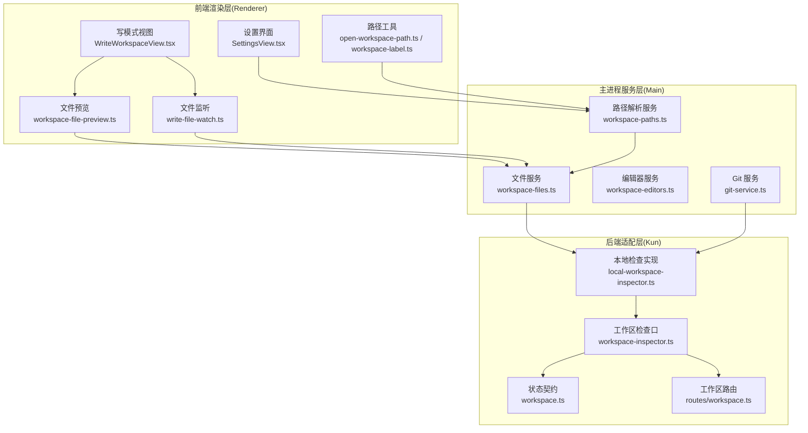
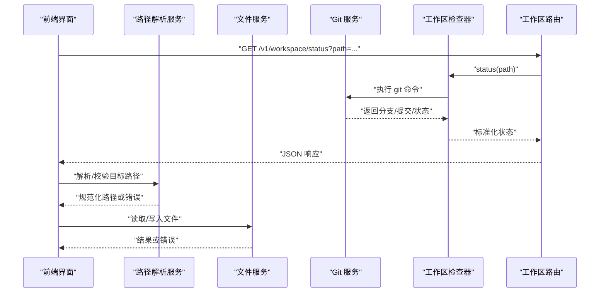
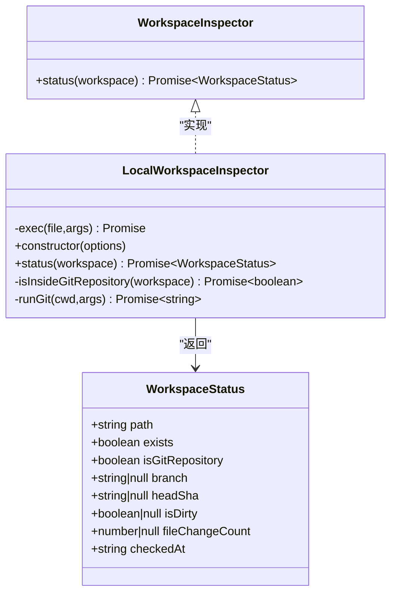
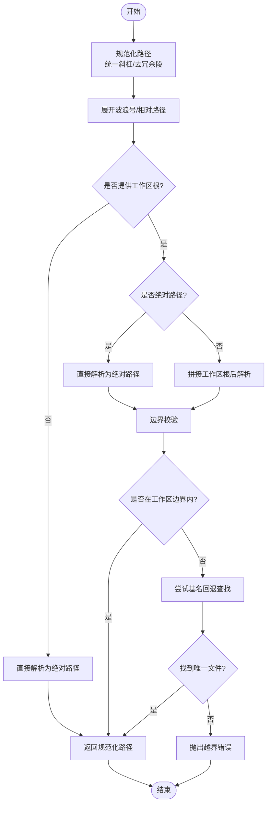
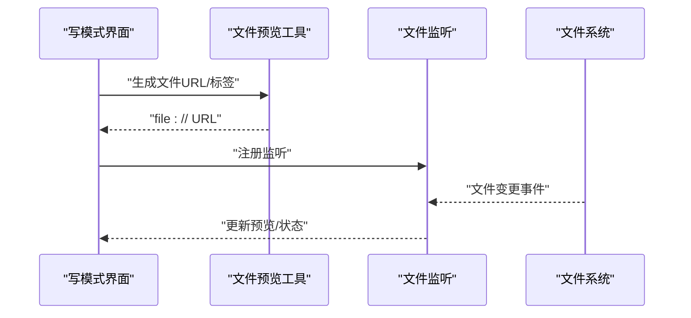
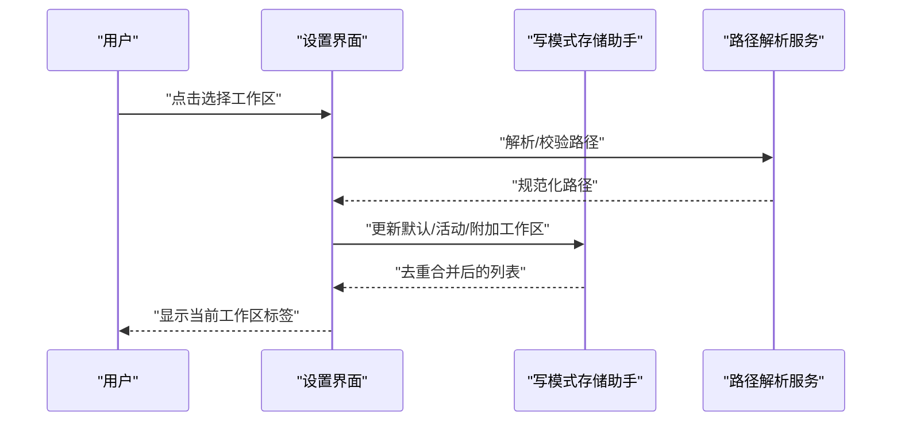
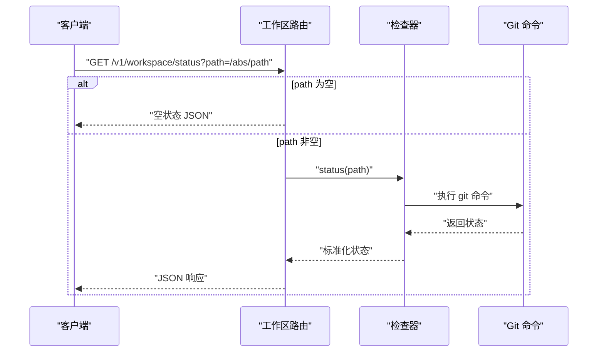
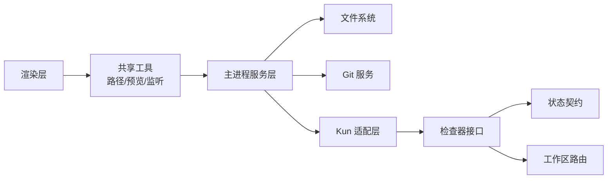

# 工作空间管理

<cite>
**本文引用的文件**
- [local-workspace-inspector.ts](file://kun/src/adapters/workspace/local-workspace-inspector.ts)
- [workspace-inspector.ts](file://kun/src/ports/workspace-inspector.ts)
- [workspace.ts](file://kun/src/contracts/workspace.ts)
- [workspace.ts](file://kun/src/server/routes/workspace.ts)
- [workspace-paths.ts](file://src/main/services/workspace-paths.ts)
- [workspace-service.ts](file://src/main/services/workspace-service.ts)
- [workspace-files.ts](file://src/main/services/workspace-files.ts)
- [workspace-editors.ts](file://src/main/services/workspace-editors.ts)
- [workspace-file.ts](file://src/shared/workspace-file.ts)
- [write-markdown-resource.ts](file://src/shared/write-markdown-resource.ts)
- [write-workspace-store-helpers.ts](file://src/renderer/src/write/write-workspace-store-helpers.ts)
- [SettingsView.tsx](file://src/renderer/src/components/SettingsView.tsx)
- [settings-section-general.tsx](file://src/renderer/src/components/settings-section-general.tsx)
- [WriteWorkspaceEmptyState.tsx](file://src/renderer/src/components/write/WriteWorkspaceEmptyState.tsx)
- [open-workspace-path.ts](file://src/renderer/src/lib/open-workspace-path.ts)
- [workspace-label.ts](file://src/renderer/src/lib/workspace-label.ts)
- [workspace-file-preview.ts](file://src/renderer/src/lib/workspace-file-preview.ts)
- [write-workspace-view-utils.ts](file://src/renderer/src/write/write-workspace-view-utils.ts)
- [write-file-watch.ts](file://src/renderer/src/write/write-file-watch.ts)
- [git-service.ts](file://src/main/services/git-service.ts)
</cite>

## 目录
1. [简介](#简介)
2. [项目结构](#项目结构)
3. [核心组件](#核心组件)
4. [架构总览](#架构总览)
5. [详细组件分析](#详细组件分析)
6. [依赖关系分析](#依赖关系分析)
7. [性能考量](#性能考量)
8. [故障排查指南](#故障排查指南)
9. [结论](#结论)
10. [附录](#附录)

## 简介
本文件围绕 Code 模式下的工作空间管理进行系统化说明，重点覆盖以下方面：
- 本地工作空间的绑定机制与路径解析策略
- 文件系统监控与文件变更监听机制
- 工作区标签生成与文件预览能力
- 工作空间初始化流程与状态管理
- 与 Git 仓库的集成方式及权限控制
- 配置最佳实践与常见问题解决方案

## 项目结构
工作空间管理涉及三层：前端渲染层（Renderer）、主进程服务层（Main）与后端适配层（Kun）。前端负责用户交互、路径规范化与文件预览；主进程负责路径解析、边界校验与文件操作；后端适配层通过 Git 提供工作区状态查询。

图表来源
- [workspace-paths.ts:129-184](file://src/main/services/workspace-paths.ts#L129-L184)
- [workspace-files.ts](file://src/main/services/workspace-files.ts)
- [workspace-editors.ts](file://src/main/services/workspace-editors.ts)
- [workspace-inspector.ts:8-10](file://kun/src/ports/workspace-inspector.ts#L8-L10)
- [local-workspace-inspector.ts:16-86](file://kun/src/adapters/workspace/local-workspace-inspector.ts#L16-L86)
- [workspace.ts:8-17](file://kun/src/contracts/workspace.ts#L8-L17)
- [workspace.ts:9-27](file://kun/src/server/routes/workspace.ts#L9-L27)

章节来源
- [workspace-paths.ts:129-184](file://src/main/services/workspace-paths.ts#L129-L184)
- [workspace-files.ts](file://src/main/services/workspace-files.ts)
- [workspace-editors.ts](file://src/main/services/workspace-editors.ts)
- [workspace-inspector.ts:8-10](file://kun/src/ports/workspace-inspector.ts#L8-L10)
- [local-workspace-inspector.ts:16-86](file://kun/src/adapters/workspace/local-workspace-inspector.ts#L16-L86)
- [workspace.ts:8-17](file://kun/src/contracts/workspace.ts#L8-L17)
- [workspace.ts:9-27](file://kun/src/server/routes/workspace.ts#L9-L27)

## 核心组件
- 工作区检查器（Workspace Inspector）
  - 职责：检测给定路径是否为 Git 仓库、分支、提交哈希、脏状态与变更计数，并返回标准化状态对象。
  - 实现：本地实现通过调用系统 Git 命令获取信息，未强制要求 Git 存在，缺失时字段为空。
- 路径解析服务（Workspace Paths）
  - 职责：规范化用户输入路径、展开波浪号、解析绝对/相对路径、限制访问范围在选定工作区边界内。
  - 关键点：严格边界校验，防止路径逃逸；支持基名回退查找唯一文件。
- 文件服务（Workspace Files）
  - 职责：提供工作区内文件读取、写入、目录遍历等能力，结合路径解析服务保证安全。
- 编辑器服务（Workspace Editors）
  - 职责：协调外部编辑器打开工作区内文件，确保路径正确且在边界内。
- 前端路径与标签（Renderer）
  - 职责：路径规范化、工作区标签生成、文件预览、文件变更监听。
- Git 集成（Git Service）
  - 职责：提供 Git 操作封装，供工作区状态检查与变更监听使用。

章节来源
- [local-workspace-inspector.ts:16-86](file://kun/src/adapters/workspace/local-workspace-inspector.ts#L16-L86)
- [workspace-inspector.ts:8-10](file://kun/src/ports/workspace-inspector.ts#L8-L10)
- [workspace.ts:8-17](file://kun/src/contracts/workspace.ts#L8-L17)
- [workspace-paths.ts:129-184](file://src/main/services/workspace-paths.ts#L129-L184)
- [workspace-files.ts](file://src/main/services/workspace-files.ts)
- [workspace-editors.ts](file://src/main/services/workspace-editors.ts)
- [git-service.ts](file://src/main/services/git-service.ts)

## 架构总览
工作空间管理采用“前端-主进程-后端适配”的分层设计：
- 前端负责用户交互与本地体验（路径规范化、标签生成、文件预览、监听）。
- 主进程负责安全与一致性（路径解析、边界校验、文件操作）。
- 后端适配层通过 Git 获取工作区状态，作为只读信息源。

图表来源
- [workspace.ts:9-27](file://kun/src/server/routes/workspace.ts#L9-L27)
- [local-workspace-inspector.ts:30-72](file://kun/src/adapters/workspace/local-workspace-inspector.ts#L30-L72)
- [workspace-paths.ts:154-184](file://src/main/services/workspace-paths.ts#L154-L184)
- [workspace-files.ts](file://src/main/services/workspace-files.ts)

## 详细组件分析

### 组件一：本地工作区检查器（LocalWorkspaceInspector）
- 设计要点
  - 仅在存在时报告 Git 信息，不存在则返回空值占位。
  - 使用异步执行 Git 命令，失败时降级为空值。
  - 返回时间戳用于客户端缓存与刷新策略。
- 数据模型
  - 状态包含：路径、是否存在、是否 Git 仓库、分支、提交哈希、是否脏、变更计数、检查时间。

图表来源
- [workspace-inspector.ts:8-10](file://kun/src/ports/workspace-inspector.ts#L8-L10)
- [local-workspace-inspector.ts:16-86](file://kun/src/adapters/workspace/local-workspace-inspector.ts#L16-L86)
- [workspace.ts:8-17](file://kun/src/contracts/workspace.ts#L8-L17)

章节来源
- [local-workspace-inspector.ts:16-86](file://kun/src/adapters/workspace/local-workspace-inspector.ts#L16-L86)
- [workspace-inspector.ts:8-10](file://kun/src/ports/workspace-inspector.ts#L8-L10)
- [workspace.ts:8-17](file://kun/src/contracts/workspace.ts#L8-L17)

### 组件二：路径解析与边界校验（workspace-paths）
- 功能概述
  - 规范化用户输入路径（斜杠统一、去除多余段）。
  - 展开波浪号与相对路径，解析到绝对路径。
  - 在指定工作区根下进行边界校验，防止路径逃逸。
  - 支持基名回退：在工作区内按文件名唯一匹配。
- 关键算法流程

图表来源
- [workspace-paths.ts:129-184](file://src/main/services/workspace-paths.ts#L129-L184)
- [workspace-paths.ts:186-215](file://src/main/services/workspace-paths.ts#L186-L215)

章节来源
- [workspace-paths.ts:129-184](file://src/main/services/workspace-paths.ts#L129-L184)
- [workspace-paths.ts:186-215](file://src/main/services/workspace-paths.ts#L186-L215)

### 组件三：文件预览与监听（Renderer）
- 文件预览
  - 将工作区路径转换为文件协议 URL，便于浏览器安全加载。
  - 支持资源 URL 协议识别与路径规范化。
- 文件监听
  - 基于文件系统事件对工作区内文件进行变更监听，触发 UI 更新与状态同步。
- 工作区标签
  - 从路径派生人类可读标签，用于界面展示与切换。

图表来源
- [write-markdown-resource.ts:28-35](file://src/shared/write-markdown-resource.ts#L28-L35)
- [workspace-file-preview.ts](file://src/renderer/src/lib/workspace-file-preview.ts)
- [write-file-watch.ts](file://src/renderer/src/write/write-file-watch.ts)
- [workspace-label.ts](file://src/renderer/src/lib/workspace-label.ts)

章节来源
- [write-markdown-resource.ts:28-35](file://src/shared/write-markdown-resource.ts#L28-L35)
- [workspace-file-preview.ts](file://src/renderer/src/lib/workspace-file-preview.ts)
- [write-file-watch.ts](file://src/renderer/src/write/write-file-watch.ts)
- [workspace-label.ts](file://src/renderer/src/lib/workspace-label.ts)

### 组件四：工作区初始化与设置（Settings）
- 初始化流程
  - 用户在设置界面选择工作区根目录，系统将其写入配置并去重合并。
  - 写模式默认工作区与活动工作区同步更新。
- 设置项
  - 通用设置：工作区根目录、浏览按钮、恢复默认。
  - 写模式设置：默认工作区、活动工作区、附加工作区列表。

图表来源
- [SettingsView.tsx:606-647](file://src/renderer/src/components/SettingsView.tsx#L606-L647)
- [settings-section-general.tsx:210-235](file://src/renderer/src/components/settings-section-general.tsx#L210-L235)
- [write-workspace-store-helpers.ts:75-95](file://src/renderer/src/write/write-workspace-store-helpers.ts#L75-L95)

章节来源
- [SettingsView.tsx:606-647](file://src/renderer/src/components/SettingsView.tsx#L606-L647)
- [settings-section-general.tsx:210-235](file://src/renderer/src/components/settings-section-general.tsx#L210-L235)
- [write-workspace-store-helpers.ts:75-95](file://src/renderer/src/write/write-workspace-store-helpers.ts#L75-L95)

### 组件五：工作区状态管理与路由
- 状态路由
  - 提供 /v1/workspace/status 接口，支持无参数时返回空状态。
  - 参数 path 为空时返回空状态占位，非空时委托检查器获取真实状态。
- 状态契约
  - 使用 Zod 定义状态字段类型，确保前后端一致。

图表来源
- [workspace.ts:9-27](file://kun/src/server/routes/workspace.ts#L9-L27)
- [local-workspace-inspector.ts:30-72](file://kun/src/adapters/workspace/local-workspace-inspector.ts#L30-L72)
- [workspace.ts:8-17](file://kun/src/contracts/workspace.ts#L8-L17)

章节来源
- [workspace.ts:9-27](file://kun/src/server/routes/workspace.ts#L9-L27)
- [local-workspace-inspector.ts:30-72](file://kun/src/adapters/workspace/local-workspace-inspector.ts#L30-L72)
- [workspace.ts:8-17](file://kun/src/contracts/workspace.ts#L8-L17)

## 依赖关系分析
- 前端依赖
  - 渲染层依赖路径工具、文件预览与监听模块，确保 UI 与文件系统交互的安全性与一致性。
- 主进程依赖
  - 路径解析服务依赖文件系统 API 与平台差异处理（大小写不敏感等）。
  - 文件服务依赖路径解析服务，确保所有操作都在工作区边界内。
- 后端适配依赖
  - 检查器依赖 Git 命令，若不可用则降级为空状态字段。
- 路由依赖
  - 路由依赖检查器接口，返回标准化状态。

图表来源
- [workspace-paths.ts:129-184](file://src/main/services/workspace-paths.ts#L129-L184)
- [workspace-files.ts](file://src/main/services/workspace-files.ts)
- [git-service.ts](file://src/main/services/git-service.ts)
- [workspace-inspector.ts:8-10](file://kun/src/ports/workspace-inspector.ts#L8-L10)
- [local-workspace-inspector.ts:16-86](file://kun/src/adapters/workspace/local-workspace-inspector.ts#L16-L86)
- [workspace.ts:8-17](file://kun/src/contracts/workspace.ts#L8-L17)
- [workspace.ts:9-27](file://kun/src/server/routes/workspace.ts#L9-L27)

章节来源
- [workspace-paths.ts:129-184](file://src/main/services/workspace-paths.ts#L129-L184)
- [workspace-files.ts](file://src/main/services/workspace-files.ts)
- [git-service.ts](file://src/main/services/git-service.ts)
- [workspace-inspector.ts:8-10](file://kun/src/ports/workspace-inspector.ts#L8-L10)
- [local-workspace-inspector.ts:16-86](file://kun/src/adapters/workspace/local-workspace-inspector.ts#L16-L86)
- [workspace.ts:8-17](file://kun/src/contracts/workspace.ts#L8-L17)
- [workspace.ts:9-27](file://kun/src/server/routes/workspace.ts#L9-L27)

## 性能考量
- 路径解析
  - 使用一次性规范化与去重策略，避免重复计算。
  - 边界校验在解析阶段完成，减少后续 IO 失败概率。
- 文件监听
  - 仅监听工作区内文件，降低事件风暴影响。
  - 合理设置去抖与批量更新，避免频繁 UI 刷新。
- Git 查询
  - 异步执行命令并降级处理，避免阻塞主线程。
  - 对于非 Git 场景，返回空状态以减少额外开销。

## 故障排查指南
- “路径必须保持在所选工作区内部”
  - 可能原因：相对路径逃逸、绝对路径指向工作区外。
  - 解决方案：确认工作区根与目标路径，使用基名回退或绝对路径校验。
- “找不到文件”
  - 可能原因：路径不存在、大小写不一致、平台差异。
  - 解决方案：启用基名回退查找，检查大小写与平台路径分隔符。
- “工作区状态为空”
  - 可能原因：未提供 path 参数、Git 不可用。
  - 解决方案：提供有效路径或安装 Git；确认命令可执行。
- “写模式空状态”
  - 可能原因：未选择工作区根或路径无效。
  - 解决方案：在设置中重新选择工作区根，确保路径可访问。

章节来源
- [workspace-paths.ts:142-152](file://src/main/services/workspace-paths.ts#L142-L152)
- [workspace-paths.ts:214-215](file://src/main/services/workspace-paths.ts#L214-L215)
- [workspace.ts:13-26](file://kun/src/server/routes/workspace.ts#L13-L26)
- [WriteWorkspaceEmptyState.tsx:27-41](file://src/renderer/src/components/write/WriteWorkspaceEmptyState.tsx#L27-L41)

## 结论
工作空间管理通过严格的路径解析与边界校验保障安全性，结合 Git 状态查询提供可靠的工作区上下文信息。前端负责用户体验与本地优化，主进程负责安全与一致性，后端适配层提供只读状态。整体设计在易用性与安全性之间取得平衡，适合在复杂项目中稳定运行。

## 附录
- 最佳实践
  - 在设置中明确工作区根目录，避免使用相对路径导致的不确定性。
  - 启用基名回退时注意文件名唯一性，必要时使用完整路径。
  - 对大目录启用文件监听时，合理设置过滤规则与去抖参数。
  - Git 不可用时，工作区仍可使用，但状态信息为空。
- 常见问题
  - 跨平台路径分隔符：统一使用正斜杠，避免反斜杠导致的解析异常。
  - 大小写敏感：Linux 平台区分大小写，Windows/macOS 不区分，解析时需考虑平台差异。
  - 权限控制：主进程负责边界校验，前端仅负责 UI 交互，确保所有文件操作均经主进程验证。