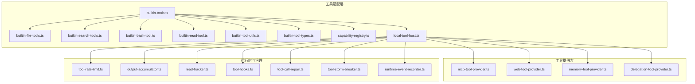
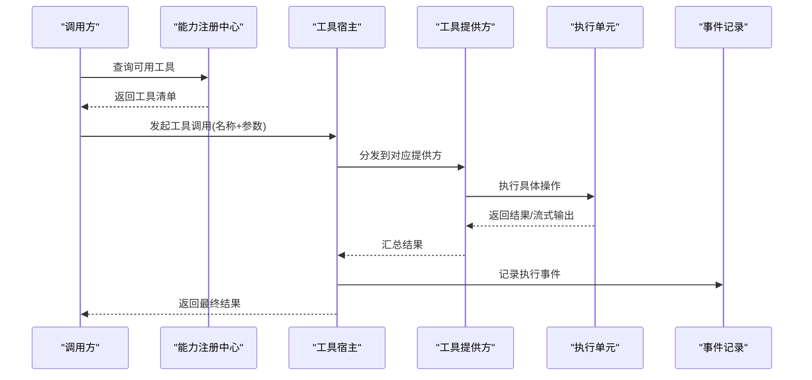
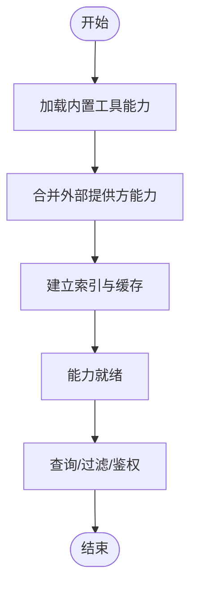
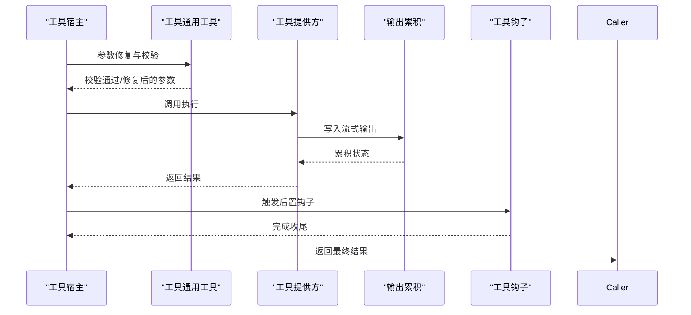
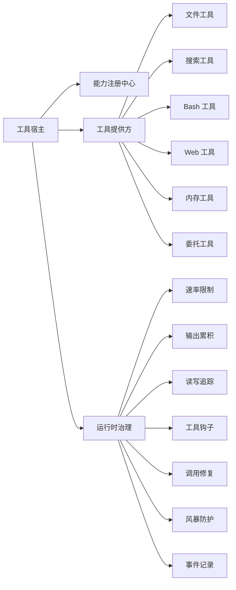

# 工具调用执行

<cite>
**本文引用的文件**
- [builtin-tools.ts](file://kun/src/adapters/tool/builtin-tools.ts)
- [builtin-file-tools.ts](file://kun/src/adapters/tool/builtin-file-tools.ts)
- [builtin-search-tools.ts](file://kun/src/adapters/tool/builtin-search-tools.ts)
- [builtin-bash-tool.ts](file://kun/src/adapters/tool/builtin-bash-tool.ts)
- [builtin-read-tool.ts](file://kun/src/adapters/tool/builtin-read-tool.ts)
- [builtin-tool-types.ts](file://kun/src/adapters/tool/builtin-tool-types.ts)
- [builtin-tool-utils.ts](file://kun/src/adapters/tool/builtin-tool-utils.ts)
- [capability-registry.ts](file://kun/src/adapters/tool/capability-registry.ts)
- [local-tool-host.ts](file://kun/src/adapters/tool/local-tool-host.ts)
- [tool-host.ts](file://kun/src/ports/tool-host.ts)
- [mcp-tool-provider.ts](file://kun/src/adapters/tool/mcp-tool-provider.ts)
- [web-tool-provider.ts](file://kun/src/adapters/tool/web-tool-provider.ts)
- [memory-tool-provider.ts](file://kun/src/adapters/tool/memory-tool-provider.ts)
- [delegation-tool-provider.ts](file://kun/src/adapters/tool/delegation-tool-provider.ts)
- [tool-rate-limit.ts](file://kun/src/adapters/tool/tool-rate-limit.ts)
- [output-accumulator.ts](file://kun/src/adapters/tool/output-accumulator.ts)
- [read-tracker.ts](file://kun/src/adapters/tool/read-tracker.ts)
- [tool-hooks.ts](file://kun/src/adapters/tool/tool-hooks.ts)
- [tool-call-repair.ts](file://kun/src/loop/tool-call-repair.ts)
- [tool-storm-breaker.ts](file://kun/src/loop/tool-storm-breaker.ts)
- [runtime-event-recorder.ts](file://kun/src/services/runtime-event-recorder.ts)
- [index.ts](file://kun/src/index.ts)
</cite>

## 目录
1. [简介](#简介)
2. [项目结构](#项目结构)
3. [核心组件](#核心组件)
4. [架构总览](#架构总览)
5. [详细组件分析](#详细组件分析)
6. [依赖关系分析](#依赖关系分析)
7. [性能考量](#性能考量)
8. [故障排查指南](#故障排查指南)
9. [结论](#结论)
10. [附录](#附录)

## 简介
本文件聚焦于 Code 模式下的“工具调用执行”能力，系统性阐述工具注册机制、工具执行流程、参数传递与结果处理；并按内置工具类型（文件工具、搜索工具、Bash 工具、Web 工具）进行分类说明，覆盖工具能力注册、安全限制、错误处理、超时与并发控制、历史记录等主题。最后提供扩展开发指南与调试技巧，帮助开发者在保证安全与稳定性的前提下扩展工具生态。

## 项目结构
工具子系统位于后端适配层，围绕“工具宿主”“能力注册中心”“内置工具集合”“外部工具提供方（MCP/Web/Memory/Delegation）”展开，并通过速率限制、输出累积、读写追踪、钩子与修复器等模块保障执行质量与稳定性。

图表来源
- [builtin-tools.ts](file://kun/src/adapters/tool/builtin-tools.ts)
- [builtin-file-tools.ts](file://kun/src/adapters/tool/builtin-file-tools.ts)
- [builtin-search-tools.ts](file://kun/src/adapters/tool/builtin-search-tools.ts)
- [builtin-bash-tool.ts](file://kun/src/adapters/tool/builtin-bash-tool.ts)
- [builtin-read-tool.ts](file://kun/src/adapters/tool/builtin-read-tool.ts)
- [builtin-tool-utils.ts](file://kun/src/adapters/tool/builtin-tool-utils.ts)
- [builtin-tool-types.ts](file://kun/src/adapters/tool/builtin-tool-types.ts)
- [capability-registry.ts](file://kun/src/adapters/tool/capability-registry.ts)
- [local-tool-host.ts](file://kun/src/adapters/tool/local-tool-host.ts)
- [mcp-tool-provider.ts](file://kun/src/adapters/tool/mcp-tool-provider.ts)
- [web-tool-provider.ts](file://kun/src/adapters/tool/web-tool-provider.ts)
- [memory-tool-provider.ts](file://kun/src/adapters/tool/memory-tool-provider.ts)
- [delegation-tool-provider.ts](file://kun/src/adapters/tool/delegation-tool-provider.ts)
- [tool-rate-limit.ts](file://kun/src/adapters/tool/tool-rate-limit.ts)
- [output-accumulator.ts](file://kun/src/adapters/tool/output-accumulator.ts)
- [read-tracker.ts](file://kun/src/adapters/tool/read-tracker.ts)
- [tool-hooks.ts](file://kun/src/adapters/tool/tool-hooks.ts)
- [tool-call-repair.ts](file://kun/src/loop/tool-call-repair.ts)
- [tool-storm-breaker.ts](file://kun/src/loop/tool-storm-breaker.ts)
- [runtime-event-recorder.ts](file://kun/src/services/runtime-event-recorder.ts)

章节来源
- [builtin-tools.ts](file://kun/src/adapters/tool/builtin-tools.ts)
- [local-tool-host.ts](file://kun/src/adapters/tool/local-tool-host.ts)
- [capability-registry.ts](file://kun/src/adapters/tool/capability-registry.ts)

## 核心组件
- 工具宿主与端口：定义工具执行的统一接口与本地实现，负责调度与生命周期管理。
- 能力注册中心：集中登记工具能力清单，支持查询、过滤与权限校验。
- 内置工具集：按功能域划分的工具族，包括文件、搜索、Bash、只读读取等。
- 外部工具提供方：MCP、Web、内存、委托等，扩展工具生态。
- 运行时治理：速率限制、输出累积、读写追踪、钩子、修复与风暴防护、事件记录。

章节来源
- [tool-host.ts](file://kun/src/ports/tool-host.ts)
- [local-tool-host.ts](file://kun/src/adapters/tool/local-tool-host.ts)
- [capability-registry.ts](file://kun/src/adapters/tool/capability-registry.ts)
- [builtin-tools.ts](file://kun/src/adapters/tool/builtin-tools.ts)
- [mcp-tool-provider.ts](file://kun/src/adapters/tool/mcp-tool-provider.ts)
- [web-tool-provider.ts](file://kun/src/adapters/tool/web-tool-provider.ts)
- [memory-tool-provider.ts](file://kun/src/adapters/tool/memory-tool-provider.ts)
- [delegation-tool-provider.ts](file://kun/src/adapters/tool/delegation-tool-provider.ts)
- [tool-rate-limit.ts](file://kun/src/adapters/tool/tool-rate-limit.ts)
- [output-accumulator.ts](file://kun/src/adapters/tool/output-accumulator.ts)
- [read-tracker.ts](file://kun/src/adapters/tool/read-tracker.ts)
- [tool-hooks.ts](file://kun/src/adapters/tool/tool-hooks.ts)
- [tool-call-repair.ts](file://kun/src/loop/tool-call-repair.ts)
- [tool-storm-breaker.ts](file://kun/src/loop/tool-storm-breaker.ts)
- [runtime-event-recorder.ts](file://kun/src/services/runtime-event-recorder.ts)

## 架构总览
工具调用从“能力注册中心”获取可用工具清单，经“工具宿主”统一调度，选择合适的“工具提供方”执行具体动作。执行过程中通过“速率限制”“输出累积”“读写追踪”“钩子”“修复器”“风暴防护”“事件记录”等模块保障安全性、可观测性与稳定性。

图表来源
- [capability-registry.ts](file://kun/src/adapters/tool/capability-registry.ts)
- [local-tool-host.ts](file://kun/src/adapters/tool/local-tool-host.ts)
- [mcp-tool-provider.ts](file://kun/src/adapters/tool/mcp-tool-provider.ts)
- [web-tool-provider.ts](file://kun/src/adapters/tool/web-tool-provider.ts)
- [memory-tool-provider.ts](file://kun/src/adapters/tool/memory-tool-provider.ts)
- [delegation-tool-provider.ts](file://kun/src/adapters/tool/delegation-tool-provider.ts)
- [runtime-event-recorder.ts](file://kun/src/services/runtime-event-recorder.ts)

## 详细组件分析

### 工具注册机制
- 能力注册中心负责收集与暴露工具能力，支持按名称、类别、权限等维度检索。
- 内置工具通过统一入口注册，形成“工具名 -> 能力描述”的映射。
- 外部提供方可动态注入能力，实现工具生态扩展。

图表来源
- [capability-registry.ts](file://kun/src/adapters/tool/capability-registry.ts)
- [builtin-tools.ts](file://kun/src/adapters/tool/builtin-tools.ts)
- [mcp-tool-provider.ts](file://kun/src/adapters/tool/mcp-tool-provider.ts)
- [web-tool-provider.ts](file://kun/src/adapters/tool/web-tool-provider.ts)
- [memory-tool-provider.ts](file://kun/src/adapters/tool/memory-tool-provider.ts)
- [delegation-tool-provider.ts](file://kun/src/adapters/tool/delegation-tool-provider.ts)

章节来源
- [capability-registry.ts](file://kun/src/adapters/tool/capability-registry.ts)
- [builtin-tools.ts](file://kun/src/adapters/tool/builtin-tools.ts)

### 工具执行流程
- 参数解析与校验：依据工具类型定义进行参数修复与校验。
- 提供方分发：根据工具名路由至对应提供方（本地/外部）。
- 执行与流式输出：支持增量输出与累计汇总。
- 结果归并与返回：将中间态转换为最终响应。

图表来源
- [local-tool-host.ts](file://kun/src/adapters/tool/local-tool-host.ts)
- [builtin-tool-utils.ts](file://kun/src/adapters/tool/builtin-tool-utils.ts)
- [output-accumulator.ts](file://kun/src/adapters/tool/output-accumulator.ts)
- [tool-hooks.ts](file://kun/src/adapters/tool/tool-hooks.ts)

章节来源
- [local-tool-host.ts](file://kun/src/adapters/tool/local-tool-host.ts)
- [builtin-tool-utils.ts](file://kun/src/adapters/tool/builtin-tool-utils.ts)
- [output-accumulator.ts](file://kun/src/adapters/tool/output-accumulator.ts)
- [tool-hooks.ts](file://kun/src/adapters/tool/tool-hooks.ts)

### 参数传递与结果处理
- 参数传递：以结构化对象形式传递，包含必填与可选字段；支持默认值与类型修复。
- 结果处理：支持纯文本、JSON、二进制等多形态；通过输出累积器进行聚合与截断策略控制。
- 错误处理：捕获异常并转化为标准化错误码与消息，便于上层统一处理。

章节来源
- [builtin-tool-utils.ts](file://kun/src/adapters/tool/builtin-tool-utils.ts)
- [output-accumulator.ts](file://kun/src/adapters/tool/output-accumulator.ts)
- [builtin-tool-types.ts](file://kun/src/adapters/tool/builtin-tool-types.ts)

### 内置工具分类与能力

#### 文件工具
- 职责：文件读取、写入、列出、查找、变更队列等。
- 关键点：路径安全校验、大小限制、变更批处理、读写追踪。
- 典型工具：读取、写入、列出、查找、编辑、变更队列等。

章节来源
- [builtin-file-tools.ts](file://kun/src/adapters/tool/builtin-file-tools.ts)
- [read-tracker.ts](file://kun/src/adapters/tool/read-tracker.ts)

#### 搜索工具
- 职责：基于关键词或模式在工作区范围内检索文件与内容。
- 关键点：正则/模糊匹配、结果去重与排序、大小限制、超时控制。

章节来源
- [builtin-search-tools.ts](file://kun/src/adapters/tool/builtin-search-tools.ts)

#### Bash 工具
- 职责：在受控环境中执行命令，支持超时、输出截断、安全白名单。
- 关键点：命令白名单、工作目录限制、环境变量隔离、错误码映射。

章节来源
- [builtin-bash-tool.ts](file://kun/src/adapters/tool/builtin-bash-tool.ts)

#### Web 工具
- 职责：HTTP 请求、HTML 解析、资源抓取等。
- 关键点：请求头、超时、重试、SSL 校验、速率限制。

章节来源
- [web-tool-provider.ts](file://kun/src/adapters/tool/web-tool-provider.ts)

#### 只读读取工具
- 职责：安全地读取文件内容，避免写入风险。
- 关键点：只读模式、大小限制、编码处理、路径规范化。

章节来源
- [builtin-read-tool.ts](file://kun/src/adapters/tool/builtin-read-tool.ts)

### 工具能力注册
- 统一注册入口：所有内置工具在此处声明与导出。
- 类型定义：明确工具名称、参数结构、返回结构、权限与约束。
- 注册流程：加载类型定义 -> 校验元数据 -> 注册到能力注册中心。

章节来源
- [builtin-tools.ts](file://kun/src/adapters/tool/builtin-tools.ts)
- [builtin-tool-types.ts](file://kun/src/adapters/tool/builtin-tool-types.ts)
- [capability-registry.ts](file://kun/src/adapters/tool/capability-registry.ts)

### 工具执行的安全限制
- 命令白名单与路径限制：防止任意路径访问与危险命令执行。
- 输出截断与大小限制：避免过大数据导致内存压力。
- 超时与并发限制：通过速率限制与风暴防护避免资源耗尽。
- 权限与沙箱：仅允许必要权限，必要时启用受限执行环境。

章节来源
- [builtin-bash-tool.ts](file://kun/src/adapters/tool/builtin-bash-tool.ts)
- [builtin-file-tools.ts](file://kun/src/adapters/tool/builtin-file-tools.ts)
- [tool-rate-limit.ts](file://kun/src/adapters/tool/tool-rate-limit.ts)
- [tool-storm-breaker.ts](file://kun/src/loop/tool-storm-breaker.ts)

### 错误处理
- 标准化错误：将底层异常映射为统一错误模型，包含错误码、消息与上下文。
- 上游修复：通过工具调用修复器对参数与调用序列进行纠偏。
- 事件记录：记录失败原因与上下文，便于审计与排障。

章节来源
- [tool-call-repair.ts](file://kun/src/loop/tool-call-repair.ts)
- [runtime-event-recorder.ts](file://kun/src/services/runtime-event-recorder.ts)

### 超时控制与并发限制
- 超时控制：针对不同工具设置合理超时阈值，避免阻塞。
- 并发限制：通过全局与工具粒度的速率限制，控制并发度。
- 风暴防护：当检测到异常高频调用时，自动降级或熔断。

章节来源
- [tool-rate-limit.ts](file://kun/src/adapters/tool/tool-rate-limit.ts)
- [tool-storm-breaker.ts](file://kun/src/loop/tool-storm-breaker.ts)

### 工具执行的历史记录
- 事件记录：记录每次工具调用的输入、输出、耗时、错误等。
- 可追溯性：支持按会话/线程维度回溯工具使用轨迹。
- 审计日志：保留关键操作的审计信息，满足合规要求。

章节来源
- [runtime-event-recorder.ts](file://kun/src/services/runtime-event-recorder.ts)

### 工具扩展开发指南
- 新增工具步骤
  - 定义工具类型与参数结构，确保类型安全与默认值完备。
  - 实现执行逻辑，遵循安全限制与超时控制。
  - 注册到能力注册中心，确保可被发现与调用。
  - 编写测试用例，覆盖正常与异常场景。
- 推荐实践
  - 使用输出累积器处理流式输出。
  - 在钩子中完成前后置处理与副作用清理。
  - 合理设置超时与并发阈值，避免资源争用。
  - 记录关键事件，提升可观测性与可维护性。

章节来源
- [builtin-tool-types.ts](file://kun/src/adapters/tool/builtin-tool-types.ts)
- [builtin-tool-utils.ts](file://kun/src/adapters/tool/builtin-tool-utils.ts)
- [capability-registry.ts](file://kun/src/adapters/tool/capability-registry.ts)
- [output-accumulator.ts](file://kun/src/adapters/tool/output-accumulator.ts)
- [tool-hooks.ts](file://kun/src/adapters/tool/tool-hooks.ts)

### 调试技巧
- 开启事件记录：通过事件记录器查看工具调用链路与中间态。
- 参数修复验证：利用工具调用修复器检查参数是否被正确修复。
- 并发与风暴防护：观察风暴防护模块的行为，定位异常高频调用。
- 输出累积与截断：确认输出累积器配置是否符合预期，避免吞吐瓶颈。

章节来源
- [runtime-event-recorder.ts](file://kun/src/services/runtime-event-recorder.ts)
- [tool-call-repair.ts](file://kun/src/loop/tool-call-repair.ts)
- [tool-storm-breaker.ts](file://kun/src/loop/tool-storm-breaker.ts)
- [output-accumulator.ts](file://kun/src/adapters/tool/output-accumulator.ts)

## 依赖关系分析
工具子系统内部模块耦合度低，职责清晰：工具宿主作为中枢协调各提供方；能力注册中心提供统一能力视图；治理模块独立存在，增强可插拔性。

图表来源
- [local-tool-host.ts](file://kun/src/adapters/tool/local-tool-host.ts)
- [capability-registry.ts](file://kun/src/adapters/tool/capability-registry.ts)
- [builtin-file-tools.ts](file://kun/src/adapters/tool/builtin-file-tools.ts)
- [builtin-search-tools.ts](file://kun/src/adapters/tool/builtin-search-tools.ts)
- [builtin-bash-tool.ts](file://kun/src/adapters/tool/builtin-bash-tool.ts)
- [web-tool-provider.ts](file://kun/src/adapters/tool/web-tool-provider.ts)
- [memory-tool-provider.ts](file://kun/src/adapters/tool/memory-tool-provider.ts)
- [delegation-tool-provider.ts](file://kun/src/adapters/tool/delegation-tool-provider.ts)
- [tool-rate-limit.ts](file://kun/src/adapters/tool/tool-rate-limit.ts)
- [output-accumulator.ts](file://kun/src/adapters/tool/output-accumulator.ts)
- [read-tracker.ts](file://kun/src/adapters/tool/read-tracker.ts)
- [tool-hooks.ts](file://kun/src/adapters/tool/tool-hooks.ts)
- [tool-call-repair.ts](file://kun/src/loop/tool-call-repair.ts)
- [tool-storm-breaker.ts](file://kun/src/loop/tool-storm-breaker.ts)
- [runtime-event-recorder.ts](file://kun/src/services/runtime-event-recorder.ts)

章节来源
- [index.ts](file://kun/src/index.ts)

## 性能考量
- 流式输出与累积：减少一次性大块传输，提升交互体验。
- 超时与并发：避免长尾与拥塞，保持系统稳定。
- 截断策略：在保证信息完整性前提下控制内存占用。
- 事件记录与指标：结合运行时事件记录，持续优化性能瓶颈。

## 故障排查指南
- 工具未找到：检查能力注册中心是否已注册该工具，确认名称与权限。
- 执行超时：调整超时阈值或优化工具实现；检查并发与风暴防护策略。
- 输出异常：核查输出累积器配置与截断策略；确认钩子是否正确收尾。
- 安全告警：检查白名单、路径限制与权限配置；必要时启用更严格策略。

章节来源
- [capability-registry.ts](file://kun/src/adapters/tool/capability-registry.ts)
- [tool-rate-limit.ts](file://kun/src/adapters/tool/tool-rate-limit.ts)
- [tool-storm-breaker.ts](file://kun/src/loop/tool-storm-breaker.ts)
- [output-accumulator.ts](file://kun/src/adapters/tool/output-accumulator.ts)
- [runtime-event-recorder.ts](file://kun/src/services/runtime-event-recorder.ts)

## 结论
工具调用执行体系以“能力注册中心 + 工具宿主 + 多提供方 + 运行时治理”为核心，既保证了内置工具的易用性，又为外部扩展提供了开放接口。通过参数修复、流式输出、速率限制、风暴防护与事件记录等机制，系统在安全性、稳定性与可观测性之间取得平衡。建议在扩展新工具时严格遵循类型定义、安全限制与治理策略，确保生态健康可持续发展。

## 附录
- 快速参考
  - 工具注册入口：[builtin-tools.ts](file://kun/src/adapters/tool/builtin-tools.ts)
  - 能力注册中心：[capability-registry.ts](file://kun/src/adapters/tool/capability-registry.ts)
  - 工具宿主接口：[tool-host.ts](file://kun/src/ports/tool-host.ts)
  - 本地工具宿主：[local-tool-host.ts](file://kun/src/adapters/tool/local-tool-host.ts)
  - 文件工具：[builtin-file-tools.ts](file://kun/src/adapters/tool/builtin-file-tools.ts)
  - 搜索工具：[builtin-search-tools.ts](file://kun/src/adapters/tool/builtin-search-tools.ts)
  - Bash 工具：[builtin-bash-tool.ts](file://kun/src/adapters/tool/builtin-bash-tool.ts)
  - Web 工具：[web-tool-provider.ts](file://kun/src/adapters/tool/web-tool-provider.ts)
  - 内存工具：[memory-tool-provider.ts](file://kun/src/adapters/tool/memory-tool-provider.ts)
  - 委托工具：[delegation-tool-provider.ts](file://kun/src/adapters/tool/delegation-tool-provider.ts)
  - 速率限制：[tool-rate-limit.ts](file://kun/src/adapters/tool/tool-rate-limit.ts)
  - 输出累积：[output-accumulator.ts](file://kun/src/adapters/tool/output-accumulator.ts)
  - 读写追踪：[read-tracker.ts](file://kun/src/adapters/tool/read-tracker.ts)
  - 工具钩子：[tool-hooks.ts](file://kun/src/adapters/tool/tool-hooks.ts)
  - 调用修复：[tool-call-repair.ts](file://kun/src/loop/tool-call-repair.ts)
  - 风暴防护：[tool-storm-breaker.ts](file://kun/src/loop/tool-storm-breaker.ts)
  - 事件记录：[runtime-event-recorder.ts](file://kun/src/services/runtime-event-recorder.ts)