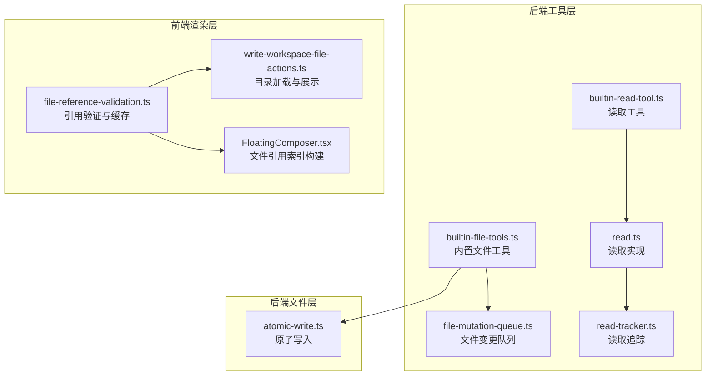
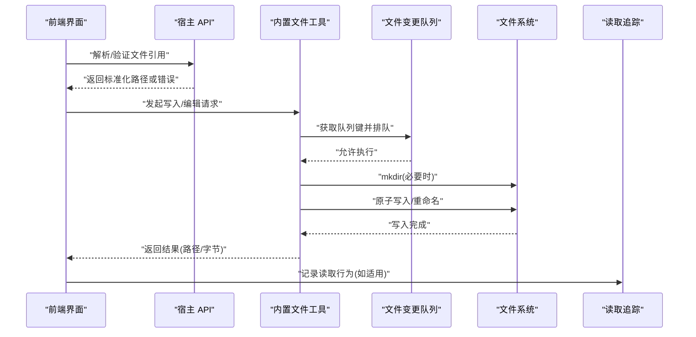
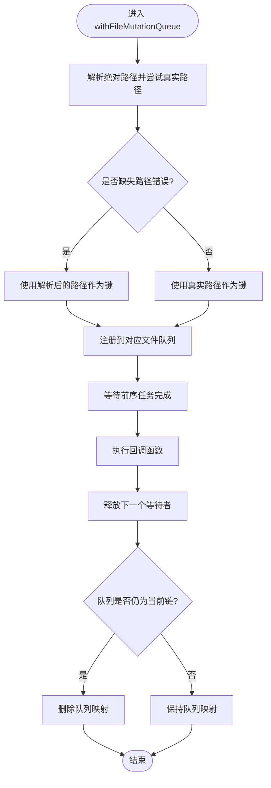
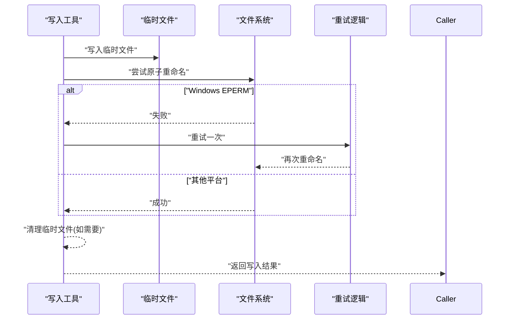
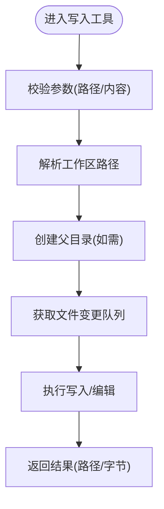
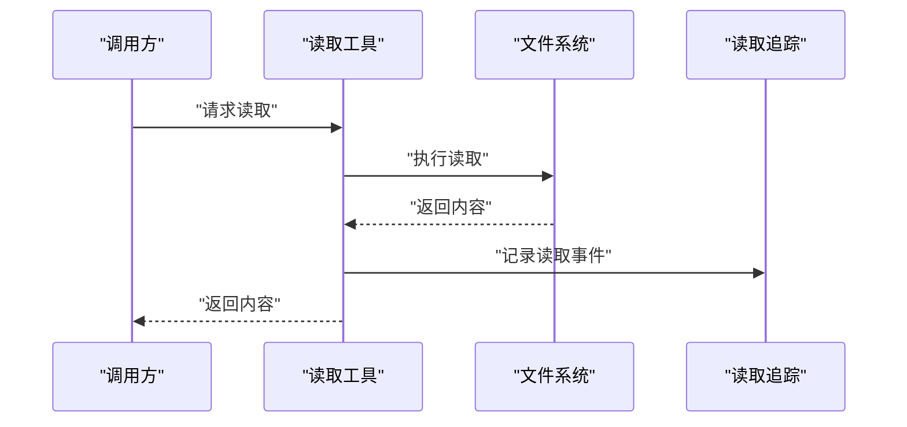
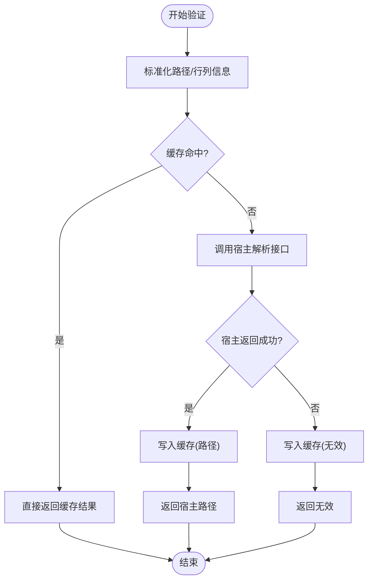
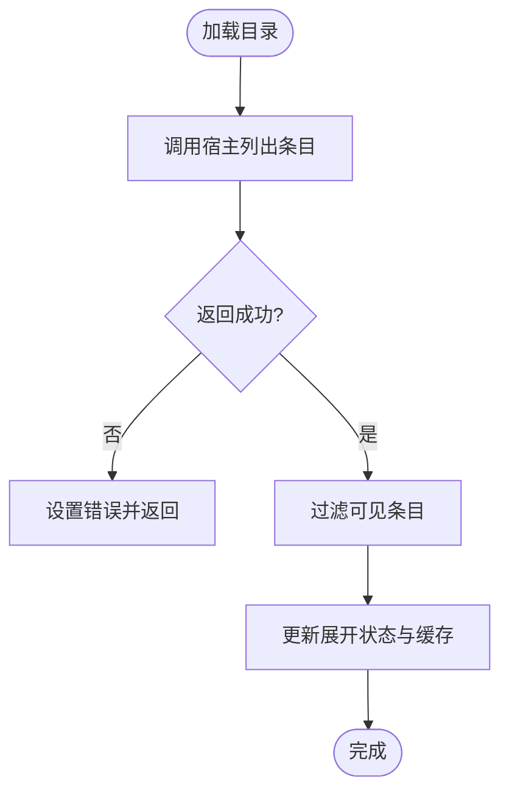
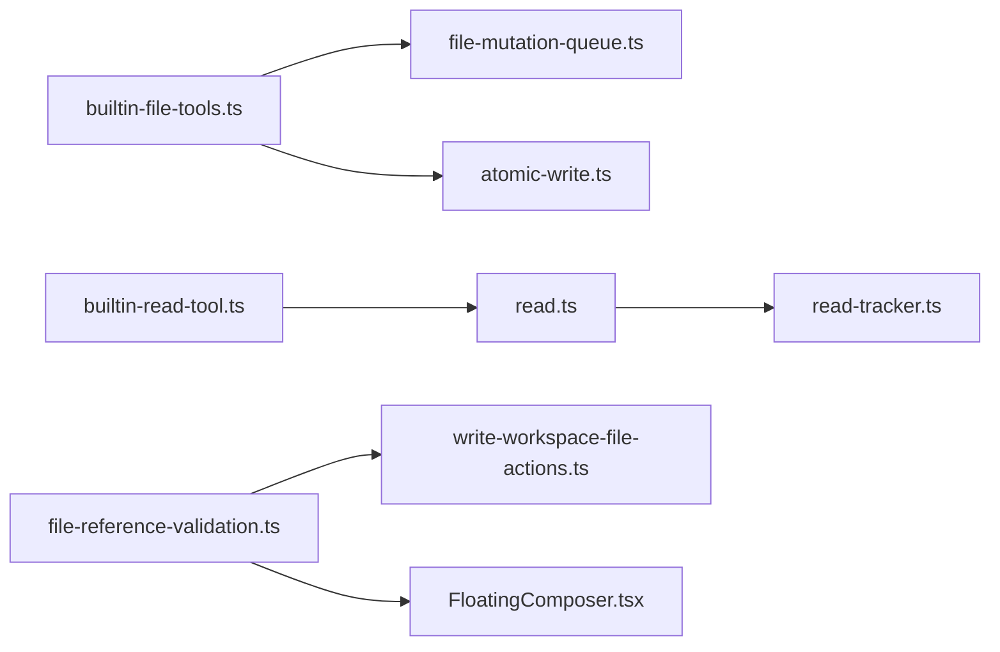

# 文件读写操作

<cite>
**本文档引用的文件**
- [atomic-write.ts](file://kun/src/adapters/file/atomic-write.ts)
- [file-mutation-queue.ts](file://kun/src/adapters/tool/file-mutation-queue.ts)
- [builtin-file-tools.ts](file://kun/src/adapters/tool/builtin-file-tools.ts)
- [builtin-read-tool.ts](file://kun/src/adapters/tool/builtin-read-tool.ts)
- [read.ts](file://kun/src/adapters/tool/read.ts)
- [read-tracker.ts](file://kun/src/adapters/tool/read-tracker.ts)
- [file-reference-validation.ts](file://src/renderer/src/lib/file-reference-validation.ts)
- [file-reference-validation.test.ts](file://src/renderer/src/lib/file-reference-validation.test.ts)
- [FloatingComposer.tsx](file://src/renderer/src/components/chat/FloatingComposer.tsx)
- [write-workspace-file-actions.ts](file://src/renderer/src/write/write-workspace-file-actions.ts)
- [atomic-write.test.ts](file://kun/tests/atomic-write.test.ts)
- [builtin-tools.test.ts](file://kun/tests/builtin-tools.test.ts)
</cite>

## 目录
1. [简介](#简介)
2. [项目结构](#项目结构)
3. [核心组件](#核心组件)
4. [架构总览](#架构总览)
5. [详细组件分析](#详细组件分析)
6. [依赖关系分析](#依赖关系分析)
7. [性能考虑](#性能考虑)
8. [故障排查指南](#故障排查指南)
9. [结论](#结论)
10. [附录](#附录)

## 简介
本文件面向 Code 模式下的文件读写操作，系统性阐述文件读取机制、文件写入流程、文件引用管理与验证、安全检查与权限控制、编码处理与错误恢复、引用解析与验证、文件变更的原子性保证以及日志记录策略，并提供最佳实践与性能优化建议。内容基于仓库中的实际实现进行分析与总结。

## 项目结构
围绕文件读写的关键模块分布于以下位置：
- 后端适配层（工具与文件存储）
  - 写入与原子写：kun/src/adapters/file/atomic-write.ts
  - 工具队列与互斥：kun/src/adapters/tool/file-mutation-queue.ts
  - 内置文件工具（写/编辑）：kun/src/adapters/tool/builtin-file-tools.ts
  - 通用读取工具：kun/src/adapters/tool/read.ts、kun/src/adapters/tool/builtin-read-tool.ts、kun/src/adapters/tool/read-tracker.ts
- 前端渲染层（文件引用解析与展示）
  - 引用验证与缓存：src/renderer/src/lib/file-reference-validation.ts
  - 文件树与目录加载：src/renderer/src/write/write-workspace-file-actions.ts
  - 文件引用索引构建：src/renderer/src/components/chat/FloatingComposer.tsx

**图表来源**
- [file-mutation-queue.ts:1-61](file://kun/src/adapters/tool/file-mutation-queue.ts#L1-L61)
- [builtin-file-tools.ts:1-63](file://kun/src/adapters/tool/builtin-file-tools.ts#L1-L63)
- [builtin-read-tool.ts](file://kun/src/adapters/tool/builtin-read-tool.ts)
- [read.ts](file://kun/src/adapters/tool/read.ts)
- [read-tracker.ts](file://kun/src/adapters/tool/read-tracker.ts)
- [atomic-write.ts](file://kun/src/adapters/file/atomic-write.ts)
- [file-reference-validation.ts:76-114](file://src/renderer/src/lib/file-reference-validation.ts#L76-L114)
- [write-workspace-file-actions.ts:82-117](file://src/renderer/src/write/write-workspace-file-actions.ts#L82-L117)
- [FloatingComposer.tsx:315-358](file://src/renderer/src/components/chat/FloatingComposer.tsx#L315-L358)

**章节来源**
- [file-mutation-queue.ts:1-61](file://kun/src/adapters/tool/file-mutation-queue.ts#L1-L61)
- [builtin-file-tools.ts:1-63](file://kun/src/adapters/tool/builtin-file-tools.ts#L1-L63)
- [builtin-read-tool.ts](file://kun/src/adapters/tool/builtin-read-tool.ts)
- [read.ts](file://kun/src/adapters/tool/read.ts)
- [read-tracker.ts](file://kun/src/adapters/tool/read-tracker.ts)
- [atomic-write.ts](file://kun/src/adapters/file/atomic-write.ts)
- [file-reference-validation.ts:76-114](file://src/renderer/src/lib/file-reference-validation.ts#L76-L114)
- [write-workspace-file-actions.ts:82-117](file://src/renderer/src/write/write-workspace-file-actions.ts#L82-L117)
- [FloatingComposer.tsx:315-358](file://src/renderer/src/components/chat/FloatingComposer.tsx#L315-L358)

## 核心组件
- 文件变更队列（互斥与顺序化）
  - 通过路径规范化与真实路径解析，确保对同一物理文件的并发写入被串行化，避免竞态条件与部分写入。
- 原子写入
  - 在支持的操作系统上使用原子重命名；对 Windows 的临时锁定失败进行重试，提升可靠性。
- 内置文件工具
  - 写入工具：解析工作区路径、自动创建父目录、执行写入并返回字节数统计。
  - 编辑工具：读取现有内容、应用变更、写回目标文件。
- 读取工具与追踪
  - 统一的读取入口与读取追踪，便于审计与性能分析。
- 文件引用验证与缓存
  - 前端对用户输入的文件引用进行标准化与缓存，调用宿主 API 进行解析与校验，失败时提供降级策略。
- 目录加载与文件索引
  - 限制遍历深度与数量，过滤不可提及文件，构建可选文件引用列表。

**章节来源**
- [file-mutation-queue.ts:16-26](file://kun/src/adapters/tool/file-mutation-queue.ts#L16-L26)
- [atomic-write.ts](file://kun/src/adapters/file/atomic-write.ts)
- [builtin-file-tools.ts:18-55](file://ken/src/adapters/tool/builtin-file-tools.ts#L18-L55)
- [read.ts](file://kun/src/adapters/tool/read.ts)
- [read-tracker.ts](file://kun/src/adapters/tool/read-tracker.ts)
- [file-reference-validation.ts:76-114](file://src/renderer/src/lib/file-reference-validation.ts#L76-L114)
- [write-workspace-file-actions.ts:82-117](file://src/renderer/src/write/write-workspace-file-actions.ts#L82-L117)
- [FloatingComposer.tsx:315-358](file://src/renderer/src/components/chat/FloatingComposer.tsx#L315-L358)

## 架构总览
下图展示了从用户触发到文件落盘的完整链路，包括引用解析、工具边界、队列串行化、原子写入与读取追踪。

**图表来源**
- [builtin-file-tools.ts:35-54](file://kun/src/adapters/tool/builtin-file-tools.ts#L35-L54)
- [file-mutation-queue.ts:28-61](file://kun/src/adapters/tool/file-mutation-queue.ts#L28-L61)
- [atomic-write.ts](file://kun/src/adapters/file/atomic-write.ts)
- [read-tracker.ts](file://kun/src/adapters/tool/read-tracker.ts)
- [file-reference-validation.ts:76-114](file://src/renderer/src/lib/file-reference-validation.ts#L76-L114)

## 详细组件分析

### 文件变更队列与互斥
- 路径键生成
  - 使用路径解析与真实路径解析，若因不存在导致解析失败则回退到解析后的路径作为键，确保不同符号链接指向同一物理文件时被统一串行化。
- 队列注册与串行化
  - 通过全局注册队列与每个文件键对应的队列，形成“当前队列 → 新队列”的链式等待，确保同一文件的写入按顺序执行。
- 错误处理
  - 对特定缺失路径类错误进行分支处理，避免非预期异常阻塞队列注册。

**图表来源**
- [file-mutation-queue.ts:16-26](file://kun/src/adapters/tool/file-mutation-queue.ts#L16-L26)
- [file-mutation-queue.ts:28-61](file://kun/src/adapters/tool/file-mutation-queue.ts#L28-L61)

**章节来源**
- [file-mutation-queue.ts:1-61](file://kun/src/adapters/tool/file-mutation-queue.ts#L1-L61)

### 原子写入与跨平台兼容
- 原理
  - 优先使用原子重命名替换目标文件，减少中间状态与并发读取风险。
- Windows 兼容性
  - 对临时锁定导致的重命名失败进行有限重试，提升在锁竞争环境下的成功率。
- 测试覆盖
  - 单元测试模拟不同平台行为，验证重试逻辑与错误传播。

**图表来源**
- [atomic-write.ts](file://kun/src/adapters/file/atomic-write.ts)
- [atomic-write.test.ts:31-44](file://kun/tests/atomic-write.test.ts#L31-L44)

**章节来源**
- [atomic-write.ts](file://kun/src/adapters/file/atomic-write.ts)
- [atomic-write.test.ts:1-44](file://kun/tests/atomic-write.test.ts#L1-L44)

### 写入工具与编辑工具
- 写入工具
  - 输入参数校验（路径与内容），解析工作区绝对路径与相对路径，自动创建父目录，执行写入并返回写入字节数。
- 编辑工具
  - 读取现有内容，应用变更（如补丁/差异），再写回目标文件，确保最小化变更与一致性。

**图表来源**
- [builtin-file-tools.ts:18-55](file://kun/src/adapters/tool/builtin-file-tools.ts#L18-L55)

**章节来源**
- [builtin-file-tools.ts:1-63](file://kun/src/adapters/tool/builtin-file-tools.ts#L1-L63)

### 读取工具与读取追踪
- 读取工具
  - 提供统一的读取入口，封装读取细节，便于后续扩展与审计。
- 读取追踪
  - 记录读取事件，用于性能分析与合规审计。

**图表来源**
- [read.ts](file://kun/src/adapters/tool/read.ts)
- [read-tracker.ts](file://kun/src/adapters/tool/read-tracker.ts)

**章节来源**
- [read.ts](file://kun/src/adapters/tool/read.ts)
- [read-tracker.ts](file://kun/src/adapters/tool/read-tracker.ts)

### 文件引用解析与验证
- 标准化与缓存
  - 对用户输入的路径进行去空白等标准化处理；使用键值缓存验证结果，避免重复调用宿主 API。
- 宿主解析
  - 通过宿主提供的解析接口进行最终校验；成功则返回标准化路径，失败则标记为无效。
- 降级策略
  - 若解析过程抛错，缓存一个明确的无效结果，保证后续快速失败与稳定体验。
- 前端索引构建
  - 在聊天组件中构建文件引用索引时，限制遍历深度与数量，过滤不可提及文件，提高响应速度与可用性。

**图表来源**
- [file-reference-validation.ts:76-114](file://src/renderer/src/lib/file-reference-validation.ts#L76-L114)
- [FloatingComposer.tsx:315-358](file://src/renderer/src/components/chat/FloatingComposer.tsx#L315-L358)

**章节来源**
- [file-reference-validation.ts:76-114](file://src/renderer/src/lib/file-reference-validation.ts#L76-L114)
- [file-reference-validation.test.ts:1-45](file://src/renderer/src/lib/file-reference-validation.test.ts#L1-L45)
- [FloatingComposer.tsx:315-358](file://src/renderer/src/components/chat/FloatingComposer.tsx#L315-L358)

### 目录加载与可见性过滤
- 加载流程
  - 通过宿主接口列出目录条目，处理失败情况并设置错误状态；成功时过滤可见条目并更新展开状态。
- 限制策略
  - 控制最大遍历目录数与最大文件数，避免大规模目录带来的性能问题。

**图表来源**
- [write-workspace-file-actions.ts:82-117](file://src/renderer/src/write/write-workspace-file-actions.ts#L82-L117)

**章节来源**
- [write-workspace-file-actions.ts:82-117](file://src/renderer/src/write/write-workspace-file-actions.ts#L82-L117)

## 依赖关系分析
- 工具层依赖
  - 写入工具依赖文件变更队列以保证串行化；依赖原子写入以确保变更原子性。
  - 读取工具与读取追踪相互独立，但共同服务于审计与监控。
- 前端依赖
  - 文件引用验证依赖宿主 API；目录加载依赖宿主目录枚举；文件引用索引构建依赖验证结果与目录加载结果。
- 测试依赖
  - 原子写入测试通过 Mock 重命名行为验证跨平台兼容性；工具测试覆盖队列与工具边界。

**图表来源**
- [builtin-file-tools.ts:1-63](file://kun/src/adapters/tool/builtin-file-tools.ts#L1-L63)
- [file-mutation-queue.ts:1-61](file://kun/src/adapters/tool/file-mutation-queue.ts#L1-L61)
- [atomic-write.ts](file://kun/src/adapters/file/atomic-write.ts)
- [builtin-read-tool.ts](file://kun/src/adapters/tool/builtin-read-tool.ts)
- [read.ts](file://kun/src/adapters/tool/read.ts)
- [read-tracker.ts](file://kun/src/adapters/tool/read-tracker.ts)
- [file-reference-validation.ts:76-114](file://src/renderer/src/lib/file-reference-validation.ts#L76-L114)
- [write-workspace-file-actions.ts:82-117](file://src/renderer/src/write/write-workspace-file-actions.ts#L82-L117)
- [FloatingComposer.tsx:315-358](file://src/renderer/src/components/chat/FloatingComposer.tsx#L315-L358)

**章节来源**
- [builtin-tools.test.ts:41-66](file://kun/tests/builtin-tools.test.ts#L41-L66)

## 性能考虑
- 队列串行化
  - 将同一文件的多次写入串行化，避免频繁重命名与并发写入导致的性能抖动。
- 原子写入
  - 减少中间态与并发读取窗口，降低失败重试成本。
- 前端缓存
  - 引用验证与目录索引缓存显著减少重复调用宿主 API 的次数。
- 遍历限制
  - 限制最大遍历目录数与最大文件数，避免在大型仓库中产生过长的等待时间。
- 最佳实践
  - 大文件写入建议分块或异步提交，避免阻塞主线程。
  - 批量写入时尽量合并为单次队列任务，减少队列切换开销。
  - 使用 UTF-8 编码写入，避免编码转换带来的额外成本。

[本节为通用指导，不直接分析具体文件]

## 故障排查指南
- 写入失败
  - 检查工作区路径是否有效且具有写权限；确认父目录已正确创建；查看队列是否被长时间占用。
- 原子写入重试
  - 观察是否存在临时锁定导致的重命名失败；在 Windows 上可适当增加重试间隔。
- 引用解析失败
  - 确认宿主 API 可用；检查路径标准化是否正确；查看缓存是否命中；必要时清空缓存后重试。
- 目录加载缓慢
  - 检查是否启用了过多的忽略目录；调整最大遍历深度与最大文件数阈值。
- 日志与审计
  - 读取追踪可用于定位热点文件与异常访问；结合工具边界日志进行问题复现。

**章节来源**
- [atomic-write.test.ts:31-44](file://kun/tests/atomic-write.test.ts#L31-L44)
- [file-reference-validation.ts:76-114](file://src/renderer/src/lib/file-reference-validation.ts#L76-L114)
- [write-workspace-file-actions.ts:82-117](file://src/renderer/src/write/write-workspace-file-actions.ts#L82-L117)

## 结论
本方案通过“文件变更队列 + 原子写入 + 引用验证缓存 + 目录遍历限制”的组合，在保证安全性与一致性的同时兼顾了性能与用户体验。建议在生产环境中启用严格的路径校验与权限检查，并结合读取追踪与日志记录完善可观测性。

[本节为总结，不直接分析具体文件]

## 附录
- 安全检查与权限控制
  - 路径解析阶段即进行标准化与合法性检查；写入前确保父目录存在；在工具边界内进行参数校验。
- 编码处理
  - 写入采用 UTF-8 编码；读取遵循系统默认编码；必要时进行 BOM 去除与换行符归一化。
- 错误恢复机制
  - 队列注册失败不影响其他任务；原子写入对临时锁定进行有限重试；引用验证失败有明确降级策略。
- 日志记录
  - 读取追踪记录访问事件；工具边界输出执行摘要；目录加载失败记录错误消息。

[本节为通用指导，不直接分析具体文件]