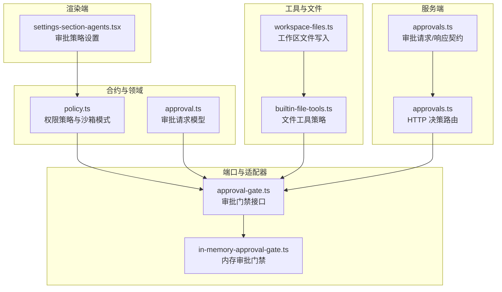
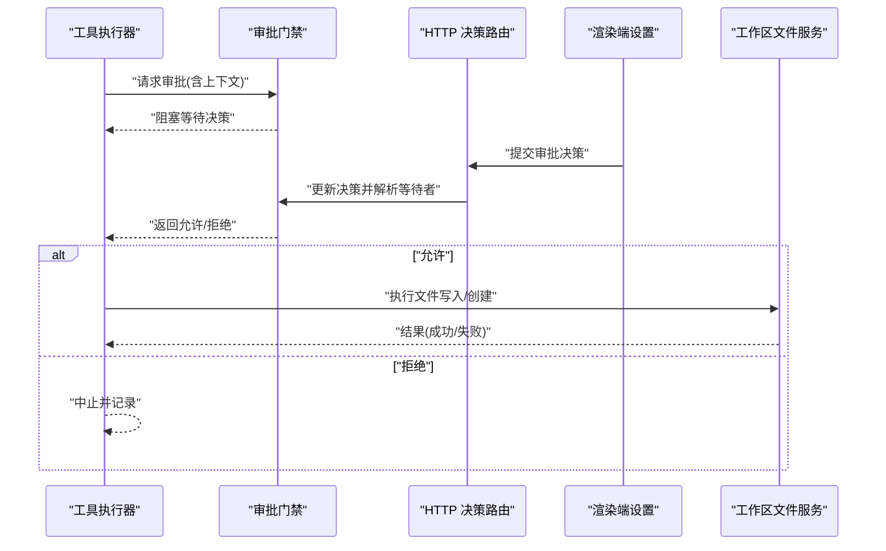
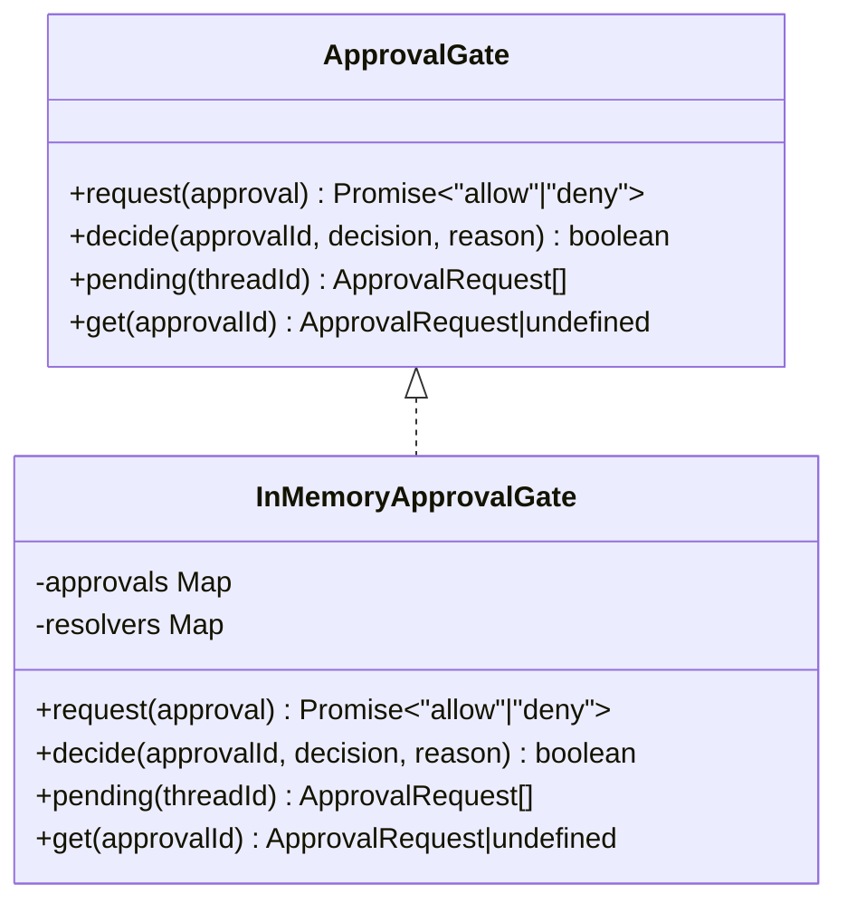
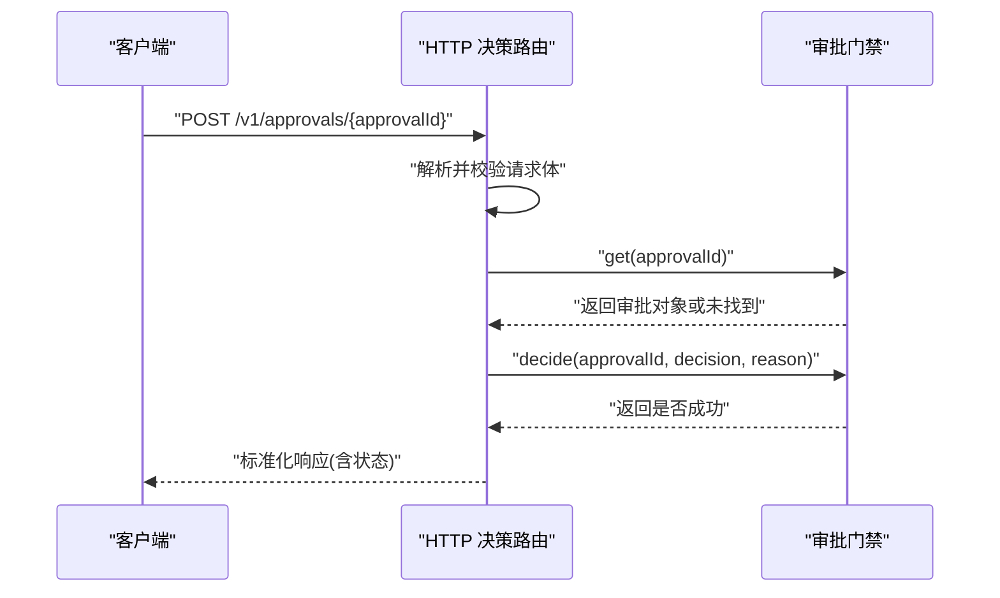
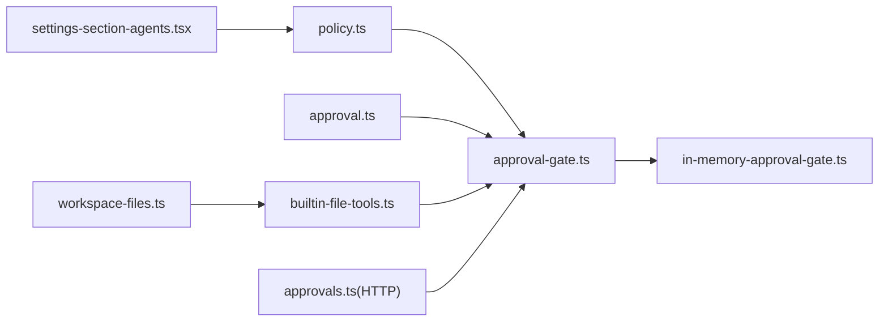

# 权限控制系统

<cite>
**本文引用的文件**
- [kun/src/contracts/policy.ts](file://kun/src/contracts/policy.ts)
- [kun/src/domain/approval.ts](file://kun/src/domain/approval.ts)
- [kun/src/ports/approval-gate.ts](file://kun/src/ports/approval-gate.ts)
- [kun/src/adapters/in-memory-approval-gate.ts](file://kun/src/adapters/in-memory-approval-gate.ts)
- [kun/src/server/routes/approvals.ts](file://kun/src/server/routes/approvals.ts)
- [kun/src/contracts/approvals.ts](file://kun/src/contracts/approvals.ts)
- [kun/src/adapters/tool/builtin-file-tools.ts](file://kun/src/adapters/tool/builtin-file-tools.ts)
- [src/renderer/src/components/settings-section-agents.tsx](file://src/renderer/src/components/settings-section-agents.tsx)
- [src/main/services/workspace-files.ts](file://src/main/services/workspace-files.ts)
- [kun/src/adapters/hybrid/hybrid-thread-store.ts](file://kun/src/adapters/hybrid/hybrid-thread-store.ts)
- [kun/tests/ports.test.ts](file://kun/tests/ports.test.ts)
</cite>

## 目录
1. [引言](#引言)
2. [项目结构](#项目结构)
3. [核心组件](#核心组件)
4. [架构总览](#架构总览)
5. [详细组件分析](#详细组件分析)
6. [依赖关系分析](#依赖关系分析)
7. [性能考量](#性能考量)
8. [故障排查指南](#故障排查指南)
9. [结论](#结论)
10. [附录](#附录)

## 引言
本文件系统性阐述 Code 模式下的权限控制系统，覆盖权限级别定义（只读、工作区可写、完全访问）、权限检查机制、权限提升流程与撤销处理；详解审批门禁的工作原理、审批流程设计与权限变更通知机制；并说明权限与工具调用、文件操作的安全边界与最佳实践。目标是帮助开发者与运维人员在不深入源码的前提下，理解并正确配置与使用该权限体系。

## 项目结构
权限控制相关代码主要分布在以下模块：
- 合约层：定义审批策略与沙箱模式等权限枚举与默认值
- 领域层：审批请求的解析与状态流转
- 端口层：审批门禁接口抽象
- 适配器层：内存审批门禁实现、内置文件工具的策略声明
- 服务端路由：HTTP 决策接口
- 渲染端设置：审批策略 UI
- 工作区文件服务：文件写入能力的实现与边界

图表来源
- [kun/src/contracts/policy.ts:1-24](file://kun/src/contracts/policy.ts#L1-L24)
- [kun/src/domain/approval.ts](file://kun/src/domain/approval.ts)
- [kun/src/ports/approval-gate.ts:1-14](file://kun/src/ports/approval-gate.ts#L1-L14)
- [kun/src/adapters/in-memory-approval-gate.ts:1-36](file://kun/src/adapters/in-memory-approval-gate.ts#L1-L36)
- [kun/src/adapters/tool/builtin-file-tools.ts:30-97](file://kun/src/adapters/tool/builtin-file-tools.ts#L30-L97)
- [kun/src/server/routes/approvals.ts:1-36](file://kun/src/server/routes/approvals.ts#L1-L36)
- [kun/src/contracts/approvals.ts:1-15](file://kun/src/contracts/approvals.ts#L1-L15)
- [src/renderer/src/components/settings-section-agents.tsx:1475-1506](file://src/renderer/src/components/settings-section-agents.tsx#L1475-L1506)
- [src/main/services/workspace-files.ts:161-206](file://src/main/services/workspace-files.ts#L161-L206)

章节来源
- [kun/src/contracts/policy.ts:1-24](file://kun/src/contracts/policy.ts#L1-L24)
- [kun/src/ports/approval-gate.ts:1-14](file://kun/src/ports/approval-gate.ts#L1-L14)
- [kun/src/adapters/in-memory-approval-gate.ts:1-36](file://kun/src/adapters/in-memory-approval-gate.ts#L1-L36)
- [kun/src/server/routes/approvals.ts:1-36](file://kun/src/server/routes/approvals.ts#L1-L36)
- [kun/src/contracts/approvals.ts:1-15](file://kun/src/contracts/approvals.ts#L1-L15)
- [kun/src/adapters/tool/builtin-file-tools.ts:30-97](file://kun/src/adapters/tool/builtin-file-tools.ts#L30-L97)
- [src/renderer/src/components/settings-section-agents.tsx:1475-1506](file://src/renderer/src/components/settings-section-agents.tsx#L1475-L1506)
- [src/main/services/workspace-files.ts:161-206](file://src/main/services/workspace-files.ts#L161-L206)

## 核心组件
- 审批门禁接口：统一抽象“请求审批”和“做出决策”的能力，支持查询待决审批、按 ID 获取审批、阻塞等待用户决策等。
- 内存审批门禁：在进程内维护审批映射与 Promise 解析器，供工具执行线程阻塞等待用户决策。
- 审批策略与沙箱模式：定义审批策略（自动、按需、不受信、从不、建议）与沙箱模式（只读、工作区可写、完全访问、外部沙箱），并给出默认值。
- 文件工具策略：内置文件写入/编辑工具声明为“按需”策略，即需要用户审批后才允许执行。
- HTTP 决策路由：接收前端提交的审批决策，调用门禁更新状态，并返回标准化响应。
- 渲染端设置：提供审批策略选择 UI，影响工具执行时是否触发审批门禁。
- 工作区文件服务：实现文件写入与创建，作为权限边界内的具体操作。

章节来源
- [kun/src/ports/approval-gate.ts:1-14](file://kun/src/ports/approval-gate.ts#L1-L14)
- [kun/src/adapters/in-memory-approval-gate.ts:1-36](file://kun/src/adapters/in-memory-approval-gate.ts#L1-L36)
- [kun/src/contracts/policy.ts:1-24](file://kun/src/contracts/policy.ts#L1-L24)
- [kun/src/adapters/tool/builtin-file-tools.ts:30-97](file://kun/src/adapters/tool/builtin-file-tools.ts#L30-L97)
- [kun/src/server/routes/approvals.ts:1-36](file://kun/src/server/routes/approvals.ts#L1-L36)
- [src/renderer/src/components/settings-section-agents.tsx:1475-1506](file://src/renderer/src/components/settings-section-agents.tsx#L1475-L1506)
- [src/main/services/workspace-files.ts:161-206](file://src/main/services/workspace-files.ts#L161-L206)

## 架构总览
下图展示从工具调用到审批决策再到文件操作的整体流程，包括权限策略如何影响审批触发与执行边界。

图表来源
- [kun/src/adapters/in-memory-approval-gate.ts:15-36](file://kun/src/adapters/in-memory-approval-gate.ts#L15-L36)
- [kun/src/server/routes/approvals.ts:15-36](file://kun/src/server/routes/approvals.ts#L15-L36)
- [kun/src/adapters/tool/builtin-file-tools.ts:30-97](file://kun/src/adapters/tool/builtin-file-tools.ts#L30-L97)
- [src/main/services/workspace-files.ts:161-206](file://src/main/services/workspace-files.ts#L161-L206)

## 详细组件分析

### 权限级别与策略定义
- 审批策略（ApprovalPolicy）
  - 自动（auto）：无需人工干预，直接放行
  - 按需（on-request）：遇到高风险动作时触发审批
  - 不受信（untrusted）：默认需要审批，适合不受信任环境
  - 从不（never）：禁止审批弹窗，所有高风险动作直接拒绝
  - 建议（suggest）：提示但不强制，适合低风险场景
  - 默认值：auto
- 沙箱模式（SandboxMode）
  - 只读（read-only）：仅允许读取
  - 工作区可写（workspace-write）：允许对工作区文件进行写入
  - 完全访问（danger-full-access）：允许任意系统级操作（危险）
  - 外部沙箱（external-sandbox）：通过外部隔离执行
  - 默认值：workspace-write

这些定义集中于合约层，确保前后端一致的策略语义。

章节来源
- [kun/src/contracts/policy.ts:1-24](file://kun/src/contracts/policy.ts#L1-L24)

### 审批门禁接口与内存实现
- 接口职责
  - request：注册一个审批请求并返回 Promise，等待用户决策
  - decide：根据 ID 更新审批状态并解析等待中的 Promise
  - pending/get：查询待决审批列表与指定审批详情
- 内存实现要点
  - 使用 Map 维护审批与解析器映射
  - 决策后清理解析器并解析 Promise，保证并发安全
  - 支持重复决策检测与冲突返回

图表来源
- [kun/src/ports/approval-gate.ts:1-14](file://kun/src/ports/approval-gate.ts#L1-L14)
- [kun/src/adapters/in-memory-approval-gate.ts:1-36](file://kun/src/adapters/in-memory-approval-gate.ts#L1-L36)

章节来源
- [kun/src/ports/approval-gate.ts:1-14](file://kun/src/ports/approval-gate.ts#L1-L14)
- [kun/src/adapters/in-memory-approval-gate.ts:1-36](file://kun/src/adapters/in-memory-approval-gate.ts#L1-L36)

### 审批请求模型与状态解析
- 领域层包含审批请求的数据结构与解析逻辑，用于将“请求”转换为“已决定”的状态，同时保留决策原因等元信息。
- 该模型与门禁实现配合，确保审批状态机的一致性与可审计性。

章节来源
- [kun/src/domain/approval.ts](file://kun/src/domain/approval.ts)

### HTTP 决策路由与契约
- 路由负责接收前端提交的审批决策，校验请求体，查找对应审批，调用门禁更新状态，并返回标准化响应。
- 响应包含审批 ID、最终决策与状态（允许/拒绝/过期）。

图表来源
- [kun/src/server/routes/approvals.ts:15-36](file://kun/src/server/routes/approvals.ts#L15-L36)
- [kun/src/contracts/approvals.ts:1-15](file://kun/src/contracts/approvals.ts#L1-L15)

章节来源
- [kun/src/server/routes/approvals.ts:1-36](file://kun/src/server/routes/approvals.ts#L1-L36)
- [kun/src/contracts/approvals.ts:1-15](file://kun/src/contracts/approvals.ts#L1-L15)

### 权限与工具调用的关系
- 内置文件工具（如写入、编辑）声明为“按需”策略，意味着在工具执行前会触发审批门禁，等待用户确认。
- 工具执行器在获得“允许”后才会继续执行具体文件操作；若“拒绝”，则中止并记录。

章节来源
- [kun/src/adapters/tool/builtin-file-tools.ts:30-97](file://kun/src/adapters/tool/builtin-file-tools.ts#L30-L97)

### 权限与文件操作的关联
- 工作区文件服务封装了写入与创建的具体实现，确保路径解析、目录创建、内容写入与错误处理的一致性。
- 文件工具在执行前受策略约束，执行后受工作区边界保护，避免越权访问。

章节来源
- [src/main/services/workspace-files.ts:161-206](file://src/main/services/workspace-files.ts#L161-L206)
- [kun/src/adapters/tool/builtin-file-tools.ts:30-97](file://kun/src/adapters/tool/builtin-file-tools.ts#L30-L97)

### 审批策略的用户界面与持久化
- 渲染端提供审批策略选择控件，用户可切换策略以影响工具执行时的审批行为。
- 线程存储适配器将审批策略与沙箱模式持久化到数据库，确保会话重启后策略一致。

章节来源
- [src/renderer/src/components/settings-section-agents.tsx:1475-1506](file://src/renderer/src/components/settings-section-agents.tsx#L1475-L1506)
- [kun/src/adapters/hybrid/hybrid-thread-store.ts](file://kun/src/adapters/hybrid/hybrid-thread-store.ts)

### 权限检查机制与安全边界
- 策略检查：工具执行器依据当前线程的审批策略决定是否触发审批门禁。
- 执行边界：即使策略允许，具体操作仍受工作区根目录限制与文件系统权限约束。
- 审批状态机：门禁实现保证同一审批 ID 的幂等决策，防止重复处理。

章节来源
- [kun/src/ports/approval-gate.ts:1-14](file://kun/src/ports/approval-gate.ts#L1-L14)
- [kun/src/adapters/in-memory-approval-gate.ts:1-36](file://kun/src/adapters/in-memory-approval-gate.ts#L1-L36)
- [src/main/services/workspace-files.ts:161-206](file://src/main/services/workspace-files.ts#L161-L206)

### 权限提升流程与撤销处理
- 提升流程：当策略为“按需”或“不受信”时，工具执行会触发审批；用户可在 UI 中做出“允许/拒绝”决策，门禁解析等待者并推进后续执行。
- 撤销处理：若审批被拒绝，工具执行器中止相应操作；若审批过期或失效，门禁返回过期状态，路由返回标准化响应。

章节来源
- [kun/src/server/routes/approvals.ts:15-36](file://kun/src/server/routes/approvals.ts#L15-L36)
- [kun/src/contracts/approvals.ts:10-15](file://kun/src/contracts/approvals.ts#L10-L15)

### 审批门禁工作原理与测试验证
- 工作原理：工具执行器在执行高风险动作前向门禁请求审批；门禁返回 Promise 并阻塞执行；前端提交决策后门禁解析 Promise 并返回结果。
- 测试验证：测试覆盖“同轮次内先读后写的顺序约束”、“速率限制”等场景，确保权限策略与执行顺序符合预期。

章节来源
- [kun/tests/ports.test.ts:332-376](file://kun/tests/ports.test.ts#L332-L376)

## 依赖关系分析
- 合约层为上层提供策略与模式的统一定义
- 领域层与端口层解耦，便于替换门禁实现（如远程门禁）
- 适配器层与工具层协作，将策略注入到具体执行路径
- 服务端路由与渲染端设置共同构成审批闭环

图表来源
- [kun/src/contracts/policy.ts:1-24](file://kun/src/contracts/policy.ts#L1-L24)
- [kun/src/domain/approval.ts](file://kun/src/domain/approval.ts)
- [kun/src/ports/approval-gate.ts:1-14](file://kun/src/ports/approval-gate.ts#L1-L14)
- [kun/src/adapters/in-memory-approval-gate.ts:1-36](file://kun/src/adapters/in-memory-approval-gate.ts#L1-L36)
- [kun/src/adapters/tool/builtin-file-tools.ts:30-97](file://kun/src/adapters/tool/builtin-file-tools.ts#L30-L97)
- [kun/src/server/routes/approvals.ts:1-36](file://kun/src/server/routes/approvals.ts#L1-L36)
- [src/renderer/src/components/settings-section-agents.tsx:1475-1506](file://src/renderer/src/components/settings-section-agents.tsx#L1475-L1506)
- [src/main/services/workspace-files.ts:161-206](file://src/main/services/workspace-files.ts#L161-L206)

## 性能考量
- 内存门禁采用 Map 存储，查询与更新均为常数时间复杂度，满足高并发场景
- 工具执行器在等待审批时阻塞当前执行，避免无谓的重试与资源浪费
- 文件操作通过队列化与路径解析减少 IO 开销与竞态

## 故障排查指南
- 审批未触发
  - 检查工具策略是否为“按需/不受信”，以及线程策略是否允许触发
  - 确认渲染端设置已保存且生效
- 审批已触发但无响应
  - 检查门禁是否正确注册与解析
  - 确认 HTTP 决策路由已收到请求并成功更新状态
- 文件写入失败
  - 检查工作区路径与权限
  - 确认策略允许写入且未被拒绝

章节来源
- [kun/src/server/routes/approvals.ts:15-36](file://kun/src/server/routes/approvals.ts#L15-L36)
- [kun/src/adapters/in-memory-approval-gate.ts:15-36](file://kun/src/adapters/in-memory-approval-gate.ts#L15-L36)
- [src/main/services/workspace-files.ts:161-206](file://src/main/services/workspace-files.ts#L161-L206)

## 结论
该权限控制系统通过“策略—门禁—路由—工具—文件服务”的分层设计，实现了对工具调用与文件操作的细粒度控制。策略可配置、审批可追踪、执行可回滚，既保障了安全性，又兼顾了可用性。建议在生产环境中优先采用“按需/不受信”策略，并结合日志与审计完善权限变更通知机制。

## 附录
- 最佳实践
  - 默认采用“按需”策略，对高风险动作进行最小化授权
  - 在 CI/CD 环境中使用“不受信”策略，避免自动化脚本绕过审批
  - 对“完全访问”模式严格限制使用范围与时间窗口
  - 将审批策略与沙箱模式持久化，确保会话一致性
- 安全建议
  - 审批决策必须可审计，保留原因字段
  - 文件操作必须在工作区内进行，严格校验路径
  - 定期审查工具清单与策略配置，移除不必要的高风险工具