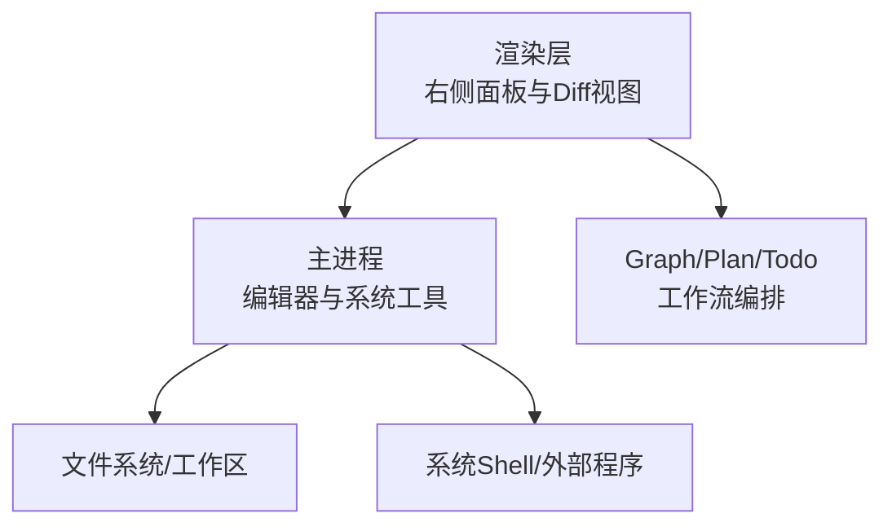
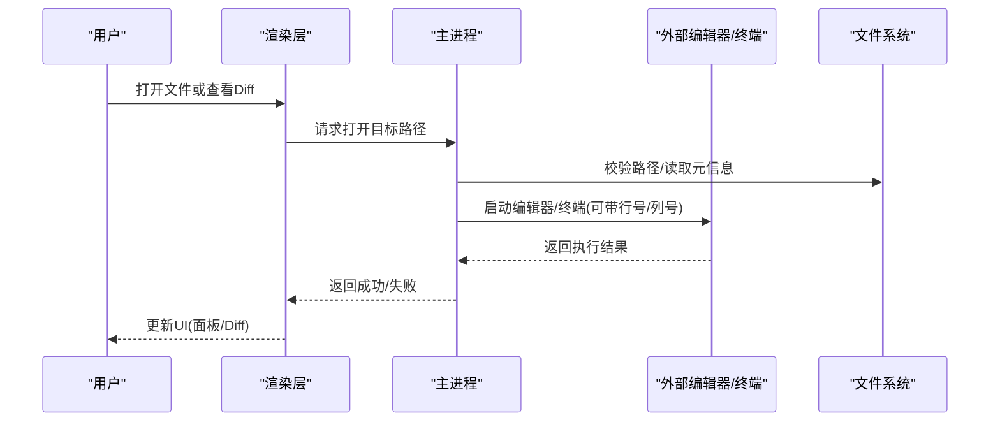
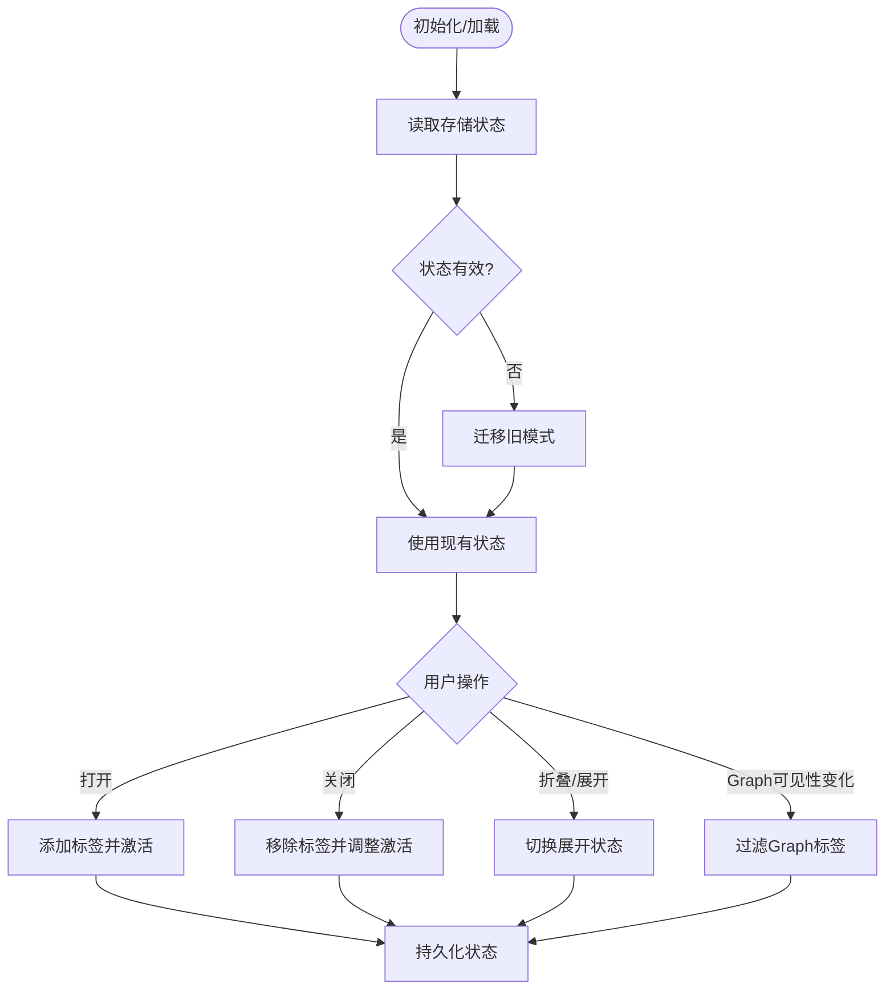
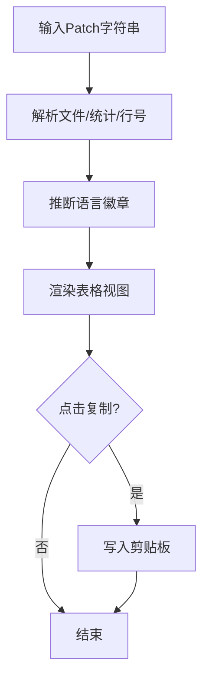
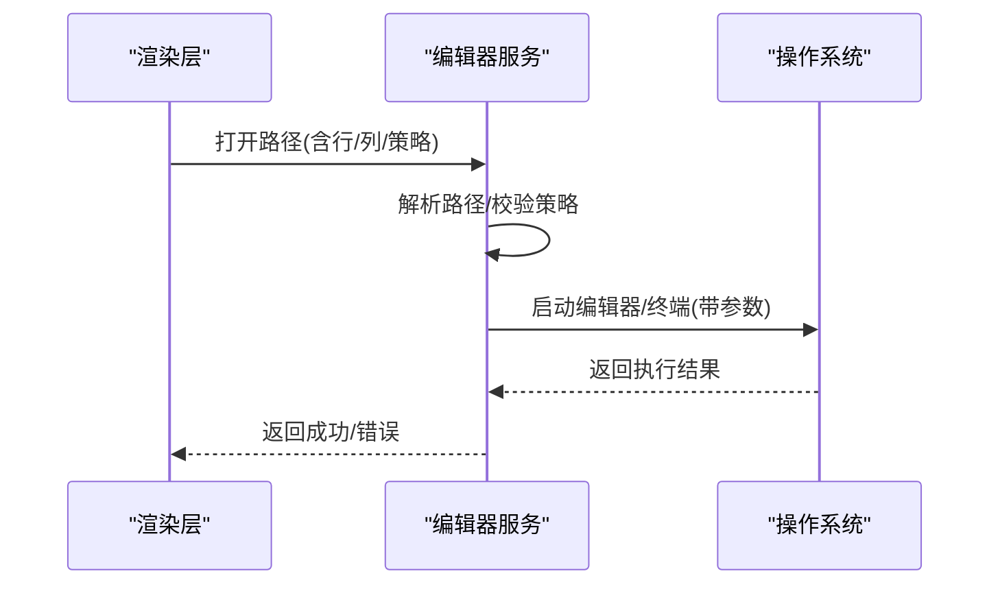
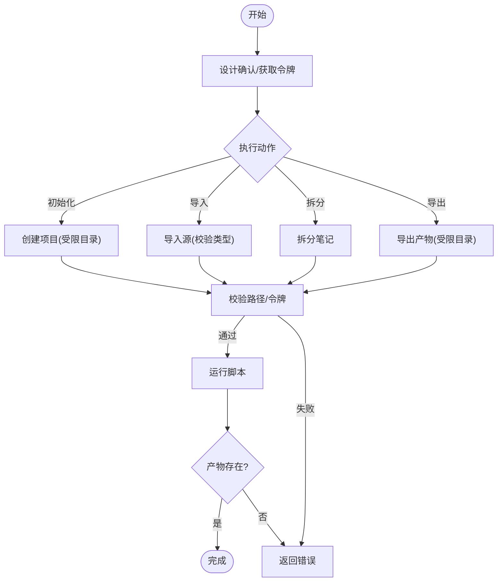
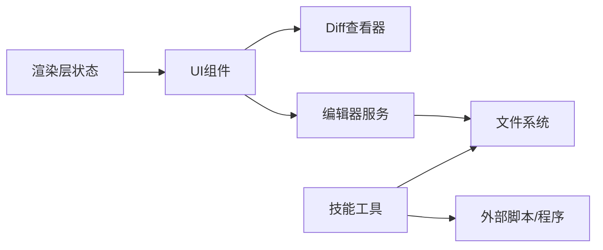

# Code：AI编程与审查

<cite>
**本文引用的文件**
- [code-right-tabs-state.ts](file://src/renderer/src/components/workbench/code-right-tabs-state.ts)
- [DiffView.tsx](file://src/renderer/src/components/DiffView.tsx)
- [workspace-editors.ts](file://src/main/services/workspace-editors.ts)
- [ppt-master-tool.test.ts](file://kun/src/adapters/tool/ppt-master-tool.test.ts)
</cite>

## 目录
1. [简介](#简介)
2. [项目结构](#项目结构)
3. [核心组件](#核心组件)
4. [架构总览](#架构总览)
5. [详细组件分析](#详细组件分析)
6. [依赖关系分析](#依赖关系分析)
7. [性能考虑](#性能考虑)
8. [故障排查指南](#故障排查指南)
9. [结论](#结论)
10. [附录](#附录)

## 简介
本文件面向DeepSeek-GUI的Code工作区，聚焦“AI编程辅助、代码搜索与理解、文件编辑与Diff查看、命令执行、Plan/Todo管理、代码审查”等能力，并结合仓库中的实际实现，说明如何在真实项目中开展新功能开发、Bug修复与重构。同时覆盖与Git集成、Worktree支持、Terminal集成等特性，给出Direct模式与Agent Graph模式在编程任务中的应用差异、最佳实践与性能优化建议。

## 项目结构
Code工作区的用户界面与能力由渲染层（renderer）与主进程（main）共同协作完成：
- 渲染层负责右侧面板状态管理、Diff展示、与Graph/Plan等能力的交互入口。
- 主进程负责编辑器发现与打开、终端/系统工具调用、路径解析与安全校验等。

**图表来源**
- [code-right-tabs-state.ts:1-168](file://src/renderer/src/components/workbench/code-right-tabs-state.ts#L1-L168)
- [DiffView.tsx:1-251](file://src/renderer/src/components/DiffView.tsx#L1-L251)
- [workspace-editors.ts:1-740](file://src/main/services/workspace-editors.ts#L1-L740)

**章节来源**
- [code-right-tabs-state.ts:1-168](file://src/renderer/src/components/workbench/code-right-tabs-state.ts#L1-L168)
- [DiffView.tsx:1-251](file://src/renderer/src/components/DiffView.tsx#L1-L251)
- [workspace-editors.ts:1-740](file://src/main/services/workspace-editors.ts#L1-L740)

## 核心组件
- 右侧面板状态管理：维护Code工作区右侧标签页集合、激活项与展开状态，提供打开、关闭、折叠、扩展、按图可见性过滤等能力。
- Diff查看器：轻量级统一diff渲染，自动识别语言类型、统计增删行数、复制补丁文本，便于代码审查与变更确认。
- 编辑器与终端集成：自动发现可用编辑器/终端，支持按行/列跳转、目录打开、系统默认打开；对演示类文件进行安全校验后打开。
- 受控工具执行（示例）：通过技能工具封装固定脚本执行流程，结合审批令牌与沙箱路径限制，确保生成产物输出到受控目录。

**章节来源**
- [code-right-tabs-state.ts:1-168](file://src/renderer/src/components/workbench/code-right-tabs-state.ts#L1-L168)
- [DiffView.tsx:1-251](file://src/renderer/src/components/DiffView.tsx#L1-L251)
- [workspace-editors.ts:1-740](file://src/main/services/workspace-editors.ts#L1-L740)
- [ppt-master-tool.test.ts:1-329](file://kun/src/adapters/tool/ppt-master-tool.test.ts#L1-L329)

## 架构总览
Code工作区以“渲染层-主进程-系统/文件系统”的分层架构组织，关键数据流如下：
- 用户在渲染层发起操作（如打开文件、查看Diff、切换右侧面板）。
- 渲染层通过IPC或API调用主进程服务（如打开编辑器、列出可用编辑器）。
- 主进程解析路径、选择合适的外部程序并执行，必要时进行安全校验（如演示HTML大小与哈希校验）。
- 结果回传到渲染层更新UI（如显示Diff、刷新面板状态）。

**图表来源**
- [workspace-editors.ts:626-740](file://src/main/services/workspace-editors.ts#L626-L740)
- [DiffView.tsx:32-197](file://src/renderer/src/components/DiffView.tsx#L32-L197)
- [code-right-tabs-state.ts:82-151](file://src/renderer/src/components/workbench/code-right-tabs-state.ts#L82-L151)

## 详细组件分析

### 右侧面板状态管理（Code工作区标签）
- 职责：维护Code工作区右侧面板的标签集合、当前激活标签、是否展开，以及按Graph可见性过滤。
- 关键点：
  - 版本化存储结构，兼容旧模式迁移。
  - 去重与合法性校验，避免非法ID进入状态。
  - 提供open/activate/close/collapse/expand/retain等原子操作。
  - 当Graph不可用时自动关闭Graph标签，保证一致性。

**图表来源**
- [code-right-tabs-state.ts:29-168](file://src/renderer/src/components/workbench/code-right-tabs-state.ts#L29-L168)

**章节来源**
- [code-right-tabs-state.ts:1-168](file://src/renderer/src/components/workbench/code-right-tabs-state.ts#L1-L168)

### Diff查看器（代码审查与变更预览）
- 职责：将统一diff文本渲染为可读的变更视图，提供语言徽章、增删统计、复制补丁等功能。
- 关键点：
  - 自动解析文件路径、hunk偏移、增删行数。
  - 根据文件后缀推断语言类型，显示徽章。
  - 隐藏diff元信息行，仅展示正文变更。
  - 支持复制到剪贴板，便于分享与归档。

**图表来源**
- [DiffView.tsx:32-197](file://src/renderer/src/components/DiffView.tsx#L32-L197)

**章节来源**
- [DiffView.tsx:1-251](file://src/renderer/src/components/DiffView.tsx#L1-L251)

### 编辑器与终端集成（命令执行与工作区打开）
- 职责：发现并打开本地编辑器/终端，支持按行/列定位、目录打开、系统默认打开；对演示类文件进行安全校验。
- 关键点：
  - 多平台编辑器候选（VS Code、Cursor、Zed、Sublime、Xcode等），自动查找可执行路径与应用图标。
  - 支持line/column参数拼接，适配不同编辑器的命令行风格。
  - 演示类HTML打开前进行大小与SHA256校验，防止篡改。
  - 终端/Finder等系统工具作为备选打开方式。

**图表来源**
- [workspace-editors.ts:626-740](file://src/main/services/workspace-editors.ts#L626-L740)

**章节来源**
- [workspace-editors.ts:1-740](file://src/main/services/workspace-editors.ts#L1-L740)

### 受控工具执行（示例：PPT Master流程）
- 职责：通过技能工具封装固定脚本执行流程，结合审批令牌与沙箱路径限制，确保生成产物输出到受控目录。
- 关键点：
  - 需要设计确认与审批令牌才能执行敏感操作。
  - 项目根与输出路径必须在受控目录下，越界即拒绝。
  - 导出成功后需验证新文件已创建，且不接受过期产物。
  - 文档读取限制大小与路径范围，防止越权访问。

**图表来源**
- [ppt-master-tool.test.ts:61-200](file://kun/src/adapters/tool/ppt-master-tool.test.ts#L61-L200)
- [ppt-master-tool.test.ts:202-329](file://kun/src/adapters/tool/ppt-master-tool.test.ts#L202-L329)

**章节来源**
- [ppt-master-tool.test.ts:1-329](file://kun/src/adapters/tool/ppt-master-tool.test.ts#L1-L329)

## 依赖关系分析
- 渲染层依赖：
  - 右侧面板状态模块用于管理标签与可见性。
  - Diff查看器用于呈现变更内容。
- 主进程依赖：
  - 编辑器服务用于发现与打开编辑器/终端。
  - 文件系统用于路径解析与元信息读取。
- 工具层依赖：
  - 技能工具封装外部脚本，结合审批与路径限制。

**图表来源**
- [code-right-tabs-state.ts:1-168](file://src/renderer/src/components/workbench/code-right-tabs-state.ts#L1-L168)
- [DiffView.tsx:1-251](file://src/renderer/src/components/DiffView.tsx#L1-L251)
- [workspace-editors.ts:1-740](file://src/main/services/workspace-editors.ts#L1-L740)
- [ppt-master-tool.test.ts:1-329](file://kun/src/adapters/tool/ppt-master-tool.test.ts#L1-L329)

**章节来源**
- [code-right-tabs-state.ts:1-168](file://src/renderer/src/components/workbench/code-right-tabs-state.ts#L1-L168)
- [DiffView.tsx:1-251](file://src/renderer/src/components/DiffView.tsx#L1-L251)
- [workspace-editors.ts:1-740](file://src/main/services/workspace-editors.ts#L1-L740)
- [ppt-master-tool.test.ts:1-329](file://kun/src/adapters/tool/ppt-master-tool.test.ts#L1-L329)

## 性能考虑
- 右侧面板状态：
  - 使用版本化存储与迁移逻辑，避免重复计算与无效状态。
  - 标签去重与合法性校验减少冗余渲染。
- Diff查看器：
  - 仅解析必要元信息，隐藏diff头尾元数据，降低渲染开销。
  - 按需复制剪贴板，避免频繁IO。
- 编辑器/终端集成：
  - 并行发现编辑器与图标资源，缩短列表加载时间。
  - 对演示类文件进行快速大小与哈希校验，避免大文件处理风险。
- 工具执行：
  - 严格路径限制与输出校验，减少无效执行与重试。
  - 文档读取限制最大行数，控制上下文大小。

[本节为通用指导，不直接分析具体文件]

## 故障排查指南
- 无法打开编辑器：
  - 检查编辑器可执行路径是否存在，或系统默认打开是否可用。
  - 确认路径解析策略与权限设置。
- Diff显示异常：
  - 确认输入是否为标准统一diff格式。
  - 检查语言徽章推断是否正确。
- 工具执行失败：
  - 确认审批令牌是否有效。
  - 检查项目根与输出路径是否在受控目录内。
  - 验证导出产物是否为新文件且存在。

**章节来源**
- [workspace-editors.ts:697-740](file://src/main/services/workspace-editors.ts#L697-L740)
- [DiffView.tsx:32-197](file://src/renderer/src/components/DiffView.tsx#L32-L197)
- [ppt-master-tool.test.ts:156-200](file://kun/src/adapters/tool/ppt-master-tool.test.ts#L156-L200)
- [ppt-master-tool.test.ts:202-260](file://kun/src/adapters/tool/ppt-master-tool.test.ts#L202-L260)

## 结论
Code工作区通过渲染层与主进程的协同，提供了从AI编程辅助到代码审查、从文件编辑到命令执行的完整能力链。借助右侧面板状态管理与Diff查看器，开发者可以高效地进行变更管理与审查；通过编辑器与终端集成，能够快速落地修改与调试；通过受控工具执行，确保复杂流程的安全性与可追溯性。结合Direct模式与Agent Graph模式，可在简单任务中快速响应，在复杂任务中进行多步骤编排与协作。

[本节为总结性内容，不直接分析具体文件]

## 附录
- 使用场景示例：
  - 新功能开发：在Code工作区中通过AI辅助生成代码，使用Diff查看器审查变更，打开编辑器进行微调，最后提交到版本库。
  - Bug修复：通过搜索与理解代码，定位问题，应用补丁并通过Diff查看器确认修改，运行测试验证。
  - 代码重构：利用AI辅助进行结构重组，逐步应用变更，使用Diff查看器跟踪影响范围，确保无破坏性改动。
- Direct模式与Agent Graph模式：
  - Direct模式：适合单步、明确的编程任务，快速生成与修改代码。
  - Agent Graph模式：适合多步骤、跨文件的复杂任务，通过图编排实现计划、执行与审查的闭环。
- 最佳实践：
  - 使用受控目录与审批令牌执行敏感操作。
  - 在大型变更中使用Diff查看器进行逐文件审查。
  - 合理配置编辑器与终端，提升开发与调试效率。
  - 控制上下文大小与输出限制，避免性能瓶颈。

[本节为概念性内容，不直接分析具体文件]