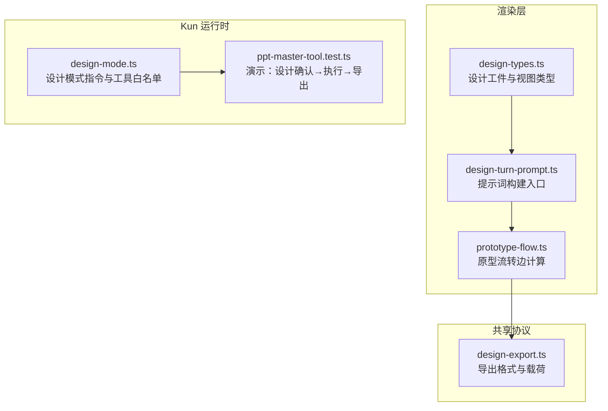
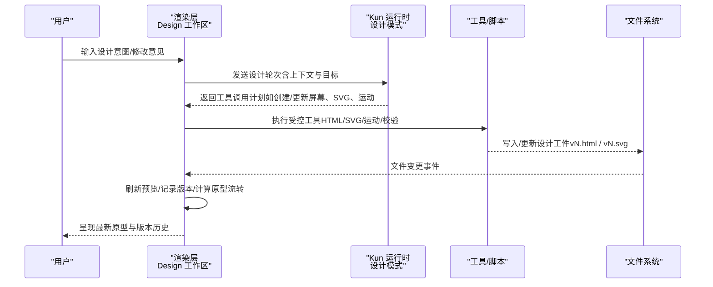
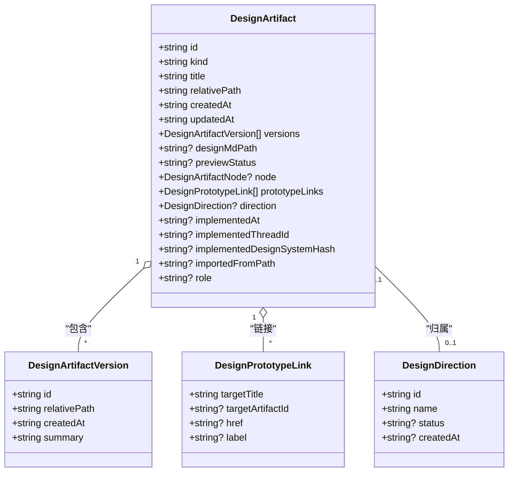
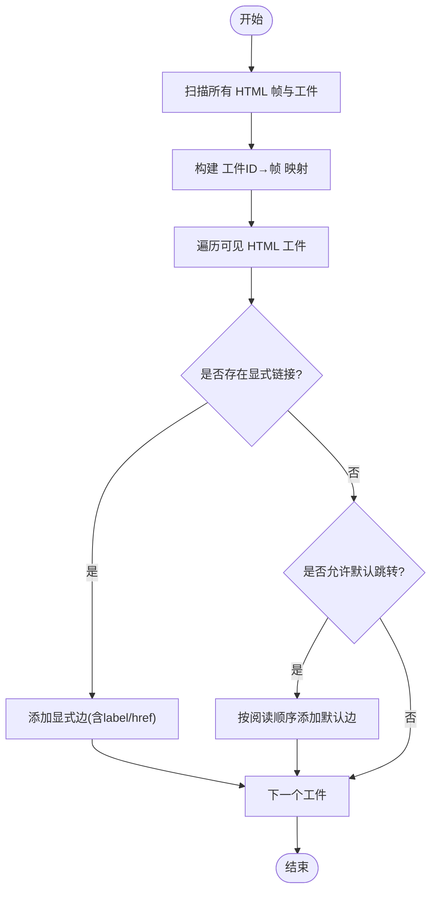
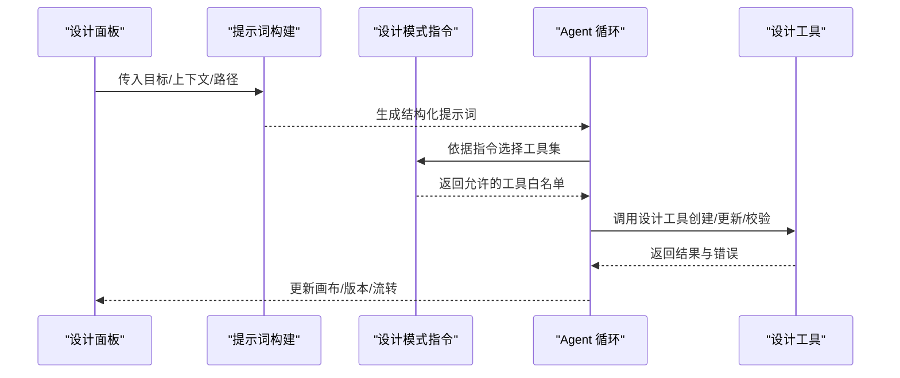
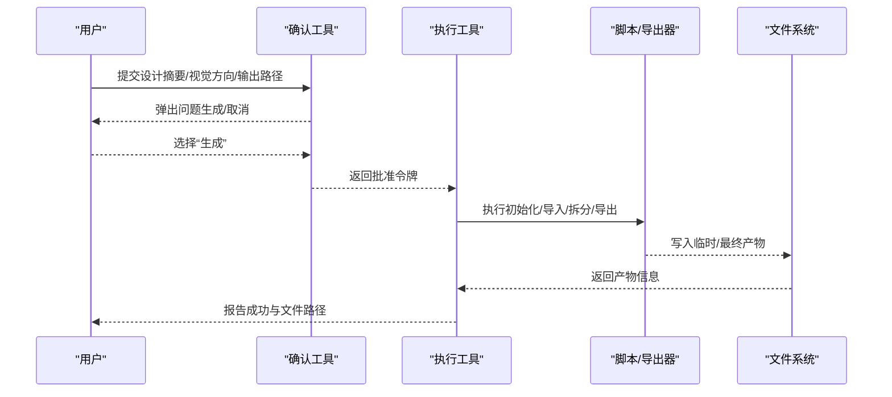
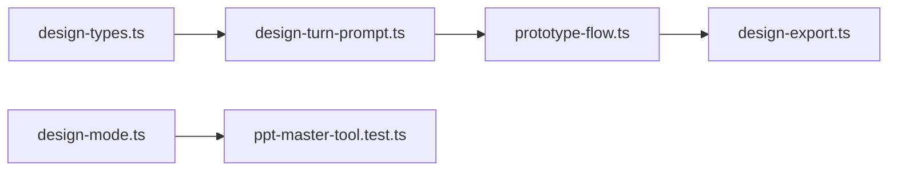

# Design：AI设计与原型

<cite>
**本文引用的文件**
- [DESIGN_MODE_PLAN.md](file://DESIGN_MODE_PLAN.md)
- [design-types.ts](file://src/renderer/src/design/design-types.ts)
- [design-turn-prompt.ts](file://src/renderer/src/design/design-turn-prompt.ts)
- [prototype-flow.ts](file://src/renderer/src/design/canvas/prototype-flow.ts)
- [design-export.ts](file://src/shared/design-export.ts)
- [design-mode.ts](file://kun/src/loop/design-mode.ts)
- [ppt-master-tool.test.ts](file://kun/src/adapters/tool/ppt-master-tool.test.ts)
- [DESIGN.md](file://DESIGN.md)
</cite>

## 目录
1. [简介](#简介)
2. [项目结构](#项目结构)
3. [核心能力](#核心能力)
4. [架构总览](#架构总览)
5. [关键组件详解](#关键组件详解)
6. [依赖关系分析](#依赖关系分析)
7. [性能与可维护性](#性能与可维护性)
8. [故障排查指南](#故障排查指南)
9. [结论](#结论)
10. [附录：工作流与最佳实践](#附录工作流与最佳实践)

## 简介
Design 工作区是 DeepSeek-GUI（Kun）中的“AI设计与原型”空间，目标是把需求快速转化为可视化的设计方案、交互式原型与设计系统沉淀，并打通到代码实现。它围绕“设计画布 + 设计资产 + Agent 工作过程”展开，支持视觉方向探索、交互原型生成、设计系统构建、以及从设计到代码的转换线索。

## 项目结构
Design 工作区的代码分布在渲染层（前端）、共享类型与导出协议、以及 Kun 运行时（Agent 指令与工具链）。整体采用“模式化扩展”的设计：以 HTML 单文件原型为 MVP，后续通过判别式联合（discriminated union）无缝接入节点画布与 Penpot 等形态。

图表来源
- [design-types.ts:1-131](file://src/renderer/src/design/design-types.ts#L1-L131)
- [design-turn-prompt.ts:1-6](file://src/renderer/src/design/design-turn-prompt.ts#L1-L6)
- [prototype-flow.ts:121-213](file://src/renderer/src/design/canvas/prototype-flow.ts#L121-L213)
- [design-export.ts:1-16](file://src/shared/design-export.ts#L1-L16)
- [design-mode.ts:1-51](file://kun/src/loop/design-mode.ts#L1-L51)
- [ppt-master-tool.test.ts:31-47](file://kun/src/adapters/tool/ppt-master-tool.test.ts#L31-L47)

章节来源
- [DESIGN_MODE_PLAN.md:1-38](file://DESIGN_MODE_PLAN.md#L1-L38)
- [design-types.ts:1-131](file://src/renderer/src/design/design-types.ts#L1-L131)

## 核心能力
- 视觉方向探索：通过设计上下文（品牌色、语气、设计系统预设）驱动 Agent 产出多方向方案，并在画布上对比。
- 交互原型生成：Agent 输出单文件 HTML 原型，在预览画布中实时查看；支持移动端/平板/桌面视口切换。
- 设计系统沉淀：将颜色、字体、间距、圆角、阴影等设计令牌集中管理，形成可复用的设计系统基线。
- Design → Code 转换：在设计工件中标记“已实现时间”“实现线程”“设计系统哈希”，作为交付给 Code 工作区的契约。
- 原型流转：自动推断页面间跳转关系，生成可视化流程图，辅助导航与交互验证。
- 导出与归档：支持将原型导出为 HTML/PDF，便于分享与评审。

章节来源
- [design-types.ts:17-22](file://src/renderer/src/design/design-types.ts#L17-L22)
- [design-types.ts:94-131](file://src/renderer/src/design/design-types.ts#L94-L131)
- [prototype-flow.ts:121-213](file://src/renderer/src/design/canvas/prototype-flow.ts#L121-L213)
- [design-export.ts:1-16](file://src/shared/design-export.ts#L1-L16)
- [DESIGN.md:326-350](file://DESIGN.md#L326-L350)

## 架构总览
Design 工作区遵循“渲染层负责展示与编排，Kun 运行时负责 Agent 决策与工具执行”的分层原则。渲染层提供设计工件模型、提示词构建与原型流转计算；Kun 运行时提供设计模式指令与工具白名单，确保 Agent 只使用受控能力。

图表来源
- [design-turn-prompt.ts:1-6](file://src/renderer/src/design/design-turn-prompt.ts#L1-L6)
- [design-mode.ts:1-51](file://kun/src/loop/design-mode.ts#L1-L51)
- [prototype-flow.ts:121-213](file://src/renderer/src/design/canvas/prototype-flow.ts#L121-L213)

## 关键组件详解

### 设计工件与画布
- 工件种类：HTML、Canvas（ShapeOps JSON）、SVG。
- 画布视图：预览、代码、Live（开发服务器）。
- 视口：移动端、平板、桌面，对应固定宽度或全宽。
- 版本管理：每个工件维护版本列表，支持按版本号回滚与对比。
- 原型链接：定义页面间的跳转目标、标签与本地 href。
- 方向分支：命名探索分支（如“结账改版”），支持状态标记（活跃/已接受/归档）。
- 设计系统角色：可将某工件标记为“设计系统”或“Logo”，用于复用与标注。

图表来源
- [design-types.ts:24-131](file://src/renderer/src/design/design-types.ts#L24-L131)

章节来源
- [design-types.ts:1-131](file://src/renderer/src/design/design-types.ts#L1-L131)

### 原型流转计算
- 自动识别 HTML 帧与关联工件，基于标题模糊匹配与显式链接生成边。
- 根据帧位置计算连线起点、终点与控制点，避免重叠。
- 当无显式链接时，按画布阅读顺序建立默认跳转。

图表来源
- [prototype-flow.ts:121-213](file://src/renderer/src/design/canvas/prototype-flow.ts#L121-L213)

章节来源
- [prototype-flow.ts:121-213](file://src/renderer/src/design/canvas/prototype-flow.ts#L121-L213)

### 提示词与 Agent 工作过程
- 提示词构建：统一入口封装不同目标（HTML/图形/图像）的提示词构造，注入设计上下文与约束。
- 设计模式指令：明确分类请求（单屏/多屏/修改/运动/SVG/原型导航），限制不必要的工具调用，保证最小可行产出。
- SVG 专用模式：限定仅能操作指定 SVG 文件的工具集合，禁止越界编辑。

图表来源
- [design-turn-prompt.ts:1-6](file://src/renderer/src/design/design-turn-prompt.ts#L1-L6)
- [design-mode.ts:1-51](file://kun/src/loop/design-mode.ts#L1-L51)

章节来源
- [design-turn-prompt.ts:1-6](file://src/renderer/src/design/design-turn-prompt.ts#L1-L6)
- [design-mode.ts:1-51](file://kun/src/loop/design-mode.ts#L1-L51)

### 设计确认与导出（演示流程）
- 设计确认：在执行高风险动作前，通过结构化输入向用户确认（例如生成 PPT/导出），返回一次性令牌。
- 执行与导出：在令牌有效期内执行脚本，产出文件并报告元数据（路径、MIME、大小）。
- 安全边界：限制项目根目录与输出目录，拒绝未授权路径与不支持的源文件类型。

图表来源
- [ppt-master-tool.test.ts:31-47](file://kun/src/adapters/tool/ppt-master-tool.test.ts#L31-L47)
- [ppt-master-tool.test.ts:130-146](file://kun/src/adapters/tool/ppt-master-tool.test.ts#L130-L146)
- [ppt-master-tool.test.ts:156-200](file://kun/src/adapters/tool/ppt-master-tool.test.ts#L156-L200)

章节来源
- [ppt-master-tool.test.ts:31-47](file://kun/src/adapters/tool/ppt-master-tool.test.ts#L31-L47)
- [ppt-master-tool.test.ts:130-146](file://kun/src/adapters/tool/ppt-master-tool.test.ts#L130-L146)
- [ppt-master-tool.test.ts:156-200](file://kun/src/adapters/tool/ppt-master-tool.test.ts#L156-L200)

### 导出选项
- 支持的导出格式：HTML、PDF。
- 导出载荷：原型 HTML 路径、工作区根、目标格式、建议文件名。
- 导出结果：成功时返回保存路径与时间；失败时可区分取消与错误消息。

章节来源
- [design-export.ts:1-16](file://src/shared/design-export.ts#L1-L16)

## 依赖关系分析
- 渲染层依赖：
  - design-types.ts 提供工件、版本、链接、方向等核心类型。
  - design-turn-prompt.ts 聚合提示词构建入口，供 Agent 轮次使用。
  - prototype-flow.ts 依赖工件与帧信息，计算原型流转边。
- 共享协议：
  - design-export.ts 定义导出接口，供主进程/渲染层调用。
- Kun 运行时：
  - design-mode.ts 提供设计模式指令与 SVG 专用工具白名单，约束 Agent 行为。
  - 演示工具链（ppt-master）展示了“确认→执行→导出”的完整闭环与安全边界。

图表来源
- [design-types.ts:1-131](file://src/renderer/src/design/design-types.ts#L1-L131)
- [design-turn-prompt.ts:1-6](file://src/renderer/src/design/design-turn-prompt.ts#L1-L6)
- [prototype-flow.ts:121-213](file://src/renderer/src/design/canvas/prototype-flow.ts#L121-L213)
- [design-export.ts:1-16](file://src/shared/design-export.ts#L1-L16)
- [design-mode.ts:1-51](file://kun/src/loop/design-mode.ts#L1-L51)
- [ppt-master-tool.test.ts:31-47](file://kun/src/adapters/tool/ppt-master-tool.test.ts#L31-L47)

章节来源
- [design-types.ts:1-131](file://src/renderer/src/design/design-types.ts#L1-L131)
- [design-turn-prompt.ts:1-6](file://src/renderer/src/design/design-turn-prompt.ts#L1-L6)
- [prototype-flow.ts:121-213](file://src/renderer/src/design/canvas/prototype-flow.ts#L121-L213)
- [design-export.ts:1-16](file://src/shared/design-export.ts#L1-L16)
- [design-mode.ts:1-51](file://kun/src/loop/design-mode.ts#L1-L51)
- [ppt-master-tool.test.ts:31-47](file://kun/src/adapters/tool/ppt-master-tool.test.ts#L31-L47)

## 性能与可维护性
- 增量刷新：原型变更后通过文件事件触发画布刷新，避免全量重建。
- 缓存友好：设计模式指令稳定，利于提示词缓存命中。
- 可扩展性：通过判别式联合（kind/view/target）平滑扩展新画布形态（节点画布、Penpot）。
- 安全边界：严格限制项目根与输出目录，防止越权写入。

[本节为通用指导，不直接分析具体文件]

## 故障排查指南
- 无法生成/导出：检查是否已通过设计确认并获得令牌；确认输出路径在工作区允许的目录内。
- 原型不刷新：确认文件写入成功且路径正确；检查预览容器是否被授权加载该路径。
- 流转边缺失：检查工件标题是否唯一或可模糊匹配；必要时补充显式链接。
- 工具受限：确认当前轮次处于正确的模式（设计模式/SVG 专用模式），避免调用未授权工具。

章节来源
- [ppt-master-tool.test.ts:156-200](file://kun/src/adapters/tool/ppt-master-tool.test.ts#L156-L200)
- [design-mode.ts:1-51](file://kun/src/loop/design-mode.ts#L1-L51)

## 结论
Design 工作区以“工件为中心、Agent 为引擎、画布为载体”，实现了从需求到可视化方案、再到交互原型与设计系统沉淀的闭环。通过稳定的模式指令与严格的工具白名单，保证了可控性与安全性；通过原型流转与导出能力，提升了协作效率与交付质量。未来可通过节点画布与 Penpot 集成进一步丰富创作体验。

[本节为总结性内容，不直接分析具体文件]

## 附录：工作流与最佳实践

### 从概念到实现的完整流程
- 设定设计上下文：品牌色、语气、设计系统预设。
- 发起设计轮次：描述目标（单屏/多屏/修改/运动/SVG），选择目标工件类型。
- 审阅与迭代：在画布中预览，调整布局、样式与交互；必要时引入运动或 SVG 资产。
- 固化版本：每次重要变更生成新版本，保留摘要以便回溯。
- 构建原型流转：为页面间跳转设置显式链接，或依赖默认流转。
- 导出与分享：导出 HTML/PDF，用于评审与归档。
- 交付代码：标记“已实现时间/线程/设计系统哈希”，作为与 Code 工作区交接的契约。

章节来源
- [design-types.ts:94-131](file://src/renderer/src/design/design-types.ts#L94-L131)
- [prototype-flow.ts:121-213](file://src/renderer/src/design/canvas/prototype-flow.ts#L121-L213)
- [design-export.ts:1-16](file://src/shared/design-export.ts#L1-L16)
- [DESIGN_MODE_PLAN.md:1-38](file://DESIGN_MODE_PLAN.md#L1-L38)

### 典型场景示例
- UI 设计：生成登录页、详情页、空态与错误态，构建多页面原型与跳转。
- 品牌设计：产出 Logo 与品牌色板，作为设计系统基础工件复用。
- 设计系统构建：沉淀颜色、字体、间距、圆角、阴影等令牌，形成可复用的设计规范。
- 交互原型：组合页面与动效，验证关键任务流程与用户体验。

章节来源
- [design-types.ts:17-22](file://src/renderer/src/design/design-types.ts#L17-L22)
- [design-types.ts:94-131](file://src/renderer/src/design/design-types.ts#L94-L131)
- [DESIGN.md:326-350](file://DESIGN.md#L326-L350)