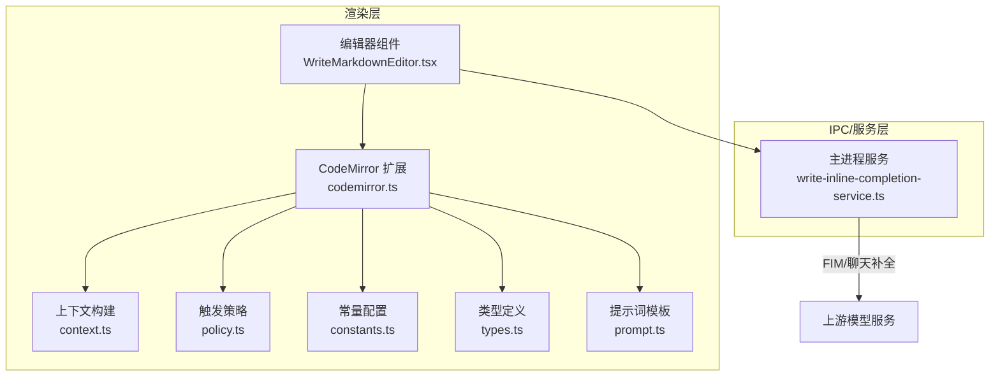
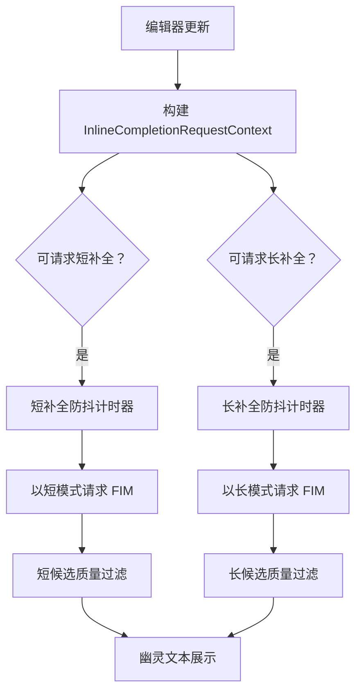
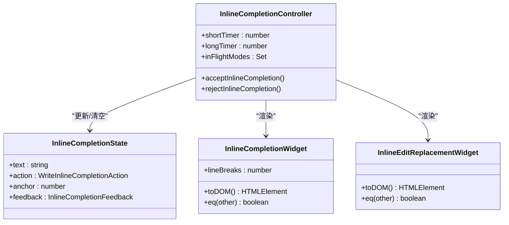
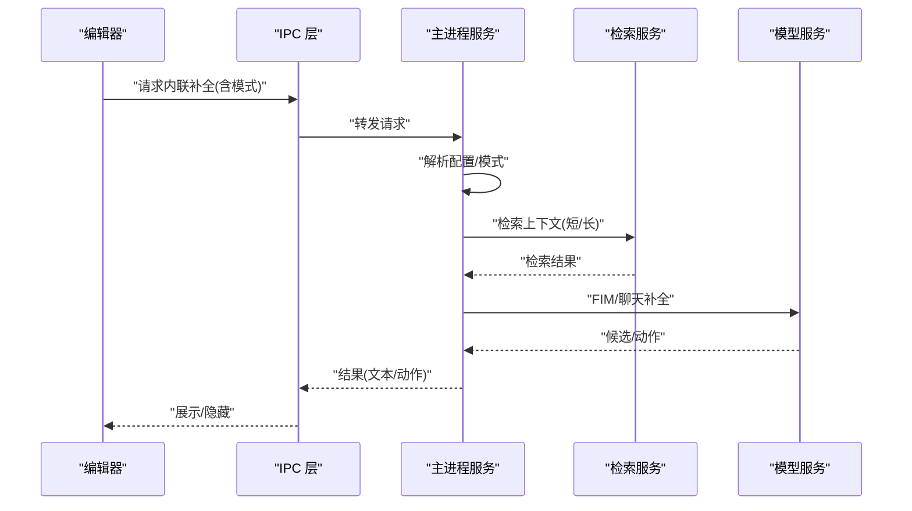
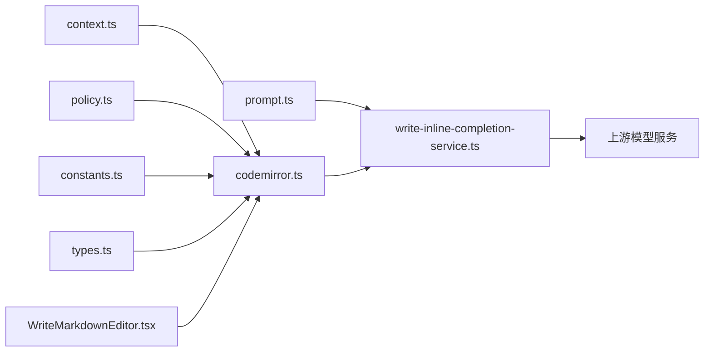

# Inline 补全系统

<cite>
**本文引用的文件**
- [WRITE_INLINE_COMPLETION_MODES.zh-CN.md](file://docs/WRITE_INLINE_COMPLETION_MODES.zh-CN.md)
- [WRITE_RETRIEVAL_RAG.en.md](file://docs/WRITE_RETRIEVAL_RAG.en.md)
- [write-inline-completion-service.ts](file://src/main/services/write-inline-completion-service.ts)
- [codemirror.ts](file://src/renderer/src/write/inline-completion/codemirror.ts)
- [context.ts](file://src/renderer/src/write/inline-completion/context.ts)
- [constants.ts](file://src/renderer/src/write/inline-completion/constants.ts)
- [policy.ts](file://src/renderer/src/write/inline-completion/policy.ts)
- [prompt.ts](file://src/renderer/src/write/inline-completion/prompt.ts)
- [types.ts](file://src/renderer/src/write/inline-completion/types.ts)
- [WriteMarkdownEditor.tsx](file://src/renderer/src/components/write/WriteMarkdownEditor.tsx)
- [app-settings-write.ts](file://src/shared/app-settings-write.ts)
- [lru-cache.ts](file://kun/src/cache/lru-cache.ts)
- [cache-telemetry.ts](file://kun/src/telemetry/cache-telemetry.ts)
</cite>

## 目录
1. [简介](#简介)
2. [项目结构](#项目结构)
3. [核心组件](#核心组件)
4. [架构总览](#架构总览)
5. [详细组件分析](#详细组件分析)
6. [依赖关系分析](#依赖关系分析)
7. [性能考量](#性能考量)
8. [故障排查指南](#故障排查指南)
9. [结论](#结论)
10. [附录](#附录)

## 简介
本文件面向 Write 模式的 Inline 补全系统，系统性阐述 FIM（Fill-In-the-Middle）补全的实现原理与工程细节，涵盖短补全与灵感长补全两种模式，补全上下文提取算法、提示词工程、补全策略配置，以及 CodeMirror 集成方式、触发条件、候选项展示机制。同时总结性能优化技术（缓存策略、延迟计算、内存管理），并提供配置项、调试方法与最佳实践。

## 项目结构
Inline 补全系统由前端渲染层、IPC 服务层与后端模型服务层协同完成：
- 渲染层负责编辑器集成、触发策略、候选项展示与用户交互
- IPC 层负责将请求转发至主进程服务
- 主进程服务负责模型调用、检索增强、质量过滤与回传

图表来源
- [codemirror.ts:1-496](file://src/renderer/src/write/inline-completion/codemirror.ts#L1-L496)
- [context.ts:114-136](file://src/renderer/src/write/inline-completion/context.ts#L114-L136)
- [policy.ts](file://src/renderer/src/write/inline-completion/policy.ts)
- [constants.ts](file://src/renderer/src/write/inline-completion/constants.ts)
- [prompt.ts](file://src/renderer/src/write/inline-completion/prompt.ts)
- [types.ts](file://src/renderer/src/write/inline-completion/types.ts)
- [WriteMarkdownEditor.tsx:355-384](file://src/renderer/src/components/write/WriteMarkdownEditor.tsx#L355-L384)
- [write-inline-completion-service.ts:540-565](file://src/main/services/write-inline-completion-service.ts#L540-L565)

章节来源
- [codemirror.ts:1-496](file://src/renderer/src/write/inline-completion/codemirror.ts#L1-L496)
- [WriteMarkdownEditor.tsx:355-384](file://src/renderer/src/components/write/WriteMarkdownEditor.tsx#L355-L384)

## 核心组件
- 上下文提取器：从编辑器状态抽取光标位置、当前行、前后行、缩进、列表上下文等，形成补全请求上下文
- 触发策略：区分短补全与长补全的触发条件，避免打断用户输入节奏
- 提示词模板：针对短补全与长补全分别设计提示词，控制 token 预算与检索召回数量
- CodeMirror 集成：通过装饰与小部件渲染候选项，支持 Tab 接受、Esc 隐藏
- 主进程服务：解析设置、选择 FIM 或聊天补全路径、执行检索增强、质量过滤与回传

章节来源
- [context.ts:114-136](file://src/renderer/src/write/inline-completion/context.ts#L114-L136)
- [policy.ts](file://src/renderer/src/write/inline-completion/policy.ts)
- [prompt.ts](file://src/renderer/src/write/inline-completion/prompt.ts)
- [codemirror.ts:1-496](file://src/renderer/src/write/inline-completion/codemirror.ts#L1-L496)
- [write-inline-completion-service.ts:540-565](file://src/main/services/write-inline-completion-service.ts#L540-L565)

## 架构总览
系统采用“双模式”策略：短补全强调低延迟与非侵入，长补全强调启发式续写。二者共享编辑器上下文与服务，但使用不同的触发条件、提示词与 token 预算。

图表来源
- [WRITE_INLINE_COMPLETION_MODES.zh-CN.md:21-35](file://docs/WRITE_INLINE_COMPLETION_MODES.zh-CN.md#L21-L35)
- [codemirror.ts:274-482](file://src/renderer/src/write/inline-completion/codemirror.ts#L274-L482)
- [policy.ts](file://src/renderer/src/write/inline-completion/policy.ts)

## 详细组件分析

### 上下文提取算法
- 关键信息
  - 光标前缀/后缀、当前行前后缀、上一行/下一行文本
  - 缩进与修剪后的行内容，用于判断行尾、列表上下文
  - 文档预览片段，限制窗口大小
  - 是否处于行末、是否以句号/问号等结尾
- 设计要点
  - 优先保留局部意图（当前行前缀权重最高）
  - 结合上一行与摘要信息，兼顾段落与文档级上下文
  - 列表上下文用于保持格式一致性

章节来源
- [context.ts:114-136](file://src/renderer/src/write/inline-completion/context.ts#L114-L136)

### 触发策略与补全模式
- 短补全
  - 低延迟、低中断、低 token 预算
  - 更积极的触发，适合连续输入场景
- 长补全
  - 更保守的触发，仅在行尾/段落边界出现
  - 更高的 token 预算与更强的检索召回，用于启发式续写
- 交互行为
  - Tab 接受，Esc 隐藏
  - 本地过滤不过时不展示
  - 任一环节失败均静默，不影响编辑器输入

章节来源
- [WRITE_INLINE_COMPLETION_MODES.zh-CN.md:235-280](file://docs/WRITE_INLINE_COMPLETION_MODES.zh-CN.md#L235-L280)
- [codemirror.ts:484-496](file://src/renderer/src/write/inline-completion/codemirror.ts#L484-L496)
- [policy.ts](file://src/renderer/src/write/inline-completion/policy.ts)

### 提示词工程与检索增强
- 短补全与长补全使用不同提示词与 token 预算
- 检索增强采用 BM25+关键词增强排序，短补全最多 3 片段，长补全最多 5 片段
- 检索结果以隐藏注释形式注入到 FIM 提示词头部，明确“仅作参考”，不污染 suffix

章节来源
- [WRITE_RETRIEVAL_RAG.en.md:102-167](file://docs/WRITE_RETRIEVAL_RAG.en.md#L102-L167)
- [prompt.ts](file://src/renderer/src/write/inline-completion/prompt.ts)

### CodeMirror 集成与候选项展示
- 状态字段与效果
  - 使用状态效果记录当前候选项文本、动作、锚点与反馈
  - 渲染插件根据光标位置与选择状态决定是否展示
- 小部件渲染
  - 幽灵文本小部件在光标后方展示
  - 内联编辑替换小部件在被替换范围前后展示“=>”标记
- 键盘交互
  - Tab 接受补全并上报反馈
  - Esc 隐藏补全并上报反馈

图表来源
- [codemirror.ts:49-73](file://src/renderer/src/write/inline-completion/codemirror.ts#L49-L73)
- [codemirror.ts:119-138](file://src/renderer/src/write/inline-completion/codemirror.ts#L119-L138)
- [codemirror.ts:140-203](file://src/renderer/src/write/inline-completion/codemirror.ts#L140-L203)
- [codemirror.ts:274-482](file://src/renderer/src/write/inline-completion/codemirror.ts#L274-L482)

章节来源
- [codemirror.ts:1-496](file://src/renderer/src/write/inline-completion/codemirror.ts#L1-L496)

### 主进程服务流程
- 配置解析
  - 读取 API Key、模型、基础 URL、最大 token 数
  - 根据模式选择 FIM 或聊天补全端点
- 检索增强
  - 长补全与编辑模式启用检索，短补全使用较少片段
- 质量过滤与回传
  - 若无有效候选项或分数过低则不展示
  - 支持 action 形态（如内联编辑）直接替换

图表来源
- [write-inline-completion-service.ts:540-565](file://src/main/services/write-inline-completion-service.ts#L540-L565)
- [WRITE_RETRIEVAL_RAG.en.md:133-167](file://docs/WRITE_RETRIEVAL_RAG.en.md#L133-L167)

章节来源
- [write-inline-completion-service.ts:540-565](file://src/main/services/write-inline-completion-service.ts#L540-L565)

### 类型与策略
- 类型定义
  - 请求上下文、建议、反馈、动作等类型统一收敛于 types 模块
- 策略模块
  - 触发条件与模式解析逻辑集中管理，便于扩展与测试

章节来源
- [types.ts](file://src/renderer/src/write/inline-completion/types.ts)
- [policy.ts](file://src/renderer/src/write/inline-completion/policy.ts)

## 依赖关系分析
- 渲染层依赖
  - 上下文构建依赖编辑器状态
  - 触发策略依赖常量配置与编辑器事件
  - 提示词模板与策略共同决定 token 预算与检索召回
- IPC/服务层依赖
  - 主进程服务依赖上游模型端点、检索服务与质量过滤
- 配置依赖
  - 设置项（启用开关、长补全开关、token 预算、防抖参数等）贯穿前后端

图表来源
- [codemirror.ts:1-496](file://src/renderer/src/write/inline-completion/codemirror.ts#L1-L496)
- [context.ts:114-136](file://src/renderer/src/write/inline-completion/context.ts#L114-L136)
- [policy.ts](file://src/renderer/src/write/inline-completion/policy.ts)
- [constants.ts](file://src/renderer/src/write/inline-completion/constants.ts)
- [prompt.ts](file://src/renderer/src/write/inline-completion/prompt.ts)
- [types.ts](file://src/renderer/src/write/inline-completion/types.ts)
- [WriteMarkdownEditor.tsx:355-384](file://src/renderer/src/components/write/WriteMarkdownEditor.tsx#L355-L384)
- [write-inline-completion-service.ts:540-565](file://src/main/services/write-inline-completion-service.ts#L540-L565)

## 性能考量
- 缓存策略
  - 使用 LRU 缓存进行热点数据驻留，避免重复检索
  - TTL-LRU 缓存用于带过期时间的场景，定期清理过期条目
- 延迟计算
  - 短/长补全分别设置独立防抖与最小请求间隔，降低频繁重算
  - 空候选项爆发抑制与全局冷却，避免 UI 抖动
- 内存管理
  - 小部件按需创建与销毁，状态字段仅保存当前候选项
  - 清理效果在用户继续输入或隐藏时及时释放

章节来源
- [lru-cache.ts:1-66](file://kun/src/cache/lru-cache.ts#L1-L66)
- [cache-telemetry.ts:1-74](file://kun/src/telemetry/cache-telemetry.ts#L1-L74)
- [codemirror.ts:1-496](file://src/renderer/src/write/inline-completion/codemirror.ts#L1-L496)

## 故障排查指南
- 常见问题
  - 设置关闭：不发起请求
  - API Key 缺失：请求失败，不展示
  - 检索失败：退化为普通 FIM
  - FIM 失败：不展示
  - 候选低分：不展示
  - 用户继续输入：旧请求失效
- 调试建议
  - 检查编辑器是否处于只读状态
  - 核对模式（短/长/编辑）与 token 预算
  - 查看 IPC 调用链路与主进程日志
  - 关注空候选项爆发抑制与全局冷却参数

章节来源
- [WRITE_INLINE_COMPLETION_MODES.zh-CN.md:246-256](file://docs/WRITE_INLINE_COMPLETION_MODES.zh-CN.md#L246-L256)
- [codemirror.ts:474-482](file://src/renderer/src/write/inline-completion/codemirror.ts#L474-L482)

## 结论
Inline 补全系统通过“短补全 + 长补全”的双模式设计，在保证流畅输入的同时提供启发式续写能力。其核心在于上下文提取的准确性、触发策略的时机把握、提示词与检索增强的协同，以及 CodeMirror 的轻量渲染与交互闭环。配合缓存与延迟策略，系统在性能与体验之间取得平衡。

## 附录

### 配置选项与默认值
- 启用开关
  - 短补全启用：默认开启
  - 长补全启用：默认开启
- 防抖与请求间隔
  - 短补全防抖、最小请求间隔
  - 长补全防抖、最小请求间隔
- Token 预算
  - 默认最大 token 数
  - 长补全/编辑模式最大 token 数
- 检索增强
  - 启用开关
  - 短补全召回片段数：3
  - 长补全/编辑模式召回片段数：5

章节来源
- [WRITE_INLINE_COMPLETION_MODES.zh-CN.md:235-280](file://docs/WRITE_INLINE_COMPLETION_MODES.zh-CN.md#L235-L280)
- [write-inline-completion-service.ts:540-565](file://src/main/services/write-inline-completion-service.ts#L540-L565)