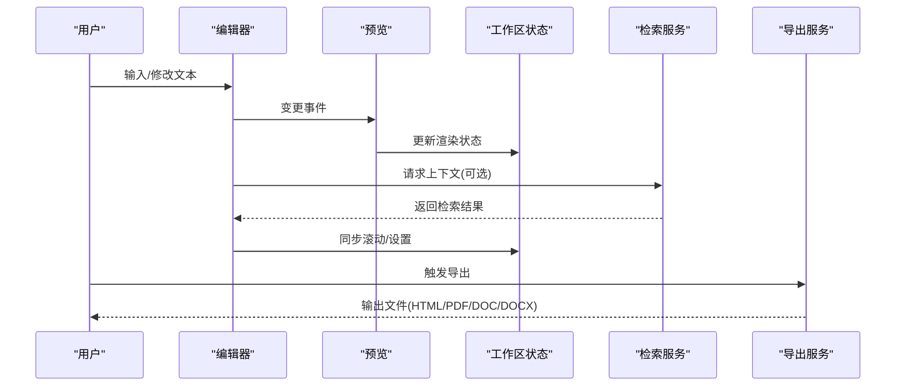
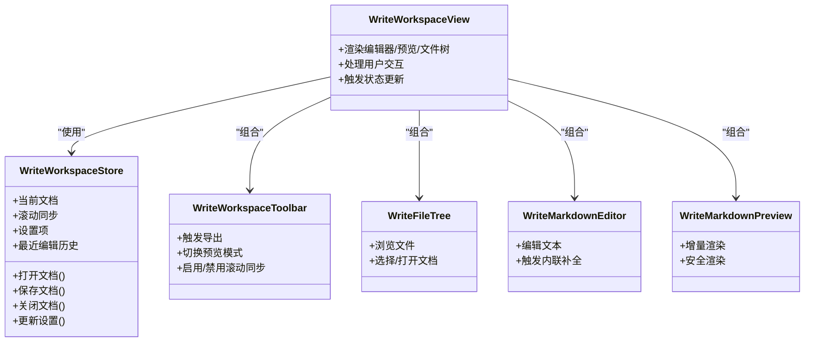
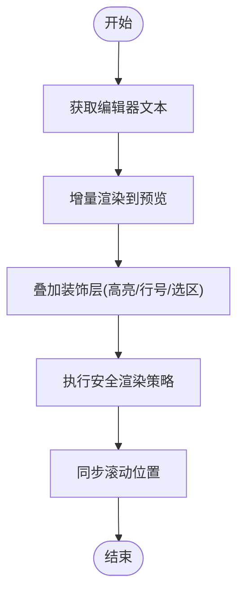
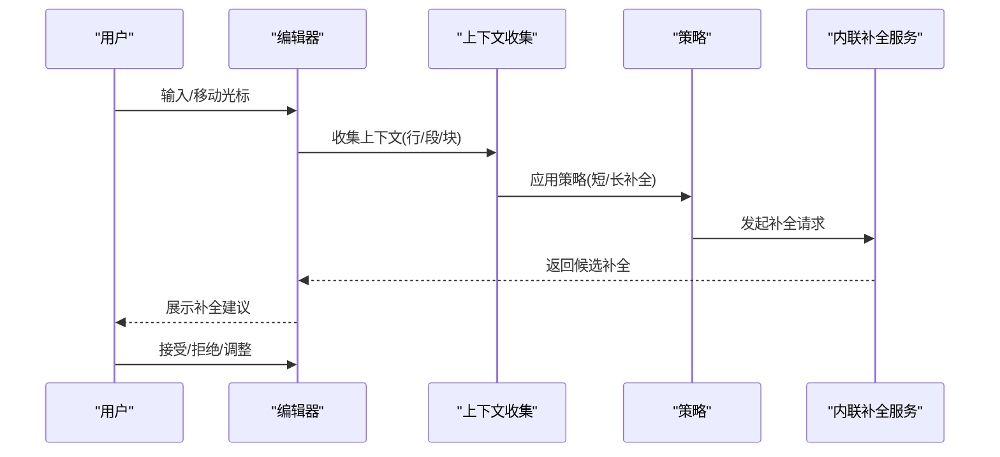
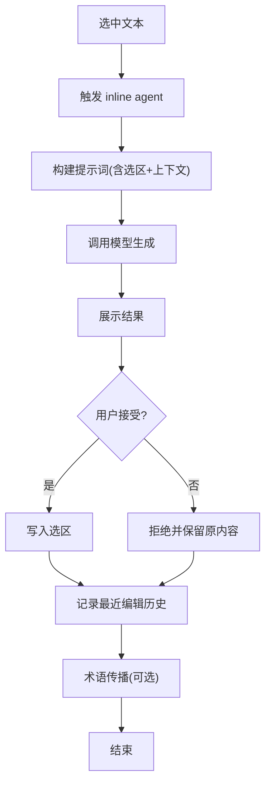
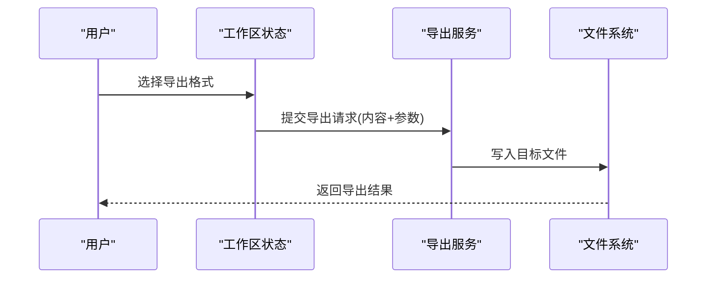
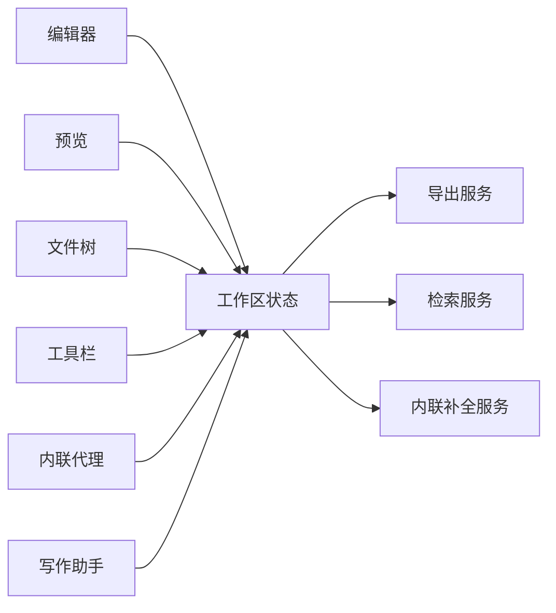

# Write 模式（文档写作）

<cite>
**本文引用的文件**
- [WriteWorkspaceView.tsx](file://src/renderer/src/components/write/WriteWorkspaceView.tsx)
- [WriteMarkdownEditor.tsx](file://src/renderer/src/components/write/WriteMarkdownEditor.tsx)
- [WriteMarkdownPreview.tsx](file://src/renderer/src/components/write/WriteMarkdownPreview.tsx)
- [WriteFileTree.tsx](file://src/renderer/src/components/write/WriteFileTree.tsx)
- [WriteWorkspaceDocumentPane.tsx](file://src/renderer/src/components/write/WriteWorkspaceDocumentPane.tsx)
- [WriteWorkspaceToolbar.tsx](file://src/renderer/src/components/write/WriteWorkspaceToolbar.tsx)
- [WriteInlineAgent.tsx](file://src/renderer/src/components/write/WriteInlineAgent.tsx)
- [WriteAssistantPanel.tsx](file://src/renderer/src/components/write/WriteAssistantPanel.tsx)
- [markdown-live-preview.ts](file://src/renderer/src/write/markdown-live-preview.ts)
- [inline-completion/codemirror.ts](file://src/renderer/src/write/inline-completion/codemirror.ts)
- [inline-completion/context.ts](file://src/renderer/src/write/inline-completion/context.ts)
- [inline-completion/policy.ts](file://src/renderer/src/write/inline-completion/policy.ts)
- [inline-completion/prompt.ts](file://src/renderer/src/write/inline-completion/prompt.ts)
- [inline-completion/types.ts](file://src/renderer/src/write/inline-completion/types.ts)
- [write-workspace-store.ts](file://src/renderer/src/write/write-workspace-store.ts)
- [write-workspace-store-helpers.ts](file://src/renderer/src/write/write-workspace-store-helpers.ts)
- [write-workspace-settings-actions.ts](file://src/renderer/src/write/write-workspace-settings-actions.ts)
- [write-workspace-file-actions.ts](file://src/renderer/src/write/write-workspace-file-actions.ts)
- [write-thread-registry.ts](file://src/renderer/src/write/write-thread-registry.ts)
- [write-file-watch.ts](file://src/renderer/src/write/write-file-watch.ts)
- [write-render-safety.ts](file://src/renderer/src/write/write-render-safety.ts)
- [write-inline-edit.ts](file://src/renderer/src/write/inline-edit.ts)
- [quoted-selection.ts](file://src/renderer/src/write/quoted-selection.ts)
- [recent-edits.ts](file://src/renderer/src/write/recent-edits.ts)
- [term-propagation.ts](file://src/renderer/src/write/term-propagation.ts)
- [write-export-service.ts](file://src/main/services/write-export-service.ts)
- [write-export.ts](file://src/shared/write-export.ts)
- [write-retrieval-service.ts](file://src/main/services/write-retrieval-service.ts)
- [WRITE_INLINE_COMPLETION_MODES.zh-CN.md](file://docs/WRITE_INLINE_COMPLETION_MODES.zh-CN.md)
- [WRITE_INLINE_EDIT_RAG.zh-CN.md](file://docs/WRITE_INLINE_EDIT_RAG.zh-CN.md)
- [WRITE_RETRIEVAL_RAG.en.md](file://docs/WRITE_RETRIEVAL_RAG.en.md)
- [settings-section-write.tsx](file://src/renderer/src/components/settings-section-write.tsx)
</cite>

## 目录
1. [简介](#简介)
2. [项目结构](#项目结构)
3. [核心组件](#核心组件)
4. [架构总览](#架构总览)
5. [详细组件分析](#详细组件分析)
6. [依赖关系分析](#依赖关系分析)
7. [性能考量](#性能考量)
8. [故障排查指南](#故障排查指南)
9. [结论](#结论)
10. [附录](#附录)

## 简介
本文件系统性阐述 DeepSeek GUI 的 Write 模式（文档写作）能力与实现，覆盖独立写作工作台的设计理念、写作空间管理、Markdown 文件树导航、实时编辑预览、Live 编辑器原理（当前行保留源码与装饰层渲染）、FIM 补全（短补全与灵感长补全）、选中文本 inline agent 交互机制、文档导出（HTML/PDF/DOC/DOCX）、写作助手工具、以及 BM25 + 关键词检索增强机制。同时提供写作工作流指导与实用技巧，帮助用户高效完成各类文档创作任务。

## 项目结构
Write 模式位于 Electron 渲染进程的组件与服务层中，采用“组件 + 写作工作区状态 + 主线程服务”的分层设计：
- 渲染侧组件：负责 UI 呈现与用户交互（编辑器、预览、文件树、工具面板等）
- 写作工作区状态：集中管理当前文档、滚动同步、设置、文件操作等
- 主线程服务：提供导出、检索、内联补全等跨进程能力

```mermaid
graph TB
subgraph "渲染进程"
WWS["WriteWorkspaceStore<br/>写作工作区状态"]
Editor["WriteMarkdownEditor<br/>编辑器"]
Preview["WriteMarkdownPreview<br/>预览"]
FileTree["WriteFileTree<br/>文件树"]
Toolbar["WriteWorkspaceToolbar<br/>工具栏"]
InlineAgent["WriteInlineAgent<br/>内联代理"]
Assistant["WriteAssistantPanel<br/>写作助手"]
end
subgraph "主线程服务"
ExportSvc["write-export-service.ts<br/>导出服务"]
RetrievalSvc["write-retrieval-service.ts<br/>检索服务"]
InlineCompSvc["write-inline-completion-service.ts<br/>内联补全服务"]
end
Editor <- --> Preview
Editor --> WWS
Preview --> WWS
FileTree --> WWS
Toolbar --> WWS
InlineAgent --> WWS
Assistant --> WWS
WWS --> ExportSvc
WWS --> RetrievalSvc
WWS --> InlineCompSvc
```

图表来源
- [WriteWorkspaceView.tsx](file://src/renderer/src/components/write/WriteWorkspaceView.tsx)
- [WriteMarkdownEditor.tsx](file://src/renderer/src/components/write/WriteMarkdownEditor.tsx)
- [WriteMarkdownPreview.tsx](file://src/renderer/src/components/write/WriteMarkdownPreview.tsx)
- [WriteFileTree.tsx](file://src/renderer/src/components/write/WriteFileTree.tsx)
- [WriteWorkspaceToolbar.tsx](file://src/renderer/src/components/write/WriteWorkspaceToolbar.tsx)
- [WriteInlineAgent.tsx](file://src/renderer/src/components/write/WriteInlineAgent.tsx)
- [WriteAssistantPanel.tsx](file://src/renderer/src/components/write/WriteAssistantPanel.tsx)
- [write-export-service.ts](file://src/main/services/write-export-service.ts)
- [write-retrieval-service.ts](file://src/main/services/write-retrieval-service.ts)

章节来源
- [WriteWorkspaceView.tsx](file://src/renderer/src/components/write/WriteWorkspaceView.tsx)
- [write-workspace-store.ts](file://src/renderer/src/write/write-workspace-store.ts)

## 核心组件
- 写作工作台视图：统一承载编辑器、预览、文件树、工具栏与助手面板，提供分屏布局与滚动同步
- Markdown 实时预览：基于编辑器内容进行增量渲染，支持代码高亮与安全渲染策略
- 内联补全与编辑：提供 FIM 短补全、灵感长补全、选中文本 inline agent 交互
- 文档导出：支持 HTML/PDF/DOC/DOCX 多格式输出
- 检索增强：结合 BM25 与关键词匹配，提升上下文召回质量
- 写作助手：提供主题建议、风格优化、结构化提示等辅助能力

章节来源
- [WriteWorkspaceView.tsx](file://src/renderer/src/components/write/WriteWorkspaceView.tsx)
- [WriteMarkdownEditor.tsx](file://src/renderer/src/components/write/WriteMarkdownEditor.tsx)
- [WriteMarkdownPreview.tsx](file://src/renderer/src/components/write/WriteMarkdownPreview.tsx)
- [WriteFileTree.tsx](file://src/renderer/src/components/write/WriteFileTree.tsx)
- [WriteWorkspaceToolbar.tsx](file://src/renderer/src/components/write/WriteWorkspaceToolbar.tsx)
- [WriteInlineAgent.tsx](file://src/renderer/src/components/write/WriteInlineAgent.tsx)
- [WriteAssistantPanel.tsx](file://src/renderer/src/components/write/WriteAssistantPanel.tsx)
- [write-export-service.ts](file://src/main/services/write-export-service.ts)
- [write-retrieval-service.ts](file://src/main/services/write-retrieval-service.ts)

## 架构总览
Write 模式的整体数据流如下：
- 用户在编辑器中输入/修改 Markdown 文本
- 预览模块接收变更并进行增量渲染
- 写作工作区状态维护当前文档、滚动同步、设置与文件操作
- 检索服务提供上下文增强（BM25 + 关键词）
- 导出服务将当前文档输出为多种格式
- 内联补全与 inline agent 提供即时辅助



图表来源
- [WriteMarkdownEditor.tsx](file://src/renderer/src/components/write/WriteMarkdownEditor.tsx)
- [WriteMarkdownPreview.tsx](file://src/renderer/src/components/write/WriteMarkdownPreview.tsx)
- [write-workspace-store.ts](file://src/renderer/src/write/write-workspace-store.ts)
- [write-retrieval-service.ts](file://src/main/services/write-retrieval-service.ts)
- [write-export-service.ts](file://src/main/services/write-export-service.ts)

## 详细组件分析

### 写作工作台视图与状态管理
- 组件职责：组织编辑器、预览、文件树、工具栏与助手面板；维护分屏布局与滚动同步
- 状态模型：集中存储当前文档、光标位置、滚动偏移、设置项、最近编辑历史等
- 文件操作：新建、打开、保存、关闭文档；监听文件系统变化并更新 UI
- 设置与行为：控制预览模式、滚动同步开关、内联补全策略等



图表来源
- [write-workspace-store.ts](file://src/renderer/src/write/write-workspace-store.ts)
- [WriteWorkspaceView.tsx](file://src/renderer/src/components/write/WriteWorkspaceView.tsx)
- [WriteWorkspaceToolbar.tsx](file://src/renderer/src/components/write/WriteWorkspaceToolbar.tsx)
- [WriteFileTree.tsx](file://src/renderer/src/components/write/WriteFileTree.tsx)
- [WriteMarkdownEditor.tsx](file://src/renderer/src/components/write/WriteMarkdownEditor.tsx)
- [WriteMarkdownPreview.tsx](file://src/renderer/src/components/write/WriteMarkdownPreview.tsx)

章节来源
- [write-workspace-store.ts](file://src/renderer/src/write/write-workspace-store.ts)
- [write-workspace-store-helpers.ts](file://src/renderer/src/write/write-workspace-store-helpers.ts)
- [write-workspace-settings-actions.ts](file://src/renderer/src/write/write-workspace-settings-actions.ts)
- [write-workspace-file-actions.ts](file://src/renderer/src/write/write-workspace-file-actions.ts)
- [write-thread-registry.ts](file://src/renderer/src/write/write-thread-registry.ts)
- [write-file-watch.ts](file://src/renderer/src/write/write-file-watch.ts)

### 实时编辑预览（Live 编辑器）
- 当前行保留源码：通过增量渲染与 DOM 稳定性策略，确保光标所在行不被重绘破坏
- 装饰层渲染：在基础渲染之上叠加语法高亮、行号、选区高亮等装饰层，提升可读性
- 安全渲染：对潜在危险标签与脚本进行过滤与转义，避免 XSS 风险
- 滚动同步：编辑器与预览之间的双向滚动同步，保持阅读体验一致



图表来源
- [markdown-live-preview.ts](file://src/renderer/src/write/markdown-live-preview.ts)
- [write-render-safety.ts](file://src/renderer/src/write/write-render-safety.ts)
- [WriteMarkdownPreview.tsx](file://src/renderer/src/components/write/WriteMarkdownPreview.tsx)

章节来源
- [markdown-live-preview.ts](file://src/renderer/src/write/markdown-live-preview.ts)
- [write-render-safety.ts](file://src/renderer/src/write/write-render-safety.ts)
- [WriteMarkdownPreview.tsx](file://src/renderer/src/components/write/WriteMarkdownPreview.tsx)

### 内联补全（FIM 短补全与灵感长补全）
- 短补全：基于上下文快速生成后续片段，适合快速延续思路
- 灵感长补全：根据更广泛的上下文与检索结果生成较长段落，适合扩展内容
- 补全策略：包含触发条件、上下文窗口、最大生成长度、温度等参数
- 与编辑器集成：在光标处插入补全建议，并提供接受/拒绝/部分应用等交互



图表来源
- [inline-completion/codemirror.ts](file://src/renderer/src/write/inline-completion/codemirror.ts)
- [inline-completion/context.ts](file://src/renderer/src/write/inline-completion/context.ts)
- [inline-completion/policy.ts](file://src/renderer/src/write/inline-completion/policy.ts)
- [inline-completion/prompt.ts](file://src/renderer/src/write/inline-completion/prompt.ts)
- [inline-completion/types.ts](file://src/renderer/src/write/inline-completion/types.ts)
- [write-inline-edit.ts](file://src/renderer/src/write/inline-edit.ts)

章节来源
- [WRITE_INLINE_COMPLETION_MODES.zh-CN.md](file://docs/WRITE_INLINE_COMPLETION_MODES.zh-CN.md)
- [inline-completion/codemirror.ts](file://src/renderer/src/write/inline-completion/codemirror.ts)
- [inline-completion/context.ts](file://src/renderer/src/write/inline-completion/context.ts)
- [inline-completion/policy.ts](file://src/renderer/src/write/inline-completion/policy.ts)
- [inline-completion/prompt.ts](file://src/renderer/src/write/inline-completion/prompt.ts)
- [inline-completion/types.ts](file://src/renderer/src/write/inline-completion/types.ts)
- [write-inline-edit.ts](file://src/renderer/src/write/inline-edit.ts)

### 选中文本 inline agent 交互机制
- 选中文本后触发 inline agent，将选区内容作为上下文注入提示词
- 支持多种操作：改写、扩写、摘要、翻译、润色等
- 与最近编辑历史联动：记录用户对选区的反馈与采纳情况
- 术语传播：将当前文档中的术语映射到其他相关文档，提升一致性



图表来源
- [quoted-selection.ts](file://src/renderer/src/write/quoted-selection.ts)
- [recent-edits.ts](file://src/renderer/src/write/recent-edits.ts)
- [term-propagation.ts](file://src/renderer/src/write/term-propagation.ts)
- [WriteInlineAgent.tsx](file://src/renderer/src/components/write/WriteInlineAgent.tsx)

章节来源
- [quoted-selection.ts](file://src/renderer/src/write/quoted-selection.ts)
- [recent-edits.ts](file://src/renderer/src/write/recent-edits.ts)
- [term-propagation.ts](file://src/renderer/src/write/term-propagation.ts)
- [WriteInlineAgent.tsx](file://src/renderer/src/components/write/WriteInlineAgent.tsx)

### 文档导出（HTML/PDF/DOC/DOCX）
- 导出服务：封装导出流程，支持多种目标格式
- 共享配置：导出参数（标题、作者、样式、封面等）在共享模块中定义
- 工作区集成：从当前工作区状态读取文档内容与元信息，生成最终文件



图表来源
- [write-export-service.ts](file://src/main/services/write-export-service.ts)
- [write-export.ts](file://src/shared/write-export.ts)
- [WriteWorkspaceToolbar.tsx](file://src/renderer/src/components/write/WriteWorkspaceToolbar.tsx)

章节来源
- [write-export-service.ts](file://src/main/services/write-export-service.ts)
- [write-export.ts](file://src/shared/write-export.ts)
- [WriteWorkspaceToolbar.tsx](file://src/renderer/src/components/write/WriteWorkspaceToolbar.tsx)

### 写作助手工具
- 主题与风格建议：根据文档类型与目标受众提供风格化建议
- 结构化提示：引导用户完善大纲、要点与过渡句
- 术语与一致性：自动检测并建议术语统一
- 即时反馈：与内联补全、inline agent 协同，提供多轮迭代优化

章节来源
- [WriteAssistantPanel.tsx](file://src/renderer/src/components/write/WriteAssistantPanel.tsx)

### 检索增强机制（BM25 + 关键词）
- 上下文召回：基于 BM25 与关键词匹配，从知识库或本地文档中召回相关内容
- 与内联编辑联动：在生成补全或回答选区问题时，将召回内容作为上下文增强
- 最近编辑历史：结合用户近期编辑行为，动态调整召回权重

章节来源
- [WRITE_RETRIEVAL_RAG.en.md](file://docs/WRITE_RETRIEVAL_RAG.en.md)
- [WRITE_INLINE_EDIT_RAG.zh-CN.md](file://docs/WRITE_INLINE_EDIT_RAG.zh-CN.md)
- [write-retrieval-service.ts](file://src/main/services/write-retrieval-service.ts)
- [recent-edits.ts](file://src/renderer/src/write/recent-edits.ts)

## 依赖关系分析
- 组件耦合：编辑器与预览高度耦合，通过工作区状态解耦文件树与工具栏
- 服务依赖：导出与检索服务通过 IPC 与主进程通信，避免阻塞渲染线程
- 状态一致性：工作区状态集中管理，确保多组件间的数据一致性



图表来源
- [write-workspace-store.ts](file://src/renderer/src/write/write-workspace-store.ts)
- [write-export-service.ts](file://src/main/services/write-export-service.ts)
- [write-retrieval-service.ts](file://src/main/services/write-retrieval-service.ts)

章节来源
- [write-workspace-store.ts](file://src/renderer/src/write/write-workspace-store.ts)
- [write-export-service.ts](file://src/main/services/write-export-service.ts)
- [write-retrieval-service.ts](file://src/main/services/write-retrieval-service.ts)

## 性能考量
- 增量渲染：仅对变更区域进行重绘，降低大文档渲染开销
- 滚动同步节流：限制滚动事件频率，避免频繁计算导致卡顿
- 安全渲染前置：在进入 DOM 前完成过滤与转义，减少运行时开销
- 内联补全缓存：对常用上下文进行缓存，减少重复请求
- 导出异步化：导出过程在后台线程执行，避免阻塞 UI

## 故障排查指南
- 预览空白或渲染异常
  - 检查安全渲染策略是否误删必要标签
  - 确认增量渲染是否正确识别变更范围
- 滚动不同步
  - 检查滚动同步开关与事件绑定
  - 确认预览容器尺寸计算是否准确
- 内联补全无响应
  - 检查策略配置与触发条件
  - 确认服务端可达与返回格式正确
- 导出失败
  - 检查目标路径权限与磁盘空间
  - 确认共享导出参数是否完整

章节来源
- [write-render-safety.ts](file://src/renderer/src/write/write-render-safety.ts)
- [use-write-split-scroll-sync.ts](file://src/renderer/src/components/write/use-write-split-scroll-sync.ts)
- [write-inline-completion-service.ts](file://src/main/services/write-inline-completion-service.ts)
- [write-export-service.ts](file://src/main/services/write-export-service.ts)

## 结论
Write 模式通过“组件 + 状态 + 服务”的分层架构，实现了从写作空间管理、实时预览、内联补全到导出与检索增强的完整闭环。其设计理念强调“所见即所得”、“所想即得”与“所写即成”，配合 BM25 + 关键词检索增强，能够显著提升用户的创作效率与质量。

## 附录
- 设置项入口：在设置界面中可调整内联补全策略、预览模式、滚动同步等行为
- 写作工作流建议：先大纲后细节、利用内联补全快速展开、借助 inline agent 进行局部优化、最后通过导出完成交付

章节来源
- [settings-section-write.tsx](file://src/renderer/src/components/settings-section-write.tsx)