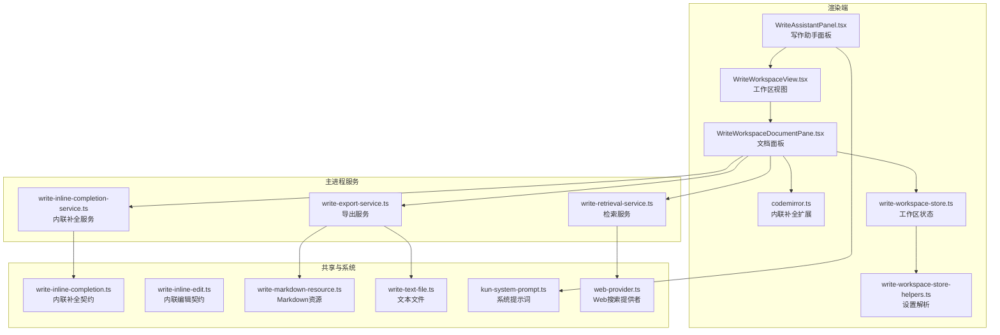
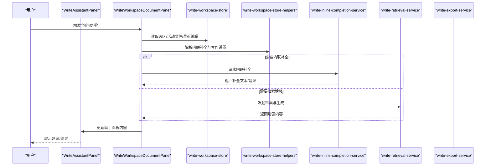
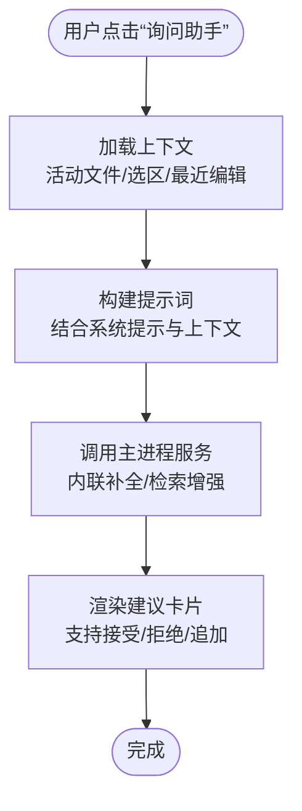
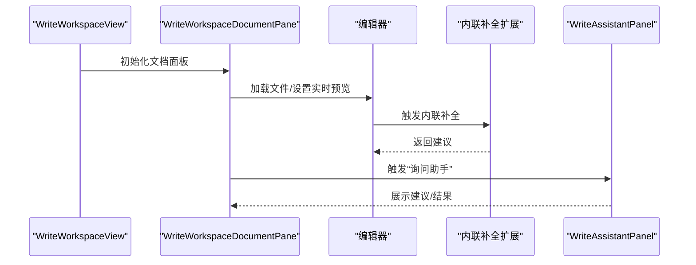
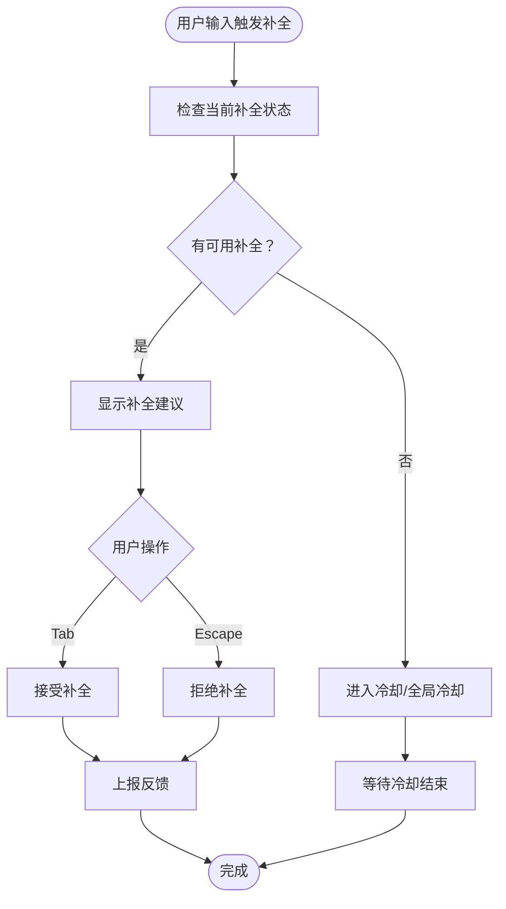
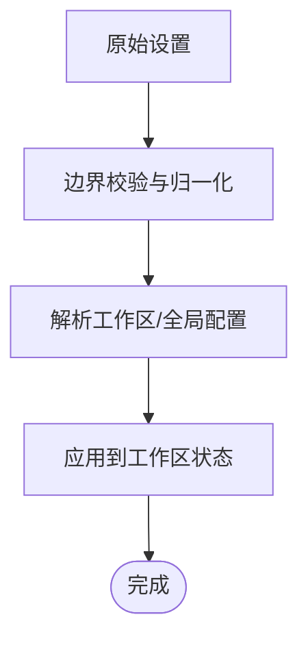
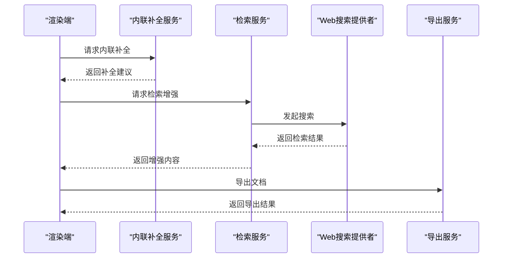
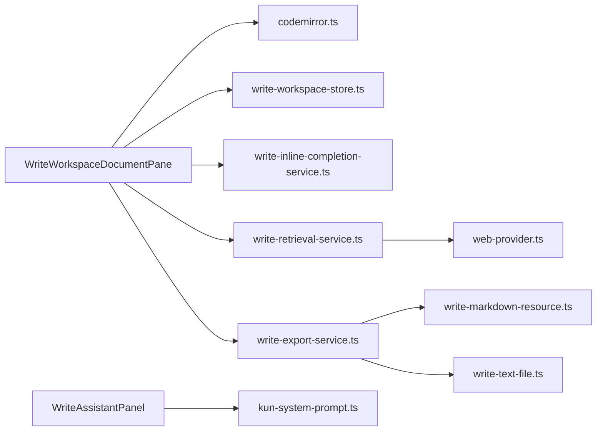

# 写作助手工具

<cite>
**本文引用的文件**
- [WriteAssistantPanel.tsx](file://src/renderer/src/components/write/WriteAssistantPanel.tsx)
- [WriteWorkspaceView.tsx](file://src/renderer/src/components/write/WriteWorkspaceView.tsx)
- [WriteWorkspaceDocumentPane.tsx](file://src/renderer/src/components/write/WriteWorkspaceDocumentPane.tsx)
- [codemirror.ts](file://src/renderer/src/write/inline-completion/codemirror.ts)
- [write-workspace-store-helpers.ts](file://src/renderer/src/write/write-workspace-store-helpers.ts)
- [write-workspace-store.ts](file://src/renderer/src/write/write-workspace-store.ts)
- [write-workspace-file-actions.ts](file://src/renderer/src/write/write-workspace-file-actions.ts)
- [write-inline-completion-service.ts](file://src/main/services/write-inline-completion-service.ts)
- [write-retrieval-service.ts](file://src/main/services/write-retrieval-service.ts)
- [write-export-service.ts](file://src/main/services/write-export-service.ts)
- [settings-section-write.tsx](file://src/renderer/src/components/settings-sections.tsx)
- [write-markdown-resource.ts](file://src/shared/write-markdown-resource.ts)
- [write-text-file.ts](file://src/shared/write-text-file.ts)
- [write-inline-completion.ts](file://src/shared/write-inline-completion.ts)
- [write-inline-edit.ts](file://src/shared/write-inline-edit.ts)
- [kun-system-prompt.ts](file://kun/src/prompt/kun-system-prompt.ts)
- [web-provider.ts](file://kun/src/ports/web-provider.ts)
- [WRITE_INLINE_COMPLETION_MODES.zh-CN.md](file://docs/WRITE_INLINE_COMPLETION_MODES.zh-CN.md)
- [WRITE_INLINE_EDIT_RAG.en.md](file://docs/WRITE_INLINE_EDIT_RAG.en.md)
- [WRITE_RETRIEVAL_RAG.en.md](file://docs/WRITE_RETRIEVAL_RAG.en.md)
</cite>

## 目录
1. [简介](#简介)
2. [项目结构](#项目结构)
3. [核心组件](#核心组件)
4. [架构总览](#架构总览)
5. [详细组件分析](#详细组件分析)
6. [依赖关系分析](#依赖关系分析)
7. [性能考量](#性能考量)
8. [故障排除指南](#故障排除指南)
9. [结论](#结论)
10. [附录](#附录)

## 简介
本文件为 Write 模式的写作助手工具提供系统化功能文档。重点覆盖写作助手面板的设计理念与交互模式（智能建议、内容优化、风格调整）、触发机制与上下文感知能力、个性化配置选项、与智能体的集成方式（任务分解、执行流程、结果反馈），并提供使用技巧、最佳实践与故障排除指南，以及扩展机制与自定义配置方法。

## 项目结构
Write 模式相关代码主要分布在渲染端组件与主进程服务之间，形成“界面交互层 → 存储与状态层 → 主进程服务层”的分层架构。核心模块包括：
- 渲染端组件：写作助手面板、工作区视图、文档编辑器、侧边栏等
- 写作存储与状态：工作区状态管理、内联补全设置解析、文件操作动作
- 主进程服务：内联补全服务、检索增强生成服务、导出服务
- 系统提示与外部能力：系统提示词、Web 搜索提供者等

图表来源
- [WriteAssistantPanel.tsx:51-177](file://src/renderer/src/components/write/WriteAssistantPanel.tsx#L51-L177)
- [WriteWorkspaceView.tsx:576-604](file://src/renderer/src/components/write/WriteWorkspaceView.tsx#L576-L604)
- [WriteWorkspaceDocumentPane.tsx:51-88](file://src/renderer/src/components/write/WriteWorkspaceDocumentPane.tsx#L51-L88)
- [codemirror.ts:484-496](file://src/renderer/src/write/inline-completion/codemirror.ts#L484-L496)
- [write-workspace-store.ts](file://src/renderer/src/write/write-workspace-store.ts)
- [write-workspace-store-helpers.ts:133-151](file://src/renderer/src/write/write-workspace-store-helpers.ts#L133-L151)
- [write-inline-completion-service.ts](file://src/main/services/write-inline-completion-service.ts)
- [write-retrieval-service.ts](file://src/main/services/write-retrieval-service.ts)
- [write-export-service.ts](file://src/main/services/write-export-service.ts)
- [write-inline-completion.ts](file://src/shared/write-inline-completion.ts)
- [write-inline-edit.ts](file://src/shared/write-inline-edit.ts)
- [write-markdown-resource.ts](file://src/shared/write-markdown-resource.ts)
- [write-text-file.ts](file://src/shared/write-text-file.ts)
- [kun-system-prompt.ts](file://kun/src/prompt/kun-system-prompt.ts)
- [web-provider.ts:87-105](file://kun/src/ports/web-provider.ts#L87-L105)

章节来源
- [WriteAssistantPanel.tsx:51-177](file://src/renderer/src/components/write/WriteAssistantPanel.tsx#L51-L177)
- [WriteWorkspaceView.tsx:576-604](file://src/renderer/src/components/write/WriteWorkspaceView.tsx#L576-L604)
- [WriteWorkspaceDocumentPane.tsx:51-88](file://src/renderer/src/components/write/WriteWorkspaceDocumentPane.tsx#L51-L88)
- [codemirror.ts:484-496](file://src/renderer/src/write/inline-completion/codemirror.ts#L484-L496)
- [write-workspace-store.ts](file://src/renderer/src/write/write-workspace-store.ts)
- [write-workspace-store-helpers.ts:133-151](file://src/renderer/src/write/write-workspace-store-helpers.ts#L133-L151)

## 核心组件
- 写作助手面板（WriteAssistantPanel）
  - 负责展示助手对话、建议卡片、连接状态与设置入口；支持折叠、新建会话、中断请求、重试连接等交互。
  - 提供“引用选区”“套用建议”等快捷操作，便于在当前文档中进行内容优化与风格调整。
- 工作区视图（WriteWorkspaceView）与文档面板（WriteWorkspaceDocumentPane）
  - 组合编辑器与预览，支持 Markdown 实时预览、内联补全、最近编辑追踪、图片粘贴与安全渲染。
  - 作为写作文档的主容器，承载助手面板与其触发入口。
- 内联补全扩展（codemirror.ts）
  - 基于 CodeMirror 的内联补全插件，包含接受/拒绝补全、空响应冷却、序列控制等策略，提升输入效率与体验。
- 写作存储与设置（write-workspace-store.ts、write-workspace-store-helpers.ts）
  - 管理工作区根目录、活动文件、选区、最近编辑、内联补全参数等状态，并对用户设置进行解析与归一化。
- 主进程服务（write-inline-completion-service.ts、write-retrieval-service.ts、write-export-service.ts）
  - 提供内联补全、RAG 检索增强生成、导出等能力，作为渲染端与底层模型/工具之间的桥梁。

章节来源
- [WriteAssistantPanel.tsx:51-177](file://src/renderer/src/components/write/WriteAssistantPanel.tsx#L51-L177)
- [WriteWorkspaceView.tsx:576-604](file://src/renderer/src/components/write/WriteWorkspaceView.tsx#L576-L604)
- [WriteWorkspaceDocumentPane.tsx:51-88](file://src/renderer/src/components/write/WriteWorkspaceDocumentPane.tsx#L51-L88)
- [codemirror.ts:484-496](file://src/renderer/src/write/inline-completion/codemirror.ts#L484-L496)
- [write-workspace-store.ts](file://src/renderer/src/write/write-workspace-store.ts)
- [write-workspace-store-helpers.ts:133-151](file://src/renderer/src/write/write-workspace-store-helpers.ts#L133-L151)
- [write-inline-completion-service.ts](file://src/main/services/write-inline-completion-service.ts)
- [write-retrieval-service.ts](file://src/main/services/write-retrieval-service.ts)
- [write-export-service.ts](file://src/main/services/write-export-service.ts)

## 架构总览
写作助手工具采用“渲染端组件 + 主进程服务 + 共享契约”的分层设计。渲染端负责交互与状态展示，主进程负责调用模型与工具，共享模块提供跨进程通信的数据结构与行为约定。

图表来源
- [WriteWorkspaceDocumentPane.tsx:51-88](file://src/renderer/src/components/write/WriteWorkspaceDocumentPane.tsx#L51-L88)
- [write-workspace-store.ts](file://src/renderer/src/write/write-workspace-store.ts)
- [write-workspace-store-helpers.ts:133-151](file://src/renderer/src/write/write-workspace-store-helpers.ts#L133-L151)
- [write-inline-completion-service.ts](file://src/main/services/write-inline-completion-service.ts)
- [write-retrieval-service.ts](file://src/main/services/write-retrieval-service.ts)

## 详细组件分析

### 写作助手面板（WriteAssistantPanel）
- 设计理念
  - 以“可折叠侧栏 + 建议卡片 + 连接状态指示”为核心，兼顾高效与易用。
  - 支持“引用选区”“套用建议”“新建会话”“中断/重试”等常用操作，降低上下文切换成本。
- 交互模式
  - 引用选区：自动将当前选区内容包装为提示，便于进行润色、总结、扩写等。
  - 智能建议：根据上下文与历史对话生成可直接采纳的建议文本。
  - 内容优化与风格调整：通过建议卡片与输入框联动，实现快速迭代。
- 触发机制
  - 文档面板提供“询问助手”入口；面板内部亦可直接触发建议生成。
- 上下文感知
  - 结合活动文件路径、选区、最近编辑、内联补全设置等，确保建议与当前写作场景一致。
- 个性化配置
  - 可打开设置面板，调整模型、推理强度、内联补全参数等。

图表来源
- [WriteAssistantPanel.tsx:51-177](file://src/renderer/src/components/write/WriteAssistantPanel.tsx#L51-L177)
- [WriteWorkspaceDocumentPane.tsx:51-88](file://src/renderer/src/components/write/WriteWorkspaceDocumentPane.tsx#L51-L88)
- [kun-system-prompt.ts](file://kun/src/prompt/kun-system-prompt.ts)

章节来源
- [WriteAssistantPanel.tsx:51-177](file://src/renderer/src/components/write/WriteAssistantPanel.tsx#L51-L177)

### 文档面板与工作区视图（WriteWorkspaceDocumentPane / WriteWorkspaceView）
- 功能职责
  - 承载编辑器与预览，支持 Markdown 实时预览、内联补全、最近编辑追踪、图片粘贴与安全渲染。
  - 提供“新建草稿”“刷新工作区”“保存”等操作入口。
- 上下文感知
  - 自动识别活动文件类型（文本/图片），并根据文件大小与 MIME 类型决定渲染策略。
  - 与内联补全扩展协同，提供补全建议与反馈。
- 与助手面板协作
  - 通过回调函数将用户意图传递给助手面板，驱动建议生成与展示。

图表来源
- [WriteWorkspaceView.tsx:576-604](file://src/renderer/src/components/write/WriteWorkspaceView.tsx#L576-L604)
- [WriteWorkspaceDocumentPane.tsx:51-88](file://src/renderer/src/components/write/WriteWorkspaceDocumentPane.tsx#L51-L88)
- [codemirror.ts:484-496](file://src/renderer/src/write/inline-completion/codemirror.ts#L484-L496)

章节来源
- [WriteWorkspaceView.tsx:576-604](file://src/renderer/src/components/write/WriteWorkspaceView.tsx#L576-L604)
- [WriteWorkspaceDocumentPane.tsx:51-88](file://src/renderer/src/components/write/WriteWorkspaceDocumentPane.tsx#L51-L88)

### 内联补全扩展（codemirror.ts）
- 实现要点
  - 插件状态管理：记录当前补全文本、锚点位置、是否已接受/拒绝。
  - 键盘绑定：Tab 接受、Escape 拒绝。
  - 冷却与节流：对空响应进行冷却与全局冷却，避免频繁请求。
  - 反馈上报：将用户交互（接受/拒绝/忽略）转换为反馈事件，用于优化后续建议。
- 性能与体验
  - 通过序列号与定时器清理，保证并发安全与内存释放。
  - 在空响应爆发时启用全局冷却，降低服务器压力。

图表来源
- [codemirror.ts:418-430](file://src/renderer/src/write/inline-completion/codemirror.ts#L418-L430)
- [codemirror.ts:438-482](file://src/renderer/src/write/inline-completion/codemirror.ts#L438-L482)
- [codemirror.ts:484-496](file://src/renderer/src/write/inline-completion/codemirror.ts#L484-L496)

章节来源
- [codemirror.ts:418-496](file://src/renderer/src/write/inline-completion/codemirror.ts#L418-L496)

### 写作存储与设置（write-workspace-store.ts、write-workspace-store-helpers.ts）
- 存储职责
  - 记录工作区根目录、活动文件路径、选区状态、最近编辑列表、内联补全开关与参数等。
- 设置解析
  - 将用户设置（如内联补全的最小接受分数、最大 Token 数等）进行边界校验与默认值归一化。
  - 支持按工作区与全局维度解析 API Key 等敏感配置。

图表来源
- [write-workspace-store-helpers.ts:116-151](file://src/renderer/src/write/write-workspace-store-helpers.ts#L116-L151)
- [write-workspace-store.ts](file://src/renderer/src/write/write-workspace-store.ts)

章节来源
- [write-workspace-store-helpers.ts:116-151](file://src/renderer/src/write/write-workspace-store-helpers.ts#L116-L151)
- [write-workspace-store.ts](file://src/renderer/src/write/write-workspace-store.ts)

### 主进程服务（write-inline-completion-service.ts、write-retrieval-service.ts、write-export-service.ts）
- 内联补全服务
  - 接收渲染端请求，调用模型生成补全建议，返回文本与评分。
- 检索增强服务
  - 基于 Web 搜索提供者（web-provider）进行信息检索，结合系统提示词生成增强内容。
- 导出服务
  - 将 Markdown 或文本内容导出为指定格式，支持资源处理与路径规范化。

图表来源
- [write-inline-completion-service.ts](file://src/main/services/write-inline-completion-service.ts)
- [write-retrieval-service.ts](file://src/main/services/write-retrieval-service.ts)
- [web-provider.ts:87-105](file://kun/src/ports/web-provider.ts#L87-L105)
- [write-export-service.ts](file://src/main/services/write-export-service.ts)

章节来源
- [write-inline-completion-service.ts](file://src/main/services/write-inline-completion-service.ts)
- [write-retrieval-service.ts](file://src/main/services/write-retrieval-service.ts)
- [web-provider.ts:87-105](file://kun/src/ports/web-provider.ts#L87-L105)
- [write-export-service.ts](file://src/main/services/write-export-service.ts)

## 依赖关系分析
- 组件耦合
  - 文档面板与助手面板通过回调与状态共享耦合度低，便于独立演进。
  - 内联补全扩展与文档面板强耦合，但通过插件化设计隔离了具体实现细节。
- 外部依赖
  - 主进程服务依赖系统提示词与 Web 搜索提供者，具备良好的可替换性。
  - 导出服务依赖共享的 Markdown/文本资源处理模块，保证跨平台一致性。

图表来源
- [WriteWorkspaceDocumentPane.tsx:51-88](file://src/renderer/src/components/write/WriteWorkspaceDocumentPane.tsx#L51-L88)
- [codemirror.ts:484-496](file://src/renderer/src/write/inline-completion/codemirror.ts#L484-L496)
- [write-workspace-store.ts](file://src/renderer/src/write/write-workspace-store.ts)
- [write-inline-completion-service.ts](file://src/main/services/write-inline-completion-service.ts)
- [write-retrieval-service.ts](file://src/main/services/write-retrieval-service.ts)
- [write-export-service.ts](file://src/main/services/write-export-service.ts)
- [kun-system-prompt.ts](file://kun/src/prompt/kun-system-prompt.ts)
- [web-provider.ts:87-105](file://kun/src/ports/web-provider.ts#L87-L105)
- [write-markdown-resource.ts](file://src/shared/write-markdown-resource.ts)
- [write-text-file.ts](file://src/shared/write-text-file.ts)

章节来源
- [WriteWorkspaceDocumentPane.tsx:51-88](file://src/renderer/src/components/write/WriteWorkspaceDocumentPane.tsx#L51-L88)
- [codemirror.ts:484-496](file://src/renderer/src/write/inline-completion/codemirror.ts#L484-L496)
- [write-workspace-store.ts](file://src/renderer/src/write/write-workspace-store.ts)
- [write-inline-completion-service.ts](file://src/main/services/write-inline-completion-service.ts)
- [write-retrieval-service.ts](file://src/main/services/write-retrieval-service.ts)
- [write-export-service.ts](file://src/main/services/write-export-service.ts)
- [kun-system-prompt.ts](file://kun/src/prompt/kun-system-prompt.ts)
- [web-provider.ts:87-105](file://kun/src/ports/web-provider.ts#L87-L105)
- [write-markdown-resource.ts](file://src/shared/write-markdown-resource.ts)
- [write-text-file.ts](file://src/shared/write-text-file.ts)

## 性能考量
- 内联补全冷却策略
  - 对空响应进行冷却与全局冷却，避免频繁请求导致的性能与成本问题。
- 参数边界控制
  - 最小接受分数、最大 Token 数等参数在设置解析阶段进行边界校验，防止异常配置影响性能。
- 实时预览与补全
  - 通过防抖与序列号控制，减少不必要的渲染与请求。
- 检索与导出
  - 检索服务限制返回条数并标注来源，导出服务统一资源处理，降低额外开销。

章节来源
- [codemirror.ts:418-430](file://src/renderer/src/write/inline-completion/codemirror.ts#L418-L430)
- [write-workspace-store-helpers.ts:116-151](file://src/renderer/src/write/write-workspace-store-helpers.ts#L116-L151)

## 故障排除指南
- 连接失败或无响应
  - 使用“重试连接”按钮恢复服务；检查网络与主进程健康状态。
- 补全不生效或频繁空响应
  - 调整“最小接受分数”“最大 Token 数”等参数；等待冷却结束。
- 建议质量不佳
  - 切换模型或提高推理强度；提供更明确的上下文提示。
- 导出异常
  - 检查目标格式与资源路径；确认导出服务日志。
- 检索结果不相关
  - 调整检索关键词；限制返回条数；查看 Web 搜索提供者的返回结果。

章节来源
- [WriteAssistantPanel.tsx:51-177](file://src/renderer/src/components/write/WriteAssistantPanel.tsx#L51-L177)
- [codemirror.ts:418-430](file://src/renderer/src/write/inline-completion/codemirror.ts#L418-L430)
- [write-retrieval-service.ts](file://src/main/services/write-retrieval-service.ts)
- [web-provider.ts:87-105](file://kun/src/ports/web-provider.ts#L87-L105)

## 结论
写作助手工具通过清晰的分层架构与插件化扩展，实现了从“上下文感知”到“智能建议”的完整闭环。其核心优势在于：
- 面向写作者的交互设计与即时反馈
- 与内联补全、检索增强、导出等能力的无缝集成
- 可配置的参数体系与稳健的性能保障

建议在实际使用中结合文档场景选择合适的模式（内联补全/检索增强），并通过设置面板持续优化参数，以获得更佳的写作体验。

## 附录
- 使用技巧
  - 在文档中先做“引用选区”，再请求助手，能显著提升建议的相关性。
  - 利用“新建会话”隔离不同任务，避免上下文污染。
  - 通过“中断/重试”快速切换思路或恢复服务。
- 最佳实践
  - 将复杂任务拆分为多个子任务，借助检索增强逐步完善内容。
  - 定期保存草稿，利用最近编辑追踪回溯修改历史。
- 扩展与自定义
  - 通过设置面板调整内联补全与写作相关参数。
  - 借助系统提示词与 Web 搜索提供者扩展上下文来源。
  - 参考内联补全与检索增强文档了解更深层配置项。

章节来源
- [settings-section-write.tsx](file://src/renderer/src/components/settings-sections.tsx)
- [WRITE_INLINE_COMPLETION_MODES.zh-CN.md](file://docs/WRITE_INLINE_COMPLETION_MODES.zh-CN.md)
- [WRITE_INLINE_EDIT_RAG.en.md](file://docs/WRITE_INLINE_EDIT_RAG.en.md)
- [WRITE_RETRIEVAL_RAG.en.md](file://docs/WRITE_RETRIEVAL_RAG.en.md)