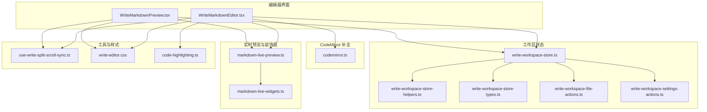
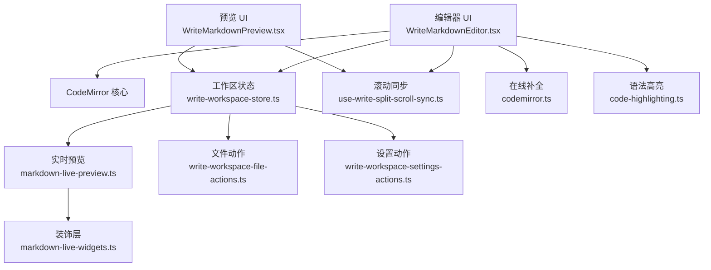
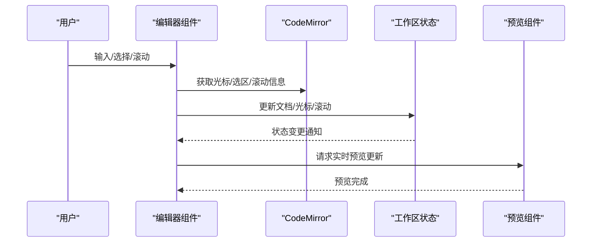
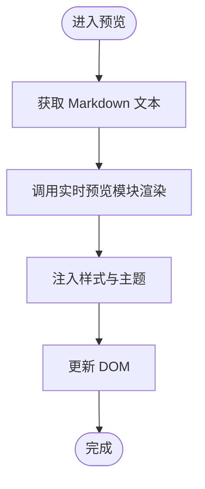
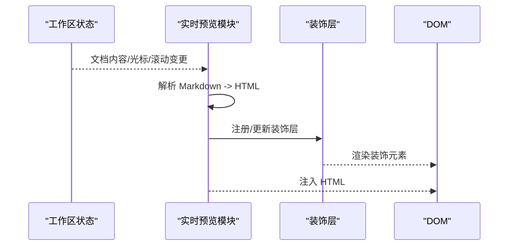
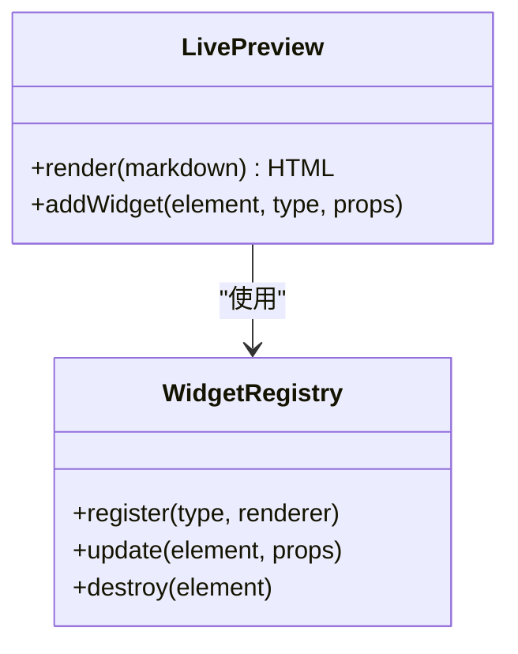
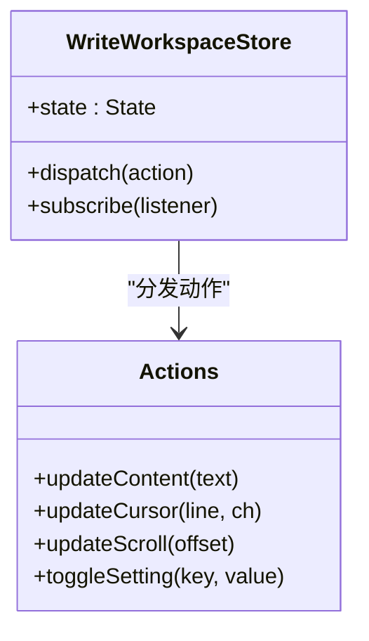
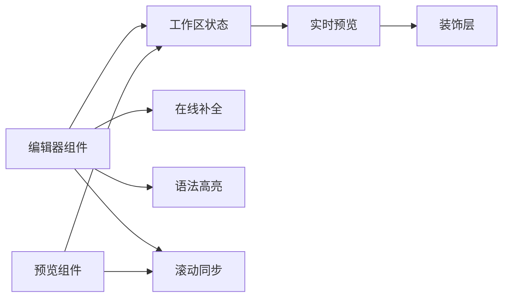

# 写作编辑器核心

<cite>
**本文引用的文件**
- [WriteMarkdownEditor.tsx](file://src/renderer/src/components/write/WriteMarkdownEditor.tsx)
- [WriteMarkdownPreview.tsx](file://src/renderer/src/components/write/WriteMarkdownPreview.tsx)
- [markdown-live-preview.ts](file://src/renderer/src/write/markdown-live-preview.ts)
- [markdown-live-widgets.ts](file://src/renderer/src/write/markdown-live-widgets.ts)
- [codemirror.ts](file://src/renderer/src/write/inline-completion/codemirror.ts)
- [write-workspace-store.ts](file://src/renderer/src/write/write-workspace-store.ts)
- [write-workspace-store-helpers.ts](file://src/renderer/src/write/write-workspace-store-helpers.ts)
- [write-workspace-store-types.ts](file://src/renderer/src/write/write-workspace-store-types.ts)
- [write-workspace-file-actions.ts](file://src/renderer/src/write/write-workspace-file-actions.ts)
- [write-workspace-settings-actions.ts](file://src/renderer/src/write/write-workspace-settings-actions.ts)
- [use-write-split-scroll-sync.ts](file://src/renderer/src/components/write/use-write-split-scroll-sync.ts)
- [write-editor.css](file://src/renderer/src/styles/write-editor.css)
- [code-highlighting.ts](file://src/renderer/src/lib/code-highlighting.ts)
- [settings-section-write.tsx](file://src/renderer/src/components/settings-sections.tsx)
- [write-markdown-resource.ts](file://src/shared/write-markdown-resource.ts)
- [write-text-file.ts](file://src/shared/write-text-file.ts)
</cite>

## 目录
1. [简介](#简介)
2. [项目结构](#项目结构)
3. [核心组件](#核心组件)
4. [架构总览](#架构总览)
5. [详细组件分析](#详细组件分析)
6. [依赖关系分析](#依赖关系分析)
7. [性能考虑](#性能考虑)
8. [故障排除指南](#故障排除指南)
9. [结论](#结论)
10. [附录](#附录)

## 简介
本文件面向“写作模式”的编辑器核心，系统性梳理基于 CodeMirror 的 Markdown 编辑器实现、实时预览机制、装饰层渲染系统，并深入解析 Live 编辑器的关键能力：当前行保留源码技术、滚动同步机制、选中文本处理。同时覆盖插件系统、语法高亮、自动补全、HTML 渲染与样式注入、动态更新机制、配置选项、性能优化策略与故障排除方法。

## 项目结构
写作编辑器相关代码主要分布在以下区域：
- 编辑器 UI 组件：WriteMarkdownEditor、WriteMarkdownPreview
- 实时预览与装饰层：markdown-live-preview、markdown-live-widgets
- 在线补全（CodeMirror 集成）：inline-completion/codemirror
- 工作区状态管理：write-workspace-store 及其辅助模块
- 滚动同步与工具函数：use-write-split-scroll-sync
- 样式与主题：write-editor.css
- 语法高亮：code-highlighting.ts
- 设置项：settings-sections.tsx 中的写作文档设置
- 共享资源与文本文件操作：write-markdown-resource、write-text-file

图表来源
- [WriteMarkdownEditor.tsx](file://src/renderer/src/components/write/WriteMarkdownEditor.tsx)
- [WriteMarkdownPreview.tsx](file://src/renderer/src/components/write/WriteMarkdownPreview.tsx)
- [markdown-live-preview.ts](file://src/renderer/src/write/markdown-live-preview.ts)
- [markdown-live-widgets.ts](file://src/renderer/src/write/markdown-live-widgets.ts)
- [codemirror.ts](file://src/renderer/src/write/inline-completion/codemirror.ts)
- [write-workspace-store.ts](file://src/renderer/src/write/write-workspace-store.ts)
- [write-workspace-store-helpers.ts](file://src/renderer/src/write/write-workspace-store-helpers.ts)
- [write-workspace-store-types.ts](file://src/renderer/src/write/write-workspace-store-types.ts)
- [write-workspace-file-actions.ts](file://src/renderer/src/write/write-workspace-file-actions.ts)
- [write-workspace-settings-actions.ts](file://src/renderer/src/write/write-workspace-settings-actions.ts)
- [use-write-split-scroll-sync.ts](file://src/renderer/src/components/write/use-write-split-scroll-sync.ts)
- [write-editor.css](file://src/renderer/src/styles/write-editor.css)
- [code-highlighting.ts](file://src/renderer/src/lib/code-highlighting.ts)

章节来源
- [WriteMarkdownEditor.tsx](file://src/renderer/src/components/write/WriteMarkdownEditor.tsx)
- [WriteMarkdownPreview.tsx](file://src/renderer/src/components/write/WriteMarkdownPreview.tsx)
- [markdown-live-preview.ts](file://src/renderer/src/write/markdown-live-preview.ts)
- [markdown-live-widgets.ts](file://src/renderer/src/write/markdown-live-widgets.ts)
- [codemirror.ts](file://src/renderer/src/write/inline-completion/codemirror.ts)
- [write-workspace-store.ts](file://src/renderer/src/write/write-workspace-store.ts)
- [write-workspace-store-helpers.ts](file://src/renderer/src/write/write-workspace-store-helpers.ts)
- [write-workspace-store-types.ts](file://src/renderer/src/write/write-workspace-store-types.ts)
- [write-workspace-file-actions.ts](file://src/renderer/src/write/write-workspace-file-actions.ts)
- [write-workspace-settings-actions.ts](file://src/renderer/src/write/write-workspace-settings-actions.ts)
- [use-write-split-scroll-sync.ts](file://src/renderer/src/components/write/use-write-split-scroll-sync.ts)
- [write-editor.css](file://src/renderer/src/styles/write-editor.css)
- [code-highlighting.ts](file://src/renderer/src/lib/code-highlighting.ts)

## 核心组件
- 编辑器组件：负责渲染 CodeMirror 编辑器实例、绑定事件、触发状态更新与滚动同步。
- 预览组件：负责将 Markdown 渲染为 HTML 并注入样式，支持动态更新与滚动同步。
- 实时预览模块：封装 Markdown 到 HTML 的转换流程、装饰层注入与更新逻辑。
- 装饰层模块：定义并管理预览中的交互元素（如链接、图片、任务列表等）。
- CodeMirror 补全模块：集成补全策略、上下文感知与提示展示。
- 工作区状态模块：集中管理当前文档、光标位置、滚动偏移、设置等状态。
- 滚动同步工具：在编辑器与预览之间保持滚动位置一致。
- 语法高亮模块：提供代码块高亮能力，增强可读性。
- 设置模块：暴露写作文档相关配置项，影响编辑体验与行为。

章节来源
- [WriteMarkdownEditor.tsx](file://src/renderer/src/components/write/WriteMarkdownEditor.tsx)
- [WriteMarkdownPreview.tsx](file://src/renderer/src/components/write/WriteMarkdownPreview.tsx)
- [markdown-live-preview.ts](file://src/renderer/src/write/markdown-live-preview.ts)
- [markdown-live-widgets.ts](file://src/renderer/src/write/markdown-live-widgets.ts)
- [codemirror.ts](file://src/renderer/src/write/inline-completion/codemirror.ts)
- [write-workspace-store.ts](file://src/renderer/src/write/write-workspace-store.ts)
- [use-write-split-scroll-sync.ts](file://src/renderer/src/components/write/use-write-split-scroll-sync.ts)
- [code-highlighting.ts](file://src/renderer/src/lib/code-highlighting.ts)
- [settings-section-write.tsx](file://src/renderer/src/components/settings-sections.tsx)

## 架构总览
编辑器采用“编辑器 + 实时预览 + 装饰层 + 状态管理 + 同步机制”的分层架构。编辑器负责输入与变更；状态管理统一维护文档内容、光标与滚动；实时预览将 Markdown 转换为 HTML 并注入样式；装饰层扩展交互；滚动同步保证编辑与预览视图一致；语法高亮提升阅读体验；设置项贯穿各模块以控制行为。

图表来源
- [WriteMarkdownEditor.tsx](file://src/renderer/src/components/write/WriteMarkdownEditor.tsx)
- [WriteMarkdownPreview.tsx](file://src/renderer/src/components/write/WriteMarkdownPreview.tsx)
- [markdown-live-preview.ts](file://src/renderer/src/write/markdown-live-preview.ts)
- [markdown-live-widgets.ts](file://src/renderer/src/write/markdown-live-widgets.ts)
- [codemirror.ts](file://src/renderer/src/write/inline-completion/codemirror.ts)
- [write-workspace-store.ts](file://src/renderer/src/write/write-workspace-store.ts)
- [write-workspace-file-actions.ts](file://src/renderer/src/write/write-workspace-file-actions.ts)
- [write-workspace-settings-actions.ts](file://src/renderer/src/write/write-workspace-settings-actions.ts)
- [use-write-split-scroll-sync.ts](file://src/renderer/src/components/write/use-write-split-scroll-sync.ts)
- [code-highlighting.ts](file://src/renderer/src/lib/code-highlighting.ts)

## 详细组件分析

### 编辑器组件（WriteMarkdownEditor）
职责
- 初始化 CodeMirror 实例，绑定输入、光标移动、滚动等事件。
- 触发工作区状态更新（内容、光标、滚动）。
- 协调滚动同步与实时预览更新。
- 集成在线补全与语法高亮。

关键点
- 事件绑定与状态派发：通过工作区动作模块更新当前文档与光标位置。
- 当前行保留源码：在滚动或内容变化时，优先维持当前行可见，避免跳转。
- 选中文本处理：在插入补全或执行编辑操作时，确保选区正确回退或恢复。

图表来源
- [WriteMarkdownEditor.tsx](file://src/renderer/src/components/write/WriteMarkdownEditor.tsx)
- [write-workspace-store.ts](file://src/renderer/src/write/write-workspace-store.ts)
- [WriteMarkdownPreview.tsx](file://src/renderer/src/components/write/WriteMarkdownPreview.tsx)

章节来源
- [WriteMarkdownEditor.tsx](file://src/renderer/src/components/write/WriteMarkdownEditor.tsx)
- [write-workspace-store.ts](file://src/renderer/src/write/write-workspace-store.ts)

### 预览组件（WriteMarkdownPreview）
职责
- 将 Markdown 文本转换为 HTML。
- 注入样式与主题，确保渲染一致性。
- 支持动态更新与滚动同步，保持与编辑器视图一致。

关键点
- HTML 渲染：调用实时预览模块进行转换。
- 样式注入：加载写作文档样式，保证视觉效果。
- 动态更新：监听状态变化，按需刷新预览内容。

图表来源
- [WriteMarkdownPreview.tsx](file://src/renderer/src/components/write/WriteMarkdownPreview.tsx)
- [markdown-live-preview.ts](file://src/renderer/src/write/markdown-live-preview.ts)
- [write-editor.css](file://src/renderer/src/styles/write-editor.css)

章节来源
- [WriteMarkdownPreview.tsx](file://src/renderer/src/components/write/WriteMarkdownPreview.tsx)
- [markdown-live-preview.ts](file://src/renderer/src/write/markdown-live-preview.ts)
- [write-editor.css](file://src/renderer/src/styles/write-editor.css)

### 实时预览模块（markdown-live-preview）
职责
- 将 Markdown 转换为 HTML。
- 管理装饰层（Widgets）生命周期与更新。
- 提供动态更新接口，响应内容变化。

关键点
- 转换流程：解析 Markdown，生成安全的 HTML。
- 装饰层：注册与更新交互元素（如链接、图片、任务列表等）。
- 安全性：对输出进行安全过滤，防止 XSS。

图表来源
- [markdown-live-preview.ts](file://src/renderer/src/write/markdown-live-preview.ts)
- [markdown-live-widgets.ts](file://src/renderer/src/write/markdown-live-widgets.ts)

章节来源
- [markdown-live-preview.ts](file://src/renderer/src/write/markdown-live-preview.ts)
- [markdown-live-widgets.ts](file://src/renderer/src/write/markdown-live-widgets.ts)

### 装饰层渲染系统（markdown-live-widgets）
职责
- 定义装饰层元素类型与渲染规则。
- 管理装饰层的创建、更新与销毁。
- 与实时预览模块协同，确保交互元素正确挂载。

关键点
- 类型与规则：明确链接、图片、任务列表等元素的渲染方式。
- 生命周期：在内容变化时重建或更新装饰层，避免重复挂载。

图表来源
- [markdown-live-widgets.ts](file://src/renderer/src/write/markdown-live-widgets.ts)
- [markdown-live-preview.ts](file://src/renderer/src/write/markdown-live-preview.ts)

章节来源
- [markdown-live-widgets.ts](file://src/renderer/src/write/markdown-live-widgets.ts)
- [markdown-live-preview.ts](file://src/renderer/src/write/markdown-live-preview.ts)

### CodeMirror 集成与在线补全（codemirror）
职责
- 在 CodeMirror 中集成补全策略，提供上下文感知的提示。
- 处理补全触发、选择与插入逻辑。
- 与编辑器组件协作，确保补全不影响当前行保留与滚动。

关键点
- 补全策略：根据上下文决定触发时机与候选集。
- 插入与回退：在插入补全后，正确处理选区与滚动，避免跳转。

图表来源
- [codemirror.ts](file://src/renderer/src/write/inline-completion/codemirror.ts)
- [WriteMarkdownEditor.tsx](file://src/renderer/src/components/write/WriteMarkdownEditor.tsx)

章节来源
- [codemirror.ts](file://src/renderer/src/write/inline-completion/codemirror.ts)
- [WriteMarkdownEditor.tsx](file://src/renderer/src/components/write/WriteMarkdownEditor.tsx)

### 工作区状态管理（write-workspace-store）
职责
- 统一管理当前文档内容、光标位置、滚动偏移、设置等。
- 提供动作模块用于更新状态与触发 UI 更新。
- 作为编辑器与预览之间的数据枢纽。

关键点
- 状态结构：包含文档、光标、滚动、设置等字段。
- 动作模块：封装文件操作与设置变更，保证状态一致性。

图表来源
- [write-workspace-store.ts](file://src/renderer/src/write/write-workspace-store.ts)
- [write-workspace-store-helpers.ts](file://src/renderer/src/write/write-workspace-store-helpers.ts)
- [write-workspace-store-types.ts](file://src/renderer/src/write/write-workspace-store-types.ts)
- [write-workspace-file-actions.ts](file://src/renderer/src/write/write-workspace-file-actions.ts)
- [write-workspace-settings-actions.ts](file://src/renderer/src/write/write-workspace-settings-actions.ts)

章节来源
- [write-workspace-store.ts](file://src/renderer/src/write/write-workspace-store.ts)
- [write-workspace-store-helpers.ts](file://src/renderer/src/write/write-workspace-store-helpers.ts)
- [write-workspace-store-types.ts](file://src/renderer/src/write/write-workspace-store-types.ts)
- [write-workspace-file-actions.ts](file://src/renderer/src/write/write-workspace-file-actions.ts)
- [write-workspace-settings-actions.ts](file://src/renderer/src/write/write-workspace-settings-actions.ts)

### 滚动同步机制（use-write-split-scroll-sync）
职责
- 在编辑器与预览之间保持滚动位置一致。
- 处理滚动方向与速度差异，避免抖动。

关键点
- 同步算法：根据内容高度比例映射滚动位置。
- 抖动抑制：在快速滚动时进行节流或缓冲。

图表来源
- [use-write-split-scroll-sync.ts](file://src/renderer/src/components/write/use-write-split-scroll-sync.ts)

章节来源
- [use-write-split-scroll-sync.ts](file://src/renderer/src/components/write/use-write-split-scroll-sync.ts)

### 语法高亮（code-highlighting）
职责
- 对代码块进行语法高亮，提升可读性。
- 与实时预览模块配合，在渲染 HTML 时注入高亮样式。

关键点
- 高亮引擎：选择合适的高亮库并配置语言支持。
- 性能：对大文档进行增量高亮，避免阻塞主线程。

章节来源
- [code-highlighting.ts](file://src/renderer/src/lib/code-highlighting.ts)

### 设置项（settings-section-write）
职责
- 提供写作文档相关配置项，影响编辑器行为与外观。
- 与工作区设置动作模块联动，持久化用户偏好。

关键点
- 配置范围：包括主题、字体、行宽、自动补全开关等。
- 生效机制：通过设置动作模块更新工作区状态。

章节来源
- [settings-section-write.tsx](file://src/renderer/src/components/settings-sections.tsx)

## 依赖关系分析
- 编辑器组件依赖工作区状态与滚动同步工具，同时集成在线补全与语法高亮。
- 预览组件依赖工作区状态与实时预览模块，负责最终渲染。
- 实时预览模块依赖装饰层模块，共同完成 HTML 与交互元素的渲染。
- 工作区状态模块通过动作模块与设置模块解耦，便于扩展与测试。
- 样式模块独立于业务逻辑，仅提供主题与布局支持。

图表来源
- [WriteMarkdownEditor.tsx](file://src/renderer/src/components/write/WriteMarkdownEditor.tsx)
- [WriteMarkdownPreview.tsx](file://src/renderer/src/components/write/WriteMarkdownPreview.tsx)
- [write-workspace-store.ts](file://src/renderer/src/write/write-workspace-store.ts)
- [markdown-live-preview.ts](file://src/renderer/src/write/markdown-live-preview.ts)
- [markdown-live-widgets.ts](file://src/renderer/src/write/markdown-live-widgets.ts)
- [codemirror.ts](file://src/renderer/src/write/inline-completion/codemirror.ts)
- [code-highlighting.ts](file://src/renderer/src/lib/code-highlighting.ts)
- [use-write-split-scroll-sync.ts](file://src/renderer/src/components/write/use-write-split-scroll-sync.ts)

章节来源
- [WriteMarkdownEditor.tsx](file://src/renderer/src/components/write/WriteMarkdownEditor.tsx)
- [WriteMarkdownPreview.tsx](file://src/renderer/src/components/write/WriteMarkdownPreview.tsx)
- [write-workspace-store.ts](file://src/renderer/src/write/write-workspace-store.ts)
- [markdown-live-preview.ts](file://src/renderer/src/write/markdown-live-preview.ts)
- [markdown-live-widgets.ts](file://src/renderer/src/write/markdown-live-widgets.ts)
- [codemirror.ts](file://src/renderer/src/write/inline-completion/codemirror.ts)
- [code-highlighting.ts](file://src/renderer/src/lib/code-highlighting.ts)
- [use-write-split-scroll-sync.ts](file://src/renderer/src/components/write/use-write-split-scroll-sync.ts)

## 性能考虑
- 滚动同步节流：在快速滚动时降低同步频率，减少重排与重绘。
- 实时预览增量更新：仅在内容变化时触发渲染，避免全量重算。
- 装饰层懒加载：在需要时再创建装饰元素，减少初始开销。
- 语法高亮异步处理：对大文档进行分片高亮，避免主线程阻塞。
- 状态更新去抖：合并短时间内多次状态变更，减少渲染次数。
- 样式缓存：复用已注入的样式，避免重复注入导致的性能损耗。

## 故障排除指南
常见问题与排查步骤
- 预览不更新
  - 检查工作区状态是否正确更新。
  - 确认实时预览模块是否被调用。
  - 查看装饰层是否异常导致渲染失败。
- 滚动不同步
  - 检查滚动同步工具是否启用。
  - 确认内容高度计算是否准确。
  - 排查是否存在样式导致的高度偏差。
- 在线补全不触发
  - 检查 CodeMirror 补全模块是否初始化成功。
  - 确认触发条件与上下文分析逻辑。
  - 查看动作模块是否正确更新状态。
- 语法高亮异常
  - 检查高亮库是否正确加载。
  - 确认语言支持与主题样式。
  - 查看是否存在超大代码块导致的性能问题。
- 样式错乱
  - 确认样式注入顺序与优先级。
  - 检查主题切换是否生效。
  - 排查第三方样式冲突。

章节来源
- [markdown-live-preview.ts](file://src/renderer/src/write/markdown-live-preview.ts)
- [markdown-live-widgets.ts](file://src/renderer/src/write/markdown-live-widgets.ts)
- [use-write-split-scroll-sync.ts](file://src/renderer/src/components/write/use-write-split-scroll-sync.ts)
- [codemirror.ts](file://src/renderer/src/write/inline-completion/codemirror.ts)
- [code-highlighting.ts](file://src/renderer/src/lib/code-highlighting.ts)
- [write-editor.css](file://src/renderer/src/styles/write-editor.css)

## 结论
写作编辑器核心通过清晰的分层设计与模块化实现，提供了稳定、高效的 Markdown 编辑与实时预览体验。编辑器组件、工作区状态、实时预览与装饰层、滚动同步与语法高亮等模块协同工作，满足了当前行保留、滚动同步、选中文本处理等关键需求。通过合理的性能优化与完善的故障排除机制，系统在复杂场景下仍能保持流畅与可靠。

## 附录
- 共享资源与文本文件操作
  - 写作 Markdown 资源与文本文件工具为编辑器提供底层文件读写与资源管理能力，确保文档持久化与资源访问的一致性。

章节来源
- [write-markdown-resource.ts](file://src/shared/write-markdown-resource.ts)
- [write-text-file.ts](file://src/shared/write-text-file.ts)