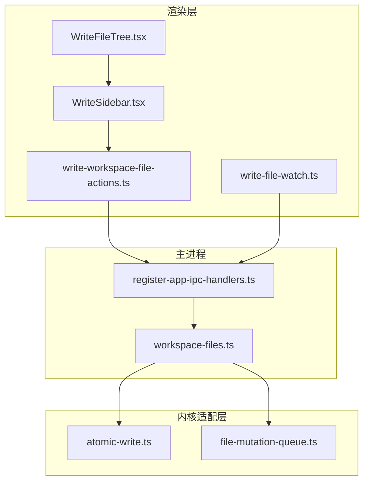
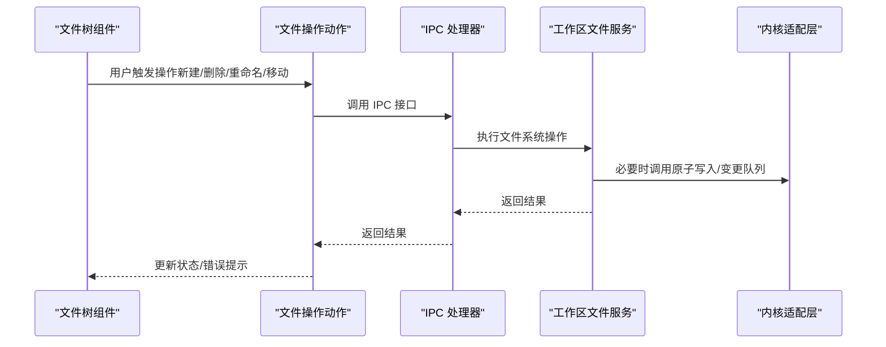
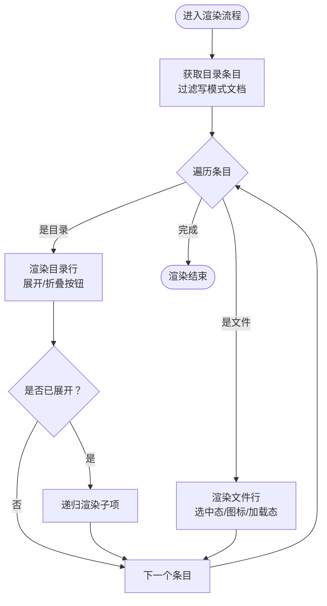
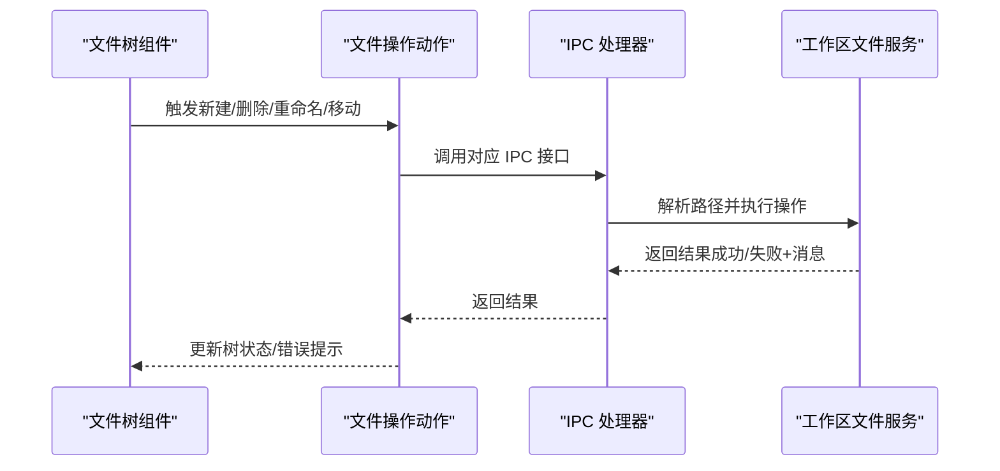
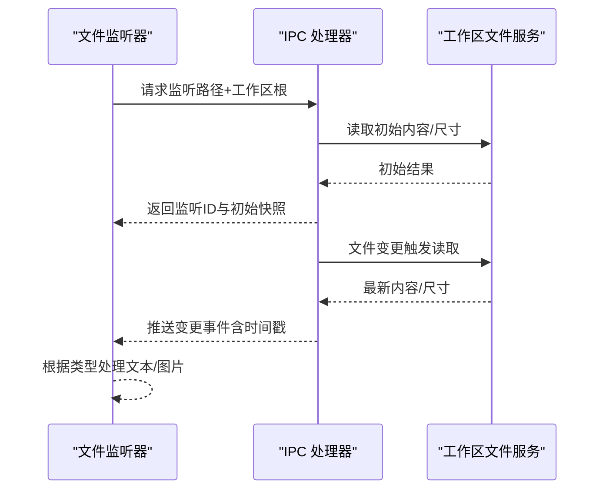
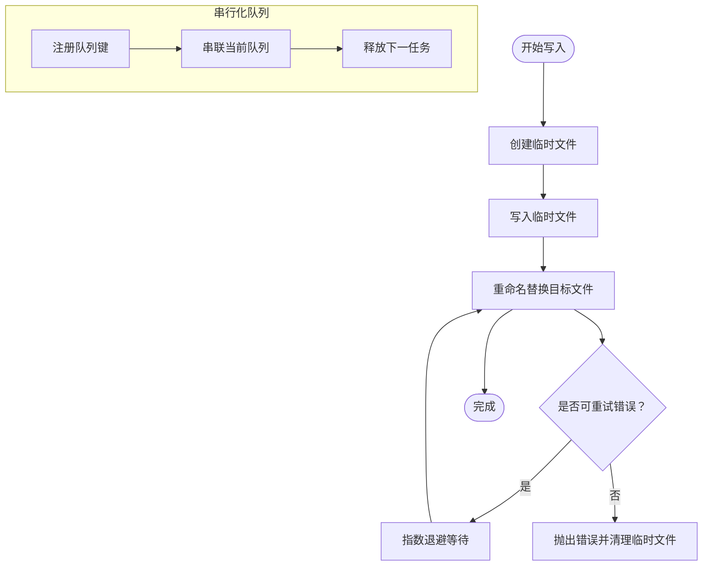
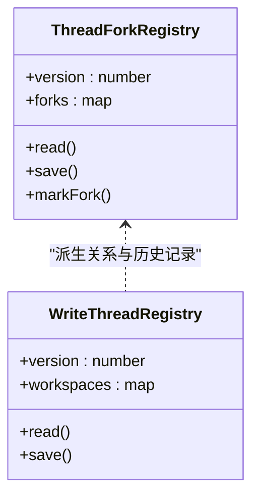
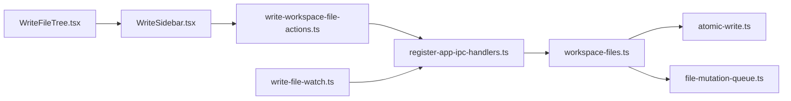

# 文件导航与管理

<cite>
**本文引用的文件**
- [WriteFileTree.tsx](file://src/renderer/src/components/write/WriteFileTree.tsx)
- [WriteSidebar.tsx](file://src/renderer/src/components/write/WriteSidebar.tsx)
- [workspace-files.ts](file://src/main/services/workspace-files.ts)
- [register-app-ipc-handlers.ts](file://src/main/ipc/register-app-ipc-handlers.ts)
- [write-file-watch.ts](file://src/renderer/src/write/write-file-watch.ts)
- [atomic-write.ts](file://kun/src/adapters/file/atomic-write.ts)
- [file-mutation-queue.ts](file://kun/src/adapters/tool/file-mutation-queue.ts)
- [write-workspace-file-actions.ts](file://src/renderer/src/write/write-workspace-file-actions.ts)
- [write-thread-registry.ts](file://src/renderer/src/write/write-thread-registry.ts)
- [thread-fork-registry.ts](file://src/renderer/src/lib/thread-fork-registry.ts)
- [write-workspace-file-actions.test.ts](file://src/renderer/src/write/write-workspace-file-actions.test.ts)
- [write-file-watch.test.ts](file://src/renderer/src/write/write-file-watch.test.ts)
- [atomic-write.test.ts](file://kun/tests/atomic-write.test.ts)
</cite>

## 目录
1. [简介](#简介)
2. [项目结构](#项目结构)
3. [核心组件](#核心组件)
4. [架构总览](#架构总览)
5. [详细组件分析](#详细组件分析)
6. [依赖关系分析](#依赖关系分析)
7. [性能考虑](#性能考虑)
8. [故障排查指南](#故障排查指南)
9. [结论](#结论)
10. [附录](#附录)

## 简介
本技术文档聚焦于 Write 模式下的“文件导航与管理系统”。系统围绕文件树组件、目录遍历与过滤、图标显示、文件操作（新建、删除、重命名、移动）、文件监控（实时变更检测、增量更新、冲突处理）、以及文件关联（线程注册、历史记录、版本管理）展开，提供从界面到后端服务再到内核适配层的完整实现解析，并给出最佳实践、性能优化与安全注意事项。

## 项目结构
该系统由三部分协同构成：
- 渲染层（Renderer）
  - 文件树组件与侧边栏：负责 UI 呈现、用户交互与事件分发
  - 文件监听器：负责订阅文件变更并回传到渲染层
  - 文件操作动作：封装 IPC 调用，统一错误处理
- 主进程（Main）
  - 工作区文件服务：提供文件读写、创建、删除、重命名、移动等能力
  - IPC 处理器：建立渲染层与主进程之间的通信通道，维护文件监听器生命周期
- 内核适配层（Kun）
  - 原子写入：保障写入过程的原子性与稳定性
  - 文件变更队列：串行化同一文件的多次变更，避免竞态与覆盖

图表来源
- [WriteFileTree.tsx](file://src/renderer/src/components/write/WriteFileTree.tsx)
- [WriteSidebar.tsx](file://src/renderer/src/components/write/WriteSidebar.tsx)
- [write-file-watch.ts](file://src/renderer/src/write/write-file-watch.ts)
- [workspace-files.ts](file://src/main/services/workspace-files.ts)
- [register-app-ipc-handlers.ts](file://src/main/ipc/register-app-ipc-handlers.ts)
- [atomic-write.ts](file://kun/src/adapters/file/atomic-write.ts)
- [file-mutation-queue.ts](file://kun/src/adapters/tool/file-mutation-queue.ts)

章节来源
- [WriteFileTree.tsx](file://src/renderer/src/components/write/WriteFileTree.tsx)
- [WriteSidebar.tsx](file://src/renderer/src/components/write/WriteSidebar.tsx)
- [workspace-files.ts](file://src/main/services/workspace-files.ts)
- [register-app-ipc-handlers.ts](file://src/main/ipc/register-app-ipc-handlers.ts)
- [write-file-watch.ts](file://src/renderer/src/write/write-file-watch.ts)
- [atomic-write.ts](file://kun/src/adapters/file/atomic-write.ts)
- [file-mutation-queue.ts](file://kun/src/adapters/tool/file-mutation-queue.ts)

## 核心组件
- 文件树组件（WriteFileTree）
  - 负责按目录层级渲染条目，支持展开/折叠、选中状态、加载状态提示、图标展示与操作按钮
  - 提供回调接口：切换目录、选择文件、新建文件/目录、重命名、删除、刷新
- 侧边栏容器（WriteSidebar）
  - 展示工作区根路径与当前激活文件，承载文件树组件并传递状态与回调
- 文件监听器（write-file-watch）
  - 在渲染层启动/停止文件监听，接收主进程推送的变更事件，区分文本与图片类型
- 工作区文件服务（workspace-files）
  - 主进程侧提供文件读写、创建、删除、重命名、移动等操作；对路径进行校验与安全限制
- IPC 处理器（register-app-ipc-handlers）
  - 注册文件相关 IPC 接口，维护监听器集合，调度变更事件，提供延迟合并策略
- 原子写入（atomic-write）
  - 先写临时文件，再重命名替换目标文件，失败时清理临时文件；对 Windows 常见锁冲突进行重试
- 变更队列（file-mutation-queue）
  - 将同一物理路径的变更串行化，避免并发写入导致的覆盖或竞态

章节来源
- [WriteFileTree.tsx](file://src/renderer/src/components/write/WriteFileTree.tsx)
- [WriteSidebar.tsx](file://src/renderer/src/components/write/WriteSidebar.tsx)
- [write-file-watch.ts](file://src/renderer/src/write/write-file-watch.ts)
- [workspace-files.ts](file://src/main/services/workspace-files.ts)
- [register-app-ipc-handlers.ts](file://src/main/ipc/register-app-ipc-handlers.ts)
- [atomic-write.ts](file://kun/src/adapters/file/atomic-write.ts)
- [file-mutation-queue.ts](file://kun/src/adapters/tool/file-mutation-queue.ts)

## 架构总览
Write 模式的文件导航与管理采用“渲染层-主进程-内核适配层”的分层设计：
- 渲染层通过 IPC 发起文件操作请求，同时订阅文件变更事件
- 主进程在安全边界内执行文件系统操作，必要时调用内核适配层以确保一致性
- 内核适配层提供原子写入与变更串行化，降低竞态风险

图表来源
- [write-workspace-file-actions.ts](file://src/renderer/src/write/write-workspace-file-actions.ts)
- [register-app-ipc-handlers.ts](file://src/main/ipc/register-app-ipc-handlers.ts)
- [workspace-files.ts](file://src/main/services/workspace-files.ts)
- [atomic-write.ts](file://kun/src/adapters/file/atomic-write.ts)
- [file-mutation-queue.ts](file://kun/src/adapters/tool/file-mutation-queue.ts)

## 详细组件分析

### 文件树组件（WriteFileTree）
- 目录遍历与过滤
  - 仅展示“写模式文档”类型的条目，过滤非文档类文件
  - 递归渲染子目录，支持深度缩进与展开/折叠状态
- 图标显示机制
  - 目录与文件分别使用不同图标；选中状态改变图标的强调色
  - 加载中的目录显示“加载中”标签
- 用户交互
  - 点击目录展开/折叠；点击文件触发选择
  - 针对目录显示“在文件夹中新建文件/文件夹”按钮；显示“重命名/删除”按钮

图表来源
- [WriteFileTree.tsx](file://src/renderer/src/components/write/WriteFileTree.tsx)

章节来源
- [WriteFileTree.tsx](file://src/renderer/src/components/write/WriteFileTree.tsx)

### 文件操作实现（新建/删除/重命名/移动）
- 新建文件/目录
  - 渲染层调用 IPC 创建接口，主进程解析目标路径并在安全范围内创建
- 删除
  - 主进程检查工作区根路径保护，防止误删根目录；支持递归删除目录
- 重命名/移动
  - 校验目标路径不存在；执行重命名并返回前一路径与时间戳
- 错误处理
  - 统一捕获异常并返回错误信息；渲染层根据结果更新状态与提示

图表来源
- [write-workspace-file-actions.ts](file://src/renderer/src/write/write-workspace-file-actions.ts)
- [register-app-ipc-handlers.ts](file://src/main/ipc/register-app-ipc-handlers.ts)
- [workspace-files.ts](file://src/main/services/workspace-files.ts)

章节来源
- [workspace-files.ts](file://src/main/services/workspace-files.ts)
- [register-app-ipc-handlers.ts](file://src/main/ipc/register-app-ipc-handlers.ts)
- [write-workspace-file-actions.ts](file://src/renderer/src/write/write-workspace-file-actions.ts)
- [write-workspace-file-actions.test.ts](file://src/renderer/src/write/write-workspace-file-actions.test.ts)

### 文件监控机制（实时变更检测、增量更新、冲突处理）
- 启动监听
  - 渲染层通过 API 请求主进程开启文件监听，主进程返回监听 ID 与初始内容/尺寸
- 变更推送
  - 主进程在文件变化时读取最新内容，合并防抖延迟（约 90ms），向渲染层发送变更事件
- 类型路由
  - 文本与图片监听分别处理；渲染层根据监听类型决定回调
- 冲突与错误处理
  - 监听器按 watchId 过滤事件；失败时上报错误消息；支持取消监听

图表来源
- [write-file-watch.ts](file://src/renderer/src/write/write-file-watch.ts)
- [register-app-ipc-handlers.ts](file://src/main/ipc/register-app-ipc-handlers.ts)
- [workspace-files.ts](file://src/main/services/workspace-files.ts)

章节来源
- [write-file-watch.ts](file://src/renderer/src/write/write-file-watch.ts)
- [write-file-watch.test.ts](file://src/renderer/src/write/write-file-watch.test.ts)
- [register-app-ipc-handlers.ts](file://src/main/ipc/register-app-ipc-handlers.ts)
- [workspace-files.ts](file://src/main/services/workspace-files.ts)

### 原子写入与变更串行化
- 原子写入（atomic-write）
  - 先写临时文件，再重命名替换；对 Windows 常见锁冲突（EPERM/EACCES/EBUSY）进行有限次数重试
  - 失败时清理临时文件，保证文件系统一致
- 变更串行化（file-mutation-queue）
  - 以真实路径为键，串行化同一文件的多次变更；避免并发写入导致的覆盖或竞态
  - 支持路径不存在场景的容错处理

图表来源
- [atomic-write.ts](file://kun/src/adapters/file/atomic-write.ts)
- [file-mutation-queue.ts](file://kun/src/adapters/tool/file-mutation-queue.ts)

章节来源
- [atomic-write.ts](file://kun/src/adapters/file/atomic-write.ts)
- [atomic-write.test.ts](file://kun/tests/atomic-write.test.ts)
- [file-mutation-queue.ts](file://kun/src/adapters/tool/file-mutation-queue.ts)

### 文件关联机制（线程注册、历史记录、版本管理）
- 线程注册与历史记录
  - 通过线程派生注册表记录父子线程关系与派生统计，支持上限裁剪与刷新逻辑
- 写模式线程注册
  - 写模式线程注册表按工作区维度维护活动线程与最近线程列表，限制数量并保持活跃优先
- 版本管理
  - 文件重命名返回前一路径与时间戳，便于后续版本追踪与审计

图表来源
- [thread-fork-registry.ts](file://src/renderer/src/lib/thread-fork-registry.ts)
- [write-thread-registry.ts](file://src/renderer/src/write/write-thread-registry.ts)

章节来源
- [thread-fork-registry.ts](file://src/renderer/src/lib/thread-fork-registry.ts)
- [write-thread-registry.ts](file://src/renderer/src/write/write-thread-registry.ts)

## 依赖关系分析
- 渲染层依赖
  - 文件树组件依赖侧边栏容器与文件操作动作
  - 文件监听器依赖 IPC 接口与主进程文件服务
- 主进程依赖
  - 文件服务依赖安全路径解析与文件系统操作
  - IPC 处理器维护监听器集合与事件调度
- 内核适配层依赖
  - 原子写入与变更队列提供底层一致性保障

图表来源
- [WriteFileTree.tsx](file://src/renderer/src/components/write/WriteFileTree.tsx)
- [WriteSidebar.tsx](file://src/renderer/src/components/write/WriteSidebar.tsx)
- [write-workspace-file-actions.ts](file://src/renderer/src/write/write-workspace-file-actions.ts)
- [register-app-ipc-handlers.ts](file://src/main/ipc/register-app-ipc-handlers.ts)
- [workspace-files.ts](file://src/main/services/workspace-files.ts)
- [atomic-write.ts](file://kun/src/adapters/file/atomic-write.ts)
- [file-mutation-queue.ts](file://kun/src/adapters/tool/file-mutation-queue.ts)
- [write-file-watch.ts](file://src/renderer/src/write/write-file-watch.ts)

章节来源
- [WriteFileTree.tsx](file://src/renderer/src/components/write/WriteFileTree.tsx)
- [WriteSidebar.tsx](file://src/renderer/src/components/write/WriteSidebar.tsx)
- [write-workspace-file-actions.ts](file://src/renderer/src/write/write-workspace-file-actions.ts)
- [register-app-ipc-handlers.ts](file://src/main/ipc/register-app-ipc-handlers.ts)
- [workspace-files.ts](file://src/main/services/workspace-files.ts)
- [atomic-write.ts](file://kun/src/adapters/file/atomic-write.ts)
- [file-mutation-queue.ts](file://kun/src/adapters/tool/file-mutation-queue.ts)
- [write-file-watch.ts](file://src/renderer/src/write/write-file-watch.ts)

## 性能考虑
- 目录渲染
  - 使用按需展开与深度缩进，避免一次性渲染大量节点
  - 对加载中的目录显示占位状态，减少闪烁
- 文件监听
  - 变更事件采用短延迟合并（约 90ms），降低频繁读取带来的 IO 压力
  - 仅对目标路径监听，避免全局扫描
- 写入一致性
  - 原子写入与临时文件策略减少磁盘碎片与不一致窗口
  - 变更队列串行化避免并发写入竞争
- 资源回收
  - 监听器按发送方自动清理，避免内存泄漏
  - 侧边栏关闭时及时释放监听器

## 故障排查指南
- 文件操作失败
  - 检查 IPC 返回的错误消息；确认路径是否在工作区内、是否存在同名冲突
  - 参考单元测试对重命名/删除失败场景的断言
- 文件监听异常
  - 确认监听 ID 是否正确匹配；检查主进程日志中的监听关闭与错误上报
  - 验证监听器是否被正确取消，避免重复监听
- 平台差异
  - Windows 上重命名锁冲突可能触发重试；若持续失败，检查权限与杀毒软件占用
- 原子写入问题
  - 若临时文件残留，检查写入权限与磁盘空间；确认重试配置是否合理

章节来源
- [write-workspace-file-actions.test.ts](file://src/renderer/src/write/write-workspace-file-actions.test.ts)
- [write-file-watch.test.ts](file://src/renderer/src/write/write-file-watch.test.ts)
- [atomic-write.test.ts](file://kun/tests/atomic-write.test.ts)
- [register-app-ipc-handlers.ts](file://src/main/ipc/register-app-ipc-handlers.ts)

## 结论
该系统通过清晰的分层设计与完善的错误处理，实现了稳定高效的文件导航与管理能力。文件树组件提供直观的浏览体验，主进程侧严格的安全校验与内核适配层的一致性保障共同确保了可靠性。配合文件监听与派生注册机制，系统在易用性与健壮性之间取得良好平衡。

## 附录
- 最佳实践
  - 优先使用侧边栏提供的新建/重命名入口，避免直接操作底层路径
  - 对大目录采用按需展开，减少一次性渲染压力
  - 在协作场景下，利用派生注册与重命名时间戳进行版本追踪
- 安全注意事项
  - 不允许删除工作区根目录；对路径进行严格校验
  - 写入前确保目标目录存在且具备写权限
  - 监听器应随会话或窗口生命周期正确释放