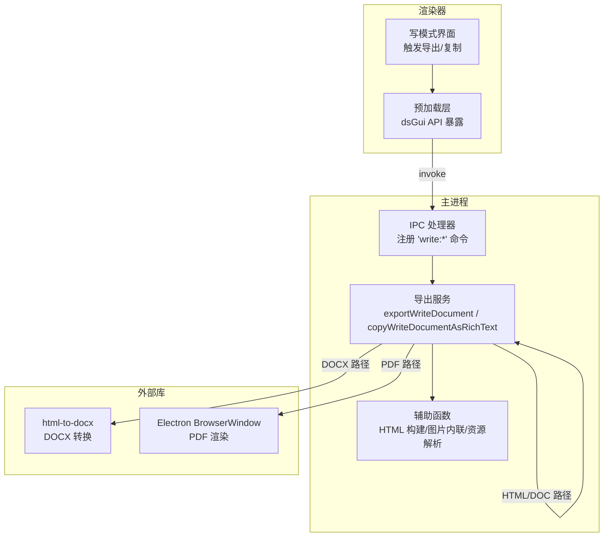
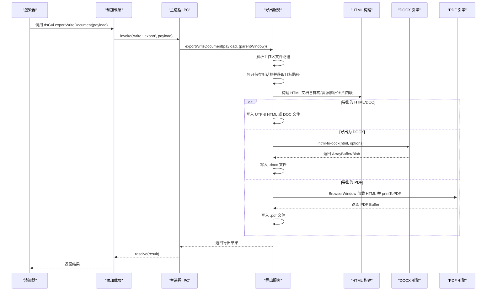
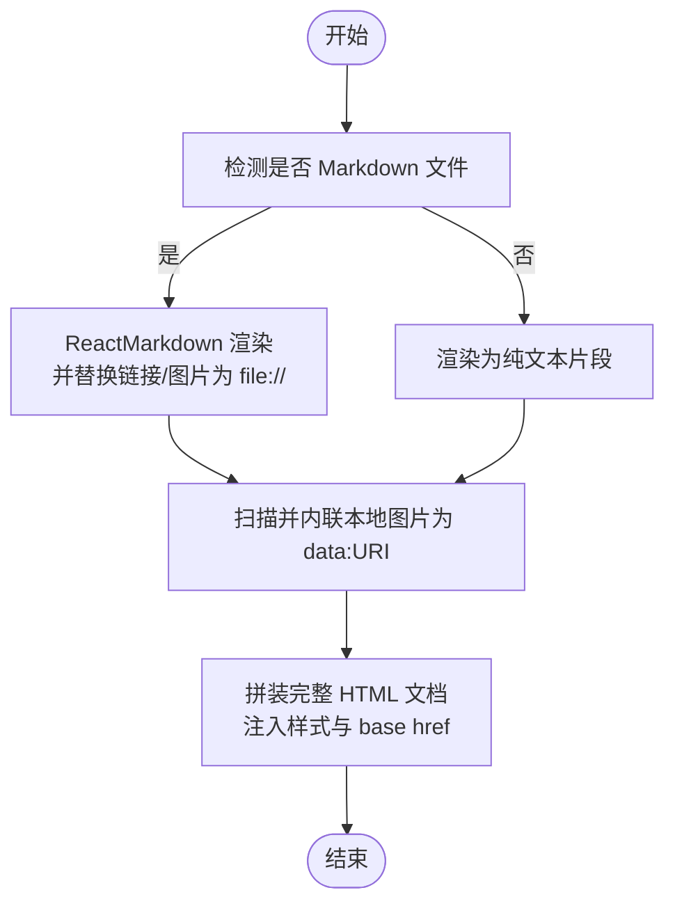
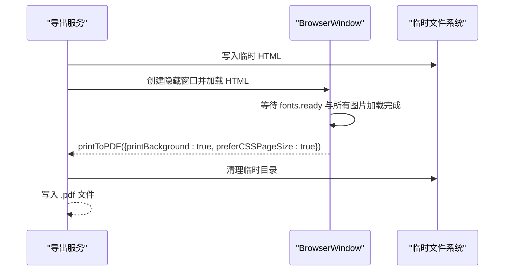
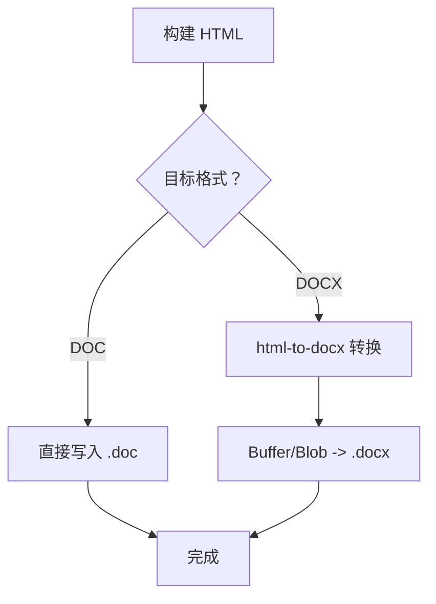
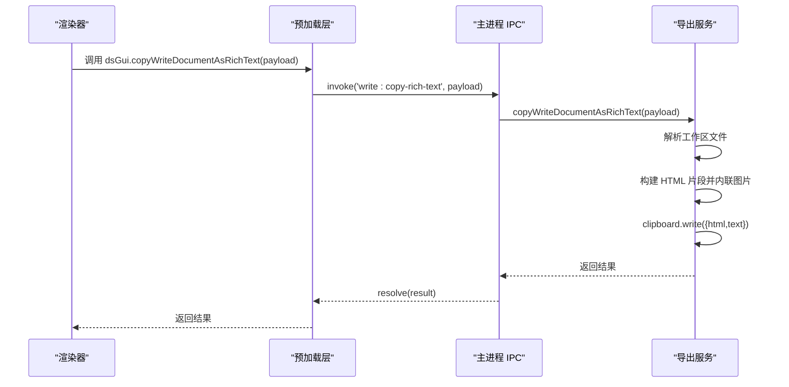
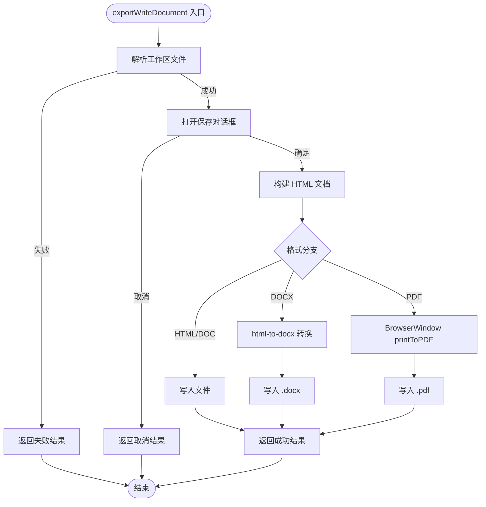
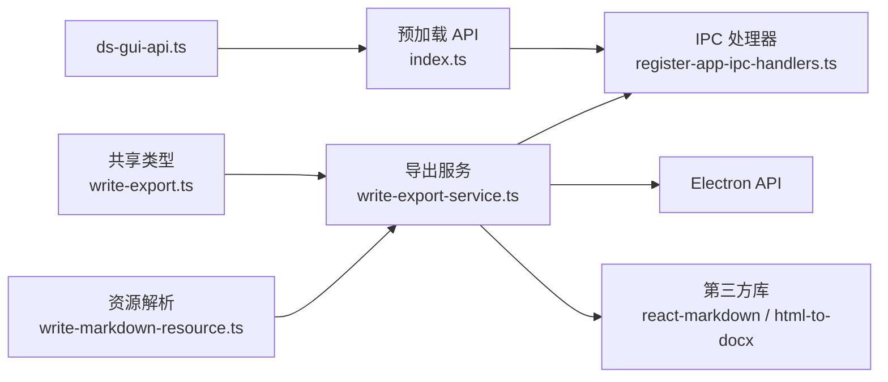

# 文档导出功能

<cite>
**本文引用的文件**
- [write-export.ts](file://src/shared/write-export.ts)
- [write-export-service.ts](file://src/main/services/write-export-service.ts)
- [write-export-service.test.ts](file://src/main/services/write-export-service.test.ts)
- [write-markdown-resource.ts](file://src/shared/write-markdown-resource.ts)
- [register-app-ipc-handlers.ts](file://src/main/ipc/register-app-ipc-handlers.ts)
- [index.ts](file://src/preload/index.ts)
- [ds-gui-api.ts](file://src/shared/ds-gui-api.ts)
</cite>

## 目录
1. [简介](#简介)
2. [项目结构](#项目结构)
3. [核心组件](#核心组件)
4. [架构总览](#架构总览)
5. [详细组件分析](#详细组件分析)
6. [依赖关系分析](#依赖关系分析)
7. [性能考虑](#性能考虑)
8. [故障排除指南](#故障排除指南)
9. [结论](#结论)
10. [附录](#附录)

## 简介
本文件面向 Write 模式文档导出功能，系统性阐述 HTML、PDF、DOC、DOCX 四种格式的实现原理与转换流程；详解 PDF 导出的排版引擎、样式处理与页眉页脚设置；解析 DOC/DOCX 导出的结构化处理、格式保持与兼容性保障；并从架构层面说明导出服务的调用链路、异步处理、进度跟踪与错误恢复机制。同时提供导出配置项、性能优化建议与常见问题解决方案。

## 项目结构
导出功能由三部分协同完成：
- 共享类型定义：统一导出格式、载荷与结果的数据契约
- 主进程服务：负责渲染 HTML、调用外部库进行 PDF/DOCX 转换、保存文件与剪贴板富文本复制
- 渲染器桥接：通过 IPC 将用户操作转发至主进程并接收结果

图表来源
- [register-app-ipc-handlers.ts:696-706](file://src/main/ipc/register-app-ipc-handlers.ts#L696-L706)
- [write-export-service.ts:510-575](file://src/main/services/write-export-service.ts#L510-L575)
- [index.ts:79-82](file://src/preload/index.ts#L79-L82)

章节来源
- [write-export.ts:1-45](file://src/shared/write-export.ts#L1-L45)
- [write-export-service.ts:1-575](file://src/main/services/write-export-service.ts#L1-L575)
- [register-app-ipc-handlers.ts:696-706](file://src/main/ipc/register-app-ipc-handlers.ts#L696-L706)
- [index.ts:79-82](file://src/preload/index.ts#L79-L82)

## 核心组件
- 数据契约（共享）
  - 支持的导出格式集合与类型别名
  - 导出载荷（路径、工作区根、格式、内容）与结果（成功/取消/失败）
  - 富剪贴板载荷与结果
- 导出服务（主进程）
  - 导出入口：根据格式选择不同转换路径
  - HTML 构建：Markdown 渲染、资源解析、本地图片内联、样式注入
  - PDF 转换：基于隐藏窗口加载 HTML 并打印为 PDF
  - DOC/DOCX 转换：DOC 直写 HTML，DOCX 使用 html-to-docx 库
  - 剪贴板复制：生成富文本 HTML 与纯文本并写入剪贴板
- IPC 与 API
  - 主进程注册 'write:export' 与 'write:copy-rich-text'
  - 预加载层暴露 dsGui.exportWriteDocument / copyWriteDocumentAsRichText
  - 渲染器通过 invoke 触发并等待结果

章节来源
- [write-export.ts:1-45](file://src/shared/write-export.ts#L1-L45)
- [write-export-service.ts:510-575](file://src/main/services/write-export-service.ts#L510-L575)
- [register-app-ipc-handlers.ts:696-706](file://src/main/ipc/register-app-handlers.ts#L696-L706)
- [index.ts:79-82](file://src/preload/index.ts#L79-L82)
- [ds-gui-api.ts:184-187](file://src/shared/ds-gui-api.ts#L184-L187)

## 架构总览
导出流程的关键控制流如下：

图表来源
- [register-app-ipc-handlers.ts:696-706](file://src/main/ipc/register-app-ipc-handlers.ts#L696-L706)
- [write-export-service.ts:510-575](file://src/main/services/write-export-service.ts#L510-L575)
- [index.ts:79-82](file://src/preload/index.ts#L79-L82)

## 详细组件分析

### 数据契约与类型安全
- 导出格式枚举与类型别名确保格式输入受控
- 导出载荷包含路径、可选工作区根、格式与内容
- 结果类型区分成功（含导出时间）、取消（用户取消）与失败（错误信息）

章节来源
- [write-export.ts:1-45](file://src/shared/write-export.ts#L1-L45)

### HTML 构建与资源解析
- Markdown 渲染：使用 ReactMarkdown 与 GFM 插件，自定义链接与图片组件以解析相对资源
- 资源解析：将相对路径解析为 file:// URL，避免浏览器环境下的跨域与路径问题
- 本地图片内联：识别 HTML 中的本地 file:// 图片，读取并转为 data:URI，确保离线可展示
- 样式注入：内置 EXPORT_CSS 控制排版、字号、颜色、表格与代码块等元素表现
- Word 兼容：当导出为 DOC 时附加 Office 命名空间属性，提升兼容性

图表来源
- [write-export-service.ts:356-404](file://src/main/services/write-export-service.ts#L356-L404)
- [write-markdown-resource.ts:49-74](file://src/shared/write-markdown-resource.ts#L49-L74)

章节来源
- [write-export-service.ts:356-404](file://src/main/services/write-export-service.ts#L356-L404)
- [write-markdown-resource.ts:49-74](file://src/shared/write-markdown-resource.ts#L49-L74)

### PDF 导出：排版引擎、样式与页眉页脚
- 排版引擎：使用 Electron BrowserWindow 的隐藏窗口加载 HTML，并在字体与图片资源加载完成后执行 printToPDF
- 样式处理：通过 EXPORT_CSS 提供统一的排版样式；printBackground 启用背景色；preferCSSPageSize 优先使用 CSS 指定页面尺寸
- 页眉页脚：当前实现未提供页眉页脚参数化配置，如需扩展可在 printToPDF 参数中增加 headerTemplate/footerTemplate

图表来源
- [write-export-service.ts:453-493](file://src/main/services/write-export-service.ts#L453-L493)

章节来源
- [write-export-service.ts:453-493](file://src/main/services/write-export-service.ts#L453-L493)

### DOC/DOCX 导出：结构化处理与兼容性
- DOC 直写 HTML：将构建好的 HTML 直接保存为 .doc 文件，适合基础兼容场景
- DOCX 转换：使用 html-to-docx 库，传入标题、作者、关键词、描述、字体与字号等文档元数据，返回 ArrayBuffer/Blob 并写入 .docx
- Word 兼容：导出为 DOC 时附加 Office 命名空间，提升 Microsoft Word 打开体验

图表来源
- [write-export-service.ts:545-559](file://src/main/services/write-export-service.ts#L545-L559)

章节来源
- [write-export-service.ts:545-559](file://src/main/services/write-export-service.ts#L545-L559)

### 富文本复制到剪贴板
- 功能：将当前文档内容以富文本 HTML 与纯文本形式写入系统剪贴板
- 流程：解析工作区文件、构建 HTML 片段、内联本地图片、写入剪贴板并返回结果

图表来源
- [register-app-ipc-handlers.ts:702-706](file://src/main/ipc/register-app-ipc-handlers.ts#L702-L706)
- [write-export-service.ts:406-441](file://src/main/services/write-export-service.ts#L406-L441)
- [index.ts:81-82](file://src/preload/index.ts#L81-L82)

章节来源
- [write-export-service.ts:406-441](file://src/main/services/write-export-service.ts#L406-L441)
- [register-app-ipc-handlers.ts:702-706](file://src/main/ipc/register-app-ipc-handlers.ts#L702-L706)
- [index.ts:81-82](file://src/preload/index.ts#L81-L82)

### 导出服务架构与错误处理
- 调用链：IPC -> 导出服务 -> HTML 构建/图片内联/资源解析 -> 格式特定转换 -> 文件写入
- 错误处理：对工作区解析失败、用户取消、转换异常等情况分别返回不同结果对象
- 进度跟踪：当前实现为同步阻塞流程，无显式进度回调；可通过在转换前后的关键步骤插入事件上报实现

图表来源
- [write-export-service.ts:510-575](file://src/main/services/write-export-service.ts#L510-L575)

章节来源
- [write-export-service.ts:510-575](file://src/main/services/write-export-service.ts#L510-L575)

## 依赖关系分析
- 类型与契约：共享模块提供强类型约束，确保前后端一致
- 导出服务依赖：
  - Electron API：BrowserWindow、dialog、clipboard
  - 第三方库：react-markdown、remark-gfm、html-to-docx
  - 工具函数：路径与资源解析、临时文件管理
- IPC 层：预加载层暴露 dsGui API，主进程注册 handle 处理器

图表来源
- [write-export.ts:1-45](file://src/shared/write-export.ts#L1-L45)
- [write-export-service.ts:1-575](file://src/main/services/write-export-service.ts#L1-L575)
- [write-markdown-resource.ts:1-75](file://src/shared/write-markdown-resource.ts#L1-L75)
- [register-app-ipc-handlers.ts:696-706](file://src/main/ipc/register-app-ipc-handlers.ts#L696-L706)
- [index.ts:79-82](file://src/preload/index.ts#L79-L82)
- [ds-gui-api.ts:184-187](file://src/shared/ds-gui-api.ts#L184-L187)

章节来源
- [write-export.ts:1-45](file://src/shared/write-export.ts#L1-L45)
- [write-export-service.ts:1-575](file://src/main/services/write-export-service.ts#L1-L575)
- [write-markdown-resource.ts:1-75](file://src/shared/write-markdown-resource.ts#L1-L75)
- [register-app-ipc-handlers.ts:696-706](file://src/main/ipc/register-app-ipc-handlers.ts#L696-L706)
- [index.ts:79-82](file://src/preload/index.ts#L79-L82)
- [ds-gui-api.ts:184-187](file://src/shared/ds-gui-api.ts#L184-L187)

## 性能考虑
- HTML 构建与图片内联
  - 对本地图片进行 data:URI 内联会增大 HTML 体积，建议仅在需要离线展示时启用
  - 可按需限制图片最大尺寸或数量，减少内存与 I/O 压力
- PDF 渲染
  - printToPDF 前等待 fonts.ready 与图片加载，避免渲染不完整
  - 大文档建议分页或拆分，降低单次渲染压力
- DOCX 转换
  - html-to-docx 在复杂表格与样式下可能较耗时，建议对超长文档进行分段导出
- 文件写入
  - 使用临时目录与原子写入策略，结合清理逻辑，避免磁盘碎片与残留文件

## 故障排除指南
- 用户取消导出
  - 现象：返回 canceled: true
  - 处理：提示用户重新发起导出
- 工作区文件解析失败
  - 现象：返回 canceled: false 且包含 message
  - 处理：检查路径与工作区根配置，确认文件存在且可访问
- DOCX 转换结果类型不符
  - 现象：抛出类型错误
  - 处理：确保 html-to-docx 返回 ArrayBuffer 或 Blob；必要时添加类型判断与降级处理
- PDF 渲染空白或样式缺失
  - 现象：PDF 缺少背景或排版异常
  - 处理：确认 printBackground 与 preferCSSPageSize 设置；检查样式是否依赖网络资源
- 本地图片未显示
  - 现象：HTML 中图片仍为 file://，未内联
  - 处理：确认图片 MIME 类型解析与读取成功；检查路径是否为本地文件协议

章节来源
- [write-export-service.ts:567-574](file://src/main/services/write-export-service.ts#L567-L574)
- [write-export-service.ts:443-451](file://src/main/services/write-export-service.ts#L443-L451)
- [write-export-service.ts:453-493](file://src/main/services/write-export-service.ts#L453-L493)
- [write-export-service.ts:273-285](file://src/main/services/write-export-service.ts#L273-L285)

## 结论
该导出功能以“HTML 为中心”的多格式转换架构，通过统一的数据契约与清晰的职责划分，实现了对 HTML、PDF、DOC、DOCX 的稳定支持。PDF 采用 Electron 内置渲染能力，DOC/DOCX 则借助成熟的第三方库完成转换。未来可在进度上报、分段导出、页眉页脚参数化等方面进一步增强用户体验与工程化能力。

## 附录

### 导出配置选项
- 目标格式：'html' | 'pdf' | 'doc' | 'docx'
- 内容来源：Markdown 文本或纯文本
- 输出路径：由保存对话框决定，默认文件名基于源文件名与扩展名
- DOCX 文档元数据：标题、作者、关键词、描述、字体与字号
- PDF 行为：启用背景、优先 CSS 页面大小

章节来源
- [write-export.ts:1-45](file://src/shared/write-export.ts#L1-L45)
- [write-export-service.ts:22-36](file://src/main/services/write-export-service.ts#L22-L36)
- [write-export-service.ts:545-559](file://src/main/services/write-export-service.ts#L545-L559)
- [write-export-service.ts:484-487](file://src/main/services/write-export-service.ts#L484-L487)

### 常见问题与建议
- 问：如何添加页眉页脚？
  - 建议：在 printToPDF 参数中增加 headerTemplate/footerTemplate 字段
- 问：如何提升大文档导出性能？
  - 建议：拆分文档、延迟加载图片、分页渲染
- 问：如何保证跨平台字体一致性？
  - 建议：在 PDF 渲染前预加载字体，或在 DOCX 中指定常用字体