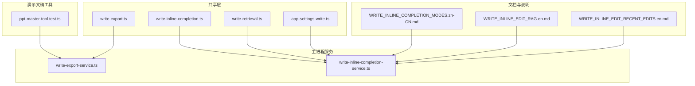
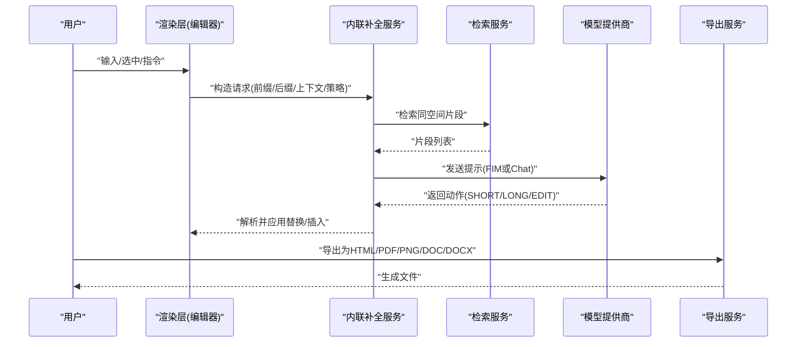
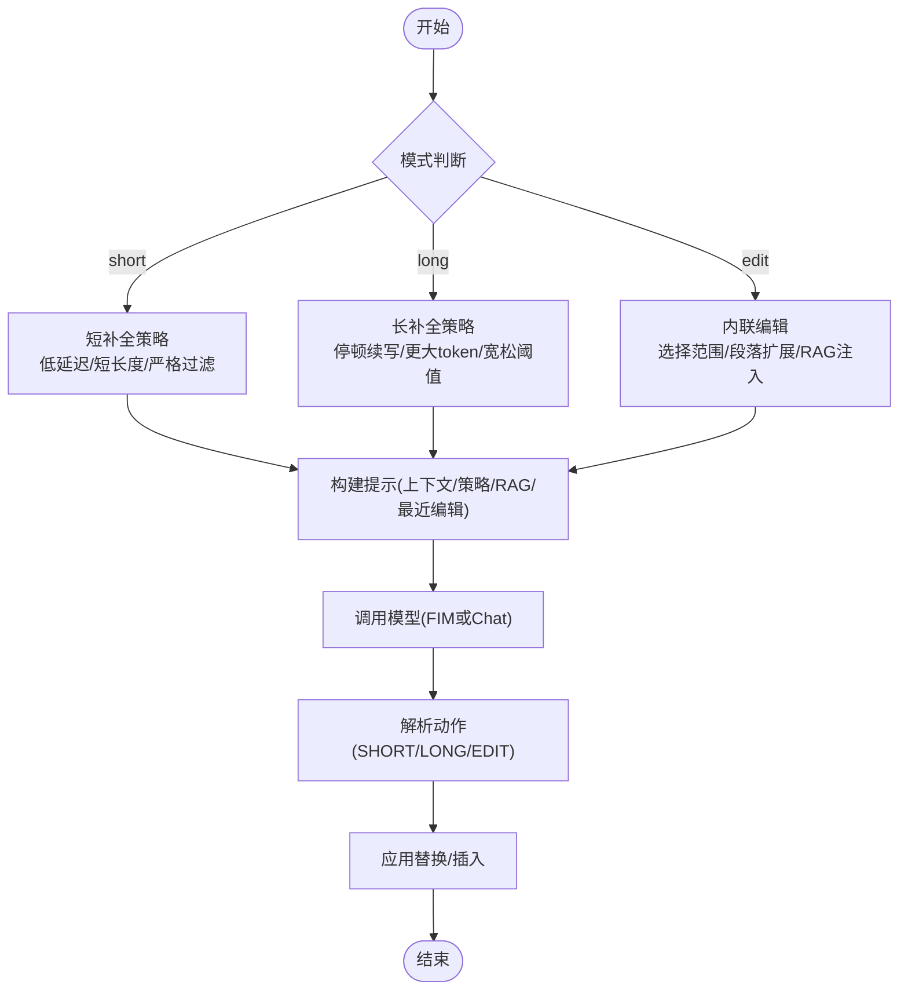
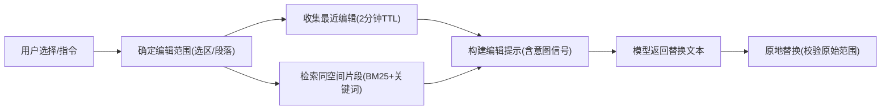
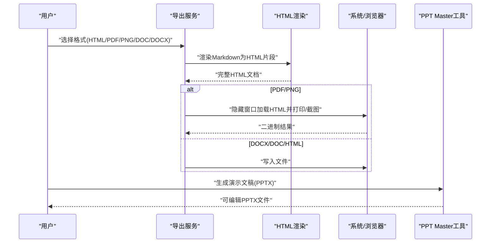
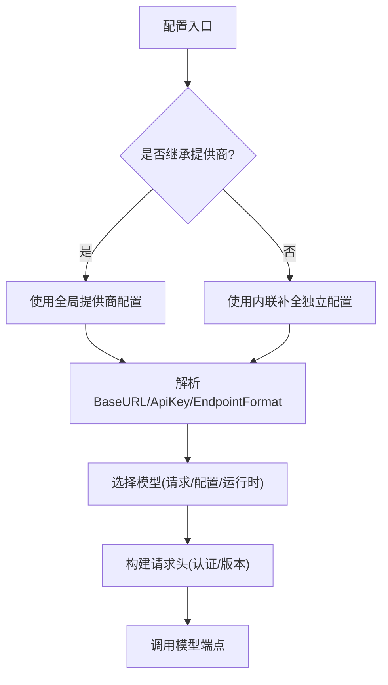
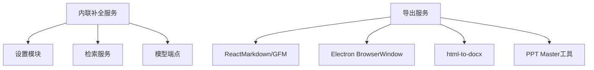

# Write：AI写作与文档交付

<cite>
**本文引用的文件**
- [src/shared/write-export.ts](file://src/shared/write-export.ts)
- [src/main/services/write-export-service.ts](file://src/main/services/write-export-service.ts)
- [src/shared/app-settings-write.ts](file://src/shared/app-settings-write.ts)
- [src/shared/write-inline-completion.ts](file://src/shared/write-inline-completion.ts)
- [src/main/services/write-inline-completion-service.ts](file://src/main/services/write-inline-completion-service.ts)
- [src/shared/write-retrieval.ts](file://src/shared/write-retrieval.ts)
- [docs/WRITE_INLINE_COMPLETION_MODES.zh-CN.md](file://docs/WRITE_INLINE_COMPLETION_MODES.zh-CN.md)
- [docs/WRITE_INLINE_EDIT_RAG.en.md](file://docs/WRITE_INLINE_EDIT_RAG.en.md)
- [docs/WRITE_INLINE_EDIT_RECENT_EDITS.en.md](file://docs/WRITE_INLINE_EDIT_RECENT_EDITS.en.md)
- [kun/src/adapters/tool/ppt-master-tool.test.ts](file://kun/src/adapters/tool/ppt-master-tool.test.ts)
</cite>

## 目录
1. [简介](#简介)
2. [项目结构](#项目结构)
3. [核心组件](#核心组件)
4. [架构总览](#架构总览)
5. [详细组件分析](#详细组件分析)
6. [依赖关系分析](#依赖关系分析)
7. [性能考虑](#性能考虑)
8. [故障排查指南](#故障排查指南)
9. [结论](#结论)
10. [附录](#附录)

## 简介
Write工作区是DeepSeek-GUI中的“AI写作与文档交付”能力集合，覆盖从提纲、草稿到成稿的全流程。它提供：
- AI写作助手：短补全（心流输入）与灵感长补全（停顿续写），以及选中文本的内联编辑。
- 文档润色与资料整理：通过快速动作、RAG检索与最近编辑意图，统一术语、风格与事实一致性。
- 内联补全与编辑：在光标处无缝插入或替换文本，支持多模型端点与代理。
- 多格式导出：HTML、PDF、PNG、DOC、DOCX；演示文稿可通过PPT Master工具生成可编辑PPTX。
- 模型提供商配置：继承或独立设置提供商、API Key、Base URL、模型与端点格式，适配多种后端。

## 项目结构
Write工作区的代码主要分布在以下层次：
- 共享类型与默认值：导出格式、补全请求/结果、检索上下文、设置项等。
- 主进程服务：导出服务、内联补全服务、检索服务等。
- 渲染层与交互：编辑器插件、策略与提示构建、用户选择与指令收集。
- 扩展与工具：PPT Master工具链用于将Markdown内容转换为可编辑PPTX。

**图表来源**
- [src/shared/write-export.ts:1-46](file://src/shared/write-export.ts#L1-L46)
- [src/shared/write-inline-completion.ts:1-109](file://src/shared/write-inline-completion.ts#L1-L109)
- [src/shared/write-retrieval.ts:1-52](file://src/shared/write-retrieval.ts#L1-L52)
- [src/shared/app-settings-write.ts:286-314](file://src/shared/app-settings-write.ts#L286-L314)
- [src/main/services/write-export-service.ts:542-616](file://src/main/services/write-export-service.ts#L542-L616)
- [src/main/services/write-inline-completion-service.ts:333-424](file://src/main/services/write-inline-completion-service.ts#L333-L424)
- [docs/WRITE_INLINE_COMPLETION_MODES.zh-CN.md:18-43](file://docs/WRITE_INLINE_COMPLETION_MODES.zh-CN.md#L18-L43)
- [docs/WRITE_INLINE_EDIT_RAG.en.md:36-65](file://docs/WRITE_INLINE_EDIT_RAG.en.md#L36-L65)
- [docs/WRITE_INLINE_EDIT_RECENT_EDITS.en.md:85-112](file://docs/WRITE_INLINE_EDIT_RECENT_EDITS.en.md#L85-L112)
- [kun/src/adapters/tool/ppt-master-tool.test.ts:103-153](file://kun/src/adapters/tool/ppt-master-tool.test.ts#L103-L153)

**章节来源**
- [src/shared/write-export.ts:1-46](file://src/shared/write-export.ts#L1-L46)
- [src/shared/write-inline-completion.ts:1-109](file://src/shared/write-inline-completion.ts#L1-L109)
- [src/shared/write-retrieval.ts:1-52](file://src/shared/write-retrieval.ts#L1-L52)
- [src/shared/app-settings-write.ts:286-314](file://src/shared/app-settings-write.ts#L286-L314)

## 核心组件
- 导出服务：负责将Markdown或纯文本渲染为HTML片段，并输出为HTML/PDF/PNG/DOC/DOCX；同时支持富文本复制到剪贴板。
- 内联补全服务：根据当前光标上下文、策略与RAG检索结果，调用不同模型端点返回短补全、长补全或内联编辑动作。
- 检索服务：基于BM25+关键词在当前写作空间内召回相关片段，注入到提示中提升术语与事实一致性。
- 设置与配置：管理自动保存、字体排版、内联补全开关、触发延迟、最大token数、是否继承提供商/模型等。
- PPT Master工具：将Markdown导入项目、拆分笔记、导出为可编辑PPTX，受安全边界与审批令牌保护。

**章节来源**
- [src/main/services/write-export-service.ts:542-616](file://src/main/services/write-export-service.ts#L542-L616)
- [src/main/services/write-inline-completion-service.ts:333-424](file://src/main/services/write-inline-completion-service.ts#L333-L424)
- [src/shared/write-retrieval.ts:1-52](file://src/shared/write-retrieval.ts#L1-L52)
- [src/shared/app-settings-write.ts:286-314](file://src/shared/app-settings-write.ts#L286-L314)
- [kun/src/adapters/tool/ppt-master-tool.test.ts:103-153](file://kun/src/adapters/tool/ppt-master-tool.test.ts#L103-L153)

## 架构总览
Write工作区的核心数据流如下：
- 用户在编辑器中输入或选中文本，前端构造请求上下文（前缀、后缀、光标位置、信号、策略）。
- 内联补全服务根据模式（short/long/edit）决定走FIM或Chat Completions，并注入RAG片段与最近编辑意图。
- 模型返回结构化动作（SHORT/LONG/EDIT），服务解析后由前端应用替换或插入。
- 导出服务将内容渲染为HTML片段，再输出为目标格式；演示文稿通过PPT Master工具生成PPTX。

**图表来源**
- [src/main/services/write-inline-completion-service.ts:333-424](file://src/main/services/write-inline-completion-service.ts#L333-L424)
- [src/shared/write-retrieval.ts:1-52](file://src/shared/write-retrieval.ts#L1-L52)
- [src/main/services/write-export-service.ts:542-616](file://src/main/services/write-export-service.ts#L542-L616)

## 详细组件分析

### 内联补全与编辑（短补全、长补全、内联编辑）
- 双模式补全：短补全面向心流输入，低延迟、短小精准；长补全面向停顿续写，允许更完整的下一句或段落。
- 触发条件与参数：短补全使用较短debounce与较小max tokens；长补全更长停顿阈值与更大token预算，且限制行尾/段落边界。
- 提示构建：包含光标上下文、策略、语言、最近编辑与RAG片段；对长补全加入“用户停顿寻求灵感”的隐式注释。
- 动作解析：支持标记块（<<<SHORT/LONG/EDIT>>>）、JSON、XML标签等多种返回形式，并清理协议占位符回声。
- 失败降级：任何环节失败不阻塞输入，静默消失或回退。

**图表来源**
- [docs/WRITE_INLINE_COMPLETION_MODES.zh-CN.md:18-43](file://docs/WRITE_INLINE_COMPLETION_MODES.zh-CN.md#L18-L43)
- [docs/WRITE_INLINE_COMPLETION_MODES.zh-CN.md:62-108](file://docs/WRITE_INLINE_COMPLETION_MODES.zh-CN.md#L62-L108)
- [docs/WRITE_INLINE_COMPLETION_MODES.zh-CN.md:110-168](file://docs/WRITE_INLINE_COMPLETION_MODES.zh-CN.md#L110-L168)
- [src/main/services/write-inline-completion-service.ts:333-424](file://src/main/services/write-inline-completion-service.ts#L333-L424)
- [src/main/services/write-inline-completion-service.ts:650-743](file://src/main/services/write-inline-completion-service.ts#L650-L743)

**章节来源**
- [docs/WRITE_INLINE_COMPLETION_MODES.zh-CN.md:18-43](file://docs/WRITE_INLINE_COMPLETION_MODES.zh-CN.md#L18-L43)
- [docs/WRITE_INLINE_COMPLETION_MODES.zh-CN.md:62-108](file://docs/WRITE_INLINE_COMPLETION_MODES.zh-CN.md#L62-L108)
- [docs/WRITE_INLINE_COMPLETION_MODES.zh-CN.md:110-168](file://docs/WRITE_INLINE_COMPLETION_MODES.zh-CN.md#L110-L168)
- [src/main/services/write-inline-completion-service.ts:333-424](file://src/main/services/write-inline-completion-service.ts#L333-L424)
- [src/main/services/write-inline-completion-service.ts:650-743](file://src/main/services/write-inline-completion-service.ts#L650-L743)

### 资料整理与RAG增强
- BM25+关键词检索：在当前写作空间扫描Markdown/文本文件，按标题、路径、短语命中加权，召回术语、事实与风格片段。
- 检索注入：将片段以“仅参考”的方式注入提示，避免模型直接引用或重复原文。
- 最近编辑意图：记录用户最近删除/插入与指令，帮助理解“继续这样改”“替换相同”等弱指令。
- 术语传播：同一自然段落内同步大小写/重命名，保证一致性。

**图表来源**
- [docs/WRITE_INLINE_EDIT_RAG.en.md:36-65](file://docs/WRITE_INLINE_EDIT_RAG.en.md#L36-L65)
- [docs/WRITE_INLINE_EDIT_RECENT_EDITS.en.md:85-112](file://docs/WRITE_INLINE_EDIT_RECENT_EDITS.en.md#L85-L112)
- [src/shared/write-retrieval.ts:1-52](file://src/shared/write-retrieval.ts#L1-L52)

**章节来源**
- [docs/WRITE_INLINE_EDIT_RAG.en.md:36-65](file://docs/WRITE_INLINE_EDIT_RAG.en.md#L36-L65)
- [docs/WRITE_INLINE_EDIT_RECENT_EDITS.en.md:85-112](file://docs/WRITE_INLINE_EDIT_RECENT_EDITS.en.md#L85-L112)
- [src/shared/write-retrieval.ts:1-52](file://src/shared/write-retrieval.ts#L1-L52)

### 多格式导出与演示文稿生成
- 支持的导出格式：HTML、PDF、PNG、DOC、DOCX；富文本复制支持粘贴到Word等应用。
- 渲染管线：Markdown→ReactMarkdown→HTML片段→完整HTML文档→目标格式；本地图片可内嵌为data URI。
- PDF/PNG：通过隐藏BrowserWindow加载HTML并打印或截图，确保样式与字体正确渲染。
- DOCX：使用html-to-docx转换，附带文档元信息（标题、作者、关键词、描述）。
- 演示文稿：通过PPT Master工具将Markdown导入项目、拆分笔记、导出为可编辑PPTX，路径与安全边界受控。

**图表来源**
- [src/main/services/write-export-service.ts:542-616](file://src/main/services/write-export-service.ts#L542-L616)
- [src/main/services/write-export-service.ts:462-516](file://src/main/services/write-export-service.ts#L462-L516)
- [kun/src/adapters/tool/ppt-master-tool.test.ts:103-153](file://kun/src/adapters/tool/ppt-master-tool.test.ts#L103-L153)

**章节来源**
- [src/shared/write-export.ts:1-46](file://src/shared/write-export.ts#L1-L46)
- [src/main/services/write-export-service.ts:542-616](file://src/main/services/write-export-service.ts#L542-L616)
- [src/main/services/write-export-service.ts:462-516](file://src/main/services/write-export-service.ts#L462-L516)
- [kun/src/adapters/tool/ppt-master-tool.test.ts:103-153](file://kun/src/adapters/tool/ppt-master-tool.test.ts#L103-L153)

### 模型提供商配置与使用
- 继承或独立设置：可继承全局提供商或为内联补全单独指定providerId、apiKey、baseUrl与model。
- 端点格式：支持chat_completions、responses、messages及自定义格式；DeepSeek专用端点自动识别。
- 模型选择：优先使用显式请求模型，其次配置模型，最后回退到运行时模型或默认模型。
- 头部与认证：根据端点格式添加Authorization、Anthropic版本头等；支持Codex Responses Lite头。
- 思考模式：针对特定模型（如deepseek-v4系列）禁用thinking以提升响应速度。

**图表来源**
- [src/shared/app-settings-write.ts:392-442](file://src/shared/app-settings-write.ts#L392-L442)
- [src/main/services/write-inline-completion-service.ts:432-509](file://src/main/services/write-inline-completion-service.ts#L432-L509)
- [src/main/services/write-inline-completion-service.ts:527-592](file://src/main/services/write-inline-completion-service.ts#L527-L592)

**章节来源**
- [src/shared/app-settings-write.ts:392-442](file://src/shared/app-settings-write.ts#L392-L442)
- [src/main/services/write-inline-completion-service.ts:432-509](file://src/main/services/write-inline-completion-service.ts#L432-L509)
- [src/main/services/write-inline-completion-service.ts:527-592](file://src/main/services/write-inline-completion-service.ts#L527-L592)

## 依赖关系分析
- 内联补全服务依赖：
  - 设置模块：解析提供商、模型、端点格式、密钥与基础URL。
  - 检索服务：获取同空间片段，注入提示。
  - 模型端点：兼容OpenAI、Anthropic、Responses等格式。
- 导出服务依赖：
  - ReactMarkdown与GFM：渲染Markdown为HTML。
  - Electron BrowserWindow：PDF/PNG渲染。
  - html-to-docx：DOCX转换。
  - PPT Master工具：演示文稿生成。

**图表来源**
- [src/main/services/write-inline-completion-service.ts:333-424](file://src/main/services/write-inline-completion-service.ts#L333-L424)
- [src/main/services/write-export-service.ts:542-616](file://src/main/services/write-export-service.ts#L542-L616)
- [kun/src/adapters/tool/ppt-master-tool.test.ts:103-153](file://kun/src/adapters/tool/ppt-master-tool.test.ts#L103-L153)

**章节来源**
- [src/main/services/write-inline-completion-service.ts:333-424](file://src/main/services/write-inline-completion-service.ts#L333-L424)
- [src/main/services/write-export-service.ts:542-616](file://src/main/services/write-export-service.ts#L542-L616)
- [kun/src/adapters/tool/ppt-master-tool.test.ts:103-153](file://kun/src/adapters/tool/ppt-master-tool.test.ts#L103-L153)

## 性能考虑
- 短补全低延迟：较短debounce与较小max tokens，减少网络与处理开销。
- 长补全谨慎触发：仅在行尾/段落边界且达到更高信号量时触发，避免打断输入。
- RAG片段数量控制：短补全注入较少片段，长补全适度增加，平衡上下文与延迟。
- 本地过滤与质量评分：对候选进行长度、重复、句边界与泛化惩罚，降低无效显示。
- 失败降级：API或检索失败时静默消失，不影响编辑器输入流畅性。

[本节为通用指导，无需具体文件来源]

## 故障排查指南
- 检查提供商配置：确认inheritProvider/inheritModel、providerId、apiKey、baseUrl是否正确。
- 查看调试日志：内联补全服务维护最近调试条目，可查看prompt、rawResponse、completion/action、错误消息。
- 验证RAG检索：确认检索源、关键词、片段数量与索引文件/分片数。
- 导出问题：确认HTML渲染成功、隐藏窗口加载完成、文件写入权限与路径合法性。
- PPTX生成：确认项目路径在受管目录、输出路径合法、审批令牌有效、脚本执行成功。

**章节来源**
- [src/main/services/write-inline-completion-service.ts:94-123](file://src/main/services/write-inline-completion-service.ts#L94-L123)
- [docs/WRITE_INLINE_EDIT_RECENT_EDITS.en.md:113-139](file://docs/WRITE_INLINE_EDIT_RECENT_EDITS.en.md#L113-L139)
- [src/main/services/write-export-service.ts:542-616](file://src/main/services/write-export-service.ts#L542-L616)
- [kun/src/adapters/tool/ppt-master-tool.test.ts:156-200](file://kun/src/adapters/tool/ppt-master-tool.test.ts#L156-L200)

## 结论
Write工作区通过“双模式补全+内联编辑+RAG增强+多格式导出”的组合，覆盖了从构思到交付的完整写作流程。其设计强调“不抢笔”的用户体验，兼顾心流输入与停顿续写，并通过严格的失败降级与调试能力保障稳定性。结合PPT Master工具，用户可将Markdown内容高效转化为可编辑演示文稿，满足技术文档、报告与演示等多场景需求。

[本节为总结，无需具体文件来源]

## 附录
- 写作工作流程最佳实践
  - 从提纲开始：先列出大纲，再逐节展开；利用长补全在段落边界续写。
  - 草稿阶段：开启短补全保持流畅，必要时切换长补全获得灵感。
  - 资料整理：启用RAG检索，统一术语与事实；使用最近编辑意图强化一致性。
  - 内联编辑：选中关键段落，给出明确指令（如“统一术语”“调整语气”），让模型原地替换。
  - 导出与分享：优先HTML预览，再按需导出PDF/DOCX；演示文稿通过PPT Master生成。
- 效率提升技巧
  - 合理设置debounce与max tokens，平衡速度与质量。
  - 使用快速动作（润色、解释、重构、提炼、更强/更安静、批评）提升修改效率。
  - 利用字体预设与排版设置改善阅读体验。
  - 定期清理调试日志，聚焦关键问题。

[本节为通用指导，无需具体文件来源]