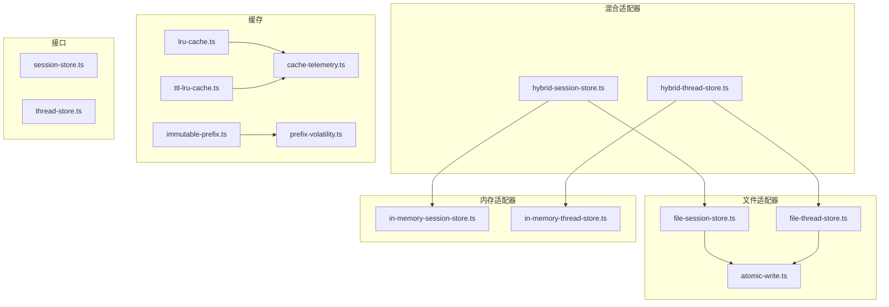
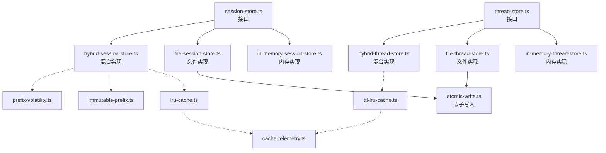
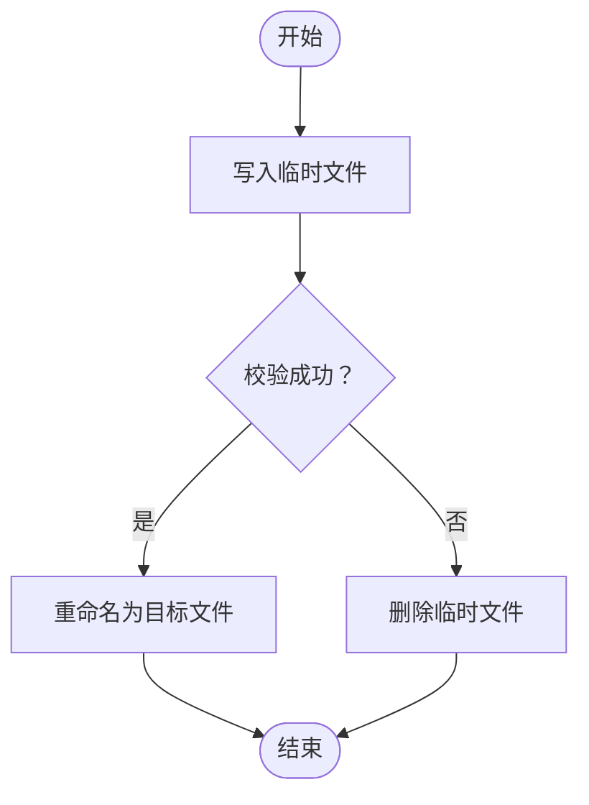
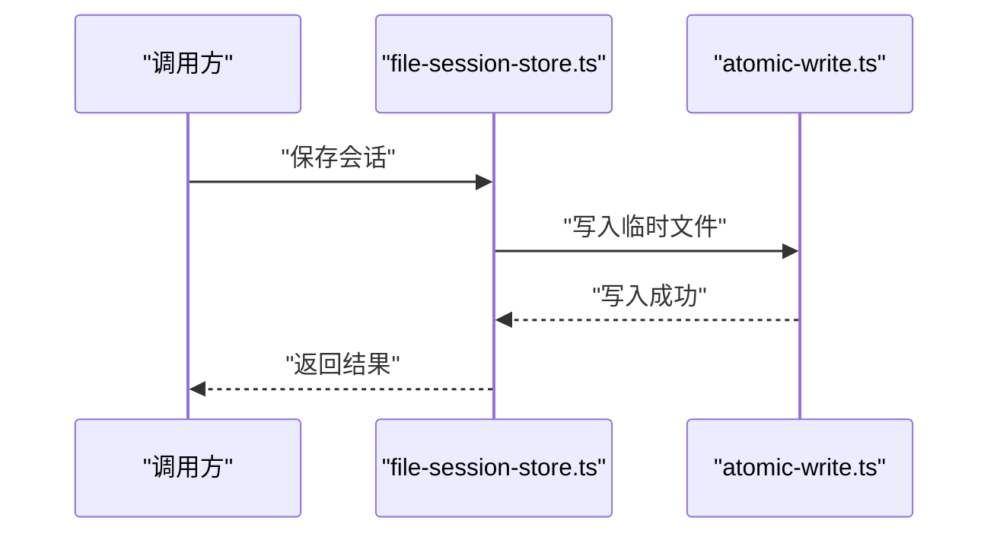
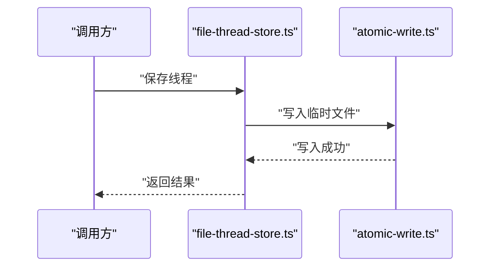
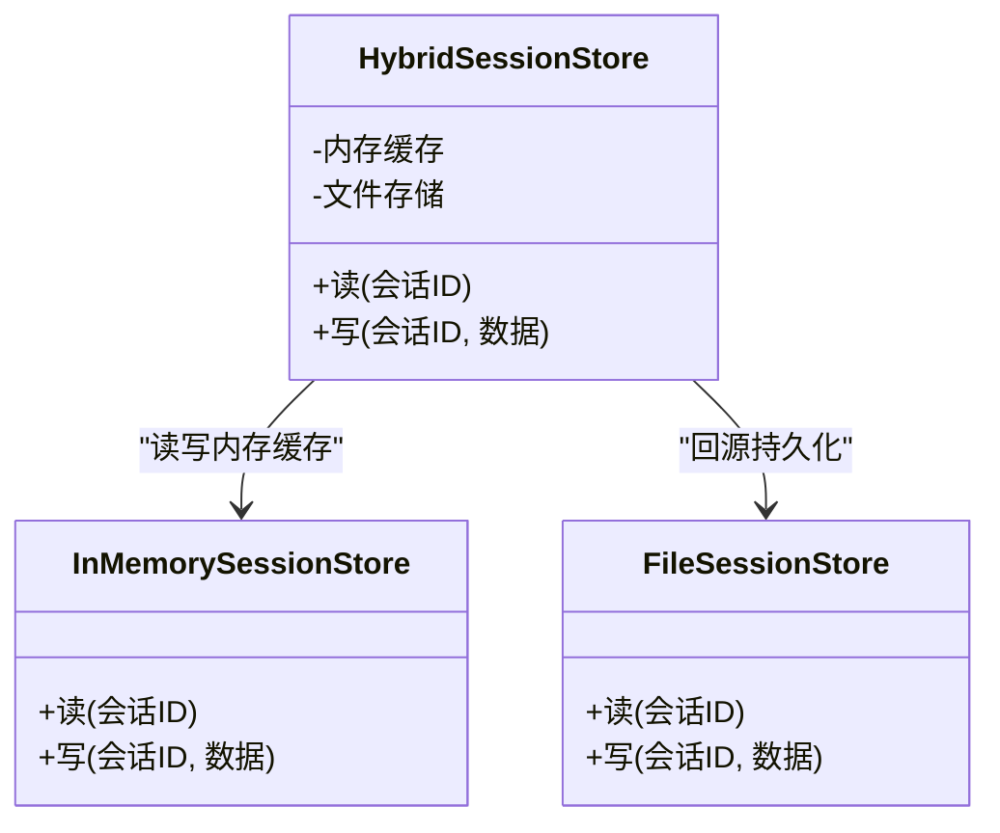
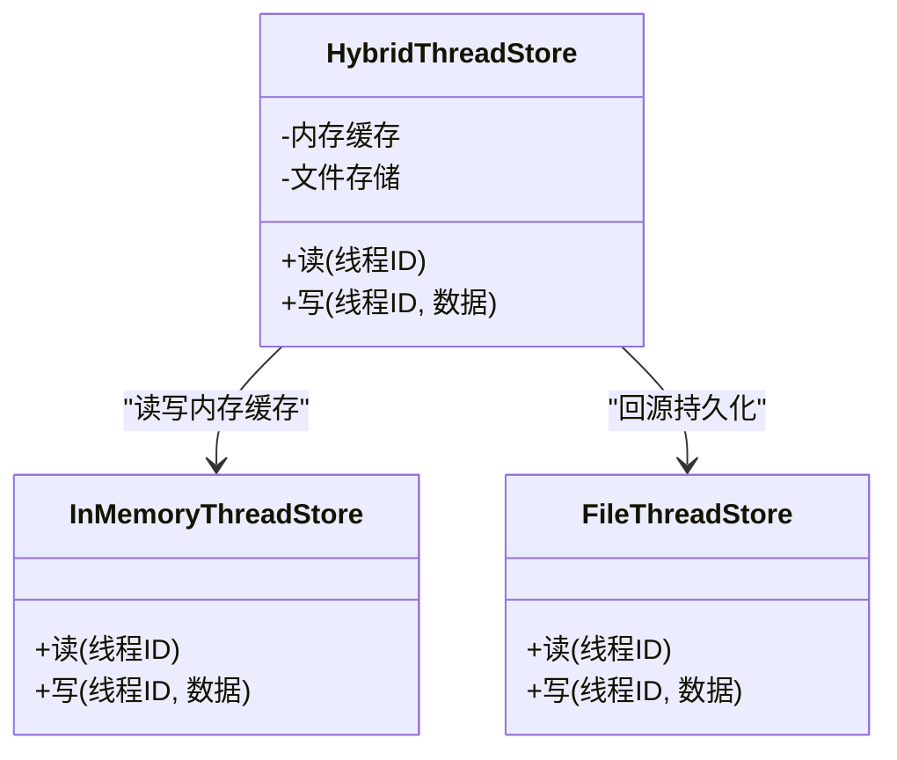
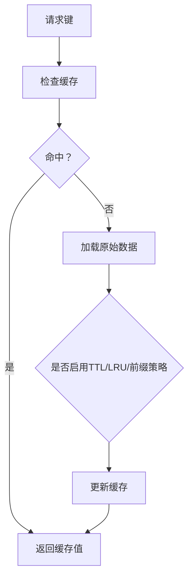
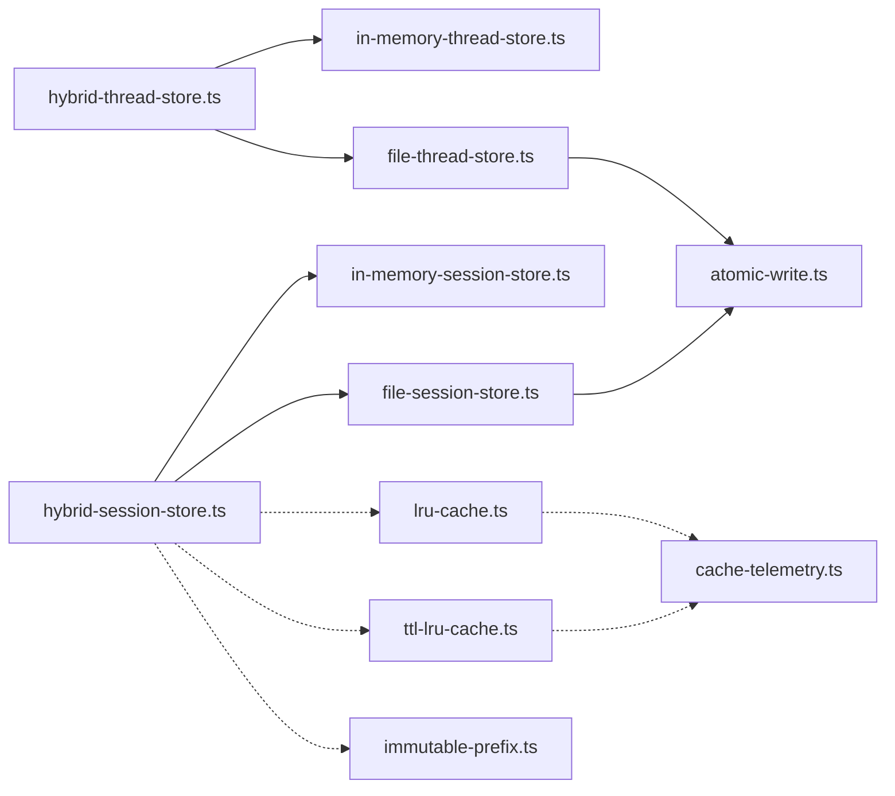

# 存储适配器

<cite>
**本文引用的文件**
- [atomic-write.ts](file://kun/src/adapters/file/atomic-write.ts)
- [file-session-store.ts](file://kun/src/adapters/file/file-session-store.ts)
- [file-thread-store.ts](file://kun/src/adapters/file/file-thread-store.ts)
- [hybrid-session-store.ts](file://kun/src/adapters/hybrid/hybrid-session-store.ts)
- [hybrid-thread-store.ts](file://kun/src/adapters/hybrid/hybrid-thread-store.ts)
- [in-memory-session-store.ts](file://kun/src/adapters/in-memory-session-store.ts)
- [in-memory-thread-store.ts](file://kun/src/adapters/in-memory-thread-store.ts)
- [session-store.ts](file://kun/src/ports/session-store.ts)
- [thread-store.ts](file://kun/src/ports/thread-store.ts)
- [lru-cache.ts](file://kun/src/cache/lru-cache.ts)
- [ttl-lru-cache.ts](file://kun/src/cache/ttl-lru-cache.ts)
- [immutable-prefix.ts](file://kun/src/cache/immutable-prefix.ts)
- [prefix-volatility.ts](file://kun/src/cache/prefix-volatility.ts)
- [cache-telemetry.ts](file://kun/src/telemetry/cache-telemetry.ts)
- [file-session-store.test.ts](file://kun/tests/file-session-store.test.ts)
- [hybrid-store.test.ts](file://kun/tests/hybrid-store.test.ts)
- [cache.test.ts](file://kun/tests/cache.test.ts)
</cite>

## 目录
1. [简介](#简介)
2. [项目结构](#项目结构)
3. [核心组件](#核心组件)
4. [架构总览](#架构总览)
5. [详细组件分析](#详细组件分析)
6. [依赖关系分析](#依赖关系分析)
7. [性能考量](#性能考量)
8. [故障排查指南](#故障排查指南)
9. [结论](#结论)
10. [附录](#附录)

## 简介
本文件面向 DeepSeek GUI 的存储适配器系统，系统性阐述文件存储适配器、混合存储适配器与内存存储适配器的实现原理与使用场景；详解文件原子写入、会话存储、线程存储等能力；深入解析 LRU 缓存、TTL LRU 缓存与不可变前缀缓存的实现与配置；明确存储适配器接口规范、数据一致性保障与性能优化策略，并为开发者提供选择与扩展指导。

## 项目结构
存储相关代码主要分布在以下模块：
- 文件适配器：提供基于文件系统的持久化存储，包含原子写入与会话/线程存储实现
- 混合适配器：在内存与持久化之间进行协同，兼顾性能与可靠性
- 内存适配器：提供纯内存的临时存储，适合快速读写与测试
- 缓存层：提供多种缓存策略，支撑高性能数据访问
- 接口定义：通过端口定义统一的会话与线程存储契约

图表来源
- [atomic-write.ts:1-200](file://kun/src/adapters/file/atomic-write.ts#L1-L200)
- [file-session-store.ts:1-200](file://kun/src/adapters/file/file-session-store.ts#L1-L200)
- [file-thread-store.ts:1-200](file://kun/src/adapters/file/file-thread-store.ts#L1-L200)
- [hybrid-session-store.ts:1-200](file://kun/src/adapters/hybrid/hybrid-session-store.ts#L1-L200)
- [hybrid-thread-store.ts:1-200](file://kun/src/adapters/hybrid/hybrid-thread-store.ts#L1-L200)
- [in-memory-session-store.ts:1-200](file://kun/src/adapters/in-memory-session-store.ts#L1-L200)
- [in-memory-thread-store.ts:1-200](file://kun/src/adapters/in-memory-thread-store.ts#L1-L200)
- [lru-cache.ts:1-200](file://kun/src/cache/lru-cache.ts#L1-L200)
- [ttl-lru-cache.ts:1-200](file://kun/src/cache/ttl-lru-cache.ts#L1-L200)
- [immutable-prefix.ts:1-200](file://kun/src/cache/immutable-prefix.ts#L1-L200)
- [prefix-volatility.ts:1-200](file://kun/src/cache/prefix-volatility.ts#L1-L200)
- [cache-telemetry.ts:1-200](file://kun/src/telemetry/cache-telemetry.ts#L1-L200)
- [session-store.ts:1-200](file://kun/src/ports/session-store.ts#L1-L200)
- [thread-store.ts:1-200](file://kun/src/ports/thread-store.ts#L1-L200)

章节来源
- [atomic-write.ts:1-200](file://kun/src/adapters/file/atomic-write.ts#L1-L200)
- [file-session-store.ts:1-200](file://kun/src/adapters/file/file-session-store.ts#L1-L200)
- [file-thread-store.ts:1-200](file://kun/src/adapters/file/file-thread-store.ts#L1-L200)
- [hybrid-session-store.ts:1-200](file://kun/src/adapters/hybrid/hybrid-session-store.ts#L1-L200)
- [hybrid-thread-store.ts:1-200](file://kun/src/adapters/hybrid/hybrid-thread-store.ts#L1-L200)
- [in-memory-session-store.ts:1-200](file://kun/src/adapters/in-memory-session-store.ts#L1-L200)
- [in-memory-thread-store.ts:1-200](file://kun/src/adapters/in-memory-thread-store.ts#L1-L200)
- [lru-cache.ts:1-200](file://kun/src/cache/lru-cache.ts#L1-L200)
- [ttl-lru-cache.ts:1-200](file://kun/src/cache/ttl-lru-cache.ts#L1-L200)
- [immutable-prefix.ts:1-200](file://kun/src/cache/immutable-prefix.ts#L1-L200)
- [prefix-volatility.ts:1-200](file://kun/src/cache/prefix-volatility.ts#L1-L200)
- [cache-telemetry.ts:1-200](file://kun/src/telemetry/cache-telemetry.ts#L1-L200)
- [session-store.ts:1-200](file://kun/src/ports/session-store.ts#L1-L200)
- [thread-store.ts:1-200](file://kun/src/ports/thread-store.ts#L1-L200)

## 核心组件
- 文件原子写入：确保写入过程的完整性与一致性，避免部分写入导致的数据损坏
- 文件会话存储与线程存储：基于文件系统的持久化存储，支持会话与线程数据的读写与恢复
- 混合会话存储与线程存储：在内存与文件之间协调，优先读取内存以提升性能，同时保持持久化备份
- 内存会话存储与线程存储：提供纯内存的临时存储，适合快速读写与测试场景
- 缓存体系：LRU、TTL LRU、不可变前缀缓存，配合遥测指标，支撑高并发下的高效访问

章节来源
- [atomic-write.ts:1-200](file://kun/src/adapters/file/atomic-write.ts#L1-L200)
- [file-session-store.ts:1-200](file://kun/src/adapters/file/file-session-store.ts#L1-L200)
- [file-thread-store.ts:1-200](file://kun/src/adapters/file/file-thread-store.ts#L1-L200)
- [hybrid-session-store.ts:1-200](file://kun/src/adapters/hybrid/hybrid-session-store.ts#L1-L200)
- [hybrid-thread-store.ts:1-200](file://kun/src/adapters/hybrid/hybrid-thread-store.ts#L1-L200)
- [in-memory-session-store.ts:1-200](file://kun/src/adapters/in-memory-session-store.ts#L1-L200)
- [in-memory-thread-store.ts:1-200](file://kun/src/adapters/in-memory-thread-store.ts#L1-L200)
- [lru-cache.ts:1-200](file://kun/src/cache/lru-cache.ts#L1-L200)
- [ttl-lru-cache.ts:1-200](file://kun/src/cache/ttl-lru-cache.ts#L1-L200)
- [immutable-prefix.ts:1-200](file://kun/src/cache/immutable-prefix.ts#L1-L200)
- [prefix-volatility.ts:1-200](file://kun/src/cache/prefix-volatility.ts#L1-L200)
- [cache-telemetry.ts:1-200](file://kun/src/telemetry/cache-telemetry.ts#L1-L200)

## 架构总览
存储适配器采用“接口契约 + 多实现”的分层设计：
- 接口层：定义会话与线程存储的标准操作
- 实现层：文件实现、混合实现、内存实现
- 缓存层：在读路径上提供多级缓存加速
- 原子写入：在写路径上保证持久化一致性

图表来源
- [session-store.ts:1-200](file://kun/src/ports/session-store.ts#L1-L200)
- [thread-store.ts:1-200](file://kun/src/ports/thread-store.ts#L1-L200)
- [in-memory-session-store.ts:1-200](file://kun/src/adapters/in-memory-session-store.ts#L1-L200)
- [file-session-store.ts:1-200](file://kun/src/adapters/file/file-session-store.ts#L1-L200)
- [hybrid-session-store.ts:1-200](file://kun/src/adapters/hybrid/hybrid-session-store.ts#L1-L200)
- [in-memory-thread-store.ts:1-200](file://kun/src/adapters/in-memory-thread-store.ts#L1-L200)
- [file-thread-store.ts:1-200](file://kun/src/adapters/file/file-thread-store.ts#L1-L200)
- [hybrid-thread-store.ts:1-200](file://kun/src/adapters/hybrid/hybrid-thread-store.ts#L1-L200)
- [atomic-write.ts:1-200](file://kun/src/adapters/file/atomic-write.ts#L1-L200)
- [lru-cache.ts:1-200](file://kun/src/cache/lru-cache.ts#L1-L200)
- [ttl-lru-cache.ts:1-200](file://kun/src/cache/ttl-lru-cache.ts#L1-L200)
- [immutable-prefix.ts:1-200](file://kun/src/cache/immutable-prefix.ts#L1-L200)
- [prefix-volatility.ts:1-200](file://kun/src/cache/prefix-volatility.ts#L1-L200)
- [cache-telemetry.ts:1-200](file://kun/src/telemetry/cache-telemetry.ts#L1-L200)

## 详细组件分析

### 文件原子写入
- 设计目标：在写入过程中避免部分写入、竞态条件与崩溃中断导致的数据损坏
- 关键机制：先写临时文件，校验后重命名为目标文件；失败时清理临时文件
- 使用场景：所有需要持久化的写入操作均应通过该机制完成，确保一致性

图表来源
- [atomic-write.ts:1-200](file://kun/src/adapters/file/atomic-write.ts#L1-L200)

章节来源
- [atomic-write.ts:1-200](file://kun/src/adapters/file/atomic-write.ts#L1-L200)

### 文件会话存储
- 职责：提供会话级别的持久化存储，支持会话元数据与消息历史的读写
- 一致性：通过原子写入保障写入安全；读取时进行基本的完整性校验
- 性能：小规模数据读写，适合对一致性要求高但吞吐量不敏感的场景

图表来源
- [file-session-store.ts:1-200](file://kun/src/adapters/file/file-session-store.ts#L1-L200)
- [atomic-write.ts:1-200](file://kun/src/adapters/file/atomic-write.ts#L1-L200)

章节来源
- [file-session-store.ts:1-200](file://kun/src/adapters/file/file-session-store.ts#L1-L200)

### 文件线程存储
- 职责：提供线程级别的持久化存储，支持线程上下文与回合历史的读写
- 一致性：同样采用原子写入，确保线程数据的完整性
- 场景：适合需要长期保留线程状态且对可靠性要求高的应用

图表来源
- [file-thread-store.ts:1-200](file://kun/src/adapters/file/file-thread-store.ts#L1-L200)
- [atomic-write.ts:1-200](file://kun/src/adapters/file/atomic-write.ts#L1-L200)

章节来源
- [file-thread-store.ts:1-200](file://kun/src/adapters/file/file-thread-store.ts#L1-L200)

### 混合会话存储
- 设计理念：在内存中缓存热点数据，减少磁盘 IO；落盘时使用原子写入保证持久化安全
- 读路径：优先从内存缓存命中，未命中再回源到文件存储
- 写路径：先更新内存，再异步或同步触发原子写入文件
- 适用场景：高并发、低延迟、强一致性的混合需求

图表来源
- [hybrid-session-store.ts:1-200](file://kun/src/adapters/hybrid/hybrid-session-store.ts#L1-L200)
- [in-memory-session-store.ts:1-200](file://kun/src/adapters/in-memory-session-store.ts#L1-L200)
- [file-session-store.ts:1-200](file://kun/src/adapters/file/file-session-store.ts#L1-L200)

章节来源
- [hybrid-session-store.ts:1-200](file://kun/src/adapters/hybrid/hybrid-session-store.ts#L1-L200)

### 混合线程存储
- 设计理念：与混合会话存储类似，结合内存与文件，兼顾性能与可靠性
- 读路径：内存命中优先，未命中回源文件
- 写路径：内存更新后触发原子写入文件
- 适用场景：需要频繁读写线程上下文且对一致性有要求的应用

图表来源
- [hybrid-thread-store.ts:1-200](file://kun/src/adapters/hybrid/hybrid-thread-store.ts#L1-L200)
- [in-memory-thread-store.ts:1-200](file://kun/src/adapters/in-memory-thread-store.ts#L1-L200)
- [file-thread-store.ts:1-200](file://kun/src/adapters/file/file-thread-store.ts#L1-L200)

章节来源
- [hybrid-thread-store.ts:1-200](file://kun/src/adapters/hybrid/hybrid-thread-store.ts#L1-L200)

### 内存会话存储与内存线程存储
- 职责：提供纯内存的临时存储，适合快速读写与测试
- 特点：无持久化，进程重启即丢失；读写速度快
- 场景：开发调试、单元测试、临时数据缓存

章节来源
- [in-memory-session-store.ts:1-200](file://kun/src/adapters/in-memory-session-store.ts#L1-L200)
- [in-memory-thread-store.ts:1-200](file://kun/src/adapters/in-memory-thread-store.ts#L1-L200)

### 缓存机制
- LRU 缓存：按最近最少使用淘汰，适合热点数据稳定、访问模式可预测的场景
- TTL LRU 缓存：在 LRU 基础上增加过期时间控制，适合需要时效性的数据
- 不可变前缀缓存：针对前缀不可变的键空间，提供高效的前缀匹配与缓存命中
- 配置要点：容量、TTL、前缀策略、淘汰策略参数需结合业务特征调优
- 遥测：通过缓存遥测统计命中率、淘汰率、过期率等指标，辅助优化

图表来源
- [lru-cache.ts:1-200](file://kun/src/cache/lru-cache.ts#L1-L200)
- [ttl-lru-cache.ts:1-200](file://kun/src/cache/ttl-lru-cache.ts#L1-L200)
- [immutable-prefix.ts:1-200](file://kun/src/cache/immutable-prefix.ts#L1-L200)
- [prefix-volatility.ts:1-200](file://kun/src/cache/prefix-volatility.ts#L1-L200)
- [cache-telemetry.ts:1-200](file://kun/src/telemetry/cache-telemetry.ts#L1-L200)

章节来源
- [lru-cache.ts:1-200](file://kun/src/cache/lru-cache.ts#L1-L200)
- [ttl-lru-cache.ts:1-200](file://kun/src/cache/ttl-lru-cache.ts#L1-L200)
- [immutable-prefix.ts:1-200](file://kun/src/cache/immutable-prefix.ts#L1-L200)
- [prefix-volatility.ts:1-200](file://kun/src/cache/prefix-volatility.ts#L1-L200)
- [cache-telemetry.ts:1-200](file://kun/src/telemetry/cache-telemetry.ts#L1-L200)

### 接口规范
- 会话存储接口：定义会话的创建、读取、更新、删除等标准操作
- 线程存储接口：定义线程的创建、读取、更新、删除等标准操作
- 统一契约：不同实现需满足相同的接口语义，便于替换与扩展

章节来源
- [session-store.ts:1-200](file://kun/src/ports/session-store.ts#L1-L200)
- [thread-store.ts:1-200](file://kun/src/ports/thread-store.ts#L1-L200)

## 依赖关系分析
- 文件适配器依赖原子写入模块，确保写入一致性
- 混合适配器依赖内存与文件两种实现，并引入缓存策略
- 缓存层与遥测层相互独立，通过指标反馈优化缓存策略
- 测试覆盖：文件存储、混合存储、缓存策略均有对应测试用例

图表来源
- [file-session-store.ts:1-200](file://kun/src/adapters/file/file-session-store.ts#L1-L200)
- [file-thread-store.ts:1-200](file://kun/src/adapters/file/file-thread-store.ts#L1-L200)
- [hybrid-session-store.ts:1-200](file://kun/src/adapters/hybrid/hybrid-session-store.ts#L1-L200)
- [hybrid-thread-store.ts:1-200](file://kun/src/adapters/hybrid/hybrid-thread-store.ts#L1-L200)
- [in-memory-session-store.ts:1-200](file://kun/src/adapters/in-memory-session-store.ts#L1-L200)
- [in-memory-thread-store.ts:1-200](file://kun/src/adapters/in-memory-thread-store.ts#L1-L200)
- [atomic-write.ts:1-200](file://kun/src/adapters/file/atomic-write.ts#L1-L200)
- [lru-cache.ts:1-200](file://kun/src/cache/lru-cache.ts#L1-L200)
- [ttl-lru-cache.ts:1-200](file://kun/src/cache/ttl-lru-cache.ts#L1-L200)
- [immutable-prefix.ts:1-200](file://kun/src/cache/immutable-prefix.ts#L1-L200)
- [cache-telemetry.ts:1-200](file://kun/src/telemetry/cache-telemetry.ts#L1-L200)

章节来源
- [file-session-store.ts:1-200](file://kun/src/adapters/file/file-session-store.ts#L1-L200)
- [file-thread-store.ts:1-200](file://kun/src/adapters/file/file-thread-store.ts#L1-L200)
- [hybrid-session-store.ts:1-200](file://kun/src/adapters/hybrid/hybrid-session-store.ts#L1-L200)
- [hybrid-thread-store.ts:1-200](file://kun/src/adapters/hybrid/hybrid-thread-store.ts#L1-L200)
- [in-memory-session-store.ts:1-200](file://kun/src/adapters/in-memory-session-store.ts#L1-L200)
- [in-memory-thread-store.ts:1-200](file://kun/src/adapters/in-memory-thread-store.ts#L1-L200)
- [atomic-write.ts:1-200](file://kun/src/adapters/file/atomic-write.ts#L1-L200)
- [lru-cache.ts:1-200](file://kun/src/cache/lru-cache.ts#L1-L200)
- [ttl-lru-cache.ts:1-200](file://kun/src/cache/ttl-lru-cache.ts#L1-L200)
- [immutable-prefix.ts:1-200](file://kun/src/cache/immutable-prefix.ts#L1-L200)
- [cache-telemetry.ts:1-200](file://kun/src/telemetry/cache-telemetry.ts#L1-L200)

## 性能考量
- 读路径优化：混合存储优先内存命中，降低磁盘 IO；缓存层按业务特征选择 LRU/TTL/前缀策略
- 写路径优化：统一使用原子写入，避免频繁 fsync；批量写入与合并写入可进一步降低开销
- 缓存调优：通过遥测指标观察命中率与淘汰率，动态调整容量与 TTL 参数
- 一致性与性能平衡：在高并发下优先保证一致性，必要时通过异步落盘与批量提交提升吞吐

## 故障排查指南
- 写入失败或数据损坏：检查原子写入流程是否完整执行，确认临时文件清理逻辑
- 读取异常：验证文件权限、路径正确性与数据格式；检查缓存一致性与失效策略
- 性能问题：查看缓存命中率与淘汰率指标，评估容量与 TTL 设置；分析磁盘 IO 是否成为瓶颈
- 混合存储不一致：核对内存与文件的同步时机，确保写入顺序与一致性策略

章节来源
- [file-session-store.test.ts:1-200](file://kun/tests/file-session-store.test.ts#L1-L200)
- [hybrid-store.test.ts:1-200](file://kun/tests/hybrid-store.test.ts#L1-L200)
- [cache.test.ts:1-200](file://kun/tests/cache.test.ts#L1-L200)

## 结论
DeepSeek GUI 的存储适配器系统通过接口契约与多实现解耦，结合文件原子写入、混合存储与多级缓存，实现了高性能与高可靠性的平衡。开发者可根据业务特征选择合适的存储实现，并通过缓存与遥测持续优化性能与稳定性。

## 附录
- 选择指导
  - 对一致性要求极高且数据规模较小：文件存储
  - 高并发、低延迟且需要强一致：混合存储
  - 开发调试与临时数据：内存存储
- 扩展方法
  - 新增存储实现：遵循会话/线程存储接口，提供读写实现
  - 引入新缓存策略：实现缓存接口，接入遥测与配置
  - 优化写入路径：在现有原子写入基础上，探索批量与合并策略