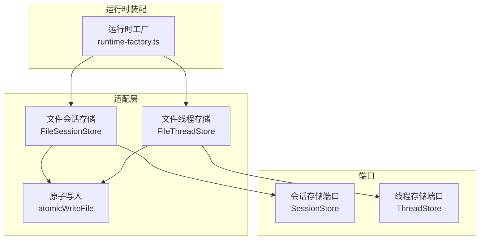
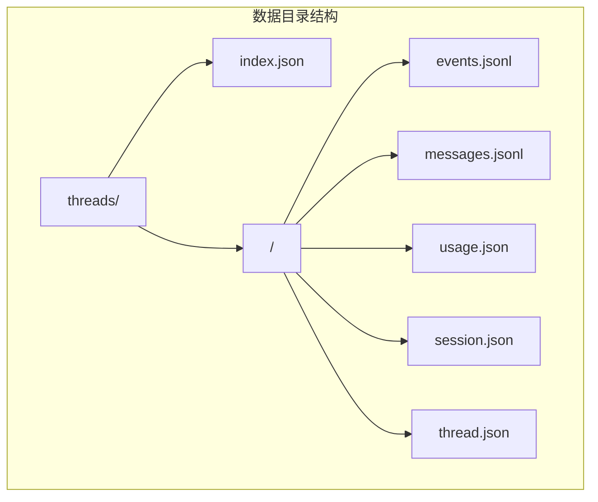
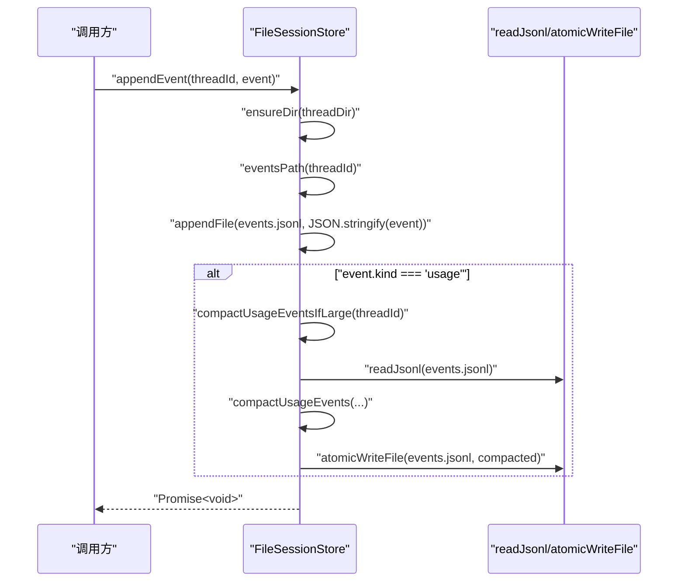
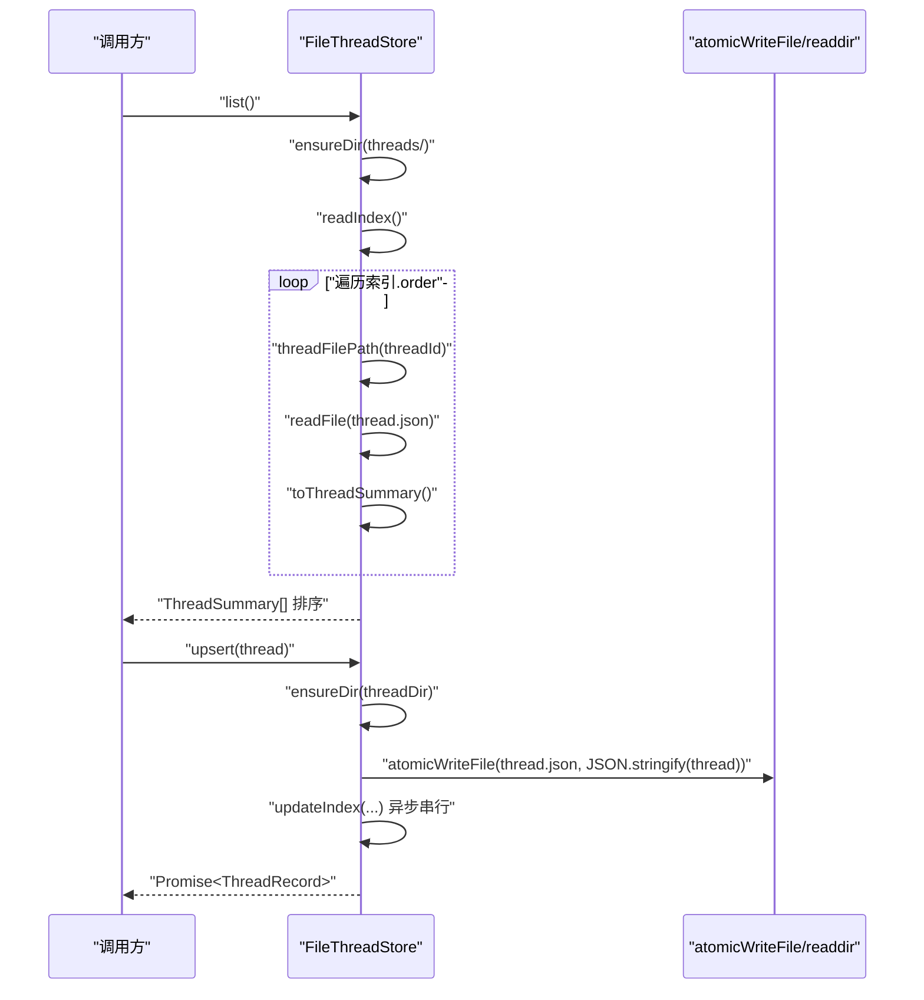
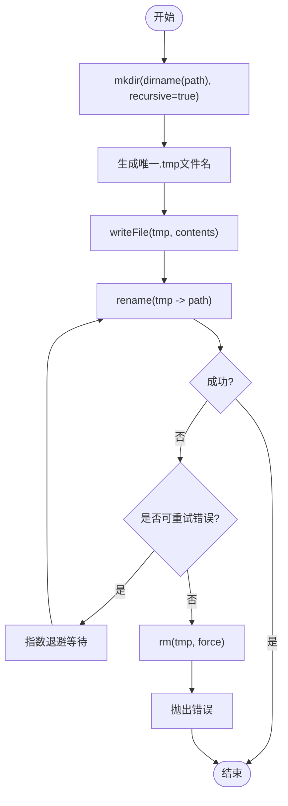

# 文件存储适配器

<cite>
**本文引用的文件**
- [file-session-store.ts](file://kun/src/adapters/file/file-session-store.ts)
- [file-thread-store.ts](file://kun/src/adapters/file/file-thread-store.ts)
- [atomic-write.ts](file://kun/src/adapters/file/atomic-write.ts)
- [index.ts](file://kun/src/adapters/file/index.ts)
- [session-store.ts](file://kun/src/ports/session-store.ts)
- [thread-store.ts](file://kun/src/ports/thread-store.ts)
- [runtime-factory.ts](file://kun/src/server/runtime-factory.ts)
- [file-session-store.test.ts](file://kun/tests/file-session-store.test.ts)
- [atomic-write.test.ts](file://kun/tests/atomic-write.test.ts)
</cite>

## 目录
1. [简介](#简介)
2. [项目结构](#项目结构)
3. [核心组件](#核心组件)
4. [架构总览](#架构总览)
5. [组件详解](#组件详解)
6. [依赖关系分析](#依赖关系分析)
7. [性能与可靠性](#性能与可靠性)
8. [故障排除指南](#故障排除指南)
9. [结论](#结论)
10. [附录：接口规范与配置](#附录接口规范与配置)

## 简介
本文件存储适配器提供基于文件系统的持久化能力，覆盖“会话存储”和“线程存储”两大领域，并通过“原子写入”保障数据一致性与可靠性。其设计遵循以下原则：
- 使用 JSON Lines（JSONL）记录事件与消息，便于顺序追加与回放。
- 使用小体积 JSON 文件保存会话快照或线程元信息，支持快速读取。
- 通过原子写入避免并发写入导致的数据损坏与竞态条件。
- 提供索引文件与目录组织，降低列表与检索成本。

## 项目结构
文件存储适配器位于适配层，面向端口接口提供实现，同时在服务端运行时工厂中被装配使用。

图表来源
- [file-session-store.ts:19-176](file://kun/src/adapters/file/file-session-store.ts#L19-L176)
- [file-thread-store.ts:19-127](file://kun/src/adapters/file/file-thread-store.ts#L19-L127)
- [atomic-write.ts:16-30](file://kun/src/adapters/file/atomic-write.ts#L16-L30)
- [session-store.ts:13-31](file://kun/src/ports/session-store.ts#L13-L31)
- [thread-store.ts:16-21](file://kun/src/ports/thread-store.ts#L16-L21)
- [runtime-factory.ts:383-384](file://kun/src/server/runtime-factory.ts#L383-L384)

章节来源
- [index.ts:1-3](file://kun/src/adapters/file/index.ts#L1-L3)
- [runtime-factory.ts:383-384](file://kun/src/server/runtime-factory.ts#L383-L384)

## 核心组件
- 文件会话存储（FileSessionStore）
  - 负责每个线程的运行时事件日志（JSONL）、消息项历史（JSONL）以及会话快照（JSON）的持久化。
  - 支持事件追加、消息追加、消息重写、单项更新、按序加载事件、去重加载消息、读取会话快照、查询最高序号等。
  - 内置“用量事件压缩”策略，当用量事件文件过大时进行压缩并原子写回。
- 文件线程存储（FileThreadStore）
  - 负责线程记录（JSON）与线程索引（index.json）的持久化。
  - 列表操作通过索引文件实现 O(1) 增量维护，读取时按更新时间排序。
  - 删除线程时递归删除目录并同步更新索引。
- 原子写入（atomicWriteFile）
  - 先写临时文件，再以重命名完成原子替换；对 Windows 常见锁冲突错误进行可重试重命名。
  - 提供可配置的重试次数与基础延迟，保证跨平台稳定性。

章节来源
- [file-session-store.ts:19-176](file://kun/src/adapters/file/file-session-store.ts#L19-L176)
- [file-thread-store.ts:19-127](file://kun/src/adapters/file/file-thread-store.ts#L19-L127)
- [atomic-write.ts:16-61](file://kun/src/adapters/file/atomic-write.ts#L16-L61)

## 架构总览
文件存储适配器采用“目录+文件”的扁平结构，围绕 JSONL 与 JSON 两类文件组织数据，配合原子写入与索引文件提升可靠性与性能。

图表来源
- [file-thread-store.ts:12-18](file://kun/src/adapters/file/file-thread-store.ts#L12-L18)
- [file-session-store.ts:129-143](file://kun/src/adapters/file/file-session-store.ts#L129-L143)

## 组件详解

### 文件会话存储（FileSessionStore）
- 数据模型与文件布局
  - 每个线程一个目录，包含：
    - events.jsonl：运行时事件（如用量、心跳等），按序追加。
    - messages.jsonl：每轮对话项（TurnItem），按序追加。
    - session.json：该线程的会话快照（AgentSession）。
- 关键流程
  - 追加事件/消息：确保目录存在后追加 JSONL 行。
  - 用量事件压缩：当事件文件超过阈值时，压缩同一天/同模型的用量事件，保留最新与边界事件，然后原子写回。
  - 重写消息：将一组消息序列化为 JSONL 并原子写入，用于恢复或丢弃流程。
  - 加载：按序读取 JSONL，事件按 seq 排序；消息按 id 去重并保留最新版本。
  - 会话快照：读取 session.json；不存在则返回空。
  - 最高序号：遍历事件计算最大 seq。
- 错误处理
  - 用量压缩失败时捕获异常并告警，但不中断后续事件追加，保持追加式日志的可用性。

图表来源
- [file-session-store.ts:49-58](file://kun/src/adapters/file/file-session-store.ts#L49-L58)
- [file-session-store.ts:153-165](file://kun/src/adapters/file/file-session-store.ts#L153-L165)
- [file-thread-store.ts:133-151](file://kun/src/adapters/file/file-thread-store.ts#L133-L151)

章节来源
- [file-session-store.ts:19-176](file://kun/src/adapters/file/file-session-store.ts#L19-L176)

### 文件线程存储（FileThreadStore）
- 数据模型与文件布局
  - threads/index.json：线程序列与更新时间索引。
  - threads/<threadId>/thread.json：线程记录（ThreadRecord）。
  - threads/<threadId>/messages.jsonl：消息历史（JSONL）。
  - threads/<threadId>/events.jsonl：事件历史（JSONL）。
  - threads/<threadId>/usage.json：用量统计（JSON）。
- 关键流程
  - 列表：读取索引，逐条读取线程记录并转换为摘要，按 updatedAt 降序。
  - 获取：读取 thread.json。
  - 更新/插入：原子写入 thread.json，并异步串行更新索引（indexQueue 串行化）。
  - 删除：删除线程目录，同步更新索引。
- 错误处理
  - 列表时跳过损坏条目，避免整体失败。
  - 索引更新串行化，防止竞态。

图表来源
- [file-thread-store.ts:29-44](file://kun/src/adapters/file/file-thread-store.ts#L29-L44)
- [file-thread-store.ts:55-65](file://kun/src/adapters/file/file-thread-store.ts#L55-L65)
- [file-thread-store.ts:95-106](file://kun/src/adapters/file/file-thread-store.ts#L95-L106)

章节来源
- [file-thread-store.ts:19-127](file://kun/src/adapters/file/file-thread-store.ts#L19-L127)

### 原子写入（atomicWriteFile）
- 工作原理
  - 在同一文件夹下创建唯一临时文件，写入内容后尝试重命名为目标路径。
  - 对 Windows 常见锁冲突错误码进行可重试重命名，避免瞬时占用导致失败。
  - 失败时清理临时文件，抛出原始错误。
- 配置参数
  - 重试次数与基础延迟可配置，默认值适用于大多数场景。
- 使用场景
  - 所有需要“要么全成、要么全无”的写入操作，如会话快照、线程记录、压缩后的事件文件。

图表来源
- [atomic-write.ts:16-30](file://kun/src/adapters/file/atomic-write.ts#L16-L30)
- [atomic-write.ts:32-51](file://kun/src/adapters/file/atomic-write.ts#L32-L51)
- [atomic-write.ts:53-60](file://kun/src/adapters/file/atomic-write.ts#L53-L60)

章节来源
- [atomic-write.ts:16-61](file://kun/src/adapters/file/atomic-write.ts#L16-L61)

## 依赖关系分析
- FileSessionStore 依赖
  - 读取 JSONL：复用文件线程存储导出的 readJsonl 辅助函数。
  - 原子写入：rewriteItems 与 upsertSession 使用 atomicWriteFile。
  - 目录与路径：eventsPath/messagesPath/sessionPath/threadDir。
- FileThreadStore 依赖
  - 原子写入：thread.json 与 index.json 的写入均使用 atomicWriteFile。
  - 目录与路径：threadDir/threadFilePath/indexPath。
- 端口契约
  - FileSessionStore 实现 SessionStore。
  - FileThreadStore 实现 ThreadStore。
- 运行时装配
  - 在运行时工厂中实例化 FileSessionStore 与 FileThreadStore，并注入 dataDir。

```mermaid
classDiagram
class SessionStore {
+appendEvent(threadId, event)
+appendItem(threadId, item)
+rewriteItems(threadId, items)
+updateItem(threadId, itemId, patch)
+loadEventsSince(threadId, sinceSeq)
+loadItems(threadId)
+loadSession(threadId)
+upsertSession(session)
+highestSeq(threadId)
+resetMemory()
}
class ThreadStore {
+list(options)
+get(threadId)
+upsert(thread)
+delete(threadId)
}
class FileSessionStore {
-dataDir
-usageEventCompaction
+appendEvent()
+appendItem()
+rewriteItems()
+updateItem()
+loadEventsSince()
+loadItems()
+loadSession()
+upsertSession()
+highestSeq()
+resetMemory()
+exists(threadId)
}
class FileThreadStore {
-dataDir
-now
-indexQueue
+list()
+get()
+upsert()
+delete()
}
class atomicWriteFile {
+atomicWriteFile(path, contents, options)
}
FileSessionStore ..|> SessionStore
FileThreadStore ..|> ThreadStore
FileSessionStore --> atomicWriteFile : "使用"
FileThreadStore --> atomicWriteFile : "使用"
```

图表来源
- [session-store.ts:13-31](file://kun/src/ports/session-store.ts#L13-L31)
- [thread-store.ts:16-21](file://kun/src/ports/thread-store.ts#L16-L21)
- [file-session-store.ts:19-176](file://kun/src/adapters/file/file-session-store.ts#L19-L176)
- [file-thread-store.ts:19-127](file://kun/src/adapters/file/file-thread-store.ts#L19-L127)
- [atomic-write.ts:16-30](file://kun/src/adapters/file/atomic-write.ts#L16-L30)

章节来源
- [session-store.ts:13-31](file://kun/src/ports/session-store.ts#L13-L31)
- [thread-store.ts:16-21](file://kun/src/ports/thread-store.ts#L16-L21)
- [runtime-factory.ts:383-384](file://kun/src/server/runtime-factory.ts#L383-L384)

## 性能与可靠性
- 目录与文件组织
  - 将每个线程隔离在独立目录，减少锁竞争与单点压力。
  - 使用 JSONL 顺序写入，避免随机 IO。
- 索引与列表
  - 线程列表通过 index.json 快速获取，避免扫描大量目录。
  - 列表过程跳过损坏条目，提高鲁棒性。
- 原子写入
  - 通过临时文件+重命名实现原子替换，避免部分写入。
  - Windows 上对 EPERM/EACCES/EBUSY 等错误进行可重试，提升稳定性。
- 用量事件压缩
  - 当事件文件超过阈值时进行压缩，减少磁盘占用与读放大。
  - 压缩失败不影响事件追加，维持追加式日志可用性。

章节来源
- [file-thread-store.ts:29-44](file://kun/src/adapters/file/file-thread-store.ts#L29-L44)
- [file-session-store.ts:153-165](file://kun/src/adapters/file/file-session-store.ts#L153-L165)
- [atomic-write.ts:16-61](file://kun/src/adapters/file/atomic-write.ts#L16-L61)

## 故障排除指南
- 写入失败或文件损坏
  - 确认 dataDir 可写且磁盘空间充足。
  - 观察是否存在进程持有文件句柄导致重命名失败；必要时重启相关进程。
  - 若启用用量事件压缩，关注压缩失败告警并检查磁盘权限。
- 列表为空或部分缺失
  - 检查 threads/index.json 是否存在且可读；若损坏可重建。
  - 确认线程记录文件是否损坏；损坏条目会被跳过。
- Windows 下重命名频繁失败
  - 调整重试参数（重试次数与基础延迟），或关闭杀毒软件的实时扫描。
- 测试验证
  - 使用测试用例验证原子写入的可重试行为与用量压缩失败时的容错逻辑。

章节来源
- [file-thread-store.ts:82-93](file://kun/src/adapters/file/file-thread-store.ts#L82-L93)
- [file-session-store.ts:245-248](file://kun/src/adapters/file/file-session-store.ts#L245-L248)
- [atomic-write.test.ts:31-60](file://kun/tests/atomic-write.test.ts#L31-L60)
- [file-session-store.test.ts:31-82](file://kun/tests/file-session-store.test.ts#L31-L82)

## 结论
文件存储适配器通过清晰的目录结构、JSONL 顺序写入、原子写入与索引机制，在保证数据一致性的同时兼顾了性能与可维护性。对于需要稳定落盘与可回放的场景，该适配器提供了可靠的实现方案。

## 附录：接口规范与配置

### 接口规范
- 会话存储（SessionStore）
  - 方法：appendEvent、appendItem、rewriteItems、updateItem、loadEventsSince、loadItems、loadSession、upsertSession、highestSeq、resetMemory。
  - 语义：事件与消息以 JSONL 追加；会话快照为小体积 JSON；rewriteItems 需要原子写入。
- 线程存储（ThreadStore）
  - 方法：list、get、upsert、delete。
  - 语义：线程记录为 JSON；列表通过 index.json 快速实现；删除递归清理目录。

章节来源
- [session-store.ts:13-31](file://kun/src/ports/session-store.ts#L13-L31)
- [thread-store.ts:16-21](file://kun/src/ports/thread-store.ts#L16-L21)

### 配置与使用
- 运行时装配
  - 在运行时工厂中通过 dataDir 指定数据根目录，分别创建 FileSessionStore 与 FileThreadStore 实例。
- 文件会话存储配置
  - dataDir：数据根目录。
  - usageEventCompaction：用量事件压缩阈值与保留天数，以及当前时间回调。
- 原子写入配置
  - renameRetry：重试次数与基础延迟（毫秒）。

章节来源
- [runtime-factory.ts:383-384](file://kun/src/server/runtime-factory.ts#L383-L384)
- [file-session-store.ts:27-47](file://kun/src/adapters/file/file-session-store.ts#L27-L47)
- [atomic-write.ts:5-10](file://kun/src/adapters/file/atomic-write.ts#L5-L10)